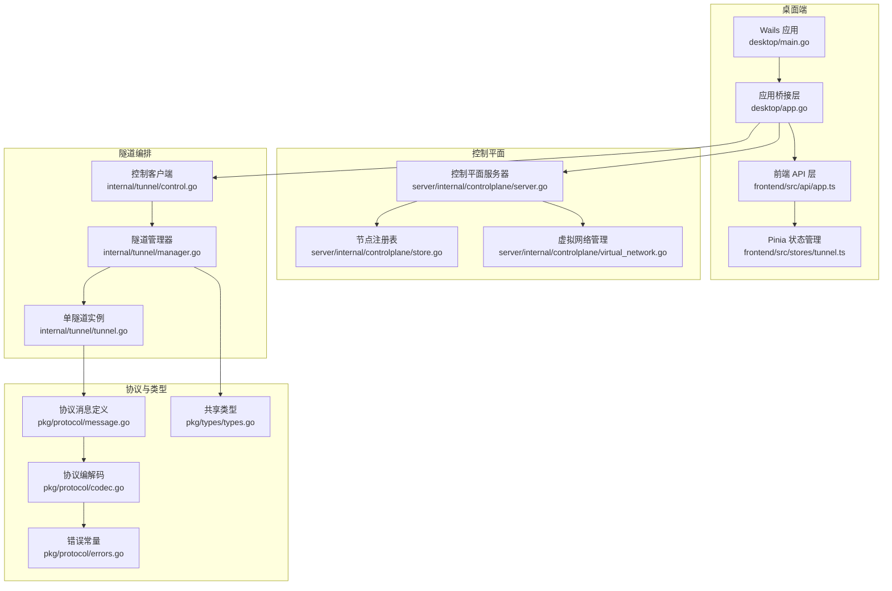
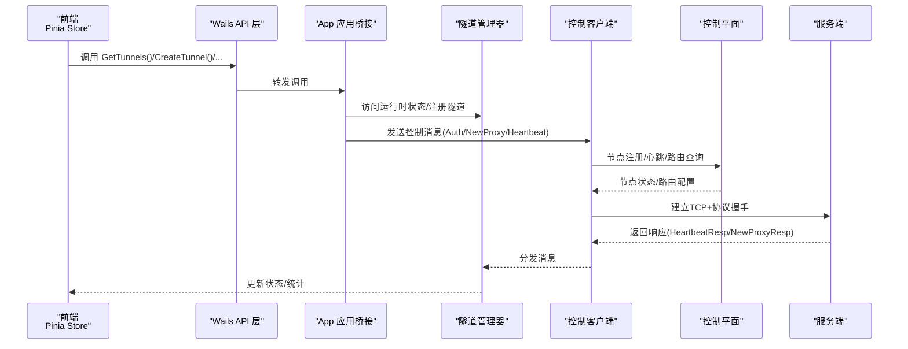
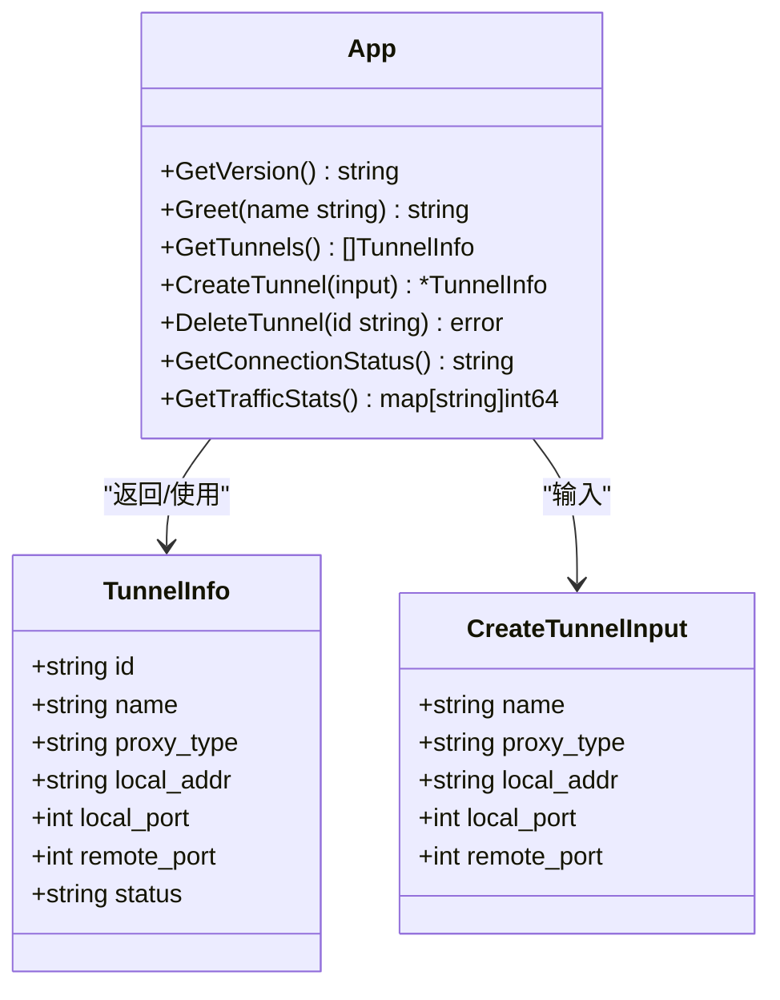
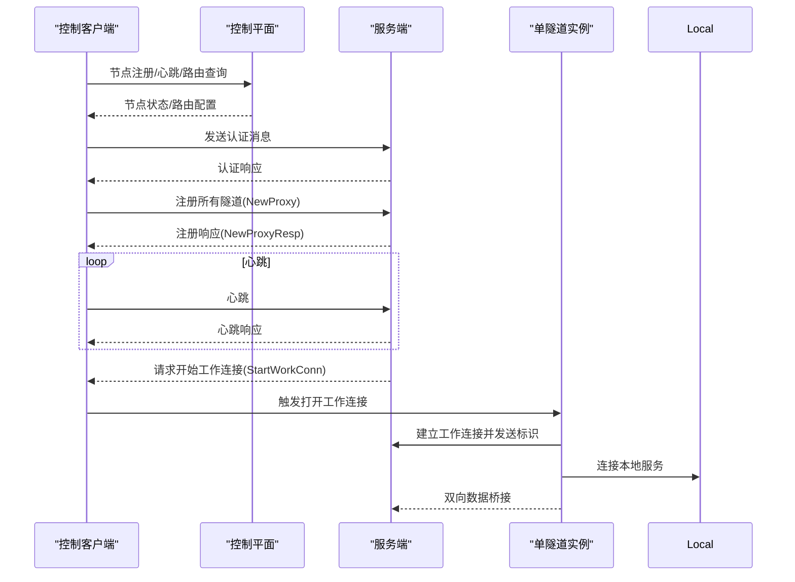
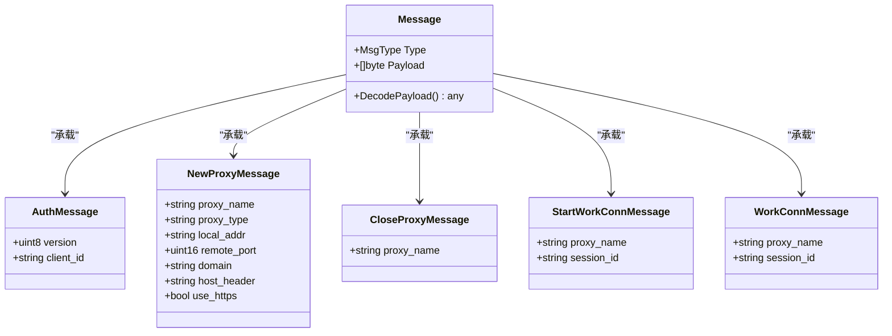
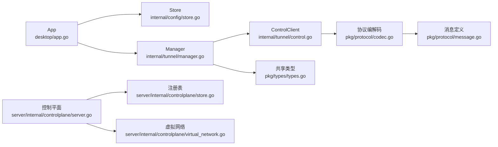

# API接口参考

<cite>
**本文引用的文件**
- [desktop/app.go](file://desktop/app.go)
- [desktop/main.go](file://desktop/main.go)
- [desktop/frontend/src/api/app.ts](file://desktop/frontend/src/api/app.ts)
- [desktop/frontend/src/stores/tunnel.ts](file://desktop/frontend/src/stores/tunnel.ts)
- [pkg/protocol/message.go](file://pkg/protocol/message.go)
- [pkg/protocol/codec.go](file://pkg/protocol/codec.go)
- [pkg/protocol/errors.go](file://pkg/protocol/errors.go)
- [pkg/types/types.go](file://pkg/types/types.go)
- [desktop/internal/tunnel/manager.go](file://desktop/internal/tunnel/manager.go)
- [desktop/internal/tunnel/control.go](file://desktop/internal/tunnel/control.go)
- [desktop/internal/tunnel/tunnel.go](file://desktop/internal/tunnel/tunnel.go)
- [desktop/internal/config/store.go](file://desktop/internal/config/store.go)
- [server/internal/controlplane/server.go](file://server/internal/controlplane/server.go)
- [server/internal/controlplane/store.go](file://server/internal/controlplane/store.go)
- [server/internal/controlplane/virtual_network.go](file://server/internal/controlplane/virtual_network.go)
- [server/web/src/api.ts](file://server/web/src/api.ts)
- [README.md](file://README.md)
</cite>

## 更新摘要
**所做更改**
- 新增控制平面API接口章节，涵盖节点管理、路由配置和虚拟网络功能
- 添加DELETE /api/v1/nodes/{id}节点删除端点的详细说明
- 添加GET /api/v1/nodes/{id}/routes路由配置端点的完整文档
- 更新架构总览图，包含控制平面组件
- 新增控制平面数据模型和API响应格式说明
- 扩展故障排查指南，包含控制平面相关问题

## 目录
1. [简介](#简介)
2. [项目结构](#项目结构)
3. [核心组件](#核心组件)
4. [架构总览](#架构总览)
5. [详细组件分析](#详细组件分析)
6. [控制平面API接口](#控制平面api接口)
7. [依赖关系分析](#依赖关系分析)
8. [性能与可靠性](#性能与可靠性)
9. [故障排查指南](#故障排查指南)
10. [结论](#结论)
11. [附录](#附录)

## 简介
本文件为 NexTunnel 的 API 接口参考，覆盖以下方面：
- Wails 绑定方法：桌面端应用暴露给前端调用的方法、参数与返回值规范
- WebSocket API：控制通道的连接、认证、心跳与工作连接建立流程
- 协议 API：消息类型枚举、负载结构定义、序列化规则与错误码
- 控制平面API：节点管理、路由配置、虚拟网络和访问控制
- 常见用例与客户端实现建议：如何在前端通过 Pinia 状态管理调用后端能力
- 安全、速率限制与版本信息：协议版本、最大载荷、错误处理策略
- 调试与监控：日志、状态查询与统计指标
- 兼容性与迁移：当前版本与未来扩展的兼容性说明

## 项目结构
NexTunnel 采用"桌面端 + 服务端 + 协议库"的分层设计：
- desktop：Wails 应用，负责 UI、配置持久化与隧道编排
- server：服务端组件（控制平面、中继、NAT 检测等）
- pkg：跨组件共享的协议与类型定义

**图表来源**
- [desktop/main.go:15-36](file://desktop/main.go#L15-L36)
- [desktop/app.go:18-76](file://desktop/app.go#L18-L76)
- [desktop/frontend/src/api/app.ts:22-48](file://desktop/frontend/src/api/app.ts#L22-L48)
- [desktop/frontend/src/stores/tunnel.ts:23-82](file://desktop/frontend/src/stores/tunnel.ts#L23-L82)
- [server/internal/controlplane/server.go:138-165](file://server/internal/controlplane/server.go#L138-L165)
- [server/internal/controlplane/store.go:34-44](file://server/internal/controlplane/store.go#L34-L44)
- [server/internal/controlplane/virtual_network.go:18-26](file://server/internal/controlplane/virtual_network.go#L18-L26)
- [desktop/internal/tunnel/control.go:30-95](file://desktop/internal/tunnel/control.go#L30-L95)
- [desktop/internal/tunnel/manager.go:29-112](file://desktop/internal/tunnel/manager.go#L29-L112)
- [desktop/internal/tunnel/tunnel.go:27-85](file://desktop/internal/tunnel/tunnel.go#L27-L85)
- [pkg/protocol/message.go:6-22](file://pkg/protocol/message.go#L6-L22)
- [pkg/protocol/codec.go:16-63](file://pkg/protocol/codec.go#L16-L63)
- [pkg/protocol/errors.go:5-14](file://pkg/protocol/errors.go#L5-L14)
- [pkg/types/types.go:6-49](file://pkg/types/types.go#L6-L49)

**章节来源**
- [README.md:1-20](file://README.md#L1-L20)
- [desktop/main.go:15-36](file://desktop/main.go#L15-L36)

## 核心组件
本节概述桌面端暴露的 Wails 绑定方法与前端调用方式。

- 版本与问候
  - GetVersion：返回字符串版本号
  - Greet：接收名称参数，返回问候语
- 隧道管理
  - GetTunnels：返回隧道列表（含运行时状态）
  - CreateTunnel：创建新隧道配置
  - DeleteTunnel：删除指定隧道配置
- 连接与统计
  - GetConnectionStatus：返回连接状态字符串
  - GetTrafficStats：返回聚合流量统计

**章节来源**
- [desktop/app.go:89-203](file://desktop/app.go#L89-L203)
- [desktop/frontend/src/api/app.ts:26-48](file://desktop/frontend/src/api/app.ts#L26-L48)
- [desktop/frontend/src/stores/tunnel.ts:34-70](file://desktop/frontend/src/stores/tunnel.ts#L34-L70)

## 架构总览
下图展示桌面端到控制通道与工作连接的端到端流程，包括新增的控制平面组件。

**图表来源**
- [desktop/frontend/src/stores/tunnel.ts:34-70](file://desktop/frontend/src/stores/tunnel.ts#L34-L70)
- [desktop/app.go:110-203](file://desktop/app.go#L110-L203)
- [desktop/internal/tunnel/manager.go:67-112](file://desktop/internal/tunnel/manager.go#L67-L112)
- [desktop/internal/tunnel/control.go:40-95](file://desktop/internal/tunnel/control.go#L40-L95)
- [server/internal/controlplane/server.go:138-165](file://server/internal/controlplane/server.go#L138-L165)

## 详细组件分析

### Wails 绑定方法与前端调用
- 方法清单与职责
  - GetVersion：返回应用版本
  - Greet：返回问候语
  - GetTunnels：读取配置并合并运行时状态
  - CreateTunnel：写入配置并返回新配置对象
  - DeleteTunnel：删除配置并从运行时移除
  - GetConnectionStatus：返回连接状态
  - GetTrafficStats：返回聚合统计
- 参数与返回值
  - 输入输出均为 JSON 可序列化结构体，前端通过 window.go.main.App.method(...) 调用
- 前端集成
  - 使用 Pinia Store 封装异步调用，集中处理错误与刷新状态

**图表来源**
- [desktop/app.go:89-203](file://desktop/app.go#L89-L203)

**章节来源**
- [desktop/app.go:89-203](file://desktop/app.go#L89-L203)
- [desktop/frontend/src/api/app.ts:22-48](file://desktop/frontend/src/api/app.ts#L22-L48)
- [desktop/frontend/src/stores/tunnel.ts:23-82](file://desktop/frontend/src/stores/tunnel.ts#L23-L82)

### 控制通道与工作连接（WebSocket/长连接）
- 连接建立
  - 控制客户端通过 TCP 连接到服务端，发送认证消息，等待认证响应
- 心跳机制
  - 管理器周期性发送心跳，服务端应答心跳响应
- 工作连接
  - 服务端下发开始工作连接指令，客户端据此建立到本地服务的桥接连接，并转发双向数据
- 错误处理
  - 连接关闭、读写失败、认证失败均会触发断开与重连

**图表来源**
- [desktop/internal/tunnel/control.go:40-95](file://desktop/internal/tunnel/control.go#L40-L95)
- [desktop/internal/tunnel/manager.go:114-156](file://desktop/internal/tunnel/manager.go#L114-L156)
- [desktop/internal/tunnel/tunnel.go:47-85](file://desktop/internal/tunnel/tunnel.go#L47-L85)

**章节来源**
- [desktop/internal/tunnel/control.go:40-95](file://desktop/internal/tunnel/control.go#L40-L95)
- [desktop/internal/tunnel/manager.go:158-197](file://desktop/internal/tunnel/manager.go#L158-L197)
- [desktop/internal/tunnel/tunnel.go:47-85](file://desktop/internal/tunnel/tunnel.go#L47-L85)

### 协议 API：消息类型、负载与序列化
- 消息类型枚举
  - 认证类：TypeAuth、TypeAuthResp
  - 隧道类：TypeNewProxy、TypeNewProxyResp、TypeCloseProxy
  - 连接类：TypeStartWorkConn、TypeWorkConn
  - 心跳类：TypeHeartbeat、TypeHeartbeatResp
- 协议版本
  - 当前版本为 1
- 负载结构
  - 认证：包含版本与客户端 ID
  - 新建隧道：包含代理名、类型、本地地址、远端端口；HTTP 类型包含域名、Host 头、是否 HTTPS
  - 关闭隧道：包含代理名
  - 开始工作连接：包含代理名与会话 ID
  - 工作连接：包含代理名与会话 ID
  - 心跳/心跳响应：空载荷
- 编解码规则
  - 消息头：1 字节类型 + 4 字节长度
  - 载荷：JSON 序列化
  - 最大载荷：16 MB
- 错误
  - 载荷过大、未知消息类型、连接已关闭

**图表来源**
- [pkg/protocol/message.go:24-202](file://pkg/protocol/message.go#L24-L202)
- [pkg/protocol/codec.go:16-63](file://pkg/protocol/codec.go#L16-L63)
- [pkg/protocol/errors.go:5-14](file://pkg/protocol/errors.go#L5-L14)

**章节来源**
- [pkg/protocol/message.go:6-22](file://pkg/protocol/message.go#L6-L22)
- [pkg/protocol/message.go:32-79](file://pkg/protocol/message.go#L32-L79)
- [pkg/protocol/codec.go:10-15](file://pkg/protocol/codec.go#L10-L15)
- [pkg/protocol/errors.go:5-14](file://pkg/protocol/errors.go#L5-L14)

### 数据模型与状态
- 代理类型与状态
  - 代理类型：tcp、http、udp（预留）
  - 代理状态：active、inactive、error
- 隧道配置与运行时信息
  - 配置：名称、类型、本地地址、远端端口、服务器地址、状态
  - 运行时：代理名、类型、本地地址、远端端口、状态、入出字节统计

**章节来源**
- [pkg/types/types.go:6-49](file://pkg/types/types.go#L6-L49)
- [desktop/internal/tunnel/tunnel.go:127-137](file://desktop/internal/tunnel/tunnel.go#L127-L137)

### 配置持久化与设置
- 支持对隧道配置进行增删改查
- 支持应用级设置（如客户端 ID）的读写

**章节来源**
- [desktop/internal/config/store.go:33-139](file://desktop/internal/config/store.go#L33-L139)

## 控制平面API接口

### API端点概览
控制平面提供完整的节点管理和虚拟网络配置接口：

- 节点管理
  - GET /api/v1/nodes：获取节点列表
  - GET /api/v1/nodes/{id}：获取指定节点信息
  - POST /api/v1/nodes：注册新节点
  - POST /api/v1/nodes/{id}/heartbeat：节点心跳
  - DELETE /api/v1/nodes/{id}：删除节点
- 路由配置
  - GET /api/v1/nodes/{id}/routes：获取节点路由配置
- 访问控制
  - GET /api/v1/acl：获取ACL规则列表
  - POST /api/v1/acl：创建ACL规则
  - DELETE /api/v1/acl/{id}：删除ACL规则
- 密钥管理
  - POST /api/v1/keys：注册公钥
  - GET /api/v1/keys/{id}：获取公钥
- IPAM管理
  - GET /api/v1/ipam/allocations：获取IP分配列表
- 审计日志
  - GET /api/v1/audit：查询审计日志

### 节点管理API

#### 获取节点列表
- 方法：GET /api/v1/nodes
- 认证：需要API令牌或mTLS
- 响应：节点信息数组
- 状态码：200 成功，401 未授权，500 服务器错误

#### 获取指定节点信息
- 方法：GET /api/v1/nodes/{id}
- 认证：需要API令牌或mTLS
- 参数：id（路径参数）
- 响应：节点信息对象
- 状态码：200 成功，404 未找到，500 服务器错误

#### 注册新节点
- 方法：POST /api/v1/nodes
- 认证：需要API令牌或mTLS
- 请求体：NodeInfo对象
- 响应：注册的节点信息
- 状态码：201 创建成功，400 请求无效，500 服务器错误

#### 节点心跳
- 方法：POST /api/v1/nodes/{id}/heartbeat
- 认证：需要API令牌或mTLS
- 参数：id（路径参数）
- 响应：心跳状态对象
- 状态码：200 成功，404 未找到，500 服务器错误

#### 删除节点
- 方法：DELETE /api/v1/nodes/{id}
- 认证：需要API令牌或mTLS
- 参数：id（路径参数）
- 响应：删除成功确认
- 状态码：200 成功，500 服务器错误

### 路由配置API

#### 获取节点路由配置
- 方法：GET /api/v1/nodes/{id}/routes
- 认证：需要API令牌或mTLS
- 参数：id（路径参数）
- 响应：VirtualNetworkConfig对象
- 状态码：200 成功，404 未找到，503 虚拟网络不可用，500 服务器错误

### 数据模型定义

#### NodeInfo（节点信息）
- node_id：节点唯一标识符
- public_key：节点公钥
- nat_type：NAT类型
- region：地理位置区域
- subnet：节点所在子网
- virtual_ip：虚拟IP地址（可选）
- metadata：元数据映射
- connected_at：连接时间
- last_seen：最后在线时间

#### VirtualNetworkConfig（虚拟网络配置）
- node_id：节点ID
- virtual_ip：虚拟IP地址
- subnet：虚拟网络子网
- gateway：网关地址
- interface：网络接口名称
- mtu：最大传输单元
- routes：路由规则数组

#### VirtualNetworkRoute（虚拟网络路由）
- destination：目标网络
- gateway：下一跳网关
- interface：出站接口
- metric：路由度量值

### 访问控制与安全

#### 认证机制
- API令牌：Bearer Token认证
- mTLS：双向TLS认证（推荐）
- 健康检查：/healthz无需认证

#### 权限控制
- 节点管理：需要相应权限的角色
- 路由配置：仅管理员可访问
- 审计日志：受限访问

**章节来源**
- [server/internal/controlplane/server.go:138-165](file://server/internal/controlplane/server.go#L138-L165)
- [server/internal/controlplane/server.go:197-273](file://server/internal/controlplane/server.go#L197-L273)
- [server/internal/controlplane/store.go:34-44](file://server/internal/controlplane/store.go#L34-L44)
- [server/internal/controlplane/virtual_network.go:18-26](file://server/internal/controlplane/virtual_network.go#L18-L26)

## 依赖关系分析
- 组件耦合
  - App 依赖 Store 与 Manager；Manager 依赖 ControlClient；ControlClient 依赖协议编解码
  - 控制平面 Server 依赖注册表和虚拟网络管理器
- 外部依赖
  - 日志、并发同步、网络 I/O、JSON 序列化
- 潜在循环
  - 未发现直接循环依赖；协议与类型位于独立包，被其他模块引用

**图表来源**
- [desktop/app.go:10-24](file://desktop/app.go#L10-L24)
- [desktop/internal/tunnel/manager.go:17-27](file://desktop/internal/tunnel/manager.go#L17-L27)
- [desktop/internal/tunnel/control.go:16-28](file://desktop/internal/tunnel/control.go#L16-L28)
- [pkg/protocol/codec.go:1-15](file://pkg/protocol/codec.go#L1-L15)
- [pkg/protocol/message.go:1-15](file://pkg/protocol/message.go#L1-L15)
- [pkg/types/types.go:1-15](file://pkg/types/types.go#L1-L15)
- [server/internal/controlplane/server.go:138-165](file://server/internal/controlplane/server.go#L138-L165)
- [server/internal/controlplane/store.go:34-44](file://server/internal/controlplane/store.go#L34-L44)
- [server/internal/controlplane/virtual_network.go:18-26](file://server/internal/controlplane/virtual_network.go#L18-L26)

**章节来源**
- [desktop/app.go:10-24](file://desktop/app.go#L10-L24)
- [desktop/internal/tunnel/manager.go:17-27](file://desktop/internal/tunnel/manager.go#L17-L27)
- [desktop/internal/tunnel/control.go:16-28](file://desktop/internal/tunnel/control.go#L16-L28)
- [pkg/protocol/codec.go:1-15](file://pkg/protocol/codec.go#L1-L15)
- [pkg/protocol/message.go:1-15](file://pkg/protocol/message.go#L1-L15)
- [pkg/types/types.go:1-15](file://pkg/types/types.go#L1-L15)
- [server/internal/controlplane/server.go:138-165](file://server/internal/controlplane/server.go#L138-L165)

## 性能与可靠性
- 心跳与断线重连
  - 管理器内置指数回退与抖动，避免雪崩式重连
- 并发与锁
  - 管理器内部使用读写锁保护隧道集合；控制客户端写操作加互斥锁
- 数据桥接
  - 工作连接使用双向 io.Copy，原子计数统计字节
- 资源释放
  - 显式关闭连接与取消上下文，确保优雅停机
- 控制平面优化
  - 节点注册表使用内存存储，支持快速查找
  - 虚拟网络配置缓存，减少重复计算

**章节来源**
- [desktop/internal/tunnel/manager.go:34-42](file://desktop/internal/tunnel/manager.go#L34-L42)
- [desktop/internal/tunnel/manager.go:220-233](file://desktop/internal/tunnel/manager.go#L220-L233)
- [desktop/internal/tunnel/tunnel.go:88-124](file://desktop/internal/tunnel/tunnel.go#L88-L124)
- [pkg/protocol/codec.go:65-131](file://pkg/protocol/codec.go#L65-L131)

## 故障排查指南
- 常见错误与定位
  - 认证失败：检查客户端 ID 与服务端策略
  - 注册失败：确认代理类型、本地地址与端口可用
  - 心跳异常：检查网络连通性与防火墙
  - 连接关闭：查看控制通道读取错误日志
  - 节点删除失败：检查节点是否存在和虚拟网络状态
  - 路由配置错误：验证虚拟网络是否启用和节点状态
- 日志与状态
  - 使用前端状态管理定期刷新连接状态与流量统计
  - 控制平面提供详细的审计日志和错误信息
- 调试建议
  - 启用更详细的日志级别
  - 使用最小化配置复现问题
  - 对比不同版本行为
  - 检查API响应状态码和错误消息

**章节来源**
- [desktop/internal/tunnel/control.go:97-122](file://desktop/internal/tunnel/control.go#L97-L122)
- [desktop/frontend/src/stores/tunnel.ts:63-70](file://desktop/frontend/src/stores/tunnel.ts#L63-L70)
- [pkg/protocol/errors.go:5-14](file://pkg/protocol/errors.go#L5-L14)
- [server/internal/controlplane/server.go:246-273](file://server/internal/controlplane/server.go#L246-L273)

## 结论
本文档系统性梳理了 NexTunnel 的桌面端 API 与协议层，明确了 Wails 绑定方法、控制通道交互、消息类型与序列化规则，并提供了前端集成范式、性能与可靠性建议以及故障排查路径。新增的控制平面API接口进一步完善了节点管理和虚拟网络配置能力，为大规模部署和自动化运维提供了基础支撑。后续版本可在此基础上扩展 UDP 代理与更丰富的安全策略。

## 附录

### A. Wails 绑定方法一览（摘要）
- GetVersion：返回版本字符串
- Greet：接收名称，返回问候
- GetTunnels：返回隧道列表（含状态）
- CreateTunnel：创建隧道配置并返回
- DeleteTunnel：按 ID 删除
- GetConnectionStatus：返回连接状态
- GetTrafficStats：返回 bytes_in、bytes_out、tunnels

**章节来源**
- [desktop/app.go:89-203](file://desktop/app.go#L89-L203)
- [desktop/frontend/src/api/app.ts:26-48](file://desktop/frontend/src/api/app.ts#L26-L48)

### B. 协议消息类型与负载（摘要）
- 认证：TypeAuth/AuthMessage
- 注册：TypeNewProxy/NewProxyMessage
- 关闭：TypeCloseProxy/CloseProxyMessage
- 工作连接：TypeStartWorkConn/StartWorkConnMessage、TypeWorkConn/WorkConnMessage
- 心跳：TypeHeartbeat/TypeHeartbeatResp
- 版本：ProtocolVersion=1
- 最大载荷：16 MB
- 错误：ErrPayloadTooLarge、ErrUnknownMsgType、ErrConnClosed

**章节来源**
- [pkg/protocol/message.go:6-22](file://pkg/protocol/message.go#L6-L22)
- [pkg/protocol/message.go:32-79](file://pkg/protocol/message.go#L32-L79)
- [pkg/protocol/codec.go:10-15](file://pkg/protocol/codec.go#L10-L15)
- [pkg/protocol/errors.go:5-14](file://pkg/protocol/errors.go#L5-L14)

### C. 前端调用流程（摘要）
- 通过 API 层封装 window.go.main.App.method(...)
- 在 Pinia Store 中统一发起请求、处理错误与刷新状态

**章节来源**
- [desktop/frontend/src/api/app.ts:22-48](file://desktop/frontend/src/api/app.ts#L22-L48)
- [desktop/frontend/src/stores/tunnel.ts:34-70](file://desktop/frontend/src/stores/tunnel.ts#L34-L70)

### D. 控制平面API端点详解（摘要）
- 节点管理：GET/POST/DELETE /api/v1/nodes/{id}，支持心跳和删除
- 路由配置：GET /api/v1/nodes/{id}/routes，返回虚拟网络配置
- 访问控制：GET/POST/DELETE /api/v1/acl，管理ACL规则
- 密钥管理：POST/GET /api/v1/keys，支持公钥注册和查询
- IPAM管理：GET /api/v1/ipam/allocations，查看IP分配状态
- 审计日志：GET /api/v1/audit，查询操作记录

**章节来源**
- [server/internal/controlplane/server.go:138-165](file://server/internal/controlplane/server.go#L138-L165)
- [server/internal/controlplane/server.go:197-273](file://server/internal/controlplane/server.go#L197-L273)