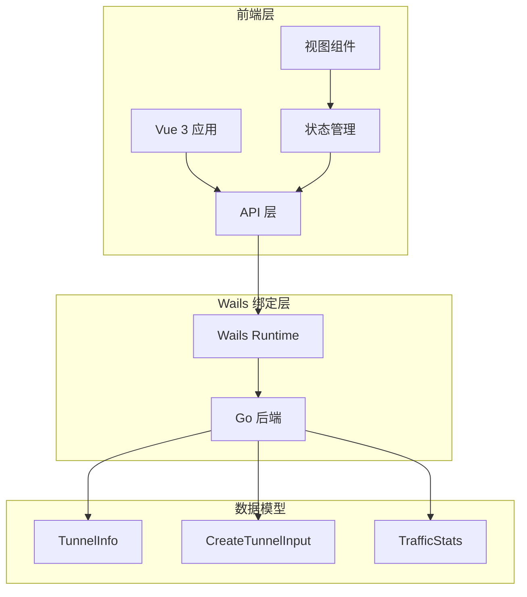
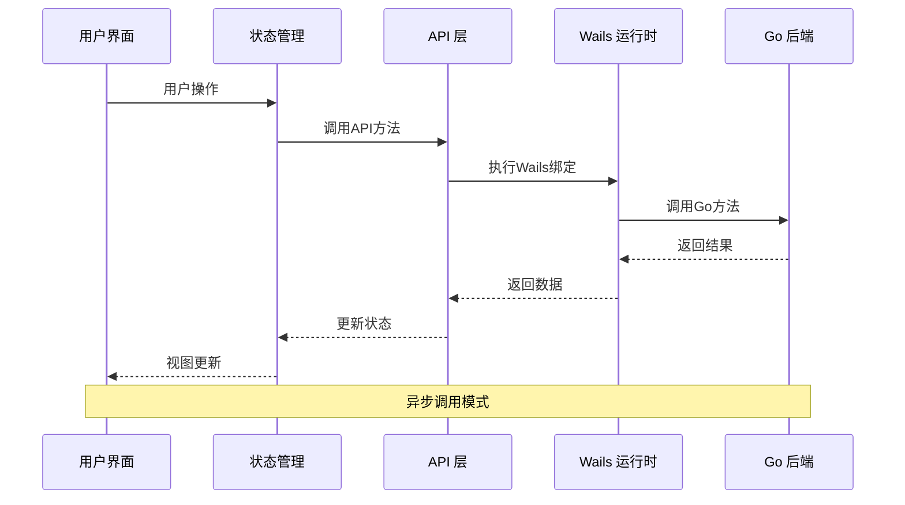
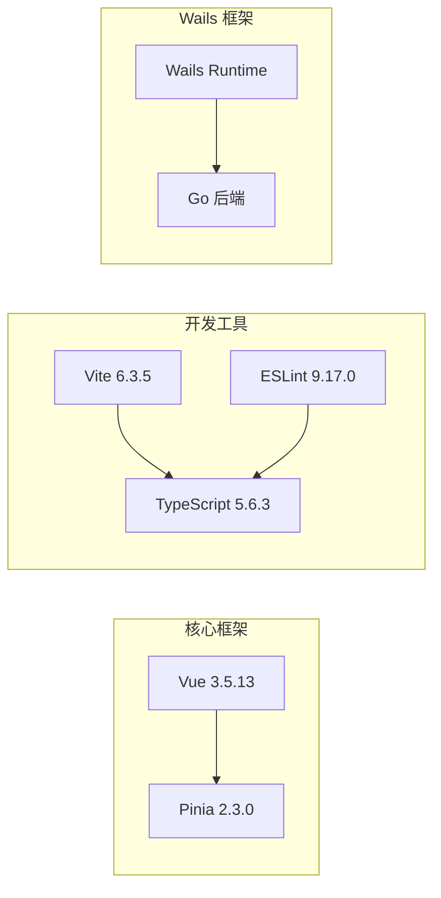
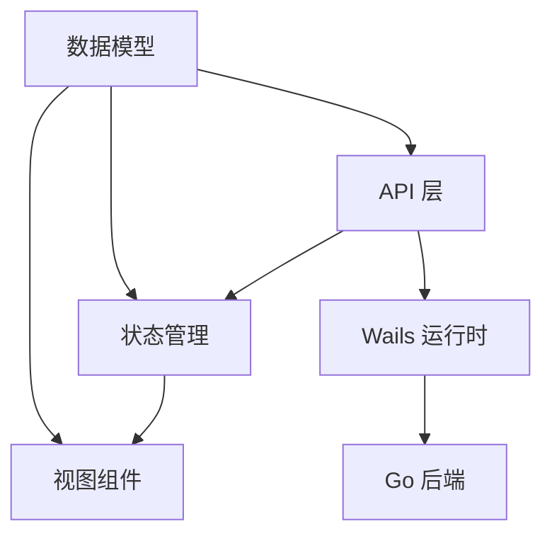

# 前端API接口

<cite>
**本文档引用的文件**
- [app.ts](file://desktop/frontend/src/api/app.ts)
- [tunnel.ts](file://desktop/frontend/src/stores/tunnel.ts)
- [models.ts](file://desktop/frontend/wailsjs/go/models.ts)
- [app.go](file://desktop/app.go)
- [StatusView.vue](file://desktop/frontend/src/views/StatusView.vue)
- [main.ts](file://desktop/frontend/src/main.ts)
- [package.json](file://desktop/frontend/package.json)
- [wails.json](file://desktop/wails.json)
- [tsconfig.json](file://desktop/frontend/tsconfig.json)
</cite>

## 目录
1. [简介](#简介)
2. [项目结构](#项目结构)
3. [核心组件](#核心组件)
4. [架构概览](#架构概览)
5. [详细组件分析](#详细组件分析)
6. [依赖分析](#依赖分析)
7. [性能考虑](#性能考虑)
8. [故障排除指南](#故障排除指南)
9. [结论](#结论)

## 简介

NexTunnel前端API接口是基于Wails框架构建的桌面应用程序，提供了与后端Go服务进行通信的完整接口层。该系统通过Wails的双向绑定机制，实现了TypeScript前端与Go后端之间的无缝通信，支持隧道管理、连接状态监控和流量统计等功能。

## 项目结构

NexTunnel前端采用现代化的Vue 3 + TypeScript架构，结合Wails框架实现跨平台桌面应用开发。项目结构清晰地分离了前端逻辑、状态管理和Wails绑定层。

**图表来源**
- [main.ts:1-8](file://desktop/frontend/src/main.ts#L1-L8)
- [app.ts:1-49](file://desktop/frontend/src/api/app.ts#L1-L49)
- [tunnel.ts:1-83](file://desktop/frontend/src/stores/tunnel.ts#L1-L83)

**章节来源**
- [main.ts:1-8](file://desktop/frontend/src/main.ts#L1-L8)
- [package.json:1-26](file://desktop/frontend/package.json#L1-L26)
- [tsconfig.json:1-23](file://desktop/frontend/tsconfig.json#L1-L23)

## 核心组件

### API 层设计

API层作为前端与Wails运行时之间的桥梁，提供了类型安全的接口定义和统一的错误处理机制。

#### 主要接口定义

**TunnelInfo 数据结构**
- `id`: 字符串，唯一标识符
- `name`: 字符串，隧道名称
- `proxy_type`: 字符串，代理类型（tcp/http）
- `local_addr`: 字符串，本地地址
- `local_port`: 数字，本地端口
- `remote_port`: 数字，远程端口
- `status`: 字符串，当前状态

**CreateTunnelInput 数据结构**
- `name`: 字符串，隧道名称
- `proxy_type`: 字符串，代理类型
- `local_addr`: 字符串，本地地址
- `local_port`: 数字，本地端口
- `remote_port`: 数字，远程端口

**章节来源**
- [app.ts:3-19](file://desktop/frontend/src/api/app.ts#L3-L19)
- [models.ts:23-46](file://desktop/frontend/wailsjs/go/models.ts#L23-L46)

### Wails 绑定方法

系统提供了6个核心Wails绑定方法，每个方法都经过精心设计以确保类型安全和错误处理。

**章节来源**
- [app.ts:26-48](file://desktop/frontend/src/api/app.ts#L26-L48)

## 架构概览

NexTunnel采用分层架构设计，确保了良好的可维护性和扩展性。

**图表来源**
- [app.ts:22-24](file://desktop/frontend/src/api/app.ts#L22-L24)
- [tunnel.ts:34-70](file://desktop/frontend/src/stores/tunnel.ts#L34-L70)

**章节来源**
- [app.go:87-203](file://desktop/app.go#L87-L203)
- [StatusView.vue:112-120](file://desktop/frontend/src/views/StatusView.vue#L112-L120)

## 详细组件分析

### API 层实现

API层通过统一的call函数实现所有Wails绑定方法，提供了类型安全的接口和错误处理机制。

#### 方法实现模式

所有API方法都遵循相同的实现模式：
1. 定义TypeScript接口
2. 实现call函数进行Wails绑定
3. 返回Promise类型的结果
4. 保持与Go后端的类型一致性

**章节来源**
- [app.ts:21-48](file://desktop/frontend/src/api/app.ts#L21-L48)

### 状态管理集成

Pinia状态管理器与API层深度集成，提供了响应式的状态更新和错误处理。

#### 状态管理功能

**核心状态属性**
- `tunnels`: 隧道列表数组
- `connectionStatus`: 连接状态字符串
- `trafficStats`: 流量统计对象

**计算属性**
- `tunnelCount`: 隧道数量计算

**异步操作**
- `loadTunnels()`: 加载隧道列表
- `createTunnel()`: 创建新隧道
- `deleteTunnel()`: 删除隧道
- `refreshStatus()`: 刷新状态信息

**章节来源**
- [tunnel.ts:23-82](file://desktop/frontend/src/stores/tunnel.ts#L23-L82)

### 错误处理机制

系统实现了多层次的错误处理机制，确保用户获得良好的体验。

#### 错误处理策略

**API层错误处理**
- 使用try-catch捕获异步操作异常
- 记录详细的错误日志
- 向上抛出错误供上层处理

**状态管理错误处理**
- 在store中捕获并处理API调用错误
- 提供用户友好的错误反馈
- 维护应用状态的一致性

**章节来源**
- [tunnel.ts:34-70](file://desktop/frontend/src/stores/tunnel.ts#L34-L70)

### 视图组件集成

Vue 3组件与API层和状态管理器紧密集成，实现了响应式的用户界面。

#### 组件生命周期

**挂载阶段**
- 初始化状态管理
- 加载隧道数据
- 设置定时刷新任务

**交互处理**
- 表单验证和提交
- 实时状态更新
- 错误处理和用户反馈

**章节来源**
- [StatusView.vue:112-120](file://desktop/frontend/src/views/StatusView.vue#L112-L120)

## 依赖分析

### 外部依赖

NexTunnel前端依赖于多个关键库，这些依赖共同构成了现代Web应用的基础。

**图表来源**
- [package.json:12-24](file://desktop/frontend/package.json#L12-L24)

**章节来源**
- [package.json:1-26](file://desktop/frontend/package.json#L1-L26)

### 内部依赖关系

系统内部模块之间存在清晰的依赖关系，确保了模块化设计和可维护性。

**图表来源**
- [app.ts:1-49](file://desktop/frontend/src/api/app.ts#L1-L49)
- [tunnel.ts:1-83](file://desktop/frontend/src/stores/tunnel.ts#L1-L83)

**章节来源**
- [app.ts:1-49](file://desktop/frontend/src/api/app.ts#L1-L49)
- [tunnel.ts:1-83](file://desktop/frontend/src/stores/tunnel.ts#L1-L83)

## 性能考虑

### 异步调用优化

系统采用了高效的异步调用模式，避免阻塞UI线程。

**定时刷新机制**
- 3秒间隔自动刷新状态
- 条件性更新减少不必要的请求
- 错误恢复机制保证稳定性

**内存管理**
- 及时清理定时器
- 合理的组件生命周期管理
- 避免内存泄漏

### 数据流优化

**状态缓存策略**
- 本地状态缓存减少网络请求
- 增量更新提高响应速度
- 批量操作优化用户体验

## 故障排除指南

### 常见问题诊断

**连接问题**
- 检查Wails运行时是否正常初始化
- 验证Go后端服务状态
- 确认网络连接可用性

**数据同步问题**
- 检查API调用返回值
- 验证数据模型匹配
- 确认状态更新逻辑

**章节来源**
- [tunnel.ts:34-70](file://desktop/frontend/src/stores/tunnel.ts#L34-L70)

### 调试技巧

**开发环境调试**
- 使用浏览器开发者工具
- 监控网络请求和响应
- 检查控制台错误信息

**生产环境监控**
- 实施错误日志记录
- 监控应用性能指标
- 建立用户反馈机制

## 结论

NexTunnel前端API接口展现了现代桌面应用开发的最佳实践。通过Wails框架的巧妙运用，系统实现了TypeScript前端与Go后端的无缝集成，提供了类型安全、易于维护且性能优异的应用程序。

该系统的成功之处在于：
- 清晰的分层架构设计
- 完善的错误处理机制
- 响应式的状态管理
- 优雅的用户界面设计
- 高效的异步调用模式

未来可以考虑的功能增强包括：更详细的错误分类、更丰富的状态监控、以及更灵活的配置选项。这些改进将进一步提升用户体验和系统的可维护性。