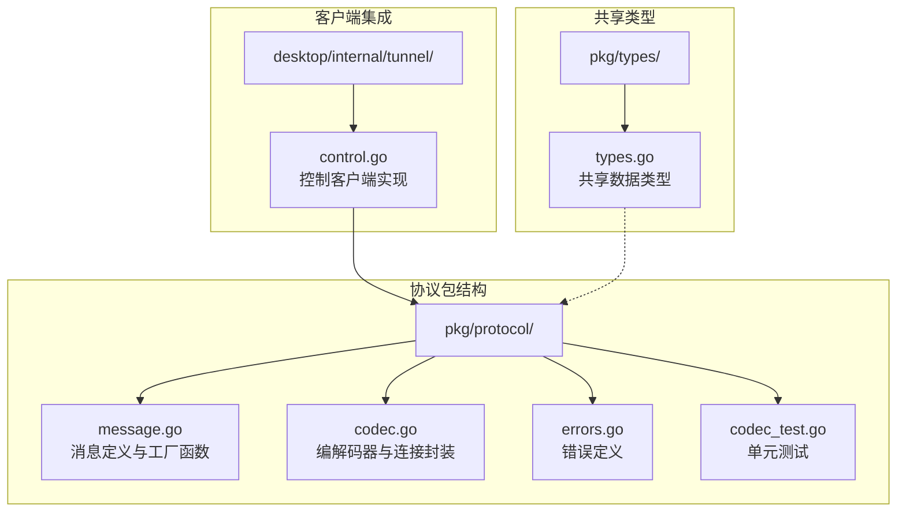
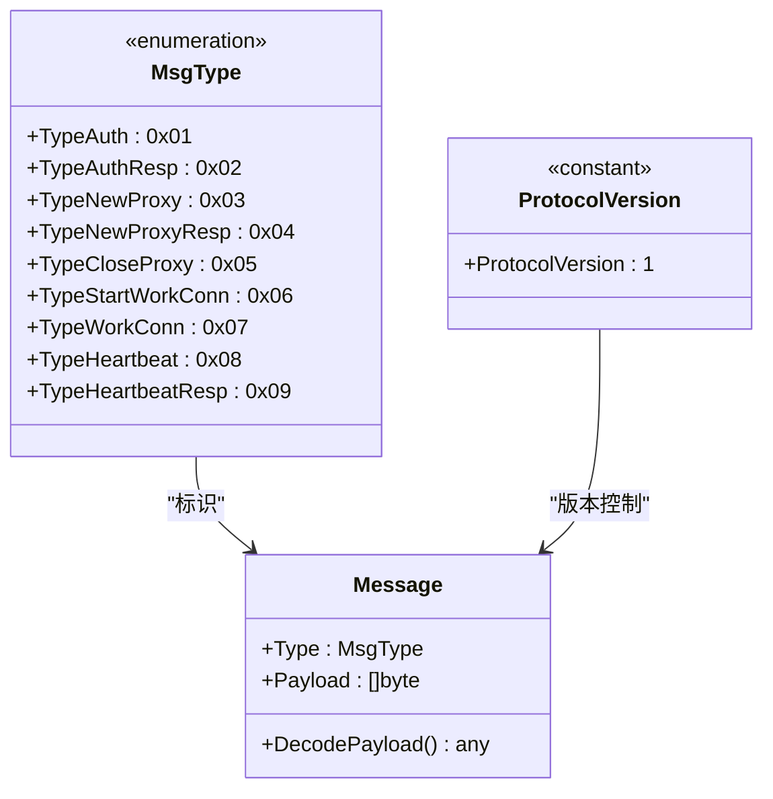
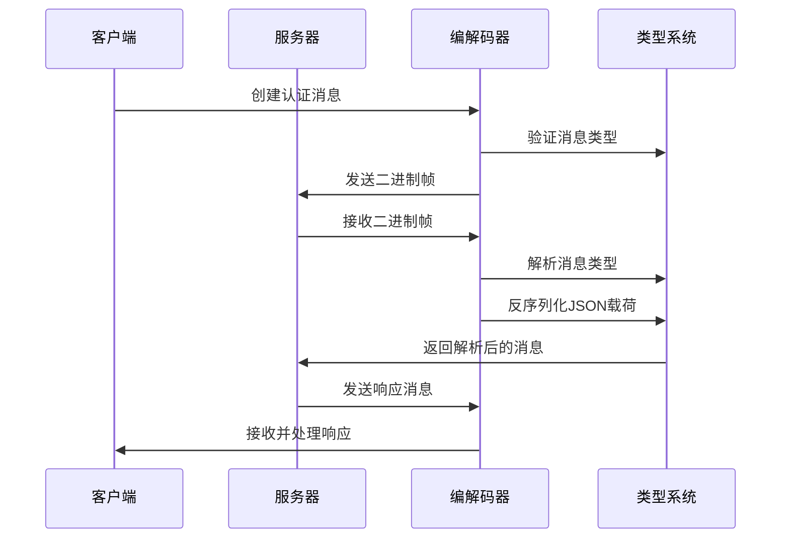
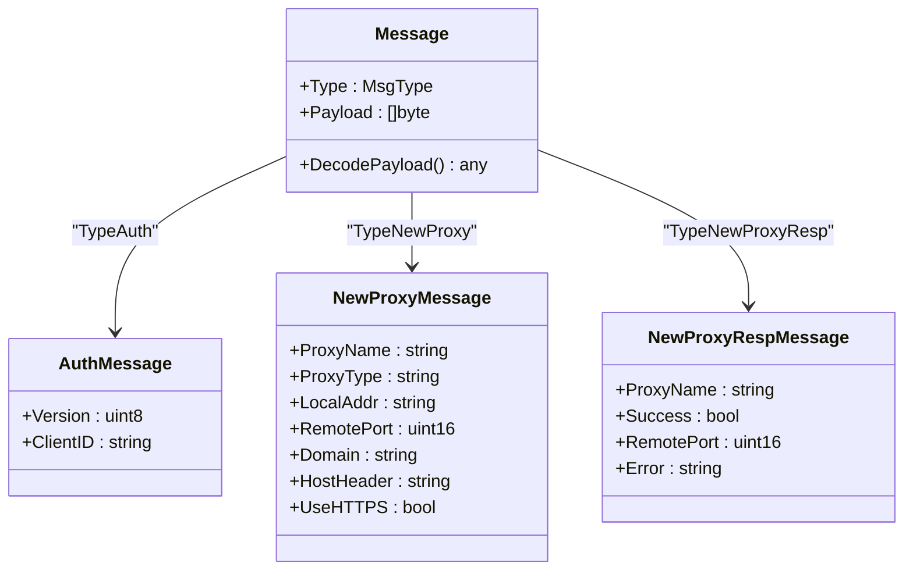
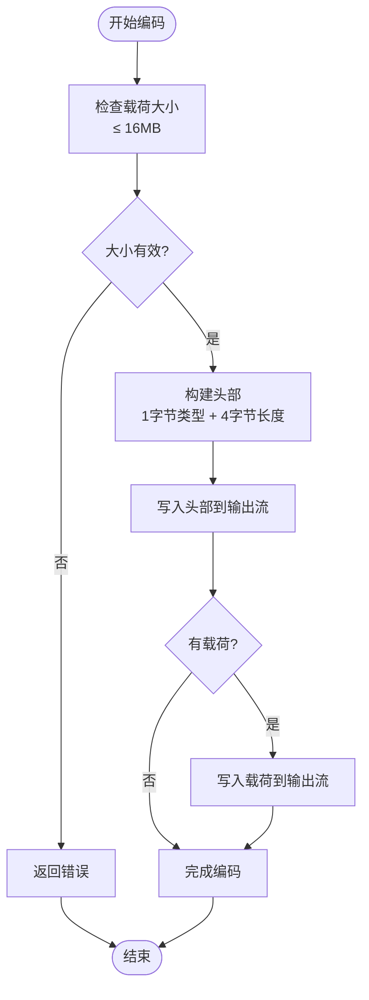
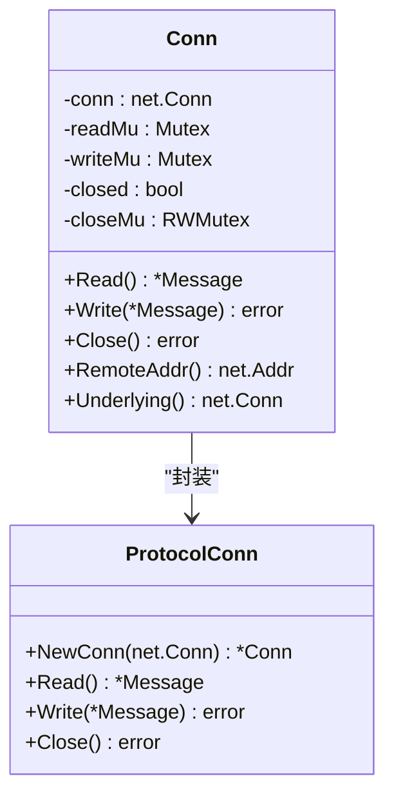
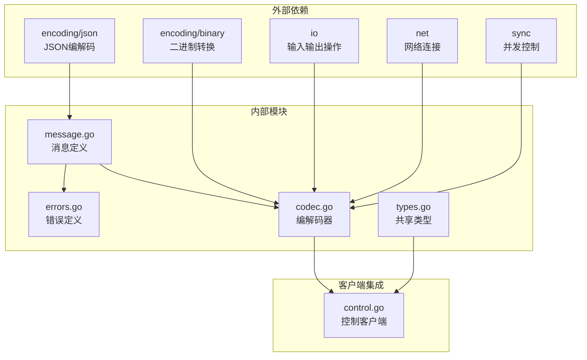

# 协议API接口

<cite>
**本文档引用的文件**
- [message.go](file://pkg/protocol/message.go)
- [codec.go](file://pkg/protocol/codec.go)
- [errors.go](file://pkg/protocol/errors.go)
- [types.go](file://pkg/types/types.go)
- [codec_test.go](file://pkg/protocol/codec_test.go)
- [control.go](file://desktop/internal/tunnel/control.go)
</cite>

## 目录
1. [简介](#简介)
2. [项目结构](#项目结构)
3. [核心组件](#核心组件)
4. [架构概览](#架构概览)
5. [详细组件分析](#详细组件分析)
6. [依赖关系分析](#依赖关系分析)
7. [性能考虑](#性能考虑)
8. [故障排除指南](#故障排除指南)
9. [结论](#结论)

## 简介

NexTunnel协议API是NexTunnel内网穿透系统的核心通信协议，负责控制通道的消息传输和数据交换。该协议采用二进制帧格式，支持多种消息类型，包括认证、代理建立、连接管理等核心功能。

协议设计遵循以下原则：
- **二进制高效传输**：使用紧凑的二进制格式减少网络开销
- **JSON负载结构**：消息载荷采用JSON格式，便于人类阅读和调试
- **类型安全**：通过明确的消息类型枚举确保协议完整性
- **错误处理**：完善的错误处理机制和边界条件检查

## 项目结构

NexTunnel协议API位于`pkg/protocol`包中，包含以下核心文件：

**图表来源**
- [message.go:1-203](file://pkg/protocol/message.go#L1-L203)
- [codec.go:1-131](file://pkg/protocol/codec.go#L1-L131)
- [errors.go:1-15](file://pkg/protocol/errors.go#L1-L15)
- [types.go:1-50](file://pkg/types/types.go#L1-L50)
- [control.go:1-155](file://desktop/internal/tunnel/control.go#L1-L155)

**章节来源**
- [message.go:1-203](file://pkg/protocol/message.go#L1-L203)
- [codec.go:1-131](file://pkg/protocol/codec.go#L1-L131)
- [types.go:1-50](file://pkg/types/types.go#L1-L50)

## 核心组件

### 消息类型枚举

协议定义了8种标准消息类型，每种类型都有特定的功能和用途：

**图表来源**
- [message.go:6-19](file://pkg/protocol/message.go#L6-L19)
- [message.go:24-28](file://pkg/protocol/message.go#L24-L28)
- [message.go:21](file://pkg/protocol/message.go#L21)

### 消息载荷结构

每种消息类型对应特定的载荷结构，所有载荷都采用JSON格式进行序列化：

| 消息类型 | 载荷结构 | 描述 |
|---------|---------|------|
| TypeAuth | AuthMessage | 认证请求，包含客户端ID和协议版本 |
| TypeAuthResp | AuthRespMessage | 认证响应，包含成功状态和错误信息 |
| TypeNewProxy | NewProxyMessage | 新建代理请求，包含代理配置信息 |
| TypeNewProxyResp | NewProxyRespMessage | 代理响应，包含远程端口和状态信息 |
| TypeCloseProxy | CloseProxyMessage | 关闭代理请求 |
| TypeStartWorkConn | StartWorkConnMessage | 开始工作连接请求 |
| TypeWorkConn | WorkConnMessage | 工作连接消息 |
| TypeHeartbeat/Resp | 无载荷 | 心跳检测消息 |

**章节来源**
- [message.go:32-80](file://pkg/protocol/message.go#L32-L80)

## 架构概览

NexTunnel协议采用客户端-服务器架构，控制通道负责管理所有隧道连接：

**图表来源**
- [codec.go:16-63](file://pkg/protocol/codec.go#L16-L63)
- [message.go:165-194](file://pkg/protocol/message.go#L165-L194)

## 详细组件分析

### 消息结构体分析

Message结构体是协议的基础数据结构，定义了消息的完整格式：

**图表来源**
- [message.go:24-28](file://pkg/protocol/message.go#L24-L28)
- [message.go:32-36](file://pkg/protocol/message.go#L32-L36)
- [message.go:44-54](file://pkg/protocol/message.go#L44-L54)
- [message.go:56-62](file://pkg/protocol/message.go#L56-L62)

### 编解码器实现

编解码器负责消息的序列化和反序列化，确保网络传输的正确性：

**图表来源**
- [codec.go:41-63](file://pkg/protocol/codec.go#L41-L63)

### 连接封装器

Conn结构体提供了线程安全的连接操作，支持并发读写：

**图表来源**
- [codec.go:65-131](file://pkg/protocol/codec.go#L65-L131)

**章节来源**
- [codec.go:16-63](file://pkg/protocol/codec.go#L16-L63)
- [codec.go:65-131](file://pkg/protocol/codec.go#L65-L131)

### 错误处理机制

协议定义了三种主要错误类型，用于处理不同的异常情况：

| 错误类型 | 触发条件 | 处理建议 |
|---------|---------|---------|
| ErrPayloadTooLarge | 载荷超过16MB限制 | 检查消息大小，分片传输或压缩数据 |
| ErrUnknownMsgType | 未知的消息类型字节 | 验证协议版本，检查消息类型定义 |
| ErrConnClosed | 对已关闭的连接进行操作 | 检查连接状态，重新建立连接 |

**章节来源**
- [errors.go:5-14](file://pkg/protocol/errors.go#L5-L14)

## 依赖关系分析

协议模块之间的依赖关系清晰且低耦合：

**图表来源**
- [message.go:4](file://pkg/protocol/message.go#L4)
- [codec.go:3-8](file://pkg/protocol/codec.go#L3-L8)
- [types.go:4](file://pkg/types/types.go#L4)

**章节来源**
- [message.go:1-203](file://pkg/protocol/message.go#L1-L203)
- [codec.go:1-131](file://pkg/protocol/codec.go#L1-L131)
- [types.go:1-50](file://pkg/types/types.go#L1-L50)

## 性能考虑

### 内存管理
- **缓冲区复用**：编解码器使用固定大小的头部缓冲区，避免频繁分配
- **零拷贝优化**：对于空载荷消息，直接传递nil指针，减少内存复制
- **并发安全**：使用互斥锁保护读写操作，避免竞态条件

### 网络效率
- **二进制格式**：相比纯文本协议，二进制格式减少约30%的传输开销
- **头部压缩**：5字节头部包含类型和长度信息，比JSON头部更紧凑
- **批量传输**：支持连续发送多个消息，提高吞吐量

### 错误恢复
- **超时机制**：客户端连接超时设置为10秒，避免长时间阻塞
- **重连策略**：控制客户端实现自动重连逻辑
- **资源清理**：连接关闭时自动清理相关资源

## 故障排除指南

### 常见问题诊断

1. **连接超时**
   - 检查服务器地址和端口配置
   - 验证防火墙设置和网络连通性
   - 查看客户端日志中的超时时间

2. **认证失败**
   - 确认客户端ID的有效性
   - 检查协议版本兼容性
   - 验证服务器端的认证配置

3. **消息解析错误**
   - 检查JSON载荷格式
   - 验证字段类型和范围
   - 确认消息类型匹配

### 调试技巧

- **启用详细日志**：在开发环境中启用协议级别的日志记录
- **使用测试套件**：运行codec_test.go中的所有测试用例
- **网络抓包**：使用tcpdump或Wireshark分析二进制帧格式

**章节来源**
- [codec_test.go:117-189](file://pkg/protocol/codec_test.go#L117-L189)
- [control.go:40-95](file://desktop/internal/tunnel/control.go#L40-L95)

## 结论

NexTunnel协议API设计合理，实现了高效的控制通道通信。协议具有以下优势：

- **简洁明了**：8种消息类型覆盖了内网穿透的核心需求
- **类型安全**：通过枚举和结构体确保消息完整性
- **易于扩展**：预留了自定义消息类型的扩展点
- **健壮性强**：完善的错误处理和边界条件检查

未来可以考虑的改进方向：
- 添加消息签名和加密支持
- 实现消息压缩以减少带宽占用
- 增加消息确认机制提高可靠性
- 支持多路复用以提高连接利用率