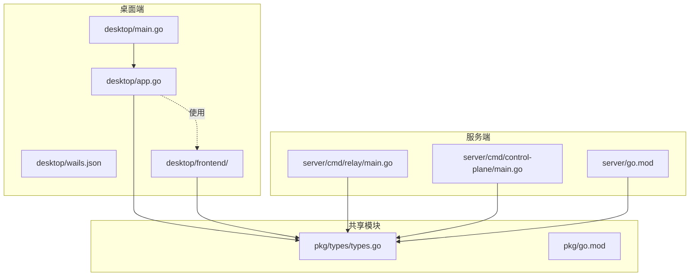
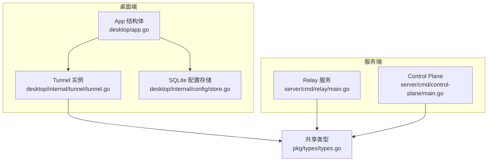
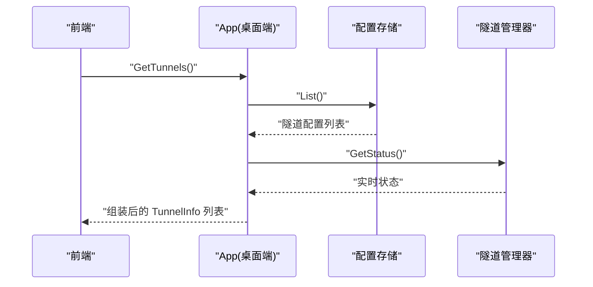
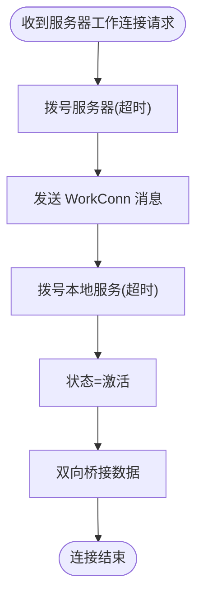
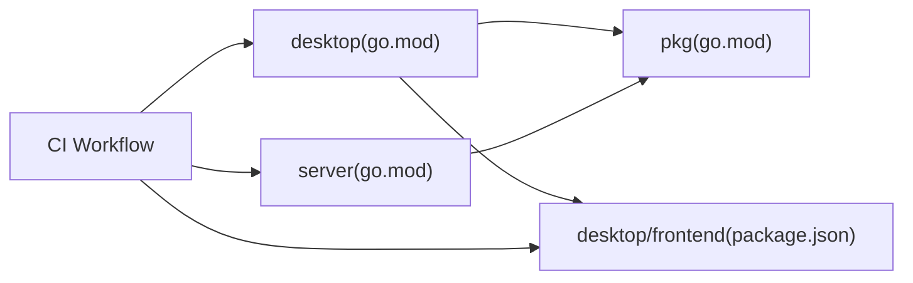

# 开发者指南

<cite>
**本文引用的文件**
- [README.md](file://README.md)
- [Makefile](file://Makefile)
- [.github/workflows/ci.yml](file://.github/Workflows/ci.yml)
- [desktop/go.mod](file://desktop/go.mod)
- [desktop/wails.json](file://desktop/wails.json)
- [desktop/main.go](file://desktop/main.go)
- [desktop/app.go](file://desktop/app.go)
- [desktop/frontend/package.json](file://desktop/frontend/package.json)
- [desktop/frontend/eslint.config.js](file://desktop/frontend/eslint.config.js)
- [desktop/frontend/vite.config.ts](file://desktop/frontend/vite.config.ts)
- [desktop/frontend/tsconfig.json](file://desktop/frontend/tsconfig.json)
- [desktop/frontend/src/main.ts](file://desktop/frontend/src/main.ts)
- [pkg/go.mod](file://pkg/go.mod)
- [pkg/types/types.go](file://pkg/types/types.go)
- [desktop/internal/tunnel/tunnel.go](file://desktop/internal/tunnel/tunnel.go)
- [server/go.mod](file://server/go.mod)
- [server/cmd/control-plane/main.go](file://server/cmd/control-plane/main.go)
- [docker-compose.yml](file://docker-compose.yml)
</cite>

## 目录
1. [简介](#简介)
2. [项目结构](#项目结构)
3. [核心组件](#核心组件)
4. [架构总览](#架构总览)
5. [详细组件分析](#详细组件分析)
6. [依赖分析](#依赖分析)
7. [性能考虑](#性能考虑)
8. [故障排查指南](#故障排查指南)
9. [结论](#结论)
10. [附录](#附录)

## 简介
本指南面向新加入的 NexTunnel 开发者，提供从开发环境搭建到日常协作与发布的全流程说明。项目采用前后端分离架构：桌面端使用 Wails（Go + Vue），服务端使用 Go 提供中继与控制平面能力；共享类型定义位于独立模块 pkg 中。CI 已在 GitHub Actions 上配置，覆盖 Go 与前端的 Lint、构建与测试。

## 项目结构
- desktop：Wails 桌面端应用（Go 后端 + Vue 前端）
- server：服务端（Go HTTP 服务，当前包含 relay 与 control-plane 入口）
- pkg：共享类型与协议定义
- docs：项目文档
- scripts：脚本目录
- 根级 Makefile：统一构建、测试、Lint、清理与依赖安装命令
- docker-compose.yml：本地快速启动 relay-server 的编排

图表来源
- [desktop/main.go:1-37](file://desktop/main.go#L1-L37)
- [desktop/app.go:1-208](file://desktop/app.go#L1-L208)
- [desktop/wails.json:1-14](file://desktop/wails.json#L1-L14)
- [desktop/frontend/src/main.ts:1-8](file://desktop/frontend/src/main.ts#L1-L8)
- [server/cmd/control-plane/main.go:1-12](file://server/cmd/control-plane/main.go#L1-L12)
- [pkg/types/types.go:1-50](file://pkg/types/types.go#L1-L50)

章节来源
- [README.md:1-20](file://README.md#L1-L20)
- [Makefile:1-66](file://Makefile#L1-L66)
- [docker-compose.yml:1-12](file://docker-compose.yml#L1-L12)

## 核心组件
- 桌面端应用入口与生命周期
  - 应用入口负责嵌入前端产物、初始化日志、数据库与隧道管理器，并在启动/关闭时执行相应操作。
  - 关键路径参考：[desktop/main.go:15-36](file://desktop/main.go#L15-L36)，[desktop/app.go:32-76](file://desktop/app.go#L32-L76)
- 隧道管理与数据桥接
  - 单个隧道实例负责与服务器建立工作连接、向本地服务发起连接，并在两端之间进行双向数据转发。
  - 关键路径参考：[desktop/internal/tunnel/tunnel.go:49-84](file://desktop/internal/tunnel/tunnel.go#L49-L84)，[desktop/internal/tunnel/tunnel.go:87-124](file://desktop/internal/tunnel/tunnel.go#L87-L124)
- 共享类型与状态
  - 定义代理类型、状态枚举以及隧道配置与运行时信息等跨模块共享结构。
  - 关键路径参考：[pkg/types/types.go:6-50](file://pkg/types/types.go#L6-L50)
- 服务端入口
  - 当前 control-plane 未实现，relay 入口存在但内容为空；后续将逐步完善。
  - 关键路径参考：[server/cmd/control-plane/main.go:1-12](file://server/cmd/control-plane/main.go#L1-L12)

章节来源
- [desktop/main.go:1-37](file://desktop/main.go#L1-L37)
- [desktop/app.go:1-208](file://desktop/app.go#L1-L208)
- [desktop/internal/tunnel/tunnel.go:1-138](file://desktop/internal/tunnel/tunnel.go#L1-L138)
- [pkg/types/types.go:1-50](file://pkg/types/types.go#L1-L50)
- [server/cmd/control-plane/main.go:1-12](file://server/cmd/control-plane/main.go#L1-L12)

## 架构总览
下图展示了桌面端与服务端的交互关系，以及共享类型的作用范围。

图表来源
- [desktop/app.go:17-24](file://desktop/app.go#L17-L24)
- [desktop/internal/tunnel/tunnel.go:16-36](file://desktop/internal/tunnel/tunnel.go#L16-L36)
- [pkg/types/types.go:24-50](file://pkg/types/types.go#L24-L50)
- [server/cmd/control-plane/main.go:1-12](file://server/cmd/control-plane/main.go#L1-L12)

## 详细组件分析

### 组件一：桌面端应用生命周期与绑定方法
- 职责
  - 初始化日志、打开数据库、加载隧道配置、创建隧道管理器并在关闭时释放资源。
  - 对外暴露可由前端调用的方法（如获取版本、问候、隧道 CRUD、连接状态与流量统计）。
- 关键点
  - 启动阶段读取持久化配置并注入默认客户端 ID。
  - 运行时聚合隧道状态与流量统计，供前端展示。
- 参考路径
  - [desktop/app.go:32-76](file://desktop/app.go#L32-L76)
  - [desktop/app.go:111-139](file://desktop/app.go#L111-L139)
  - [desktop/app.go:151-172](file://desktop/app.go#L151-L172)
  - [desktop/app.go:184-203](file://desktop/app.go#L184-L203)

图表来源
- [desktop/app.go:111-139](file://desktop/app.go#L111-L139)

章节来源
- [desktop/app.go:1-208](file://desktop/app.go#L1-L208)

### 组件二：隧道实例与数据桥接
- 职责
  - 响应服务器的工作连接请求，建立到服务器的连接并向本地服务发起连接，随后在两端之间进行双向数据转发。
  - 维护隧道状态与字节统计。
- 关键点
  - 使用原子变量保证状态与计数的并发安全。
  - 通过原始网络连接进行数据桥接，避免协议层封装开销。
- 参考路径
  - [desktop/internal/tunnel/tunnel.go:38-45](file://desktop/internal/tunnel/tunnel.go#L38-L45)
  - [desktop/internal/tunnel/tunnel.go:47-84](file://desktop/internal/tunnel/tunnel.go#L47-L84)
  - [desktop/internal/tunnel/tunnel.go:87-124](file://desktop/internal/tunnel/tunnel.go#L87-L124)
  - [desktop/internal/tunnel/tunnel.go:126-137](file://desktop/internal/tunnel/tunnel.go#L126-L137)

图表来源
- [desktop/internal/tunnel/tunnel.go:49-84](file://desktop/internal/tunnel/tunnel.go#L49-L84)

章节来源
- [desktop/internal/tunnel/tunnel.go:1-138](file://desktop/internal/tunnel/tunnel.go#L1-L138)

### 组件三：共享类型与状态模型
- 职责
  - 定义代理类型（tcp/http/udp）、运行时状态（active/inactive/error）以及隧道配置与运行时信息等跨模块共享结构。
- 参考路径
  - [pkg/types/types.go:6-50](file://pkg/types/types.go#L6-L50)

章节来源
- [pkg/types/types.go:1-50](file://pkg/types/types.go#L1-L50)

### 组件四：服务端入口与现状
- 职责
  - relay 与 control-plane 作为服务端入口，当前 relay 尚未实现具体逻辑，control-plane 仅输出占位信息。
- 参考路径
  - [server/cmd/relay/main.go](file://server/cmd/relay/main.go)
  - [server/cmd/control-plane/main.go:1-12](file://server/cmd/control-plane/main.go#L1-L12)

章节来源
- [server/cmd/control-plane/main.go:1-12](file://server/cmd/control-plane/main.go#L1-L12)

## 依赖分析
- 模块依赖关系
  - desktop 依赖 pkg 类型模块；server 同样依赖 pkg；两者通过 replace 指向本地 pkg。
  - desktop 嵌入前端构建产物并通过 Wails 集成。
- 外部依赖
  - 桌面端：Wails、SQLite、WebSocket、浏览器集成等；服务端：UUID 等。
- CI 依赖
  - Go 版本 1.23，Node 20；分别对 desktop/server 执行 golangci-lint，对前端执行 ESLint；构建与测试覆盖全模块。

图表来源
- [desktop/go.mod:1-49](file://desktop/go.mod#L1-L49)
- [server/go.mod:1-11](file://server/go.mod#L1-L11)
- [pkg/go.mod:1-4](file://pkg/go.mod#L1-L4)
- [.github/workflows/ci.yml:10-103](file://.github/workflows/ci.yml#L10-L103)
- [desktop/frontend/package.json:1-26](file://desktop/frontend/package.json#L1-L26)

章节来源
- [desktop/go.mod:1-49](file://desktop/go.mod#L1-L49)
- [server/go.mod:1-11](file://server/go.mod#L1-L11)
- [pkg/go.mod:1-4](file://pkg/go.mod#L1-L4)
- [.github/workflows/ci.yml:1-103](file://.github/workflows/ci.yml#L1-L103)
- [desktop/frontend/package.json:1-26](file://desktop/frontend/package.json#L1-L26)

## 性能考虑
- 数据桥接优化
  - 在工作连接建立后，直接使用原始网络连接进行数据转发，减少协议封装与解包成本。
  - 参考：[desktop/internal/tunnel/tunnel.go:81-83](file://desktop/internal/tunnel/tunnel.go#L81-L83)
- 并发与原子性
  - 使用原子变量维护状态与计数，避免锁竞争带来的额外开销。
  - 参考：[desktop/internal/tunnel/tunnel.go:22-24](file://desktop/internal/tunnel/tunnel.go#L22-L24)
- 构建与缓存
  - 使用 CI 的缓存策略（npm ci 缓存）与分层构建，缩短流水线时间。
  - 参考：[ci.yml:44-46](file://.github/workflows/ci.yml#L44-L46)

章节来源
- [desktop/internal/tunnel/tunnel.go:1-138](file://desktop/internal/tunnel/tunnel.go#L1-L138)
- [.github/workflows/ci.yml:44-46](file://.github/workflows/ci.yml#L44-L46)

## 故障排查指南
- 启动失败
  - 检查桌面端是否成功嵌入前端产物与初始化日志；查看数据库打开与配置加载错误。
  - 参考：[desktop/main.go:18-31](file://desktop/main.go#L18-L31)，[desktop/app.go:35-48](file://desktop/app.go#L35-L48)
- 隧道无法建立
  - 核查服务器地址可达性、本地服务监听状态、握手消息发送与接收。
  - 参考：[desktop/internal/tunnel/tunnel.go:50-54](file://desktop/internal/tunnel/tunnel.go#L50-L54)，[desktop/internal/tunnel/tunnel.go:70-76](file://desktop/internal/tunnel/tunnel.go#L70-L76)
- 流量统计异常
  - 确认桥接 goroutine 是否正常运行，检查 bytesIn/bytesOut 增长情况。
  - 参考：[desktop/internal/tunnel/tunnel.go:104-121](file://desktop/internal/tunnel/tunnel.go#L104-L121)
- CI 失败
  - 按任务细分定位：golangci-lint、ESLint、构建或测试失败。
  - 参考：[ci.yml:20-30](file://.github/workflows/ci.yml#L20-L30)，[ci.yml:48-50](file://.github/workflows/ci.yml#L48-L50)，[ci.yml:66-80](file://.github/workflows/ci.yml#L66-L80)，[ci.yml:92-102](file://.github/workflows/ci.yml#L92-L102)

章节来源
- [desktop/main.go:1-37](file://desktop/main.go#L1-L37)
- [desktop/app.go:1-208](file://desktop/app.go#L1-L208)
- [desktop/internal/tunnel/tunnel.go:1-138](file://desktop/internal/tunnel/tunnel.go#L1-L138)
- [.github/workflows/ci.yml:1-103](file://.github/workflows/ci.yml#L1-L103)

## 结论
本指南提供了 NexTunnel 从环境搭建到日常开发与协作的全景式说明。建议新开发者优先完成依赖安装与首次构建，再深入理解桌面端与隧道桥接机制，最后结合 CI 流程与共享类型设计，确保代码质量与一致性。

## 附录

### A. 开发环境搭建与调试
- 依赖安装
  - 使用统一命令安装所有依赖：[Makefile:60-66](file://Makefile#L60-L66)
  - 桌面端 Go 模块与前端依赖：[desktop/go.mod:1-49](file://desktop/go.mod#L1-L49)，[desktop/frontend/package.json:1-26](file://desktop/frontend/package.json#L1-L26)
- 开发工具配置
  - 前端构建与热更新：Vite 配置与别名、严格 TS 校验；[desktop/frontend/vite.config.ts:1-15](file://desktop/frontend/vite.config.ts#L1-L15)，[desktop/frontend/tsconfig.json:1-23](file://desktop/frontend/tsconfig.json#L1-L23)
  - ESLint 规则与忽略项：[desktop/frontend/eslint.config.js:1-16](file://desktop/frontend/eslint.config.js#L1-L16)
  - Wails 集成：应用名称、输出文件名、前端安装/构建脚本：[desktop/wails.json:1-14](file://desktop/wails.json#L1-L14)
- 调试技巧
  - 使用桌面端日志与前端控制台；通过流量统计确认桥接是否生效；[desktop/app.go:192-203](file://desktop/app.go#L192-L203)

章节来源
- [Makefile:60-66](file://Makefile#L60-L66)
- [desktop/go.mod:1-49](file://desktop/go.mod#L1-L49)
- [desktop/frontend/package.json:1-26](file://desktop/frontend/package.json#L1-L26)
- [desktop/frontend/vite.config.ts:1-15](file://desktop/frontend/vite.config.ts#L1-L15)
- [desktop/frontend/tsconfig.json:1-23](file://desktop/frontend/tsconfig.json#L1-L23)
- [desktop/frontend/eslint.config.js:1-16](file://desktop/frontend/eslint.config.js#L1-L16)
- [desktop/wails.json:1-14](file://desktop/wails.json#L1-L14)
- [desktop/app.go:192-203](file://desktop/app.go#L192-L203)

### B. 代码贡献规范与审查流程
- 提交前检查
  - 执行统一 Lint 与测试：[Makefile:29-52](file://Makefile#L29-L52)
  - CI 自动执行：golangci-lint、ESLint、构建与测试，参考：[ci.yml:10-103](file://.github/workflows/ci.yml#L10-L103)
- 提交流程
  - 基于 develop 分支创建功能分支，遵循语义化命名；在 PR 中同步变更说明与测试结果。
- 代码风格
  - Go 使用 golangci-lint；前端使用 ESLint + TypeScript + Vue 插件配置；[desktop/frontend/eslint.config.js:1-16](file://desktop/frontend/eslint.config.js#L1-L16)

章节来源
- [Makefile:29-52](file://Makefile#L29-L52)
- [.github/workflows/ci.yml:10-103](file://.github/workflows/ci.yml#L10-L103)
- [desktop/frontend/eslint.config.js:1-16](file://desktop/frontend/eslint.config.js#L1-L16)

### C. 开发工作流与版本发布
- 工作流
  - develop → feature/fix → PR → CI → main（按需打标签）
- 发布流程
  - 本地构建：[Makefile:19-28](file://Makefile#L19-L28)
  - 服务端镜像：Dockerfile 位于 server 目录，compose 用于本地启动 relay 服务：[docker-compose.yml:1-12](file://docker-compose.yml#L1-L12)

章节来源
- [Makefile:19-28](file://Makefile#L19-L28)
- [docker-compose.yml:1-12](file://docker-compose.yml#L1-L12)

### D. 安全编码规范
- 输入校验
  - 对来自前端的隧道参数进行边界与格式校验，避免非法值导致连接失败或资源浪费。
- 错误处理
  - 对网络拨号、握手与桥接过程中的错误进行分类记录与降级处理，避免资源泄漏。
- 日志与审计
  - 使用结构化日志记录关键事件与错误上下文，便于问题定位与审计追踪。

章节来源
- [desktop/internal/tunnel/tunnel.go:49-84](file://desktop/internal/tunnel/tunnel.go#L49-L84)
- [desktop/app.go:35-48](file://desktop/app.go#L35-L48)

### E. IDE 与调试环境推荐
- Go
  - 推荐使用支持 Go Modules 的 IDE（如 GoLand/VSCode），启用 gopls 与 golangci-lint 集成。
- Vue
  - VSCode 或 WebStorm，启用 Vue Language Features、ESLint、TypeScript 支持。
- 调试
  - 桌面端：Wails Dev Server 启动前端与后端联调；服务端：使用本地 relay 与控制台日志配合断点调试。

章节来源
- [desktop/frontend/package.json:1-26](file://desktop/frontend/package.json#L1-L26)
- [desktop/frontend/eslint.config.js:1-16](file://desktop/frontend/eslint.config.js#L1-L16)
- [desktop/wails.json:1-14](file://desktop/wails.json#L1-L14)