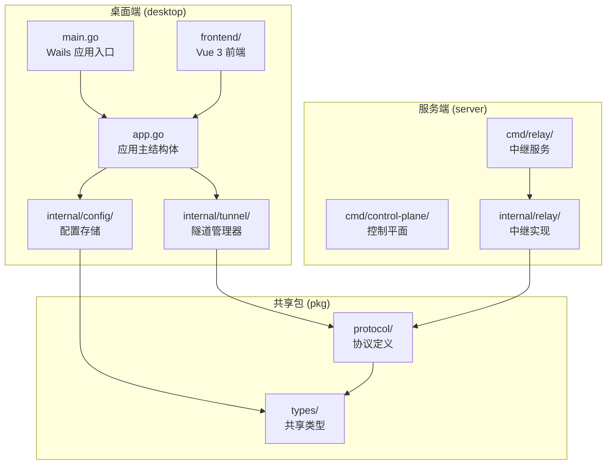
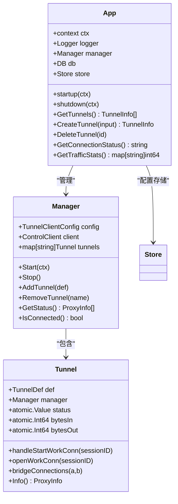
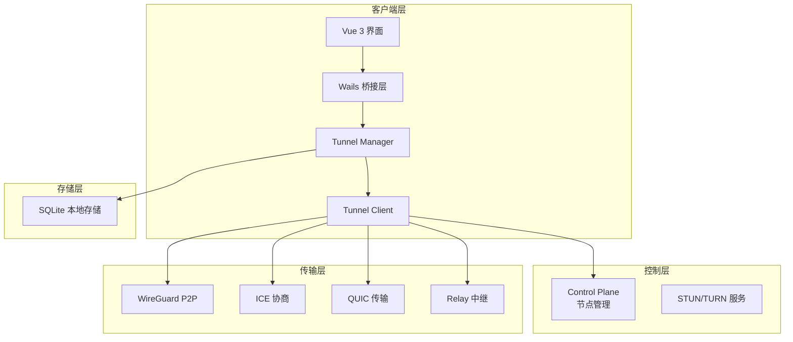
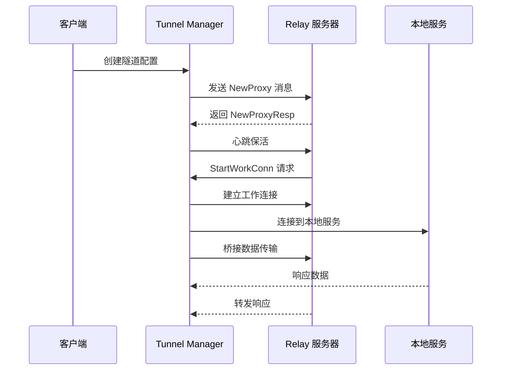
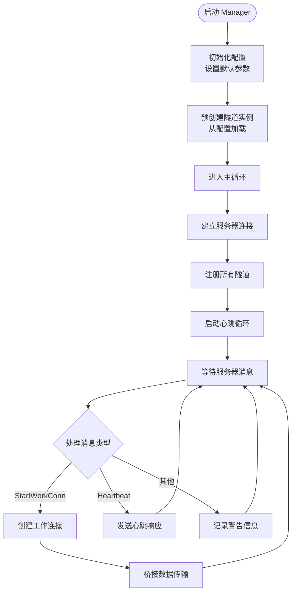
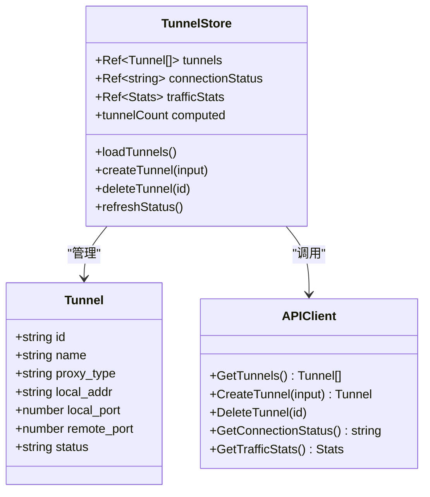
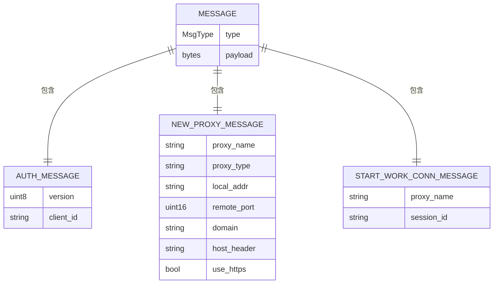
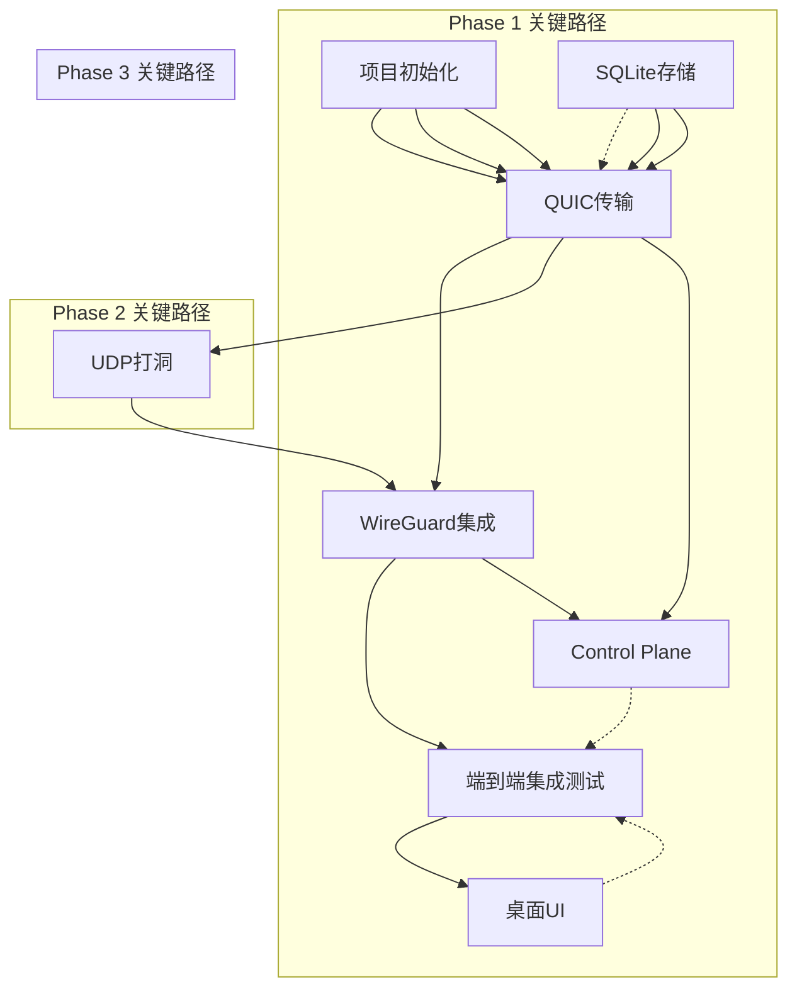
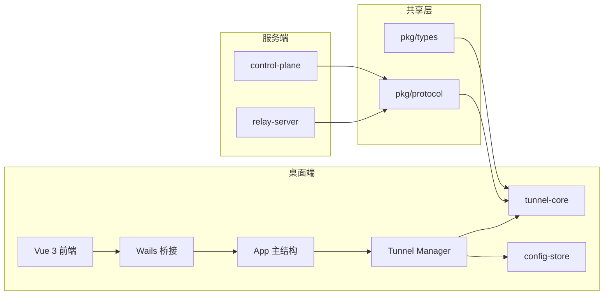
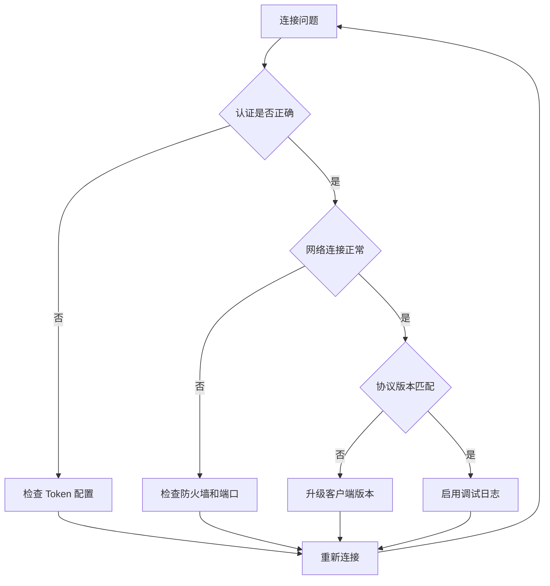

# NexTunnel 任务规划文档

<cite>
**本文档引用的文件**
- [task-plan.md](file://task-plan.md)
- [progress-tracking.md](file://progress-tracking.md)
- [README.md](file://README.md)
- [go.work](file://go.work)
- [desktop/main.go](file://desktop/main.go)
- [desktop/app.go](file://desktop/app.go)
- [desktop/internal/tunnel/manager.go](file://desktop/internal/tunnel/manager.go)
- [desktop/internal/tunnel/tunnel.go](file://desktop/internal/tunnel/tunnel.go)
- [desktop/internal/config/store.go](file://desktop/internal/config/store.go)
- [desktop/frontend/src/stores/tunnel.ts](file://desktop/frontend/src/stores/tunnel.ts)
- [desktop/frontend/src/api/app.ts](file://desktop/frontend/src/api/app.ts)
- [desktop/frontend/src/views/StatusView.vue](file://desktop/frontend/src/views/StatusView.vue)
- [pkg/types/types.go](file://pkg/types/types.go)
- [pkg/protocol/message.go](file://pkg/protocol/message.go)
- [server/cmd/control-plane/main.go](file://server/cmd/control-plane/main.go)
- [server/cmd/relay/main.go](file://server/cmd/relay/main.go)
</cite>

## 目录
1. [项目概述](#项目概述)
2. [项目结构](#项目结构)
3. [核心组件](#核心组件)
4. [架构总览](#架构总览)
5. [详细组件分析](#详细组件分析)
6. [依赖关系分析](#依赖关系分析)
7. [性能考虑](#性能考虑)
8. [故障排除指南](#故障排除指南)
9. [结论](#结论)
10. [附录](#附录)

## 项目概述

NexTunnel 是一款基于 FRP 的可视化内网穿透管理工具，提供桌面端和服务端双模式，帮助用户轻松创建、管理和监控内网访问入口。项目采用 Go + Vue 3 + Wails 技术栈，支持 TCP/HTTP 隧道、Relay 中继、以及未来计划中的 P2P 直连、智能调度和全球加速功能。

**章节来源**
- [README.md:1-20](file://README.md#L1-L20)

## 项目结构

项目采用多模块工作区结构，主要包含以下核心目录：



**图表来源**
- [go.work:1-8](file://go.work#L1-L8)
- [desktop/main.go:1-37](file://desktop/main.go#L1-L37)
- [server/cmd/relay/main.go:1-81](file://server/cmd/relay/main.go#L1-L81)

**章节来源**
- [go.work:1-8](file://go.work#L1-L8)

## 核心组件

### 桌面端核心组件

桌面端采用 Wails 框架，结合 Vue 3 前端和 Go 后端，实现完整的隧道管理功能：



**图表来源**
- [desktop/app.go:17-208](file://desktop/app.go#L17-L208)
- [desktop/internal/tunnel/manager.go:16-310](file://desktop/internal/tunnel/manager.go#L16-L310)
- [desktop/internal/tunnel/tunnel.go:16-138](file://desktop/internal/tunnel/tunnel.go#L16-L138)

### 服务端核心组件

服务端提供控制平面和中继服务，支持多客户端连接和流量统计：

```mermaid
classDiagram
class ControlPlaneMain {
+main()
}
class RelayMain {
+main()
-parseFlags()
-runServer()
-printStats()
-shutdown()
}
class RelayServer {
+ServerConfig cfg
+Stats stats
+Run() error
+Shutdown(ctx) error
+GetStats() Stats
+Done() chan struct{}
}
ControlPlaneMain --> ControlPlaneService : "占位实现"
RelayMain --> RelayServer : "创建并运行"
```

**图表来源**
- [server/cmd/control-plane/main.go:1-12](file://server/cmd/control-plane/main.go#L1-L12)
- [server/cmd/relay/main.go:15-81](file://server/cmd/relay/main.go#L15-L81)

**章节来源**
- [desktop/app.go:17-208](file://desktop/app.go#L17-L208)
- [desktop/internal/tunnel/manager.go:16-310](file://desktop/internal/tunnel/manager.go#L16-L310)
- [server/cmd/relay/main.go:15-81](file://server/cmd/relay/main.go#L15-L81)

## 架构总览

### 系统架构图



**图表来源**
- [task-plan.md:26-135](file://task-plan.md#L26-L135)

### 数据流架构



**图表来源**
- [pkg/protocol/message.go:99-153](file://pkg/protocol/message.go#L99-L153)
- [desktop/internal/tunnel/tunnel.go:49-85](file://desktop/internal/tunnel/tunnel.go#L49-L85)

**章节来源**
- [task-plan.md:137-166](file://task-plan.md#L137-L166)

## 详细组件分析

### 隧道管理器组件

Tunnel Manager 是客户端的核心协调器，负责管理多个隧道实例和与服务器的通信：



**图表来源**
- [desktop/internal/tunnel/manager.go:65-217](file://desktop/internal/tunnel/manager.go#L65-L217)

### 前端状态管理

前端使用 Pinia 状态管理，提供隧道配置和连接状态的响应式管理：



**图表来源**
- [desktop/frontend/src/stores/tunnel.ts:23-83](file://desktop/frontend/src/stores/tunnel.ts#L23-L83)
- [desktop/frontend/src/api/app.ts:21-49](file://desktop/frontend/src/api/app.ts#L21-L49)

**章节来源**
- [desktop/internal/tunnel/manager.go:16-310](file://desktop/internal/tunnel/manager.go#L16-L310)
- [desktop/frontend/src/stores/tunnel.ts:23-83](file://desktop/frontend/src/stores/tunnel.ts#L23-L83)

### 协议通信机制

客户端与服务器之间的通信基于 JSON 序列化的消息协议：



**图表来源**
- [pkg/protocol/message.go:24-79](file://pkg/protocol/message.go#L24-L79)

**章节来源**
- [pkg/protocol/message.go:1-203](file://pkg/protocol/message.go#L1-L203)

## 依赖关系分析

### 任务依赖关系图



**图表来源**
- [progress-tracking.md:88-142](file://progress-tracking.md#L88-L142)

### 模块依赖关系



**图表来源**
- [task-plan.md:253-290](file://task-plan.md#L253-L290)

**章节来源**
- [progress-tracking.md:88-142](file://progress-tracking.md#L88-L142)

## 性能考虑

### 网络性能优化

1. **连接池管理**：使用指数退避算法处理重连，避免雪崩效应
2. **流量统计**：原子操作更新字节数，减少锁竞争
3. **数据桥接**：使用 io.Copy 实现高效的双向数据传输
4. **心跳机制**：定期的心跳保活确保连接有效性

### 存储性能优化

1. **SQLite 本地存储**：嵌入式数据库，零部署开销
2. **批量操作**：配置变更使用事务处理
3. **索引优化**：按创建时间倒序查询，支持快速列表展示

## 故障排除指南

### 常见问题诊断



### 进度跟踪与状态管理

根据进度跟踪文档，当前项目状态如下：

- **Phase 1 基础隧道**：已完成 100%
- **Phase 2 P2P 直连**：待开始
- **Phase 3 智能调度**：待开始  
- **Phase 4 全球加速**：待开始

**章节来源**
- [progress-tracking.md:9-18](file://progress-tracking.md#L9-L18)

## 结论

NexTunnel 项目采用清晰的分层架构设计，实现了从基础隧道到未来 P2P 直连的渐进式发展路线。项目结构合理，模块职责明确，为后续的功能扩展奠定了良好的基础。

当前 Phase 1 已完成，为 Phase 2 的 P2P 直连功能做好了充分准备。建议按照既定的里程碑推进，重点关注 NAT 穿透和 WireGuard 集成的实现质量。

## 附录

### 技术栈详情

| 组件 | 技术 | 版本要求 | 用途 |
|------|------|----------|------|
| 客户端核心 | Go | 1.25+ | 网络库、协程模型 |
| 桌面 UI | Vue 3 + Vite | 最新版 | 组件化开发 |
| 桌面框架 | Wails v2 | 最新版 | Go + Web 封装 |
| 服务端 | Go + gRPC | 最新版 | 高并发处理 |
| 本地存储 | SQLite | 最新版 | 嵌入式存储 |

### 开发里程碑

- **Phase 1 (6-8周)**：基础隧道功能完成
- **Phase 2 (8-10周)**：P2P 直连和 Mesh 网络
- **Phase 3 (6-8周)**：智能调度和 QUIC 传输
- **Phase 4 (10-12周)**：全球加速和 SD-WAN

**章节来源**
- [task-plan.md:294-440](file://task-plan.md#L294-L440)