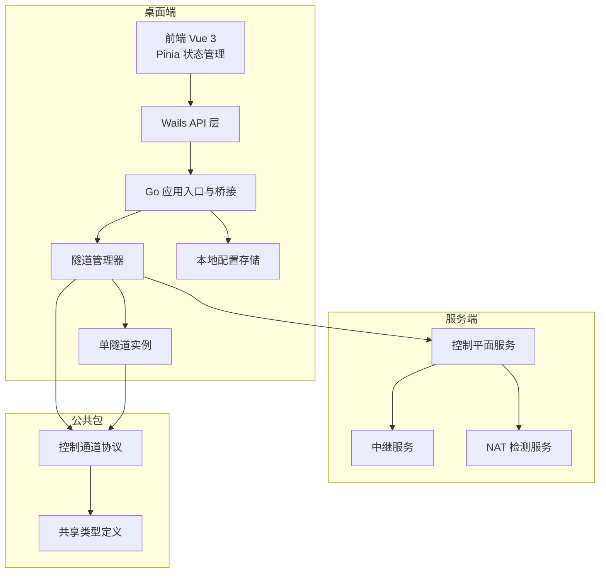
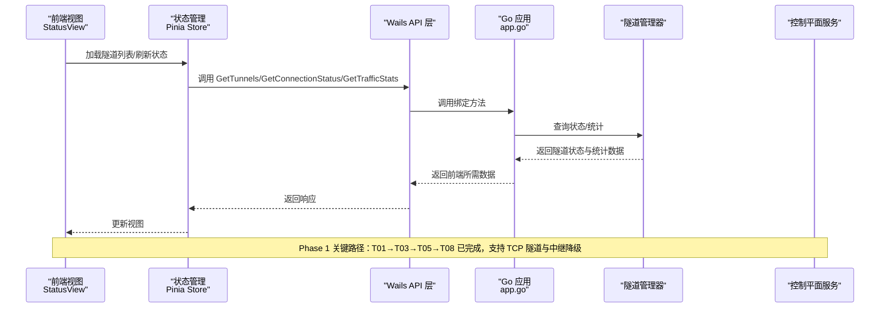
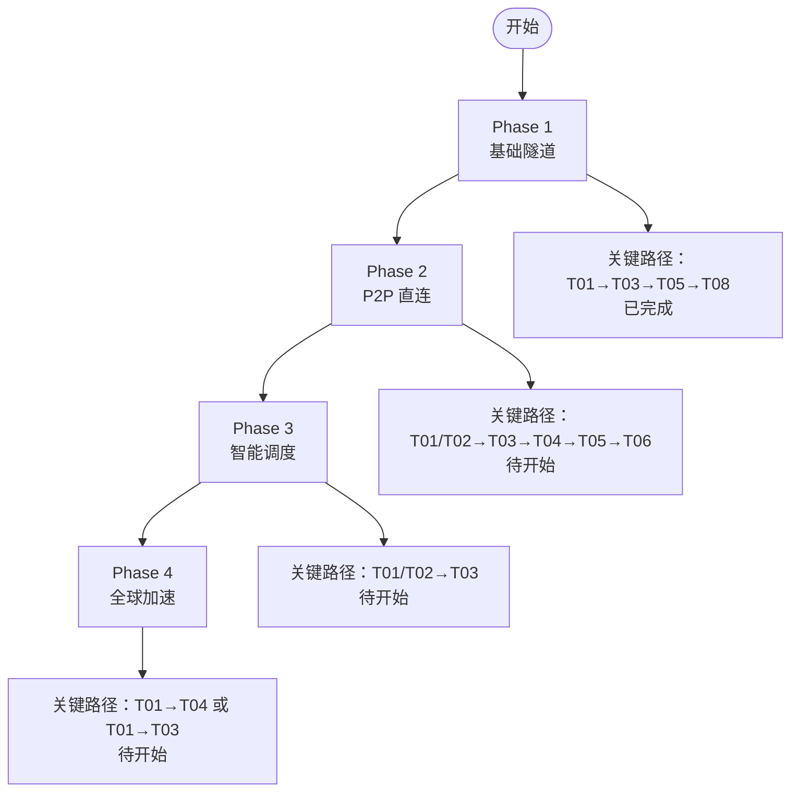
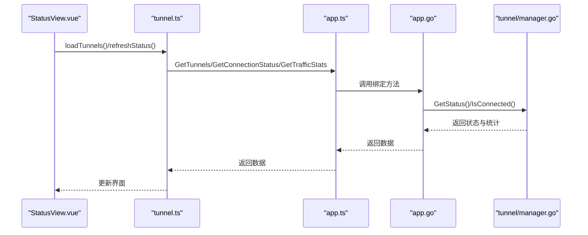
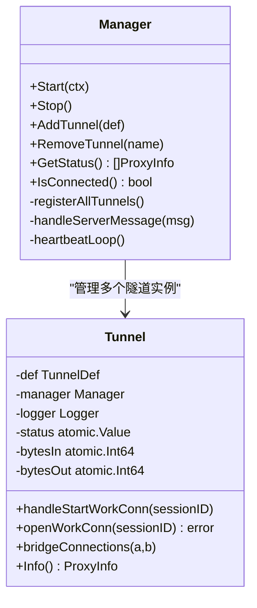
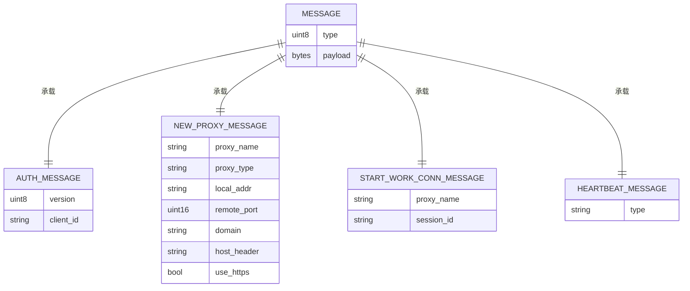
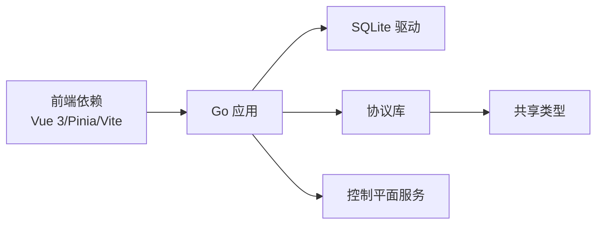

# 项目进度跟踪

<cite>
**本文档引用的文件**
- [progress-tracking.md](file://progress-tracking.md)
- [task-plan.md](file://task-plan.md)
- [README.md](file://README.md)
- [desktop/main.go](file://desktop/main.go)
- [desktop/app.go](file://desktop/app.go)
- [desktop/frontend/src/views/StatusView.vue](file://desktop/frontend/src/views/StatusView.vue)
- [desktop/frontend/src/stores/tunnel.ts](file://desktop/frontend/src/stores/tunnel.ts)
- [desktop/frontend/src/api/app.ts](file://desktop/frontend/src/api/app.ts)
- [desktop/frontend/package.json](file://desktop/frontend/package.json)
- [desktop/internal/tunnel/tunnel.go](file://desktop/internal/tunnel/tunnel.go)
- [desktop/internal/tunnel/manager.go](file://desktop/internal/tunnel/manager.go)
- [desktop/internal/config/store.go](file://desktop/internal/config/store.go)
- [pkg/types/types.go](file://pkg/types/types.go)
- [pkg/protocol/message.go](file://pkg/protocol/message.go)
- [server/cmd/control-plane/main.go](file://server/cmd/control-plane/main.go)
</cite>

## 目录
1. [简介](#简介)
2. [项目结构](#项目结构)
3. [核心组件](#核心组件)
4. [架构总览](#架构总览)
5. [详细组件分析](#详细组件分析)
6. [依赖关系分析](#依赖关系分析)
7. [性能考虑](#性能考虑)
8. [故障排除指南](#故障排除指南)
9. [结论](#结论)
10. [附录](#附录)

## 简介
本文件基于仓库中的进度跟踪文档与实际代码实现，对 NexTunnel 项目的阶段性进展进行系统化梳理与可视化呈现。文档聚焦于以下方面：
- 阶段里程碑与关键路径的完成状态
- 任务依赖关系与阻塞项追踪
- 前后端集成与核心功能实现现状
- 进度更新日志与维护建议

## 项目结构
NexTunnel 采用前后端分离与多模块组织方式：
- 桌面端（desktop）：Wails 应用，包含前端 Vue 3 + Pinia、后端 Go 逻辑与隧道管理器
- 服务端（server）：控制平面、中继服务、NAT 检测等服务
- 公共包（pkg）：共享协议与类型定义

**图表来源**
- [desktop/frontend/src/views/StatusView.vue:1-252](file://desktop/frontend/src/views/StatusView.vue#L1-L252)
- [desktop/frontend/src/stores/tunnel.ts:1-83](file://desktop/frontend/src/stores/tunnel.ts#L1-L83)
- [desktop/frontend/src/api/app.ts:1-49](file://desktop/frontend/src/api/app.ts#L1-L49)
- [desktop/app.go:1-208](file://desktop/app.go#L1-L208)
- [desktop/internal/tunnel/manager.go:1-310](file://desktop/internal/tunnel/manager.go#L1-L310)
- [desktop/internal/tunnel/tunnel.go:1-138](file://desktop/internal/tunnel/tunnel.go#L1-L138)
- [desktop/internal/config/store.go:1-165](file://desktop/internal/config/store.go#L1-L165)
- [pkg/types/types.go:1-50](file://pkg/types/types.go#L1-L50)
- [pkg/protocol/message.go:1-203](file://pkg/protocol/message.go#L1-L203)
- [server/cmd/control-plane/main.go:1-12](file://server/cmd/control-plane/main.go#L1-L12)

**章节来源**
- [README.md:1-20](file://README.md#L1-L20)
- [desktop/main.go:1-37](file://desktop/main.go#L1-L37)
- [desktop/app.go:1-208](file://desktop/app.go#L1-L208)

## 核心组件
- 隧道管理器（Manager）：负责与控制平面建立连接、注册隧道、心跳保活、消息处理与动态增删隧道
- 单隧道实例（Tunnel）：封装单条隧道的生命周期，负责工作连接建立与数据桥接
- 前端状态视图（StatusView）：展示连接状态、隧道数量与流量统计
- 本地配置存储（Store）：提供隧道配置的 CRUD 与应用设置读写
- 控制通道协议（Protocol）：定义消息类型与载荷结构，支撑认证、隧道注册、心跳等控制交互

**章节来源**
- [desktop/internal/tunnel/manager.go:1-310](file://desktop/internal/tunnel/manager.go#L1-L310)
- [desktop/internal/tunnel/tunnel.go:1-138](file://desktop/internal/tunnel/tunnel.go#L1-L138)
- [desktop/frontend/src/views/StatusView.vue:1-252](file://desktop/frontend/src/views/StatusView.vue#L1-L252)
- [desktop/internal/config/store.go:1-165](file://desktop/internal/config/store.go#L1-L165)
- [pkg/protocol/message.go:1-203](file://pkg/protocol/message.go#L1-L203)

## 架构总览
下图展示了从桌面端到服务端的关键交互路径，以及 Phase 1 的关键实现如何支撑当前可用功能。

**图表来源**
- [desktop/frontend/src/views/StatusView.vue:1-252](file://desktop/frontend/src/views/StatusView.vue#L1-L252)
- [desktop/frontend/src/stores/tunnel.ts:1-83](file://desktop/frontend/src/stores/tunnel.ts#L1-L83)
- [desktop/frontend/src/api/app.ts:1-49](file://desktop/frontend/src/api/app.ts#L1-L49)
- [desktop/app.go:1-208](file://desktop/app.go#L1-L208)
- [desktop/internal/tunnel/manager.go:1-310](file://desktop/internal/tunnel/manager.go#L1-L310)
- [server/cmd/control-plane/main.go:1-12](file://server/cmd/control-plane/main.go#L1-L12)

## 详细组件分析

### 阶段里程碑与总体进度
- Phase 1（基础隧道）：已完成，关键路径 T01→T03→T05→T08（总计约 16 工时）
- Phase 2（P2P 直连）：尚未开始，计划 8-10 周，关键路径 T01/T02→T03→T04→T05→T06（总计约 31 工时）
- Phase 3（智能调度）：尚未开始，计划 6-8 周，关键路径 T01/T02→T03（总计约 12 工时）
- Phase 4（全球加速）：尚未开始，计划 10-12 周，关键路径 T01→T04 或 T01→T03（总计约 15-17 工时）

总体进度概览显示当前完成度约为 25%，主要来自 Phase 1 的端到端集成测试与相关任务完成。

**章节来源**
- [progress-tracking.md:9-18](file://progress-tracking.md#L9-L18)
- [progress-tracking.md:24-29](file://progress-tracking.md#L24-L29)
- [progress-tracking.md:157-175](file://progress-tracking.md#L157-L175)

### 关键路径与依赖关系
- Phase 1 关键路径：T01 → T03 → T05 → T08（已实现）
- Phase 2 关键路径：T01/T02 → T03 → T04 → T05 → T06（待实现）
- Phase 3 关键路径：T01/T02 → T03（待实现）
- Phase 4 关键路径：T01 → T04 或 T01 → T03（待实现）

**图表来源**
- [progress-tracking.md:88-142](file://progress-tracking.md#L88-L142)

**章节来源**
- [progress-tracking.md:88-142](file://progress-tracking.md#L88-L142)

### 前端状态视图与数据流
前端通过 Pinia Store 调用 Wails API，再由 Go 应用层查询隧道管理器状态，最终渲染到视图组件。

**图表来源**
- [desktop/frontend/src/views/StatusView.vue:66-121](file://desktop/frontend/src/views/StatusView.vue#L66-L121)
- [desktop/frontend/src/stores/tunnel.ts:34-70](file://desktop/frontend/src/stores/tunnel.ts#L34-L70)
- [desktop/frontend/src/api/app.ts:30-48](file://desktop/frontend/src/api/app.ts#L30-L48)
- [desktop/app.go:110-203](file://desktop/app.go#L110-L203)
- [desktop/internal/tunnel/manager.go:285-300](file://desktop/internal/tunnel/manager.go#L285-L300)

**章节来源**
- [desktop/frontend/src/views/StatusView.vue:1-252](file://desktop/frontend/src/views/StatusView.vue#L1-L252)
- [desktop/frontend/src/stores/tunnel.ts:1-83](file://desktop/frontend/src/stores/tunnel.ts#L1-L83)
- [desktop/frontend/src/api/app.ts:1-49](file://desktop/frontend/src/api/app.ts#L1-L49)
- [desktop/app.go:1-208](file://desktop/app.go#L1-L208)
- [desktop/internal/tunnel/manager.go:1-310](file://desktop/internal/tunnel/manager.go#L1-L310)

### 隧道管理器与单隧道实例
- 隧道管理器负责连接控制平面、注册所有隧道、发送心跳、处理服务器消息（如启动工作连接）并动态增删隧道
- 单隧道实例负责与本地服务建立连接并通过桥接函数转发数据，同时维护入出字节统计与状态

**图表来源**
- [desktop/internal/tunnel/manager.go:16-310](file://desktop/internal/tunnel/manager.go#L16-L310)
- [desktop/internal/tunnel/tunnel.go:16-138](file://desktop/internal/tunnel/tunnel.go#L16-L138)

**章节来源**
- [desktop/internal/tunnel/manager.go:1-310](file://desktop/internal/tunnel/manager.go#L1-L310)
- [desktop/internal/tunnel/tunnel.go:1-138](file://desktop/internal/tunnel/tunnel.go#L1-L138)

### 控制通道协议与消息类型
协议定义了认证、隧道注册/关闭、工作连接启动、心跳等消息类型及载荷结构，支撑客户端与控制平面的控制交互。

**图表来源**
- [pkg/protocol/message.go:24-203](file://pkg/protocol/message.go#L24-L203)
- [pkg/types/types.go:24-50](file://pkg/types/types.go#L24-L50)

**章节来源**
- [pkg/protocol/message.go:1-203](file://pkg/protocol/message.go#L1-L203)
- [pkg/types/types.go:1-50](file://pkg/types/types.go#L1-L50)

### 本地配置存储与应用设置
- 提供隧道配置的增删改查、按名称查询、批量列出、状态更新、计数统计
- 提供应用设置的键值读写（如 ClientID）

**章节来源**
- [desktop/internal/config/store.go:1-165](file://desktop/internal/config/store.go#L1-L165)

### 服务端控制平面状态
- 控制平面服务当前处于占位实现状态，尚未提供具体功能

**章节来源**
- [server/cmd/control-plane/main.go:1-12](file://server/cmd/control-plane/main.go#L1-L12)

## 依赖关系分析
- 前端依赖：Vue 3、Pinia、Vite、TypeScript
- 桌面端依赖：Wails、Go 标准库、SQLite 驱动
- 服务端依赖：Go、gRPC、PostgreSQL/Redis（规划中）

**图表来源**
- [desktop/frontend/package.json:12-24](file://desktop/frontend/package.json#L12-L24)
- [desktop/app.go:1-208](file://desktop/app.go#L1-L208)
- [pkg/protocol/message.go:1-203](file://pkg/protocol/message.go#L1-L203)
- [pkg/types/types.go:1-50](file://pkg/types/types.go#L1-L50)

**章节来源**
- [desktop/frontend/package.json:1-26](file://desktop/frontend/package.json#L1-L26)
- [desktop/app.go:1-208](file://desktop/app.go#L1-L208)

## 性能考虑
- 心跳间隔与重连退避：管理器内置指数退避与抖动，避免雪崩效应
- 数据桥接：使用 io.Copy 并发双向转发，原子计数统计入出字节
- 前端轮询：每 3 秒刷新一次状态，平衡实时性与资源消耗

**章节来源**
- [desktop/internal/tunnel/manager.go:67-112](file://desktop/internal/tunnel/manager.go#L67-L112)
- [desktop/internal/tunnel/tunnel.go:87-124](file://desktop/internal/tunnel/tunnel.go#L87-L124)
- [desktop/frontend/src/views/StatusView.vue:110-120](file://desktop/frontend/src/views/StatusView.vue#L110-L120)

## 故障排除指南
- 连接状态异常
  - 检查隧道管理器是否已启动并连接控制平面
  - 查看心跳循环是否正常发送与接收
- 隧道状态不更新
  - 确认前端 Store 是否正确调用 API 方法并更新状态
  - 检查隧道管理器的 GetStatus 返回值
- 本地配置读写问题
  - 确认数据库连接与 SQL 语句执行
  - 检查应用设置键是否存在冲突

**章节来源**
- [desktop/internal/tunnel/manager.go:199-217](file://desktop/internal/tunnel/manager.go#L199-L217)
- [desktop/frontend/src/stores/tunnel.ts:63-70](file://desktop/frontend/src/stores/tunnel.ts#L63-L70)
- [desktop/internal/config/store.go:34-139](file://desktop/internal/config/store.go#L34-L139)

## 结论
- Phase 1 已完成，具备 TCP 隧道与中继降级能力，端到端集成测试通过
- 前后端数据流清晰，前端通过 Wails API 与 Go 应用层对接，状态与统计可实时展示
- Phase 2-4 仍处于规划与准备阶段，建议以 Phase 1 的关键路径为基准推进后续任务
- 建议持续维护进度跟踪文档，确保任务状态与依赖关系可视化、可追溯

## 附录
- 使用提示与规范：状态标记、日期格式、阻塞项更新要求详见进度跟踪文档

**章节来源**
- [progress-tracking.md:170-175](file://progress-tracking.md#L170-L175)