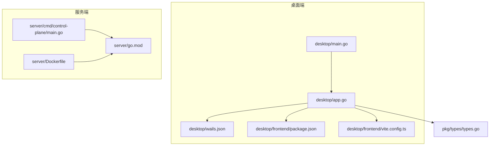
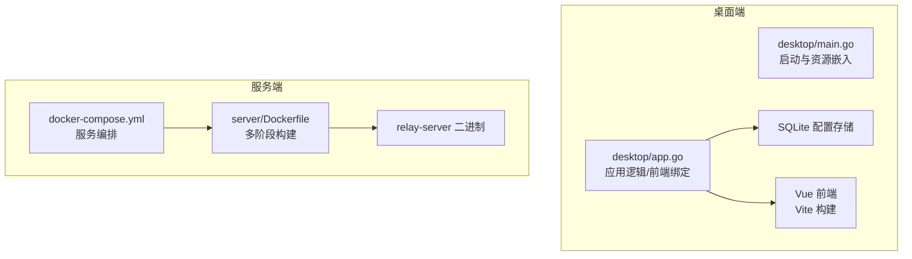
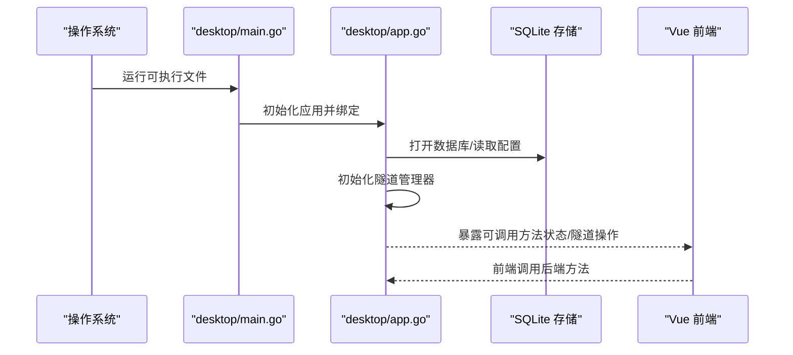
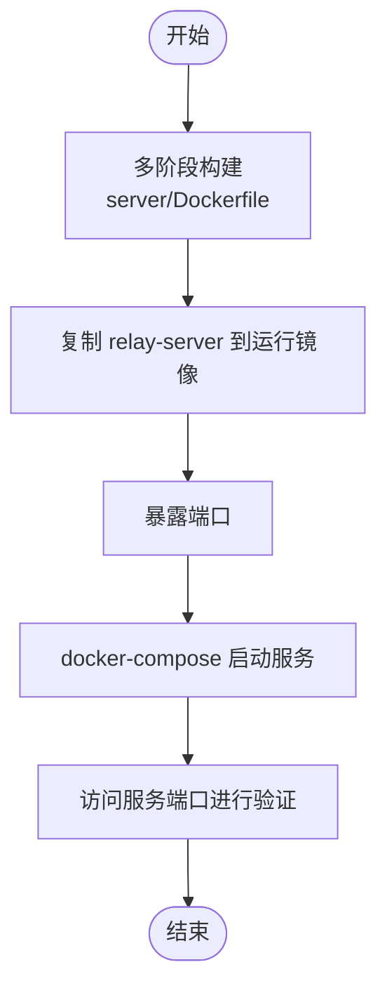
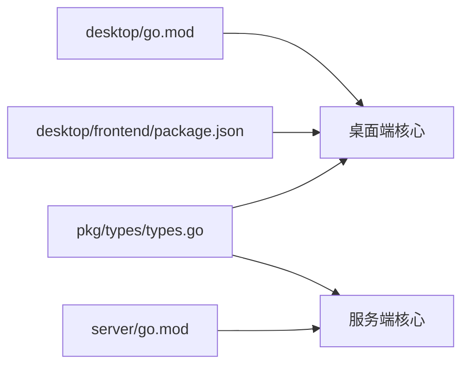

# 快速开始

<cite>
**本文引用的文件**
- [README.md](file://README.md)
- [Makefile](file://Makefile)
- [desktop/wails.json](file://desktop/wails.json)
- [desktop/go.mod](file://desktop/go.mod)
- [desktop/main.go](file://desktop/main.go)
- [desktop/app.go](file://desktop/app.go)
- [desktop/frontend/package.json](file://desktop/frontend/package.json)
- [desktop/frontend/vite.config.ts](file://desktop/frontend/vite.config.ts)
- [desktop/internal/tunnel/tunnel.go](file://desktop/internal/tunnel/tunnel.go)
- [desktop/internal/config/store.go](file://desktop/internal/config/store.go)
- [pkg/types/types.go](file://pkg/types/types.go)
- [server/go.mod](file://server/go.mod)
- [server/cmd/control-plane/main.go](file://server/cmd/control-plane/main.go)
- [server/Dockerfile](file://server/Dockerfile)
- [docker-compose.yml](file://docker-compose.yml)
</cite>

## 目录
1. [简介](#简介)
2. [项目结构](#项目结构)
3. [核心组件](#核心组件)
4. [架构总览](#架构总览)
5. [详细组件分析](#详细组件分析)
6. [依赖分析](#依赖分析)
7. [性能考虑](#性能考虑)
8. [故障排查指南](#故障排查指南)
9. [结论](#结论)
10. [附录](#附录)

## 简介
本指南面向新手开发者，帮助你在 Windows、macOS、Linux 上快速完成 NexTunnel 的安装与运行。内容涵盖系统要求、依赖安装、开发环境搭建、编译构建、桌面端应用打包与服务器端部署，并提供常见问题解决方案与环境验证方法。

## 项目结构
NexTunnel 采用多模块结构：桌面端使用 Wails（Go + Vue），服务端使用 Go，共享协议与类型在 pkg 中定义，便于两端复用。

图表来源
- [desktop/main.go:1-37](file://desktop/main.go#L1-L37)
- [desktop/app.go:1-208](file://desktop/app.go#L1-L208)
- [desktop/wails.json:1-14](file://desktop/wails.json#L1-L14)
- [desktop/frontend/package.json:1-26](file://desktop/frontend/package.json#L1-L26)
- [desktop/frontend/vite.config.ts:1-15](file://desktop/frontend/vite.config.ts#L1-L15)
- [server/go.mod:1-11](file://server/go.mod#L1-L11)
- [server/cmd/control-plane/main.go:1-12](file://server/cmd/control-plane/main.go#L1-L12)
- [server/Dockerfile:1-27](file://server/Dockerfile#L1-L27)
- [pkg/types/types.go:1-50](file://pkg/types/types.go#L1-L50)

章节来源
- [README.md:1-20](file://README.md#L1-L20)
- [Makefile:1-66](file://Makefile#L1-L66)

## 核心组件
- 桌面端应用（Wails）
  - 启动入口与资源嵌入：desktop/main.go
  - 应用逻辑与前端绑定：desktop/app.go
  - 前端工程配置：desktop/frontend/package.json、desktop/frontend/vite.config.ts
  - 构建配置：desktop/wails.json
- 服务端
  - 二进制目标：control-plane、relay、nat-detector
  - 容器化：Dockerfile 与 docker-compose.yml
- 共享类型与协议
  - 类型定义：pkg/types/types.go

章节来源
- [desktop/main.go:1-37](file://desktop/main.go#L1-L37)
- [desktop/app.go:1-208](file://desktop/app.go#L1-L208)
- [desktop/frontend/package.json:1-26](file://desktop/frontend/package.json#L1-L26)
- [desktop/frontend/vite.config.ts:1-15](file://desktop/frontend/vite.config.ts#L1-L15)
- [desktop/wails.json:1-14](file://desktop/wails.json#L1-L14)
- [server/go.mod:1-11](file://server/go.mod#L1-L11)
- [server/cmd/control-plane/main.go:1-12](file://server/cmd/control-plane/main.go#L1-L12)
- [server/Dockerfile:1-27](file://server/Dockerfile#L1-L27)
- [pkg/types/types.go:1-50](file://pkg/types/types.go#L1-L50)

## 架构总览
桌面端通过 Wails 将 Go 逻辑与 Vue 前端整合，启动时加载本地 SQLite 配置并初始化隧道管理器；服务端以容器方式运行中继服务，支持通过 Docker Compose 快速部署。

图表来源
- [desktop/main.go:1-37](file://desktop/main.go#L1-L37)
- [desktop/app.go:1-208](file://desktop/app.go#L1-L208)
- [server/Dockerfile:1-27](file://server/Dockerfile#L1-L27)
- [docker-compose.yml:1-12](file://docker-compose.yml#L1-L12)

## 详细组件分析

### 桌面端应用（Wails + Vue）
- 启动流程
  - main.go 负责创建 Wails 应用实例，设置窗口尺寸、背景色、资源服务器，并绑定应用对象。
  - app.go 在启动时打开本地 SQLite 数据库，读取隧道配置，初始化隧道管理器。
- 前端工程
  - package.json 定义了 Vue 3、Pinia、Vite、ESLint 等依赖与脚本。
  - vite.config.ts 设置别名与输出目录，便于开发与构建。
- 构建与开发
  - wails.json 定义了前端安装、构建、开发命令以及输出可执行文件名。
  - Makefile 提供一键开发（wails dev）、构建（wails build）等目标。

图表来源
- [desktop/main.go:15-36](file://desktop/main.go#L15-L36)
- [desktop/app.go:32-76](file://desktop/app.go#L32-L76)
- [desktop/frontend/package.json:6-11](file://desktop/frontend/package.json#L6-L11)
- [desktop/wails.json:5-8](file://desktop/wails.json#L5-L8)

章节来源
- [desktop/main.go:1-37](file://desktop/main.go#L1-L37)
- [desktop/app.go:1-208](file://desktop/app.go#L1-L208)
- [desktop/frontend/package.json:1-26](file://desktop/frontend/package.json#L1-L26)
- [desktop/frontend/vite.config.ts:1-15](file://desktop/frontend/vite.config.ts#L1-L15)
- [desktop/wails.json:1-14](file://desktop/wails.json#L1-L14)
- [Makefile:15-21](file://Makefile#L15-L21)

### 服务端（Go + Docker）
- 二进制目标
  - control-plane、relay、nat-detector 三个子命令分别对应控制平面、中继服务与 NAT 检测器。
- 容器化
  - Dockerfile 使用多阶段构建，先在 Alpine 编译二进制，再复制到最小运行镜像，暴露端口并设置入口命令。
  - docker-compose.yml 将 relay-server 服务映射到主机端口，便于本地调试与演示。

图表来源
- [server/Dockerfile:1-27](file://server/Dockerfile#L1-L27)
- [docker-compose.yml:1-12](file://docker-compose.yml#L1-L12)

章节来源
- [server/go.mod:1-11](file://server/go.mod#L1-L11)
- [server/cmd/control-plane/main.go:1-12](file://server/cmd/control-plane/main.go#L1-L12)
- [server/Dockerfile:1-27](file://server/Dockerfile#L1-L27)
- [docker-compose.yml:1-12](file://docker-compose.yml#L1-L12)

### 共享类型与协议
- 类型定义
  - ProxyType、ProxyStatus、TunnelConfig、ProxyInfo、ClientInfo 等类型在 pkg/types/types.go 中统一定义，供桌面端与服务端复用。
- 协议
  - 桌面端内部隧道实现使用 pkg/protocol 进行消息编解码与连接桥接。

章节来源
- [pkg/types/types.go:1-50](file://pkg/types/types.go#L1-L50)
- [desktop/internal/tunnel/tunnel.go:1-138](file://desktop/internal/tunnel/tunnel.go#L1-L138)

## 依赖分析
- 桌面端依赖
  - Go 版本要求与第三方库在 desktop/go.mod 中声明；Wails v2 作为 UI/系统集成框架；SQLite 用于本地配置存储。
- 服务端依赖
  - Go 版本要求与第三方库在 server/go.mod 中声明；通过 replace 引用本地 pkg 模块。
- 前端依赖
  - Vue 3、Vite、ESLint 等在 desktop/frontend/package.json 中定义。

图表来源
- [desktop/go.mod:1-49](file://desktop/go.mod#L1-L49)
- [server/go.mod:1-11](file://server/go.mod#L1-L11)
- [pkg/types/types.go:1-50](file://pkg/types/types.go#L1-L50)
- [desktop/frontend/package.json:1-26](file://desktop/frontend/package.json#L1-L26)

章节来源
- [desktop/go.mod:1-49](file://desktop/go.mod#L1-L49)
- [server/go.mod:1-11](file://server/go.mod#L1-L11)
- [desktop/frontend/package.json:1-26](file://desktop/frontend/package.json#L1-L26)

## 性能考虑
- 构建优化
  - 服务端 Dockerfile 使用多阶段构建与静态链接参数，减小镜像体积并提升启动速度。
- 前端构建
  - Vite 提供快速热更新与生产构建能力，建议在生产环境启用压缩与缓存策略。
- 数据库
  - SQLite 适合本地存储与轻量场景，若需要高并发或分布式，可评估替换为外部数据库并在配置层抽象。

## 故障排查指南
- 开发环境未就绪
  - 症状：执行 make dev 或 wails dev 报错。
  - 排查：确认已安装 Node.js、npm、Go、Wails CLI；执行 make install-deps 安装依赖。
- 前端构建失败
  - 症状：npm run build 失败或端口占用。
  - 排查：检查 desktop/frontend/package.json 中脚本与依赖版本；清理 node_modules 并重新安装。
- 桌面端无法启动
  - 症状：应用启动即退出或无界面。
  - 排查：查看 desktop/main.go 中资源嵌入路径是否正确；确认 wails.json 的前端构建产物存在。
- 服务器端无法访问
  - 症状：浏览器无法访问 relay 端口。
  - 排查：检查 docker-compose.yml 映射端口与容器日志；确认防火墙放行相应端口。
- 数据库相关错误
  - 症状：启动时报数据库打开失败或查询异常。
  - 排查：确认 SQLite 文件权限与路径；检查 desktop/internal/config/store.go 中 SQL 语句与表结构。

章节来源
- [Makefile:60-66](file://Makefile#L60-L66)
- [desktop/frontend/package.json:6-11](file://desktop/frontend/package.json#L6-L11)
- [desktop/main.go:12-24](file://desktop/main.go#L12-L24)
- [docker-compose.yml:8-11](file://docker-compose.yml#L8-L11)
- [desktop/internal/config/store.go:34-43](file://desktop/internal/config/store.go#L34-L43)

## 结论
通过本指南，你可以在三类主流操作系统上完成 NexTunnel 的安装与运行：桌面端使用 Wails + Vue，服务端使用 Docker 容器化部署。建议先从 Makefile 提供的一键命令入手，逐步掌握开发与构建流程，并结合故障排查清单定位问题。

## 附录

### 系统要求与依赖
- Go
  - 桌面端：>= 1.25（参考 desktop/go.mod）
  - 服务端：>= 1.23（参考 server/go.mod）
- Node.js 与 npm
  - 用于前端开发与构建（参考 desktop/frontend/package.json）
- Wails CLI
  - 用于桌面端开发与打包（参考 desktop/wails.json）

章节来源
- [desktop/go.mod:3](file://desktop/go.mod#L3)
- [server/go.mod:3](file://server/go.mod#L3)
- [desktop/frontend/package.json:1-26](file://desktop/frontend/package.json#L1-L26)
- [desktop/wails.json:1-14](file://desktop/wails.json#L1-L14)

### 安装与运行步骤（通用）
- 安装依赖
  - 执行 make install-deps 安装 Go 与前端依赖。
- 开发模式
  - 执行 make dev 启动桌面端开发服务器。
- 生产构建
  - 执行 make build 生成桌面端可执行文件。
  - 执行 make build-server 编译服务端二进制。
- 服务器部署
  - 使用 docker-compose.yml 启动 relay 服务；或直接使用 server/Dockerfile 构建镜像。

章节来源
- [Makefile:60-66](file://Makefile#L60-L66)
- [Makefile:15-27](file://Makefile#L15-L27)
- [docker-compose.yml:1-12](file://docker-compose.yml#L1-L12)
- [server/Dockerfile:1-27](file://server/Dockerfile#L1-L27)

### 不同操作系统建议
- Windows
  - 安装 WSL2（可选）以获得更一致的 Unix 工具链；或直接在 PowerShell 中使用 Git Bash。
  - 确保 Go、Node.js、npm、Wails CLI 可用。
- macOS
  - 使用 Homebrew 安装依赖；Xcode Command Line Tools 用于 CGO（如需）。
- Linux
  - 使用发行版包管理器安装 Go、Node.js、npm；必要时安装 libgtk、libwebkit2gtk 等 Wails 运行依赖。

### 环境验证方法
- 前端验证
  - 运行 npm run dev 后访问本地开发地址，确认页面正常加载。
- 桌面端验证
  - 运行 wails dev 或 wails build 后启动应用，检查窗口与功能按钮可用。
- 服务端验证
  - 使用 docker-compose 启动后，访问映射端口，确认服务响应。

章节来源
- [desktop/frontend/package.json:7-10](file://desktop/frontend/package.json#L7-L10)
- [desktop/wails.json:5-8](file://desktop/wails.json#L5-L8)
- [docker-compose.yml:8-11](file://docker-compose.yml#L8-L11)