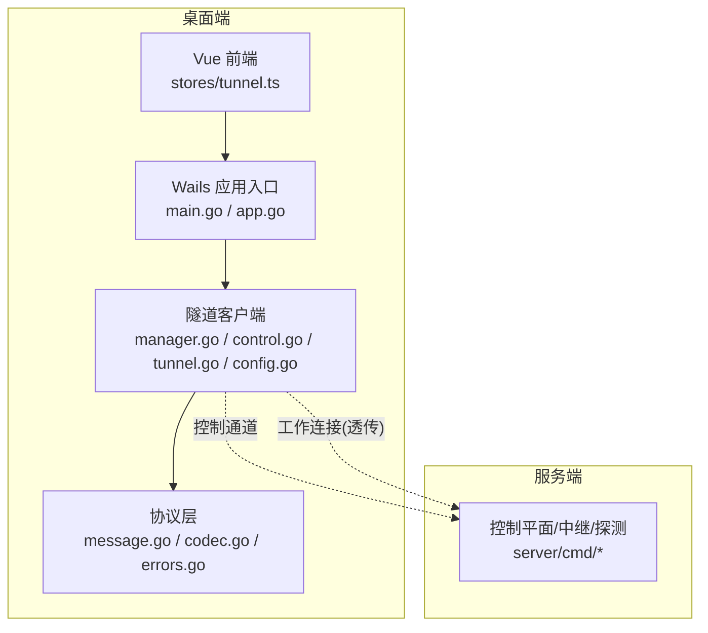
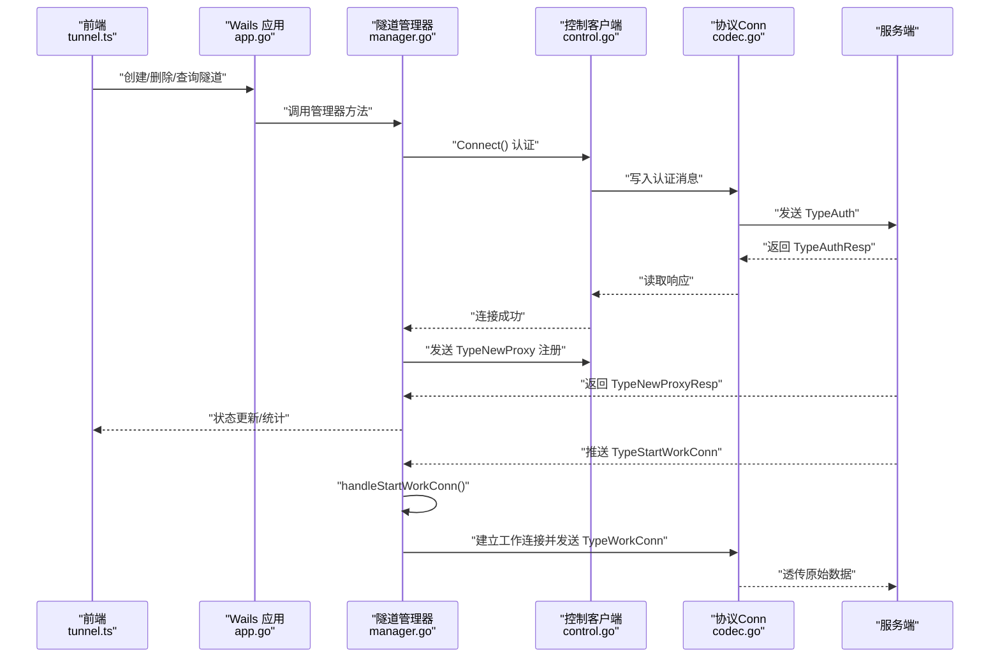
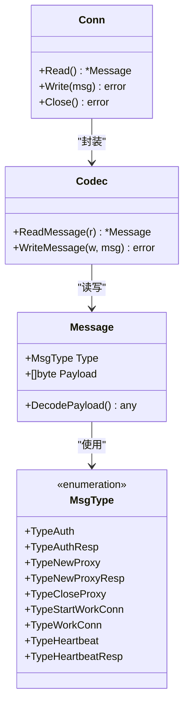
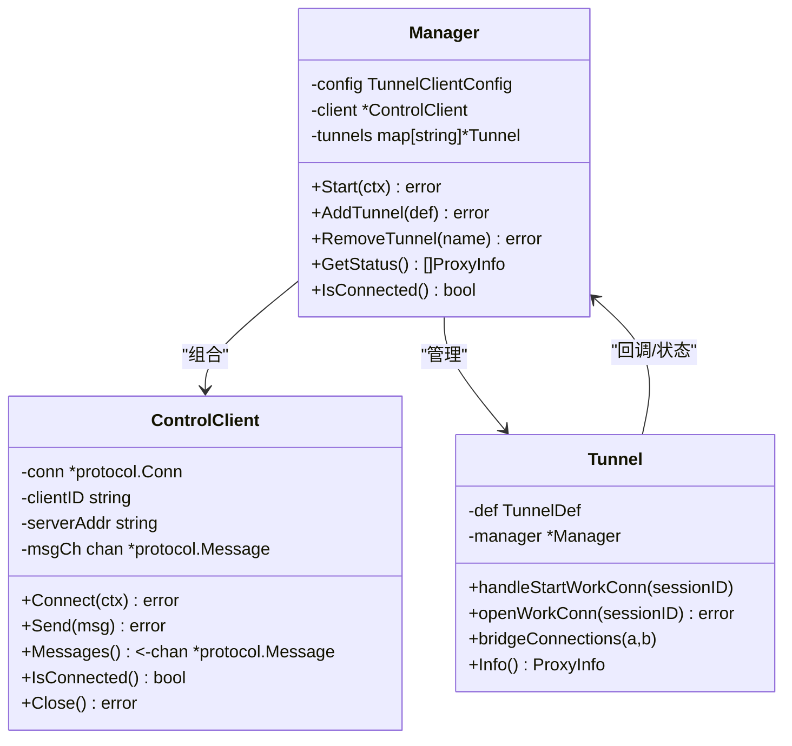
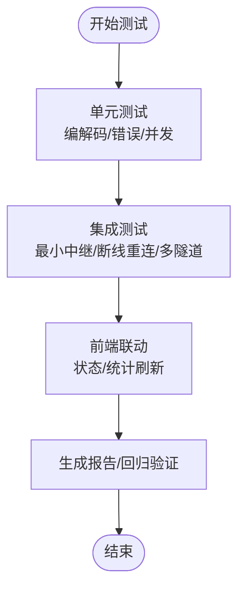
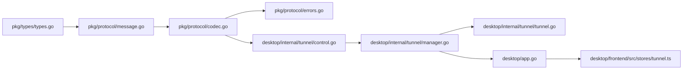

# 扩展开发

<cite>
**本文引用的文件**
- [README.md](file://README.md)
- [message.go](file://pkg/protocol/message.go)
- [codec.go](file://pkg/protocol/codec.go)
- [errors.go](file://pkg/protocol/errors.go)
- [types.go](file://pkg/types/types.go)
- [tunnel.go](file://desktop/internal/tunnel/tunnel.go)
- [manager.go](file://desktop/internal/tunnel/manager.go)
- [control.go](file://desktop/internal/tunnel/control.go)
- [config.go](file://desktop/internal/tunnel/config.go)
- [app.go](file://desktop/app.go)
- [main.go](file://desktop/main.go)
- [tunnel.ts](file://desktop/frontend/src/stores/tunnel.ts)
- [codec_test.go](file://pkg/protocol/codec_test.go)
- [integration_test.go](file://desktop/internal/tunnel/integration_test.go)
- [doc.go](file://pkg/crypto/doc.go)
</cite>

## 目录
1. [简介](#简介)
2. [项目结构](#项目结构)
3. [核心组件](#核心组件)
4. [架构总览](#架构总览)
5. [详细组件分析](#详细组件分析)
6. [依赖分析](#依赖分析)
7. [性能考虑](#性能考虑)
8. [故障排查指南](#故障排查指南)
9. [结论](#结论)
10. [附录](#附录)

## 简介
本指南面向希望在 NexTunnel 上进行扩展开发的高级开发者，系统阐述如何识别扩展点、设计插件接口、扩展自定义协议与消息类型、实现兼容性策略，并提供测试与集成验证方法。同时覆盖现有功能的定制化修改、新功能模块开发以及第三方集成方案，总结最佳实践、性能与安全要点。

## 项目结构
NexTunnel 采用前后端分离的桌面端架构：Go 后端通过 Wails 暴露 API 给 Vue 前端；协议层位于独立包中，客户端隧道模块负责控制通道与工作连接的建立与数据桥接；服务端由多个子命令组成（控制平面、中继、NAT 探测等），当前仓库主要关注桌面端与协议层。

图表来源
- [main.go:15-36](file://desktop/main.go#L15-L36)
- [app.go:17-76](file://desktop/app.go#L17-L76)
- [manager.go:16-58](file://desktop/internal/tunnel/manager.go#L16-L58)
- [control.go:15-38](file://desktop/internal/tunnel/control.go#L15-L38)
- [tunnel.go:16-36](file://desktop/internal/tunnel/tunnel.go#L16-L36)
- [message.go:1-28](file://pkg/protocol/message.go#L1-L28)
- [codec.go:16-39](file://pkg/protocol/codec.go#L16-L39)

章节来源
- [README.md:1-20](file://README.md#L1-L20)
- [main.go:1-37](file://desktop/main.go#L1-L37)
- [app.go:1-76](file://desktop/app.go#L1-L76)

## 核心组件
- 协议层：定义消息类型、版本、编解码与错误；提供统一的消息构造器与解码工厂。
- 隧道客户端：负责控制连接认证、心跳、注册/注销隧道、接收工作连接请求并建立工作连接、桥接数据。
- 类型系统：共享的代理类型、状态与运行时信息，确保前后端一致的数据契约。
- 前端存储：Pinia Store 封装隧道 CRUD 与状态刷新，调用 Wails 暴露的后端 API。

章节来源
- [message.go:6-28](file://pkg/protocol/message.go#L6-L28)
- [codec.go:16-63](file://pkg/protocol/codec.go#L16-L63)
- [manager.go:16-58](file://desktop/internal/tunnel/manager.go#L16-L58)
- [control.go:15-38](file://desktop/internal/tunnel/control.go#L15-L38)
- [tunnel.go:16-36](file://desktop/internal/tunnel/tunnel.go#L16-L36)
- [types.go:6-49](file://pkg/types/types.go#L6-L49)
- [tunnel.ts:1-83](file://desktop/frontend/src/stores/tunnel.ts#L1-L83)

## 架构总览
下图展示从前端到后端的典型交互路径：前端通过 Wails 调用后端隧道管理器，后者通过控制连接与服务端握手、注册隧道；当有外部请求到达时，服务端触发工作连接请求，客户端据此建立工作连接并桥接数据。

图表来源
- [tunnel.ts:34-70](file://desktop/frontend/src/stores/tunnel.ts#L34-L70)
- [app.go:110-139](file://desktop/app.go#L110-L139)
- [manager.go:82-112](file://desktop/internal/tunnel/manager.go#L82-L112)
- [control.go:40-95](file://desktop/internal/tunnel/control.go#L40-L95)
- [codec.go:41-63](file://pkg/protocol/codec.go#L41-L63)
- [message.go:83-153](file://pkg/protocol/message.go#L83-L153)

## 详细组件分析

### 协议扩展点与消息类型
- 消息类型枚举与版本常量集中定义，便于扩展与兼容控制。
- 编解码器提供统一的头部格式（类型+长度）与最大载荷限制，保证传输安全与稳定性。
- 解码工厂根据类型分派到具体负载结构，新增消息需配套类型、负载结构与构造器。

图表来源
- [message.go:6-28](file://pkg/protocol/message.go#L6-L28)
- [message.go:83-153](file://pkg/protocol/message.go#L83-L153)
- [codec.go:16-63](file://pkg/protocol/codec.go#L16-L63)

章节来源
- [message.go:6-28](file://pkg/protocol/message.go#L6-L28)
- [message.go:165-194](file://pkg/protocol/message.go#L165-L194)
- [codec.go:16-63](file://pkg/protocol/codec.go#L16-L63)
- [errors.go:5-14](file://pkg/protocol/errors.go#L5-L14)

### 隧道客户端扩展点
- 控制连接：负责认证、心跳、消息收发与断线重连。
- 隧道管理器：负责批量注册、动态增删、状态聚合与心跳循环。
- 工作连接：收到服务端工作连接请求后，建立到本地服务的连接并双向桥接数据。

图表来源
- [control.go:15-38](file://desktop/internal/tunnel/control.go#L15-L38)
- [manager.go:16-58](file://desktop/internal/tunnel/manager.go#L16-L58)
- [tunnel.go:16-36](file://desktop/internal/tunnel/tunnel.go#L16-L36)

章节来源
- [control.go:40-95](file://desktop/internal/tunnel/control.go#L40-L95)
- [manager.go:114-156](file://desktop/internal/tunnel/manager.go#L114-L156)
- [tunnel.go:38-85](file://desktop/internal/tunnel/tunnel.go#L38-L85)

### 自定义协议扩展指南
目标：在不破坏现有协议的前提下，新增消息类型与负载结构，确保向后兼容。

步骤
1. 在消息类型枚举中新增类型常量，保持数值唯一且与服务端约定一致。
2. 定义新的负载结构体，遵循 JSON 字段命名规范，确保可序列化。
3. 实现消息构造器函数，统一使用工厂方法生成消息。
4. 在解码工厂中增加类型分支，将字节负载反序列化为新结构体。
5. 在编解码器中确认头部格式与最大载荷限制仍适用。
6. 在控制客户端与隧道管理器中增加对该消息类型的处理分支。
7. 为新增消息编写单元测试与集成测试，覆盖边界条件与并发场景。

兼容性考虑
- 版本号字段用于区分协议演进，建议在消息头或负载中携带版本号以便服务端/客户端协商。
- 对未知类型应返回明确错误，避免静默失败。
- 新增字段应向后兼容，旧端忽略未知字段；避免删除或重排已有字段。

章节来源
- [message.go:9-19](file://pkg/protocol/message.go#L9-L19)
- [message.go:32-80](file://pkg/protocol/message.go#L32-L80)
- [message.go:83-153](file://pkg/protocol/message.go#L83-L153)
- [message.go:165-194](file://pkg/protocol/message.go#L165-L194)
- [codec.go:16-63](file://pkg/protocol/codec.go#L16-L63)
- [codec_test.go:11-78](file://pkg/protocol/codec_test.go#L11-L78)

### 插件开发与扩展点
- 插件接口定义：以“消息类型 + 负载结构 + 处理器”为核心，通过注册表或 switch 分支接入控制通道消息处理。
- 扩展点识别：控制连接消息处理、工作连接建立、心跳与健康检查、隧道生命周期事件。
- 开发示例：新增审计日志插件，拦截特定消息类型并写入持久化存储；或新增鉴权插件，在认证阶段插入额外校验逻辑。
- 第三方集成：通过 Wails 绑定方法暴露插件能力给前端，或在服务端侧扩展控制平面以支持插件钩子。

章节来源
- [manager.go:158-197](file://desktop/internal/tunnel/manager.go#L158-L197)
- [control.go:97-122](file://desktop/internal/tunnel/control.go#L97-L122)
- [app.go:87-203](file://desktop/app.go#L87-L203)

### 测试方法与集成验证
- 单元测试：针对消息编解码、错误场景（超长载荷、截断、空读取）、并发读写进行覆盖。
- 集成测试：搭建最小化中继，模拟控制通道与工作连接流程，验证断线重连、多隧道、流量统计等端到端行为。
- 前端联动：通过 Pinia Store 刷新隧道状态与统计数据，确保 UI 与后端状态一致。

图表来源
- [codec_test.go:11-78](file://pkg/protocol/codec_test.go#L11-L78)
- [codec_test.go:125-138](file://pkg/protocol/codec_test.go#L125-L138)
- [codec_test.go:191-232](file://pkg/protocol/codec_test.go#L191-L232)
- [integration_test.go:193-298](file://desktop/internal/tunnel/integration_test.go#L193-L298)
- [integration_test.go:446-534](file://desktop/internal/tunnel/integration_test.go#L446-L534)

章节来源
- [codec_test.go:117-189](file://pkg/protocol/codec_test.go#L117-L189)
- [codec_test.go:234-259](file://pkg/protocol/codec_test.go#L234-L259)
- [integration_test.go:193-298](file://desktop/internal/tunnel/integration_test.go#L193-L298)
- [integration_test.go:446-534](file://desktop/internal/tunnel/integration_test.go#L446-L534)

### 现有功能定制化与新模块开发
- 定制化修改：在隧道定义中增加可选字段（如域名、主机头、HTTPS 标记），通过工厂方法自动选择合适的消息构造器。
- 新功能模块：新增 UDP 支持（预留类型）、HTTP/2 或 TLS 加密透传，均需在类型系统、消息构造与处理逻辑中同步扩展。
- 第三方集成：通过 Wails 方法暴露外部服务（如配置中心、监控系统）的查询与更新能力，前端 Store 调用这些方法实现可视化管理。

章节来源
- [config.go:16-26](file://desktop/internal/tunnel/config.go#L16-L26)
- [manager.go:302-309](file://desktop/internal/tunnel/manager.go#L302-L309)
- [types.go:9-13](file://pkg/types/types.go#L9-L13)
- [tunnel.ts:34-70](file://desktop/frontend/src/stores/tunnel.ts#L34-L70)
- [app.go:150-182](file://desktop/app.go#L150-L182)

## 依赖分析
- 协议层被隧道客户端直接依赖，提供统一的网络帧格式与错误语义。
- 隧道客户端被 Wails 应用绑定方法依赖，作为前端 API 的后端实现。
- 类型系统在协议层与应用层之间提供契约一致性保障。
- 前端 Store 仅通过 Wails 暴露的方法与后端交互，降低耦合度。

图表来源
- [types.go:1-50](file://pkg/types/types.go#L1-L50)
- [message.go:1-203](file://pkg/protocol/message.go#L1-L203)
- [codec.go:1-131](file://pkg/protocol/codec.go#L1-L131)
- [errors.go:1-15](file://pkg/protocol/errors.go#L1-L15)
- [control.go:1-155](file://desktop/internal/tunnel/control.go#L1-L155)
- [manager.go:1-310](file://desktop/internal/tunnel/manager.go#L1-L310)
- [tunnel.go:1-138](file://desktop/internal/tunnel/tunnel.go#L1-L138)
- [app.go:1-208](file://desktop/app.go#L1-L208)
- [tunnel.ts:1-83](file://desktop/frontend/src/stores/tunnel.ts#L1-L83)

章节来源
- [types.go:1-50](file://pkg/types/types.go#L1-L50)
- [message.go:1-203](file://pkg/protocol/message.go#L1-L203)
- [codec.go:1-131](file://pkg/protocol/codec.go#L1-L131)
- [control.go:1-155](file://desktop/internal/tunnel/control.go#L1-L155)
- [manager.go:1-310](file://desktop/internal/tunnel/manager.go#L1-L310)
- [tunnel.go:1-138](file://desktop/internal/tunnel/tunnel.go#L1-L138)
- [app.go:1-208](file://desktop/app.go#L1-L208)
- [tunnel.ts:1-83](file://desktop/frontend/src/stores/tunnel.ts#L1-L83)

## 性能考虑
- 连接复用与并发：控制连接采用单工读循环与带缓冲的消息通道，避免阻塞；工作连接使用 io.Copy 双向桥接，注意背压与资源回收。
- 轮询与心跳：心跳间隔可配置，默认周期适中，避免频繁 IO；断线退避策略指数级增长，上限可控。
- 载荷大小：编解码器限制最大载荷，防止内存膨胀；业务层也应避免发送过大的 JSON 负载。
- 日志与可观测性：在关键路径保留必要日志，避免高频写入影响性能；状态聚合与统计按需刷新。

## 故障排查指南
- 认证失败：检查客户端 ID 与服务端期望是否一致；确认 TypeAuthResp 返回的错误信息。
- 注册失败：核对 TypeNewProxyResp 中的错误字段；确认服务端已启用对应代理类型。
- 心跳异常：检查心跳定时器与响应链路；确认网络抖动与防火墙策略。
- 工作连接失败：验证本地服务可达性与端口占用；检查服务端是否正确转发 StartWorkConn 请求。
- 并发问题：关注读写锁与关闭状态保护；确保关闭后不再读写。
- 单元测试与集成测试：利用现有测试用例定位问题范围，优先复现并缩小问题上下文。

章节来源
- [control.go:40-95](file://desktop/internal/tunnel/control.go#L40-L95)
- [manager.go:158-197](file://desktop/internal/tunnel/manager.go#L158-L197)
- [codec.go:65-131](file://pkg/protocol/codec.go#L65-L131)
- [codec_test.go:117-189](file://pkg/protocol/codec_test.go#L117-L189)
- [integration_test.go:193-298](file://desktop/internal/tunnel/integration_test.go#L193-L298)

## 结论
NexTunnel 的协议层与隧道客户端提供了清晰的扩展点与成熟的测试体系。通过在消息类型、负载结构与处理逻辑上进行增量扩展，并严格遵循兼容性与测试策略，即可在不破坏现有功能的前提下快速迭代新特性与第三方集成方案。

## 附录
- 最佳实践
  - 以“类型 + 负载 + 处理器”的模式组织扩展，保持职责单一。
  - 新增字段向后兼容，避免破坏旧版本客户端。
  - 为每个扩展编写单元测试与集成测试，覆盖正常与异常路径。
  - 使用断线退避与心跳保活机制提升鲁棒性。
- 安全要求
  - 强制校验载荷大小与类型，拒绝异常帧。
  - 在认证阶段引入更强的身份与权限校验（如 JWT/签名）。
  - 对敏感字段（如客户端 ID、令牌）进行最小暴露与加密存储。
- 创新开发思路
  - 引入插件化控制通道处理器，支持动态加载与热更新。
  - 增加多路复用与压缩算法，优化高延迟网络下的吞吐。
  - 扩展服务端侧的路由与负载均衡能力，配合客户端动态发现。