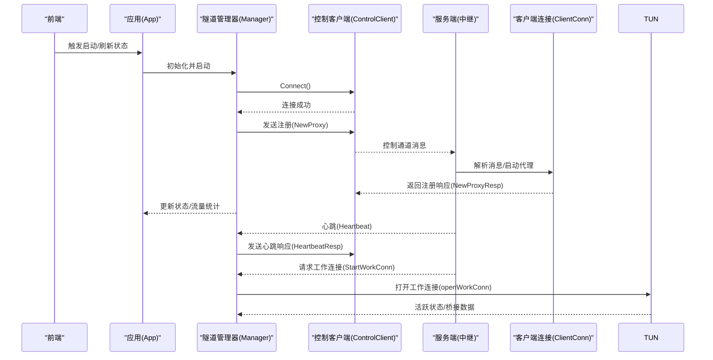
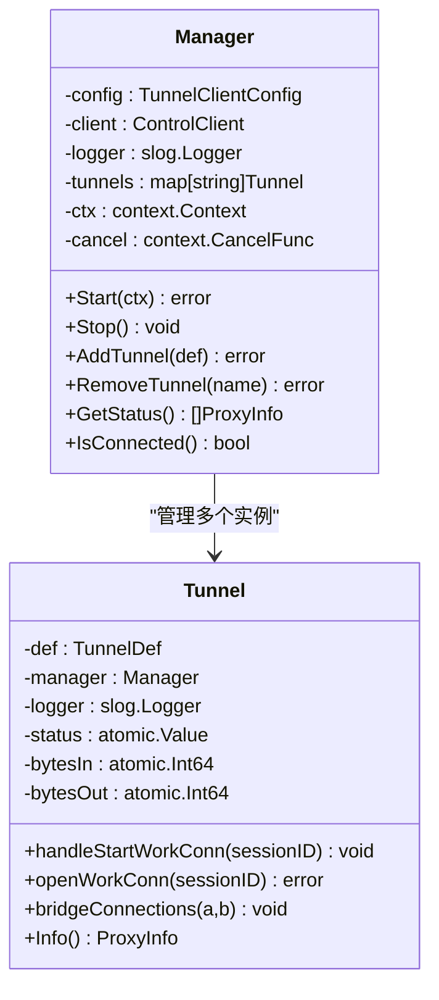
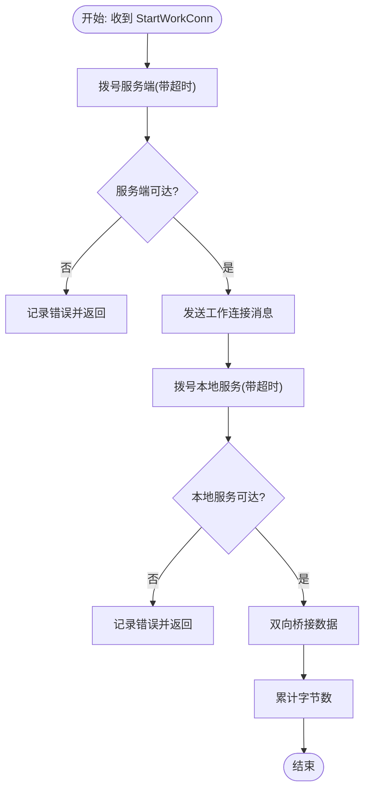
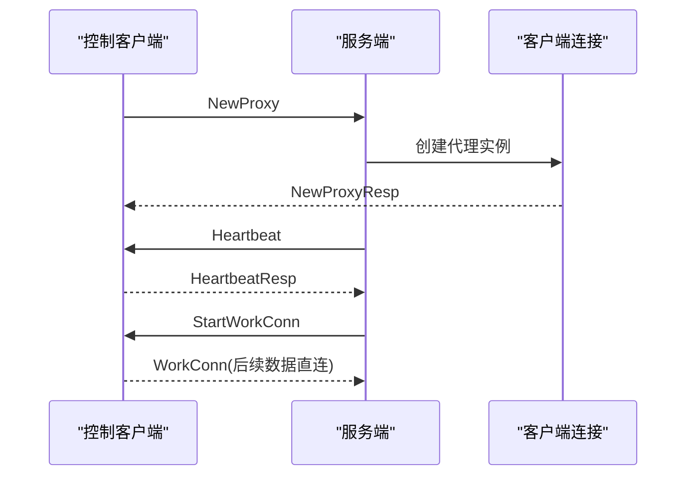
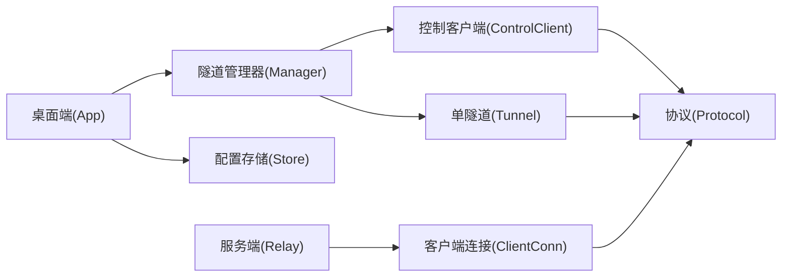
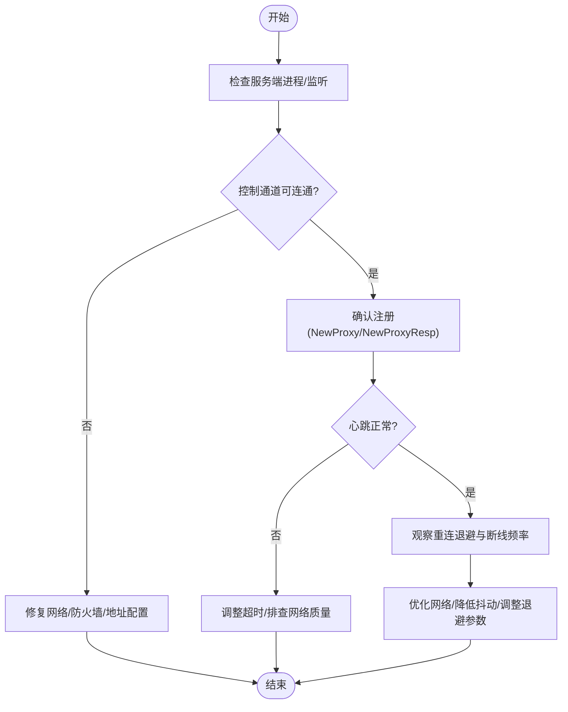

# 故障排除

<cite>
**本文引用的文件**
- [README.md](file://README.md)
- [main.go](file://desktop/main.go)
- [app.go](file://desktop/app.go)
- [tunnel.go](file://desktop/inner-tunnel/tunnel.go)
- [manager.go](file://desktop/inner-tunnel/manager.go)
- [reconnect.go](file://desktop/inner-tunnel/reconnect.go)
- [store.go](file://desktop/inner-config/store.go)
- [message.go](file://pkg/protocol/message.go)
- [errors.go](file://pkg/protocol/errors.go)
- [types.go](file://pkg/types/types.go)
- [client_conn.go](file://server/internal/relay/client_conn.go)
- [main.go](file://server/cmd/relay/main.go)
- [tunnel.ts](file://desktop/frontend/src/stores/tunnel.ts)
</cite>

## 目录
1. [简介](#简介)
2. [项目结构](#项目结构)
3. [核心组件](#核心组件)
4. [架构总览](#架构总览)
5. [详细组件分析](#详细组件分析)
6. [依赖分析](#依赖分析)
7. [性能考虑](#性能考虑)
8. [故障排除指南](#故障排除指南)
9. [结论](#结论)
10. [附录](#附录)

## 简介
本指南面向技术支持与高级用户，围绕 NexTunnel 的连接、性能与配置问题提供系统化故障排除方法。内容涵盖日志分析、关键日志解读、调试信息收集、典型场景处理（网络连接、认证失败、隧道异常）、性能瓶颈识别与优化建议，并给出可操作的问题排查流程与根因分析方法。

## 项目结构
NexTunnel 采用前后端分离与模块化设计：桌面端（Wails + Vue）负责本地隧道配置与状态展示；服务端（Go HTTP 服务）负责控制通道与转发会话管理；公共协议与类型在 pkg 中共享。

```mermaid
graph TB
subgraph "桌面端"
FE["前端界面<br/>Pinia 状态管理"]
APP["应用入口<br/>Wails 启动"]
TMAN["隧道管理器<br/>连接/注册/心跳"]
TUN["单隧道实例<br/>工作连接桥接"]
CFG["配置存储<br/>SQLite"]
end
subgraph "服务端"
RELAY["中继服务<br/>控制通道/代理实例"]
CTRL["客户端连接<br/>消息读写/心跳定时器"]
end
subgraph "协议层"
PROT["协议消息/类型定义"]
end
FE --> APP
APP --> TMAN
TMAN --> TUN
APP --> CFG
TMAN <- --> PROT
TUN --> PROT
RELAY --> CTRL
CTRL --> PROT
```

图表来源
- [main.go:15-36](file://desktop/main.go#L15-L36)
- [app.go:32-67](file://desktop/app.go#L32-L67)
- [manager.go:16-58](file://desktop/inner-tunnel/manager.go#L16-L58)
- [tunnel.go:16-36](file://desktop/inner-tunnel/tunnel.go#L16-L36)
- [store.go:23-31](file://desktop/inner-config/store.go#L23-L31)
- [client_conn.go:14-43](file://server/internal/relay/client_conn.go#L14-L43)
- [message.go:24-28](file://pkg/protocol/message.go#L24-L28)

章节来源
- [README.md:1-20](file://README.md#L1-L20)
- [main.go:1-37](file://desktop/main.go#L1-L37)
- [app.go:1-208](file://desktop/app.go#L1-L208)

## 核心组件
- 隧道管理器（Manager）：负责与服务端建立控制连接、注册所有隧道、发送心跳、处理服务端消息、动态增删隧道、统计流量与状态。
- 单隧道实例（Tunnel）：封装单条隧道的工作连接生命周期，负责与服务端握手、与本地服务建立连接，并进行双向数据桥接。
- 控制客户端（ControlClient）：封装控制通道的读写、消息发送与接收、连接状态判断与关闭。
- 服务端客户端连接（ClientConn）：服务端侧维护每个客户端连接，解析控制消息、启动/停止代理、心跳超时检测与清理。
- 协议层（protocol）：定义消息类型、负载结构、工厂函数与解码逻辑。
- 类型层（types）：统一代理类型、状态、运行时信息等共享结构。
- 前端状态（Pinia）：拉取隧道列表、连接状态与流量统计，驱动 UI 展示。

章节来源
- [manager.go:16-58](file://desktop/inner-tunnel/manager.go#L16-L58)
- [tunnel.go:16-36](file://desktop/inner-tunnel/tunnel.go#L16-L36)
- [client_conn.go:14-43](file://server/internal/relay/client_conn.go#L14-L43)
- [message.go:6-22](file://pkg/protocol/message.go#L6-L22)
- [types.go:6-22](file://pkg/types/types.go#L6-L22)
- [tunnel.ts:23-82](file://desktop/frontend/src/stores/tunnel.ts#L23-L82)

## 架构总览
下图展示了从桌面端发起隧道注册到服务端建立工作连接的关键交互序列。



图表来源
- [manager.go:67-112](file://desktop/inner-tunnel/manager.go#L67-L112)
- [client_conn.go:45-82](file://server/internal/relay/client_conn.go#L45-L82)
- [message.go:109-153](file://pkg/protocol/message.go#L109-L153)
- [tunnel.go:47-84](file://desktop/inner-tunnel/tunnel.go#L47-L84)

## 详细组件分析

### 组件A：隧道管理器（Manager）
职责与行为
- 初始化与日志注入：支持外部注入日志器，便于统一输出。
- 启动与重连：通过指数退避策略自动重连，连接成功后执行注册与心跳循环。
- 注册流程：向服务端发送 NewProxy 并等待 NewProxyResp，记录远程端口与状态。
- 消息处理：处理 StartWorkConn、Heartbeat、HeartbeatResp 等消息。
- 动态增删隧道：AddTunnel/RemoveTunnel 支持运行时变更。
- 状态与统计：聚合各隧道状态与流量，供前端展示。



图表来源
- [manager.go:16-58](file://desktop/inner-tunnel/manager.go#L16-L58)
- [tunnel.go:16-36](file://desktop/inner-tunnel/tunnel.go#L16-L36)

章节来源
- [manager.go:65-310](file://desktop/inner-tunnel/manager.go#L65-L310)

### 组件B：单隧道实例（Tunnel）
职责与行为
- 工作连接生命周期：与服务端握手、与本地服务建立连接、双向桥接数据。
- 状态与计数：原子更新入/出字节，维护活跃/非活跃状态。
- 错误日志：对拨号失败、桥接结束等事件进行调试级日志记录。



图表来源
- [tunnel.go:47-84](file://desktop/inner-tunnel/tunnel.go#L47-L84)
- [tunnel.go:87-124](file://desktop/inner-tunnel/tunnel.go#L87-L124)

章节来源
- [tunnel.go:38-138](file://desktop/inner-tunnel/tunnel.go#L38-L138)

### 组件C：控制通道与服务端交互
职责与行为
- 客户端侧：读取控制消息、发送心跳响应、处理意外消息类型。
- 服务端侧：解析 NewProxy/CloseProxy/Heartbeat，启动或停止代理，设置心跳超时定时器，超时关闭连接并清理代理。



图表来源
- [client_conn.go:45-82](file://server/internal/relay/client_conn.go#L45-L82)
- [client_conn.go:164-170](file://server/internal/relay/client_conn.go#L164-L170)
- [message.go:109-153](file://pkg/protocol/message.go#L109-L153)

章节来源
- [client_conn.go:45-181](file://server/internal/relay/client_conn.go#L45-L181)
- [message.go:165-194](file://pkg/protocol/message.go#L165-L194)

## 依赖分析
- 日志：桌面端与服务端均使用结构化日志（slog），便于过滤与检索。
- 协议：消息类型与负载结构在 pkg/protocol 中集中定义，两端一致。
- 类型：共享类型在 pkg/types 中定义，确保两端状态与统计字段一致。
- 数据库：桌面端使用 SQLite 存储隧道配置与应用设置，提供 CRUD 能力。



图表来源
- [app.go:17-30](file://desktop/app.go#L17-L30)
- [manager.go:16-58](file://desktop/inner-tunnel/manager.go#L16-L58)
- [store.go:23-31](file://desktop/inner-config/store.go#L23-L31)
- [client_conn.go:14-43](file://server/internal/relay/client_conn.go#L14-L43)
- [message.go:24-28](file://pkg/protocol/message.go#L24-L28)

章节来源
- [app.go:1-208](file://desktop/app.go#L1-L208)
- [store.go:1-165](file://desktop/inner-config/store.go#L1-L165)
- [client_conn.go:1-216](file://server/internal/relay/client_conn.go#L1-L216)
- [message.go:1-203](file://pkg/protocol/message.go#L1-L203)

## 性能考虑
- 流量统计：每条隧道独立统计入/出字节，聚合后供前端展示，可用于识别高流量隧道与异常峰值。
- 心跳与超时：客户端与服务端分别维护心跳与超时机制，避免僵尸连接占用资源。
- 指数退避重连：降低网络抖动导致的频繁重试压力，提升稳定性。
- I/O 模式：工作连接阶段采用原始 TCP 直连桥接，减少协议开销，提高吞吐。

章节来源
- [tunnel.go:126-137](file://desktop/inner-tunnel/tunnel.go#L126-L137)
- [manager.go:199-217](file://desktop/inner-tunnel/manager.go#L199-L217)
- [client_conn.go:172-181](file://server/internal/relay/client_conn.go#L172-L181)
- [reconnect.go:39-82](file://desktop/inner-tunnel/reconnect.go#L39-L82)

## 故障排除指南

### 一、日志分析与调试
- 日志级别
  - Info：常规运行状态、注册成功、连接断开等。
  - Warn：未知消息类型、工作连接请求未找到对应隧道等。
  - Error：拨号失败、写入/读取错误、注册失败等。
- 关键日志定位
  - 桌面端 Manager/ControlClient：连接失败、注册失败、心跳发送失败、意外消息类型。
  - 服务端 ClientConn：控制通道读取错误、代理启动失败、心跳超时、关闭连接。
- 调试信息收集
  - 启动参数：服务端支持周期性统计日志间隔，便于观察运行期指标。
  - 前端状态：获取连接状态与流量统计，辅助定位问题阶段。

章节来源
- [manager.go:44-50](file://desktop/inner-tunnel/manager.go#L44-L50)
- [client_conn.go:46-82](file://server/internal/relay/client_conn.go#L46-L82)
- [main.go:15-59](file://server/cmd/relay/main.go#L15-L59)
- [tunnel.ts:63-70](file://desktop/frontend/src/stores/tunnel.ts#L63-L70)

### 二、连接问题排查流程
- 步骤1：确认服务端进程与监听
  - 检查服务端是否正常启动并打印统计日志。
- 步骤2：检查控制通道连通性
  - 查看桌面端日志中的“连接失败”“控制通道读取错误”等。
  - 使用网络连通性工具验证服务端地址与端口。
- 步骤3：核对注册流程
  - 桌面端日志应显示“隧道已注册/远程端口”；若无响应或报错，检查 NewProxyResp 是否返回。
- 步骤4：心跳与超时
  - 若出现“心跳超时，关闭连接”，检查网络延迟与丢包情况，适当增大超时阈值（服务端配置项）。
- 步骤5：重连与退避
  - 若频繁断线，关注指数退避是否被触发，结合 Info 级日志观察重连次数与延迟。



图表来源
- [client_conn.go:172-181](file://server/internal/relay/client_conn.go#L172-L181)
- [manager.go:83-112](file://desktop/inner-tunnel/manager.go#L83-L112)
- [main.go:15-59](file://server/cmd/relay/main.go#L15-L59)

### 三、配置错误处理
- 隧道配置缺失或重复
  - 服务端侧若已达最大代理数量或名称冲突，将返回注册失败；检查配置与命名。
- 本地服务不可达
  - 拨号本地服务失败的日志明确指出目标地址；确认本地服务监听地址与端口正确。
- 服务器地址与端口
  - 确认桌面端配置中的服务端地址与端口与实际部署一致。

章节来源
- [client_conn.go:92-103](file://server/internal/relay/client_conn.go#L92-L103)
- [tunnel.go:70-76](file://desktop/inner-tunnel/tunnel.go#L70-L76)
- [store.go:33-43](file://desktop/inner-config/store.go#L33-L43)

### 四、认证失败与协议异常
- 认证消息与响应
  - 协议层定义了认证消息类型与响应结构；若服务端未实现认证流程，需按协议扩展或检查服务端实现。
- 未知消息类型
  - 若出现“未知消息类型”或“意外消息类型”，检查两端协议版本一致性与消息处理分支。

章节来源
- [message.go:9-19](file://pkg/protocol/message.go#L9-L19)
- [message.go:165-194](file://pkg/protocol/message.go#L165-L194)
- [client_conn.go:76-80](file://server/internal/relay/client_conn.go#L76-L80)

### 五、隧道异常与数据流问题
- 工作连接未建立
  - 检查 StartWorkConn 是否到达桌面端，以及对应隧道是否存在；查看“未知隧道”的警告日志。
- 桥接中断
  - 桥接两端的 io.Copy 结束会记录调试日志；关注错误原因与累计字节数变化。
- 状态不一致
  - 前端状态来自聚合的隧道状态；若显示异常，结合 Info 级日志与服务端统计进行交叉验证。

章节来源
- [manager.go:158-197](file://desktop/inner-tunnel/manager.go#L158-L197)
- [tunnel.go:87-124](file://desktop/inner-tunnel/tunnel.go#L87-L124)
- [tunnel.ts:63-70](file://desktop/frontend/src/stores/tunnel.ts#L63-L70)

### 六、性能瓶颈识别与优化
- 高流量隧道
  - 通过聚合流量统计识别高带宽隧道，必要时拆分或限速。
- 心跳与超时
  - 在高延迟网络中适当增大心跳超时，避免误判断线。
- 退避策略
  - 在不稳定网络中，合理设置基础延迟与最大延迟，平衡恢复速度与资源消耗。
- I/O 模式
  - 工作连接阶段采用直连桥接，减少协议开销；如需加密/压缩，应在服务端/客户端额外实现。

章节来源
- [tunnel.go:126-137](file://desktop/inner-tunnel/tunnel.go#L126-L137)
- [manager.go:199-217](file://desktop/inner-tunnel/manager.go#L199-L217)
- [reconnect.go:39-82](file://desktop/inner-tunnel/reconnect.go#L39-L82)

### 七、典型场景处理步骤
- 场景1：无法连接服务端
  - 检查服务端进程与监听；核对地址/端口；查看桌面端“连接失败”日志；必要时开启更细粒度日志。
- 场景2：注册失败
  - 查看 NewProxyResp 失败原因；检查代理数量限制与名称冲突；修正配置后重试。
- 场景3：心跳超时断线
  - 提升超时阈值；排查网络质量；观察退避日志；必要时调整心跳间隔。
- 场景4：本地服务不可达
  - 确认本地服务监听；检查防火墙与端口占用；查看拨号失败日志。
- 场景5：前端状态异常
  - 对比桌面端聚合状态与服务端统计；检查消息处理分支与日志级别。

章节来源
- [client_conn.go:172-181](file://server/internal/relay/client_conn.go#L172-L181)
- [manager.go:114-156](file://desktop/inner-tunnel/manager.go#L114-L156)
- [tunnel.go:70-76](file://desktop/inner-tunnel/tunnel.go#L70-L76)
- [tunnel.ts:63-70](file://desktop/frontend/src/stores/tunnel.ts#L63-L70)

## 结论
NexTunnel 的故障排除应围绕“控制通道连通性—注册流程—心跳与超时—工作连接桥接—前端状态一致性”展开。通过结构化日志、协议与类型一致性、指数退避与心跳机制，可以快速定位问题根因并实施针对性优化。建议在生产环境中启用周期性统计日志与合理的日志级别，以便持续监控与快速响应。

## 附录

### A. 关键日志与含义对照
- “连接失败”：控制通道连接阶段失败，检查网络与服务端监听。
- “隧道已注册/远程端口”：注册成功，记录远程端口。
- “未知隧道”：收到工作连接但本地无对应隧道定义。
- “心跳超时，关闭连接”：服务端侧心跳定时器触发，检查网络质量。
- “控制通道读取错误”：控制通道读取异常，检查连接状态与协议一致性。
- “拨号本地服务失败”：本地服务不可达，检查监听地址与端口。

章节来源
- [manager.go:83-112](file://desktop/inner-tunnel/manager.go#L83-L112)
- [client_conn.go:46-82](file://server/internal/relay/client_conn.go#L46-L82)
- [tunnel.go:70-76](file://desktop/inner-tunnel/tunnel.go#L70-L76)

### B. 前端状态接口参考
- 获取隧道列表与状态：用于核对本地配置与运行状态一致性。
- 获取连接状态：判断是否处于连接中。
- 获取流量统计：聚合 bytes_in/bytes_out 与隧道数量。

章节来源
- [tunnel.ts:34-82](file://desktop/frontend/src/stores/tunnel.ts#L34-L82)