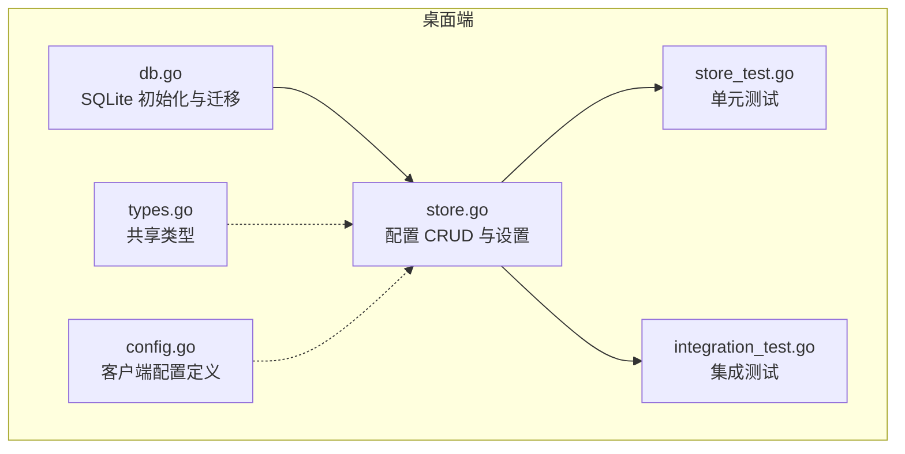
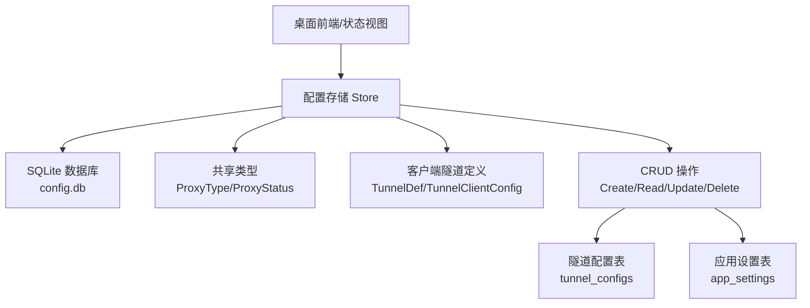
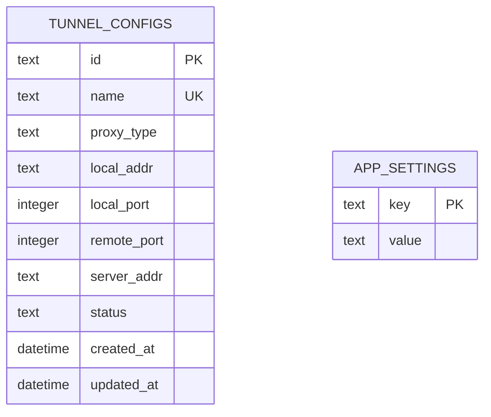
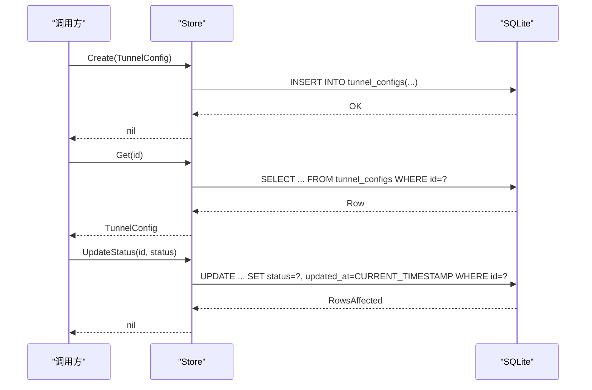
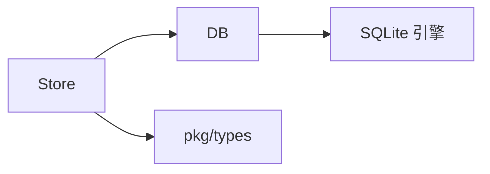

# 数据模型

<cite>
**本文引用的文件**
- [db.go](file://desktop/internal/config/db.go)
- [store.go](file://desktop/internal/config/store.go)
- [store_test.go](file://desktop/internal/config/store_test.go)
- [types.go](file://pkg/types/types.go)
- [config.go](file://desktop/internal/tunnel/config.go)
- [integration_test.go](file://desktop/internal/tunnel/integration_test.go)
</cite>

## 目录
1. [简介](#简介)
2. [项目结构](#项目结构)
3. [核心组件](#核心组件)
4. [架构总览](#架构总览)
5. [详细组件分析](#详细组件分析)
6. [依赖分析](#依赖分析)
7. [性能考量](#性能考量)
8. [故障排查指南](#故障排查指南)
9. [结论](#结论)
10. [附录](#附录)

## 简介
本文件为 NexTunnel 的数据模型与持久化层文档，聚焦桌面端本地配置数据库（SQLite）的设计与使用。内容涵盖：
- 数据库模式设计与表结构定义
- 主键/唯一性约束与索引策略
- 字段定义、数据类型与业务规则
- 数据访问模式、缓存策略与性能考虑
- 数据生命周期管理与迁移路径
- 安全与隐私要求及访问控制建议

当前仓库中仅存在桌面端本地配置数据库（SQLite），未发现服务端数据库或迁移脚本目录。

## 项目结构
与数据模型直接相关的文件位于桌面端内部模块，主要由以下部分组成：
- 配置数据库初始化与迁移：desktop/internal/config/db.go
- 配置读写与应用设置：desktop/internal/config/store.go
- 单元测试与集成测试：desktop/internal/config/store_test.go、desktop/internal/tunnel/integration_test.go
- 共享类型定义：pkg/types/types.go
- 客户端隧道配置定义：desktop/internal/tunnel/config.go

图表来源
- [db.go:1-91](file://desktop/internal/config/db.go#L1-L91)
- [store.go:1-165](file://desktop/internal/config/store.go#L1-L165)
- [store_test.go:1-211](file://desktop/internal/config/store_test.go#L1-L211)
- [integration_test.go:300-343](file://desktop/internal/tunnel/integration_test.go#L300-L343)
- [types.go:1-50](file://pkg/types/types.go#L1-L50)
- [config.go:1-36](file://desktop/internal/tunnel/config.go#L1-L36)

章节来源
- [db.go:1-91](file://desktop/internal/config/db.go#L1-L91)
- [store.go:1-165](file://desktop/internal/config/store.go#L1-L165)
- [store_test.go:1-211](file://desktop/internal/config/store_test.go#L1-L211)
- [integration_test.go:300-343](file://desktop/internal/tunnel/integration_test.go#L300-L343)
- [types.go:1-50](file://pkg/types/types.go#L1-L50)
- [config.go:1-36](file://desktop/internal/tunnel/config.go#L1-L36)

## 核心组件
- 数据库连接与迁移器：负责打开 SQLite 文件、启用 WAL 模式，并执行内嵌 SQL 架构迁移。
- 存储层（Store）：封装对“隧道配置”和“应用设置”的增删改查操作，提供事务安全的 CRUD 能力。
- 类型系统：统一客户端侧隧道配置与运行时状态的类型定义，确保跨模块一致性。

章节来源
- [db.go:33-90](file://desktop/internal/config/db.go#L33-L90)
- [store.go:9-165](file://desktop/internal/config/store.go#L9-L165)
- [types.go:6-49](file://pkg/types/types.go#L6-L49)
- [config.go:6-35](file://desktop/internal/tunnel/config.go#L6-L35)

## 架构总览
下图展示数据模型在系统中的位置与交互关系：

图表来源
- [store.go:23-165](file://desktop/internal/config/store.go#L23-L165)
- [db.go:13-31](file://desktop/internal/config/db.go#L13-L31)
- [types.go:6-49](file://pkg/types/types.go#L6-L49)
- [config.go:6-35](file://desktop/internal/tunnel/config.go#L6-L35)

## 详细组件分析

### 数据库模式与表结构
- 数据库：SQLite（WAL 模式）
- 表一：tunnel_configs（隧道配置）
  - 字段与约束
    - id：TEXT，主键（PRIMARY KEY）
    - name：TEXT，NOT NULL，UNIQUE（唯一性约束）
    - proxy_type：TEXT，NOT NULL，默认值 tcp
    - local_addr：TEXT，NOT NULL
    - local_port：INTEGER，NOT NULL
    - remote_port：INTEGER，NOT NULL
    - server_addr：TEXT，NOT NULL，默认值空字符串
    - status：TEXT，NOT NULL，默认值 stopped
    - created_at：DATETIME，默认值 CURRENT_TIMESTAMP
    - updated_at：DATETIME，默认值 CURRENT_TIMESTAMP
  - 索引策略
    - 主键索引：自动为 id 建立
    - 唯一索引：为 name 建立唯一约束
    - 复合索引：可选为 (name) 已满足唯一性；如需按时间排序查询，可考虑为 (created_at) 建立索引以优化 ORDER BY
- 表二：app_settings（应用设置）
  - 字段与约束
    - key：TEXT，主键（PRIMARY KEY）
    - value：TEXT，NOT NULL
  - 索引策略
    - 主键索引：自动为 key 建立

图表来源
- [db.go:13-31](file://desktop/internal/config/db.go#L13-L31)

章节来源
- [db.go:13-31](file://desktop/internal/config/db.go#L13-L31)

### 数据访问模式
- 打开数据库
  - 默认路径：用户主目录下的 .nextunnel/config.db
  - 启用 WAL 模式以提升并发读取性能
  - 执行内嵌 schema 迁移
- 隧道配置 CRUD
  - Create：插入 id、name、proxy_type、local_addr、local_port、remote_port、server_addr、status
  - Get/GetByName：按 id 或 name 查询，返回完整记录（含 created_at、updated_at）
  - Update：更新 name、proxy_type、local_addr、local_port、remote_port、server_addr、status，并自动更新 updated_at
  - UpdateStatus：仅更新 status 并更新 updated_at
  - Delete：按 id 删除
  - List/Count：列出全部并按 created_at 降序；统计总数
- 应用设置 CRUD
  - GetSetting：按 key 查询 value
  - SetSetting：按 key 写入或更新 value（ON CONFLICT(key) DO UPDATE）

图表来源
- [store.go:33-126](file://desktop/internal/config/store.go#L33-L126)

章节来源
- [store.go:33-165](file://desktop/internal/config/store.go#L33-L165)

### 数据验证与业务规则
- 唯一性约束
  - name 在 tunnel_configs 上具有唯一性约束，重复名称会触发错误
- 默认值
  - proxy_type 默认 tcp
  - server_addr 默认空字符串
  - status 默认 stopped
  - created_at/updated_at 默认 CURRENT_TIMESTAMP
- 更新行为
  - Update 操作会同时更新 updated_at
  - UpdateStatus 仅更新状态与 updated_at
- 错误处理
  - 未找到记录时 Get/GetByName 返回空结果而非错误
  - Delete/Update 若目标不存在返回明确错误

章节来源
- [db.go:13-31](file://desktop/internal/config/db.go#L13-L31)
- [store.go:33-165](file://desktop/internal/config/store.go#L33-L165)
- [store_test.go:130-168](file://desktop/internal/config/store_test.go#L130-L168)

### 示例数据
- 隧道配置示例（来自集成测试）
  - web：proxy_type=tcp，local_port=3000，remote_port=8080，status=stopped
  - api：proxy_type=http，local_port=4000，remote_port=9090，status=running
  - ssh：proxy_type=tcp，local_port=22，remote_port=2222，status=stopped
- 应用设置示例（来自集成测试）
  - server_addr：relay.example.com:7000
  - client_id：test-client-123

章节来源
- [integration_test.go:311-343](file://desktop/internal/tunnel/integration_test.go#L311-L343)

### 数据生命周期管理
- 创建：通过 Create 插入记录，设置 created_at/updated_at
- 更新：Update/UpdateStatus 修改 updated_at
- 删除：Delete 移除记录
- 归档与清理：当前未实现归档逻辑，建议在业务需要时增加软删除标记或历史表

章节来源
- [store.go:33-165](file://desktop/internal/config/store.go#L33-L165)

### 缓存策略与性能考虑
- WAL 模式：启用 PRAGMA journal_mode=WAL 提升并发读取吞吐
- 索引建议
  - 当前已具备主键与唯一索引
  - 如频繁按 name 查询，可考虑为 name 建立显式索引（若未自动建立）
  - 如频繁按 created_at 排序，可为 created_at 建立索引以优化 ORDER BY
- SQL 扫描：List 使用 ORDER BY created_at DESC，建议在大数据量时评估索引优化
- 事务：单条语句执行，未见显式事务包裹；如批量操作建议封装事务以保证一致性

章节来源
- [db.go:59-63](file://desktop/internal/config/db.go#L59-L63)
- [store.go:79-99](file://desktop/internal/config/store.go#L79-L99)

### 数据安全、隐私与访问控制
- 本地存储：数据库文件位于用户主目录，建议限制文件权限，避免被其他用户读取
- 敏感信息：当前未对字段进行加密存储；如涉及敏感参数（例如密钥或令牌），建议在写入前加密并在读取后解密
- 访问控制：SQLite 文件权限由操作系统控制；建议仅授予必要用户读写权限

章节来源
- [db.go:42-52](file://desktop/internal/config/db.go#L42-L52)

## 依赖分析
- 组件耦合
  - Store 依赖 DB（数据库连接与迁移）
  - Store 依赖 SQLite 驱动（modernc.org/sqlite）
  - 类型定义（ProxyType/ProxyStatus）在 pkg/types 中集中管理，供客户端与共享模块复用
- 外部依赖
  - SQLite 驱动：用于本地数据库访问
  - 测试依赖：标准库 testing 与临时目录

图表来源
- [store.go:24-31](file://desktop/internal/config/store.go#L24-L31)
- [db.go:4-11](file://desktop/internal/config/db.go#L4-L11)
- [types.go:1-50](file://pkg/types/types.go#L1-L50)

章节来源
- [store.go:1-165](file://desktop/internal/config/store.go#L1-L165)
- [db.go:1-11](file://desktop/internal/config/db.go#L1-L11)
- [types.go:1-50](file://pkg/types/types.go#L1-L50)

## 性能考量
- WAL 模式已启用，适合高并发读取场景
- 建议根据查询模式添加索引（name、created_at）
- 对于高频更新场景，注意 SQLite 的写入竞争；必要时采用批量提交或重试机制
- 大列表查询（List）建议分页或限制数量，避免一次性加载过多数据

## 故障排查指南
- 打开数据库失败
  - 检查默认路径是否可写（~/.nextunnel/config.db）
  - 确认 SQLite 驱动可用
- 迁移失败
  - 检查 schema 是否正确
  - 确认 WAL 模式设置成功
- 唯一性冲突
  - name 重复会导致插入失败；请修改名称或删除旧记录
- 更新/删除未生效
  - 确认传入的 id 存在；Update/UpdateStatus/Delete 在未找到时会返回错误

章节来源
- [db.go:42-90](file://desktop/internal/config/db.go#L42-L90)
- [store.go:33-165](file://desktop/internal/config/store.go#L33-L165)
- [store_test.go:130-168](file://desktop/internal/config/store_test.go#L130-L168)

## 结论
NexTunnel 的数据模型以 SQLite 为核心，采用简洁的两表结构（tunnel_configs 与 app_settings），通过 WAL 模式提升并发性能，并在业务层面提供了完善的 CRUD 能力与默认值策略。建议后续根据实际查询模式补充索引、引入加密与归档机制，并在需要时扩展为多表关联或引入服务端数据库以支撑更大规模的部署场景。

## 附录

### 字段与类型对照
- tunnel_configs
  - id：TEXT（主键）
  - name：TEXT（唯一）
  - proxy_type：TEXT（枚举：tcp/http/udp）
  - local_addr：TEXT
  - local_port：INTEGER
  - remote_port：INTEGER
  - server_addr：TEXT
  - status：TEXT（枚举：active/inactive/error 或 stopped）
  - created_at：DATETIME
  - updated_at：DATETIME
- app_settings
  - key：TEXT（主键）
  - value：TEXT

章节来源
- [db.go:13-31](file://desktop/internal/config/db.go#L13-L31)
- [types.go:6-49](file://pkg/types/types.go#L6-L49)