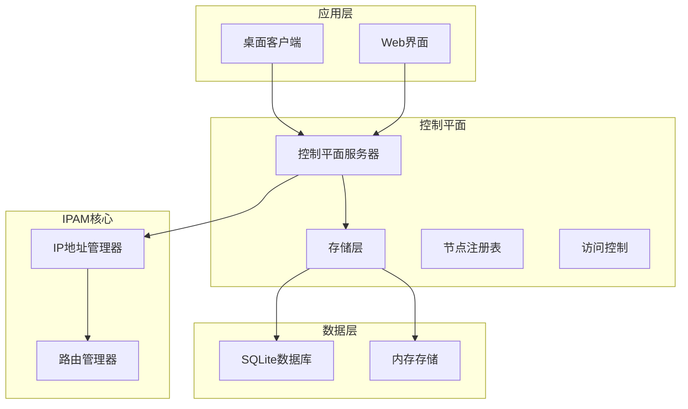
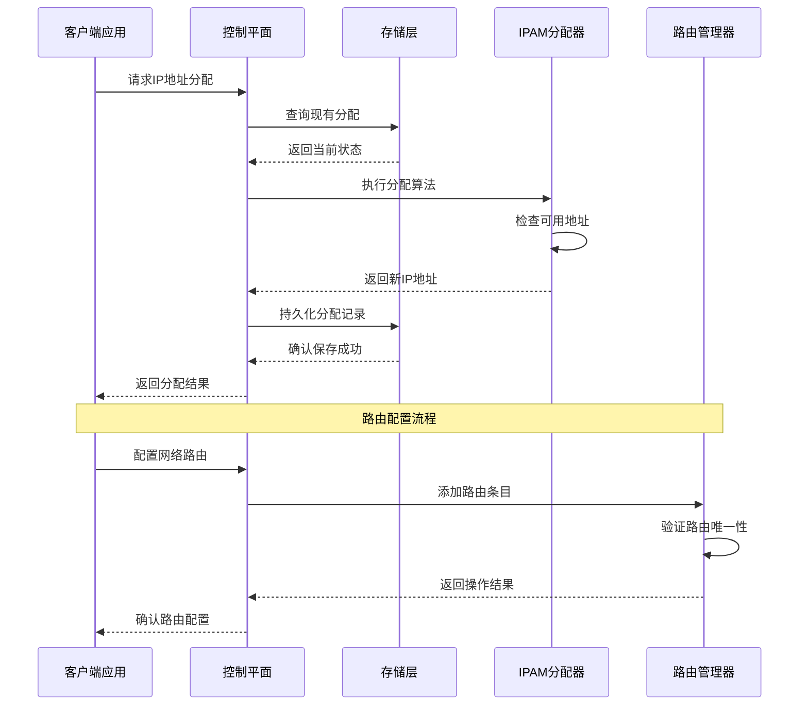
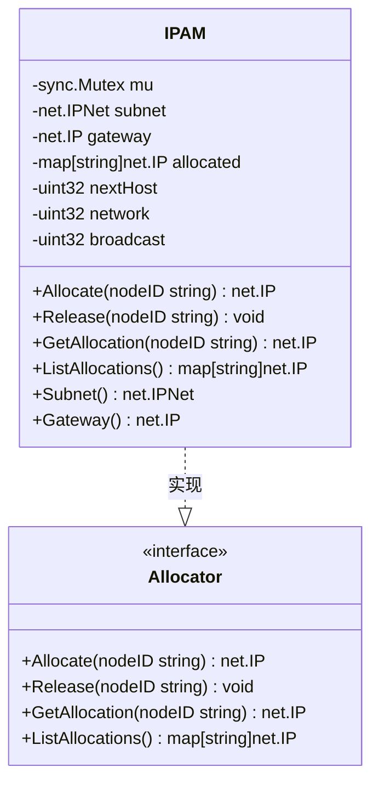
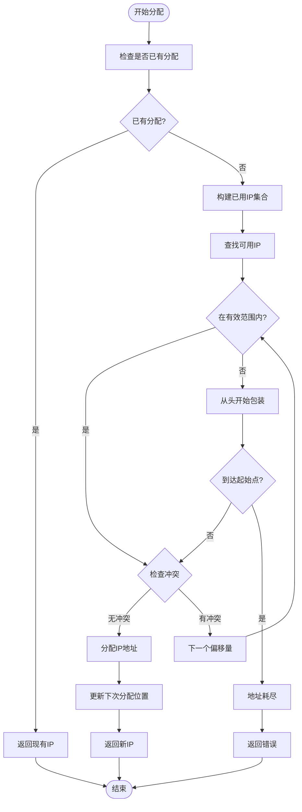
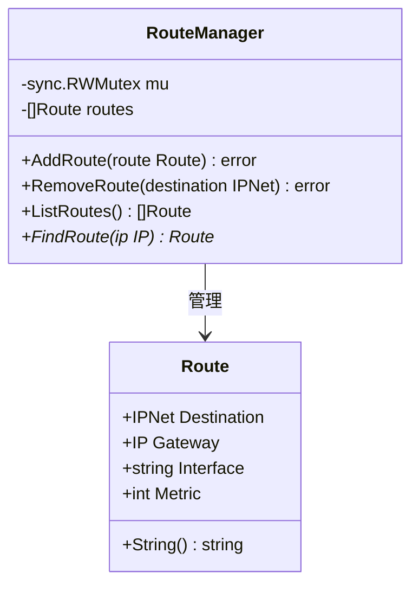
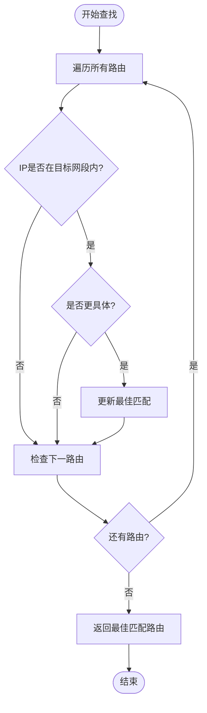
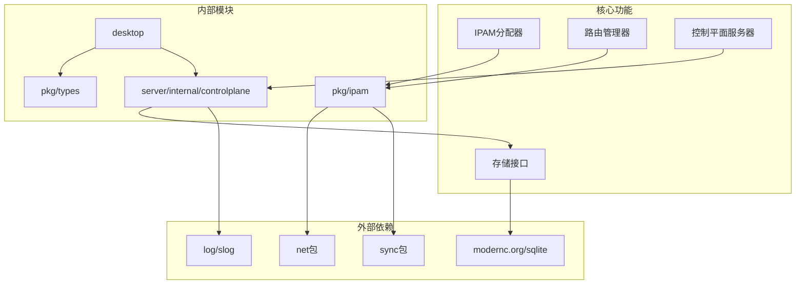

# IP地址管理(IPAM)系统

<cite>
**本文档引用的文件**
- [ipam.go](file://pkg/ipam/ipam.go)
- [route.go](file://pkg/ipam/route.go)
- [ipam_test.go](file://pkg/ipam/ipam_test.go)
- [route_test.go](file://pkg/ipam/route_test.go)
- [server.go](file://server/internal/controlplane/server.go)
- [store.go](file://server/internal/controlplane/store.go)
- [store_sqlite.go](file://server/internal/controlplane/store_sqlite.go)
- [main.go](file://server/cmd/control-plane/main.go)
- [config.go](file://server/internal/controlplane/config.go)
- [node_registry.go](file://server/internal/controlplane/node_registry.go)
- [types.go](file://pkg/types/types.go)
- [db.go](file://desktop/internal/config/db.go)
- [tunnel.go](file://desktop/internal/tunnel/tunnel.go)
- [tunnel.ts](file://desktop/frontend/src/stores/tunnel.ts)
</cite>

## 目录
1. [简介](#简介)
2. [项目结构](#项目结构)
3. [核心组件](#核心组件)
4. [架构概览](#架构概览)
5. [详细组件分析](#详细组件分析)
6. [依赖关系分析](#依赖关系分析)
7. [性能考虑](#性能考虑)
8. [故障排除指南](#故障排除指南)
9. [结论](#结论)

## 简介

NexTunnel IP地址管理(IPAM)系统是一个专为虚拟网络设计的IP地址分配和路由管理系统。该系统提供了高效的IP地址自动分配、路由表管理和控制平面集成功能，支持多节点环境下的网络资源管理。

系统采用模块化设计，包含独立的IPAM包和与控制平面的深度集成。通过SQLite数据库持久化存储，确保IP分配状态的可靠性和一致性。支持并发安全的IP地址分配算法，能够在高并发场景下稳定运行。

## 项目结构

NexTunnel项目采用分层架构设计，主要分为以下层次：

**图表来源**
- [server.go:19-33](file://server/internal/controlplane/server.go#L19-L33)
- [ipam.go:11-28](file://pkg/ipam/ipam.go#L11-L28)

**章节来源**
- [server.go:1-381](file://server/internal/controlplane/server.go#L1-L381)
- [ipam.go:1-160](file://pkg/ipam/ipam.go#L1-L160)

## 核心组件

### IPAM分配器

IPAM分配器是系统的核心组件，负责在指定的CIDR子网内进行IP地址的自动分配和管理。

**主要特性：**
- 支持任意CIDR子网的IP地址分配
- 自动跳过网络地址、广播地址和网关地址
- 并发安全的分配算法
- 智能的地址回收和重用机制

**关键接口：**
- `Allocate(nodeID string) (net.IP, error)` - 分配IP地址
- `Release(nodeID string)` - 释放IP地址
- `GetAllocation(nodeID string) (net.IP, bool)` - 获取已分配IP
- `ListAllocations() map[string]net.IP` - 列出所有分配

### 路由管理器

路由管理器提供网络路由表的管理功能，支持动态添加、删除和查询路由条目。

**主要功能：**
- 添加新的路由条目
- 删除现有路由条目
- 查找最佳匹配路由
- 路由冲突检测

**路由匹配算法：**
系统采用最长前缀匹配算法，优先选择具有最长网络前缀的路由条目。

**章节来源**
- [ipam.go:11-160](file://pkg/ipam/ipam.go#L11-L160)
- [route.go:9-90](file://pkg/ipam/route.go#L9-L90)

## 架构概览

NexTunnel IPAM系统采用分布式架构，结合控制平面和本地管理器的优势：

**图表来源**
- [server.go:330-337](file://server/internal/controlplane/server.go#L330-L337)
- [store_sqlite.go:315-324](file://server/internal/controlplane/store_sqlite.go#L315-L324)

**章节来源**
- [server.go:122-136](file://server/internal/controlplane/server.go#L122-L136)
- [main.go:15-67](file://server/cmd/control-plane/main.go#L15-L67)

## 详细组件分析

### IPAM分配器实现

IPAM分配器采用智能的地址分配策略，确保网络地址的有效利用：

**图表来源**
- [ipam.go:11-28](file://pkg/ipam/ipam.go#L11-L28)

**分配算法流程：**

**图表来源**
- [ipam.go:66-113](file://pkg/ipam/ipam.go#L66-L113)

**章节来源**
- [ipam.go:66-113](file://pkg/ipam/ipam.go#L66-L113)
- [ipam_test.go:36-74](file://pkg/ipam/ipam_test.go#L36-L74)

### 路由管理器实现

路由管理器提供灵活的路由表管理功能：

**图表来源**
- [route.go:9-26](file://pkg/ipam/route.go#L9-L26)

**路由查找算法：**

**图表来源**
- [route.go:72-89](file://pkg/ipam/route.go#L72-L89)

**章节来源**
- [route.go:33-89](file://pkg/ipam/route.go#L33-L89)
- [route_test.go:67-99](file://pkg/ipam/route_test.go#L67-L99)

### 控制平面集成

控制平面服务器提供RESTful API接口，集成IPAM功能：

**API端点：**
- `GET /api/v1/ipam/allocations` - 列出所有IP分配
- `POST /api/v1/nodes` - 注册节点
- `GET /api/v1/nodes` - 获取节点列表

**认证机制：**
- 支持mTLS双向认证
- 支持Bearer Token认证
- 自动身份提取和审计日志

**章节来源**
- [server.go:122-136](file://server/internal/controlplane/server.go#L122-L136)
- [server.go:138-173](file://server/internal/controlplane/server.go#L138-L173)

## 依赖关系分析

系统采用清晰的依赖层次结构：

**图表来源**
- [ipam.go:4-9](file://pkg/ipam/ipam.go#L4-L9)
- [server.go:3-17](file://server/internal/controlplane/server.go#L3-L17)

**章节来源**
- [store.go:8-31](file://server/internal/controlplane/store.go#L8-L31)
- [store_sqlite.go:10-11](file://server/internal/controlplane/store_sqlite.go#L10-L11)

## 性能考虑

### 内存优化策略

1. **并发安全设计**
   - 使用互斥锁保护共享状态
   - 读写分离优化（RouteManager使用RWMutex）
   - 原子操作用于状态更新

2. **数据结构优化**
   - 使用哈希表进行O(1)查找
   - 预分配容量避免频繁扩容
   - 智能的地址回收机制

3. **算法复杂度**
   - IP分配：平均O(n)，最坏O(n²)
   - 路由查找：O(n)线性搜索
   - 内存占用：O(n)线性增长

### 存储性能

1. **SQLite优化**
   - WAL模式提高并发性能
   - 外键约束保证数据完整性
   - 索引优化常用查询

2. **缓存策略**
   - 内存中的节点注册表
   - 最近使用的IP地址缓存
   - 路由表的LRU缓存

## 故障排除指南

### 常见问题诊断

**IP分配失败：**
1. 检查子网大小是否足够（至少/30）
2. 验证网关地址是否在子网内
3. 确认是否有足够的可用地址

**路由配置错误：**
1. 验证路由目标网段格式
2. 检查网关IP连通性
3. 确认接口名称正确

**并发访问问题：**
1. 检查锁竞争情况
2. 验证客户端连接数
3. 监控内存使用情况

### 调试工具

**控制平面调试：**
- 启用详细日志记录
- 使用健康检查端点
- 监控API响应时间

**IPAM调试：**
- 查看分配统计信息
- 检查冲突检测日志
- 验证地址回收机制

**章节来源**
- [ipam_test.go:125-144](file://pkg/ipam/ipam_test.go#L125-L144)
- [route_test.go:28-38](file://pkg/ipam/route_test.go#L28-L38)

## 结论

NexTunnel IPAM系统提供了一个完整、高效且可靠的IP地址管理解决方案。系统的设计充分考虑了生产环境的需求，包括：

1. **可靠性**：通过SQLite持久化和严格的边界检查确保数据完整性
2. **性能**：优化的数据结构和算法支持高并发场景
3. **可扩展性**：模块化设计便于功能扩展和维护
4. **安全性**：完整的认证和授权机制保护系统资源

该系统特别适合需要动态IP地址分配和网络路由管理的企业级应用场景，为构建高性能的虚拟网络基础设施提供了坚实的基础。