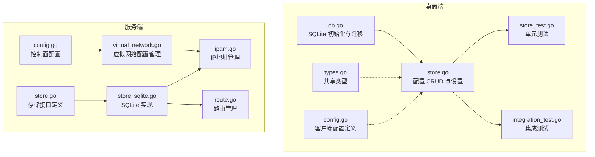
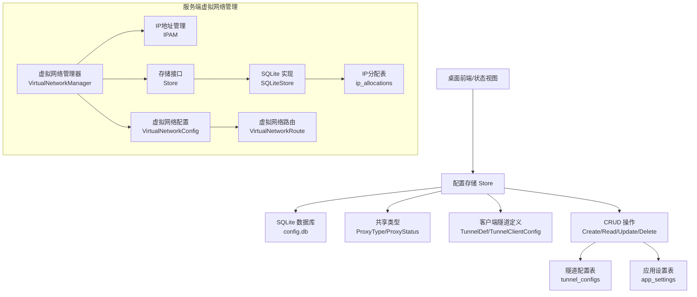
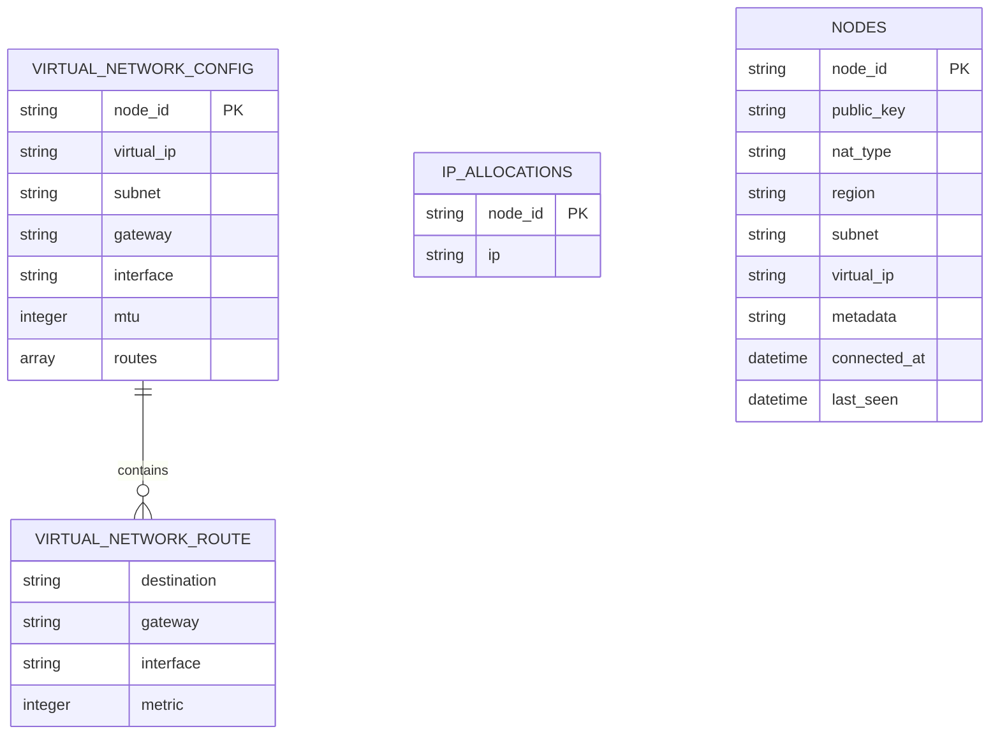
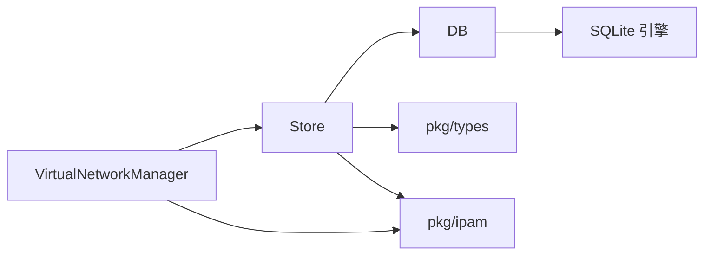

# 数据模型

<cite>
**本文引用的文件**
- [db.go](file://desktop/internal/config/db.go)
- [store.go](file://desktop/internal/config/store.go)
- [store_test.go](file://desktop/internal/config/store_test.go)
- [types.go](file://pkg/types/types.go)
- [config.go](file://desktop/internal/tunnel/config.go)
- [integration_test.go](file://desktop/internal/tunnel/integration_test.go)
- [virtual_network.go](file://server/internal/controlplane/virtual_network.go)
- [config.go](file://server/internal/controlplane/config.go)
- [store.go](file://server/internal/controlplane/store.go)
- [store_sqlite.go](file://server/internal/controlplane/store_sqlite.go)
- [ipam.go](file://pkg/ipam/ipam.go)
- [route.go](file://pkg/ipam/route.go)
</cite>

## 更新摘要
**所做更改**
- 新增服务端虚拟网络数据模型章节，详细介绍VirtualNetworkConfig及其相关组件
- 更新架构总览图，包含服务端虚拟网络管理器
- 新增虚拟网络配置表结构和IP分配表定义
- 添加虚拟网络路由配置和IP地址管理机制说明
- 更新数据访问模式，包含服务端虚拟网络配置的CRUD操作

## 目录
1. [简介](#简介)
2. [项目结构](#项目结构)
3. [核心组件](#核心组件)
4. [架构总览](#架构总览)
5. [详细组件分析](#详细组件分析)
6. [服务端虚拟网络数据模型](#服务端虚拟网络数据模型)
7. [依赖分析](#依赖分析)
8. [性能考量](#性能考量)
9. [故障排查指南](#故障排查指南)
10. [结论](#结论)
11. [附录](#附录)

## 简介
本文件为 NexTunnel 的数据模型与持久化层文档，聚焦桌面端本地配置数据库（SQLite）的设计与使用，以及服务端虚拟网络管理系统的数据模型。内容涵盖：
- 数据库模式设计与表结构定义
- 主键/唯一性约束与索引策略
- 字段定义、数据类型与业务规则
- 数据访问模式、缓存策略与性能考虑
- 数据生命周期管理与迁移路径
- 安全与隐私要求及访问控制建议
- 服务端虚拟网络配置管理与IP地址分配机制

当前仓库中包含桌面端本地配置数据库（SQLite）和服务端虚拟网络管理系统，后者提供完整的虚拟网络配置管理和IP地址分配功能。

## 项目结构
与数据模型直接相关的文件分布在多个模块中，包括桌面端配置数据库和服务器端虚拟网络管理系统：

**图表来源**
- [db.go:1-91](file://desktop/internal/config/db.go#L1-L91)
- [store.go:1-165](file://desktop/internal/config/store.go#L1-L165)
- [virtual_network.go:1-140](file://server/internal/controlplane/virtual_network.go#L1-L140)
- [store_sqlite.go:1-403](file://server/internal/controlplane/store_sqlite.go#L1-L403)

**章节来源**
- [db.go:1-91](file://desktop/internal/config/db.go#L1-L91)
- [store.go:1-165](file://desktop/internal/config/store.go#L1-L165)
- [virtual_network.go:1-140](file://server/internal/controlplane/virtual_network.go#L1-L140)
- [store_sqlite.go:1-403](file://server/internal/controlplane/store_sqlite.go#L1-L403)

## 核心组件
- 数据库连接与迁移器：负责打开 SQLite 文件、启用 WAL 模式，并执行内嵌 SQL 架构迁移。
- 存储层（Store）：封装对"隧道配置"、"应用设置"、"节点信息"、"ACL规则"、"密钥材料"和"IP分配"的增删改查操作，提供事务安全的 CRUD 能力。
- 类型系统：统一客户端侧隧道配置与运行时状态的类型定义，确保跨模块一致性。
- 虚拟网络管理器：负责控制面虚拟IP分配和路由配置生成，提供完整的虚拟网络配置管理功能。

**章节来源**
- [db.go:33-90](file://desktop/internal/config/db.go#L33-L90)
- [store.go:9-165](file://desktop/internal/config/store.go#L9-L165)
- [virtual_network.go:28-59](file://server/internal/controlplane/virtual_network.go#L28-L59)
- [store.go:8-31](file://server/internal/controlplane/store.go#L8-L31)

## 架构总览
下图展示数据模型在系统中的位置与交互关系，包含新增的服务端虚拟网络管理功能：

**图表来源**
- [store.go:23-165](file://desktop/internal/config/store.go#L23-L165)
- [virtual_network.go:104-126](file://server/internal/controlplane/virtual_network.go#L104-L126)
- [store_sqlite.go:139-403](file://server/internal/controlplane/store_sqlite.go#L139-L403)

## 详细组件分析

### 数据库模式与表结构
- 数据库：SQLite（WAL 模式）
- 表一：tunnel_configs（隧道配置）
  - 字段与约束
    - id：TEXT，主键（PRIMARY KEY）
    - name：TEXT，NOT NULL，UNIQUE（唯一性约束）
    - proxy_type：TEXT，NOT NULL，默认值 tcp
    - local_addr：TEXT，NOT NULL
    - local_port：INTEGER，NOT NULL
    - remote_port：INTEGER，NOT NULL
    - server_addr：TEXT，NOT NULL，默认值空字符串
    - status：TEXT，NOT NULL，默认值 stopped
    - created_at：DATETIME，默认值 CURRENT_TIMESTAMP
    - updated_at：DATETIME，默认值 CURRENT_TIMESTAMP
  - 索引策略
    - 主键索引：自动为 id 建立
    - 唯一索引：为 name 建立唯一约束
- 表二：app_settings（应用设置）
  - 字段与约束
    - key：TEXT，主键（PRIMARY KEY）
    - value：TEXT，NOT NULL
  - 索引策略
    - 主键索引：自动为 key 建立

**章节来源**
- [db.go:13-31](file://desktop/internal/config/db.go#L13-L31)

### 数据访问模式
- 打开数据库
  - 默认路径：用户主目录下的 .nextunnel/config.db
  - 启用 WAL 模式以提升并发读取性能
  - 执行内嵌 schema 迁移
- 隧道配置 CRUD
  - Create：插入 id、name、proxy_type、local_addr、local_port、remote_port、server_addr、status
  - Get/GetByName：按 id 或 name 查询，返回完整记录（含 created_at、updated_at）
  - Update：更新 name、proxy_type、local_addr、local_port、remote_port、server_addr、status，并自动更新 updated_at
  - UpdateStatus：仅更新 status 并更新 updated_at
  - Delete：按 id 删除
  - List/Count：列出全部并按 created_at 降序；统计总数
- 应用设置 CRUD
  - GetSetting：按 key 查询 value
  - SetSetting：按 key 写入或更新 value（ON CONFLICT(key) DO UPDATE）

**章节来源**
- [store.go:33-165](file://desktop/internal/config/store.go#L33-L165)

### 数据验证与业务规则
- 唯一性约束
  - name 在 tunnel_configs 上具有唯一性约束，重复名称会触发错误
- 默认值
  - proxy_type 默认 tcp
  - server_addr 默认空字符串
  - status 默认 stopped
  - created_at/updated_at 默认 CURRENT_TIMESTAMP
- 更新行为
  - Update 操作会同时更新 updated_at
  - UpdateStatus 仅更新状态与 updated_at
- 错误处理
  - 未找到记录时 Get/GetByName 返回空结果而非错误
  - Delete/Update 若目标不存在返回明确错误

**章节来源**
- [db.go:13-31](file://desktop/internal/config/db.go#L13-L31)
- [store.go:33-165](file://desktop/internal/config/store.go#L33-L165)

### 示例数据
- 隧道配置示例（来自集成测试）
  - web：proxy_type=tcp，local_port=3000，remote_port=8080，status=stopped
  - api：proxy_type=http，local_port=4000，remote_port=9090，status=running
  - ssh：proxy_type=tcp，local_port=22，remote_port=2222，status=stopped
- 应用设置示例（来自集成测试）
  - server_addr：relay.example.com:7000
  - client_id：test-client-123

**章节来源**
- [integration_test.go:311-343](file://desktop/internal/tunnel/integration_test.go#L311-L343)

### 数据生命周期管理
- 创建：通过 Create 插入记录，设置 created_at/updated_at
- 更新：Update/UpdateStatus 修改 updated_at
- 删除：Delete 移除记录
- 归档与清理：当前未实现归档逻辑，建议在业务需要时增加软删除标记或历史表

**章节来源**
- [store.go:33-165](file://desktop/internal/config/store.go#L33-L165)

### 缓存策略与性能考虑
- WAL 模式：启用 PRAGMA journal_mode=WAL 提升并发读取吞吐
- 索引建议
  - 当前已具备主键与唯一索引
  - 如频繁按 name 查询，可考虑为 name 建立显式索引（若未自动建立）
- SQL 扫描：List 使用 ORDER BY created_at DESC，建议在大数据量时评估索引优化
- 事务：单条语句执行，未见显式事务包裹；如批量操作建议封装事务以保证一致性

**章节来源**
- [db.go:59-63](file://desktop/internal/config/db.go#L59-L63)
- [store.go:79-99](file://desktop/internal/config/store.go#L79-L99)

### 数据安全、隐私与访问控制
- 本地存储：数据库文件位于用户主目录，建议限制文件权限，避免被其他用户读取
- 敏感信息：当前未对字段进行加密存储；如涉及敏感参数（例如密钥或令牌），建议在写入前加密并在读取后解密
- 访问控制：SQLite 文件权限由操作系统控制；建议仅授予必要用户读写权限

**章节来源**
- [db.go:42-52](file://desktop/internal/config/db.go#L42-L52)

## 服务端虚拟网络数据模型

### 虚拟网络配置数据模型
服务端虚拟网络管理系统提供完整的虚拟网络配置管理，核心数据模型包括：

#### VirtualNetworkConfig 结构
- NodeID：节点标识符，用于唯一标识接入虚拟网络的节点
- VirtualIP：分配给节点的虚拟IP地址
- Subnet：虚拟网络子网CIDR格式
- Gateway：虚拟网络网关IP地址
- Interface：虚拟网络接口名称
- MTU：最大传输单元大小
- Routes：虚拟网络路由配置数组

#### VirtualNetworkRoute 结构
- Destination：路由目标网络
- Gateway：路由网关IP
- Interface：路由接口
- Metric：路由度量值

#### VirtualNetworkManager 功能
- IP地址分配：基于IPAM（IP Address Management）实现自动分配
- 路由配置生成：为节点生成虚拟网络路由配置
- 配置持久化：将分配的IP地址和配置信息持久化存储
- 配置重建：从持久化存储恢复已分配的IP地址

**图表来源**
- [virtual_network.go:17-26](file://server/internal/controlplane/virtual_network.go#L17-L26)
- [virtual_network.go:9-15](file://server/internal/controlplane/virtual_network.go#L9-L15)
- [store_sqlite.go:50-53](file://server/internal/controlplane/store_sqlite.go#L50-L53)

### 服务端数据库模式
服务端控制平面使用SQLite作为持久化存储，包含以下核心表：

#### 节点表（nodes）
- node_id：节点标识符（主键）
- public_key：WireGuard公钥
- nat_type：NAT类型
- region：节点所在区域
- subnet：节点所属子网
- virtual_ip：分配的虚拟IP地址
- metadata：节点元数据（JSON格式）
- connected_at：连接时间
- last_seen：最后活跃时间

#### ACL规则表（acl_rules）
- id：规则标识符（主键）
- source：源地址或通配符
- target：目标地址或通配符
- action：允许或拒绝动作
- protocol：协议类型
- ports：开放端口数组
- priority：规则优先级
- expires_at：过期时间
- created_at：创建时间

#### 密钥材料表（key_material）
- node_id：节点标识符（主键）
- public_key：公钥
- key_version：密钥版本号
- rotated_at：轮换时间
- expires_at：过期时间

#### IP分配表（ip_allocations）
- node_id：节点标识符（主键）
- ip：分配的IP地址

**章节来源**
- [store_sqlite.go:14-54](file://server/internal/controlplane/store_sqlite.go#L14-L54)

### 数据访问模式
服务端虚拟网络管理器提供以下核心操作：

#### IP地址分配流程
1. 检查节点是否已有分配的IP地址
2. 如果已有分配，直接返回现有IP地址
3. 如果没有分配，从IPAM池中分配新的IP地址
4. 将分配结果持久化到数据库
5. 更新节点信息中的虚拟IP和子网信息

#### 虚拟网络配置构建
1. 从数据库获取节点的IP地址分配信息
2. 构建VirtualNetworkConfig对象
3. 生成默认路由配置（指向虚拟网关）
4. 返回完整的虚拟网络配置

#### 配置持久化
- SaveIPAllocation：保存IP地址分配
- GetIPAllocation：获取IP地址分配
- DeleteIPAllocation：删除IP地址分配
- ListIPAllocations：列出所有IP地址分配

**章节来源**
- [virtual_network.go:61-101](file://server/internal/controlplane/virtual_network.go#L61-L101)
- [virtual_network.go:103-126](file://server/internal/controlplane/virtual_network.go#L103-L126)
- [store_sqlite.go:351-402](file://server/internal/controlplane/store_sqlite.go#L351-L402)

### IP地址管理机制
服务端使用独立的IPAM包实现虚拟网络IP地址管理：

#### IPAM功能特性
- CIDR子网支持：支持IPv4 CIDR格式的子网管理
- 地址池管理：维护可用IP地址池，避免重复分配
- 网关预留：自动预留网关地址不参与分配
- 线程安全：使用互斥锁保证并发安全性
- 分配算法：基于网络地址的顺序分配策略

#### 路由管理机制
- RouteManager：管理网络路由表
- 路由去重：防止重复路由条目的添加
- 路由操作：支持添加、删除和查询路由
- 线程安全：使用读写锁保证并发访问安全

**章节来源**
- [ipam.go:20-50](file://pkg/ipam/ipam.go#L20-L50)
- [route.go:22-55](file://pkg/ipam/route.go#L22-L55)

### 配置管理与默认值
服务端控制平面提供完整的虚拟网络配置管理：

#### 默认配置
- VirtualSubnet：默认虚拟网络子网 "10.7.0.0/24"
- VirtualGateway：默认网关 "10.7.0.1"
- VirtualInterface：默认接口 "nextunnel0"
- VirtualMTU：默认MTU 1420字节
- VirtualRouteMetric：默认路由度量100

#### 配置选项
- WithVirtualNetwork：启用虚拟网络功能并设置子网和网关
- 控制平面配置：通过ControlPlaneConfig管理所有虚拟网络相关参数

**章节来源**
- [config.go:77-84](file://server/internal/controlplane/config.go#L77-L84)
- [config.go:86-101](file://server/internal/controlplane/config.go#L86-L101)

## 依赖分析
- 组件耦合
  - Store 依赖 DB（数据库连接与迁移）
  - Store 依赖 SQLite 驱动（modernc.org/sqlite）
  - 虚拟网络管理器依赖IPAM包进行地址分配
  - 虚拟网络管理器依赖存储接口进行数据持久化
  - 类型定义（ProxyType/ProxyStatus/VirtualNetworkConfig）在各自包中管理
- 外部依赖
  - SQLite 驱动：用于本地数据库访问
  - IPAM包：提供虚拟网络IP地址管理功能
  - 测试依赖：标准库 testing 与临时目录

**图表来源**
- [store.go:24-31](file://desktop/internal/config/store.go#L24-L31)
- [virtual_network.go:3-7](file://server/internal/controlplane/virtual_network.go#L3-L7)
- [ipam.go:1-10](file://pkg/ipam/ipam.go#L1-L10)

**章节来源**
- [store.go:1-165](file://desktop/internal/config/store.go#L1-L165)
- [virtual_network.go:1-140](file://server/internal/controlplane/virtual_network.go#L1-L140)
- [ipam.go:1-50](file://pkg/ipam/ipam.go#L1-L50)

## 性能考量
- WAL 模式已启用，适合高并发读取场景
- 建议根据查询模式添加索引（name、created_at）
- 对于高频更新场景，注意 SQLite 的写入竞争；必要时采用批量提交或重试机制
- 大列表查询（List）建议分页或限制数量，避免一次性加载过多数据
- 虚拟网络管理器使用IPAM进行高效地址分配，支持并发访问
- 路由管理器使用读写锁优化并发性能

## 故障排查指南
- 打开数据库失败
  - 检查默认路径是否可写（~/.nextunnel/config.db）
  - 确认 SQLite 驱动可用
- 迁移失败
  - 检查 schema 是否正确
  - 确认 WAL 模式设置成功
- 唯一性冲突
  - name 重复会导致插入失败；请修改名称或删除旧记录
- 更新/删除未生效
  - 确认传入的 id 存在；Update/UpdateStatus/Delete 在未找到时会返回错误
- 虚拟网络配置问题
  - 检查IPAM子网配置是否有效
  - 确认网关IP在子网范围内
  - 验证虚拟网络接口是否存在

**章节来源**
- [db.go:42-90](file://desktop/internal/config/db.go#L42-L90)
- [virtual_network.go:40-59](file://server/internal/controlplane/virtual_network.go#L40-L59)
- [store_sqlite.go:351-402](file://server/internal/controlplane/store_sqlite.go#L351-L402)

## 结论
NexTunnel 的数据模型现已扩展为包含桌面端本地配置数据库和服务器端虚拟网络管理系统的完整架构。桌面端部分采用简洁的两表结构（tunnel_configs 与 app_settings），通过 WAL 模式提升并发性能，并在业务层面提供了完善的 CRUD 能力与默认值策略。服务端部分新增了完整的虚拟网络配置管理功能，包括IP地址分配、路由配置生成和持久化存储，为大规模节点虚拟网络连接提供了可靠的数据支持。建议后续根据实际查询模式补充索引、引入加密与归档机制，并在需要时扩展为多表关联或引入服务端数据库以支撑更大规模的部署场景。

## 附录

### 字段与类型对照
- desktop/tunnel_configs
  - id：TEXT（主键）
  - name：TEXT（唯一）
  - proxy_type：TEXT（枚举：tcp/http/udp）
  - local_addr：TEXT
  - local_port：INTEGER
  - remote_port：INTEGER
  - server_addr：TEXT
  - status：TEXT（枚举：active/inactive/error 或 stopped）
  - created_at：DATETIME
  - updated_at：DATETIME
- desktop/app_settings
  - key：TEXT（主键）
  - value：TEXT
- server/nodes
  - node_id：TEXT（主键）
  - public_key：TEXT
  - nat_type：TEXT
  - region：TEXT
  - subnet：TEXT
  - virtual_ip：TEXT
  - metadata：TEXT（JSON）
  - connected_at：DATETIME
  - last_seen：DATETIME
- server/acl_rules
  - id：TEXT（主键）
  - source：TEXT
  - target：TEXT
  - action：TEXT
  - protocol：TEXT
  - ports：TEXT（JSON数组）
  - priority：INTEGER
  - expires_at：DATETIME
  - created_at：DATETIME
- server/key_material
  - node_id：TEXT（主键）
  - public_key：TEXT
  - key_version：INTEGER
  - rotated_at：DATETIME
  - expires_at：DATETIME
- server/ip_allocations
  - node_id：TEXT（主键）
  - ip：TEXT

**章节来源**
- [db.go:13-31](file://desktop/internal/config/db.go#L13-L31)
- [store_sqlite.go:14-54](file://server/internal/controlplane/store_sqlite.go#L14-L54)