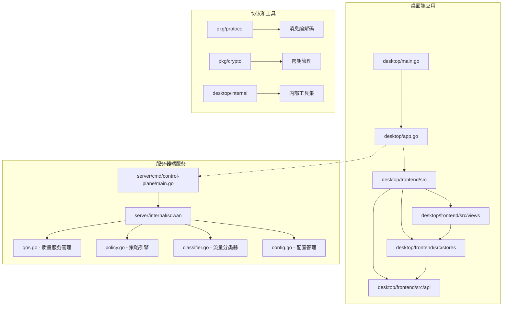
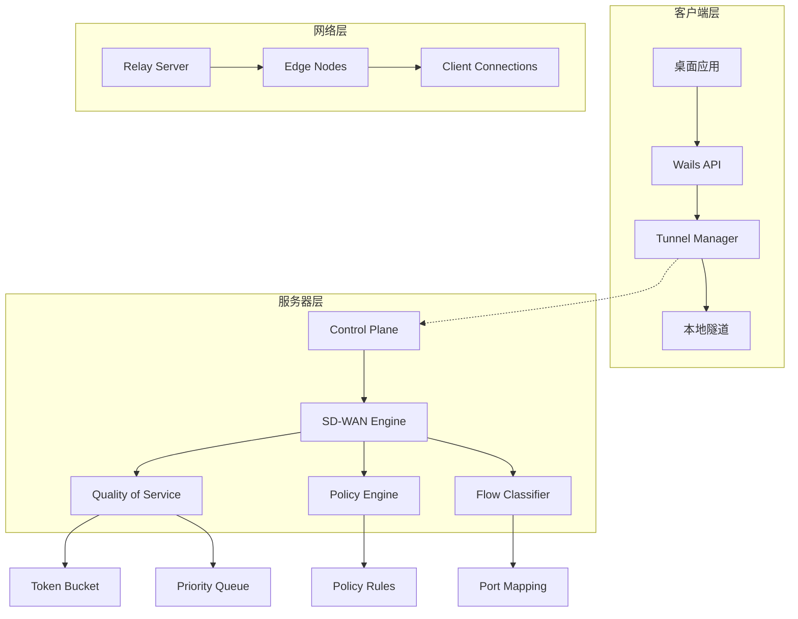
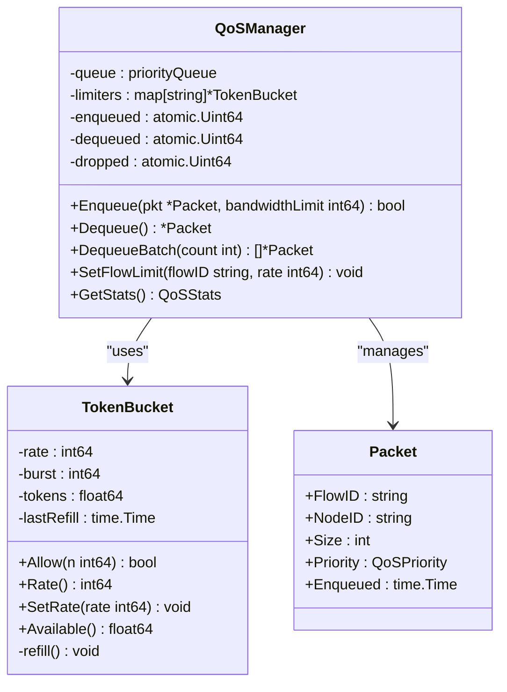
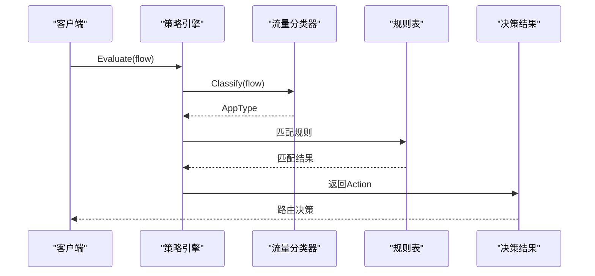
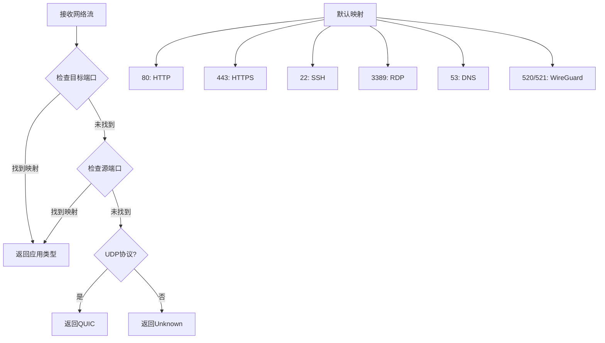
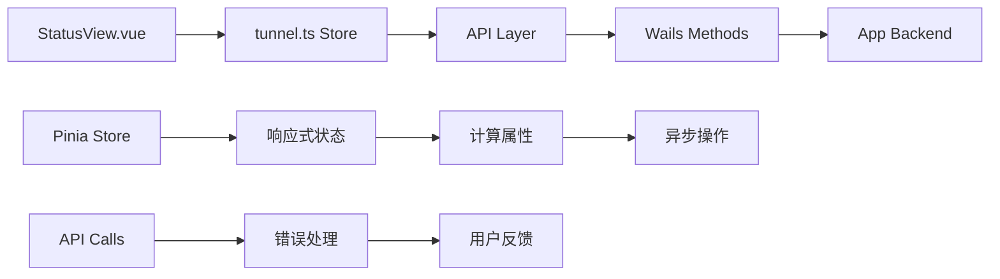
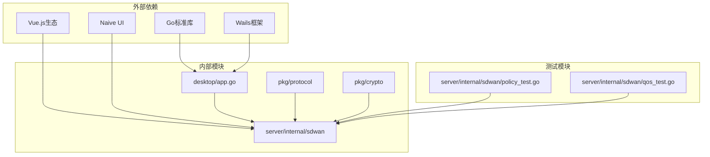

# SD-WAN质量服务管理

<cite>
**本文档引用的文件**
- [app.go](file://desktop/app.go)
- [main.go](file://desktop/main.go)
- [tunnel.ts](file://desktop/frontend/src/stores/tunnel.ts)
- [StatusView.vue](file://desktop/frontend/src/views/StatusView.vue)
- [app.ts](file://desktop/frontend/src/api/app.ts)
- [qos.go](file://server/internal/sdwan/qos.go)
- [qos_test.go](file://server/internal/sdwan/qos_test.go)
- [policy.go](file://server/internal/sdwan/policy.go)
- [classifier.go](file://server/internal/sdwan/classifier.go)
- [config.go](file://server/internal/sdwan/config.go)
- [policy_test.go](file://server/internal/sdwan/policy_test.go)
- [main.go](file://server/cmd/control-plane/main.go)
</cite>

## 更新摘要
**所做更改**
- 新增了令牌桶算法实现的详细说明
- 更新了QoSManager的动态流量整形功能描述
- 增强了质量服务保障机制的技术细节
- 完善了优先级队列调度系统的实现说明
- 补充了带宽速率限制的动态调整功能
- 新增了完整的QoS测试用例分析

## 目录
1. [简介](#简介)
2. [项目结构](#项目结构)
3. [核心组件](#核心组件)
4. [架构概览](#架构概览)
5. [详细组件分析](#详细组件分析)
6. [依赖关系分析](#依赖关系分析)
7. [性能考虑](#性能考虑)
8. [故障排除指南](#故障排除指南)
9. [结论](#结论)

## 简介

NexTunnel是一个基于WebAssembly的跨平台桌面应用，专注于提供高质量的软件定义广域网（SD-WAN）服务。该项目采用Go语言开发后端服务，使用Vue.js构建前端界面，通过Wails框架实现桌面应用的跨平台部署。

系统的核心功能包括：
- **隧道管理**：支持TCP和HTTP代理类型的隧道创建、启动、停止和删除
- **质量服务管理**：实现基于优先级的流量调度和带宽控制
- **策略路由**：根据应用类型和网络条件进行智能路由决策
- **实时监控**：提供连接状态、流量统计和性能指标的实时显示

## 项目结构

项目采用模块化的分层架构，主要分为以下层次：

**图表来源**
- [main.go:15-40](file://desktop/main.go#L15-L40)
- [app.go:25-67](file://desktop/app.go#L25-L67)
- [main.go:14-46](file://server/cmd/control-plane/main.go#L14-L46)

**章节来源**
- [main.go:1-40](file://desktop/main.go#L1-L40)
- [app.go:1-354](file://desktop/app.go#L1-L354)

## 核心组件

### 桌面应用核心

桌面应用采用Wails框架构建，提供了完整的用户界面和系统集成能力：

- **应用主程序**：负责初始化数据库、隧道管理和用户界面绑定
- **隧道管理器**：处理隧道的生命周期管理和状态同步
- **前端状态管理**：使用Pinia进行响应式状态管理
- **API接口层**：封装Wails方法调用，提供类型安全的接口

### 服务器端SD-WAN引擎

服务器端实现了完整的SD-WAN功能，包括：

- **质量服务管理器**：实现令牌桶限速和优先级队列调度
- **策略引擎**：基于规则的流量分类和路由决策
- **流量分类器**：根据端口和协议识别应用类型
- **配置管理系统**：提供灵活的参数配置选项

**章节来源**
- [app.go:25-67](file://desktop/app.go#L25-L67)
- [qos.go:130-156](file://server/internal/sdwan/qos.go#L130-L156)
- [policy.go:39-55](file://server/internal/sdwan/policy.go#L39-L55)

## 架构概览

系统采用客户端-服务器架构，通过Relay机制实现点对点连接：

**图表来源**
- [app.go:193-285](file://desktop/app.go#L193-L285)
- [qos.go:130-145](file://server/internal/sdwan/qos.go#L130-L145)
- [policy.go:39-46](file://server/internal/sdwan/policy.go#L39-L46)

## 详细组件分析

### 质量服务管理器

质量服务管理器是SD-WAN系统的核心组件，实现了基于令牌桶的带宽控制和基于优先级的流量调度：

#### TokenBucket令牌桶实现

**图表来源**
- [qos.go:10-87](file://server/internal/sdwan/qos.go#L10-L87)
- [qos.go:130-145](file://server/internal/sdwan/qos.go#L130-L145)
- [qos.go:89-97](file://server/internal/sdwan/qos.go#L89-L97)

#### 令牌桶算法详解

令牌桶算法是一种流量整形和速率限制算法，通过以下机制实现：

- **令牌产生**：以恒定速率向桶中添加令牌
- **令牌消耗**：数据包到达时消耗相应数量的令牌
- **突发处理**：桶中初始令牌允许短时间内的流量突发
- **动态调整**：支持运行时修改速率限制

令牌桶的关键特性：
- **速率限制**：确保平均数据传输速率不超过设定值
- **突发容忍**：允许短时间内的超速传输
- **线程安全**：使用互斥锁保护并发访问
- **原子操作**：统计信息使用原子操作保证一致性

#### 优先级队列调度

系统支持8个优先级级别，从0（最高优先级）到7（最低优先级），实现了公平的资源分配：

| 优先级 | 名称 | 描述 |
|--------|------|------|
| 0 | Critical | 关键任务，如VoIP语音通信 |
| 1 | Realtime | 实时应用，如视频会议 |
| 2 | High | 高优先级应用，如文件传输 |
| 4 | Medium | 中等优先级应用 |
| 5 | Low | 低优先级应用 |
| 6 | BestEffort | 最佳努力服务 |
| 7 | Background | 后台任务 |

优先级队列的调度策略：
- **优先级优先**：相同优先级内按FIFO原则处理
- **公平分配**：不同优先级间实现公平的带宽分配
- **动态调整**：支持运行时修改流量的优先级

**章节来源**
- [qos.go:55-88](file://server/internal/sdwan/qos.go#L55-L88)
- [qos.go:158-183](file://server/internal/sdwan/qos.go#L158-L183)

### 策略引擎

策略引擎实现了基于规则的流量分类和路由决策：

**图表来源**
- [policy.go:126-155](file://server/internal/sdwan/policy.go#L126-L155)
- [classifier.go:29-50](file://server/internal/sdwan/classifier.go#L29-L50)

#### 规则匹配逻辑

策略引擎按照以下顺序评估规则：

1. **应用类型匹配**：检查目标应用类型
2. **协议匹配**：验证网络协议
3. **源节点匹配**：针对特定节点的规则
4. **目标端口匹配**：端口级别的精确匹配

规则执行流程：
- **启用状态检查**：仅处理启用的规则
- **优先级排序**：按RulePriority升序执行
- **条件匹配**：所有指定条件必须满足
- **动作执行**：根据Action执行相应操作

**章节来源**
- [policy.go:157-175](file://server/internal/sdwan/policy.go#L157-L175)

### 流量分类器

流量分类器基于端口映射和协议特征识别应用类型：

**图表来源**
- [classifier.go:16-26](file://server/internal/sdwan/classifier.go#L16-L26)
- [classifier.go:29-50](file://server/internal/sdwan/classifier.go#L29-L50)

流量分类的实现特点：
- **端口映射**：支持自定义端口到应用类型的映射
- **协议识别**：基于协议类型的智能识别
- **回退机制**：UDP流量默认识别为QUIC
- **线程安全**：使用读写锁保证并发访问

**章节来源**
- [classifier.go:1-72](file://server/internal/sdwan/classifier.go#L1-L72)

### 桌面应用前端

前端使用Vue.js和Naive UI构建现代化的用户界面：

#### 状态管理架构

**图表来源**
- [StatusView.vue:357-543](file://desktop/frontend/src/views/StatusView.vue#L357-L543)
- [tunnel.ts:36-199](file://desktop/frontend/src/stores/tunnel.ts#L36-L199)

前端状态管理的实现要点：
- **响应式更新**：自动追踪状态变化并更新UI
- **异步操作**：处理网络请求和后台任务
- **错误处理**：统一的错误捕获和用户提示
- **计算属性**：基于状态派生的派生数据

**章节来源**
- [StatusView.vue:1-872](file://desktop/frontend/src/views/StatusView.vue#L1-L872)
- [tunnel.ts:1-199](file://desktop/frontend/src/stores/tunnel.ts#L1-L199)

## 依赖关系分析

系统采用了清晰的分层依赖结构：

**图表来源**
- [app.go:3-16](file://desktop/app.go#L3-L16)
- [qos.go:3-8](file://server/internal/sdwan/qos.go#L3-L8)

**章节来源**
- [app.go:1-354](file://desktop/app.go#L1-L354)
- [qos.go:1-291](file://server/internal/sdwan/qos.go#L1-L291)

## 性能考虑

### 并发模型

系统采用了多线程并发模型，确保高并发场景下的稳定性：

- **令牌桶限速器**：每个流量都有独立的限速器实例
- **优先级队列**：使用堆数据结构实现高效的优先级排序
- **原子操作**：关键统计数据使用原子操作保证线程安全

并发控制机制：
- **互斥锁保护**：关键数据结构使用互斥锁保护
- **读写分离**：分类器使用读写锁提高并发性能
- **无锁设计**：统计信息使用原子操作避免锁竞争

### 内存管理

- **对象池模式**：避免频繁的内存分配和垃圾回收
- **缓冲区复用**：网络数据包在处理过程中复用缓冲区
- **延迟初始化**：按需创建和销毁资源

内存优化策略：
- **预分配容量**：容器预先分配足够的容量
- **批量操作**：支持批量入队和出队操作
- **资源清理**：及时释放不再使用的资源

### 网络优化

- **批量处理**：支持批量出队操作提高吞吐量
- **动态调整**：带宽限制可以动态调整适应网络变化
- **队列容量**：可配置的最大队列长度防止内存溢出

性能监控指标：
- **队列长度**：实时监控队列长度避免拥塞
- **丢弃计数**：跟踪被丢弃的数据包数量
- **字节统计**：记录进出的总字节数

## 故障排除指南

### 常见问题诊断

#### 连接问题

1. **服务器连接失败**
   - 检查服务器地址和端口配置
   - 验证认证令牌的有效性
   - 确认防火墙设置允许连接

2. **隧道状态异常**
   - 查看隧道配置的正确性
   - 检查本地端口是否被占用
   - 验证远程端口的可达性

#### 性能问题

1. **流量控制不生效**
   - 确认带宽限制值的合理性
   - 检查令牌桶的配置参数
   - 验证优先级设置的正确性

2. **策略规则不匹配**
   - 检查规则的匹配条件
   - 验证应用类型的识别结果
   - 确认规则的启用状态

### 调试工具

系统提供了丰富的调试信息和统计功能：

- **实时流量统计**：显示入站和出站字节数
- **队列状态监控**：跟踪队列长度和丢弃计数
- **连接状态日志**：记录连接建立和断开事件

调试信息包括：
- **QoS统计**：队列长度、丢弃计数、字节统计
- **规则匹配**：规则执行情况和匹配结果
- **分类结果**：应用类型识别的详细信息

**章节来源**
- [app.go:193-285](file://desktop/app.go#L193-L285)
- [qos.go:158-183](file://server/internal/sdwan/qos.go#L158-L183)

## 结论

NexTunnel项目展现了现代SD-WAN技术的完整实现，通过精心设计的架构和高效的算法，在保证功能完整性的同时实现了良好的性能表现。

### 主要优势

1. **模块化设计**：清晰的分层架构便于维护和扩展
2. **高性能实现**：基于令牌桶和优先级队列的高效调度
3. **用户友好**：现代化的桌面界面提供直观的操作体验
4. **跨平台支持**：基于WebAssembly的技术栈实现真正的跨平台部署

### 技术特色

- **实时质量控制**：动态的带宽管理和优先级调度
- **智能策略路由**：基于应用识别的自动化路由决策
- **完整监控体系**：全面的性能指标和状态监控
- **灵活配置选项**：支持多种参数的动态调整

该系统为构建企业级网络解决方案提供了坚实的技术基础，其设计理念和实现方式值得在类似项目中借鉴和参考。

### 质量服务保障机制

系统通过以下机制确保服务质量：

- **多层防护**：令牌桶限速、优先级调度、队列管理
- **动态调整**：支持运行时修改带宽限制和优先级
- **监控告警**：实时监控队列状态和丢弃情况
- **故障恢复**：自动检测和恢复网络异常

这些特性使得NexTunnel能够在复杂的网络环境中提供稳定可靠的服务质量保障。

### QoS测试验证

系统通过全面的单元测试验证QoS功能的正确性：

- **令牌桶测试**：验证Allow、Refill、SetRate等核心功能
- **优先级排序测试**：确保8个优先级级别的正确排序
- **速率限制测试**：验证带宽限制的准确性
- **队列管理测试**：确认队列满载时的行为
- **批处理测试**：验证批量出队功能
- **流量限制测试**：确认每流独立的速率限制
- **统计测试**：验证所有统计指标的准确性

**章节来源**
- [qos_test.go:1-207](file://server/internal/sdwan/qos_test.go#L1-L207)