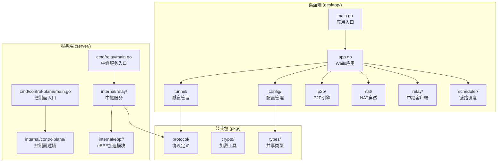
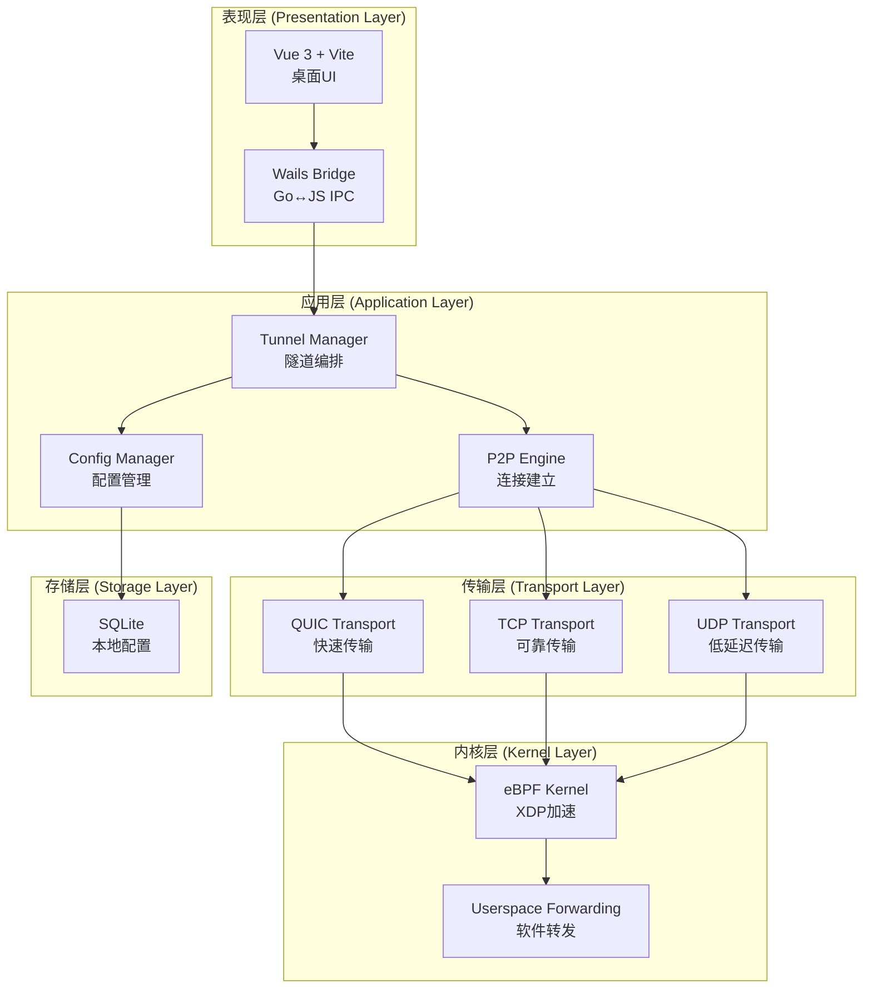
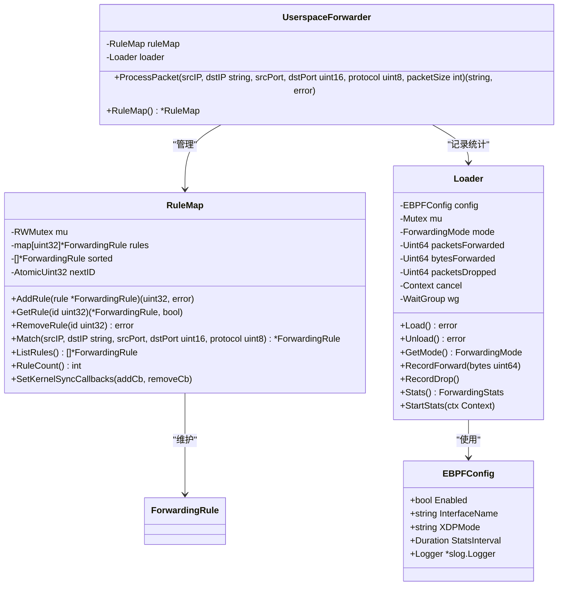
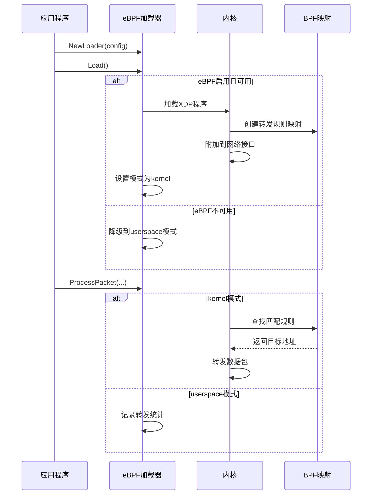
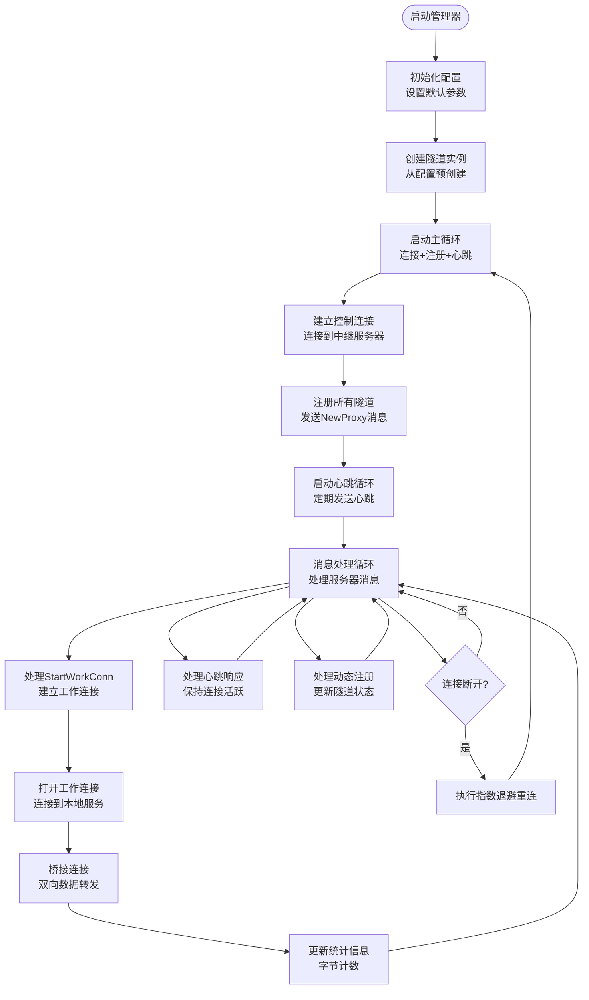
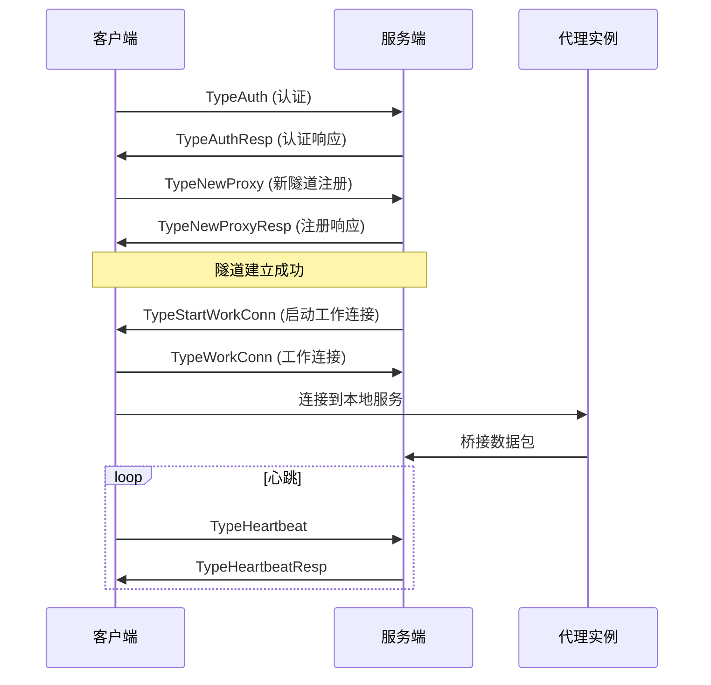
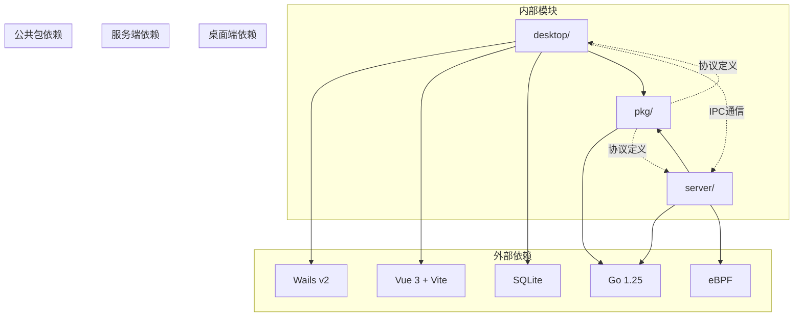
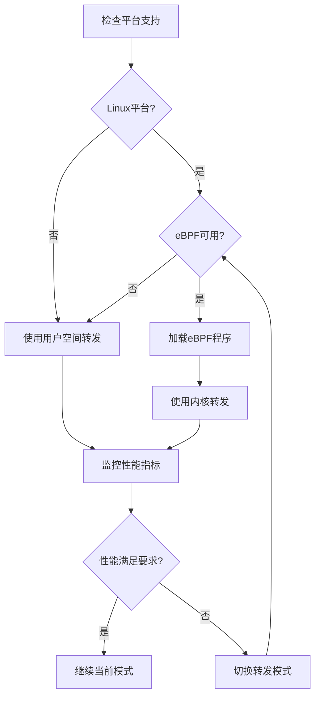

# eBPF包转发系统

<cite>
**本文档引用的文件**
- [README.md](file://README.md)
- [main.go](file://desktop/main.go)
- [app.go](file://desktop/app.go)
- [manager.go](file://desktop/internal/tunnel/manager.go)
- [tunnel.go](file://desktop/internal/tunnel/tunnel.go)
- [server.go](file://server/internal/relay/server.go)
- [message.go](file://pkg/protocol/message.go)
- [store.go](file://desktop/internal/config/store.go)
- [config.go](file://server/internal/ebpf/config.go)
- [forwarder.go](file://server/internal/ebpf/forwarder.go)
- [loader_linux.go](file://server/internal/ebpf/loader_linux.go)
- [loader_other.go](file://server/internal/ebpf/loader_other.go)
- [forwarder_test.go](file://server/internal/ebpf/forwarder_test.go)
- [loader_test.go](file://server/internal/ebpf/loader_test.go)
- [main.go](file://server/cmd/relay/main.go)
</cite>

## 目录
1. [简介](#简介)
2. [项目结构](#项目结构)
3. [核心组件](#核心组件)
4. [架构概览](#架构概览)
5. [详细组件分析](#详细组件分析)
6. [依赖关系分析](#依赖关系分析)
7. [性能考虑](#性能考虑)
8. [故障排除指南](#故障排除指南)
9. [结论](#结论)

## 简介

NexTunnel是一个开源的内网穿透和P2P直连现代化网络工具，采用Go + Vue 3 + Wails技术栈构建。该项目的核心目标是超越传统的FRP/NPS等"客户端→中转服务器"的TCP转发模式，打造下一代智能组网方案。

**项目愿景**：让内网穿透从"能连上"进化为"智能直连"——用户无需理解端口、NAT、UDP、Tunnel等底层概念，设备自动发现、自动组网、自动加速、自动直连。

## 项目结构

NexTunnel项目采用模块化设计，主要包含以下核心部分：

**图表来源**
- [README.md:54-111](file://README.md#L54-L111)
- [main.go:15-39](file://desktop/main.go#L15-L39)
- [server.go:14-46](file://server/internal/relay/server.go#L14-L46)

**章节来源**
- [README.md:54-111](file://README.md#L54-L111)
- [main.go:15-39](file://desktop/main.go#L15-L39)
- [server.go:14-46](file://server/internal/relay/server.go#L14-L46)

## 核心组件

### eBPF加速模块

eBPF加速模块是NexTunnel服务端的重要组成部分，提供了内核级别的包转发加速功能。该模块支持Linux平台的eBPF/XDP程序加载，并在非Linux平台上优雅降级到用户空间转发。

**章节来源**
- [config.go:1-51](file://server/internal/ebpf/config.go#L1-L51)
- [forwarder.go:1-242](file://server/internal/ebpf/forwarder.go#L1-L242)

### 隧道管理系统

桌面端的隧道管理系统负责管理TCP/HTTP隧道的创建、启动、停止和删除操作。它提供了完整的生命周期管理，包括自动重连机制和状态跟踪。

**章节来源**
- [manager.go:1-381](file://desktop/internal/tunnel/manager.go#L1-L381)
- [tunnel.go:1-146](file://desktop/internal/tunnel/tunnel.go#L1-L146)

### 协议处理系统

协议处理系统定义了客户端和服务端之间的通信协议，包括认证、隧道注册、工作连接建立等消息类型。该系统支持扩展的P2P信令和智能调度消息。

**章节来源**
- [message.go:1-480](file://pkg/protocol/message.go#L1-L480)

## 架构概览

NexTunnel采用分层架构设计，实现了从表现层到数据面的完整网络传输链路：

**图表来源**
- [README.md:147-163](file://README.md#L147-L163)
- [app.go:25-34](file://desktop/app.go#L25-L34)

## 详细组件分析

### eBPF加载器组件

eBPF加载器是系统的核心组件之一，负责管理eBPF程序的生命周期和转发规则的同步。

**图表来源**
- [forwarder.go:10-242](file://server/internal/ebpf/forwarder.go#L10-L242)
- [config.go:16-31](file://server/internal/ebpf/config.go#L16-L31)

#### Linux平台实现

在Linux平台上，eBPF加载器提供了完整的eBPF程序加载和管理功能：

**图表来源**
- [loader_linux.go:36-55](file://server/internal/ebpf/loader_linux.go#L36-L55)
- [forwarder.go:219-242](file://server/internal/ebpf/forwarder.go#L219-L242)

#### 非Linux平台实现

在非Linux平台上，eBPF模块优雅降级为用户空间转发：

**章节来源**
- [loader_other.go:11-57](file://server/internal/ebpf/loader_other.go#L11-L57)

### 隧道管理器组件

隧道管理器负责协调多个隧道实例的生命周期管理和状态同步：

**图表来源**
- [manager.go:107-154](file://desktop/internal/tunnel/manager.go#L107-L154)
- [tunnel.go:38-93](file://desktop/internal/tunnel/tunnel.go#L38-L93)

**章节来源**
- [manager.go:107-154](file://desktop/internal/tunnel/manager.go#L107-L154)
- [tunnel.go:38-93](file://desktop/internal/tunnel/tunnel.go#L38-L93)

### 协议消息处理

协议系统定义了完整的消息类型和处理流程：

**图表来源**
- [message.go:9-42](file://pkg/protocol/message.go#L9-L42)
- [server.go:118-174](file://server/internal/relay/server.go#L118-L174)

**章节来源**
- [message.go:9-42](file://pkg/protocol/message.go#L9-L42)
- [server.go:118-174](file://server/internal/relay/server.go#L118-L174)

## 依赖关系分析

NexTunnel项目的依赖关系体现了清晰的分层架构：

**图表来源**
- [README.md:22-35](file://README.md#L22-L35)
- [main.go:3-10](file://desktop/main.go#L3-L10)

**章节来源**
- [README.md:22-35](file://README.md#L22-L35)
- [main.go:3-10](file://desktop/main.go#L3-L10)

## 性能考虑

### eBPF加速优势

eBPF内核加速相比传统用户空间转发具有显著优势：

1. **零拷贝转发**：数据包直接在内核空间处理，避免用户空间和内核空间之间的数据拷贝
2. **硬件卸载支持**：现代网卡支持硬件XDP卸载，进一步提升性能
3. **CPU亲和性**：可以利用CPU亲和性和NUMA拓扑优化
4. **统计信息收集**：内核级统计信息收集，减少用户空间开销

### 优雅降级机制

系统实现了完善的降级机制，确保在各种环境下都能正常运行：

**图表来源**
- [loader_linux.go:36-55](file://server/internal/ebpf/loader_linux.go#L36-L55)
- [loader_other.go:34-39](file://server/internal/ebpf/loader_other.go#L34-L39)

## 故障排除指南

### 常见问题诊断

1. **eBPF加载失败**
   - 检查内核版本是否支持eBPF
   - 验证是否有足够的权限加载eBPF程序
   - 确认网络接口名称正确

2. **隧道连接问题**
   - 检查防火墙设置
   - 验证认证令牌配置
   - 确认服务器地址可达

3. **性能问题**
   - 监控eBPF统计信息
   - 检查内核版本和驱动支持
   - 验证硬件卸载功能

**章节来源**
- [loader_linux.go:36-55](file://server/internal/ebpf/loader_linux.go#L36-L55)
- [manager.go:119-122](file://desktop/internal/tunnel/manager.go#L119-L122)

### 日志分析

系统提供了详细的日志记录机制，便于问题诊断：

- **eBPF模块**：记录程序加载、卸载、错误等关键事件
- **隧道管理器**：记录连接状态变化、错误重连等信息
- **协议处理**：记录消息收发、解析错误等细节

## 结论

NexTunnel项目展现了现代网络工具的设计理念和技术实现。通过eBPF内核加速、优雅降级机制和模块化架构，系统在保证兼容性的同时提供了高性能的网络转发能力。

**主要特点**：
1. **内核级加速**：利用eBPF/XDP实现高性能包转发
2. **平台无关性**：在非Linux平台优雅降级到用户空间
3. **模块化设计**：清晰的分层架构便于维护和扩展
4. **智能调度**：为未来的P2P直连和智能调度预留接口

**未来发展方向**：
- 完善P2P直连功能和TUN/IPAM实现
- 实现智能调度算法和路径切换
- 增强安全机制和认证体系
- 优化性能监控和运维管理