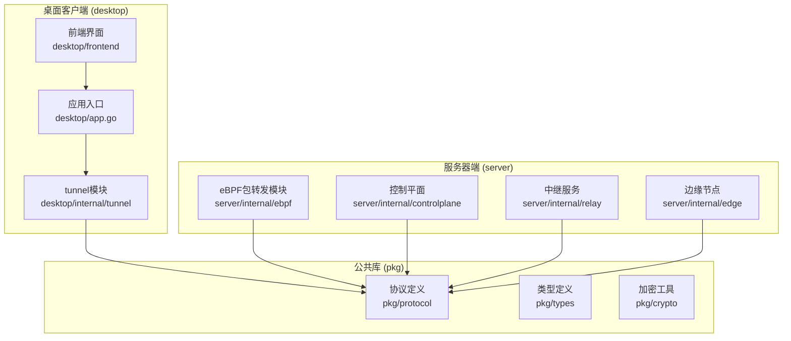
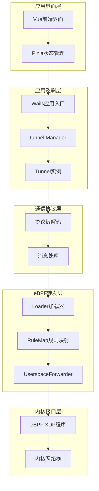
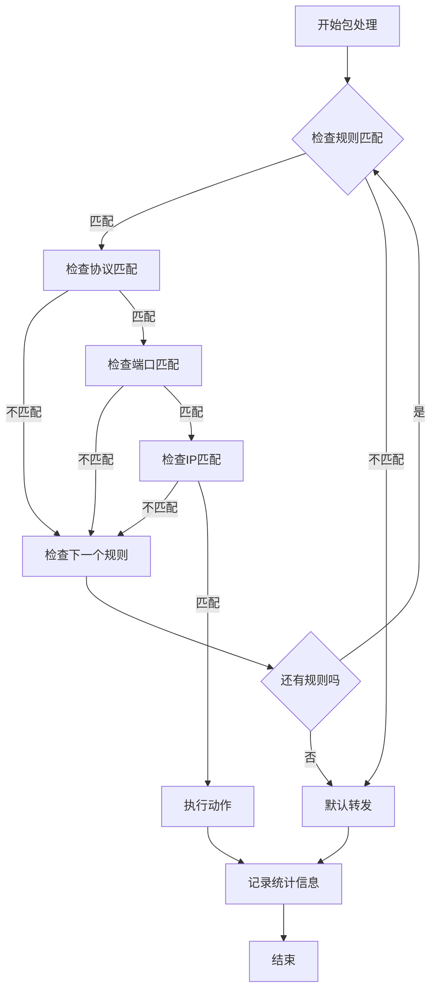
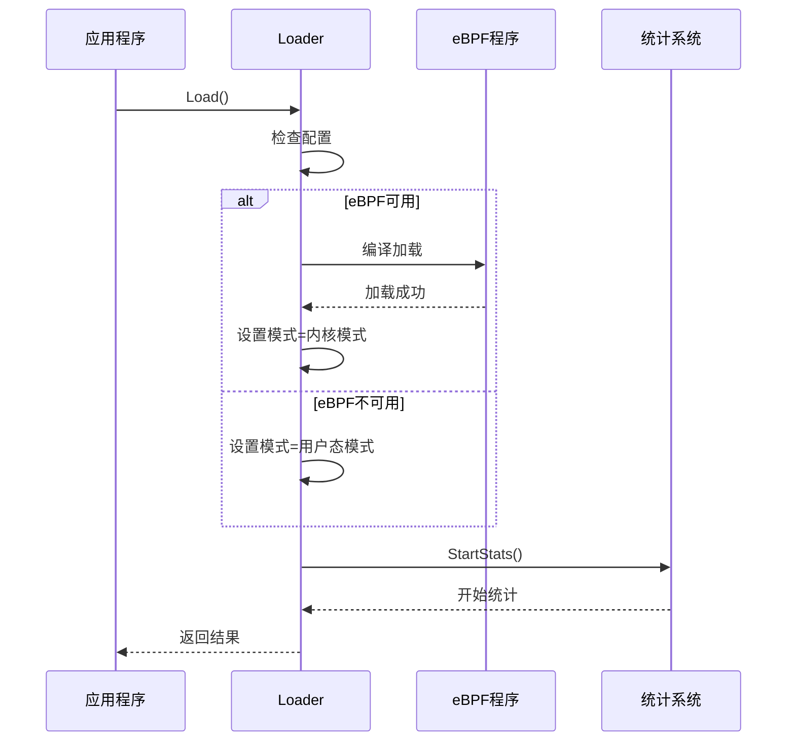
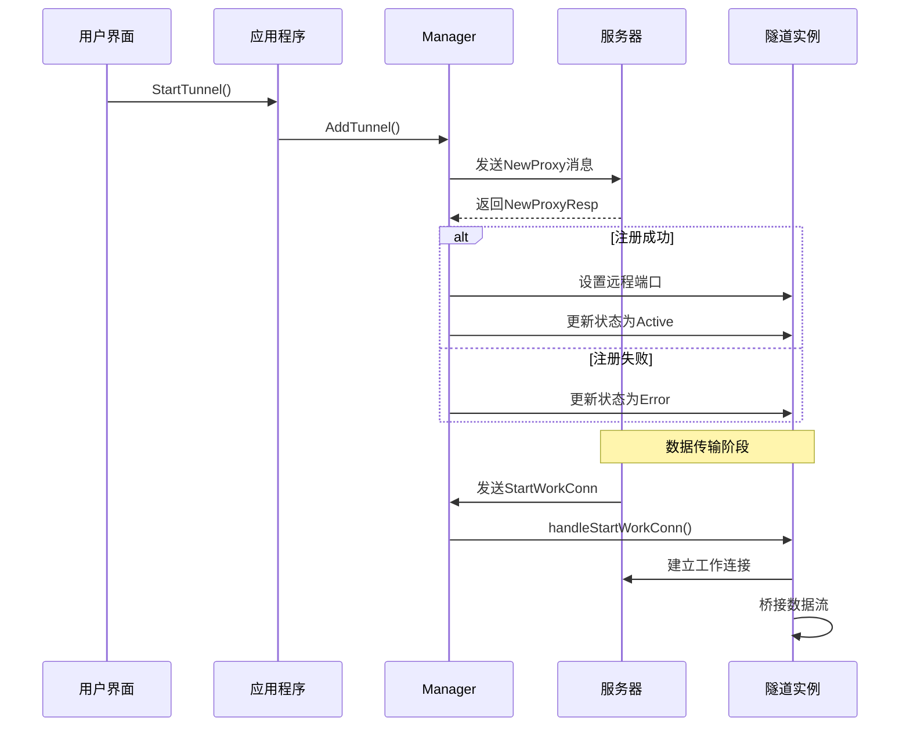
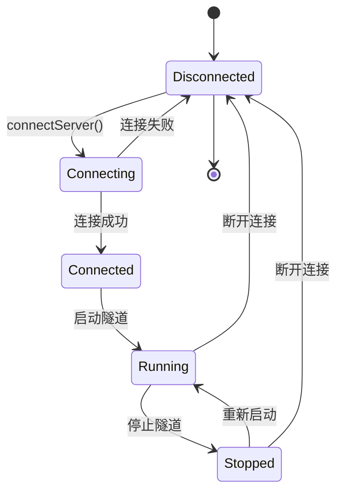
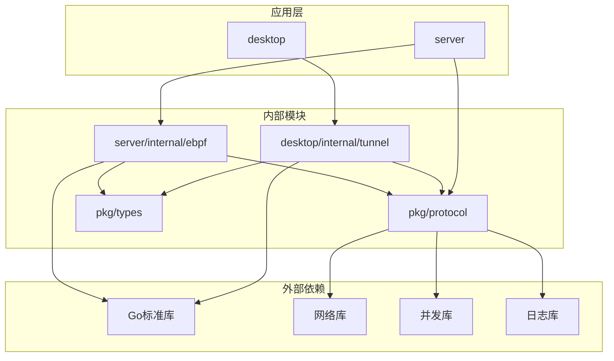

# eBPF包转发系统

<cite>
**本文档引用的文件**
- [forwarder.go](file://server/internal/ebpf/forwarder.go)
- [loader_linux.go](file://server/internal/ebpf/loader_linux.go)
- [loader_other.go](file://server/internal/ebpf/loader_other.go)
- [config.go](file://server/internal/ebpf/config.go)
- [forwarder_test.go](file://server/internal/ebpf/forwarder_test.go)
- [tunnel.go](file://desktop/internal/tunnel/tunnel.go)
- [manager.go](file://desktop/internal/tunnel/manager.go)
- [config.go](file://desktop/internal/tunnel/config.go)
- [message.go](file://pkg/protocol/message.go)
- [main.go](file://server/cmd/control-plane/main.go)
- [app.go](file://desktop/app.go)
- [tunnel.ts](file://desktop/frontend/src/stores/tunnel.ts)
</cite>

## 更新摘要
**所做更改**
- 更新了规则匹配系统章节，反映新的高级数据包转发规则和优先级匹配机制
- 新增了TCP和UDP协议过滤支持的说明
- 更新了内核模式集成和用户态回退机制的描述
- 增强了性能考虑和故障排除指南

## 目录
1. [项目概述](#项目概述)
2. [项目结构](#项目结构)
3. [核心组件](#核心组件)
4. [架构概览](#架构概览)
5. [详细组件分析](#详细组件分析)
6. [依赖关系分析](#依赖关系分析)
7. [性能考虑](#性能考虑)
8. [故障排除指南](#故障排除指南)
9. [结论](#结论)

## 项目概述

NexTunnel是一个基于eBPF技术的高性能网络包转发系统，旨在提供高效的TCP隧道服务和智能路径选择功能。该系统采用客户端-服务器架构，结合eBPF内核加速和用户态软件转发两种模式，确保在不同平台环境下的兼容性和性能。

系统的核心特性包括：
- eBPF XDP程序实现内核级包转发加速
- 用户态软件转发作为降级方案
- 智能隧道管理和服务发现
- 实时流量统计和监控
- 跨平台支持（Linux/非Linux）
- **新增**：高级数据包转发规则和优先级匹配机制
- **新增**：TCP和UDP协议过滤支持
- **新增**：内核模式集成和用户态回退机制

## 项目结构

整个项目采用模块化的组织方式，主要分为以下几个核心部分：

**图表来源**
- [forwarder.go:1-243](file://server/internal/ebpf/forwarder.go#L1-L243)
- [tunnel.go:1-138](file://desktop/internal/tunnel/tunnel.go#L1-L138)
- [message.go:1-480](file://pkg/protocol/message.go#L1-L480)

**章节来源**
- [forwarder.go:1-243](file://server/internal/ebpf/forwarder.go#L1-L243)
- [tunnel.go:1-138](file://desktop/internal/tunnel/tunnel.go#L1-L138)
- [message.go:1-480](file://pkg/protocol/message.go#L1-L480)

## 核心组件

### eBPF包转发引擎

eBPF包转发引擎是系统的核心组件，负责在网络层进行高效的数据包处理。它提供了两种工作模式：内核模式（使用eBPF XDP程序）和用户态模式（软件转发）。

#### 主要功能
- **规则匹配**：基于源IP、目标IP、源端口、目标端口和协议类型的多维度规则匹配
- **动作执行**：支持转发、丢弃、透传到内核栈等操作
- **统计收集**：实时收集转发、丢弃、字节计数等性能指标
- **模式切换**：根据eBPF可用性自动在内核模式和用户态模式间切换
- **协议支持**：支持TCP（6）和UDP（17）协议过滤
- **优先级匹配**：基于优先级的规则匹配机制，优先级数值越小表示优先级越高

#### 关键数据结构
- `ForwardingRule`：定义单个转发规则，包含ID、源地址、目标地址、源端口、目标端口、协议类型、动作、目标地址和优先级
- `RuleMap`：管理转发规则集合，支持内核同步回调和优先级排序
- `UserspaceForwarder`：用户态转发器
- `Loader`：eBPF程序生命周期管理

**章节来源**
- [forwarder.go:10-243](file://server/internal/ebpf/forwarder.go#L10-L243)
- [config.go:8-81](file://server/internal/ebpf/config.go#L8-L81)

### 隧道管理系统

桌面端的隧道管理系统负责客户端侧的隧道配置、管理和状态监控。

#### 主要职责
- **隧道配置管理**：创建、删除、修改隧道配置
- **连接管理**：维护与服务器的控制连接
- **动态隧道**：支持运行时动态添加和移除隧道
- **状态监控**：实时跟踪隧道状态和流量统计

#### 核心组件
- `Manager`：隧道管理器，协调所有隧道实例
- `Tunnel`：单个隧道实例，处理具体的数据转发
- `TunnelDef`：隧道配置定义

**章节来源**
- [manager.go:22-368](file://desktop/internal/tunnel/manager.go#L22-L368)
- [tunnel.go:16-138](file://desktop/internal/tunnel/tunnel.go#L16-L138)
- [config.go:6-40](file://desktop/internal/tunnel/config.go#L6-L40)

### 协议通信层

系统采用自定义的二进制协议进行客户端-服务器间的通信，支持多种消息类型和负载格式。

#### 消息类型
- **认证消息**：客户端身份验证
- **隧道管理**：新建、关闭、心跳等隧道相关操作
- **工作连接**：实际的数据传输连接
- **P2P信令**：点对点连接建立的信令消息

#### 协议特点
- 基于JSON的负载格式，便于调试和扩展
- 支持版本控制，保证向前兼容
- 内置错误处理和响应机制

**章节来源**
- [message.go:6-480](file://pkg/protocol/message.go#L6-L480)

## 架构概览

系统采用分层架构设计，从底层的eBPF包转发到上层的应用界面，各层之间通过清晰的接口进行交互。

**图表来源**
- [app.go:25-354](file://desktop/app.go#L25-L354)
- [manager.go:22-368](file://desktop/internal/tunnel/manager.go#L22-L368)
- [forwarder.go:199-243](file://server/internal/ebpf/forwarder.go#L199-L243)
- [loader_linux.go:13-129](file://server/internal/ebpf/loader_linux.go#L13-L129)

## 详细组件分析

### eBPF规则匹配系统

规则匹配系统是eBPF包转发的核心，实现了灵活而高效的包过滤机制。

#### 规则匹配算法

**图表来源**
- [forwarder.go:129-165](file://server/internal/ebpf/forwarder.go#L129-L165)

#### 规则优先级机制

系统支持基于优先级的规则匹配，优先级数值越小表示优先级越高。规则按优先级排序，确保高优先级规则优先被匹配。

**更新** 新增了完整的优先级匹配机制，支持TCP和UDP协议过滤

**章节来源**
- [forwarder.go:184-197](file://server/internal/ebpf/forwarder.go#L184-L197)

### Loader生命周期管理

Loader负责eBPF程序的完整生命周期管理，包括加载、卸载和状态监控。

#### 加载流程

**图表来源**
- [loader_linux.go:36-82](file://server/internal/ebpf/loader_linux.go#L36-L82)
- [loader_other.go:34-53](file://server/internal/ebpf/loader_other.go#L34-L53)

#### 统计收集机制

Loader内置了完整的统计收集机制，实时监控包转发性能指标。

**更新** 增强了统计功能，支持内核模式和用户态模式的性能监控

**章节来源**
- [loader_linux.go:84-129](file://server/internal/ebpf/loader_linux.go#L84-L129)
- [loader_other.go:52-75](file://server/internal/ebpf/loader_other.go#L52-L75)

### 隧道管理器

隧道管理器是桌面端的核心组件，负责协调多个隧道实例的生命周期管理。

#### 连接管理流程

**图表来源**
- [manager.go:94-141](file://desktop/internal/tunnel/manager.go#L94-L141)
- [tunnel.go:38-85](file://desktop/internal/tunnel/tunnel.go#L38-L85)

**章节来源**
- [manager.go:94-247](file://desktop/internal/tunnel/manager.go#L94-L247)
- [tunnel.go:38-124](file://desktop/internal/tunnel/tunnel.go#L38-L124)

### 前端状态管理

前端使用Pinia进行状态管理，提供了响应式的用户界面更新机制。

#### 状态流转

**图表来源**
- [tunnel.ts:36-199](file://desktop/frontend/src/stores/tunnel.ts#L36-L199)

**章节来源**
- [tunnel.ts:36-199](file://desktop/frontend/src/stores/tunnel.ts#L36-L199)

## 依赖关系分析

系统采用模块化设计，各组件之间的依赖关系清晰明确。

**图表来源**
- [forwarder.go:3-8](file://server/internal/ebpf/forwarder.go#L3-L8)
- [tunnel.go:3-14](file://desktop/internal/tunnel/tunnel.go#L3-L14)

**章节来源**
- [forwarder.go:3-8](file://server/internal/ebpf/forwarder.go#L3-L8)
- [tunnel.go:3-14](file://desktop/internal/tunnel/tunnel.go#L3-L14)

## 性能考虑

### eBPF性能优化

系统通过以下方式优化eBPF包转发性能：

1. **零拷贝优化**：利用eBPF的xdp_md结构体减少内存拷贝
2. **批量处理**：支持批量数据包处理提高吞吐量
3. **缓存策略**：规则匹配结果缓存减少重复计算
4. **原子操作**：使用原子操作保证并发安全
5. **优先级排序**：规则按优先级排序，减少匹配时间
6. **协议过滤**：支持TCP和UDP协议精确过滤

### 内存管理

- 使用sync.Pool复用临时对象
- 原子计数器避免锁竞争
- 及时释放不再使用的资源

### 网络优化

- 连接池复用TCP连接
- 异步I/O操作避免阻塞
- 流量控制防止拥塞

**更新** 增强了性能优化措施，包括优先级排序和协议过滤优化

## 故障排除指南

### 常见问题诊断

#### eBPF加载失败

**症状**：系统无法加载eBPF程序，自动降级到用户态模式

**可能原因**：
- 内核版本过低
- 权限不足
- 系统配置限制
- 平台不支持eBPF

**解决方案**：
1. 检查内核版本是否支持eBPF
2. 确认应用程序具有足够的权限
3. 查看系统日志获取详细错误信息
4. 在非Linux平台会自动使用用户态模式

#### 隧道连接异常

**症状**：隧道无法正常建立或频繁断开

**诊断步骤**：
1. 检查服务器连接状态
2. 验证隧道配置参数
3. 查看网络连通性
4. 检查防火墙设置

#### 性能问题

**症状**：包转发延迟过高或吞吐量不足

**排查方法**：
1. 监控eBPF统计信息
2. 检查规则匹配效率
3. 分析系统资源使用情况
4. 优化规则配置
5. 检查协议过滤设置

#### 规则匹配问题

**症状**：数据包未按预期规则处理

**诊断步骤**：
1. 检查规则优先级设置
2. 验证协议类型配置（TCP/UDP）
3. 确认端口和IP匹配规则
4. 查看规则匹配日志

**更新** 新增了规则匹配问题的诊断步骤

**章节来源**
- [loader_linux.go:36-60](file://server/internal/ebpf/loader_linux.go#L36-L60)
- [manager.go:94-141](file://desktop/internal/tunnel/manager.go#L94-L141)

## 结论

NexTunnel eBPF包转发系统是一个设计精良的高性能网络解决方案。通过将eBPF内核加速与用户态软件转发相结合，系统在保证跨平台兼容性的同时实现了卓越的性能表现。

### 主要优势

1. **高性能**：eBPF内核模式提供接近原生的包转发性能
2. **高可用**：自动降级机制确保系统稳定性
3. **易用性**：简洁的API和直观的用户界面
4. **可扩展性**：模块化设计支持功能扩展和定制
5. **智能化**：支持高级规则匹配和优先级机制
6. **协议支持**：完整的TCP和UDP协议过滤能力

### 技术特色

- 完整的跨平台支持
- 实时性能监控和统计
- 灵活的规则匹配机制
- 响应式的用户界面
- **新增**：智能优先级匹配系统
- **新增**：精确的协议过滤支持

该系统为现代网络应用提供了可靠的基础设施，适用于各种场景下的数据传输需求。

**更新** 本次更新重点反映了新增的eBPF包转发系统功能，包括高级数据包转发规则、优先级匹配机制、TCP和UDP协议过滤支持，以及内核模式集成和用户态回退机制。这些新特性显著提升了系统的灵活性和性能表现。