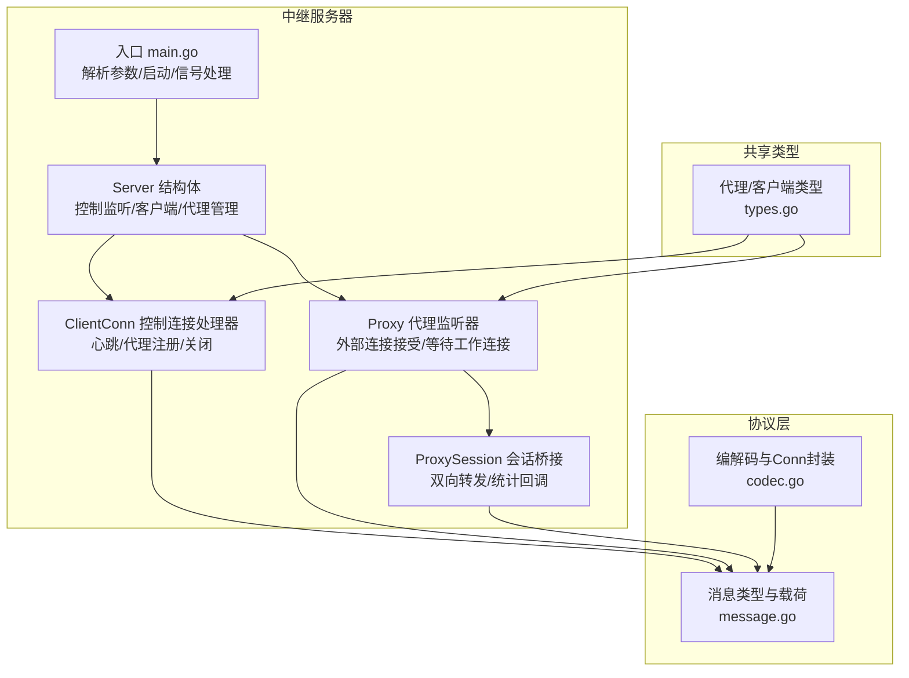
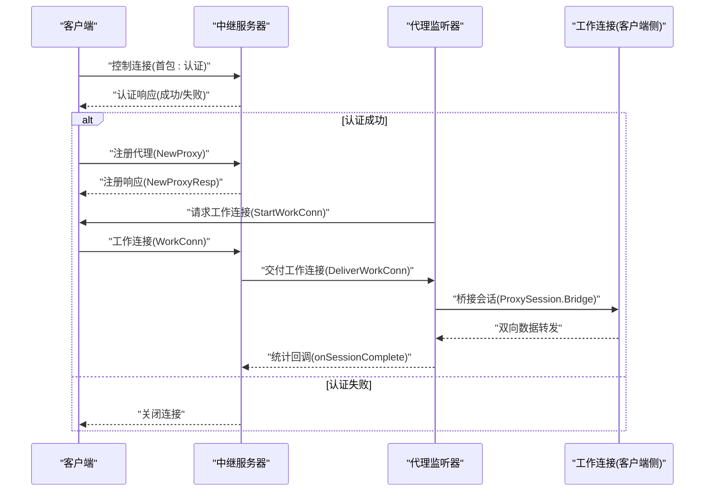
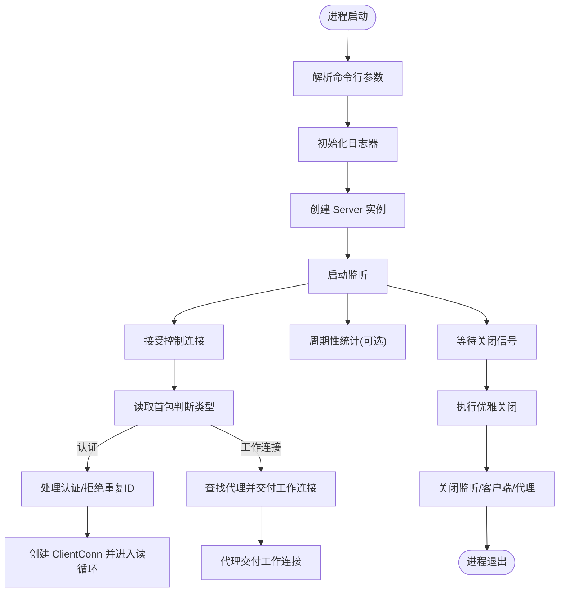
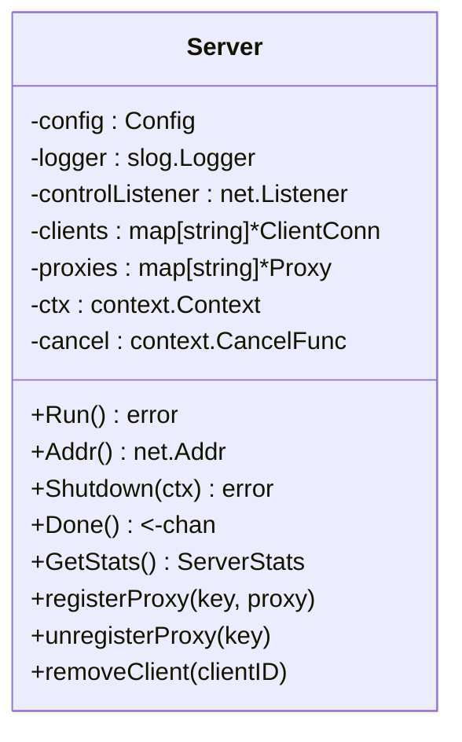
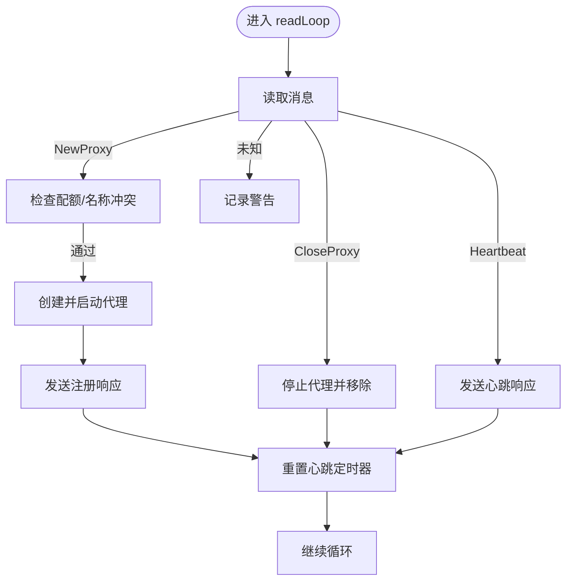
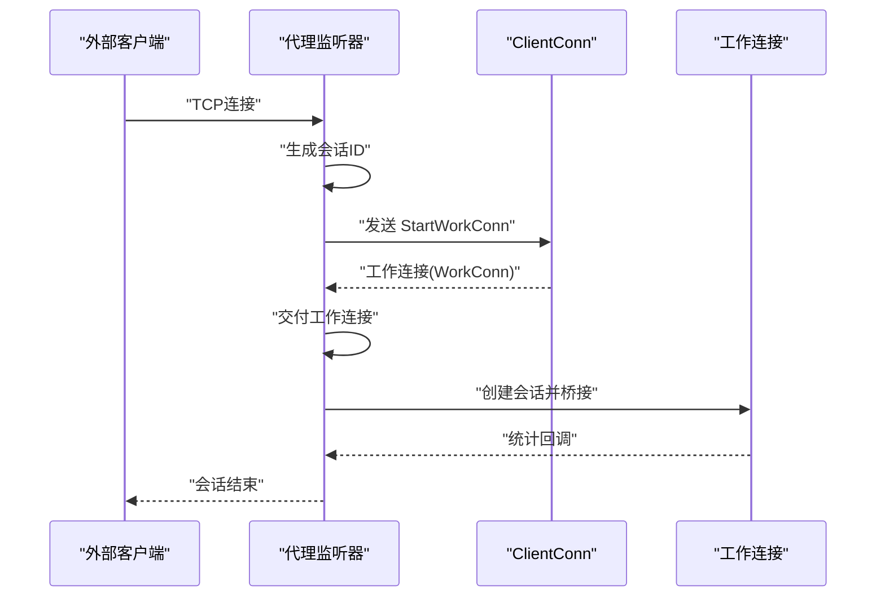
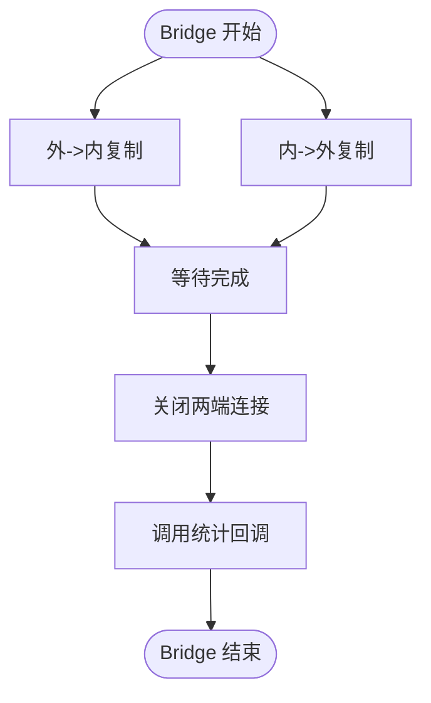
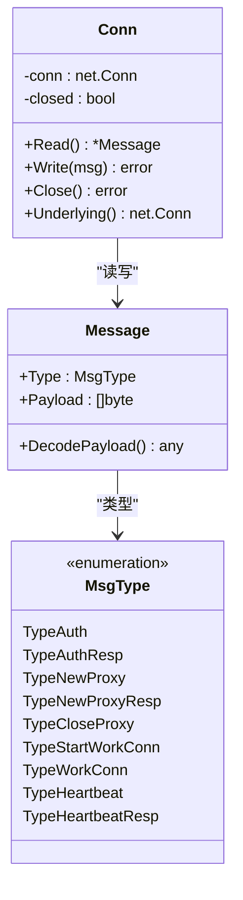
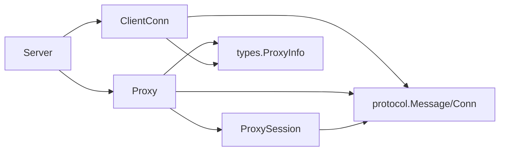

# 中继服务器

<cite>
**本文引用的文件列表**
- [server/cmd/relay/main.go](file://server/cmd/relay/main.go)
- [server/internal/relay/server.go](file://server/internal/relay/server.go)
- [server/internal/relay/config.go](file://server/internal/relay/config.go)
- [server/internal/relay/client_conn.go](file://server/internal/relay/client_conn.go)
- [server/internal/relay/proxy.go](file://server/internal/relay/proxy.go)
- [server/internal/relay/session.go](file://server/internal/relay/session.go)
- [pkg/protocol/message.go](file://pkg/protocol/message.go)
- [pkg/protocol/codec.go](file://pkg/protocol/codec.go)
- [pkg/protocol/errors.go](file://pkg/protocol/errors.go)
- [pkg/types/types.go](file://pkg/types/types.go)
- [server/Dockerfile](file://server/Dockerfile)
- [docker-compose.yml](file://docker-compose.yml)
- [README.md](file://README.md)
- [Makefile](file://Makefile)
</cite>

## 目录
1. [简介](#简介)
2. [项目结构](#项目结构)
3. [核心组件](#核心组件)
4. [架构总览](#架构总览)
5. [详细组件分析](#详细组件分析)
6. [依赖关系分析](#依赖关系分析)
7. [性能考量](#性能考量)
8. [故障排查指南](#故障排查指南)
9. [结论](#结论)
10. [附录](#附录)

## 简介
本文件面向系统管理员与开发者，全面阐述 NexTunnel 中继服务器（Relay Server）的启动流程、配置参数、会话管理、运行时监控与统计、优雅关闭机制、通信协议与数据传输模式、以及部署与运维监控建议。中继服务器负责接收来自客户端的控制连接与工作连接，维护代理监听器，桥接外部请求与客户端内部工作连接，并提供周期性统计输出与健康关闭能力。

## 项目结构
中继服务器位于 server 内部，二进制入口在 server/cmd/relay/main.go，核心逻辑集中在 server/internal/relay 下，网络协议定义在 pkg/protocol，共享类型在 pkg/types。

图表来源
- [server/cmd/relay/main.go:15-81](file://server/cmd/relay/main.go#L15-L81)
- [server/internal/relay/server.go:13-306](file://server/internal/relay/server.go#L13-L306)
- [server/internal/relay/client_conn.go:14-216](file://server/internal/relay/client_conn.go#L14-L216)
- [server/internal/relay/proxy.go:16-180](file://server/internal/relay/proxy.go#L16-L180)
- [server/internal/relay/session.go:19-79](file://server/internal/relay/session.go#L19-L79)
- [pkg/protocol/message.go:6-203](file://pkg/protocol/message.go#L6-L203)
- [pkg/protocol/codec.go:65-131](file://pkg/protocol/codec.go#L65-L131)
- [pkg/types/types.go:6-50](file://pkg/types/types.go#L6-L50)

章节来源
- [README.md:1-20](file://README.md#L1-L20)
- [server/cmd/relay/main.go:15-81](file://server/cmd/relay/main.go#L15-L81)
- [server/internal/relay/server.go:13-306](file://server/internal/relay/server.go#L13-L306)

## 核心组件
- 入口与生命周期：命令行参数解析、日志初始化、服务器启动、周期性统计、信号处理与优雅关闭。
- 服务器核心：控制监听、客户端集合、代理集合、上下文与关闭通道。
- 客户端连接：读取循环、心跳超时、代理注册/关闭、向客户端发送工作连接请求。
- 代理监听器：外部连接接受、生成会话ID、等待工作连接、桥接会话、统计。
- 会话桥接：双向 io.Copy 转发、原子计数统计、完成回调。
- 协议层：消息类型、载荷结构、编解码、Conn 封装与并发安全。
- 共享类型：代理类型、状态、客户端信息等。

章节来源
- [server/cmd/relay/main.go:15-81](file://server/cmd/relay/main.go#L15-L81)
- [server/internal/relay/server.go:13-306](file://server/internal/relay/server.go#L13-L306)
- [server/internal/relay/client_conn.go:14-216](file://server/internal/relay/client_conn.go#L14-L216)
- [server/internal/relay/proxy.go:16-180](file://server/internal/relay/proxy.go#L16-L180)
- [server/internal/relay/session.go:19-79](file://server/internal/relay/session.go#L19-L79)
- [pkg/protocol/message.go:6-203](file://pkg/protocol/message.go#L6-L203)
- [pkg/protocol/codec.go:65-131](file://pkg/protocol/codec.go#L65-L131)
- [pkg/types/types.go:6-50](file://pkg/types/types.go#L6-L50)

## 架构总览
中继服务器采用“控制通道 + 工作通道”的双通道模型：
- 控制通道：客户端首次连接时发送认证消息，随后用于代理注册/关闭、心跳、工作连接请求。
- 工作通道：由服务器发起请求，客户端建立到工作通道的连接，实现外部请求与客户端内部服务的桥接。

图表来源
- [server/internal/relay/server.go:84-103](file://server/internal/relay/server.go#L84-L103)
- [server/internal/relay/server.go:157-195](file://server/internal/relay/server.go#L157-L195)
- [server/internal/relay/client_conn.go:84-129](file://server/internal/relay/client_conn.go#L84-L129)
- [server/internal/relay/proxy.go:120-141](file://server/internal/relay/proxy.go#L120-L141)
- [server/internal/relay/session.go:39-79](file://server/internal/relay/session.go#L39-L79)
- [pkg/protocol/message.go:83-153](file://pkg/protocol/message.go#L83-L153)

## 详细组件分析

### 启动流程与配置解析
- 命令行参数
  - 绑定地址、控制端口、心跳超时、每客户端最大代理数、工作连接超时、统计间隔。
- 日志与运行
  - 初始化 slog 日志器，创建 Server 实例并启动监听；可选周期性统计输出。
- 信号与优雅关闭
  - 监听 SIGINT/SIGTERM，30 秒关闭超时，关闭控制监听、断开所有客户端、停止所有代理。

图表来源
- [server/cmd/relay/main.go:15-81](file://server/cmd/relay/main.go#L15-L81)
- [server/internal/relay/server.go:43-55](file://server/internal/relay/server.go#L43-L55)
- [server/internal/relay/server.go:65-80](file://server/internal/relay/server.go#L65-L80)
- [server/internal/relay/server.go:82-103](file://server/internal/relay/server.go#L82-L103)
- [server/internal/relay/server.go:157-195](file://server/internal/relay/server.go#L157-L195)

章节来源
- [server/cmd/relay/main.go:15-81](file://server/cmd/relay/main.go#L15-L81)
- [server/internal/relay/config.go:8-38](file://server/internal/relay/config.go#L8-L38)

### 服务器核心（Server）
- 责任边界
  - 控制监听、客户端集合、代理集合、上下文与关闭通道、统计聚合。
- 关键方法
  - Run：绑定监听并启动接受循环。
  - handleNewConnection：区分控制连接与工作连接。
  - handleControlConn：认证校验、去重、返回认证结果、登记客户端。
  - handleWorkConn：根据代理名定位客户端并交付工作连接。
  - Shutdown：取消上下文、关闭监听、断开客户端、停止代理。
  - GetStats：聚合各代理字节与会话数。

图表来源
- [server/internal/relay/server.go:13-306](file://server/internal/relay/server.go#L13-L306)

章节来源
- [server/internal/relay/server.go:13-306](file://server/internal/relay/server.go#L13-L306)

### 客户端连接（ClientConn）
- 责任边界
  - 维护单个客户端的控制连接，处理代理注册/关闭、心跳、向客户端发送工作连接请求。
- 关键流程
  - readLoop：持续读取消息，重置心跳定时器；处理新代理、关闭代理、心跳响应。
  - handleNewProxy：检查配额与名称冲突，创建代理并启动监听，返回注册结果。
  - handleCloseProxy：删除代理并停止，从服务器代理表移除。
  - resetHeartbeat：基于配置的心跳超时关闭连接。
  - cleanup：断开时清理代理、从服务器移除客户端。

图表来源
- [server/internal/relay/client_conn.go:45-82](file://server/internal/relay/client_conn.go#L45-L82)
- [server/internal/relay/client_conn.go:84-129](file://server/internal/relay/client_conn.go#L84-L129)
- [server/internal/relay/client_conn.go:142-162](file://server/internal/relay/client_conn.go#L142-L162)
- [server/internal/relay/client_conn.go:172-181](file://server/internal/relay/client_conn.go#L172-L181)

章节来源
- [server/internal/relay/client_conn.go:14-216](file://server/internal/relay/client_conn.go#L14-L216)

### 代理监听器（Proxy）
- 责任边界
  - 外部 TCP 监听、接受连接、生成会话ID、等待工作连接、桥接会话、统计。
- 关键流程
  - Start：绑定监听，更新实际端口，启动接受循环。
  - acceptLoop：接受外部连接，创建会话ID，等待工作连接，超时或取消清理。
  - DeliverWorkConn：将工作连接交付给对应会话，否则关闭。
  - Stop：取消上下文、关闭监听、清理挂起会话。
  - onSessionComplete：原子累加字节与会话计数。

图表来源
- [server/internal/relay/proxy.go:47-61](file://server/internal/relay/proxy.go#L47-L61)
- [server/internal/relay/proxy.go:68-100](file://server/internal/relay/proxy.go#L68-L100)
- [server/internal/relay/proxy.go:102-118](file://server/internal/relay/proxy.go#L102-L118)
- [server/internal/relay/proxy.go:120-141](file://server/internal/relay/proxy.go#L120-L141)
- [server/internal/relay/proxy.go:149-179](file://server/internal/relay/proxy.go#L149-L179)

章节来源
- [server/internal/relay/proxy.go:16-180](file://server/internal/relay/proxy.go#L16-L180)

### 会话桥接（ProxySession）
- 责任边界
  - 双向桥接外部与工作连接，统计字节，完成后回调。
- 关键流程
  - Bridge：两个 goroutine 分别进行外到内与内到外的数据复制，使用原子变量统计字节，完成后调用回调。

图表来源
- [server/internal/relay/session.go:39-79](file://server/internal/relay/session.go#L39-L79)

章节来源
- [server/internal/relay/session.go:19-79](file://server/internal/relay/session.go#L19-L79)

### 通信协议与数据传输
- 消息类型与载荷
  - 认证、认证响应、注册代理、注册代理响应、关闭代理、开始工作连接、工作连接、心跳、心跳响应。
- 编解码
  - 固定头部（类型+长度），最大载荷限制，Conn 封装保证并发安全。
- 错误处理
  - 载荷过大、未知消息类型、连接已关闭等错误。

图表来源
- [pkg/protocol/message.go:6-203](file://pkg/protocol/message.go#L6-L203)
- [pkg/protocol/codec.go:65-131](file://pkg/protocol/codec.go#L65-L131)
- [pkg/protocol/errors.go:5-14](file://pkg/protocol/errors.go#L5-L14)

章节来源
- [pkg/protocol/message.go:6-203](file://pkg/protocol/message.go#L6-L203)
- [pkg/protocol/codec.go:16-63](file://pkg/protocol/codec.go#L16-L63)
- [pkg/protocol/errors.go:5-14](file://pkg/protocol/errors.go#L5-L14)

## 依赖关系分析
- 组件耦合
  - Server 与 ClientConn、Proxy 强关联；Proxy 与 ProxySession 弱耦合（仅通过回调）。
  - 协议层独立于业务逻辑，通过 message/codec 提供统一接口。
- 外部依赖
  - 标准库 net、sync、context、slog、io。
  - 第三方 UUID 库用于会话标识。

图表来源
- [server/internal/relay/server.go:13-306](file://server/internal/relay/server.go#L13-L306)
- [server/internal/relay/client_conn.go:14-216](file://server/internal/relay/client_conn.go#L14-L216)
- [server/internal/relay/proxy.go:16-180](file://server/internal/relay/proxy.go#L16-L180)
- [server/internal/relay/session.go:19-79](file://server/internal/relay/session.go#L19-L79)
- [pkg/protocol/message.go:6-203](file://pkg/protocol/message.go#L6-L203)
- [pkg/types/types.go:33-42](file://pkg/types/types.go#L33-L42)

章节来源
- [server/internal/relay/server.go:13-306](file://server/internal/relay/server.go#L13-L306)
- [server/internal/relay/client_conn.go:14-216](file://server/internal/relay/client_conn.go#L14-L216)
- [server/internal/relay/proxy.go:16-180](file://server/internal/relay/proxy.go#L16-L180)
- [server/internal/relay/session.go:19-79](file://server/internal/relay/session.go#L19-L79)
- [pkg/types/types.go:33-42](file://pkg/types/types.go#L33-L42)

## 性能考量
- 连接与会话
  - 外部连接与工作连接分别在 goroutine 中进行双向复制，避免阻塞。
  - 使用原子变量统计字节与会话数，减少锁竞争。
- 资源管理
  - 心跳超时自动断开长时间无活动的控制连接，降低资源占用。
  - 代理停止时清理挂起会话，防止泄漏。
- 配置调优
  - 心跳超时：根据网络质量调整，过短导致误断，过长影响资源回收。
  - 最大代理数：限制单客户端资源消耗，防止过载。
  - 工作连接超时：平衡等待时间与资源占用。
  - 统计间隔：生产环境建议开启以观察吞吐与会话数。

章节来源
- [server/internal/relay/client_conn.go:172-181](file://server/internal/relay/client_conn.go#L172-L181)
- [server/internal/relay/proxy.go:149-179](file://server/internal/relay/proxy.go#L149-L179)
- [server/internal/relay/session.go:41-79](file://server/internal/relay/session.go#L41-L79)
- [server/internal/relay/config.go:17-26](file://server/internal/relay/config.go#L17-L26)

## 故障排查指南
- 启动失败
  - 监听端口被占用：检查控制端口与防火墙；必要时修改端口。
  - 权限问题：确保非特权端口或具备相应权限。
- 认证失败
  - 协议版本不匹配：确认客户端与服务器版本一致。
  - 客户端ID重复：同一ID不可重复连接。
- 代理注册失败
  - 监听失败：目标端口不可用或被占用；检查端口范围与权限。
  - 超出最大代理数：调整配置或清理闲置代理。
- 工作连接未到达
  - 客户端未建立工作连接：检查客户端日志与网络连通性。
  - 会话超时：适当增大工作连接超时。
- 运行时异常
  - 心跳超时：检查网络抖动与客户端稳定性。
  - 统计缺失：确认统计间隔是否启用。
- 优雅关闭
  - 若关闭超时：检查是否存在阻塞的会话或代理未正确停止。

章节来源
- [server/internal/relay/server.go:114-138](file://server/internal/relay/server.go#L114-L138)
- [server/internal/relay/client_conn.go:92-103](file://server/internal/relay/client_conn.go#L92-L103)
- [server/internal/relay/proxy.go:102-118](file://server/internal/relay/proxy.go#L102-L118)
- [server/internal/relay/server.go:216-251](file://server/internal/relay/server.go#L216-L251)

## 结论
中继服务器通过清晰的控制/工作双通道设计、严格的认证与心跳机制、完善的代理生命周期管理与会话桥接，实现了稳定高效的内网穿透服务。配合周期性统计与优雅关闭，满足生产环境的可观测性与可靠性需求。建议结合部署与运维实践，合理配置参数并建立监控告警体系。

## 附录

### 部署指南
- Docker 镜像与容器
  - 使用 server/Dockerfile 构建镜像，默认暴露 7000 端口，入口为 relay-server。
  - docker-compose 示例启用了端口映射与命令行参数示例。
- 本地构建
  - 使用 Makefile 的 build-server 目标构建 relay-server 二进制。
- 运行参数
  - 绑定地址、控制端口、心跳超时、最大代理数、工作连接超时、统计间隔。

章节来源
- [server/Dockerfile:15-27](file://server/Dockerfile#L15-L27)
- [docker-compose.yml:3-12](file://docker-compose.yml#L3-L12)
- [Makefile:23-28](file://Makefile#L23-L28)
- [server/cmd/relay/main.go:16-20](file://server/cmd/relay/main.go#L16-L20)
- [server/internal/relay/config.go:28-37](file://server/internal/relay/config.go#L28-L37)

### 运维监控与告警
- 周期性统计
  - 通过 stats-interval 参数开启，输出客户端数、代理数、会话数与字节数。
- 健康检查
  - 观察控制连接与代理监听状态、会话成功率与延迟。
- 告警建议
  - 客户端数/代理数异常波动、会话失败率升高、字节增长异常、心跳超时频繁。

章节来源
- [server/cmd/relay/main.go:33-56](file://server/cmd/relay/main.go#L33-L56)
- [server/internal/relay/server.go:281-305](file://server/internal/relay/server.go#L281-L305)