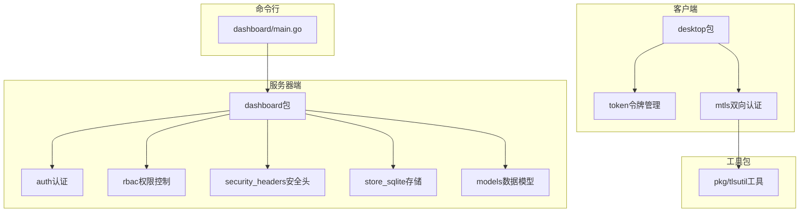
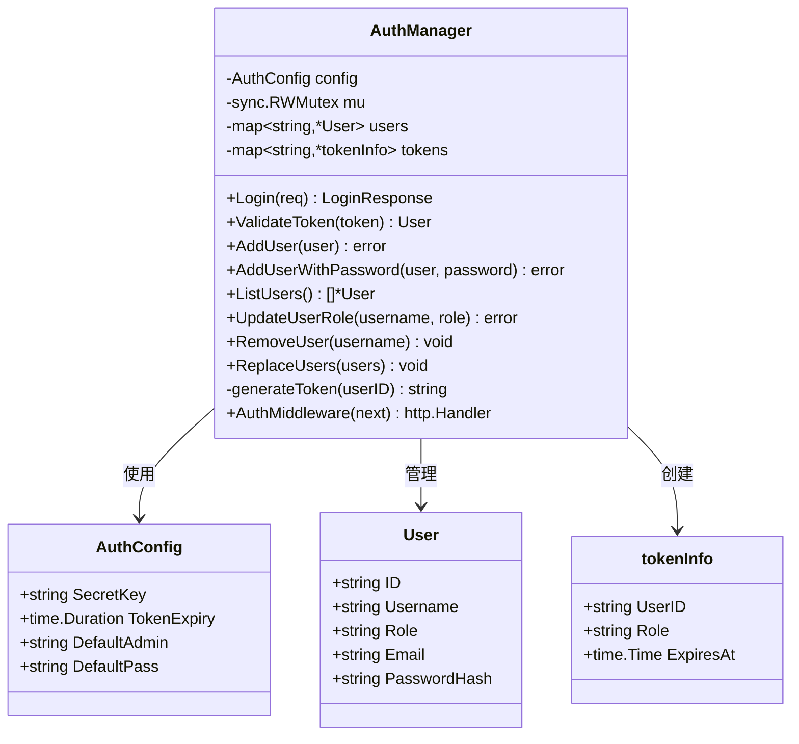
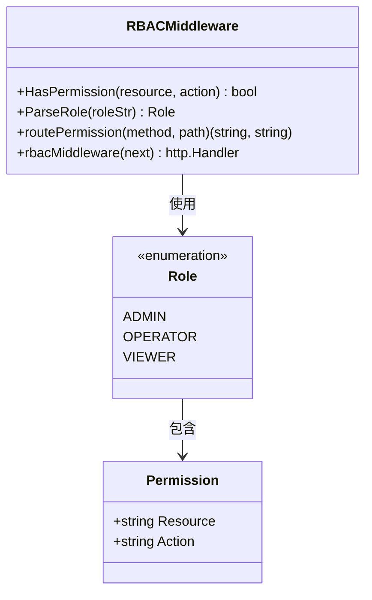
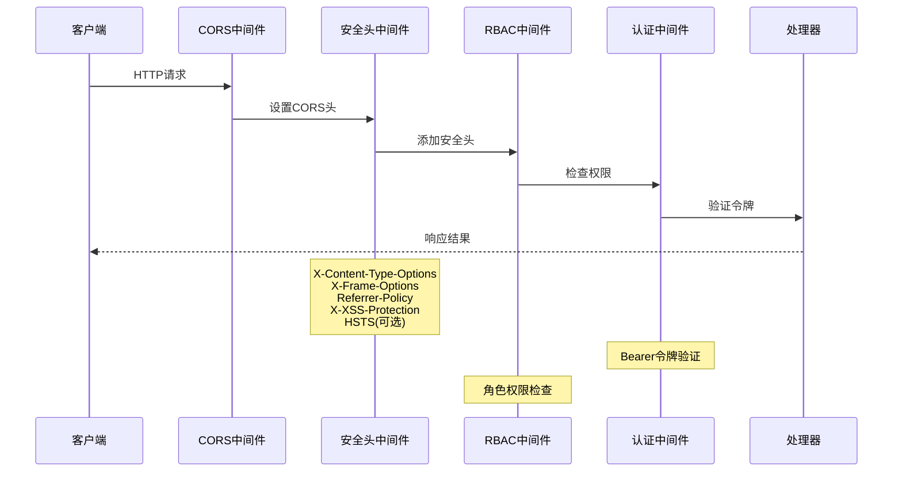
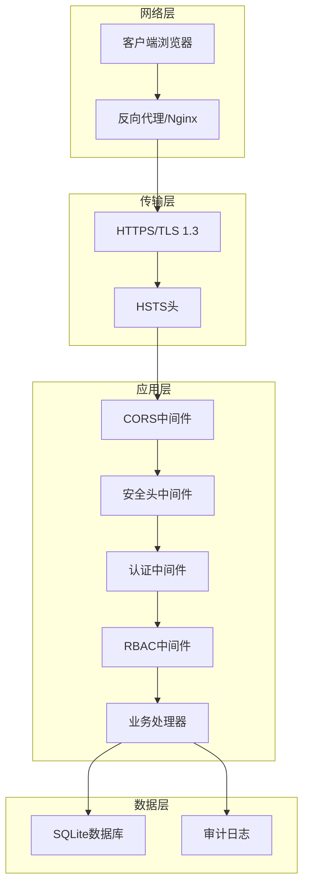
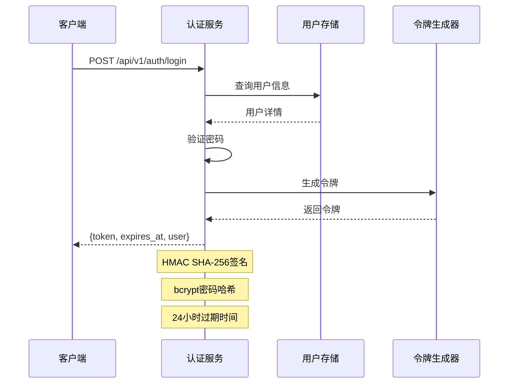
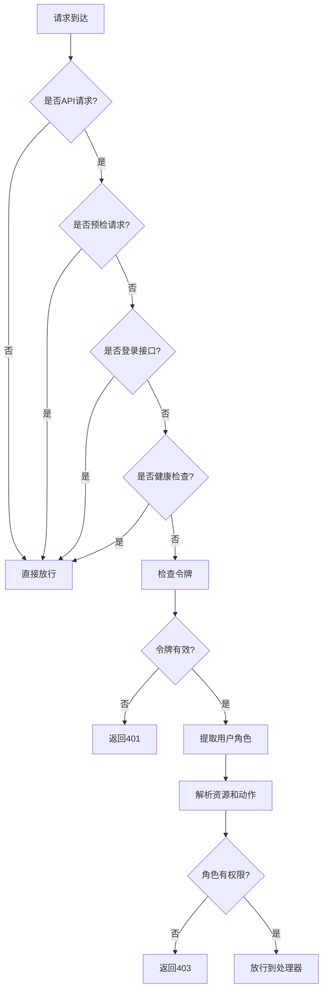
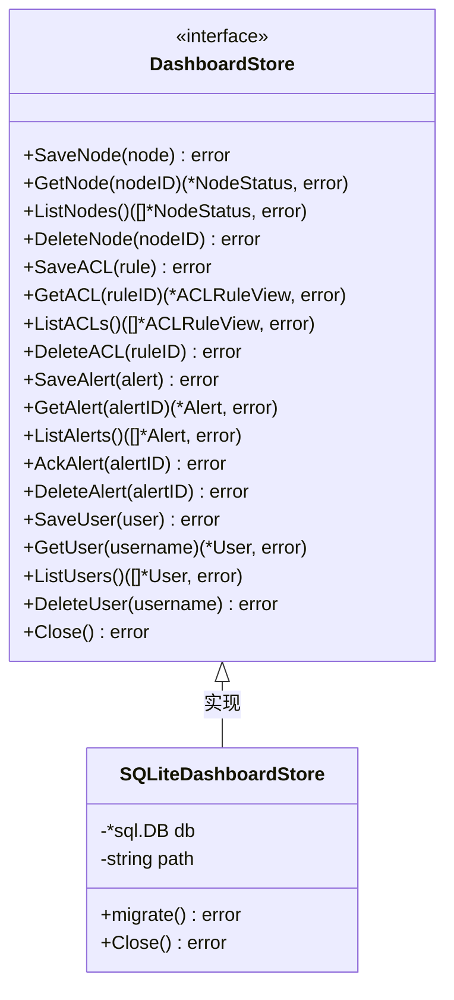
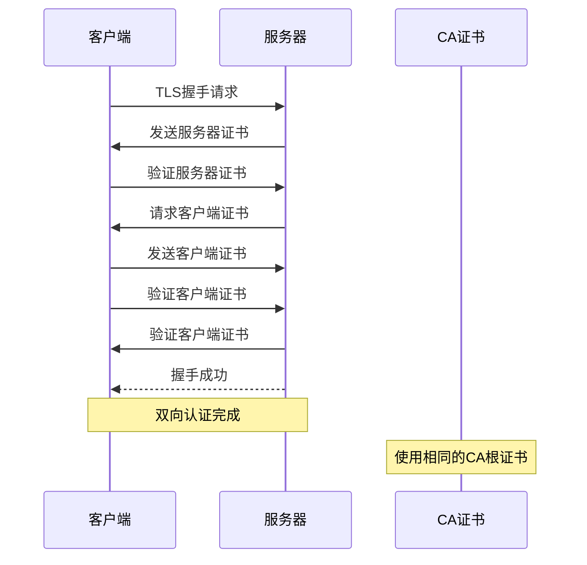
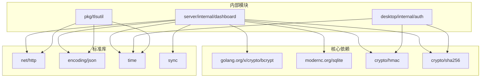

# 仪表板安全增强

<cite>
**本文档引用的文件**
- [server.go](file://server/internal/dashboard/server.go)
- [auth.go](file://server/internal/dashboard/auth.go)
- [rbac.go](file://server/internal/dashboard/rbac.go)
- [security_headers.go](file://server/internal/dashboard/security_headers.go)
- [models.go](file://server/internal/dashboard/models.go)
- [store_sqlite.go](file://server/internal/dashboard/store_sqlite.go)
- [main.go](file://server/cmd/dashboard/main.go)
- [token.go](file://desktop/internal/auth/token.go)
- [mtls.go](file://desktop/internal/auth/mtls.go)
- [tlsutil.go](file://pkg/tlsutil/tlsutil.go)
</cite>

## 目录
1. [简介](#简介)
2. [项目结构](#项目结构)
3. [核心组件](#核心组件)
4. [架构概览](#架构概览)
5. [详细组件分析](#详细组件分析)
6. [依赖关系分析](#依赖关系分析)
7. [性能考虑](#性能考虑)
8. [故障排除指南](#故障排除指南)
9. [结论](#结论)

## 简介

NexTunnel 仪表板安全增强项目旨在提升系统的整体安全性，通过实施多层安全防护机制来保护仪表板服务免受各种网络威胁。该项目采用现代化的安全架构，结合了认证授权、访问控制、传输安全和数据保护等多种安全措施。

本项目的核心目标包括：
- 实施严格的用户身份验证和授权机制
- 建立基于角色的访问控制系统（RBAC）
- 提供安全的传输层保护（HTTPS/HSTS）
- 实现审计日志记录和监控
- 确保数据持久化存储的安全性

## 项目结构

仪表板安全增强项目主要分布在以下目录中：

**图表来源**
- [server.go:1-50](file://server/internal/dashboard/server.go#L1-L50)
- [auth.go:1-50](file://server/internal/dashboard/auth.go#L1-L50)
- [rbac.go:1-50](file://server/internal/dashboard/rbac.go#L1-L50)

**章节来源**
- [server.go:1-100](file://server/internal/dashboard/server.go#L1-L100)
- [main.go:1-50](file://server/cmd/dashboard/main.go#L1-L50)

## 核心组件

### 认证管理系统

认证系统是整个安全架构的基础，负责用户身份验证和令牌管理：

**图表来源**
- [auth.go:35-70](file://server/internal/dashboard/auth.go#L35-L70)
- [auth.go:16-32](file://server/internal/dashboard/auth.go#L16-L32)

### 基于角色的访问控制（RBAC）

RBAC系统提供了细粒度的权限控制机制：

**图表来源**
- [rbac.go:8-25](file://server/internal/dashboard/rbac.go#L8-L25)
- [rbac.go:53-77](file://server/internal/dashboard/rbac.go#L53-L77)

### 安全中间件栈

仪表板采用了多层安全中间件来保护所有传入的请求：

**图表来源**
- [server.go:146-153](file://server/internal/dashboard/server.go#L146-L153)
- [security_headers.go:5-16](file://server/internal/dashboard/security_headers.go#L5-L16)
- [rbac.go:122-154](file://server/internal/dashboard/rbac.go#L122-L154)

**章节来源**
- [auth.go:72-132](file://server/internal/dashboard/auth.go#L72-L132)
- [rbac.go:53-154](file://server/internal/dashboard/rbac.go#L53-L154)

## 架构概览

仪表板安全增强的整体架构采用了分层设计，每层都有明确的安全职责：

**图表来源**
- [server.go:146-153](file://server/internal/dashboard/server.go#L146-L153)
- [security_headers.go:5-16](file://server/internal/dashboard/security_headers.go#L5-L16)
- [store_sqlite.go:41-85](file://server/internal/dashboard/store_sqlite.go#L41-L85)

## 详细组件分析

### 认证流程分析

认证流程是整个安全系统的核心，以下是完整的认证序列：

**图表来源**
- [auth.go:72-102](file://server/internal/dashboard/auth.go#L72-L102)
- [auth.go:203-208](file://server/internal/dashboard/auth.go#L203-L208)

### 权限控制机制

RBAC系统实现了基于角色的精细权限控制：

**图表来源**
- [rbac.go:122-154](file://server/internal/dashboard/rbac.go#L122-L154)
- [auth.go:210-245](file://server/internal/dashboard/auth.go#L210-L245)

### 数据持久化安全

SQLite存储层实现了多种安全措施：

**图表来源**
- [store_sqlite.go:10-39](file://server/internal/dashboard/store_sqlite.go#L10-L39)
- [store_sqlite.go:87-91](file://server/internal/dashboard/store_sqlite.go#L87-L91)

### 传输层安全

mTLS双向认证确保了客户端和服务端之间的安全通信：

**图表来源**
- [mtls.go:22-29](file://desktop/internal/auth/mtls.go#L22-L29)
- [tlsutil.go:32-55](file://pkg/tlsutil/tlsutil.go#L32-L55)

**章节来源**
- [auth.go:72-132](file://server/internal/dashboard/auth.go#L72-L132)
- [rbac.go:122-154](file://server/internal/dashboard/rbac.go#L122-L154)
- [store_sqlite.go:10-39](file://server/internal/dashboard/store_sqlite.go#L10-L39)

## 依赖关系分析

仪表板安全增强项目的依赖关系相对简单，主要依赖于标准库和必要的第三方库：

**图表来源**
- [auth.go:3-14](file://server/internal/dashboard/auth.go#L3-L14)
- [store_sqlite.go:3-8](file://server/internal/dashboard/store_sqlite.go#L3-L8)

**章节来源**
- [auth.go:3-14](file://server/internal/dashboard/auth.go#L3-L14)
- [store_sqlite.go:3-8](file://server/internal/dashboard/store_sqlite.go#L3-L8)

## 性能考虑

在实现安全功能的同时，项目也充分考虑了性能影响：

### 认证性能优化
- 使用bcrypt进行密码哈希，成本因子经过优化平衡安全性和性能
- 内存中的用户令牌缓存减少数据库查询次数
- 令牌过期时间设置为24小时，在安全性和用户体验间取得平衡

### RBAC性能优化
- 角色权限映射使用预定义的常量数组，查找操作为O(n)但n很小
- 中间件链路短，仅对API请求进行权限检查
- 缓存用户角色信息，避免重复解析

### 存储性能优化
- SQLite使用WAL模式提高并发性能
- 关键查询建立适当的索引
- 批量操作使用事务处理

## 故障排除指南

### 常见认证问题

**问题：登录失败**
- 检查用户名和密码是否正确
- 确认用户已被激活且密码已正确哈希
- 验证令牌是否过期

**问题：令牌验证失败**
- 检查Authorization头格式是否正确（Bearer前缀）
- 验证令牌签名是否有效
- 确认令牌未过期

### RBAC权限问题

**问题：权限不足错误**
- 检查用户角色配置
- 验证API端点的资源和动作映射
- 确认用户具有相应的权限

**问题：静态资源访问受限**
- 确认CORS配置正确
- 检查静态资源路径配置
- 验证文件权限设置

### 安全配置问题

**问题：HSTS头未生效**
- 确认HTTPS配置正确
- 检查浏览器缓存的HSTS策略
- 验证证书有效性

**问题：CORS跨域问题**
- 检查allowed-origins配置
- 验证预检请求处理
- 确认响应头设置正确

**章节来源**
- [auth.go:104-132](file://server/internal/dashboard/auth.go#L104-L132)
- [rbac.go:142-150](file://server/internal/dashboard/rbac.go#L142-L150)
- [server.go:155-169](file://server/internal/dashboard/server.go#L155-L169)

## 结论

NexTunnel仪表板安全增强项目成功实现了多层次的安全防护体系。通过集成认证授权、访问控制、传输安全和数据保护等措施，为仪表板服务提供了全面的安全保障。

### 主要成就

1. **完善的认证系统**：实现了基于令牌的身份验证，支持密码哈希和令牌过期管理
2. **精细的权限控制**：建立了基于角色的访问控制系统，支持细粒度的权限管理
3. **安全的传输层**：提供了HTTPS支持和HSTS头，确保数据传输安全
4. **数据持久化安全**：实现了SQLite存储的安全配置和审计日志记录
5. **mTLS双向认证**：为客户端连接提供了额外的安全层

### 安全最佳实践

- 定期更新和轮换认证密钥
- 监控和审计所有管理员操作
- 实施最小权限原则
- 定期进行安全评估和渗透测试
- 保持依赖库和框架的最新版本

该安全增强项目为NexTunnel仪表板提供了一个坚实的安全基础，能够有效抵御常见的网络威胁，并为未来的安全改进奠定了良好的技术基础。