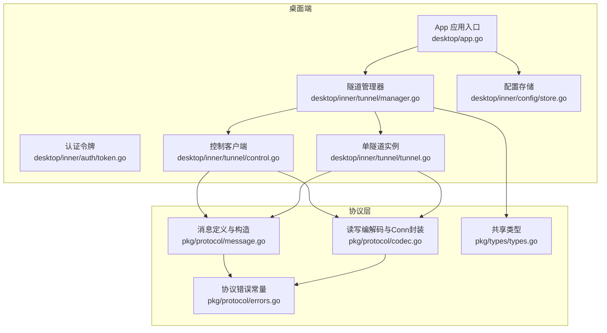
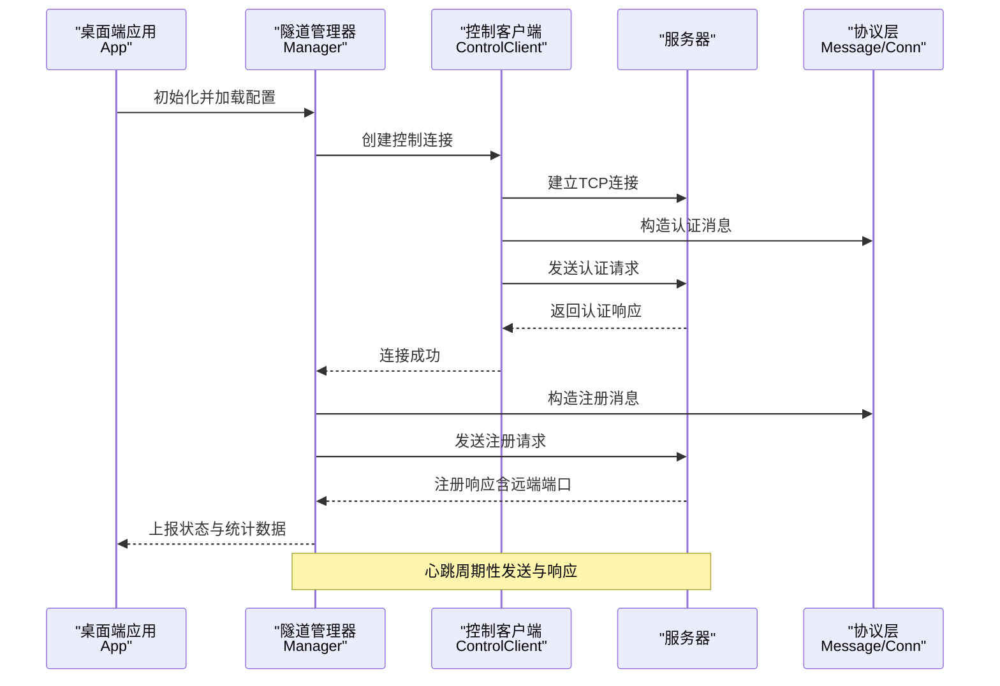
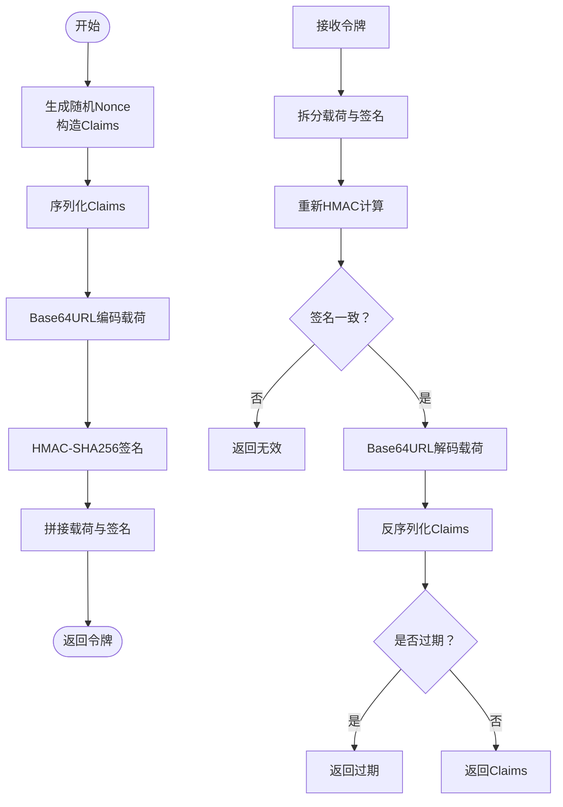
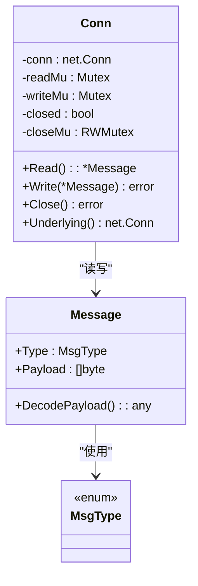
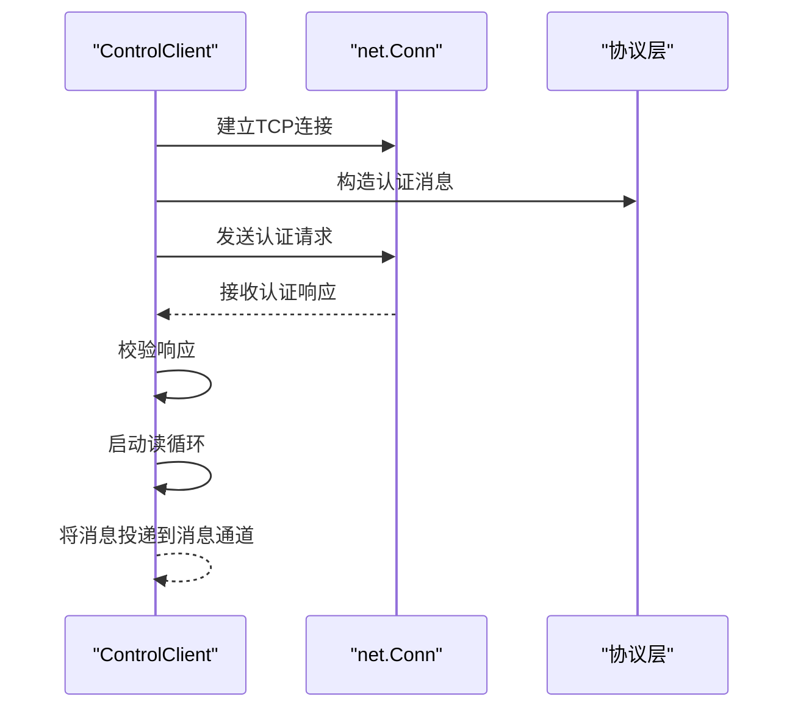
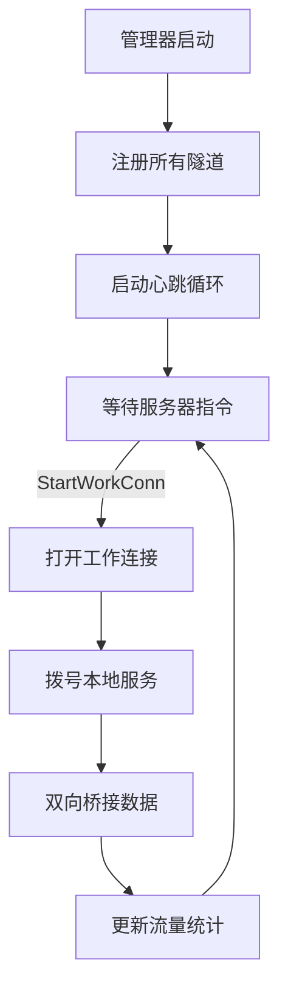
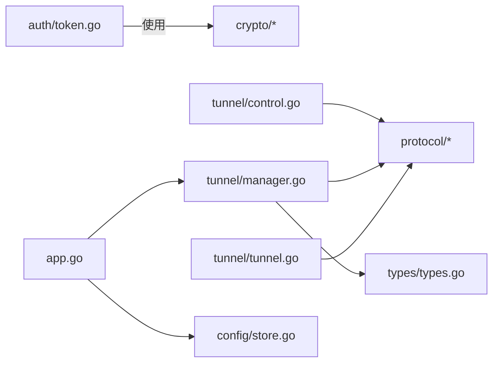

# 加密工具

<cite>
**本文引用的文件**
- [README.md](file://README.md)
- [app.go](file://desktop/app.go)
- [token.go](file://desktop/inner/auth/token.go)
- [token_test.go](file://desktop/inner/auth/token_test.go)
- [codec.go](file://pkg/protocol/codec.go)
- [message.go](file://pkg/protocol/message.go)
- [errors.go](file://pkg/protocol/errors.go)
- [codec_test.go](file://pkg/protocol/codec_test.go)
- [control.go](file://desktop/inner/tunnel/control.go)
- [manager.go](file://desktop/inner/tunnel/manager.go)
- [tunnel.go](file://desktop/inner/tunnel/tunnel.go)
- [integration_test.go](file://desktop/inner/tunnel/integration_test.go)
- [store.go](file://desktop/inner/config/store.go)
- [types.go](file://pkg/types/types.go)
- [reconnect.go](file://desktop/inner/tunnel/reconnect.go)
</cite>

## 目录
1. [简介](#简介)
2. [项目结构](#项目结构)
3. [核心组件](#核心组件)
4. [架构总览](#架构总览)
5. [详细组件分析](#详细组件分析)
6. [依赖分析](#依赖分析)
7. [性能考量](#性能考量)
8. [故障排查指南](#故障排查指南)
9. [结论](#结论)
10. [附录](#附录)

## 简介
本文件面向NexTunnel加密工具的技术文档，聚焦于控制通道与工作通道的数据流、认证令牌机制、协议编解码与线程安全封装，以及与TLS等安全传输层的集成边界说明。当前仓库中未发现对称加密、非对称加密或哈希算法在控制与工作通道中的直接实现；加密功能主要通过认证令牌与协议层的线程安全封装体现。本文将从系统架构、组件关系、数据流、处理逻辑、集成点、错误处理与性能特性等方面进行深入解析，并给出安全最佳实践、密钥轮换策略、安全审计机制、性能优化建议与第三方库兼容性处理方案。

## 项目结构
NexTunnel采用多模块分层组织：桌面端（Wails）负责UI与配置持久化，pkg模块提供协议定义与通用类型，server侧提供服务端能力（本仓库未包含完整服务端实现）。加密工具的核心体现在认证令牌与协议编解码两部分：前者用于客户端身份与会话授权，后者用于控制通道消息的可靠传输与并发安全。

图表来源
- [app.go:32-67](file://desktop/app.go#L32-L67)
- [token.go:29-56](file://desktop/inner/auth/token.go#L29-L56)
- [manager.go:29-58](file://desktop/inner/tunnel/manager.go#L29-L58)
- [control.go:30-95](file://desktop/inner/tunnel/control.go#L30-L95)
- [tunnel.go:27-36](file://desktop/inner/tunnel/tunnel.go#L27-L36)
- [message.go:83-163](file://pkg/protocol/message.go#L83-L163)
- [codec.go:16-63](file://pkg/protocol/codec.go#L16-L63)
- [errors.go:5-14](file://pkg/protocol/errors.go#L5-L14)
- [types.go:24-49](file://pkg/types/types.go#L24-L49)

章节来源
- [README.md:1-20](file://README.md#L1-L20)
- [app.go:32-67](file://desktop/app.go#L32-L67)

## 核心组件
- 认证令牌（HMAC-SHA256）：用于客户端身份标识、时效控制与完整性校验，支持刷新与过期判断。
- 协议编解码（Message/Conn）：定义消息类型、载荷结构与网络帧格式，提供线程安全的读写封装。
- 控制客户端（ControlClient）：维护到服务器的持久化控制连接，负责认证握手与消息收发。
- 隧道管理器（Manager）：编排多个隧道实例，处理注册、心跳、动态增删隧道与重连策略。
- 单隧道实例（Tunnel）：建立工作连接、桥接本地服务与远端工作连接，统计上下行字节数。
- 配置存储（Store）：基于SQLite的隧道配置与应用设置持久化。
- 共享类型（types）：代理类型、状态枚举与运行时信息结构体。

章节来源
- [token.go:29-104](file://desktop/inner/auth/token.go#L29-L104)
- [message.go:8-28](file://pkg/protocol/message.go#L8-L28)
- [codec.go:65-131](file://pkg/protocol/codec.go#L65-L131)
- [control.go:15-95](file://desktop/inner/tunnel/control.go#L15-L95)
- [manager.go:16-58](file://desktop/inner/tunnel/manager.go#L16-L58)
- [tunnel.go:16-36](file://desktop/inner/tunnel/tunnel.go#L16-L36)
- [store.go:23-165](file://desktop/inner/config/store.go#L23-L165)
- [types.go:6-49](file://pkg/types/types.go#L6-L49)

## 架构总览
下图展示从桌面端启动到控制通道建立、隧道注册与工作连接建立的端到端流程，以及认证令牌在握手阶段的作用位置。

图表来源
- [app.go:32-67](file://desktop/app.go#L32-L67)
- [manager.go:65-112](file://desktop/inner/tunnel/manager.go#L65-L112)
- [control.go:40-95](file://desktop/inner/tunnel/control.go#L40-L95)
- [message.go:83-163](file://pkg/protocol/message.go#L83-L163)

## 详细组件分析

### 组件A：认证令牌（HMAC-SHA256）
- 设计要点
  - 载荷包含客户端ID、签发时间、过期时间与随机随机数（Nonce），以Base64URL编码拼接为签名输入。
  - 使用SHA256-HMAC对载荷签名，结果同样Base64URL编码并与载荷用点号拼接形成最终令牌。
  - 验证流程：拆分载荷与签名，重新计算签名并与输入签名比较，解码载荷并检查过期时间。
  - 支持刷新（RefreshToken）：允许对已过期令牌进行签名验证并签发新令牌，用于续期。
  - 提供“即将过期”检测（IsExpiringSoon），便于提前刷新。
- 安全性
  - 使用HMAC保证完整性与抗篡改；随机Nonce降低重放风险。
  - 过期时间与时效窗口结合，避免长期有效令牌带来的风险。
- 测试覆盖
  - 生成与验证、过期、错误密钥、畸形令牌、刷新、即将过期等场景均有单元测试。

图表来源
- [token.go:29-104](file://desktop/inner/auth/token.go#L29-L104)

章节来源
- [token.go:29-104](file://desktop/inner/auth/token.go#L29-L104)
- [token_test.go:12-130](file://desktop/inner/auth/token_test.go#L12-L130)

### 组件B：协议编解码与线程安全Conn
- 设计要点
  - 消息头固定长度（类型+长度），最大载荷限制，防止过大消息导致资源耗尽。
  - 提供线程安全的Conn封装：内部互斥锁保护读写，关闭状态检查，底层net.Conn暴露用于后续原始数据传输。
  - 消息类型丰富，涵盖认证、注册、关闭、心跳、工作连接等。
- 错误处理
  - 载荷超限、截断头部/载荷、空读取、连接已关闭等均返回明确错误。
- 并发模型
  - 读写分别加锁，避免竞态；关闭状态使用读写锁协调。

图表来源
- [message.go:24-28](file://pkg/protocol/message.go#L24-L28)
- [codec.go:65-131](file://pkg/protocol/codec.go#L65-L131)

章节来源
- [codec.go:16-63](file://pkg/protocol/codec.go#L16-L63)
- [codec.go:65-131](file://pkg/protocol/codec.go#L65-L131)
- [message.go:8-28](file://pkg/protocol/message.go#L8-L28)
- [errors.go:5-14](file://pkg/protocol/errors.go#L5-L14)
- [codec_test.go:117-189](file://pkg/protocol/codec_test.go#L117-L189)

### 组件C：控制客户端（ControlClient）
- 设计要点
  - 建立TCP连接后发送认证消息，等待认证响应；成功后启动读循环并将消息投递到通道。
  - 写操作加锁保证顺序与一致性；连接状态原子标记，关闭时清理资源。
- 与协议层协作
  - 使用协议层消息构造函数与Conn封装，确保控制通道消息的正确性与可靠性。

图表来源
- [control.go:40-95](file://desktop/inner/tunnel/control.go#L40-L95)
- [message.go:83-97](file://pkg/protocol/message.go#L83-L97)
- [codec.go:65-131](file://pkg/protocol/codec.go#L65-L131)

章节来源
- [control.go:15-155](file://desktop/inner/tunnel/control.go#L15-L155)

### 组件D：隧道管理器与单隧道实例
- 设计要点
  - 管理器负责连接、注册、心跳与动态增删隧道；使用指数退避+抖动策略处理断线重连。
  - 单隧道实例在收到服务器发起的工作连接请求后，建立到本地服务的连接并双向桥接数据。
  - 统计上下行字节数，上报运行时状态。
- 与协议层协作
  - 注册与心跳使用协议消息；工作连接建立后切换为原始TCP数据直通。

图表来源
- [manager.go:65-112](file://desktop/inner/tunnel/manager.go#L65-L112)
- [manager.go:158-197](file://desktop/inner/tunnel/manager.go#L158-L197)
- [tunnel.go:47-84](file://desktop/inner/tunnel/tunnel.go#L47-L84)
- [message.go:139-153](file://pkg/protocol/message.go#L139-L153)

章节来源
- [manager.go:16-310](file://desktop/inner/tunnel/manager.go#L16-L310)
- [tunnel.go:16-138](file://desktop/inner/tunnel/tunnel.go#L16-L138)
- [reconnect.go:10-83](file://desktop/inner/tunnel/reconnect.go#L10-L83)

### 组件E：配置存储与共享类型
- 设计要点
  - Store提供隧道配置的CRUD与应用设置存取，基于SQLite持久化。
  - types定义代理类型、状态枚举与运行时信息结构体，统一前后端交互契约。

章节来源
- [store.go:23-165](file://desktop/inner/config/store.go#L23-L165)
- [types.go:6-49](file://pkg/types/types.go#L6-L49)

## 依赖分析
- 外部依赖
  - Go标准库：crypto/hmac、crypto/sha256、encoding/base64、encoding/json、io、net、sync、time、math/rand/v2等。
  - 第三方库：google/uuid（生成客户端ID）、slog（日志）。
- 内部依赖
  - desktop/inner/* 依赖 pkg/protocol 与 pkg/types。
  - desktop/app.go 依赖 desktop/inner/tunnel 与 desktop/inner/config。
- 耦合与内聚
  - 协议层与业务层分离良好，协议层仅关注消息与连接抽象，业务层负责控制逻辑与状态管理。
  - 管理器与隧道实例职责清晰，管理器负责编排，实例负责具体桥接。

图表来源
- [token.go:4-13](file://desktop/inner/auth/token.go#L4-L13)
- [control.go:3-13](file://desktop/inner/tunnel/control.go#L3-L13)
- [manager.go:3-14](file://desktop/inner/tunnel/manager.go#L3-L14)
- [tunnel.go:3-14](file://desktop/inner/tunnel/tunnel.go#L3-L14)
- [app.go:10-15](file://desktop/app.go#L10-L15)
- [store.go:3-7](file://desktop/inner/config/store.go#L3-L7)

## 性能考量
- 编解码与I/O
  - 协议层使用固定头长与最大载荷限制，避免内存膨胀；Conn封装读写互斥，减少锁竞争。
  - 工作连接桥接使用io.Copy，适合高吞吐场景；可按需引入缓冲区优化与背压策略。
- 并发与资源
  - 管理器与隧道实例采用goroutine与WaitGroup，确保优雅退出；注意在关闭时避免重复关闭。
- 重连策略
  - 指数退避+抖动降低雪崩效应；可根据网络状况调整基础延迟、最大延迟与抖动比例。
- TLS集成
  - 当前控制通道使用TCP明文；如需TLS，可在ControlClient.Connect中替换为TLS握手（例如使用crypto/tls），并在握手后复用协议层Conn进行消息收发。

[本节为通用性能指导，不直接分析具体文件，故无章节来源]

## 故障排查指南
- 认证失败
  - 检查令牌是否过期、密钥是否正确、载荷是否被篡改；使用IsExpiringSoon提前预警。
- 连接异常
  - 查看控制连接读写错误日志；确认服务器地址可达、端口开放；关注ErrConnClosed与ErrPayloadTooLarge。
- 注册失败
  - 核对注册消息类型与载荷字段；确认服务器返回的注册响应成功标志与错误信息。
- 重连问题
  - 检查退避参数配置；观察日志中重连间隔与抖动效果；必要时增大最大延迟或调整倍数。
- 数据传输中断
  - 关注工作连接桥接两端的关闭时机；确保任一侧关闭时另一侧也同步关闭，避免资源泄漏。

章节来源
- [token.go:58-104](file://desktop/inner/auth/token.go#L58-L104)
- [errors.go:5-14](file://pkg/protocol/errors.go#L5-L14)
- [codec_test.go:234-259](file://pkg/protocol/codec_test.go#L234-L259)
- [integration_test.go:381-444](file://desktop/inner/tunnel/integration_test.go#L381-L444)

## 结论
NexTunnel的加密工具以认证令牌与协议层的线程安全封装为核心，实现了控制通道的可靠通信与工作通道的高效数据桥接。当前未发现对称/非对称加密与哈希算法在代码中的直接实现，但通过HMAC-SHA256令牌与严格的协议约束，提供了完整性与抗篡改能力。建议在需要更强传输安全的场景下引入TLS握手与证书验证，并结合密钥轮换与审计日志进一步提升整体安全性。

[本节为总结性内容，不直接分析具体文件，故无章节来源]

## 附录

### 密钥生成与管理策略（基于现有令牌机制）
- 密钥生成
  - 使用强随机源生成密钥材料；建议长度至少32字节（256位）。
- 密钥轮换
  - 采用双密钥轮换：旧密钥用于验证旧令牌，新密钥用于签发新令牌；过渡期内同时接受两种密钥。
- 密钥存储
  - 将密钥存储在受控环境中（如密钥管理服务或硬件安全模块），避免明文落盘。
- 审计与监控
  - 记录令牌签发、验证与过期事件；对异常失败率与过期频率进行告警。

[本节为通用最佳实践，不直接分析具体文件，故无章节来源]

### 与第三方加密库的集成与兼容性
- 集成点
  - 在ControlClient.Connect中替换为TLS握手（如crypto/tls.Config），握手完成后复用协议层Conn。
- 兼容性
  - 保持消息类型与载荷结构不变，确保与现有服务端兼容。
  - 对外暴露TLS配置项（证书链、SNI、协议版本等），默认启用现代TLS版本与安全套件。

[本节为概念性说明，不直接分析具体文件，故无章节来源]

### 使用指南、测试方法与安全评估标准
- 使用指南
  - 通过App加载SQLite配置，初始化Manager并启动；在前端界面查看隧道状态与流量统计。
- 测试方法
  - 单元测试覆盖令牌生命周期、协议编解码与Conn并发读写；集成测试验证重连、多隧道与心跳。
- 安全评估
  - 令牌有效期与刷新策略、过期预警窗口、错误处理完备性、日志敏感信息脱敏、重连退避参数合理性。

章节来源
- [app.go:32-67](file://desktop/app.go#L32-L67)
- [integration_test.go:193-298](file://desktop/inner/tunnel/integration_test.go#L193-L298)
- [codec_test.go:11-78](file://pkg/protocol/codec_test.go#L11-L78)
- [token_test.go:12-130](file://desktop/inner/auth/token_test.go#L12-L130)