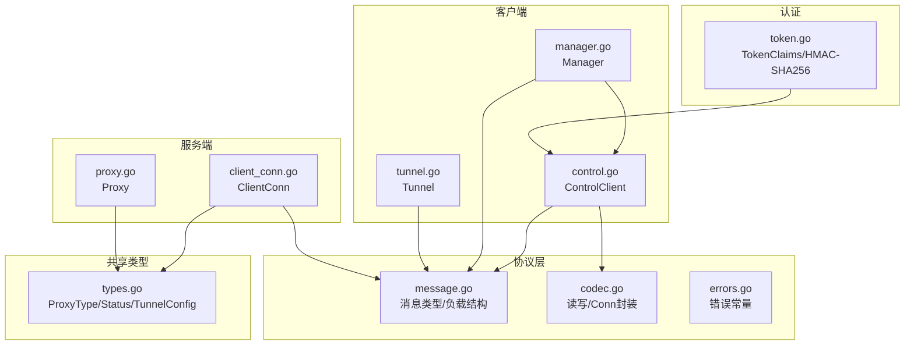
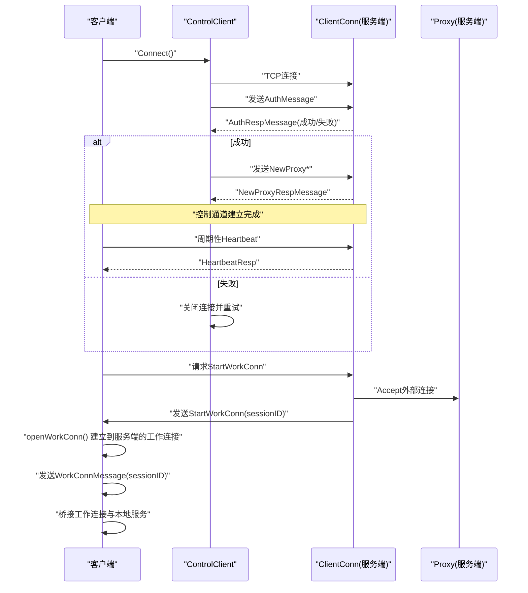
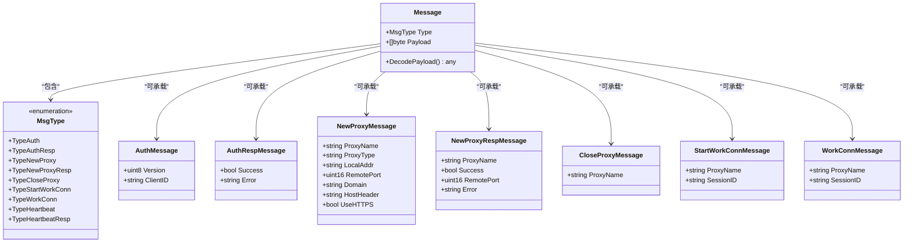
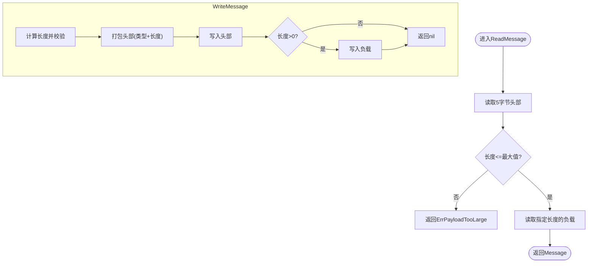
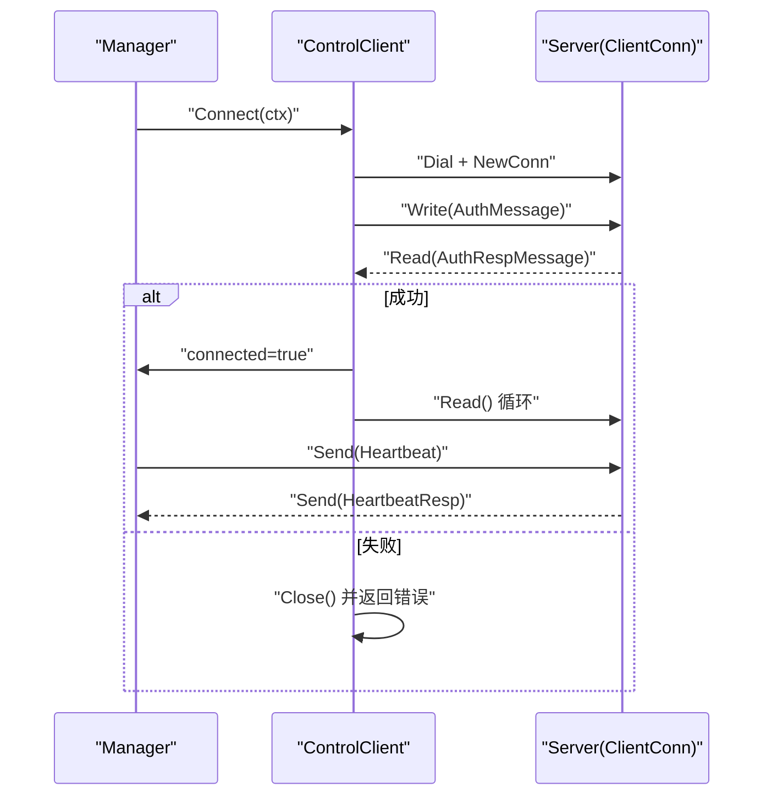
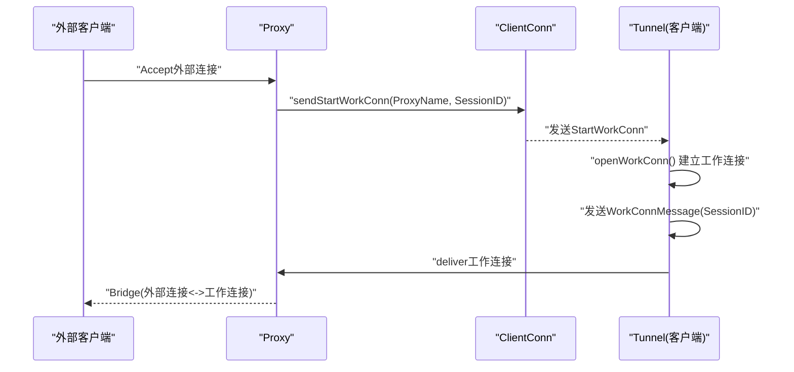
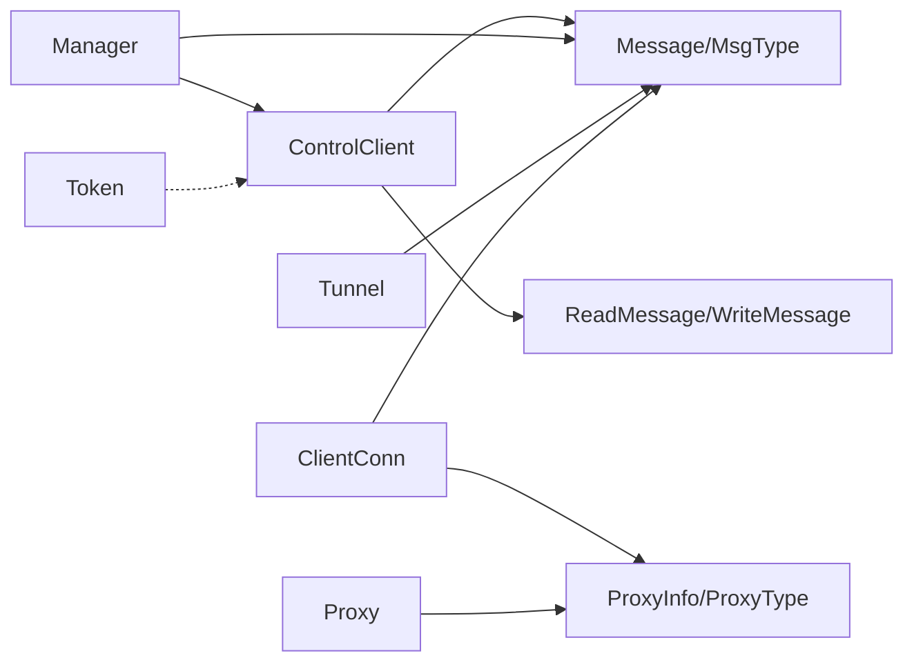

# 协议设计

<cite>
**本文引用的文件列表**
- [message.go](file://pkg/protocol/message.go)
- [codec.go](file://pkg/protocol/codec.go)
- [errors.go](file://pkg/protocol/errors.go)
- [codec_test.go](file://pkg/protocol/codec_test.go)
- [types.go](file://pkg/types/types.go)
- [control.go](file://desktop/internal/tunnel/control.go)
- [manager.go](file://desktop/internal/tunnel/manager.go)
- [tunnel.go](file://desktop/internal/tunnel/tunnel.go)
- [client_conn.go](file://server/internal/relay/client_conn.go)
- [proxy.go](file://server/internal/relay/proxy.go)
- [token.go](file://desktop/internal/auth/token.go)
- [README.md](file://README.md)
</cite>

## 目录
1. [简介](#简介)
2. [项目结构](#项目结构)
3. [核心组件](#核心组件)
4. [架构总览](#架构总览)
5. [详细组件分析](#详细组件分析)
6. [依赖关系分析](#依赖关系分析)
7. [性能考量](#性能考量)
8. [故障排查指南](#故障排查指南)
9. [结论](#结论)
10. [附录](#附录)

## 简介
本文件面向NexTunnel协议设计，系统化阐述控制通道协议的消息格式、消息类型枚举与负载结构定义；深入解析数据传输协议的设计理念、数据帧格式与二进制编码规则；详解消息编解码器的实现细节（序列化算法、错误处理机制）；说明协议版本兼容性与升级路径；给出安全机制（身份验证与数据完整性校验）、消息示例、调试工具与性能优化建议，并解释协议与不同传输层的适配方案及网络异常处理策略。

## 项目结构
NexTunnel采用分层清晰的模块化组织：
- 协议层：定义控制通道消息类型、负载结构与编解码器
- 客户端层：负责控制连接、心跳、隧道注册与工作连接建立
- 服务端层：负责代理监听、会话调度与统计
- 共享类型层：定义跨模块的类型与状态
- 认证层：提供基于HMAC-SHA256的令牌生成与校验

图表来源
- [message.go:1-203](file://pkg/protocol/message.go#L1-L203)
- [codec.go:1-131](file://pkg/protocol/codec.go#L1-L131)
- [errors.go:1-15](file://pkg/protocol/errors.go#L1-L15)
- [control.go:1-155](file://desktop/internal/tunnel/control.go#L1-L155)
- [manager.go:1-310](file://desktop/internal/tunnel/manager.go#L1-L310)
- [tunnel.go:1-138](file://desktop/internal/tunnel/tunnel.go#L1-L138)
- [client_conn.go:1-216](file://server/internal/relay/client_conn.go#L1-L216)
- [proxy.go:1-180](file://server/internal/relay/proxy.go#L1-L180)
- [types.go:1-50](file://pkg/types/types.go#L1-L50)
- [token.go:1-162](file://desktop/internal/auth/token.go#L1-L162)

章节来源
- [README.md:1-20](file://README.md#L1-L20)

## 核心组件
- 控制通道消息模型：消息类型枚举、消息体结构与工厂构造函数
- 编解码器：头部格式、二进制编码、并发安全Conn封装
- 错误体系：统一的错误常量与语义
- 共享类型：代理类型、状态、配置与运行时信息
- 客户端控制连接：认证握手、心跳、消息收发与重连
- 服务端代理：外部监听、会话调度、统计与清理
- 认证与完整性：HMAC-SHA256签名令牌

章节来源
- [message.go:6-28](file://pkg/protocol/message.go#L6-L28)
- [codec.go:10-131](file://pkg/protocol/codec.go#L10-L131)
- [errors.go:5-14](file://pkg/protocol/errors.go#L5-L14)
- [types.go:6-49](file://pkg/types/types.go#L6-L49)
- [control.go:15-95](file://desktop/internal/tunnel/control.go#L15-L95)
- [client_conn.go:14-82](file://server/internal/relay/client_conn.go#L14-L82)
- [token.go:15-104](file://desktop/internal/auth/token.go#L15-L104)

## 架构总览
控制通道采用“客户端-服务端”长连接，客户端发起认证，服务端返回认证结果；随后双方通过心跳维持连接并进行隧道注册与工作连接调度。数据通道在工作连接建立后切换为原始TCP直通，不再使用协议层封装。

图表来源
- [control.go:40-95](file://desktop/internal/tunnel/control.go#L40-L95)
- [client_conn.go:45-82](file://server/internal/relay/client_conn.go#L45-L82)
- [manager.go:65-112](file://desktop/internal/tunnel/manager.go#L65-L112)
- [tunnel.go:47-85](file://desktop/internal/tunnel/tunnel.go#L47-L85)

## 详细组件分析

### 控制通道消息模型与负载结构
- 消息类型枚举：包含认证、认证响应、新建/关闭代理、开始工作连接、工作连接、心跳与心跳响应等
- 协议版本：当前版本号用于未来兼容性扩展
- 负载结构：各消息类型的JSON结构体，如认证、代理注册、关闭、会话标识等
- 工厂构造函数：按类型生成带JSON负载的消息对象
- 解码：根据消息类型反序列化到对应负载结构，心跳类消息为空负载

图表来源
- [message.go:6-79](file://pkg/protocol/message.go#L6-L79)

章节来源
- [message.go:6-203](file://pkg/protocol/message.go#L6-L203)

### 编解码器与二进制帧格式
- 帧格式：固定头部 + 可变长度负载
  - 头部：1字节消息类型 + 4字节大端序负载长度
  - 负载：JSON序列化的消息体
- 读取流程：先读取完整头部，校验最大负载限制，再读取完整负载
- 写入流程：计算负载长度，写入头部，再写入负载
- 并发安全：Conn封装了互斥锁，保证同一连接上的读写串行化
- 连接生命周期：支持关闭标记，关闭后所有操作返回已关闭错误

图表来源
- [codec.go:16-63](file://pkg/protocol/codec.go#L16-L63)

章节来源
- [codec.go:10-131](file://pkg/protocol/codec.go#L10-L131)
- [codec_test.go:11-78](file://pkg/protocol/codec_test.go#L11-L78)

### 客户端控制连接与心跳
- ControlClient：封装协议Conn，负责认证握手、消息收发、心跳循环与读取循环
- 握手流程：建立TCP连接，发送AuthMessage，等待AuthRespMessage，校验成功后置连接状态并启动读循环
- 心跳：周期性发送Heartbeat，接收HeartbeatResp
- 错误处理：读写错误或意外消息类型均触发连接关闭与日志记录

图表来源
- [control.go:40-95](file://desktop/internal/tunnel/control.go#L40-L95)
- [manager.go:65-112](file://desktop/internal/tunnel/manager.go#L65-L112)

章节来源
- [control.go:15-155](file://desktop/internal/tunnel/control.go#L15-L155)
- [manager.go:65-217](file://desktop/internal/tunnel/manager.go#L65-L217)

### 服务端代理与会话调度
- ClientConn：维护客户端连接、代理表、心跳定时器，处理NewProxy/CloseProxy/Heartbeat等控制消息
- Proxy：对外绑定TCP监听，接受外部连接后向客户端请求StartWorkConn，等待工作连接并桥接
- 会话匹配：通过sessionID在服务端挂起队列中匹配工作连接，完成后统计流量与会话数

图表来源
- [client_conn.go:164-170](file://server/internal/relay/client_conn.go#L164-L170)
- [proxy.go:68-118](file://server/internal/relay/proxy.go#L68-L118)
- [tunnel.go:47-85](file://desktop/internal/tunnel/tunnel.go#L47-L85)

章节来源
- [client_conn.go:14-216](file://server/internal/relay/client_conn.go#L14-L216)
- [proxy.go:16-180](file://server/internal/relay/proxy.go#L16-L180)
- [tunnel.go:16-138](file://desktop/internal/tunnel/tunnel.go#L16-L138)

### 协议版本兼容性与升级路径
- 当前协议版本：协议层定义了版本号常量，可用于未来扩展
- 向后兼容策略建议：
  - 新增消息类型时保持旧类型语义不变
  - 新增字段应保持可选且默认安全值
  - 服务端在解析时忽略未知字段，客户端在解析时容错处理
- 升级路径：
  - 服务端先升级，客户端兼容旧版本；客户端升级后可启用新特性
  - 版本协商可通过认证阶段携带版本字段并在握手时确认

章节来源
- [message.go:21-22](file://pkg/protocol/message.go#L21-L22)

### 协议安全机制、身份验证与数据完整性
- 身份验证：客户端在认证阶段携带ClientID；令牌层提供HMAC-SHA256签名的令牌生成与校验，包含签发时间、过期时间与随机nonce
- 数据完整性：控制通道消息采用JSON负载，结合HMAC-SHA256签名可确保消息未被篡改
- 建议增强：
  - 在控制通道层面引入TLS握手以保护传输层机密性
  - 对消息进行序列化后签名，避免仅对JSON字符串签名导致的解析差异
  - 引入防重放机制（如时间戳窗口与nonce）

章节来源
- [token.go:15-104](file://desktop/internal/auth/token.go#L15-L104)
- [message.go:32-42](file://pkg/protocol/message.go#L32-L42)

### 消息示例与调试工具
- 示例消息类型与用途：
  - 认证：TypeAuth/AuthResp
  - 隧道管理：TypeNewProxy/NewProxyResp/TypeCloseProxy
  - 会话调度：TypeStartWorkConn/TypeWorkConn
  - 心跳：TypeHeartbeat/HeartbeatResp
- 调试工具：
  - 单元测试覆盖读写往返、截断头/尾、空负载、并发读写、连接关闭等边界场景
  - 日志记录：客户端与服务端均输出关键事件与错误信息，便于定位问题

章节来源
- [codec_test.go:11-267](file://pkg/protocol/codec_test.go#L11-L267)
- [control.go:97-122](file://desktop/internal/tunnel/control.go#L97-L122)
- [client_conn.go:45-82](file://server/internal/relay/client_conn.go#L45-L82)

### 协议与传输层适配与网络异常处理
- 传输层适配：协议层通过io.Reader/io.Writer抽象，可在TCP、Unix域套接字等上层复用
- 异常处理：
  - 负载过大：直接拒绝并返回错误
  - 截断头/尾：读取失败，触发连接关闭
  - 连接关闭：Conn封装检测并返回已关闭错误
  - 心跳超时：服务端在心跳定时器到期时主动关闭连接
  - 重连：客户端使用指数退避策略自动重连

章节来源
- [codec.go:16-63](file://pkg/protocol/codec.go#L16-L63)
- [client_conn.go:172-181](file://server/internal/relay/client_conn.go#L172-L181)
- [manager.go:65-80](file://desktop/internal/tunnel/manager.go#L65-L80)

## 依赖关系分析
- 客户端依赖协议层进行消息构造与读写，依赖共享类型进行状态与配置传递
- 服务端依赖协议层进行消息解析与响应，依赖共享类型进行代理状态管理
- 认证层独立于协议层，提供令牌生成与校验能力，可与协议层配合实现更强的安全保障

图表来源
- [control.go:12-13](file://desktop/internal/tunnel/control.go#L12-L13)
- [manager.go:10-11](file://desktop/internal/tunnel/manager.go#L10-L11)
- [tunnel.go:12-13](file://desktop/internal/tunnel/tunnel.go#L12-L13)
- [client_conn.go:10-11](file://server/internal/relay/client_conn.go#L10-L11)
- [proxy.go:12-13](file://server/internal/relay/proxy.go#L12-L13)
- [token.go:4-12](file://desktop/internal/auth/token.go#L4-L12)

章节来源
- [types.go:6-49](file://pkg/types/types.go#L6-L49)

## 性能考量
- 序列化开销：当前采用JSON，解析/序列化成本较低但体积较大；可考虑在高吞吐场景引入更紧凑的二进制序列化（如Protocol Buffers或MessagePack）
- 负载大小限制：最大16MB，避免内存峰值过高；建议对大负载进行分片或压缩
- 并发读写：Conn内部互斥保证线程安全，避免竞争条件；注意不要在读写回调中阻塞
- 心跳频率：合理设置心跳间隔，平衡保活与CPU占用
- 桥接效率：数据通道采用io.Copy直通，避免额外拷贝；注意缓冲区大小与背压处理

## 故障排查指南
- 常见错误与定位
  - 负载过大：检查消息负载是否超过上限
  - 截断头/尾：检查网络稳定性与对端实现
  - 未知消息类型：检查协议版本与消息类型定义一致性
  - 连接已关闭：确认连接生命周期与关闭顺序
- 日志与观测
  - 客户端：连接、认证、心跳、消息收发、工作连接建立与桥接
  - 服务端：代理注册、会话接受、会话完成、统计信息
- 诊断步骤
  - 使用单元测试覆盖的边界场景复现问题
  - 检查两端协议版本与消息类型映射
  - 关注心跳超时与连接关闭原因

章节来源
- [errors.go:5-14](file://pkg/protocol/errors.go#L5-L14)
- [codec_test.go:117-189](file://pkg/protocol/codec_test.go#L117-L189)
- [control.go:97-122](file://desktop/internal/tunnel/control.go#L97-L122)
- [client_conn.go:172-181](file://server/internal/relay/client_conn.go#L172-L181)

## 结论
NexTunnel协议以简洁的JSON消息与稳定的二进制帧格式为基础，实现了可靠的控制通道通信与高效的数据通道桥接。通过明确的错误语义、并发安全封装与心跳保活机制，协议在复杂网络环境下具备良好的鲁棒性。建议在未来版本中引入TLS与更紧凑的序列化方案，并完善消息签名与防重放机制，以进一步提升安全性与性能。

## 附录
- 消息类型速览
  - 认证：TypeAuth/AuthResp
  - 隧道：TypeNewProxy/NewProxyResp/TypeCloseProxy
  - 会话：TypeStartWorkConn/TypeWorkConn
  - 心跳：TypeHeartbeat/HeartbeatResp
- 关键实现参考
  - 消息模型与工厂：[message.go:83-163](file://pkg/protocol/message.go#L83-L163)
  - 读写与Conn封装：[codec.go:16-131](file://pkg/protocol/codec.go#L16-L131)
  - 错误常量：[errors.go:5-14](file://pkg/protocol/errors.go#L5-L14)
  - 客户端握手与心跳：[control.go:40-95](file://desktop/internal/tunnel/control.go#L40-L95), [manager.go:199-217](file://desktop/internal/tunnel/manager.go#L199-L217)
  - 服务端代理与会话：[client_conn.go:45-181](file://server/internal/relay/client_conn.go#L45-L181), [proxy.go:47-179](file://server/internal/relay/proxy.go#L47-L179)
  - 认证令牌：[token.go:29-104](file://desktop/internal/auth/token.go#L29-L104)