# 地理定位服务

<cite>
**本文档引用的文件**
- [README.md](file://README.md)
- [main.go](file://desktop/main.go)
- [app.go](file://desktop/app.go)
- [store.go](file://desktop/internal/config/store.go)
- [tunnel.go](file://desktop/internal/tunnel/tunnel.go)
- [app.ts](file://desktop/frontend/src/api/app.ts)
- [tunnel.ts](file://desktop/frontend/src/stores/tunnel.ts)
- [detect.go](file://desktop/interal/nat/detect.go)
- [server.go](file://server/internal/natdetect/server.go)
- [message.go](file://pkg/protocol/message.go)
- [types.go](file://pkg/types/types.go)
</cite>

## 目录
1. [简介](#简介)
2. [项目结构](#项目结构)
3. [核心组件](#核心组件)
4. [架构概览](#架构概览)
5. [详细组件分析](#详细组件分析)
6. [依赖关系分析](#依赖关系分析)
7. [性能考虑](#性能考虑)
8. [故障排除指南](#故障排除指南)
9. [结论](#结论)

## 简介

NexTunnel 是一款开源内网穿透 + P2P 直连的现代化网络工具，提供可视化桌面管理界面。该项目采用 Go + Vue 3 + Wails 技术栈构建，旨在超越传统 FRP/NPS 等"客户端→中转服务器"的 TCP 转发模式，打造下一代智能组网方案。

### 项目愿景
让内网穿透从"能连上"进化为"智能直连"——用户无需理解端口、NAT、UDP、Tunnel 等底层概念，设备自动发现、自动组网、自动加速、自动直连。

### 核心特性
- **P2P 优先**：目标能力：优先尝试直连传输；当前 P2P 仍处于原型验证阶段
- **智能链路**：目标能力：自动检测网络环境，选择最优传输路径；当前调度器尚未完整接入数据面
- **安全零信任**：目标能力：端到端加密与身份认证；当前已补基础 token/bcrypt/CORS 加固，仍需 mTLS/OIDC/持久化权限体系
- **自动降级**：P2P 不可达时自动切换至中继，保证连通性
- **可视化桌面端**：基于 Wails 的原生桌面应用，支持 Relay 连接、隧道配置与单隧道启停
- **跨平台**：覆盖 Windows / macOS / Linux

## 项目结构

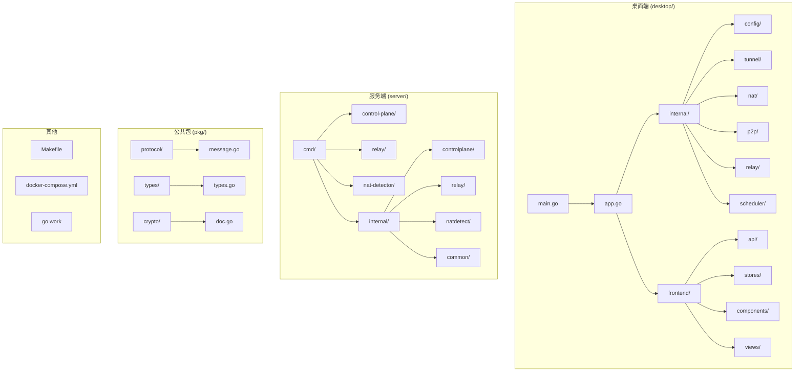

**图表来源**
- [README.md: 54-111:54-111](file://README.md#L54-L111)
- [main.go: 1-40:1-40](file://desktop/main.go#L1-L40)
- [app.go: 1-354:1-354](file://desktop/app.go#L1-L354)

**章节来源**
- [README.md: 54-111:54-111](file://README.md#L54-L111)
- [main.go: 1-40:1-40](file://desktop/main.go#L1-L40)
- [app.go: 1-354:1-354](file://desktop/app.go#L1-L354)

## 核心组件

### 桌面应用架构

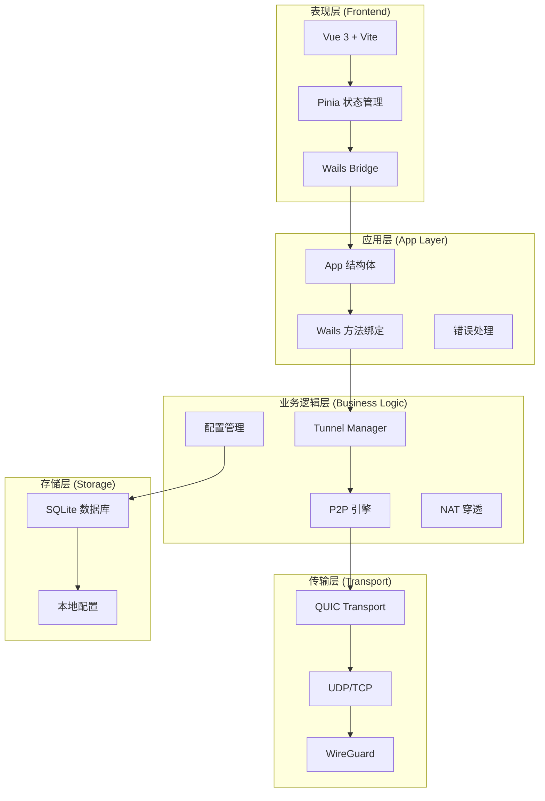

**图表来源**
- [README.md: 147-163:147-163](file://README.md#L147-L163)
- [app.go: 25-354:25-354](file://desktop/app.go#L25-L354)

### 服务端架构

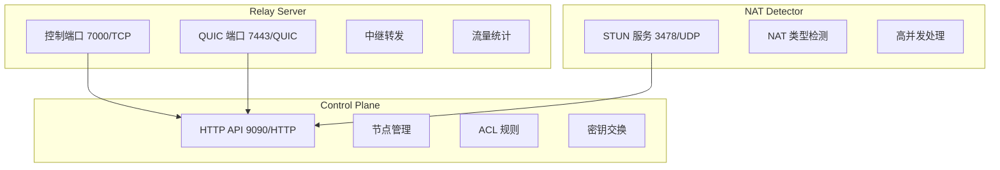

**图表来源**
- [README.md: 197-202:197-202](file://README.md#L197-L202)
- [README.md: 119-145:119-145](file://README.md#L119-L145)

**章节来源**
- [README.md: 178-211:178-211](file://README.md#L178-L211)
- [app.go: 25-354:25-354](file://desktop/app.go#L25-L354)

## 架构概览

### 系统架构

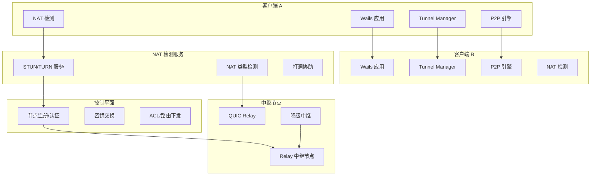

**图表来源**
- [README.md: 115-174:115-174](file://README.md#L115-L174)

### 链路调度策略

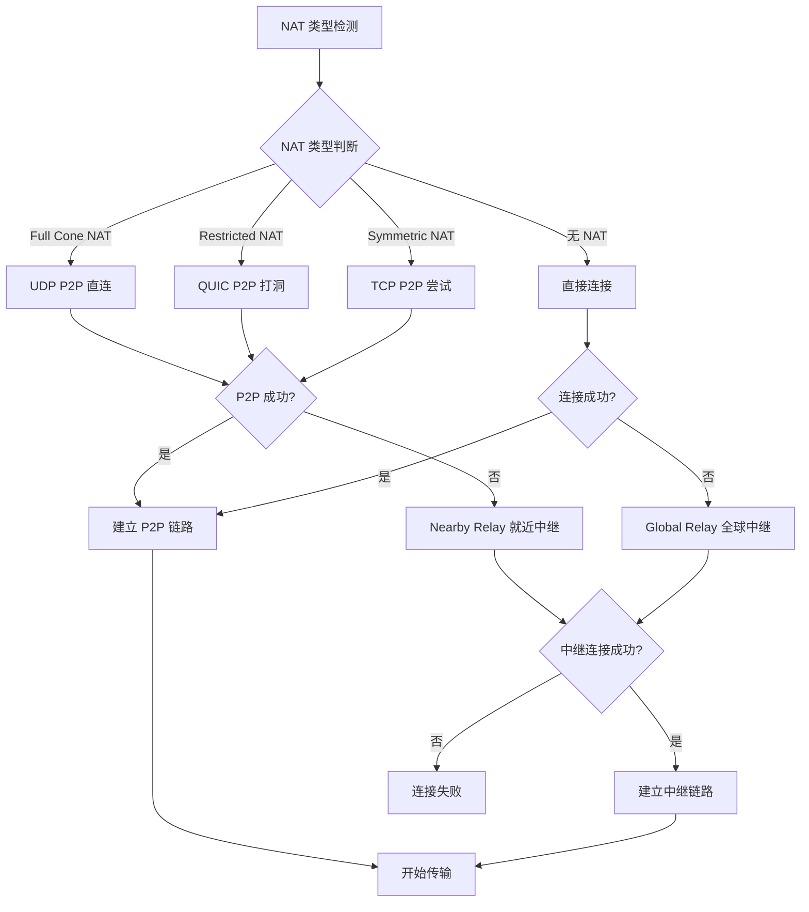

**图表来源**
- [README.md: 165-174:165-174](file://README.md#L165-L174)

## 详细组件分析

### NAT 穿透组件

#### NAT 检测算法实现

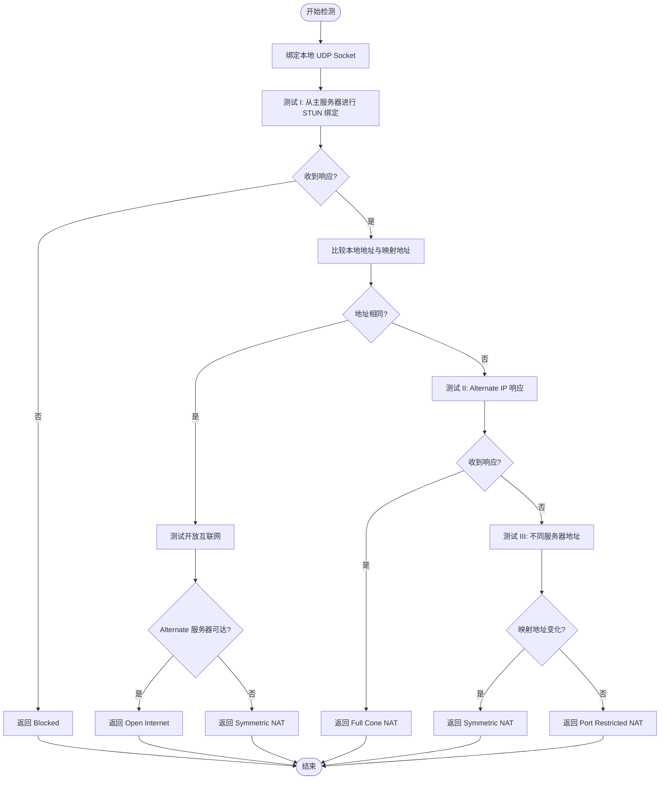

**图表来源**
- [detect.go: 29-113:29-113](file://desktop/internal/nat/detect.go#L29-L113)

#### NAT 检测服务实现

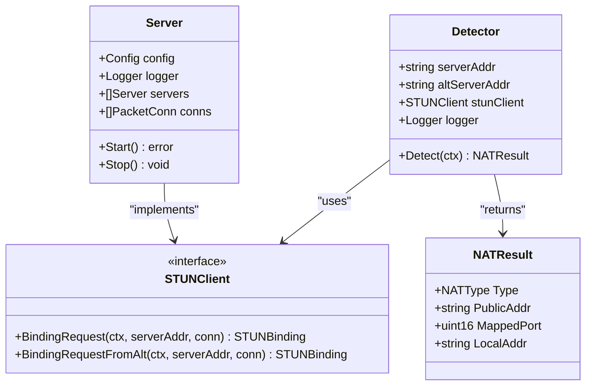

**图表来源**
- [detect.go: 10-27:10-27](file://desktop/internal/nat/detect.go#L10-L27)
- [server.go: 15-35:15-35](file://server/internal/natdetect/server.go#L15-L35)

**章节来源**
- [detect.go: 1-113:1-113](file://desktop/internal/nat/detect.go#L1-L113)
- [server.go: 1-93:1-93](file://server/internal/natdetect/server.go#L1-L93)

### 隧道管理组件

#### 隧道生命周期管理

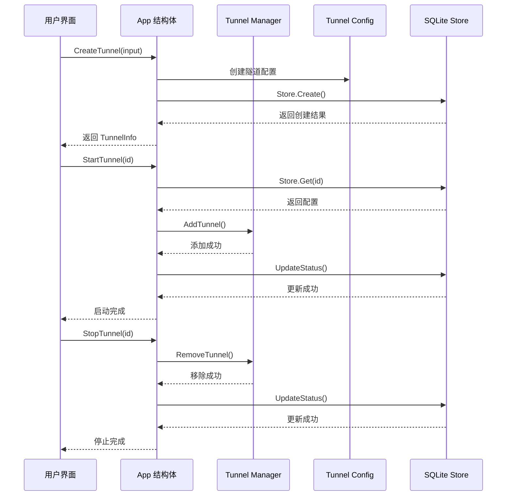

**图表来源**
- [app.go: 146-242:146-242](file://desktop/app.go#L146-L242)
- [store.go: 33-139:33-139](file://desktop/internal/config/store.go#L33-L139)

#### 隧道工作连接建立

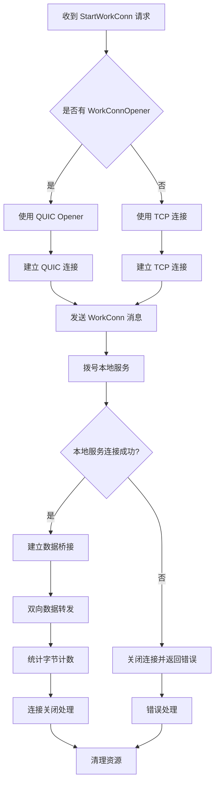

**图表来源**
- [tunnel.go: 38-93:38-93](file://desktop/internal/tunnel/tunnel.go#L38-L93)

**章节来源**
- [app.go: 146-354:146-354](file://desktop/app.go#L146-L354)
- [tunnel.go: 16-146:16-146](file://desktop/internal/tunnel/tunnel.go#L16-L146)
- [store.go: 9-165:9-165](file://desktop/internal/config/store.go#L9-L165)

### 前端交互组件

#### 状态管理架构

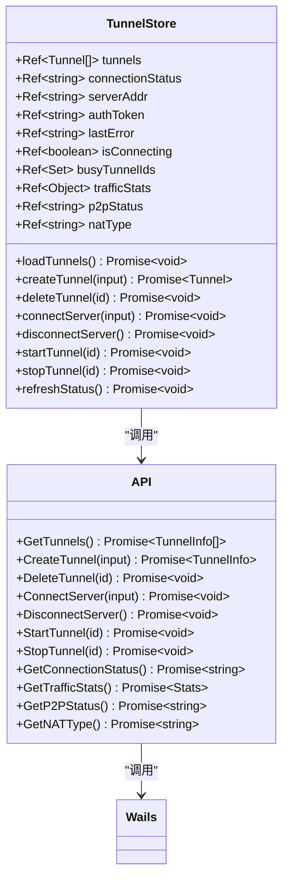

**图表来源**
- [tunnel.ts: 36-199:36-199](file://desktop/frontend/src/stores/tunnel.ts#L36-L199)
- [app.ts: 63-125:63-125](file://desktop/frontend/src/api/app.ts#L63-L125)

**章节来源**
- [tunnel.ts: 1-199:1-199](file://desktop/frontend/src/stores/tunnel.ts#L1-L199)
- [app.ts: 1-125:1-125](file://desktop/frontend/src/api/app.ts#L1-L125)

## 依赖关系分析

### 协议消息类型

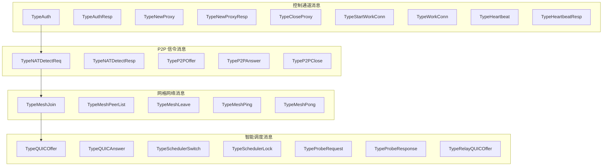

**图表来源**
- [message.go: 6-42:6-42](file://pkg/protocol/message.go#L6-L42)

### 共享类型定义

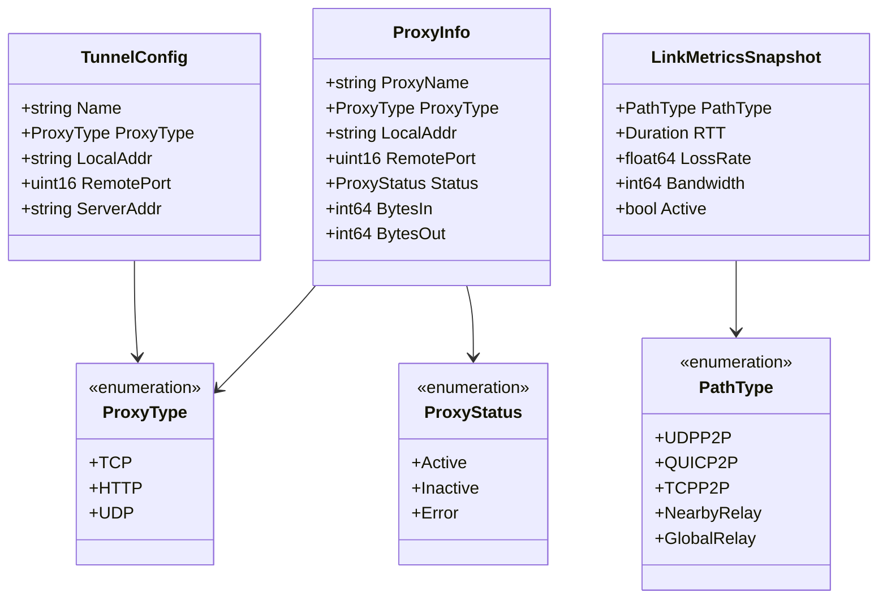

**图表来源**
- [types.go: 6-80:6-80](file://pkg/types/types.go#L6-L80)

**章节来源**
- [message.go: 1-480:1-480](file://pkg/protocol/message.go#L1-L480)
- [types.go: 1-80:1-80](file://pkg/types/types.go#L1-L80)

## 性能考虑

### NAT 检测优化策略

1. **并发检测**：支持同时对多个 STUN 服务器进行检测，提高检测成功率
2. **缓存机制**：NAT 类型检测结果可以缓存，避免重复检测
3. **超时控制**：为每个检测步骤设置合理的超时时间，防止阻塞
4. **资源管理**：及时关闭 UDP Socket 和连接，避免资源泄漏

### 隧道性能优化

1. **QUIC 优先**：在支持 QUIC 的情况下优先使用 QUIC 传输，提高连接建立速度
2. **连接复用**：支持多隧道复用单个控制连接，减少连接开销
3. **流量统计**：实时统计每个隧道的流量，便于性能监控
4. **自动降级**：当 P2P 不可用时自动切换到中继，保证连通性

### 前端性能优化

1. **响应式更新**：使用 Pinia 状态管理，精确控制组件重新渲染
2. **异步操作**：所有网络操作都是异步的，避免阻塞 UI
3. **错误处理**：统一的错误处理机制，提供友好的用户反馈
4. **资源清理**：及时清理定时器和事件监听器

## 故障排除指南

### 常见问题诊断

#### NAT 检测失败

**症状**：NAT 类型检测返回 Blocked 或检测超时

**可能原因**：
1. STUN 服务器不可达
2. 防火墙阻止 UDP 3478 端口
3. 网络环境过于严格的安全策略

**解决方案**：
1. 检查 STUN 服务器地址配置
2. 确认防火墙允许 UDP 3478 端口
3. 尝试使用不同的 STUN 服务器

#### 隧道连接失败

**症状**：隧道无法建立，显示连接错误

**可能原因**：
1. Relay 服务器不可达
2. 认证令牌无效
3. 本地服务未启动

**解决方案**：
1. 检查 Relay 服务器状态
2. 验证认证令牌配置
3. 确认本地服务正常运行

#### 前端交互异常

**症状**：UI 显示异常或操作无响应

**可能原因**：
1. Wails 绑定方法未正确注册
2. 网络请求超时
3. 状态管理异常

**解决方案**：
1. 检查 Wails 方法绑定配置
2. 增加网络请求超时时间
3. 重置状态管理状态

**章节来源**
- [detect.go: 42-50:42-50](file://desktop/internal/nat/detect.go#L42-L50)
- [app.go: 194-213:194-213](file://desktop/app.go#L194-L213)
- [tunnel.ts: 55-60:55-60](file://desktop/frontend/src/stores/tunnel.ts#L55-L60)

## 结论

NexTunnel 项目展现了现代网络工具的发展方向，通过结合 P2P 技术和传统中继方案，实现了智能化的网络连接。项目采用模块化的架构设计，清晰分离了各层职责，为后续的功能扩展奠定了良好的基础。

### 技术优势

1. **架构清晰**：分层架构设计合理，职责分离明确
2. **技术先进**：采用最新的 Go 1.25 和 Vue 3 技术栈
3. **功能完整**：涵盖了从底层传输到上层应用的完整功能链
4. **扩展性强**：模块化设计便于功能扩展和维护

### 发展建议

1. **完善 P2P 功能**：继续完善 P2P 直连功能，实现真正的智能组网
2. **增强安全性**：实现 mTLS 和 OIDC 认证，提升系统安全性
3. **优化性能**：进一步优化传输性能，支持更多的并发连接
4. **增强监控**：添加更完善的监控和日志功能

该项目为内网穿透领域提供了一个优秀的参考实现，其设计理念和技术选型都具有很高的学习价值。