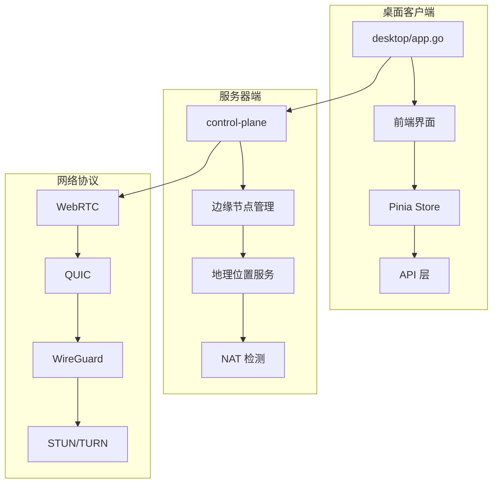
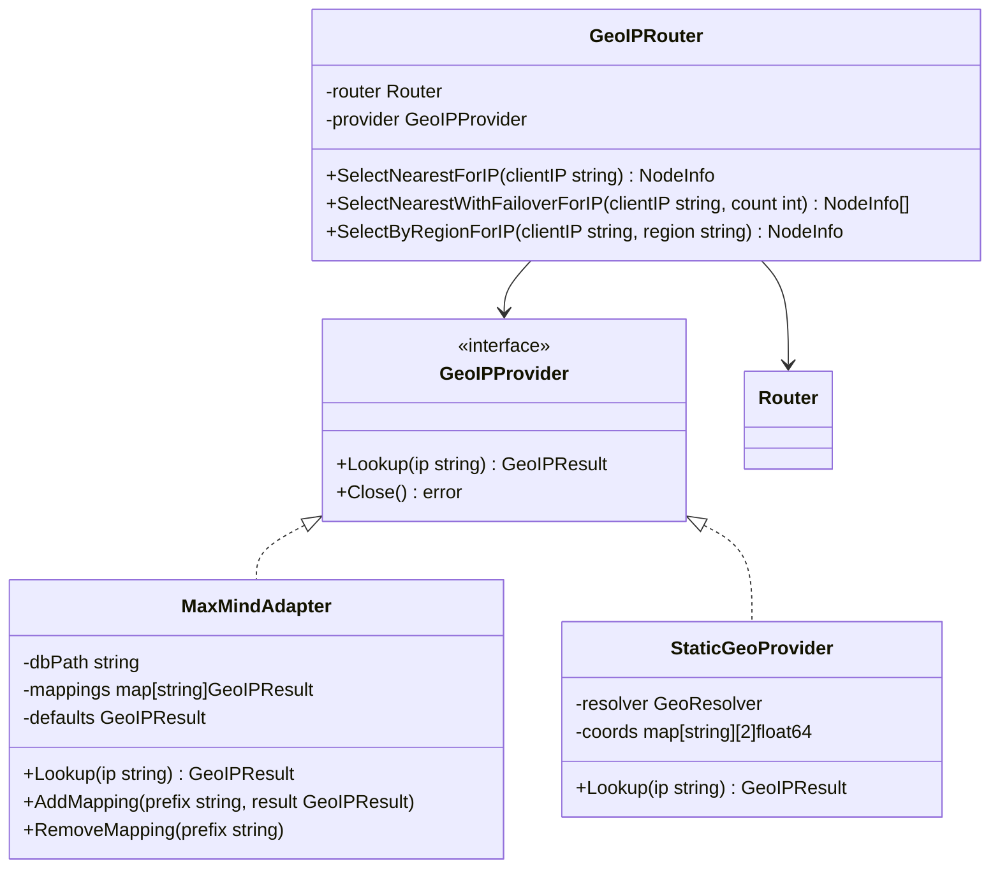
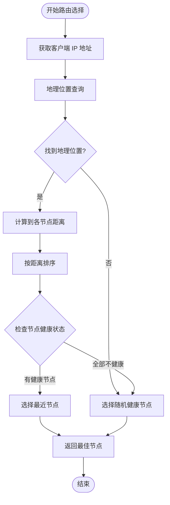
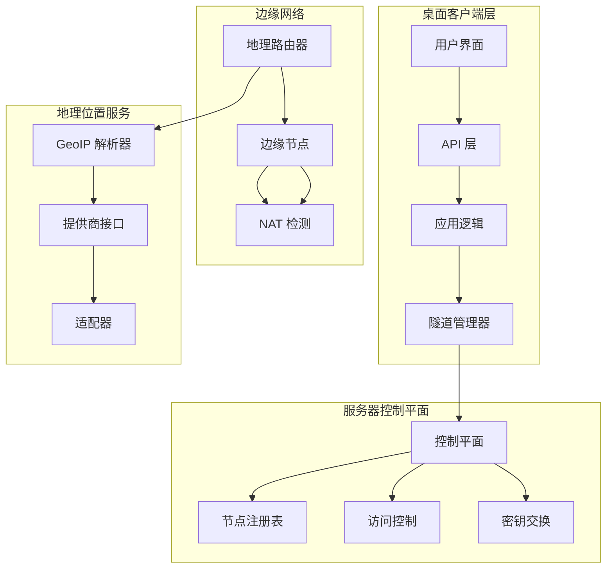
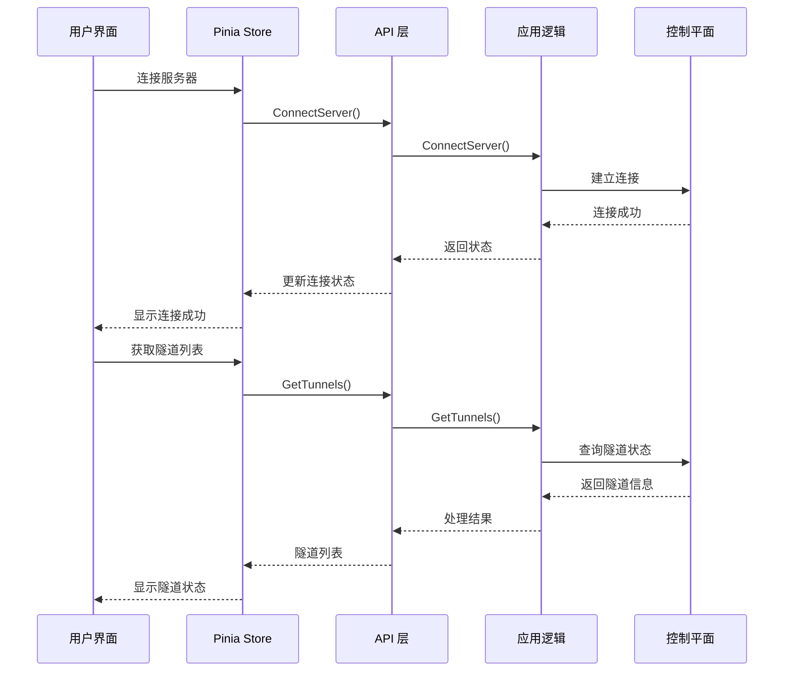
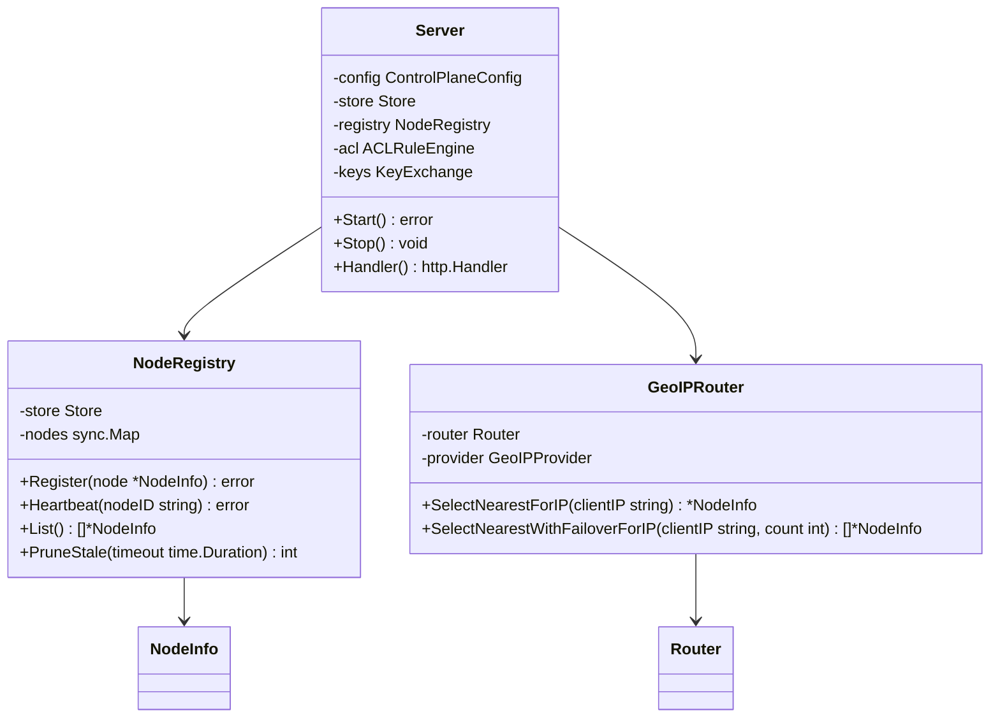
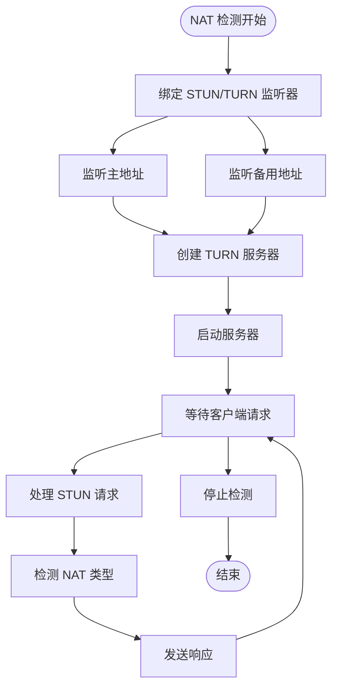
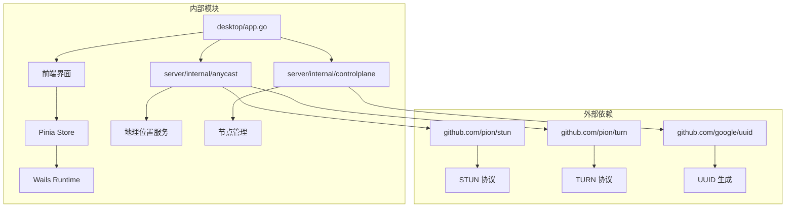

# 地理定位服务

<cite>
**本文档引用的文件**
- [desktop/app.go](file://desktop/app.go)
- [desktop/main.go](file://desktop/main.go)
- [desktop/frontend/src/stores/tunnel.ts](file://desktop/frontend/src/stores/tunnel.ts)
- [desktop/frontend/src/views/StatusView.vue](file://desktop/frontend/src/views/StatusView.vue)
- [desktop/frontend/src/api/app.ts](file://desktop/frontend/src/api/app.ts)
- [server/cmd/control-plane/main.go](file://server/cmd/control-plane/main.go)
- [server/internal/anycast/geoip.go](file://server/internal/anycast/geoip.go)
- [server/internal/anycast/router.go](file://server/internal/anycast/router.go)
- [server/internal/anycast/config.go](file://server/internal/anycast/config.go)
- [server/internal/natdetect/server.go](file://server/internal/natdetect/server.go)
- [server/internal/edge/node.go](file://server/internal/edge/node.go)
- [server/internal/controlplane/server.go](file://server/internal/controlplane/server.go)
- [server/internal/controlplane/node_registry.go](file://server/internal/controlplane/node_registry.go)
- [desktop/internal/config/store.go](file://desktop/internal/config/store.go)
- [server/internal/anycast/geoip_test.go](file://server/internal/anycast/geoip_test.go)
</cite>

## 目录
1. [简介](#简介)
2. [项目结构](#项目结构)
3. [核心组件](#核心组件)
4. [架构概览](#架构概览)
5. [详细组件分析](#详细组件分析)
6. [依赖分析](#依赖分析)
7. [性能考虑](#性能考虑)
8. [故障排除指南](#故障排除指南)
9. [结论](#结论)

## 简介

NexTunnel 是一个基于 WebRTC 和 QUIC 协议的全球网络加速服务，其地理定位功能通过多种技术手段实现。该系统包含桌面客户端、服务器端控制平面和边缘节点网络，支持智能路由选择、NAT 类型检测和地理位置服务。

地理定位服务的核心目标是：
- 为用户提供最优的网络路径选择
- 支持基于地理位置的流量路由
- 实现智能的节点负载均衡
- 提供实时的网络状态监控

## 项目结构

项目采用模块化架构，主要分为三个部分：

**图表来源**
- [desktop/app.go:1-354](file://desktop/app.go#L1-L354)
- [server/cmd/control-plane/main.go:1-46](file://server/cmd/control-plane/main.go#L1-L46)

**章节来源**
- [desktop/main.go:1-40](file://desktop/main.go#L1-L40)
- [desktop/app.go:1-354](file://desktop/app.go#L1-L354)

## 核心组件

### 地理位置解析器

系统实现了多层地理位置解析机制：

**图表来源**
- [server/internal/anycast/geoip.go:18-233](file://server/internal/anycast/geoip.go#L18-L233)
- [server/internal/anycast/router.go:23-290](file://server/internal/anycast/router.go#L23-L290)

### 路由选择算法

系统使用基于哈弗辛距离的智能路由算法：

**图表来源**
- [server/internal/anycast/router.go:61-133](file://server/internal/anycast/router.go#L61-L133)
- [server/internal/anycast/geoip.go:206-233](file://server/internal/anycast/geoip.go#L206-L233)

**章节来源**
- [server/internal/anycast/geoip.go:1-233](file://server/internal/anycast/geoip.go#L1-L233)
- [server/internal/anycast/router.go:1-290](file://server/internal/anycast/router.go#L1-L290)

## 架构概览

系统采用分布式架构，包含多个协调组件：

**图表来源**
- [desktop/app.go:25-354](file://desktop/app.go#L25-L354)
- [server/internal/controlplane/server.go:15-283](file://server/internal/controlplane/server.go#L15-L283)
- [server/internal/anycast/router.go:23-290](file://server/internal/anycast/router.go#L23-L290)

## 详细组件分析

### 桌面客户端架构

桌面客户端提供了完整的地理定位服务界面：

**图表来源**
- [desktop/frontend/src/views/StatusView.vue:490-542](file://desktop/frontend/src/views/StatusView.vue#L490-L542)
- [desktop/frontend/src/stores/tunnel.ts:105-133](file://desktop/frontend/src/stores/tunnel.ts#L105-L133)

### 服务器端控制平面

控制平面负责节点管理和地理定位：

**图表来源**
- [server/internal/controlplane/server.go:15-283](file://server/internal/controlplane/server.go#L15-L283)
- [server/internal/controlplane/node_registry.go:10-263](file://server/internal/controlplane/node_registry.go#L10-L263)

**章节来源**
- [desktop/frontend/src/stores/tunnel.ts:1-199](file://desktop/frontend/src/stores/tunnel.ts#L1-L199)
- [desktop/frontend/src/views/StatusView.vue:1-872](file://desktop/frontend/src/views/StatusView.vue#L1-L872)
- [desktop/frontend/src/api/app.ts:1-125](file://desktop/frontend/src/api/app.ts#L1-L125)

### NAT 类型检测

系统集成了 STUN/TURN 服务器进行 NAT 类型检测：

**图表来源**
- [server/internal/natdetect/server.go:37-144](file://server/internal/natdetect/server.go#L37-L144)

**章节来源**
- [server/internal/natdetect/server.go:1-144](file://server/internal/natdetect/server.go#L1-L144)

## 依赖分析

系统依赖关系清晰，模块间耦合度低：

**图表来源**
- [desktop/app.go:3-16](file://desktop/app.go#L3-L16)
- [server/internal/natdetect/server.go:3-13](file://server/internal/natdetect/server.go#L3-L13)

**章节来源**
- [desktop/app.go:1-354](file://desktop/app.go#L1-L354)
- [server/internal/anycast/geoip.go:3-7](file://server/internal/anycast/geoip.go#L3-L7)

## 性能考虑

地理定位服务的性能优化策略：

1. **缓存机制**：地理位置查询结果缓存，减少重复查询
2. **异步处理**：所有网络操作采用异步模式，避免阻塞
3. **连接池**：复用 HTTP 连接，减少连接开销
4. **智能路由**：基于哈弗辛距离的快速路由算法
5. **负载均衡**：多节点负载均衡，避免单点过载

## 故障排除指南

### 常见问题及解决方案

| 问题类型 | 症状 | 可能原因 | 解决方案 |
|---------|------|----------|----------|
| 地理位置解析失败 | 无法获取节点信息 | GeoIP 数据库加载失败 | 检查数据库路径和权限 |
| 路由选择异常 | 选择错误的节点 | 节点坐标数据不准确 | 验证节点地理位置配置 |
| NAT 类型检测失败 | 无法建立 P2P 连接 | STUN 服务器不可达 | 检查防火墙和端口配置 |
| 连接超时 | 服务器连接失败 | 网络延迟过高 | 优化网络配置和重试策略 |

**章节来源**
- [server/internal/anycast/geoip_test.go:1-224](file://server/internal/anycast/geoip_test.go#L1-L224)

## 结论

NexTunnel 的地理定位服务通过多层次的技术实现，提供了高效、可靠的地理位置解析和智能路由功能。系统架构清晰，模块职责明确，具有良好的扩展性和维护性。

关键优势包括：
- 多层地理位置解析机制，提高准确性
- 基于哈弗辛距离的智能路由算法
- 完整的 NAT 类型检测和处理
- 实时的状态监控和故障转移
- 用户友好的图形界面

未来可以进一步优化的方向：
- 集成更精确的地理位置数据库
- 实现机器学习驱动的路由优化
- 增强实时性能监控和告警功能
- 扩展多协议支持和自适应算法