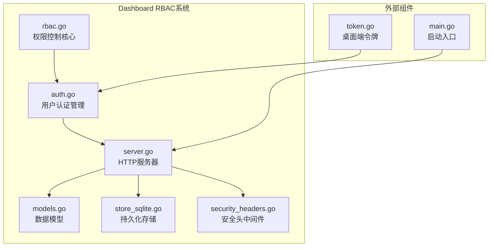
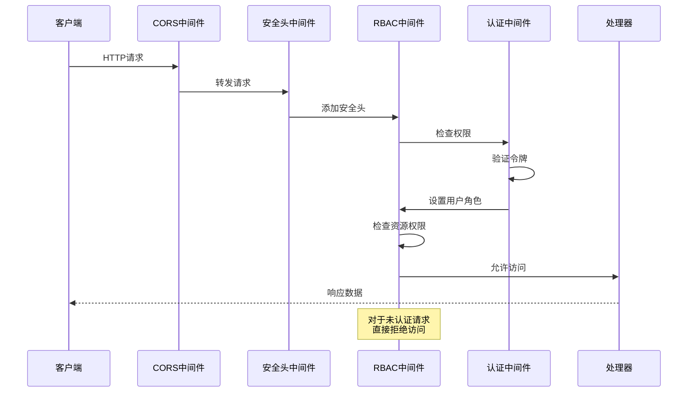
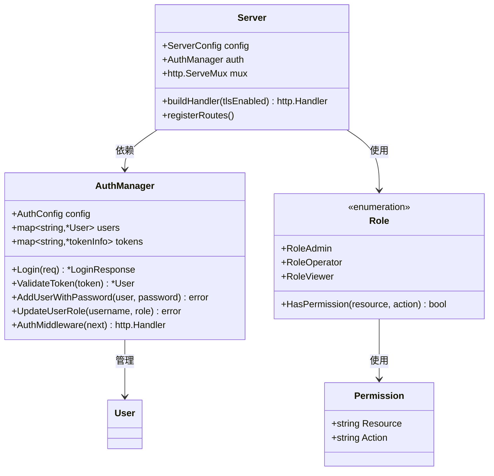
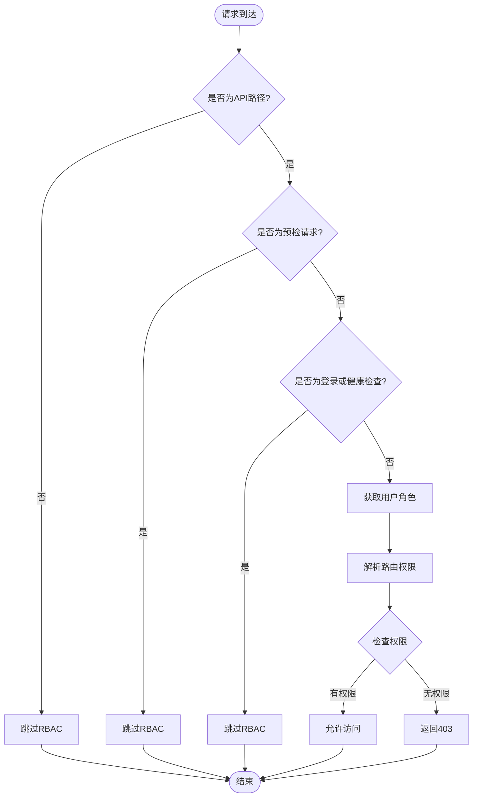
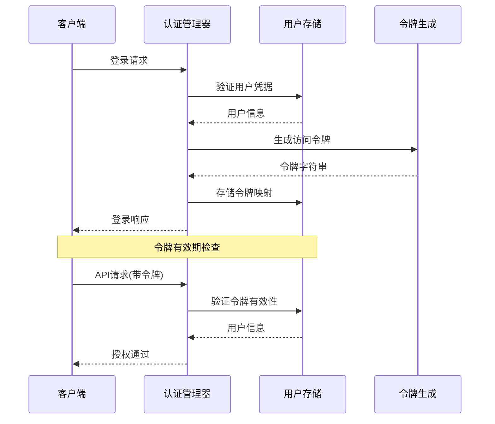
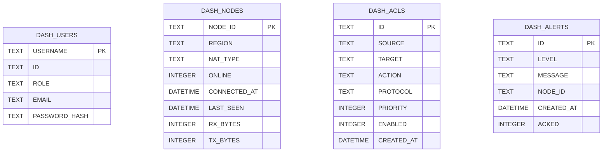
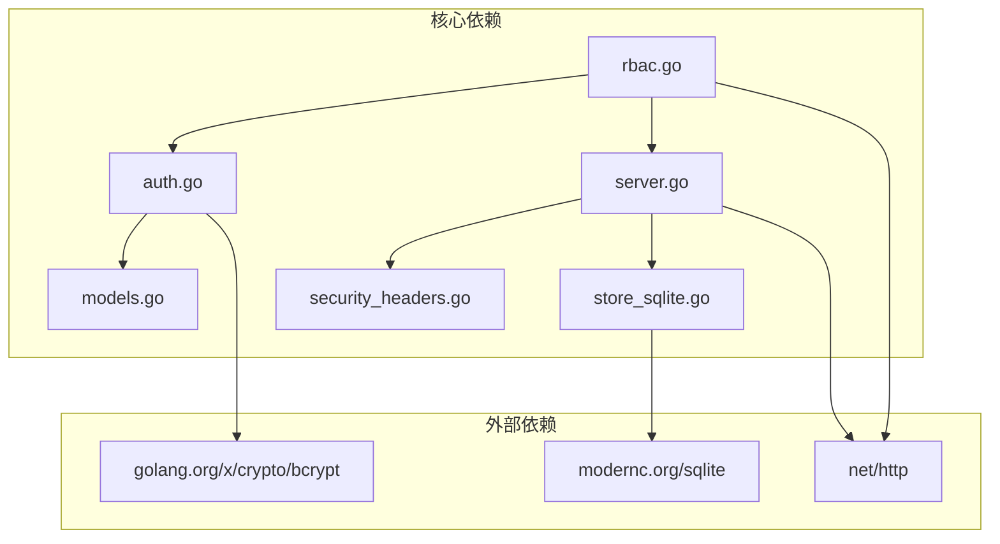

# 基于角色的访问控制

<cite>
**本文档引用的文件**
- [rbac.go](file://server/internal/dashboard/rbac.go)
- [auth.go](file://server/internal/dashboard/auth.go)
- [server.go](file://server/internal/dashboard/server.go)
- [models.go](file://server/internal/dashboard/models.go)
- [store_sqlite.go](file://server/internal/dashboard/store_sqlite.go)
- [security_headers.go](file://server/internal/dashboard/security_headers.go)
- [rbac_test.go](file://server/internal/dashboard/rbac_test.go)
- [main.go](file://server/cmd/dashboard/main.go)
- [token.go](file://desktop/internal/auth/token.go)
</cite>

## 目录
1. [简介](#简介)
2. [项目结构](#项目结构)
3. [核心组件](#核心组件)
4. [架构概览](#架构概览)
5. [详细组件分析](#详细组件分析)
6. [权限矩阵](#权限矩阵)
7. [依赖关系分析](#依赖关系分析)
8. [性能考虑](#性能考虑)
9. [故障排除指南](#故障排除指南)
10. [结论](#结论)

## 简介

基于角色的访问控制（Role-Based Access Control, RBAC）是NexTunnel项目中Dashboard服务的核心安全机制。该系统通过定义不同的用户角色和权限规则，确保只有授权用户才能访问特定的资源和执行相应的操作。

RBAC系统主要包含以下核心功能：
- 用户身份认证和会话管理
- 基于角色的权限控制
- API请求的细粒度访问控制
- 审计日志记录
- 安全响应头设置

## 项目结构

Dashboard RBAC系统位于服务器端的dashboard包中，采用模块化设计，各组件职责清晰：

**图表来源**
- [rbac.go:1-155](file://server/internal/dashboard/rbac.go#L1-L155)
- [auth.go:1-246](file://server/internal/dashboard/auth.go#L1-L246)
- [server.go:1-738](file://server/internal/dashboard/server.go#L1-L738)

**章节来源**
- [rbac.go:1-155](file://server/internal/dashboard/rbac.go#L1-L155)
- [auth.go:1-246](file://server/internal/dashboard/auth.go#L1-L246)
- [server.go:1-738](file://server/internal/dashboard/server.go#L1-L738)

## 核心组件

### 角色定义

系统定义了三个基本角色，每个角色具有不同的权限级别：

| 角色 | 描述 | 权限范围 |
|------|------|----------|
| admin | 系统管理员 | 完全访问所有资源和操作 |
| operator | 运维操作员 | 有限的管理权限，主要用于日常运维 |
| viewer | 只读查看员 | 仅能查看系统状态和信息 |

### 权限模型

权限采用"资源+动作"的二维模型：

**资源类型：**
- nodes: 节点管理
- acl: 访问控制列表
- alerts: 系统告警
- alert-rules: 告警规则
- users: 用户管理
- audit: 审计日志
- metrics: 指标数据
- stats: 统计信息

**操作类型：**
- read: 读取操作
- write: 写入/修改操作
- delete: 删除操作

**章节来源**
- [rbac.go:8-77](file://server/internal/dashboard/rbac.go#L8-L77)
- [models.go:50-78](file://server/internal/dashboard/models.go#L50-L78)

## 架构概览

RBAC系统采用中间件链式处理架构，确保所有API请求都经过身份验证和权限检查：

**图表来源**
- [server.go:146-153](file://server/internal/dashboard/server.go#L146-L153)
- [auth.go:210-245](file://server/internal/dashboard/auth.go#L210-L245)
- [rbac.go:122-154](file://server/internal/dashboard/rbac.go#L122-L154)

### 中间件执行流程

1. **CORS中间件**：处理跨域请求和预检请求
2. **安全头中间件**：添加标准安全响应头
3. **RBAC中间件**：执行权限检查
4. **认证中间件**：验证用户身份

**章节来源**
- [server.go:146-153](file://server/internal/dashboard/server.go#L146-L153)
- [security_headers.go:5-21](file://server/internal/dashboard/security_headers.go#L5-L21)

## 详细组件分析

### RBAC核心组件

**图表来源**
- [rbac.go:8-77](file://server/internal/dashboard/rbac.go#L8-L77)
- [auth.go:34-46](file://server/internal/dashboard/auth.go#L34-L46)
- [server.go:42-54](file://server/internal/dashboard/server.go#L42-L54)

### 权限检查算法

RBAC中间件使用以下算法进行权限检查：

**图表来源**
- [rbac.go:122-154](file://server/internal/dashboard/rbac.go#L122-L154)
- [rbac.go:79-120](file://server/internal/dashboard/rbac.go#L79-L120)

**章节来源**
- [rbac.go:53-77](file://server/internal/dashboard/rbac.go#L53-L77)
- [rbac.go:122-154](file://server/internal/dashboard/rbac.go#L122-L154)

### 认证管理器

认证管理器负责用户身份验证和令牌管理：

**图表来源**
- [auth.go:72-102](file://server/internal/dashboard/auth.go#L72-L102)
- [auth.go:104-132](file://server/internal/dashboard/auth.go#L104-L132)

**章节来源**
- [auth.go:34-46](file://server/internal/dashboard/auth.go#L34-L46)
- [auth.go:72-132](file://server/internal/dashboard/auth.go#L72-L132)

### 数据持久化

系统支持SQLite数据库持久化存储，确保用户信息在服务重启后不丢失：

**图表来源**
- [store_sqlite.go:41-85](file://server/internal/dashboard/store_sqlite.go#L41-L85)

**章节来源**
- [store_sqlite.go:87-131](file://server/internal/dashboard/store_sqlite.go#L87-L131)

## 权限矩阵

### 管理员权限（admin）

管理员拥有对所有资源的完全访问权限：

| 资源 | 读取 | 写入 | 删除 |
|------|------|------|------|
| nodes | ✓ | ✓ | ✓ |
| acl | ✓ | ✓ | ✓ |
| alerts | ✓ | ✓ | ✓ |
| alert-rules | ✓ | ✓ | ✓ |
| users | ✓ | ✓ | ✓ |
| audit | ✓ | - | - |
| metrics | - | ✓ | - |
| stats | ✓ | - | - |

### 运维人员权限（operator）

运维人员具有有限的管理权限：

| 资源 | 读取 | 写入 | 删除 |
|------|------|------|------|
| nodes | ✓ | ✓ | ✓ |
| acl | ✓ | ✓ | ✓ |
| alerts | ✓ | ✓ | - |
| alert-rules | ✓ | - | - |
| users | - | - | - |
| audit | ✓ | - | - |
| metrics | - | ✓ | - |
| stats | ✓ | - | - |

### 查看员权限（viewer）

查看员仅能读取系统信息：

| 资源 | 读取 | 写入 | 删除 |
|------|------|------|------|
| nodes | ✓ | - | - |
| acl | ✓ | - | - |
| alerts | ✓ | - | - |
| alert-rules | ✓ | - | - |
| users | - | - | - |
| audit | ✓ | - | - |
| metrics | - | - | - |
| stats | ✓ | - | - |

**章节来源**
- [rbac.go:23-51](file://server/internal/dashboard/rbac.go#L23-L51)

## 依赖关系分析

RBAC系统的依赖关系清晰，遵循单一职责原则：

**图表来源**
- [rbac.go:3-6](file://server/internal/dashboard/rbac.go#L3-L6)
- [auth.go:3-14](file://server/internal/dashboard/auth.go#L3-L14)
- [store_sqlite.go:3-8](file://server/internal/dashboard/store_sqlite.go#L3-L8)

### 关键依赖说明

1. **bcrypt**: 用于密码哈希加密
2. **sqlite**: 提供持久化存储能力
3. **http**: 标准HTTP处理库
4. **slog**: 结构化日志记录

**章节来源**
- [auth.go:3-14](file://server/internal/dashboard/auth.go#L3-L14)
- [store_sqlite.go:3-8](file://server/internal/dashboard/store_sqlite.go#L3-L8)

## 性能考虑

### 缓存策略

- **内存缓存**: 用户令牌和会话信息存储在内存中，提供快速访问
- **角色权限缓存**: 角色权限映射在内存中维护，避免重复计算
- **数据库优化**: SQLite使用WAL模式提高并发性能

### 并发安全

- 使用互斥锁保护共享数据结构
- 读写分离优化读取性能
- 原子操作确保数据一致性

### 性能优化建议

1. **令牌缓存**: 考虑实现令牌缓存减少数据库查询
2. **权限预编译**: 将常用权限检查结果缓存
3. **批量操作**: 支持批量用户管理和权限更新

## 故障排除指南

### 常见问题及解决方案

| 问题类型 | 症状 | 可能原因 | 解决方案 |
|----------|------|----------|----------|
| 认证失败 | 401 Unauthorized | 令牌无效或过期 | 检查令牌格式和有效期 |
| 权限不足 | 403 Forbidden | 用户角色权限不足 | 更新用户角色或调整权限 |
| 服务器启动失败 | 配置错误 | 缺少必需配置项 | 检查配置参数完整性 |
| 数据库连接失败 | SQL错误 | 数据库文件损坏 | 检查数据库文件权限 |

### 调试技巧

1. **启用审计日志**: 通过命令行参数启用详细的审计日志
2. **检查中间件顺序**: 确保中间件按正确顺序注册
3. **验证配置**: 使用默认配置进行最小化测试

**章节来源**
- [rbac_test.go:136-145](file://server/internal/dashboard/rbac_test.go#L136-L145)
- [server.go:155-169](file://server/internal/dashboard/server.go#L155-L169)

## 结论

NexTunnel的基于角色的访问控制系统设计合理，实现了以下目标：

### 设计优势

1. **清晰的角色层次**: 三种角色覆盖了常见的权限需求场景
2. **灵活的权限模型**: 支持资源和操作的组合权限控制
3. **安全的中间件架构**: 多层安全防护确保系统安全
4. **持久化存储**: 用户信息和配置数据可靠保存

### 安全特性

- 强制的令牌认证机制
- 细粒度的权限控制
- 标准的安全响应头
- 审计日志记录
- 防止常见Web攻击

### 扩展性

系统设计支持进一步扩展，包括：
- 更细粒度的权限控制
- 多租户支持
- 集成LDAP或其他认证系统
- 实时权限更新机制

该RBAC系统为NexTunnel提供了坚实的安全基础，确保系统在复杂网络环境中的安全运行。