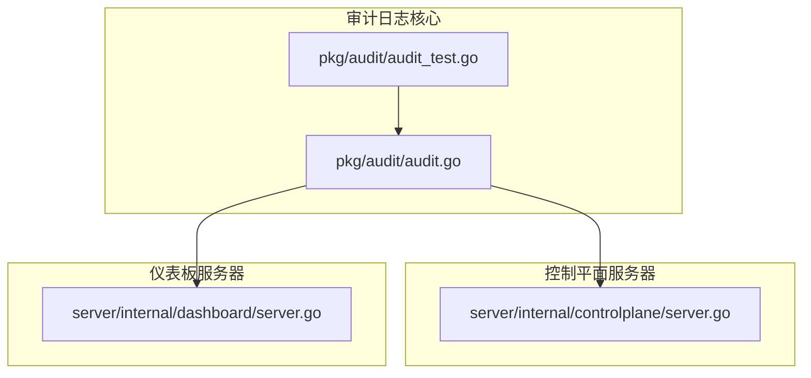
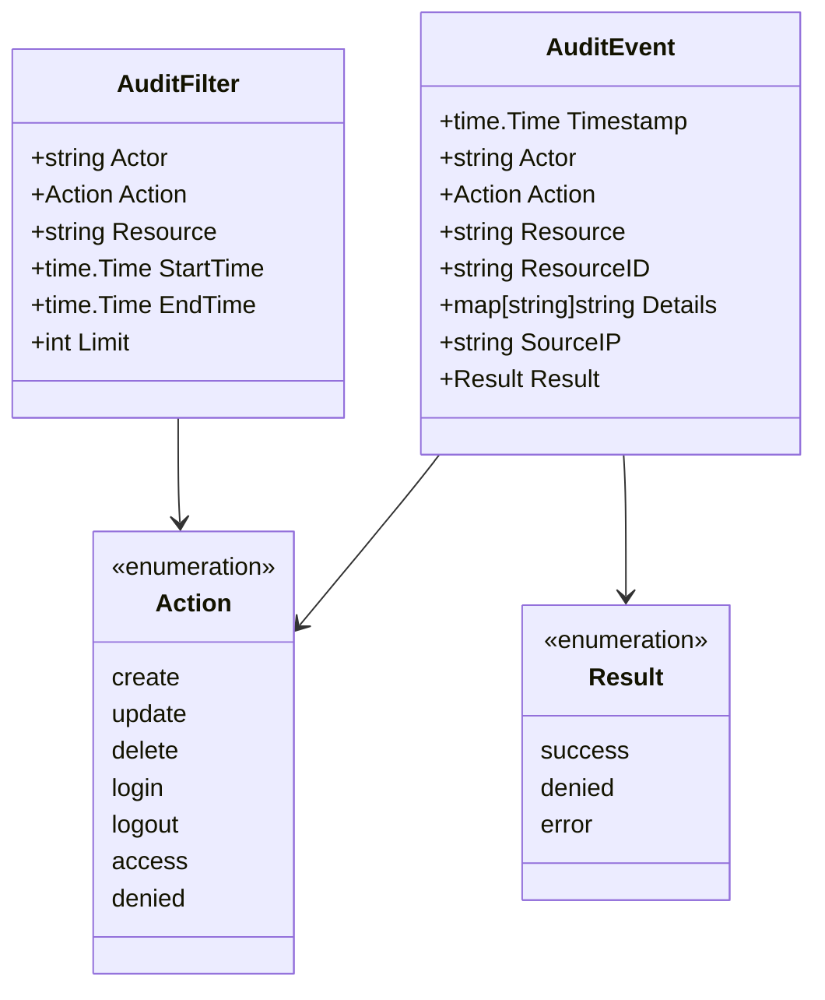
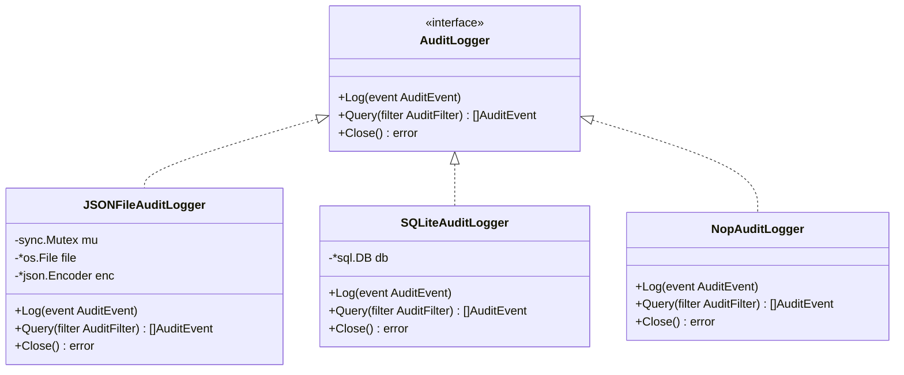
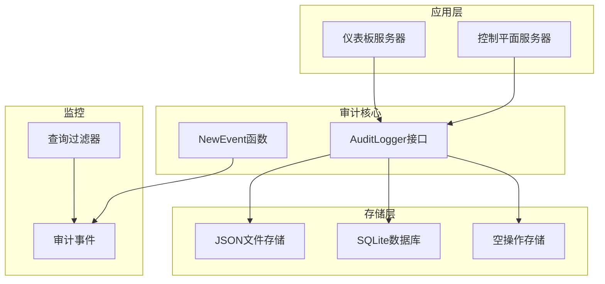
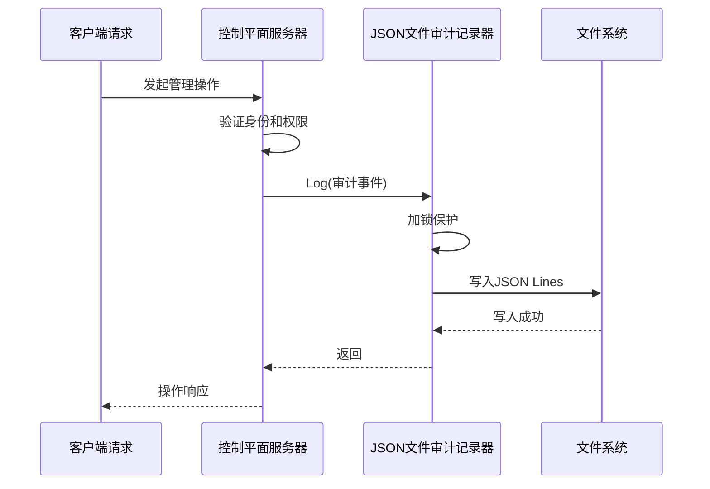
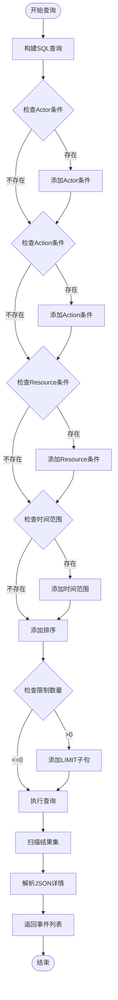
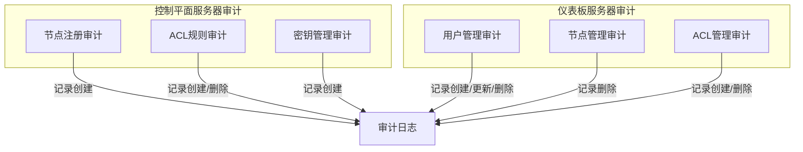
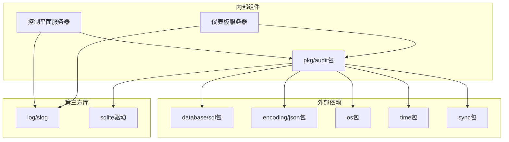

# 审计日志系统

<cite>
**本文档引用的文件**
- [pkg/audit/audit.go](file://pkg/audit/audit.go)
- [pkg/audit/audit_test.go](file://pkg/audit/audit_test.go)
- [server/internal/controlplane/server.go](file://server/internal/controlplane/server.go)
- [server/internal/dashboard/server.go](file://server/internal/dashboard/server.go)
</cite>

## 目录
1. [简介](#简介)
2. [项目结构](#项目结构)
3. [核心组件](#核心组件)
4. [架构概览](#架构概览)
5. [详细组件分析](#详细组件分析)
6. [依赖关系分析](#依赖关系分析)
7. [性能考虑](#性能考虑)
8. [故障排除指南](#故障排除指南)
9. [结论](#结论)

## 简介

审计日志系统是 NexTunnel 项目中的一个关键安全组件，用于记录所有安全相关的操作事件。该系统提供了结构化的审计日志功能，支持多种存储后端，并在控制平面服务器和仪表板服务器中得到广泛应用。

系统的核心目标包括：
- 记录所有安全相关的操作事件
- 提供灵活的查询和过滤功能
- 支持多种存储后端（文件、数据库）
- 确保审计数据的完整性和可追溯性

## 项目结构

审计日志系统主要分布在以下位置：



**图表来源**
- [pkg/audit/audit.go:1-252](file://pkg/audit/audit.go#L1-L252)
- [server/internal/controlplane/server.go:1-381](file://server/internal/controlplane/server.go#L1-L381)
- [server/internal/dashboard/server.go:1-738](file://server/internal/dashboard/server.go#L1-L738)

**章节来源**
- [pkg/audit/audit.go:1-252](file://pkg/audit/audit.go#L1-L252)
- [server/internal/controlplane/server.go:1-381](file://server/internal/controlplane/server.go#L1-L381)
- [server/internal/dashboard/server.go:1-738](file://server/internal/dashboard/server.go#L1-L738)

## 核心组件

### 审计事件模型

审计系统的核心是 `AuditEvent` 结构体，它定义了所有审计事件的标准格式：



**图表来源**
- [pkg/audit/audit.go:35-55](file://pkg/audit/audit.go#L35-L55)
- [pkg/audit/audit.go:13-33](file://pkg/audit/audit.go#L13-L33)

### 审计日志接口

系统定义了一个统一的 `AuditLogger` 接口，确保不同实现的一致性：



**图表来源**
- [pkg/audit/audit.go:57-65](file://pkg/audit/audit.go#L57-L65)
- [pkg/audit/audit.go:81-117](file://pkg/audit/audit.go#L81-L117)
- [pkg/audit/audit.go:121-242](file://pkg/audit/audit.go#L121-L242)

**章节来源**
- [pkg/audit/audit.go:35-65](file://pkg/audit/audit.go#L35-L65)

## 架构概览

审计日志系统采用模块化设计，在多个服务中集成：



**图表来源**
- [server/internal/controlplane/server.go:44-64](file://server/internal/controlplane/server.go#L44-L64)
- [server/internal/dashboard/server.go:81-98](file://server/internal/dashboard/server.go#L81-L98)
- [pkg/audit/audit.go:67-77](file://pkg/audit/audit.go#L67-L77)

系统架构特点：
- **统一接口**：所有审计实现遵循相同的接口规范
- **多后端支持**：支持文件和数据库两种存储方式
- **可插拔设计**：通过配置启用或禁用审计功能
- **零成本抽象**：提供空操作实现用于测试环境

## 详细组件分析

### JSON 文件审计记录器

JSON 文件审计记录器是最简单的实现，直接将审计事件以 JSON Lines 格式写入文件：



**图表来源**
- [server/internal/controlplane/server.go:179-195](file://server/internal/controlplane/server.go#L179-L195)
- [pkg/audit/audit.go:100-105](file://pkg/audit/audit.go#L100-L105)

实现特性：
- **线程安全**：使用互斥锁保护文件访问
- **追加模式**：自动创建并追加到现有文件
- **权限控制**：文件权限设置为 0600
- **JSON Lines**：每行一条完整的 JSON 记录

**章节来源**
- [pkg/audit/audit.go:81-117](file://pkg/audit/audit.go#L81-L117)

### SQLite 审计记录器

SQLite 实现提供了完整的查询功能，适合生产环境使用：



**图表来源**
- [pkg/audit/audit.go:184-237](file://pkg/audit/audit.go#L184-L237)

查询功能特性：
- **灵活过滤**：支持按 Actor、Action、Resource 过滤
- **时间范围**：支持开始和结束时间范围查询
- **索引优化**：为常用查询字段建立数据库索引
- **结果限制**：支持限制返回事件数量

**章节来源**
- [pkg/audit/audit.go:121-242](file://pkg/audit/audit.go#L121-L242)

### 空操作审计记录器

空操作实现用于测试和开发环境，不产生任何副作用：

```mermaid
classDiagram
class NopAuditLogger {
+Log(AuditEvent) void
+Query(AuditFilter) []AuditEvent
+Close() error
}
note for NopAuditLogger : "空操作实现\n- 不记录任何事件\n- 查询返回空结果\n- 关闭时无操作"
```

**图表来源**
- [pkg/audit/audit.go:244-252](file://pkg/audit/audit.go#L244-L252)

**章节来源**
- [pkg/audit/audit.go:244-252](file://pkg/audit/audit.go#L244-L252)

### 服务器集成

两个主要服务器都集成了审计功能：



**图表来源**
- [server/internal/controlplane/server.go:179-291](file://server/internal/controlplane/server.go#L179-L291)
- [server/internal/dashboard/server.go:657-689](file://server/internal/dashboard/server.go#L657-L689)

**章节来源**
- [server/internal/controlplane/server.go:179-328](file://server/internal/controlplane/server.go#L179-L328)
- [server/internal/dashboard/server.go:657-708](file://server/internal/dashboard/server.go#L657-L708)

## 依赖关系分析

审计日志系统与其他组件的依赖关系：



**图表来源**
- [pkg/audit/audit.go:4-11](file://pkg/audit/audit.go#L4-L11)
- [server/internal/controlplane/server.go:3-17](file://server/internal/controlplane/server.go#L3-L17)
- [server/internal/dashboard/server.go:3-17](file://server/internal/dashboard/server.go#L3-L17)

**章节来源**
- [pkg/audit/audit.go:4-11](file://pkg/audit/audit.go#L4-L11)
- [server/internal/controlplane/server.go:3-17](file://server/internal/controlplane/server.go#L3-L17)
- [server/internal/dashboard/server.go:3-17](file://server/internal/dashboard/server.go#L3-L17)

## 性能考虑

### 存储后端性能对比

| 特性 | JSON文件 | SQLite数据库 | 空操作 |
|------|----------|--------------|--------|
| 写入性能 | 高（顺序写入） | 中等（磁盘I/O） | 最高（无I/O） |
| 查询性能 | 低（需要解析整个文件） | 高（索引支持） | 无（无数据） |
| 内存占用 | 低 | 中等（连接池） | 最低 |
| 可扩展性 | 有限 | 良好 | 无 |
| 数据完整性 | 基本 | 强（事务支持） | 无 |

### 并发处理

系统采用以下并发策略：
- **JSON文件**：使用互斥锁保护文件访问
- **SQLite**：依赖数据库驱动的线程安全
- **查询优化**：为常用查询字段建立索引

### 内存管理

- **事件序列化**：使用流式JSON编码器减少内存占用
- **查询结果**：分批处理大量结果集
- **资源清理**：确保文件句柄和数据库连接正确关闭

## 故障排除指南

### 常见问题及解决方案

#### JSON文件写入失败
**症状**：审计事件无法写入文件
**原因**：
- 文件路径不存在
- 权限不足
- 磁盘空间不足

**解决方案**：
- 确保目录存在且有写权限
- 检查磁盘空间
- 使用绝对路径

#### SQLite数据库连接问题
**症状**：查询操作失败
**原因**：
- 数据库文件损坏
- 权限问题
- 连接池耗尽

**解决方案**：
- 检查数据库文件完整性
- 验证文件权限
- 适当调整连接池大小

#### 内存泄漏
**症状**：长时间运行后内存使用持续增长
**原因**：
- 未正确关闭资源
- 大量未使用的事件对象

**解决方案**：
- 确保调用 Close() 方法
- 实施事件过期机制
- 监控内存使用情况

**章节来源**
- [pkg/audit/audit_test.go:138-143](file://pkg/audit/audit_test.go#L138-L143)
- [pkg/audit/audit.go:112-117](file://pkg/audit/audit.go#L112-L117)

## 结论

审计日志系统为 NexTunnel 项目提供了全面的安全审计能力。通过模块化设计和多种存储后端支持，系统能够适应不同的部署需求和性能要求。

### 主要优势

1. **统一接口**：简洁的接口设计使得集成变得简单
2. **灵活部署**：支持多种存储后端，可根据需求选择
3. **完整功能**：提供基本记录和高级查询功能
4. **线程安全**：内置并发保护机制
5. **易于测试**：提供专门的测试实现

### 应用场景

- **安全合规**：满足各种安全审计要求
- **故障排查**：提供完整的操作历史记录
- **监控告警**：支持基于审计事件的监控
- **责任追踪**：明确的操作责任人记录

该系统为 NexTunnel 的安全运营提供了坚实的基础，建议在生产环境中使用 SQLite 后端以获得最佳的查询性能和数据完整性保障。