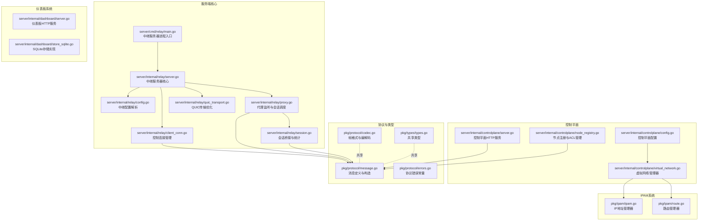
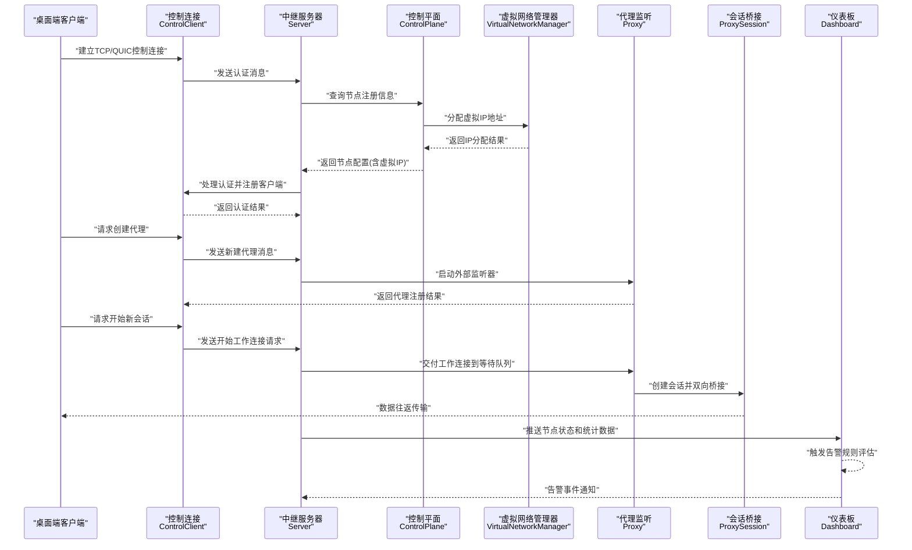
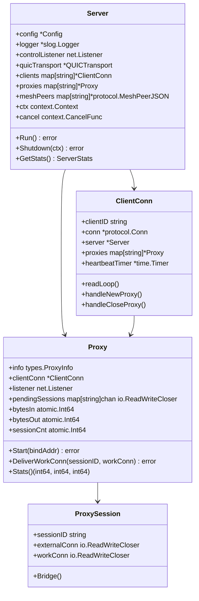
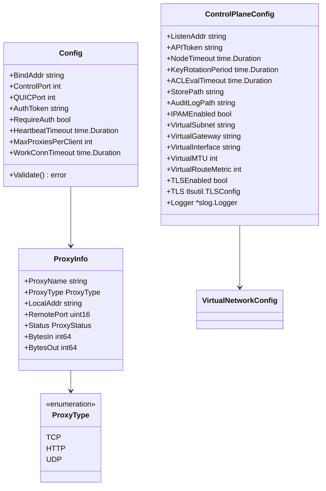
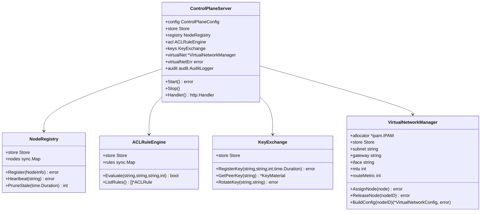
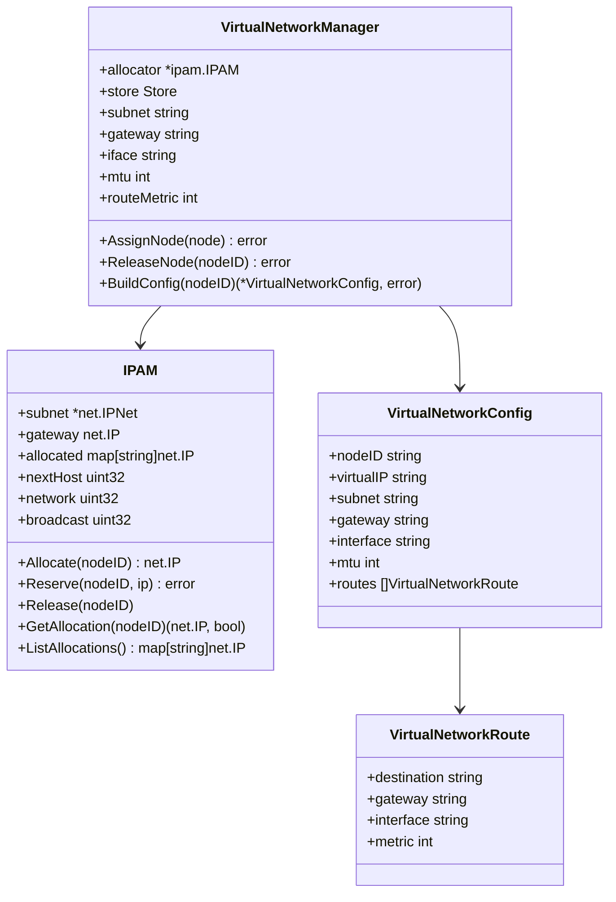
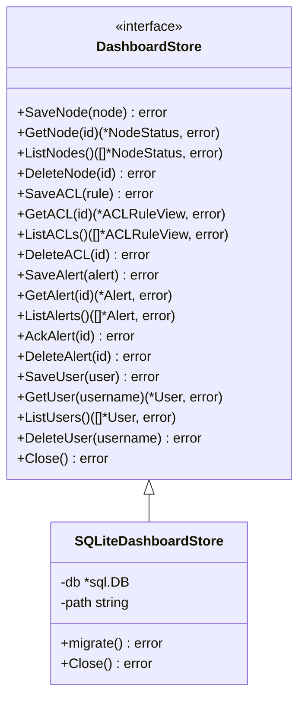
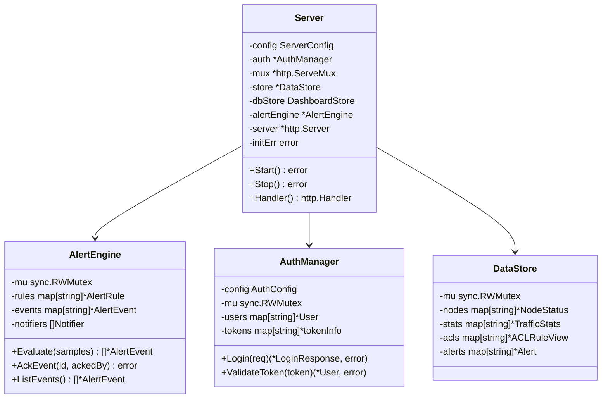
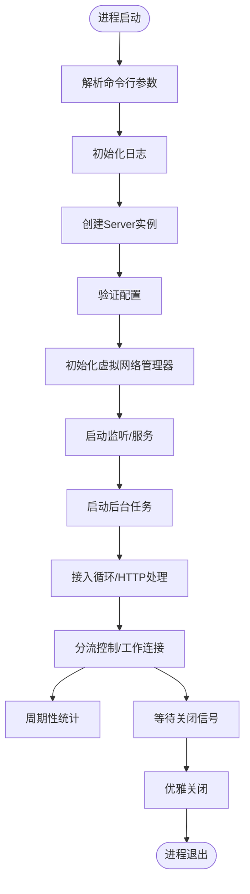
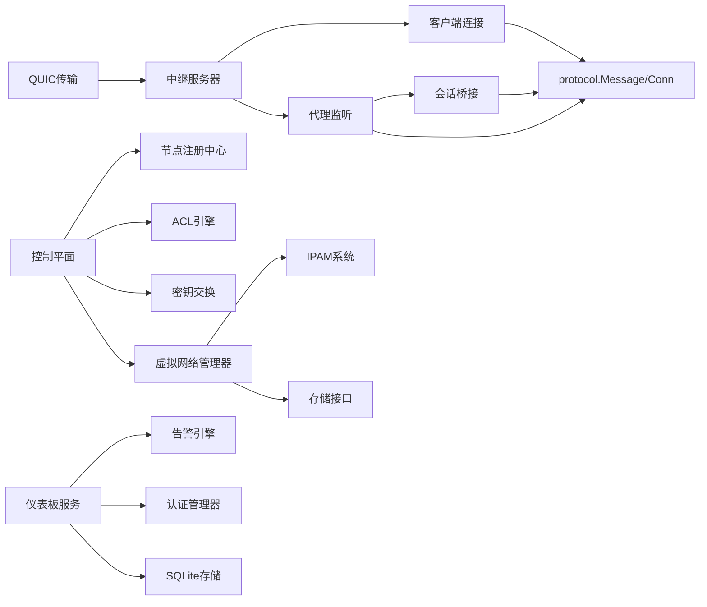

# 服务端架构

<cite>
**本文档引用的文件**
- [server/cmd/relay/main.go](file://server/cmd/relay/main.go)
- [server/internal/relay/server.go](file://server/internal/relay/server.go)
- [server/internal/relay/config.go](file://server/internal/relay/config.go)
- [server/internal/relay/client_conn.go](file://server/internal/relay/client_conn.go)
- [server/internal/relay/proxy.go](file://server/internal/relay/proxy.go)
- [server/internal/relay/session.go](file://server/internal/relay/session.go)
- [server/internal/controlplane/server.go](file://server/internal/controlplane/server.go)
- [server/internal/controlplane/node_registry.go](file://server/internal/controlplane/node_registry.go)
- [server/internal/controlplane/virtual_network.go](file://server/internal/controlplane/virtual_network.go)
- [server/internal/controlplane/config.go](file://server/internal/controlplane/config.go)
- [server/internal/dashboard/server.go](file://server/internal/dashboard/server.go)
- [server/internal/dashboard/store_sqlite.go](file://server/internal/dashboard/store_sqlite.go)
- [pkg/protocol/message.go](file://pkg/protocol/message.go)
- [pkg/protocol/codec.go](file://pkg/protocol/codec.go)
- [pkg/protocol/errors.go](file://pkg/protocol/errors.go)
- [pkg/types/types.go](file://pkg/types/types.go)
- [pkg/ipam/ipam.go](file://pkg/ipam/ipam.go)
- [pkg/ipam/route.go](file://pkg/ipam/route.go)
</cite>

## 更新摘要
**所做更改**
- 新增虚拟网络管理器作为控制平面核心组件，集成IPAM系统
- 新增自动IP地址分配和路由配置生成功能
- 扩展控制平面配置选项，支持虚拟网络参数配置
- 新增IPAM存储接口和持久化机制
- 更新控制平面HTTP API，新增虚拟网络相关接口

## 目录
1. [简介](#简介)
2. [项目结构](#项目结构)
3. [核心组件](#核心组件)
4. [架构总览](#架构总览)
5. [详细组件分析](#详细组件分析)
6. [依赖关系分析](#依赖关系分析)
7. [性能考量](#性能考量)
8. [故障排除指南](#故障排除指南)
9. [结论](#结论)
10. [附录](#附录)

## 简介
本文件面向系统管理员与开发者，全面阐述 NexTunnel 服务端的架构与实现细节，覆盖以下主题：
- 中继服务器启动流程与运行时生命周期
- 控制平面、边缘节点、SD-WAN等新组件的集群管理与高可用部署
- 会话管理机制与连接池策略
- 协议设计：控制通道协议、数据传输协议与消息编解码
- 加密与安全机制现状与建议
- 配置项、性能优化参数与监控指标
- 部署指南、运维最佳实践与故障排除
- 与桌面端客户端的通信协议与数据交换格式
- **新增**：虚拟网络管理器、IPAM系统集成、自动IP地址分配、路由配置生成

## 项目结构
服务端采用模块化分层设计，核心位于 server/internal/relay，新增的控制平面、仪表板位于 server/internal 下的相应子目录，协议与共享类型位于 pkg 子模块。新增的虚拟网络管理器位于控制平面内部，集成IPAM系统提供自动IP地址分配和路由配置。

**图表来源**
- [server/cmd/relay/main.go:1-87](file://server/cmd/relay/main.go#L1-L87)
- [server/internal/relay/server.go:1-409](file://server/internal/relay/server.go#L1-L409)
- [server/internal/relay/config.go:1-62](file://server/internal/relay/config.go#L1-L62)
- [server/internal/relay/client_conn.go:1-291](file://server/internal/relay/client_conn.go#L1-L291)
- [server/internal/relay/proxy.go:1-180](file://server/internal/relay/proxy.go#L1-L180)
- [server/internal/relay/session.go:1-79](file://server/internal/relay/session.go#L1-L79)
- [server/internal/controlplane/server.go:1-444](file://server/internal/controlplane/server.go#L1-L444)
- [server/internal/controlplane/node_registry.go:1-263](file://server/internal/controlplane/node_registry.go#L1-L263)
- [server/internal/controlplane/virtual_network.go:1-139](file://server/internal/controlplane/virtual_network.go#L1-L139)
- [server/internal/controlplane/config.go:1-102](file://server/internal/controlplane/config.go#L1-L102)
- [server/internal/dashboard/server.go:1-623](file://server/internal/dashboard/server.go#L1-L623)
- [server/internal/dashboard/store_sqlite.go:1-379](file://server/internal/dashboard/store_sqlite.go#L1-L379)
- [pkg/protocol/message.go:1-480](file://pkg/protocol/message.go#L1-L480)
- [pkg/protocol/codec.go:1-131](file://pkg/protocol/codec.go#L1-L131)
- [pkg/protocol/errors.go:1-15](file://pkg/protocol/errors.go#L1-L15)
- [pkg/types/types.go:1-80](file://pkg/types/types.go#L1-L80)
- [pkg/ipam/ipam.go:1-202](file://pkg/ipam/ipam.go#L1-L202)
- [pkg/ipam/route.go:1-90](file://pkg/ipam/route.go#L1-L90)

## 核心组件
- **中继服务器**：负责控制通道监听、接入连接分流、客户端注册与代理注册/注销、全局统计聚合。
- **控制平面**：提供HTTP API用于节点注册、心跳维护、ACL规则管理、密钥交换、**新增**虚拟网络管理。
- **虚拟网络管理器**：**新增**负责虚拟IP地址分配、路由配置生成和IPAM集成。
- **仪表板系统**：提供RESTful API的管理控制台，支持节点管理、流量统计、ACL规则、告警通知和用户认证。
- **QUIC传输优化**：基于QUIC协议的传输优化，支持更快的连接建立和更好的拥塞控制。
- **智能调度协议**：支持P2P、QUIC、TCP等多种路径的智能切换，提供更好的网络适应性。
- **Mesh网络支持**：支持节点发现、P2P信令和Mesh网络管理。
- **传统组件**：客户端连接管理、代理与会话、协议与编解码、类型与状态。

**章节来源**
- [server/internal/relay/server.go:14-47](file://server/internal/relay/server.go#L14-L47)
- [server/internal/controlplane/server.go:19-35](file://server/internal/controlplane/server.go#L19-L35)
- [server/internal/controlplane/virtual_network.go:28-37](file://server/internal/controlplane/virtual_network.go#L28-L37)
- [server/internal/dashboard/server.go:37-88](file://server/internal/dashboard/server.go#L37-L88)

## 架构总览
下图展示从客户端到服务端的完整交互链路，包括控制通道认证、代理注册、工作连接建立与数据桥接，以及新增的控制平面协调机制、仪表板监控系统和**虚拟网络管理器**。

**图表来源**
- [server/internal/relay/server.go:97-116](file://server/internal/relay/server.go#L97-L116)
- [server/internal/relay/server.go:176-218](file://server/internal/relay/server.go#L176-L218)
- [server/internal/relay/proxy.go:68-100](file://server/internal/relay/proxy.go#L68-L100)
- [server/internal/relay/session.go:41-79](file://server/internal/relay/session.go#L41-L79)
- [server/internal/controlplane/server.go:197-222](file://server/internal/controlplane/server.go#L197-L222)
- [server/internal/controlplane/virtual_network.go:61-92](file://server/internal/controlplane/virtual_network.go#L61-L92)

## 详细组件分析

### 中继服务器架构
- **核心服务器**：管理客户端连接、代理监听器和会话桥接，支持并发安全的读写操作。
- **QUIC传输支持**：可选的QUIC传输层，提供更快的连接建立和更好的网络适应性。
- **Mesh网络集成**：支持节点发现、P2P信令和Mesh网络管理。
- **智能调度支持**：支持P2P、QUIC、TCP等多种路径的智能切换。

**图表来源**
- [server/internal/relay/server.go:14-47](file://server/internal/relay/server.go#L14-L47)
- [server/internal/relay/client_conn.go:14-43](file://server/internal/relay/client_conn.go#L14-L43)
- [server/internal/relay/proxy.go:16-45](file://server/internal/relay/proxy.go#L16-L45)
- [server/internal/relay/session.go:19-37](file://server/internal/relay/session.go#L19-L37)

**章节来源**
- [server/internal/relay/server.go:14-409](file://server/internal/relay/server.go#L14-L409)
- [server/internal/relay/client_conn.go:14-291](file://server/internal/relay/client_conn.go#L14-L291)
- [server/internal/relay/proxy.go:16-180](file://server/internal/relay/proxy.go#L16-L180)
- [server/internal/relay/session.go:19-79](file://server/internal/relay/session.go#L19-L79)

### 配置系统
- **基础配置**：绑定地址、控制端口、心跳超时、每客户端最大代理数、工作连接超时。
- **安全配置**：认证令牌、强制认证要求（非本地绑定自动启用）。
- **传输配置**：QUIC端口支持，可选的QUIC传输层。
- **代理配置**：支持TCP、HTTP、UDP三种代理类型，HTTP代理支持域名和HTTPS。
- **虚拟网络配置**：**新增**IPAM启用开关、虚拟子网、虚拟网关、虚拟接口、MTU、路由度量值。

**图表来源**
- [server/internal/relay/config.go:9-62](file://server/internal/relay/config.go#L9-L62)
- [server/internal/controlplane/config.go:10-28](file://server/internal/controlplane/config.go#L10-L28)
- [pkg/types/types.go:6-42](file://pkg/types/types.go#L6-L42)

**章节来源**
- [server/internal/relay/config.go:9-62](file://server/internal/relay/config.go#L9-L62)
- [server/internal/controlplane/config.go:10-102](file://server/internal/controlplane/config.go#L10-L102)
- [pkg/types/types.go:6-80](file://pkg/types/types.go#L6-L80)

### 控制平面架构
- **HTTP API服务**：提供节点注册、心跳维护、ACL规则管理、密钥交换、**新增**虚拟网络管理等RESTful接口。
- **节点注册中心**：管理边缘节点的生命周期，包括注册、心跳更新、过期清理。
- **ACL规则引擎**：基于优先级的访问控制规则评估，支持源、目标、协议、端口匹配。
- **密钥交换管理**：WireGuard公钥注册、轮换和查询，支持密钥版本管理和过期控制。
- **虚拟网络管理器**：**新增**负责虚拟IP地址分配、路由配置生成和IPAM集成。

**图表来源**
- [server/internal/controlplane/server.go:19-35](file://server/internal/controlplane/server.go#L19-L35)
- [server/internal/controlplane/node_registry.go:10-37](file://server/internal/controlplane/node_registry.go#L10-L37)
- [server/internal/controlplane/virtual_network.go:28-37](file://server/internal/controlplane/virtual_network.go#L28-L37)

**章节来源**
- [server/internal/controlplane/server.go:19-444](file://server/internal/controlplane/server.go#L19-L444)
- [server/internal/controlplane/node_registry.go:10-263](file://server/internal/controlplane/node_registry.go#L10-L263)
- [server/internal/controlplane/virtual_network.go:28-139](file://server/internal/controlplane/virtual_network.go#L28-L139)

### 虚拟网络管理器
- **IP地址管理**：基于IPAM系统实现虚拟IP地址的自动分配和回收，支持从持久化存储恢复分配状态。
- **路由配置生成**：为节点生成完整的虚拟网络配置，包括虚拟IP、子网、网关、接口和路由表。
- **持久化存储**：将IP分配信息持久化到存储中，支持服务重启后的状态恢复。
- **配置构建**：将内部虚拟网络配置转换为节点可消费的配置格式。

**图表来源**
- [server/internal/controlplane/virtual_network.go:28-37](file://server/internal/controlplane/virtual_network.go#L28-L37)
- [server/internal/controlplane/virtual_network.go:103-126](file://server/internal/controlplane/virtual_network.go#L103-L126)
- [pkg/ipam/ipam.go:20-29](file://pkg/ipam/ipam.go#L20-L29)

**章节来源**
- [server/internal/controlplane/virtual_network.go:28-139](file://server/internal/controlplane/virtual_network.go#L28-L139)
- [pkg/ipam/ipam.go:20-202](file://pkg/ipam/ipam.go#L20-L202)

### 仪表板存储实现
- **SQLite持久化**：提供完整的仪表板数据持久化存储，支持节点状态、ACL规则、告警事件和用户管理。
- **数据模型**：包含节点表(dash_nodes)、ACL表(dash_acls)、告警表(dash_alerts)、用户表(dash_users)。
- **索引优化**：为告警级别、确认状态、节点区域等关键字段建立索引，提升查询性能。
- **事务支持**：使用SQLite的ACID事务保证数据一致性和完整性。
- **WAL模式**：生产环境使用WAL模式提升并发读写性能。

**图表来源**
- [server/internal/dashboard/store_sqlite.go:10-40](file://server/internal/dashboard/store_sqlite.go#L10-L40)
- [server/internal/dashboard/store_sqlite.go:87-119](file://server/internal/dashboard/store_sqlite.go#L87-L119)

**章节来源**
- [server/internal/dashboard/store_sqlite.go:1-379](file://server/internal/dashboard/store_sqlite.go#L1-L379)

### 仪表板HTTP服务架构
- **RESTful API**：提供完整的管理控制台API，包括节点管理、流量统计、ACL规则、告警管理和用户认证。
- **认证授权**：基于HMAC签名的令牌系统，支持用户角色管理和权限控制。
- **告警引擎**：支持多种告警条件（节点离线、高延迟、高带宽、节点数量低、错误率、磁盘使用率）。
- **通知渠道**：内置日志通知器和Webhook通知器，支持外部系统集成。
- **数据存储**：支持内存存储和SQLite持久化两种存储方式。

**图表来源**
- [server/internal/dashboard/server.go:37-88](file://server/internal/dashboard/server.go#L37-L88)
- [server/internal/dashboard/server.go:50-67](file://server/internal/dashboard/server.go#L50-L67)

**章节来源**
- [server/internal/dashboard/server.go:1-623](file://server/internal/dashboard/server.go#L1-L623)

### 启动流程与生命周期
- **中继服务器**：命令行参数解析、日志初始化、Server实例创建、监听启动、接入循环、统计定时器、优雅关闭。
- **控制平面**：配置解析、内存存储初始化、Server实例创建、HTTP服务启动、后台任务（节点清理、**新增**虚拟网络管理器初始化）、信号处理。
- **仪表板服务**：配置验证、认证管理器初始化、HTTP路由注册、CORS中间件配置、服务启动。
- **QUIC传输**：可选的QUIC传输层启动，支持更快的连接建立和更好的网络适应性。

**图表来源**
- [server/cmd/relay/main.go:15-87](file://server/cmd/relay/main.go#L15-L87)
- [server/internal/controlplane/server.go:55-77](file://server/internal/controlplane/server.go#L55-L77)
- [server/internal/dashboard/server.go:95-115](file://server/internal/dashboard/server.go#L95-L115)

**章节来源**
- [server/cmd/relay/main.go:15-87](file://server/cmd/relay/main.go#L15-L87)
- [server/internal/controlplane/server.go:55-444](file://server/internal/controlplane/server.go#L55-L444)
- [server/internal/dashboard/server.go:95-623](file://server/internal/dashboard/server.go#L95-L623)

### 会话管理机制
- **外部连接接入**：代理监听器接受外部连接，生成会话ID，向客户端请求工作连接，并等待匹配。
- **工作连接交付**：服务端在收到工作连接后，从等待队列取出对应会话并启动桥接。
- **会话桥接**：双向 io.Copy 并发桥接，原子统计字节计数，完成后回调更新代理统计。
- **智能调度集成**：支持P2P、QUIC、TCP等多种路径的智能切换。

**章节来源**
- [server/internal/relay/proxy.go:68-141](file://server/internal/relay/proxy.go#L68-L141)
- [server/internal/relay/session.go:41-79](file://server/internal/relay/session.go#L41-L79)

### 连接池管理策略
- **代理监听器**：每个代理一个外部监听器，按需创建；停止时关闭监听器并清理等待队列。
- **等待队列**：使用 map[会话ID]chan io.ReadWriteCloser 维护等待中的工作连接，单通道容量为1，避免堆积。
- **会话桥接**：使用 WaitGroup 与原子计数保证桥接完成后的统计一致性。
- **智能调度池**：基于路径类型和网络质量的动态路径池管理。

**章节来源**
- [server/internal/relay/proxy.go:23-44](file://server/internal/relay/proxy.go#L23-L44)
- [server/internal/relay/proxy.go:47-61](file://server/internal/relay/proxy.go#L47-L61)
- [server/internal/relay/proxy.go:84-88](file://server/internal/relay/proxy.go#L84-L88)
- [server/internal/relay/proxy.go:149-167](file://server/internal/relay/proxy.go#L149-L167)
- [server/internal/relay/session.go:41-79](file://server/internal/relay/session.go#L41-L79)

### 协议设计与消息编解码
- **消息类型与版本**：定义认证、代理、心跳、工作连接等消息类型与协议版本，用于兼容性校验。
- **消息负载结构**：认证、新建代理、关闭代理、心跳、工作连接等负载结构，使用 JSON 序列化。
- **编解码帧格式**：帧头包含1字节类型+4字节长度，payload 最大 16MB，读写线程安全。
- **错误处理**：超长载荷、未知消息类型、连接已关闭等错误常量。
- **智能调度协议**：支持P2P Offer/Answer、QUIC Offer/Answer、路径切换通知等高级功能。
- **Mesh网络协议**：支持节点加入、离开、对等列表、Ping/Pong等Mesh网络功能。

**章节来源**
- [pkg/protocol/message.go:9-480](file://pkg/protocol/message.go#L9-L480)
- [pkg/protocol/codec.go:16-131](file://pkg/protocol/codec.go#L16-L131)
- [pkg/protocol/errors.go:5-14](file://pkg/protocol/errors.go#L5-L14)

### 与桌面端客户端的通信协议
- **控制通道**：客户端发起 TCP 或 QUIC 连接，发送认证消息，服务端验证通过后注册客户端；后续进行代理创建/关闭与心跳。
- **工作连接**：服务端接受外部连接后，向客户端发送"开始工作连接"请求；客户端随后以工作连接身份与服务端握手并建立到本地服务的桥接。
- **智能调度集成**：客户端支持P2P、QUIC、TCP等多种路径的智能切换，根据网络质量动态选择最优路径。
- **Mesh网络集成**：支持节点发现和P2P信令，实现去中心化的节点通信。
- **虚拟网络集成**：**新增**客户端接收虚拟网络配置，包括虚拟IP、子网、网关和路由信息。

**章节来源**
- [pkg/protocol/message.go:9-480](file://pkg/protocol/message.go#L9-L480)
- [server/internal/relay/proxy.go:84-99](file://server/internal/relay/proxy.go#L84-L99)
- [server/internal/controlplane/virtual_network.go:103-126](file://server/internal/controlplane/virtual_network.go#L103-L126)

### 加密与安全机制
- **当前实现**：控制通道与工作连接均未内置 TLS/加密，仅通过协议帧与负载结构进行消息编解码。
- **认证机制**：支持共享认证令牌，空配置仅用于本地开发和测试环境。
- **控制平面安全**：提供可选的Bearer Token认证，保护HTTP API访问。
- **仪表板安全**：基于bcrypt的密码哈希存储，HMAC签名令牌系统，支持用户角色管理。
- **密钥管理**：支持WireGuard公钥注册、轮换和查询，密钥版本管理和过期控制。
- **虚拟网络安全**：**新增**虚拟网络管理器提供IP地址隔离和路由控制，增强网络安全性。
- **安全建议**：在网络边界部署TLS终止（如反向代理或专用网关），确保控制与数据通道加密。

**章节来源**
- [server/internal/relay/server.go:220-226](file://server/internal/relay/server.go#L220-L226)
- [server/internal/controlplane/server.go:156-191](file://server/internal/controlplane/server.go#L156-L191)
- [server/internal/dashboard/server.go:121-135](file://server/internal/dashboard/server.go#L121-L135)

## 依赖关系分析
- **模块依赖**：服务端依赖 pkg 子模块提供的协议与共享类型。
- **组件耦合**：Server 与 ClientConn、Proxy、Session 之间通过接口与上下文解耦；Proxy 与 ClientConn 通过共享上下文取消传播。
- **新增依赖**：控制平面依赖节点注册中心、ACL引擎、密钥交换、**新增**虚拟网络管理器；虚拟网络管理器依赖IPAM系统和存储接口；仪表板依赖存储接口和认证管理器；QUIC传输依赖网络库。

**图表来源**
- [server/internal/relay/server.go:13-41](file://server/internal/relay/server.go#L13-L41)
- [server/internal/controlplane/server.go:19-35](file://server/internal/controlplane/server.go#L19-L35)
- [server/internal/controlplane/virtual_network.go:28-37](file://server/internal/controlplane/virtual_network.go#L28-L37)
- [server/internal/dashboard/server.go:37-88](file://server/internal/dashboard/server.go#L37-L88)

**章节来源**
- [server/internal/relay/server.go:13-41](file://server/internal/relay/server.go#L13-L41)
- [server/internal/controlplane/server.go:19-35](file://server/internal/controlplane/server.go#L19-L35)
- [server/internal/controlplane/virtual_network.go:28-37](file://server/internal/controlplane/virtual_network.go#L28-L37)
- [server/internal/dashboard/server.go:37-88](file://server/internal/dashboard/server.go#L37-L88)

## 性能考量
- **并发与锁**：控制通道与代理注册使用读写锁分离读写竞争；代理等待队列使用互斥锁保护并发访问。
- **I/O 模式**：使用 io.Copy 并发双向转发，WaitGroup 等待完成，减少 goroutine 泄漏风险。
- **资源释放**：优雅关闭时关闭所有客户端连接与代理监听器，清理等待队列，避免资源泄露。
- **控制平面优化**：节点清理后台任务定期扫描过期节点，避免内存泄漏；ACL规则评估使用优先级索引提升性能；**新增**虚拟网络管理器使用IPAM算法优化IP分配性能。
- **仪表板性能**：SQLite存储使用WAL模式提升并发性能，关键字段建立索引优化查询效率。
- **QUIC传输优化**：基于QUIC协议的更快连接建立和更好的拥塞控制，适合高延迟网络环境。
- **智能调度优化**：多路径智能切换机制，根据实时网络质量选择最优路径。
- **Mesh网络优化**：去中心化的节点发现和P2P通信，减少中央节点压力。
- **IPAM性能优化**：**新增**IPAM使用位图和哈希表优化IP分配和回收操作。

**章节来源**
- [server/internal/relay/server.go:20-28](file://server/internal/relay/server.go#L20-L28)
- [server/internal/relay/client_conn.go:21-28](file://server/internal/relay/client_conn.go#L21-L28)
- [server/internal/relay/proxy.go:23-32](file://server/internal/relay/proxy.go#L23-L32)
- [server/internal/relay/session.go:55-71](file://server/internal/relay/session.go#L55-L71)
- [server/internal/controlplane/server.go:420-443](file://server/internal/controlplane/server.go#L420-L443)
- [server/internal/dashboard/store_sqlite.go:107-112](file://server/internal/dashboard/store_sqlite.go#L107-L112)
- [pkg/ipam/ipam.go:71-118](file://pkg/ipam/ipam.go#L71-L118)

## 故障排除指南
- **认证失败**：检查客户端 ID 是否为空、是否重复连接、协议版本是否匹配、认证令牌配置。
- **代理创建失败**：检查监听端口占用、每客户端代理上限、代理名称冲突、代理类型配置。
- **工作连接交付失败**：检查会话是否过期、等待队列是否被清理、工作连接是否及时到达。
- **心跳超时断连**：调整心跳超时参数，检查网络稳定性与客户端存活状态。
- **控制平面API错误**：检查Bearer Token配置、节点ID格式、请求负载结构。
- **虚拟网络分配失败**：**新增**检查虚拟子网配置、网关IP有效性、IPAM存储状态、节点ID唯一性。
- **QUIC连接问题**：检查QUIC端口配置、防火墙设置、网络NAT类型。
- **智能调度异常**：验证路径类型配置、网络质量检测、路径切换逻辑。
- **Mesh网络问题**：检查节点发现机制、P2P信令、对等列表同步。
- **仪表板存储错误**：检查SQLite数据库文件权限、磁盘空间、WAL模式配置。
- **告警通知失败**：验证Webhook URL可达性、认证配置、网络连接状态。

**章节来源**
- [server/internal/relay/server.go:114-138](file://server/internal/relay/server.go#L114-L138)
- [server/internal/relay/client_conn.go:92-129](file://server/internal/relay/client_conn.go#L92-L129)
- [server/internal/relay/proxy.go:120-141](file://server/internal/relay/proxy.go#L120-L141)
- [server/internal/relay/client_conn.go:172-181](file://server/internal/relay/client_conn.go#L172-L181)
- [server/internal/controlplane/server.go:197-222](file://server/internal/controlplane/server.go#L197-L222)
- [server/internal/controlplane/virtual_network.go:61-92](file://server/internal/controlplane/virtual_network.go#L61-L92)

## 结论
NexTunnel 服务端采用模块化的分布式架构，通过控制平面、仪表板系统和智能调度机制的协同，实现了完整的集群管理、节点注册、负载均衡和高可用部署能力。传统中继服务器保持了简洁高效的事件驱动模型，通过控制通道与工作连接的分工协作，实现了稳定的内网穿透中继能力。新增的虚拟网络管理器作为控制平面的核心组件，集成了IPAM系统，支持自动IP地址分配和路由配置生成，为服务端提供了完整的虚拟网络管理能力。控制平面的HTTP API现在包含了虚拟网络管理接口，支持节点注册时的IP分配和路由配置查询。新增的QUIC传输优化提供了更快的连接建立和更好的网络适应性，智能调度协议支持P2P、QUIC、TCP等多种路径的智能切换，Mesh网络支持实现了去中心化的节点通信。仪表板系统提供了完整的管理控制台，支持节点监控、流量统计、ACL规则管理、告警通知和用户认证，为运维管理提供了强有力的工具。最新版本引入了SQLite持久化存储，确保关键数据的可靠保存。改进的配置系统支持更多的部署场景，包括QUIC传输、智能调度功能和**新增**的虚拟网络管理功能。协议层以 JSON 负载与自定义帧格式为基础，具备良好的扩展性。当前实现未内置加密，建议在网络边界或前置网关处启用 TLS 以满足生产环境的安全要求。通过合理的配置与监控，可在高并发场景下保持稳定与可观测性。

## 附录

### 服务器配置选项
- **中继服务器配置**：绑定地址、控制端口、QUIC端口、心跳超时、每客户端最大代理数、工作连接超时、认证令牌、强制认证
- **控制平面配置**：HTTP API监听地址、Bearer Token认证、节点超时、密钥轮换周期、**新增**IPAM启用开关、虚拟子网、虚拟网关、虚拟接口、虚拟MTU、虚拟路由度量值
- **仪表板配置**：监听地址、CORS允许的源、认证密钥、用户管理、静态资源目录
- **智能调度配置**：路径类型、网络质量检测、路径切换阈值、超时参数

**章节来源**
- [server/internal/relay/config.go:9-62](file://server/internal/relay/config.go#L9-L62)
- [server/internal/controlplane/config.go:10-102](file://server/internal/controlplane/config.go#L10-L102)
- [server/internal/dashboard/server.go:17-35](file://server/internal/dashboard/server.go#L17-L35)

### 监控指标
- **中继服务器指标**：客户端数量、代理数量、累计会话数、入站/出站字节数、QUIC连接数
- **控制平面指标**：节点总数、活跃节点数、ACL规则数、密钥材料数、**新增**IP分配数量、虚拟网络配置数
- **仪表板指标**：节点状态、流量统计、告警事件、用户活动、存储使用
- **智能调度指标**：路径切换次数、网络质量变化、路径成功率
- **Mesh网络指标**：节点发现成功率、P2P连接数、信令延迟
- **虚拟网络指标**：**新增**IP地址池使用率、路由表条目数、虚拟网络配置下发成功率

**章节来源**
- [server/internal/relay/server.go:375-408](file://server/internal/relay/server.go#L375-L408)
- [server/internal/relay/proxy.go:176-179](file://server/internal/relay/proxy.go#L176-L179)
- [server/internal/controlplane/server.go:420-443](file://server/internal/controlplane/server.go#L420-L443)
- [server/internal/dashboard/server.go:429-451](file://server/internal/dashboard/server.go#L429-L451)

### 部署指南
- **基础部署**：使用 docker-compose 启动中继服务，映射控制端口并设置统计间隔
- **QUIC部署**：配置QUIC端口，确保防火墙允许UDP流量，支持更好的网络适应性
- **控制平面部署**：配置HTTP API监听地址和Bearer Token，设置节点超时和密钥轮换周期，**新增**配置虚拟网络参数
- **仪表板部署**：配置监听地址、认证密钥、CORS设置，启用SQLite存储
- **智能调度部署**：配置路径类型、网络质量检测参数，启用多路径智能切换
- **Mesh网络部署**：配置节点发现机制，确保P2P信令畅通
- **虚拟网络部署**：**新增**配置虚拟子网、网关IP、接口名称和MTU参数

**章节来源**
- [server/cmd/relay/main.go:15-87](file://server/cmd/relay/main.go#L15-L87)
- [server/internal/controlplane/server.go:55-115](file://server/internal/controlplane/server.go#L55-L115)
- [server/internal/dashboard/server.go:95-115](file://server/internal/dashboard/server.go#L95-L115)

### API参考

#### 仪表板HTTP API
- **认证接口**：POST /api/v1/auth/login 用户登录获取令牌
- **节点管理**：GET/DELETE /api/v1/nodes[/id] 节点列表和删除
- **流量统计**：GET /api/v1/stats[/node_id] 全局和节点流量统计
- **ACL管理**：GET/POST/DELETE /api/v1/acl[/id] ACL规则管理
- **告警管理**：GET/POST/DELETE /api/v1/alerts[/id] 告警列表、确认和删除
- **告警规则**：GET/POST/PUT/DELETE /api/v1/alert-rules[/id] 告警规则管理
- **指标注入**：POST /api/v1/metrics 外部系统指标数据注入
- **用户管理**：GET /api/v1/users 用户列表
- **健康检查**：GET /api/v1/health 服务健康状态

**章节来源**
- [server/internal/dashboard/server.go:137-178](file://server/internal/dashboard/server.go#L137-L178)

#### 控制平面HTTP API
- **节点注册**：POST /api/v1/nodes 节点注册，**新增**支持虚拟IP分配
- **节点心跳**：POST /api/v1/nodes/{id}/heartbeat 节点心跳维护
- **节点管理**：GET/DELETE /api/v1/nodes[/id] 节点列表和删除
- **节点详情**：GET /api/v1/nodes/{id} 获取节点详细信息
- **节点对等**：GET /api/v1/nodes/{id}/peers 获取节点对等列表
- **节点路由**：GET /api/v1/nodes/{id}/routes 获取节点路由配置
- **ACL管理**：GET/POST/DELETE /api/v1/acl[/id] ACL规则管理
- **密钥管理**：POST /api/v1/keys 密钥注册，GET /api/v1/keys/{id} 密钥查询
- **IPAM管理**：GET /api/v1/ipam/allocations IP分配列表查询
- **审计查询**：GET /api/v1/audit 审计事件查询
- **健康检查**：GET /api/v1/healthz 服务健康状态

**章节来源**
- [server/internal/controlplane/server.go:138-154](file://server/internal/controlplane/server.go#L138-L154)
- [server/internal/controlplane/server.go:197-273](file://server/internal/controlplane/server.go#L197-L273)
- [server/internal/controlplane/server.go:386-393](file://server/internal/controlplane/server.go#L386-L393)

### 数据模型

#### 仪表板数据模型
- **节点状态**：NodeStatus 包含节点ID、区域、NAT类型、在线状态、连接时间、字节统计
- **流量统计**：TrafficStats 包含节点ID、收发字节、带宽、连接数、时间戳
- **ACL规则**：ACLRuleView 包含规则ID、源目标、动作、协议、优先级、启用状态
- **告警事件**：Alert 包含告警ID、级别、消息、节点ID、创建时间、确认状态
- **用户信息**：User 包含用户ID、用户名、角色、邮箱、密码哈希

**章节来源**
- [server/internal/dashboard/server.go:50-67](file://server/internal/dashboard/server.go#L50-L67)

#### 虚拟网络数据模型
- **虚拟网络配置**：VirtualNetworkConfig 包含节点ID、虚拟IP、子网、网关、接口、MTU、路由列表
- **虚拟网络路由**：VirtualNetworkRoute 包含目标网络、网关IP、接口名称、路由度量值
- **IPAM分配**：IPAllocation 包含节点ID到IP地址的映射关系

**章节来源**
- [server/internal/controlplane/virtual_network.go:17-26](file://server/internal/controlplane/virtual_network.go#L17-L26)
- [server/internal/controlplane/virtual_network.go:9-15](file://server/internal/controlplane/virtual_network.go#L9-L15)

### 告警规则类型
- **节点离线**：ConditionNodeOffline 节点离线检测
- **高延迟**：ConditionHighLatency 延迟阈值检测
- **高带宽**：ConditionHighBandwidth 带宽使用率检测
- **节点数量低**：ConditionNodeCount 节点数量阈值检测
- **错误率**：ConditionErrorRate 错误率阈值检测
- **磁盘使用率**：ConditionDiskUsage 磁盘空间使用率检测

**章节来源**
- [server/internal/dashboard/server.go:517-555](file://server/internal/dashboard/server.go#L517-L555)

### 智能调度协议
- **P2P Offer/Answer**：支持P2P连接建立的信令消息
- **QUIC Offer/Answer**：基于QUIC协议的连接建立信令
- **路径切换通知**：通知对等节点路径类型的变化
- **路径锁定机制**：防止路径频繁切换的锁定机制
- **探测请求/响应**：网络质量探测的请求和响应消息

**章节来源**
- [pkg/protocol/message.go:198-257](file://pkg/protocol/message.go#L198-L257)

### Mesh网络协议
- **节点加入**：MeshJoinMessage 支持节点加入Mesh网络
- **节点列表**：MeshPeerListMessage 提供Mesh节点列表
- **节点离开**：MeshLeaveMessage 支持节点离开Mesh网络
- **Ping/Pong**：MeshPing/MeshPong 心跳检测消息
- **子网信息**：支持子网级别的Mesh网络管理

**章节来源**
- [pkg/protocol/message.go:158-196](file://pkg/protocol/message.go#L158-L196)

### IPAM系统
- **IP地址管理器**：Allocator接口定义IP分配、保留、释放和查询操作
- **IPAM实现**：基于CIDR子网的IP地址分配算法，支持网关预留和广播地址保护
- **路由管理器**：支持路由表的添加、删除、查询和最佳匹配查找
- **IPAM配置**：支持自定义子网、网关、MTU和路由度量值配置

**章节来源**
- [pkg/ipam/ipam.go:11-18](file://pkg/ipam/ipam.go#L11-L18)
- [pkg/ipam/ipam.go:20-69](file://pkg/ipam/ipam.go#L20-L69)
- [pkg/ipam/route.go:9-15](file://pkg/ipam/route.go#L9-L15)
- [pkg/ipam/route.go:22-31](file://pkg/ipam/route.go#L22-L31)