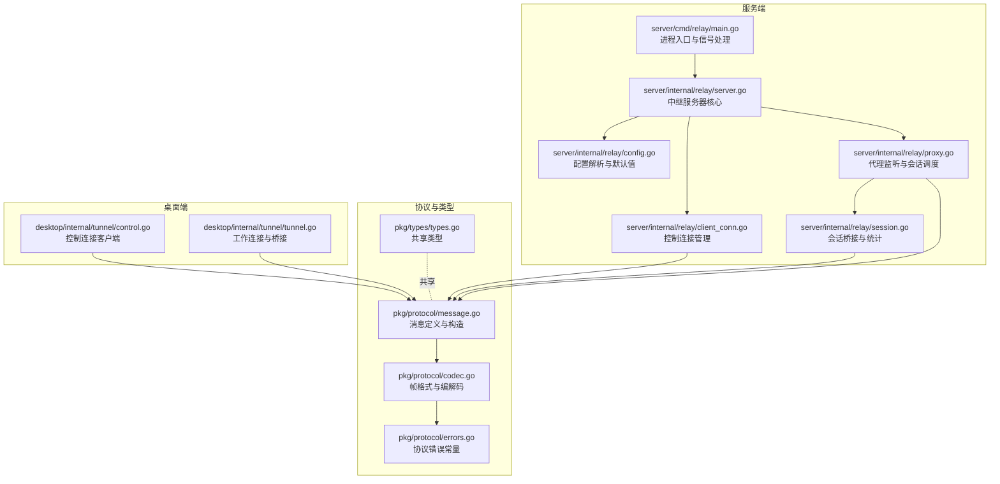
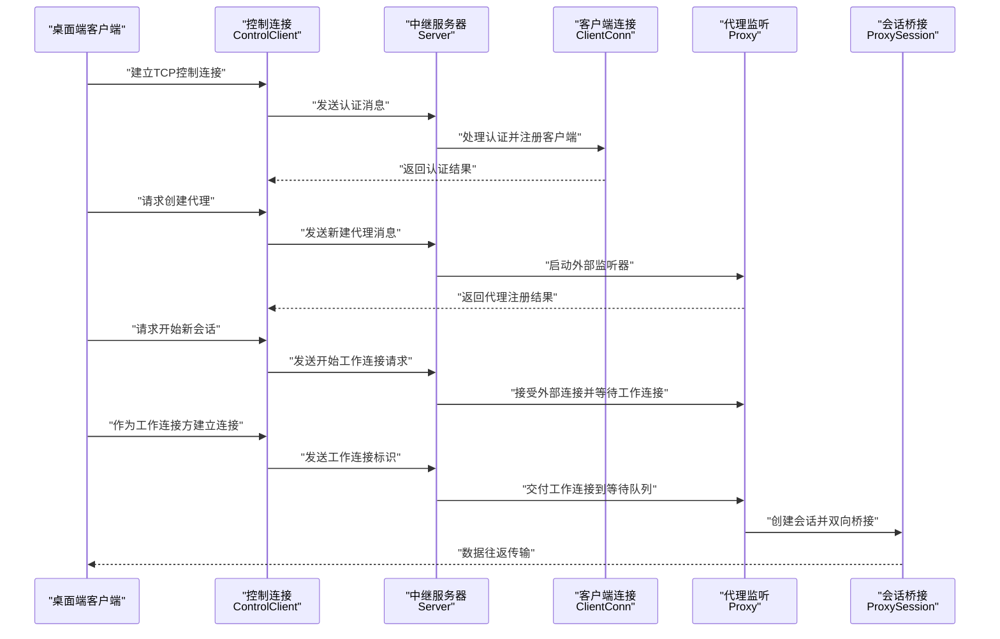
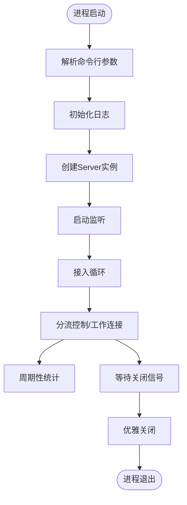
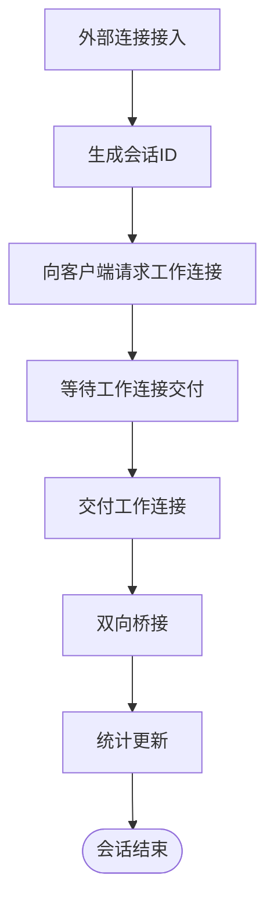
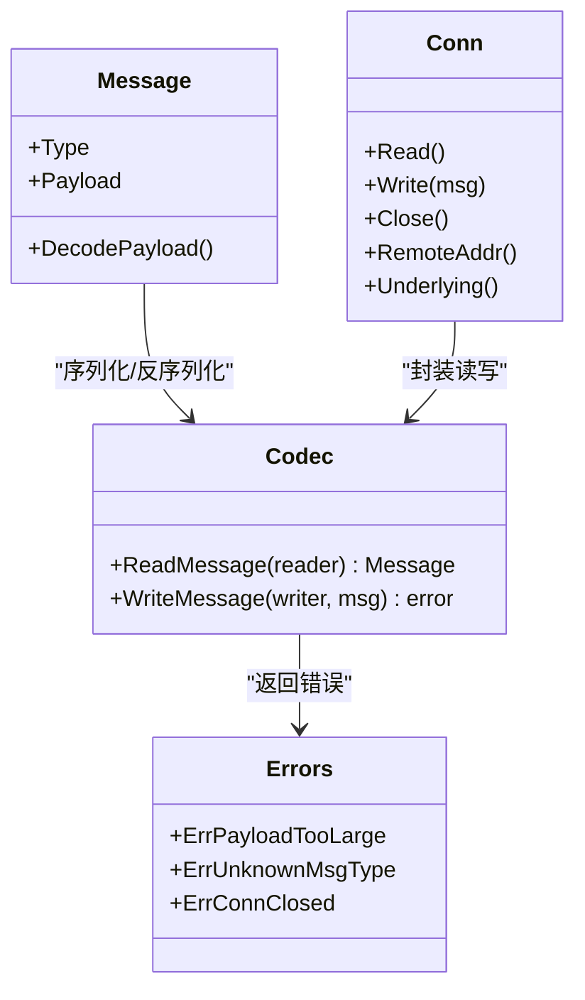
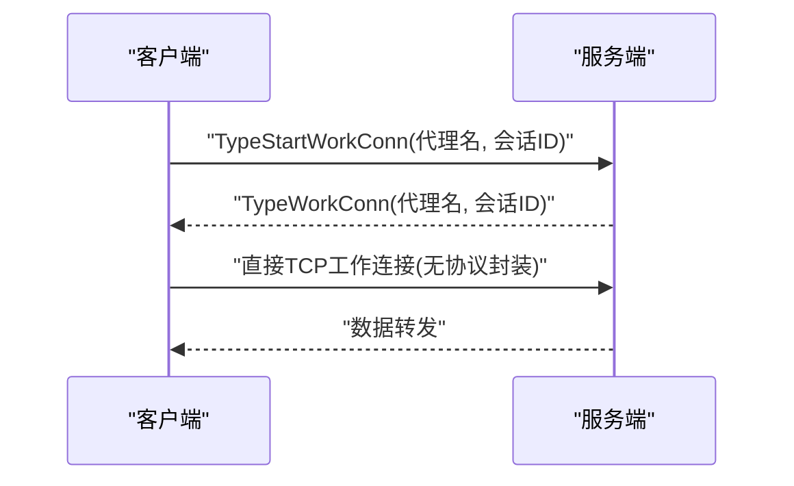
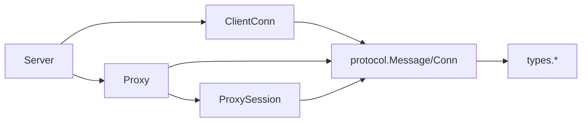

# 服务端架构

<cite>
**本文引用的文件**
- [README.md](file://README.md)
- [server/cmd/relay/main.go](file://server/cmd/relay/main.go)
- [server/internal/relay/server.go](file://server/internal/relay/server.go)
- [server/internal/relay/config.go](file://server/internal/relay/config.go)
- [server/internal/relay/client_conn.go](file://server/internal/relay/client_conn.go)
- [server/internal/relay/proxy.go](file://server/internal/relay/proxy.go)
- [server/internal/relay/session.go](file://server/internal/relay/session.go)
- [pkg/protocol/message.go](file://pkg/protocol/message.go)
- [pkg/protocol/codec.go](file://pkg/protocol/codec.go)
- [pkg/protocol/errors.go](file://pkg/protocol/errors.go)
- [pkg/types/types.go](file://pkg/types/types.go)
- [desktop/internal/tunnel/control.go](file://desktop/internal/tunnel/control.go)
- [desktop/internal/tunnel/tunnel.go](file://desktop/internal/tunnel/tunnel.go)
- [docker-compose.yml](file://docker-compose.yml)
- [server/go.mod](file://server/go.mod)
- [desktop/go.mod](file://desktop/go.mod)
</cite>

## 目录
1. [简介](#简介)
2. [项目结构](#项目结构)
3. [核心组件](#核心组件)
4. [架构总览](#架构总览)
5. [详细组件分析](#详细组件分析)
6. [依赖关系分析](#依赖关系分析)
7. [性能考量](#性能考量)
8. [故障排除指南](#故障排除指南)
9. [结论](#结论)
10. [附录](#附录)

## 简介
本文件面向系统管理员与开发者，全面阐述 NexTunnel 服务端的架构与实现细节，覆盖以下主题：
- 中继服务器启动流程与运行时生命周期
- 会话管理机制与连接池策略
- 协议设计：控制通道协议、数据传输协议与消息编解码
- 加密与安全机制现状与建议
- 配置项、性能优化参数与监控指标
- 部署指南、运维最佳实践与故障排除
- 与桌面端客户端的通信协议与数据交换格式

## 项目结构
服务端采用模块化分层设计，核心位于 server/internal/relay，协议与共享类型位于 pkg 子模块，桌面端客户端位于 desktop 子目录。

图表来源
- [server/cmd/relay/main.go:1-81](file://server/cmd/relay/main.go#L1-L81)
- [server/internal/relay/server.go:1-306](file://server/internal/relay/server.go#L1-L306)
- [server/internal/relay/config.go:1-38](file://server/internal/relay/config.go#L1-L38)
- [server/internal/relay/client_conn.go:1-216](file://server/internal/relay/client_conn.go#L1-L216)
- [server/internal/relay/proxy.go:1-180](file://server/internal/relay/proxy.go#L1-L180)
- [server/internal/relay/session.go:1-79](file://server/internal/relay/session.go#L1-L79)
- [pkg/protocol/message.go:1-203](file://pkg/protocol/message.go#L1-L203)
- [pkg/protocol/codec.go:1-131](file://pkg/protocol/codec.go#L1-L131)
- [pkg/protocol/errors.go:1-15](file://pkg/protocol/errors.go#L1-L15)
- [pkg/types/types.go:1-50](file://pkg/types/types.go#L1-L50)
- [desktop/internal/tunnel/control.go:1-155](file://desktop/internal/tunnel/control.go#L1-L155)
- [desktop/internal/tunnel/tunnel.go:1-138](file://desktop/internal/tunnel/tunnel.go#L1-L138)

章节来源
- [README.md:1-20](file://README.md#L1-L20)
- [server/go.mod:1-11](file://server/go.mod#L1-L11)
- [desktop/go.mod:1-49](file://desktop/go.mod#L1-L49)

## 核心组件
- 服务器入口与生命周期
  - 进程入口负责解析命令行参数、初始化日志、创建并启动 Server 实例，支持周期性统计日志与优雅关闭。
  - 关键路径：[server/cmd/relay/main.go:15-81](file://server/cmd/relay/main.go#L15-L81)
- 服务器核心
  - 负责控制通道监听、接入连接分流、客户端注册与代理注册/注销、全局统计聚合。
  - 关键路径：[server/internal/relay/server.go:44-306](file://server/internal/relay/server.go#L44-L306)
- 客户端连接管理
  - 处理认证、心跳超时、代理创建/关闭、向客户端发送工作连接请求。
  - 关键路径：[server/internal/relay/client_conn.go:46-216](file://server/internal/relay/client_conn.go#L46-L216)
- 代理与会话
  - 外部监听器、会话等待队列、工作连接交付、双向桥接与统计上报。
  - 关键路径：[server/internal/relay/proxy.go:47-180](file://server/internal/relay/proxy.go#L47-L180)、[server/internal/relay/session.go:39-79](file://server/internal/relay/session.go#L39-L79)
- 协议与编解码
  - 消息类型、负载结构、JSON 编解码、帧头格式与并发安全封装。
  - 关键路径：[pkg/protocol/message.go:1-203](file://pkg/protocol/message.go#L1-L203)、[pkg/protocol/codec.go:16-131](file://pkg/protocol/codec.go#L16-L131)
- 类型与状态
  - 代理类型、状态、隧道配置与运行时信息等共享类型。
  - 关键路径：[pkg/types/types.go:1-50](file://pkg/types/types.go#L1-L50)

章节来源
- [server/cmd/relay/main.go:15-81](file://server/cmd/relay/main.go#L15-L81)
- [server/internal/relay/server.go:44-306](file://server/internal/relay/server.go#L44-L306)
- [server/internal/relay/client_conn.go:46-216](file://server/internal/relay/client_conn.go#L46-L216)
- [server/internal/relay/proxy.go:47-180](file://server/internal/relay/proxy.go#L47-L180)
- [server/internal/relay/session.go:39-79](file://server/internal/relay/session.go#L39-L79)
- [pkg/protocol/message.go:1-203](file://pkg/protocol/message.go#L1-L203)
- [pkg/protocol/codec.go:16-131](file://pkg/protocol/codec.go#L16-L131)
- [pkg/types/types.go:1-50](file://pkg/types/types.go#L1-L50)

## 架构总览
下图展示从客户端到服务端的完整交互链路，包括控制通道认证、代理注册、工作连接建立与数据桥接。

图表来源
- [desktop/internal/tunnel/control.go:40-95](file://desktop/internal/tunnel/control.go#L40-L95)
- [server/internal/relay/server.go:84-195](file://server/internal/relay/server.go#L84-L195)
- [server/internal/relay/client_conn.go:84-129](file://server/internal/relay/client_conn.go#L84-L129)
- [server/internal/relay/proxy.go:68-118](file://server/internal/relay/proxy.go#L68-L118)
- [server/internal/relay/session.go:41-79](file://server/internal/relay/session.go#L41-L79)

## 详细组件分析

### 启动流程与生命周期
- 命令行参数解析与默认配置
  - 默认绑定地址、控制端口、心跳超时、每客户端最大代理数、工作连接超时。
  - 参考：[server/internal/relay/config.go:17-37](file://server/internal/relay/config.go#L17-L37)
- 进程入口
  - 初始化日志、创建 Server、Run 启动监听、周期性统计、信号处理与优雅关闭。
  - 参考：[server/cmd/relay/main.go:15-81](file://server/cmd/relay/main.go#L15-L81)
- 服务器运行时
  - 控制监听器、接入循环、客户端与代理映射、统计聚合、优雅关闭。
  - 参考：[server/internal/relay/server.go:44-251](file://server/internal/relay/server.go#L44-L251)

图表来源
- [server/cmd/relay/main.go:15-81](file://server/cmd/relay/main.go#L15-L81)
- [server/internal/relay/server.go:44-251](file://server/internal/relay/server.go#L44-L251)

章节来源
- [server/cmd/relay/main.go:15-81](file://server/cmd/relay/main.go#L15-L81)
- [server/internal/relay/config.go:17-37](file://server/internal/relay/config.go#L17-L37)
- [server/internal/relay/server.go:44-251](file://server/internal/relay/server.go#L44-L251)

### 会话管理机制
- 外部连接接入
  - 代理监听器接受外部连接，生成会话ID，向客户端请求工作连接，并等待匹配。
  - 参考：[server/internal/relay/proxy.go:68-100](file://server/internal/relay/proxy.go#L68-L100)
- 工作连接交付
  - 服务端在收到工作连接后，从等待队列取出对应会话并启动桥接。
  - 参考：[server/internal/relay/proxy.go:120-141](file://server/internal/relay/proxy.go#L120-L141)
- 会话桥接
  - 双向 io.Copy 并发桥接，原子统计字节计数，完成后回调更新代理统计。
  - 参考：[server/internal/relay/session.go:41-79](file://server/internal/relay/session.go#L41-L79)

图表来源
- [server/internal/relay/proxy.go:68-118](file://server/internal/relay/proxy.go#L68-L118)
- [server/internal/relay/session.go:41-79](file://server/internal/relay/session.go#L41-L79)

章节来源
- [server/internal/relay/proxy.go:68-141](file://server/internal/relay/proxy.go#L68-L141)
- [server/internal/relay/session.go:41-79](file://server/internal/relay/session.go#L41-L79)

### 连接池管理策略
- 代理监听器
  - 每个代理一个外部监听器，按需创建；停止时关闭监听器并清理等待队列。
  - 参考：[server/internal/relay/proxy.go:47-61](file://server/internal/relay/proxy.go#L47-L61)、[server/internal/relay/proxy.go:149-167](file://server/internal/relay/proxy.go#L149-L167)
- 等待队列
  - 使用 map[会话ID]chan io.ReadWriteCloser 维护等待中的工作连接，单通道容量为1，避免堆积。
  - 参考：[server/internal/relay/proxy.go:23-44](file://server/internal/relay/proxy.go#L23-L44)、[server/internal/relay/proxy.go:84-88](file://server/internal/relay/proxy.go#L84-L88)
- 会话桥接
  - 使用 WaitGroup 与原子计数保证桥接完成后的统计一致性。
  - 参考：[server/internal/relay/session.go:41-79](file://server/internal/relay/session.go#L41-L79)

章节来源
- [server/internal/relay/proxy.go:23-44](file://server/internal/relay/proxy.go#L23-L44)
- [server/internal/relay/proxy.go:47-61](file://server/internal/relay/proxy.go#L47-L61)
- [server/internal/relay/proxy.go:84-88](file://server/internal/relay/proxy.go#L84-L88)
- [server/internal/relay/proxy.go:149-167](file://server/internal/relay/proxy.go#L149-L167)
- [server/internal/relay/session.go:41-79](file://server/internal/relay/session.go#L41-L79)

### 协议设计与消息编解码
- 消息类型与版本
  - 定义认证、代理、心跳、工作连接等消息类型与协议版本，用于兼容性校验。
  - 参考：[pkg/protocol/message.go:9-22](file://pkg/protocol/message.go#L9-L22)
- 消息负载结构
  - 认证、新建代理、关闭代理、心跳、工作连接等负载结构，使用 JSON 序列化。
  - 参考：[pkg/protocol/message.go:32-153](file://pkg/protocol/message.go#L32-L153)
- 编解码帧格式
  - 帧头包含1字节类型+4字节长度，payload 最大 16MB，读写线程安全。
  - 参考：[pkg/protocol/codec.go:10-15](file://pkg/protocol/codec.go#L10-L15)、[pkg/protocol/codec.go:16-63](file://pkg/protocol/codec.go#L16-L63)
- 错误处理
  - 超长载荷、未知消息类型、连接已关闭等错误常量。
  - 参考：[pkg/protocol/errors.go:5-14](file://pkg/protocol/errors.go#L5-L14)

图表来源
- [pkg/protocol/message.go:24-194](file://pkg/protocol/message.go#L24-L194)
- [pkg/protocol/codec.go:65-131](file://pkg/protocol/codec.go#L65-L131)
- [pkg/protocol/errors.go:5-14](file://pkg/protocol/errors.go#L5-L14)

章节来源
- [pkg/protocol/message.go:9-203](file://pkg/protocol/message.go#L9-L203)
- [pkg/protocol/codec.go:16-131](file://pkg/protocol/codec.go#L16-L131)
- [pkg/protocol/errors.go:5-14](file://pkg/protocol/errors.go#L5-L14)

### 与桌面端客户端的通信协议
- 控制通道
  - 客户端发起 TCP 连接，发送认证消息，服务端验证通过后注册客户端；后续进行代理创建/关闭与心跳。
  - 参考：[desktop/internal/tunnel/control.go:40-95](file://desktop/internal/tunnel/control.go#L40-L95)、[server/internal/relay/server.go:105-155](file://server/internal/relay/server.go#L105-L155)
- 工作连接
  - 服务端接受外部连接后，向客户端发送“开始工作连接”请求；客户端随后以工作连接身份与服务端握手并建立到本地服务的桥接。
  - 参考：[server/internal/relay/proxy.go:84-99](file://server/internal/relay/proxy.go#L84-L99)、[desktop/internal/tunnel/tunnel.go:47-85](file://desktop/internal/tunnel/tunnel.go#L47-L85)

图表来源
- [server/internal/relay/proxy.go:90-99](file://server/internal/relay/proxy.go#L90-L99)
- [desktop/internal/tunnel/tunnel.go:47-85](file://desktop/internal/tunnel/tunnel.go#L47-L85)

章节来源
- [desktop/internal/tunnel/control.go:40-95](file://desktop/internal/tunnel/control.go#L40-L95)
- [desktop/internal/tunnel/tunnel.go:47-85](file://desktop/internal/tunnel/tunnel.go#L47-L85)
- [server/internal/relay/proxy.go:84-99](file://server/internal/relay/proxy.go#L84-L99)

### 加密与安全机制
- 当前实现
  - 控制通道与工作连接均未内置 TLS/加密，仅通过协议帧与负载结构进行消息编解码。
  - 参考：[pkg/protocol/codec.go:16-63](file://pkg/protocol/codec.go#L16-L63)、[pkg/protocol/message.go:165-194](file://pkg/protocol/message.go#L165-L194)
- 安全建议
  - 在网络边界部署 TLS 终止（如反向代理或专用网关），确保控制与数据通道加密。
  - 对认证与心跳消息增加签名/时间戳校验，防止重放攻击。
  - 限制客户端能力（速率、并发、代理数量）以降低滥用风险。

章节来源
- [pkg/protocol/codec.go:16-63](file://pkg/protocol/codec.go#L16-L63)
- [pkg/protocol/message.go:165-194](file://pkg/protocol/message.go#L165-L194)

## 依赖关系分析
- 模块依赖
  - 服务端依赖 pkg 子模块提供的协议与共享类型；桌面端同样依赖 pkg。
  - 参考：[server/go.mod:5-11](file://server/go.mod#L5-L11)、[desktop/go.mod:5-13](file://desktop/go.mod#L5-L13)
- 组件耦合
  - Server 与 ClientConn、Proxy、Session 之间通过接口与上下文解耦；Proxy 与 ClientConn 通过共享上下文取消传播。
  - 参考：[server/internal/relay/server.go:31-41](file://server/internal/relay/server.go#L31-L41)、[server/internal/relay/proxy.go:34-44](file://server/internal/relay/proxy.go#L34-L44)

图表来源
- [server/internal/relay/server.go:13-41](file://server/internal/relay/server.go#L13-L41)
- [server/internal/relay/client_conn.go:14-43](file://server/internal/relay/client_conn.go#L14-L43)
- [server/internal/relay/proxy.go:16-44](file://server/internal/relay/proxy.go#L16-L44)
- [server/internal/relay/session.go:19-37](file://server/internal/relay/session.go#L19-L37)
- [pkg/protocol/message.go:24-28](file://pkg/protocol/message.go#L24-L28)
- [pkg/types/types.go:33-42](file://pkg/types/types.go#L33-L42)

章节来源
- [server/go.mod:5-11](file://server/go.mod#L5-L11)
- [desktop/go.mod:5-13](file://desktop/go.mod#L5-L13)
- [server/internal/relay/server.go:13-41](file://server/internal/relay/server.go#L13-L41)
- [server/internal/relay/client_conn.go:14-43](file://server/internal/relay/client_conn.go#L14-L43)
- [server/internal/relay/proxy.go:16-44](file://server/internal/relay/proxy.go#L16-L44)
- [server/internal/relay/session.go:19-37](file://server/internal/relay/session.go#L19-L37)
- [pkg/protocol/message.go:24-28](file://pkg/protocol/message.go#L24-L28)
- [pkg/types/types.go:33-42](file://pkg/types/types.go#L33-L42)

## 性能考量
- 并发与锁
  - 控制通道与代理注册使用读写锁分离读写竞争；代理等待队列使用互斥锁保护并发访问。
  - 参考：[server/internal/relay/server.go:20-28](file://server/internal/relay/server.go#L20-L28)、[server/internal/relay/client_conn.go:21-28](file://server/internal/relay/client_conn.go#L21-L28)、[server/internal/relay/proxy.go:23-32](file://server/internal/relay/proxy.go#L23-L32)
- I/O 模式
  - 使用 io.Copy 并发双向转发，WaitGroup 等待完成，减少 goroutine 泄漏风险。
  - 参考：[server/internal/relay/session.go:55-71](file://server/internal/relay/session.go#L55-L71)
- 资源释放
  - 优雅关闭时关闭所有客户端连接与代理监听器，清理等待队列，避免资源泄露。
  - 参考：[server/internal/relay/server.go:217-251](file://server/internal/relay/server.go#L217-L251)、[server/internal/relay/proxy.go:149-167](file://server/internal/relay/proxy.go#L149-L167)
- 配置调优
  - 心跳超时、每客户端最大代理数、工作连接超时、统计间隔等参数可按业务规模调整。
  - 参考：[server/internal/relay/config.go:17-37](file://server/internal/relay/config.go#L17-L37)、[server/cmd/relay/main.go:18-19](file://server/cmd/relay/main.go#L18-L19)

章节来源
- [server/internal/relay/server.go:20-28](file://server/internal/relay/server.go#L20-L28)
- [server/internal/relay/client_conn.go:21-28](file://server/internal/relay/client_conn.go#L21-L28)
- [server/internal/relay/proxy.go:23-32](file://server/internal/relay/proxy.go#L23-L32)
- [server/internal/relay/session.go:55-71](file://server/internal/relay/session.go#L55-L71)
- [server/internal/relay/server.go:217-251](file://server/internal/relay/server.go#L217-L251)
- [server/internal/relay/proxy.go:149-167](file://server/internal/relay/proxy.go#L149-L167)
- [server/internal/relay/config.go:17-37](file://server/internal/relay/config.go#L17-L37)
- [server/cmd/relay/main.go:18-19](file://server/cmd/relay/main.go#L18-L19)

## 故障排除指南
- 认证失败
  - 检查客户端 ID 是否为空、是否重复连接、协议版本是否匹配。
  - 参考：[server/internal/relay/server.go:114-138](file://server/internal/relay/server.go#L114-L138)
- 代理创建失败
  - 检查监听端口占用、每客户端代理上限、代理名称冲突。
  - 参考：[server/internal/relay/client_conn.go:92-129](file://server/internal/relay/client_conn.go#L92-L129)
- 工作连接交付失败
  - 检查会话是否过期、等待队列是否被清理、工作连接是否及时到达。
  - 参考：[server/internal/relay/proxy.go:120-141](file://server/internal/relay/proxy.go#L120-L141)
- 心跳超时断连
  - 调整心跳超时参数，检查网络稳定性与客户端存活状态。
  - 参考：[server/internal/relay/client_conn.go:172-181](file://server/internal/relay/client_conn.go#L172-L181)
- 协议错误
  - 超长载荷、未知消息类型、连接已关闭等错误，定位具体环节并修复。
  - 参考：[pkg/protocol/errors.go:5-14](file://pkg/protocol/errors.go#L5-L14)

章节来源
- [server/internal/relay/server.go:114-138](file://server/internal/relay/server.go#L114-L138)
- [server/internal/relay/client_conn.go:92-129](file://server/internal/relay/client_conn.go#L92-L129)
- [server/internal/relay/proxy.go:120-141](file://server/internal/relay/proxy.go#L120-L141)
- [server/internal/relay/client_conn.go:172-181](file://server/internal/relay/client_conn.go#L172-L181)
- [pkg/protocol/errors.go:5-14](file://pkg/protocol/errors.go#L5-L14)

## 结论
NexTunnel 服务端采用简洁高效的事件驱动模型，通过控制通道与工作连接的分工协作，实现了稳定的内网穿透中继能力。协议层以 JSON 负载与自定义帧格式为基础，具备良好的扩展性。当前实现未内置加密，建议在网络边界或前置网关处启用 TLS 以满足生产环境的安全要求。通过合理的配置与监控，可在高并发场景下保持稳定与可观测性。

## 附录

### 服务器配置选项
- 绑定地址：服务端监听的 IP 地址
- 控制端口：控制通道监听端口
- 心跳超时：控制连接空闲超时时间
- 每客户端最大代理数：限制单客户端可创建的代理数量
- 工作连接超时：等待工作连接到达的最长等待时间
- 统计间隔：周期性输出统计日志的时间间隔

参考路径
- [server/internal/relay/config.go:17-37](file://server/internal/relay/config.go#L17-L37)
- [server/cmd/relay/main.go:18-19](file://server/cmd/relay/main.go#L18-L19)

### 监控指标
- 客户端数量、代理数量、累计会话数、入站/出站字节数
- 参考路径：[server/internal/relay/server.go:272-305](file://server/internal/relay/server.go#L272-L305)、[server/internal/relay/proxy.go:176-179](file://server/internal/relay/proxy.go#L176-L179)

### 部署指南
- 使用 docker-compose 启动中继服务，映射控制端口并设置统计间隔。
- 参考路径：[docker-compose.yml:1-12](file://docker-compose.yml#L1-L12)

章节来源
- [server/internal/relay/config.go:17-37](file://server/internal/relay/config.go#L17-L37)
- [server/cmd/relay/main.go:18-19](file://server/cmd/relay/main.go#L18-L19)
- [server/internal/relay/server.go:272-305](file://server/internal/relay/server.go#L272-L305)
- [server/internal/relay/proxy.go:176-179](file://server/internal/relay/proxy.go#L176-L179)
- [docker-compose.yml:1-12](file://docker-compose.yml#L1-L12)