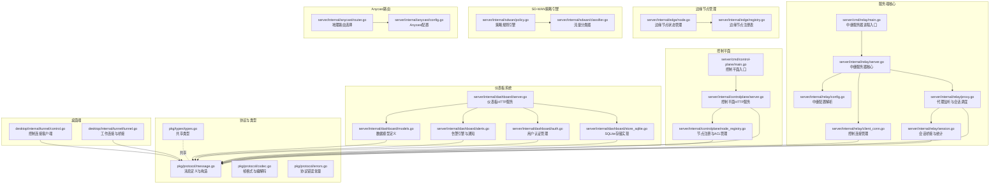
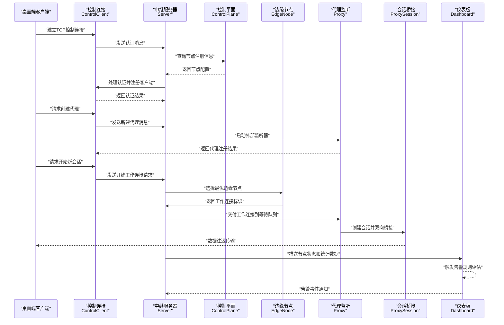
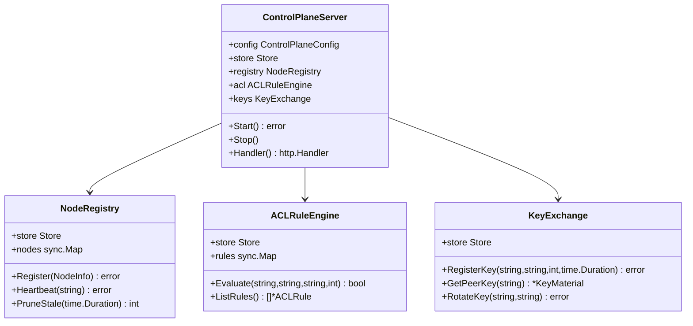
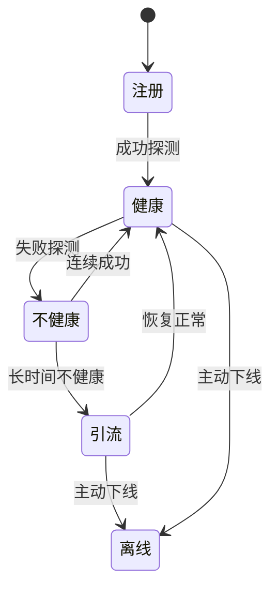
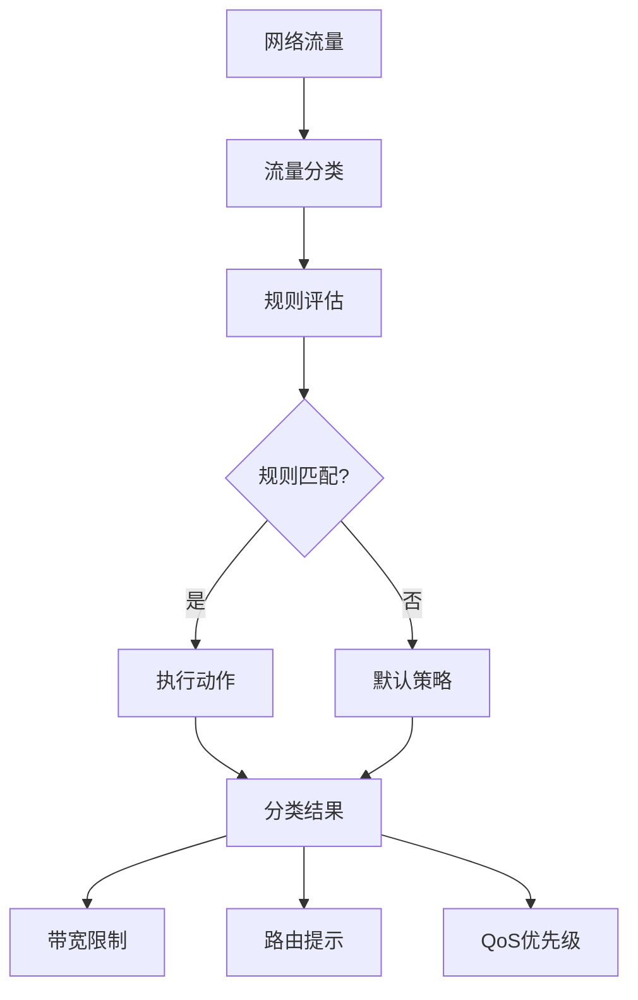
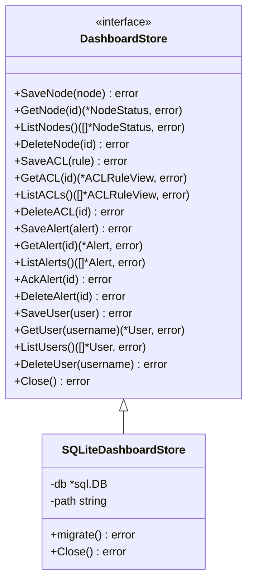
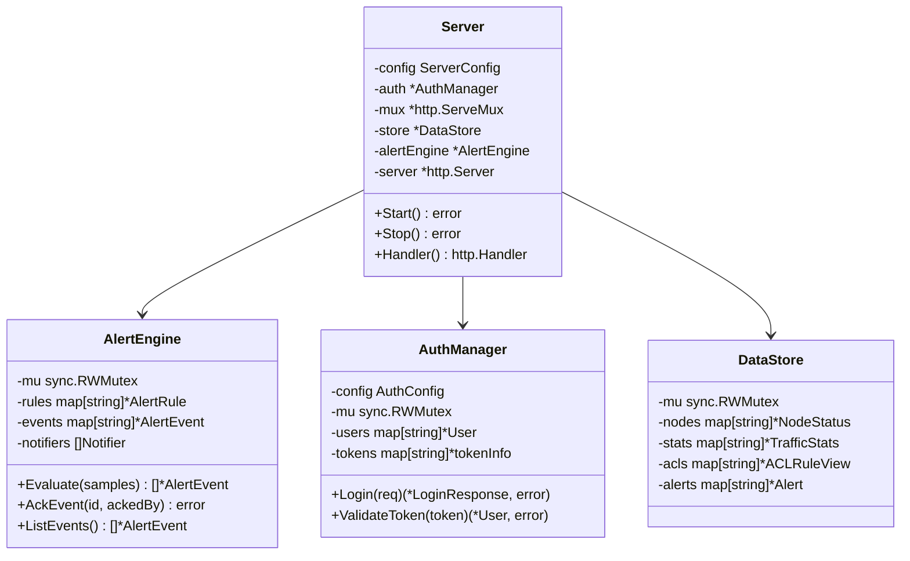
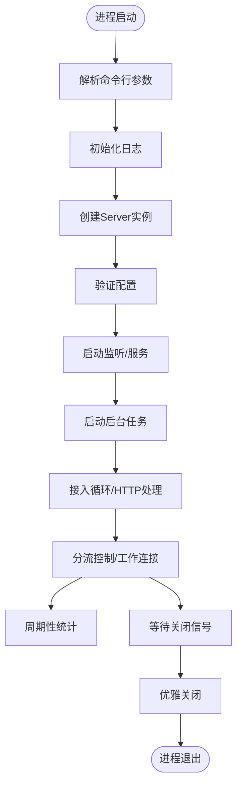
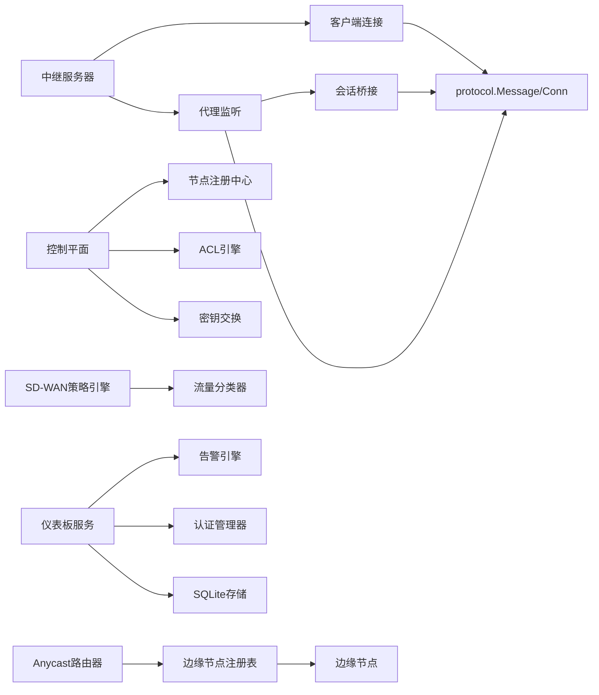

# 服务端架构

<cite>
**本文引用的文件**
- [README.md](file://README.md)
- [server/cmd/relay/main.go](file://server/cmd/relay/main.go)
- [server/cmd/control-plane/main.go](file://server/cmd/control-plane/main.go)
- [server/internal/relay/server.go](file://server/internal/relay/server.go)
- [server/internal/relay/config.go](file://server/internal/relay/config.go)
- [server/internal/relay/client_conn.go](file://server/internal/relay/client_conn.go)
- [server/internal/relay/proxy.go](file://server/internal/relay/proxy.go)
- [server/internal/relay/session.go](file://server/internal/relay/session.go)
- [server/internal/controlplane/server.go](file://server/internal/controlplane/server.go)
- [server/internal/controlplane/node_registry.go](file://server/internal/controlplane/node_registry.go)
- [server/internal/edge/node.go](file://server/internal/edge/node.go)
- [server/internal/edge/registry.go](file://server/internal/edge/registry.go)
- [server/internal/sdwan/policy.go](file://server/internal/sdwan/policy.go)
- [server/internal/sdwan/classifier.go](file://server/internal/sdwan/classifier.go)
- [server/internal/anycast/router.go](file://server/internal/anycast/router.go)
- [server/internal/anycast/config.go](file://server/internal/anycast/config.go)
- [server/internal/dashboard/server.go](file://server/internal/dashboard/server.go)
- [server/internal/dashboard/models.go](file://server/internal/dashboard/models.go)
- [server/internal/dashboard/alerts.go](file://server/internal/dashboard/alerts.go)
- [server/internal/dashboard/auth.go](file://server/internal/dashboard/auth.go)
- [server/internal/dashboard/store_sqlite.go](file://server/internal/dashboard/store_sqlite.go)
- [server/internal/dashboard/doc.go](file://server/internal/dashboard/doc.go)
- [pkg/protocol/message.go](file://pkg/protocol/message.go)
- [pkg/protocol/codec.go](file://pkg/protocol/codec.go)
- [pkg/protocol/errors.go](file://pkg/protocol/errors.go)
- [pkg/types/types.go](file://pkg/types/types.go)
- [desktop/internal/tunnel/control.go](file://desktop/internal/tunnel/control.go)
- [desktop/internal/tunnel/tunnel.go](file://desktop/internal/tunnel/tunnel.go)
- [docker-compose.yml](file://docker-compose.yml)
- [server/Dockerfile](file://server/Dockerfile)
- [server/go.mod](file://server/go.mod)
- [desktop/go.mod](file://desktop/go.mod)
</cite>

## 更新摘要
**所做更改**
- 新增仪表板存储实现章节，详细介绍SQLite仪表板存储的架构和功能
- 更新Dockerfile构建配置说明，反映改进的多阶段构建流程
- 新增仪表板组件的详细API规范和数据模型说明
- 扩展监控和告警系统的架构描述

## 目录
1. [简介](#简介)
2. [项目结构](#项目结构)
3. [核心组件](#核心组件)
4. [架构总览](#架构总览)
5. [详细组件分析](#详细组件分析)
6. [依赖关系分析](#依赖关系分析)
7. [性能考量](#性能考量)
8. [故障排除指南](#故障排除指南)
9. [结论](#结论)
10. [附录](#附录)

## 简介
本文件面向系统管理员与开发者，全面阐述 NexTunnel 服务端的架构与实现细节，覆盖以下主题：
- 中继服务器启动流程与运行时生命周期
- 控制平面、边缘节点、SD-WAN等新组件的集群管理与高可用部署
- 会话管理机制与连接池策略
- 协议设计：控制通道协议、数据传输协议与消息编解码
- 加密与安全机制现状与建议
- 配置项、性能优化参数与监控指标
- 部署指南、运维最佳实践与故障排除
- 与桌面端客户端的通信协议与数据交换格式
- **新增**：仪表板存储实现与监控告警系统

## 项目结构
服务端采用模块化分层设计，核心位于 server/internal/relay，新增的控制平面、边缘节点管理、SD-WAN组件和仪表板位于 server/internal 下的相应子目录，协议与共享类型位于 pkg 子模块，桌面端客户端位于 desktop 子目录。

**图表来源**
- [server/cmd/relay/main.go:1-81](file://server/cmd/relay/main.go#L1-L81)
- [server/cmd/control-plane/main.go:1-46](file://server/cmd/control-plane/main.go#L1-L46)
- [server/internal/relay/server.go:1-306](file://server/internal/relay/server.go#L1-L306)
- [server/internal/relay/config.go:1-38](file://server/internal/relay/config.go#L1-L38)
- [server/internal/relay/client_conn.go:1-216](file://server/internal/relay/client_conn.go#L1-L216)
- [server/internal/relay/proxy.go:1-180](file://server/internal/relay/proxy.go#L1-L180)
- [server/internal/relay/session.go:1-79](file://server/internal/relay/session.go#L1-L79)
- [server/internal/controlplane/server.go:1-283](file://server/internal/controlplane/server.go#L1-L283)
- [server/internal/controlplane/node_registry.go:1-263](file://server/internal/controlplane/node_registry.go#L1-L263)
- [server/internal/edge/node.go:1-118](file://server/internal/edge/node.go#L1-L118)
- [server/internal/edge/registry.go:1-171](file://server/internal/edge/registry.go#L1-L171)
- [server/internal/sdwan/policy.go:1-186](file://server/internal/sdwan/policy.go#L1-L186)
- [server/internal/sdwan/classifier.go:1-72](file://server/internal/sdwan/classifier.go#L1-L72)
- [server/internal/anycast/router.go:1-290](file://server/internal/anycast/router.go#L1-L290)
- [server/internal/anycast/config.go:1-54](file://server/internal/anycast/config.go#L1-L54)
- [server/internal/dashboard/server.go:1-451](file://server/internal/dashboard/server.go#L1-L451)
- [server/internal/dashboard/models.go:1-78](file://server/internal/dashboard/models.go#L1-L78)
- [server/internal/dashboard/alerts.go:1-371](file://server/internal/dashboard/alerts.go#L1-L371)
- [server/internal/dashboard/auth.go:1-210](file://server/internal/dashboard/auth.go#L1-L210)
- [server/internal/dashboard/store_sqlite.go:1-383](file://server/internal/dashboard/store_sqlite.go#L1-L383)
- [pkg/protocol/message.go:1-203](file://pkg/protocol/message.go#L1-L203)
- [pkg/protocol/codec.go:1-131](file://pkg/protocol/codec.go#L1-L131)
- [pkg/protocol/errors.go:1-15](file://pkg/protocol/errors.go#L1-L15)
- [pkg/types/types.go:1-50](file://pkg/types/types.go#L1-L50)
- [desktop/internal/tunnel/control.go:1-155](file://desktop/internal/tunnel/control.go#L1-L155)
- [desktop/internal/tunnel/tunnel.go:1-138](file://desktop/internal/tunnel/tunnel.go#L1-L138)

**章节来源**
- [README.md:1-20](file://README.md#L1-L20)
- [server/go.mod:1-11](file://server/go.mod#L1-L11)
- [desktop/go.mod:1-49](file://desktop/go.mod#L1-L49)

## 核心组件
- **中继服务器**：负责控制通道监听、接入连接分流、客户端注册与代理注册/注销、全局统计聚合。
- **控制平面**：提供HTTP API用于节点注册、心跳维护、ACL规则管理、密钥交换等功能。
- **边缘节点管理**：管理边缘节点的注册、健康状态跟踪、区域分布和容量管理。
- **SD-WAN策略引擎**：基于应用类型、协议、端口等特征的流量分类和策略执行。
- **Anycast路由**：根据客户端地理位置选择最优边缘节点，支持故障转移和区域路由。
- **仪表板系统**：提供RESTful API的管理控制台，支持节点管理、流量统计、ACL规则、告警通知和用户认证。
- **传统组件**：客户端连接管理、代理与会话、协议与编解码、类型与状态。

**章节来源**
- [server/internal/relay/server.go:44-306](file://server/internal/relay/server.go#L44-L306)
- [server/internal/controlplane/server.go:15-283](file://server/internal/controlplane/server.go#L15-L283)
- [server/internal/edge/node.go:29-118](file://server/internal/edge/node.go#L29-L118)
- [server/internal/sdwan/policy.go:39-186](file://server/internal/sdwan/policy.go#L39-L186)
- [server/internal/anycast/router.go:23-290](file://server/internal/anycast/router.go#L23-L290)
- [server/internal/dashboard/server.go:31-71](file://server/internal/dashboard/server.go#L31-L71)

## 架构总览
下图展示从客户端到服务端的完整交互链路，包括控制通道认证、代理注册、工作连接建立与数据桥接，以及新增的控制平面协调机制和仪表板监控系统。

**图表来源**
- [desktop/internal/tunnel/control.go:40-95](file://desktop/internal/tunnel/control.go#L40-L95)
- [server/internal/relay/server.go:84-195](file://server/internal/relay/server.go#L84-L195)
- [server/internal/controlplane/server.go:129-178](file://server/internal/controlplane/server.go#L129-L178)
- [server/internal/edge/node.go:48-73](file://server/internal/edge/node.go#L48-L73)
- [server/internal/relay/proxy.go:68-118](file://server/internal/relay/proxy.go#L68-L118)
- [server/internal/relay/session.go:41-79](file://server/internal/relay/session.go#L41-L79)
- [server/internal/dashboard/server.go:117-154](file://server/internal/dashboard/server.go#L117-L154)

## 详细组件分析

### 控制平面架构
- **HTTP API服务**：提供节点注册、心跳维护、ACL规则管理、密钥交换等RESTful接口。
- **节点注册中心**：管理边缘节点的生命周期，包括注册、心跳更新、过期清理。
- **ACL规则引擎**：基于优先级的访问控制规则评估，支持源、目标、协议、端口匹配。
- **密钥交换管理**：WireGuard公钥注册、轮换和查询，支持密钥版本管理和过期控制。

**图表来源**
- [server/internal/controlplane/server.go:17-50](file://server/internal/controlplane/server.go#L17-L50)
- [server/internal/controlplane/node_registry.go:10-110](file://server/internal/controlplane/node_registry.go#L10-L110)

**章节来源**
- [server/cmd/control-plane/main.go:14-45](file://server/cmd/control-plane/main.go#L14-L45)
- [server/internal/controlplane/server.go:52-123](file://server/internal/controlplane/server.go#L52-L123)
- [server/internal/controlplane/node_registry.go:25-103](file://server/internal/controlplane/node_registry.go#L25-L103)

### 边缘节点管理系统
- **节点状态管理**：支持健康、不健康、引流、离线四种状态，基于连续成功/失败次数判断。
- **角色与能力**：支持中继、加速器、全功能（中继+加速器）三种节点角色。
- **区域与容量**：记录节点所在区域、最大并发连接数、最后在线时间等元数据。
- **健康探测**：记录连续成功/失败次数、首次不健康时间、延迟测量等指标。

**图表来源**
- [server/internal/edge/node.go:10-46](file://server/internal/edge/node.go#L10-L46)
- [server/internal/edge/node.go:85-97](file://server/internal/edge/node.go#L85-L97)

**章节来源**
- [server/internal/edge/node.go:29-118](file://server/internal/edge/node.go#L29-L118)
- [server/internal/edge/registry.go:35-171](file://server/internal/edge/registry.go#L35-L171)

### SD-WAN策略引擎
- **流量分类**：基于目的端口、源端口、协议类型（TCP/UDP）进行应用类型识别。
- **策略规则**：支持允许、拒绝、限速、路由、优先级等多种动作，可指定应用类型、协议、源节点、目标地址/端口等条件。
- **规则评估**：按规则优先级顺序评估，支持带宽限制、路由提示、QoS优先级设置。
- **默认策略**：未匹配规则时采用默认优先级，支持ActionLimit和ActionRoute动作。

**图表来源**
- [server/internal/sdwan/classifier.go:29-50](file://server/internal/sdwan/classifier.go#L29-L50)
- [server/internal/sdwan/policy.go:127-155](file://server/internal/sdwan/policy.go#L127-L155)

**章节来源**
- [server/internal/sdwan/policy.go:21-186](file://server/internal/sdwan/policy.go#L21-L186)
- [server/internal/sdwan/classifier.go:5-72](file://server/internal/sdwan/classifier.go#L5-L72)

### Anycast路由系统
- **地理路由**：基于经纬度计算哈弗辛距离，选择最近的健康节点。
- **区域路由**：支持按区域选择节点，提高本地化访问质量。
- **故障转移**：支持多节点故障转移，配置失败转移超时和重试次数。
- **缓存机制**：DNS解析结果缓存，配置TTL避免频繁查询。

**图表来源**
- [server/internal/anycast/router.go:63-108](file://server/internal/anycast/router.go#L63-L108)
- [server/internal/anycast/router.go:242-271](file://server/internal/anycast/router.go#L242-L271)

**章节来源**
- [server/internal/anycast/router.go:23-290](file://server/internal/anycast/router.go#L23-L290)
- [server/internal/anycast/config.go:8-54](file://server/internal/anycast/config.go#L8-L54)

### 仪表板存储实现
- **SQLite持久化**：提供完整的仪表板数据持久化存储，支持节点状态、ACL规则、告警事件和用户管理。
- **数据模型**：包含节点表(dash_nodes)、ACL表(dash_acls)、告警表(dash_alerts)、用户表(dash_users)。
- **索引优化**：为告警级别、确认状态、节点区域等关键字段建立索引，提升查询性能。
- **事务支持**：使用SQLite的ACID事务保证数据一致性和完整性。
- **WAL模式**：生产环境使用WAL模式提升并发读写性能。

**图表来源**
- [server/internal/dashboard/store_sqlite.go:11-40](file://server/internal/dashboard/store_sqlite.go#L11-L40)
- [server/internal/dashboard/store_sqlite.go:88-92](file://server/internal/dashboard/store_sqlite.go#L88-L92)

**章节来源**
- [server/internal/dashboard/store_sqlite.go:1-383](file://server/internal/dashboard/store_sqlite.go#L1-L383)
- [server/internal/dashboard/models.go:1-78](file://server/internal/dashboard/models.go#L1-L78)

### 仪表板HTTP服务架构
- **RESTful API**：提供完整的管理控制台API，包括节点管理、流量统计、ACL规则、告警管理和用户认证。
- **认证授权**：基于HMAC签名的令牌系统，支持用户角色管理和权限控制。
- **告警引擎**：支持多种告警条件（节点离线、高延迟、高带宽、节点数量低、错误率、磁盘使用率）。
- **通知渠道**：内置日志通知器和Webhook通知器，支持外部系统集成。
- **数据存储**：支持内存存储和SQLite持久化两种存储方式。

**图表来源**
- [server/internal/dashboard/server.go:31-71](file://server/internal/dashboard/server.go#L31-L71)
- [server/internal/dashboard/alerts.go:138-161](file://server/internal/dashboard/alerts.go#L138-L161)
- [server/internal/dashboard/auth.go:34-70](file://server/internal/dashboard/auth.go#L34-L70)

**章节来源**
- [server/internal/dashboard/server.go:1-451](file://server/internal/dashboard/server.go#L1-L451)
- [server/internal/dashboard/alerts.go:1-371](file://server/internal/dashboard/alerts.go#L1-L371)
- [server/internal/dashboard/auth.go:1-210](file://server/internal/dashboard/auth.go#L1-L210)

### 启动流程与生命周期
- **中继服务器**：命令行参数解析、日志初始化、Server实例创建、监听启动、接入循环、统计定时器、优雅关闭。
- **控制平面**：配置解析、内存存储初始化、Server实例创建、HTTP服务启动、后台任务（节点清理）、信号处理。
- **仪表板服务**：配置验证、认证管理器初始化、HTTP路由注册、CORS中间件配置、服务启动。
- **边缘节点**：节点注册、健康状态跟踪、区域管理、容量控制、回调通知。

**图表来源**
- [server/cmd/relay/main.go:15-81](file://server/cmd/relay/main.go#L15-L81)
- [server/cmd/control-plane/main.go:14-45](file://server/cmd/control-plane/main.go#L14-L45)
- [server/internal/dashboard/server.go:78-97](file://server/internal/dashboard/server.go#L78-L97)

**章节来源**
- [server/cmd/relay/main.go:15-81](file://server/cmd/relay/main.go#L15-L81)
- [server/cmd/control-plane/main.go:14-45](file://server/cmd/control-plane/main.go#L14-L45)
- [server/internal/dashboard/server.go:78-115](file://server/internal/dashboard/server.go#L78-L115)

### 会话管理机制
- **外部连接接入**：代理监听器接受外部连接，生成会话ID，向客户端请求工作连接，并等待匹配。
- **工作连接交付**：服务端在收到工作连接后，从等待队列取出对应会话并启动桥接。
- **会话桥接**：双向 io.Copy 并发桥接，原子统计字节计数，完成后回调更新代理统计。
- **边缘节点集成**：工作连接建立时可选择最优边缘节点，支持故障转移。

**章节来源**
- [server/internal/relay/proxy.go:68-141](file://server/internal/relay/proxy.go#L68-L141)
- [server/internal/relay/session.go:41-79](file://server/internal/relay/session.go#L41-L79)

### 连接池管理策略
- **代理监听器**：每个代理一个外部监听器，按需创建；停止时关闭监听器并清理等待队列。
- **等待队列**：使用 map[会话ID]chan io.ReadWriteCloser 维护等待中的工作连接，单通道容量为1，避免堆积。
- **会话桥接**：使用 WaitGroup 与原子计数保证桥接完成后的统计一致性。
- **边缘节点池**：基于健康状态和延迟的动态节点池管理。

**章节来源**
- [server/internal/relay/proxy.go:23-44](file://server/internal/relay/proxy.go#L23-L44)
- [server/internal/relay/proxy.go:47-61](file://server/internal/relay/proxy.go#L47-L61)
- [server/internal/relay/proxy.go:84-88](file://server/internal/relay/proxy.go#L84-L88)
- [server/internal/relay/proxy.go:149-167](file://server/internal/relay/proxy.go#L149-L167)
- [server/internal/relay/session.go:41-79](file://server/internal/relay/session.go#L41-L79)

### 协议设计与消息编解码
- **消息类型与版本**：定义认证、代理、心跳、工作连接等消息类型与协议版本，用于兼容性校验。
- **消息负载结构**：认证、新建代理、关闭代理、心跳、工作连接等负载结构，使用 JSON 序列化。
- **编解码帧格式**：帧头包含1字节类型+4字节长度，payload 最大 16MB，读写线程安全。
- **错误处理**：超长载荷、未知消息类型、连接已关闭等错误常量。
- **控制平面协议**：HTTP RESTful API，支持Bearer Token认证，JSON格式请求响应。

**章节来源**
- [pkg/protocol/message.go:9-203](file://pkg/protocol/message.go#L9-L203)
- [pkg/protocol/codec.go:16-131](file://pkg/protocol/codec.go#L16-L131)
- [pkg/protocol/errors.go:5-14](file://pkg/protocol/errors.go#L5-L14)

### 与桌面端客户端的通信协议
- **控制通道**：客户端发起 TCP 连接，发送认证消息，服务端验证通过后注册客户端；后续进行代理创建/关闭与心跳。
- **工作连接**：服务端接受外部连接后，向客户端发送"开始工作连接"请求；客户端随后以工作连接身份与服务端握手并建立到本地服务的桥接。
- **控制平面集成**：客户端通过控制平面获取节点配置、密钥信息等，支持动态节点发现和配置更新。

**章节来源**
- [desktop/internal/tunnel/control.go:40-95](file://desktop/internal/tunnel/control.go#L40-L95)
- [desktop/internal/tunnel/tunnel.go:47-85](file://desktop/internal/tunnel/tunnel.go#L47-L85)
- [server/internal/relay/proxy.go:84-99](file://server/internal/relay/proxy.go#L84-L99)

### 加密与安全机制
- **当前实现**：控制通道与工作连接均未内置 TLS/加密，仅通过协议帧与负载结构进行消息编解码。
- **控制平面安全**：提供可选的Bearer Token认证，保护HTTP API访问。
- **仪表板安全**：基于bcrypt的密码哈希存储，HMAC签名令牌系统，支持用户角色管理。
- **密钥管理**：支持WireGuard公钥注册、轮换和查询，密钥版本管理和过期控制。
- **安全建议**：在网络边界部署TLS终止（如反向代理或专用网关），确保控制与数据通道加密。

**章节来源**
- [pkg/protocol/codec.go:16-63](file://pkg/protocol/codec.go#L16-L63)
- [server/internal/controlplane/server.go:108-123](file://server/internal/controlplane/server.go#L108-L123)
- [server/internal/controlplane/node_registry.go:220-239](file://server/internal/controlplane/node_registry.go#L220-L239)
- [server/internal/dashboard/auth.go:72-102](file://server/internal/dashboard/auth.go#L72-L102)

## 依赖关系分析
- **模块依赖**：服务端依赖 pkg 子模块提供的协议与共享类型；桌面端同样依赖 pkg。
- **组件耦合**：Server 与 ClientConn、Proxy、Session 之间通过接口与上下文解耦；Proxy 与 ClientConn 通过共享上下文取消传播。
- **新增依赖**：控制平面依赖节点注册中心、ACL引擎、密钥交换；边缘节点管理依赖注册表；SD-WAN依赖分类器和策略引擎；仪表板依赖存储接口和认证管理器。

**图表来源**
- [server/internal/relay/server.go:13-41](file://server/internal/relay/server.go#L13-L41)
- [server/internal/controlplane/server.go:17-50](file://server/internal/controlplane/server.go#L17-L50)
- [server/internal/edge/registry.go:9-16](file://server/internal/edge/registry.go#L9-L16)
- [server/internal/sdwan/policy.go:39-46](file://server/internal/sdwan/policy.go#L39-L46)
- [server/internal/anycast/router.go:23-28](file://server/internal/anycast/router.go#L23-L28)
- [server/internal/dashboard/server.go:31-71](file://server/internal/dashboard/server.go#L31-L71)

**章节来源**
- [server/go.mod:5-11](file://server/go.mod#L5-L11)
- [desktop/go.mod:5-13](file://desktop/go.mod#L5-L13)
- [server/internal/relay/server.go:13-41](file://server/internal/relay/server.go#L13-L41)
- [server/internal/controlplane/server.go:17-50](file://server/internal/controlplane/server.go#L17-L50)

## 性能考量
- **并发与锁**：控制通道与代理注册使用读写锁分离读写竞争；代理等待队列使用互斥锁保护并发访问。
- **I/O 模式**：使用 io.Copy 并发双向转发，WaitGroup 等待完成，减少 goroutine 泄漏风险。
- **资源释放**：优雅关闭时关闭所有客户端连接与代理监听器，清理等待队列，避免资源泄露。
- **控制平面优化**：节点清理后台任务定期扫描过期节点，避免内存泄漏；ACL规则评估使用优先级索引提升性能。
- **SD-WAN性能**：策略规则按优先级排序，流量分类使用端口映射表，支持自定义端口映射提升识别准确率。
- **Anycast优化**：地理距离计算使用哈弗辛公式，支持区域路由和故障转移，配置缓存TTL减少查询开销。
- **仪表板性能**：SQLite存储使用WAL模式提升并发性能，关键字段建立索引优化查询效率。
- **Docker优化**：多阶段构建减少镜像大小，Alpine Linux基础镜像提供轻量级运行环境。

**章节来源**
- [server/internal/relay/server.go:20-28](file://server/internal/relay/server.go#L20-L28)
- [server/internal/relay/client_conn.go:21-28](file://server/internal/relay/client_conn.go#L21-L28)
- [server/internal/relay/proxy.go:23-32](file://server/internal/relay/proxy.go#L23-L32)
- [server/internal/relay/session.go:55-71](file://server/internal/relay/session.go#L55-L71)
- [server/internal/controlplane/server.go:266-282](file://server/internal/controlplane/server.go#L266-L282)
- [server/internal/sdwan/policy.go:177-185](file://server/internal/sdwan/policy.go#L177-L185)
- [server/internal/anycast/router.go:159-172](file://server/internal/anycast/router.go#L159-L172)
- [server/internal/dashboard/store_sqlite.go:107-112](file://server/internal/dashboard/store_sqlite.go#L107-L112)
- [server/Dockerfile:16-27](file://server/Dockerfile#L16-L27)

## 故障排除指南
- **认证失败**：检查客户端 ID 是否为空、是否重复连接、协议版本是否匹配。
- **代理创建失败**：检查监听端口占用、每客户端代理上限、代理名称冲突。
- **工作连接交付失败**：检查会话是否过期、等待队列是否被清理、工作连接是否及时到达。
- **心跳超时断连**：调整心跳超时参数，检查网络稳定性与客户端存活状态。
- **控制平面API错误**：检查Bearer Token配置、节点ID格式、请求负载结构。
- **节点注册问题**：确认节点ID唯一性、地址格式正确、区域配置有效。
- **ACL规则不生效**：检查规则优先级、匹配条件、过期时间设置。
- **SD-WAN策略异常**：验证流量分类准确性、规则匹配逻辑、默认策略配置。
- **Anycast路由问题**：检查节点健康状态、地理坐标精度、区域映射配置。
- **仪表板存储错误**：检查SQLite数据库文件权限、磁盘空间、WAL模式配置。
- **告警通知失败**：验证Webhook URL可达性、认证配置、网络连接状态。
- **Docker构建失败**：检查Go模块依赖、构建上下文路径、多阶段构建步骤。

**章节来源**
- [server/internal/relay/server.go:114-138](file://server/internal/relay/server.go#L114-L138)
- [server/internal/relay/client_conn.go:92-129](file://server/internal/relay/client_conn.go#L92-L129)
- [server/internal/relay/proxy.go:120-141](file://server/internal/relay/proxy.go#L120-L141)
- [server/internal/relay/client_conn.go:172-181](file://server/internal/relay/client_conn.go#L172-L181)
- [server/internal/controlplane/server.go:129-144](file://server/internal/controlplane/server.go#L129-L144)
- [server/internal/controlplane/node_registry.go:26-37](file://server/internal/controlplane/node_registry.go#L26-L37)
- [server/internal/sdwan/policy.go:58-74](file://server/internal/sdwan/policy.go#L58-L74)
- [server/internal/anycast/router.go:242-271](file://server/internal/anycast/router.go#L242-L271)
- [server/internal/dashboard/store_sqlite.go:102-112](file://server/internal/dashboard/store_sqlite.go#L102-L112)
- [server/internal/dashboard/alerts.go:101-131](file://server/internal/dashboard/alerts.go#L101-L131)

## 结论
NexTunnel 服务端采用模块化的分布式架构，通过控制平面、边缘节点管理和SD-WAN策略引擎的协同，实现了完整的集群管理、节点注册、负载均衡和高可用部署能力。传统中继服务器保持了简洁高效的事件驱动模型，通过控制通道与工作连接的分工协作，实现了稳定的内网穿透中继能力。新增的仪表板系统提供了完整的管理控制台，支持节点监控、流量统计、ACL规则管理、告警通知和用户认证，为运维管理提供了强有力的工具。最新版本引入了SQLite持久化存储，确保关键数据的可靠保存。改进的Dockerfile采用多阶段构建，显著减少了容器镜像大小并提升了部署效率。协议层以 JSON 负载与自定义帧格式为基础，具备良好的扩展性。当前实现未内置加密，建议在网络边界或前置网关处启用 TLS 以满足生产环境的安全要求。通过合理的配置与监控，可在高并发场景下保持稳定与可观测性。

## 附录

### 服务器配置选项
- **中继服务器配置**：绑定地址、控制端口、心跳超时、每客户端最大代理数、工作连接超时、统计间隔
- **控制平面配置**：HTTP API监听地址、Bearer Token认证、节点超时、密钥轮换周期
- **边缘节点配置**：节点ID、地址、区域、角色、容量、标签
- **SD-WAN配置**：最大规则数、默认QoS优先级、策略评估超时、日志级别
- **Anycast配置**：故障转移超时、DNS缓存TTL、最大重试次数、日志级别
- **仪表板配置**：监听地址、CORS允许的源、认证密钥、用户管理、告警规则

**章节来源**
- [server/internal/relay/config.go:17-37](file://server/internal/relay/config.go#L17-L37)
- [server/cmd/relay/main.go:18-19](file://server/cmd/relay/main.go#L18-L19)
- [server/cmd/control-plane/main.go:15-19](file://server/cmd/control-plane/main.go#L15-L19)
- [server/internal/sdwan/config.go:8-53](file://server/internal/sdwan/config.go#L8-L53)
- [server/internal/anycast/config.go:8-54](file://server/internal/anycast/config.go#L8-L54)
- [server/internal/dashboard/server.go:13-29](file://server/internal/dashboard/server.go#L13-L29)

### 监控指标
- **中继服务器指标**：客户端数量、代理数量、累计会话数、入站/出站字节数
- **控制平面指标**：节点总数、活跃节点数、ACL规则数、密钥材料数
- **边缘节点指标**：节点状态分布、区域分布、健康节点数、平均延迟
- **SD-WAN指标**：策略规则数、流量分类统计、带宽使用情况、QoS执行效果
- **Anycast指标**：路由命中率、节点选择统计、故障转移次数、缓存命中率
- **仪表板指标**：节点状态、流量统计、告警事件、用户活动、存储使用

**章节来源**
- [server/internal/relay/server.go:272-305](file://server/internal/relay/server.go#L272-L305)
- [server/internal/relay/proxy.go:176-179](file://server/internal/relay/proxy.go#L176-L179)
- [server/internal/controlplane/server.go:266-282](file://server/internal/controlplane/server.go#L266-L282)
- [server/internal/edge/registry.go:136-171](file://server/internal/edge/registry.go#L136-L171)
- [server/internal/dashboard/server.go:429-451](file://server/internal/dashboard/server.go#L429-L451)

### 部署指南
- **基础部署**：使用 docker-compose 启动中继服务，映射控制端口并设置统计间隔
- **控制平面部署**：配置HTTP API监听地址和Bearer Token，设置节点超时和密钥轮换周期
- **边缘节点部署**：配置节点ID、地址、区域、角色、容量，注册到控制平面
- **SD-WAN部署**：配置策略规则、流量分类映射、QoS参数，启用策略引擎
- **Anycast部署**：配置地理坐标、区域映射、缓存TTL，设置故障转移参数
- **仪表板部署**：配置监听地址、认证密钥、CORS设置，启用SQLite存储
- **Docker部署**：使用多阶段构建的精简镜像，支持Alpine Linux运行时环境

**章节来源**
- [docker-compose.yml:1-12](file://docker-compose.yml#L1-L12)
- [server/cmd/control-plane/main.go:15-19](file://server/cmd/control-plane/main.go#L15-L19)
- [server/internal/edge/node.go:48-73](file://server/internal/edge/node.go#L48-L73)
- [server/internal/sdwan/policy.go:58-74](file://server/internal/sdwan/policy.go#L58-L74)
- [server/internal/anycast/router.go:242-271](file://server/internal/anycast/router.go#L242-L271)
- [server/internal/dashboard/server.go:104-115](file://server/internal/dashboard/server.go#L104-L115)
- [server/Dockerfile:16-27](file://server/Dockerfile#L16-L27)

### API参考

#### 仪表板HTTP API
- **认证接口**：POST /api/v1/auth/login 用户登录获取令牌
- **节点管理**：GET/DELETE /api/v1/nodes[/id] 节点列表和删除
- **流量统计**：GET /api/v1/stats[/node_id] 全局和节点流量统计
- **ACL管理**：GET/POST/DELETE /api/v1/acl[/id] ACL规则管理
- **告警管理**：GET/POST/DELETE /api/v1/alerts[/id] 告警列表、确认和删除
- **告警规则**：GET/POST/PUT/DELETE /api/v1/alert-rules[/id] 告警规则管理
- **指标注入**：POST /api/v1/metrics 外部系统指标数据注入
- **用户管理**：GET /api/v1/users 用户列表
- **健康检查**：GET /api/v1/health 服务健康状态

**章节来源**
- [server/internal/dashboard/server.go:117-154](file://server/internal/dashboard/server.go#L117-L154)

### 数据模型

#### 仪表板数据模型
- **节点状态**：NodeStatus 包含节点ID、区域、NAT类型、在线状态、连接时间、字节统计
- **流量统计**：TrafficStats 包含节点ID、收发字节、带宽、连接数、时间戳
- **ACL规则**：ACLRuleView 包含规则ID、源目标、动作、协议、优先级、启用状态
- **告警事件**：Alert 包含告警ID、级别、消息、节点ID、创建时间、确认状态
- **用户信息**：User 包含用户ID、用户名、角色、邮箱、密码哈希

**章节来源**
- [server/internal/dashboard/models.go:5-78](file://server/internal/dashboard/models.go#L5-L78)

### 告警规则类型
- **节点离线**：ConditionNodeOffline 节点离线检测
- **高延迟**：ConditionHighLatency 延迟阈值检测
- **高带宽**：ConditionHighBandwidth 带宽使用率检测
- **节点数量低**：ConditionNodeCount 节点数量阈值检测
- **错误率**：ConditionErrorRate 错误率阈值检测
- **磁盘使用率**：ConditionDiskUsage 磁盘空间使用率检测

**章节来源**
- [server/internal/dashboard/alerts.go:23-33](file://server/internal/dashboard/alerts.go#L23-L33)