# 边缘控制平面客户端

<cite>
**本文档引用的文件**
- [README.md](file://README.md)
- [main.go](file://desktop/main.go)
- [app.go](file://desktop/app.go)
- [manager.go](file://desktop/internal/tunnel/manager.go)
- [tunnel.go](file://desktop/internal/tunnel/tunnel.go)
- [control.go](file://desktop/internal/tunnel/control.go)
- [store.go](file://desktop/internal/config/store.go)
- [token.go](file://desktop/internal/auth/token.go)
- [message.go](file://pkg/protocol/message.go)
- [main.ts](file://desktop/frontend/src/main.ts)
- [app.ts](file://desktop/frontend/src/api/app.ts)
- [tunnel.ts](file://desktop/frontend/src/stores/tunnel.ts)
- [StatusView.vue](file://desktop/frontend/src/views/StatusView.vue)
</cite>

## 目录
1. [简介](#简介)
2. [项目结构](#项目结构)
3. [核心组件](#核心组件)
4. [架构概览](#架构概览)
5. [详细组件分析](#详细组件分析)
6. [依赖关系分析](#依赖关系分析)
7. [性能考虑](#性能考虑)
8. [故障排除指南](#故障排除指南)
9. [结论](#结论)

## 简介

NexTunnel 是一款开源内网穿透 + P2P 直连的现代化网络工具，提供可视化桌面管理界面。该项目采用 Go + Vue 3 + Wails 技术栈构建，旨在超越传统 FRP/NPS 等"客户端→中转服务器"的 TCP 转发模式，打造下一代智能组网方案。

项目的核心目标是让内网穿透从"能连上"进化为"智能直连"——用户无需理解端口、NAT、UDP、Tunnel 等底层概念，设备自动发现、自动组网、自动加速、自动直连。

## 项目结构

NexTunnel 项目采用模块化架构，主要包含以下核心部分：

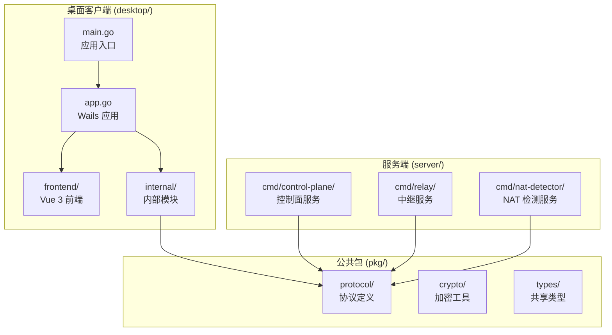

**图表来源**
- [main.go:1-40](file://desktop/main.go#L1-L40)
- [app.go:1-354](file://desktop/app.go#L1-L354)

**章节来源**
- [README.md:54-111](file://README.md#L54-L111)
- [README.md:115-174](file://README.md#L115-L174)

## 核心组件

### 应用架构组件

NexTunnel 桌面客户端采用分层架构设计，主要包含以下核心组件：

1. **Wails 应用层** - 基于 Wails v2 构建的桌面应用，提供 Go 后端与 Vue 3 前端的桥接
2. **隧道管理器** - 核心业务逻辑，负责隧道生命周期管理和控制连接
3. **P2P 引擎** - 支持 P2P 直连的网络引擎
4. **配置管理** - 基于 SQLite 的本地配置持久化
5. **认证模块** - 基于 HMAC-SHA256 的令牌认证系统

### 技术栈特性

- **客户端核心**: Go 1.25，提供高性能的网络处理能力
- **桌面框架**: Wails v2，实现跨平台原生桌面应用
- **前端技术**: Vue 3 + Vite + TypeScript，提供现代化的用户界面
- **状态管理**: Pinia，轻量级的状态管理解决方案
- **本地存储**: SQLite（modernc.org/sqlite），纯 Go 实现的可靠存储
- **网络协议**: STUN（pion/stun v2）、WireGuard（wireguard-go）、QUIC（quic-go）

**章节来源**
- [README.md:22-36](file://README.md#L22-L36)
- [README.md:178-191](file://README.md#L178-L191)

## 架构概览

### 系统架构

```mermaid
graph TB
subgraph "客户端 A"
A1[Wails 应用]
A2[Tunnel Manager]
A3[P2P 引擎]
A4[NAT 检测]
end
subgraph "客户端 B"
B1[Wails 应用]
B2[Tunnel Manager]
B3[P2P 引擎]
B4[NAT 检测]
end
subgraph "控制平面"
C1[节点注册/认证]
C2[密钥交换]
C3[ACL/路由下发]
end
subgraph "中继服务"
D1[QUIC Relay]
D2[TCP Relay]
end
A1 ↔ A2
A2 ↔ A3
A3 ↔ C1
A3 ↔ D1
A3 ↔ D2
B1 ↔ B2
B2 ↔ B3
B3 ↔ C1
B3 ↔ D1
B3 ↔ D2
```

**图表来源**
- [README.md:119-145](file://README.md#L119-L145)

### 客户端分层架构

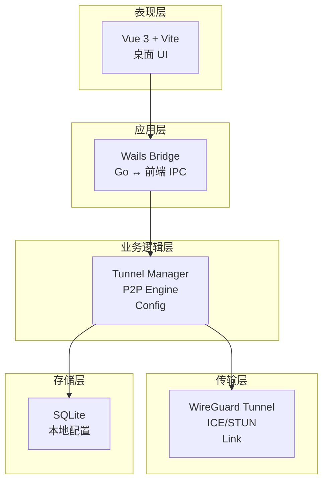

**图表来源**
- [README.md:147-163](file://README.md#L147-L163)

## 详细组件分析

### 应用入口与生命周期管理

#### Wails 应用初始化

应用入口通过 `main.go` 初始化 Wails 框架，配置应用的基本属性和生命周期回调：

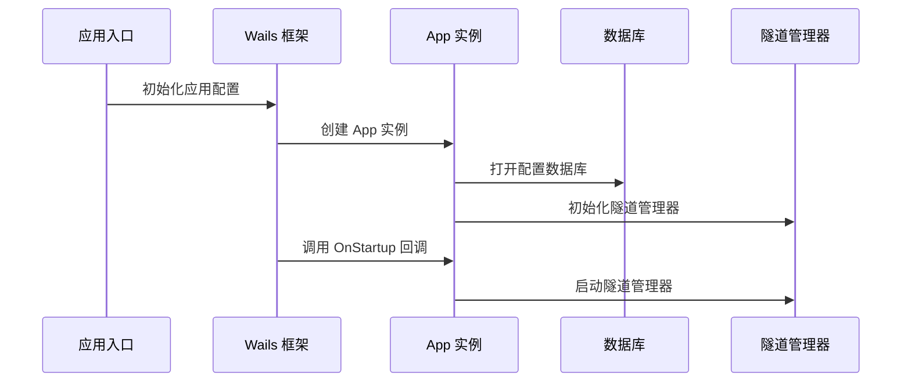

**图表来源**
- [main.go:15-39](file://desktop/main.go#L15-L39)
- [app.go:42-58](file://desktop/app.go#L42-L58)

#### 应用状态管理

App 结构体负责管理应用的全局状态和资源：

**章节来源**
- [app.go:25-40](file://desktop/app.go#L25-L40)
- [app.go:42-67](file://desktop/app.go#L42-L67)

### 隧道管理器核心功能

#### 隧道生命周期管理

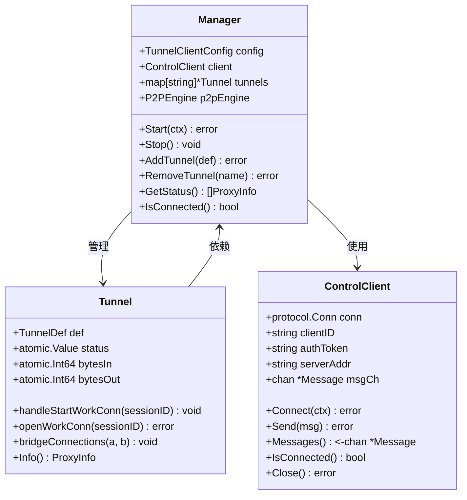

**图表来源**
- [manager.go:22-36](file://desktop/internal/tunnel/manager.go#L22-L36)
- [tunnel.go:16-25](file://desktop/internal/tunnel/tunnel.go#L16-L25)
- [control.go:15-29](file://desktop/internal/tunnel/control.go#L15-L29)

#### 控制连接建立流程

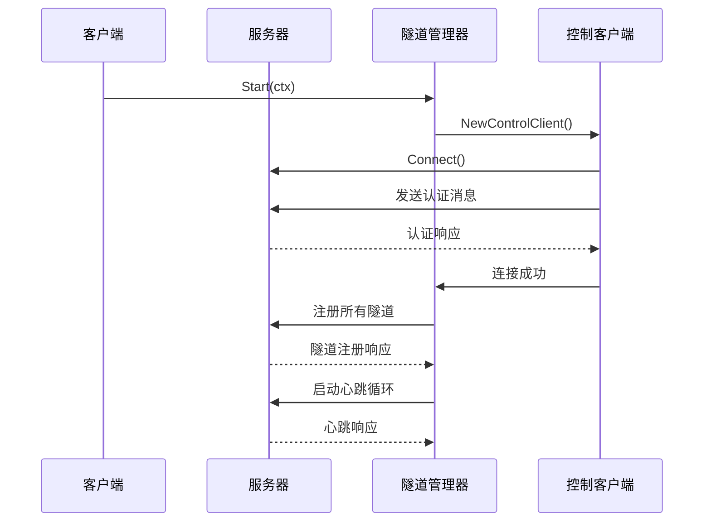

**图表来源**
- [manager.go:94-141](file://desktop/internal/tunnel/manager.go#L94-L141)
- [control.go:42-97](file://desktop/internal/tunnel/control.go#L42-L97)

**章节来源**
- [manager.go:94-185](file://desktop/internal/tunnel/manager.go#L94-L185)
- [control.go:42-97](file://desktop/internal/tunnel/control.go#L42-L97)

### 前端交互层

#### Vue 3 前端架构

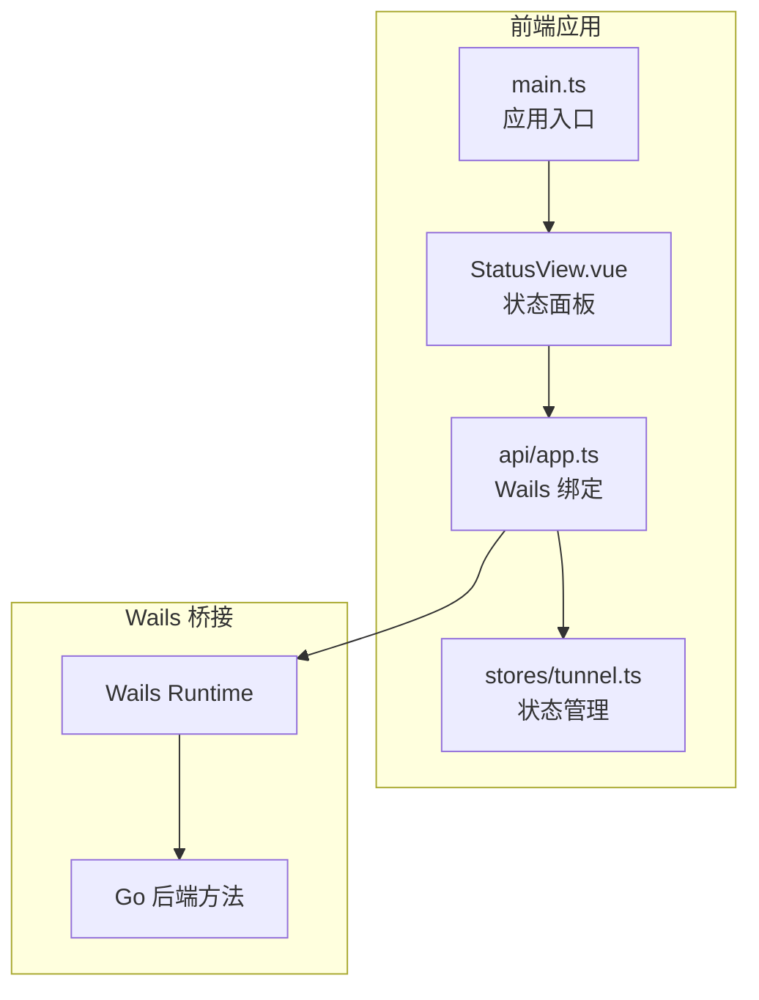

**图表来源**
- [main.ts:1-10](file://desktop/frontend/src/main.ts#L1-L10)
- [app.ts:1-125](file://desktop/frontend/src/api/app.ts#L1-L125)
- [tunnel.ts:1-199](file://desktop/frontend/src/stores/tunnel.ts#L1-L199)

#### 状态管理流程

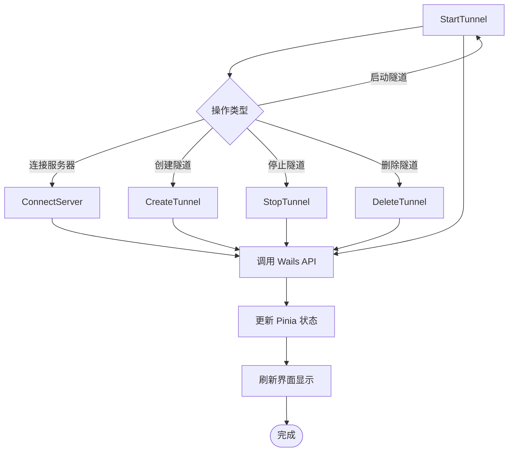

**图表来源**
- [tunnel.ts:105-133](file://desktop/frontend/src/stores/tunnel.ts#L105-L133)
- [tunnel.ts:135-163](file://desktop/frontend/src/stores/tunnel.ts#L135-L163)

**章节来源**
- [main.ts:1-10](file://desktop/frontend/src/main.ts#L1-L10)
- [app.ts:63-76](file://desktop/frontend/src/api/app.ts#L63-L76)
- [tunnel.ts:36-199](file://desktop/frontend/src/stores/tunnel.ts#L36-L199)

### 协议通信机制

#### 消息协议定义

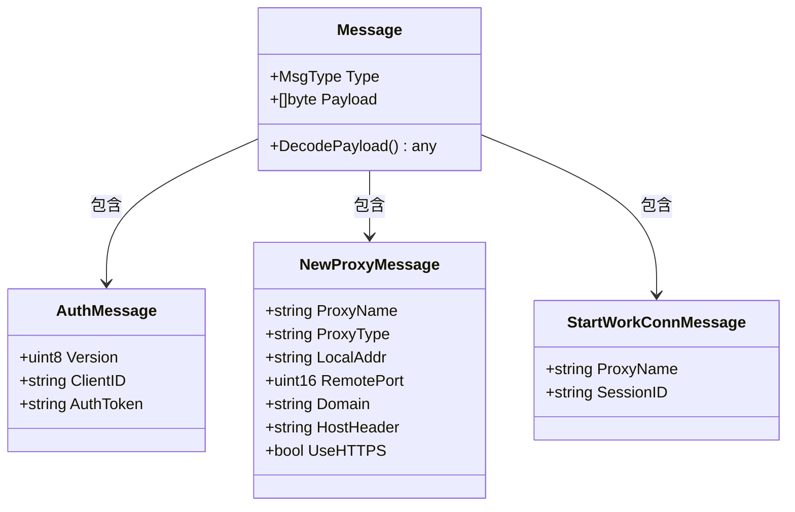

**图表来源**
- [message.go:47-51](file://pkg/protocol/message.go#L47-L51)
- [message.go:55-61](file://pkg/protocol/message.go#L55-L61)
- [message.go:69-78](file://pkg/protocol/message.go#L69-L78)
- [message.go:93-97](file://pkg/protocol/message.go#L93-L97)

#### 消息处理流程

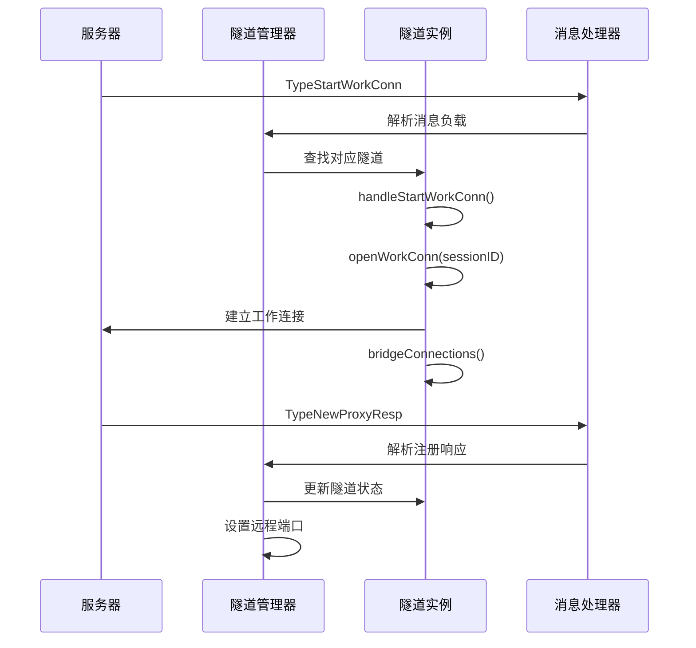

**图表来源**
- [manager.go:187-247](file://desktop/internal/tunnel/manager.go#L187-L247)
- [tunnel.go:38-84](file://desktop/internal/tunnel/tunnel.go#L38-L84)

**章节来源**
- [message.go:9-42](file://pkg/protocol/message.go#L9-L42)
- [manager.go:187-247](file://desktop/internal/tunnel/manager.go#L187-L247)

### 配置管理系统

#### 数据持久化架构

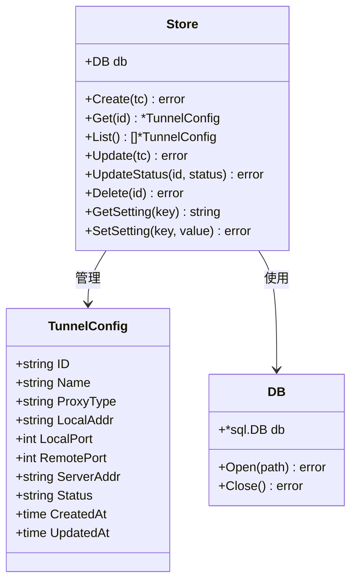

**图表来源**
- [store.go:23-31](file://desktop/internal/config/store.go#L23-L31)
- [store.go:9-21](file://desktop/internal/config/store.go#L9-L21)
- [store.go:1-8](file://desktop/internal/config/store.go#L1-L8)

**章节来源**
- [store.go:23-165](file://desktop/internal/config/store.go#L23-L165)

### 认证系统

#### 令牌认证机制

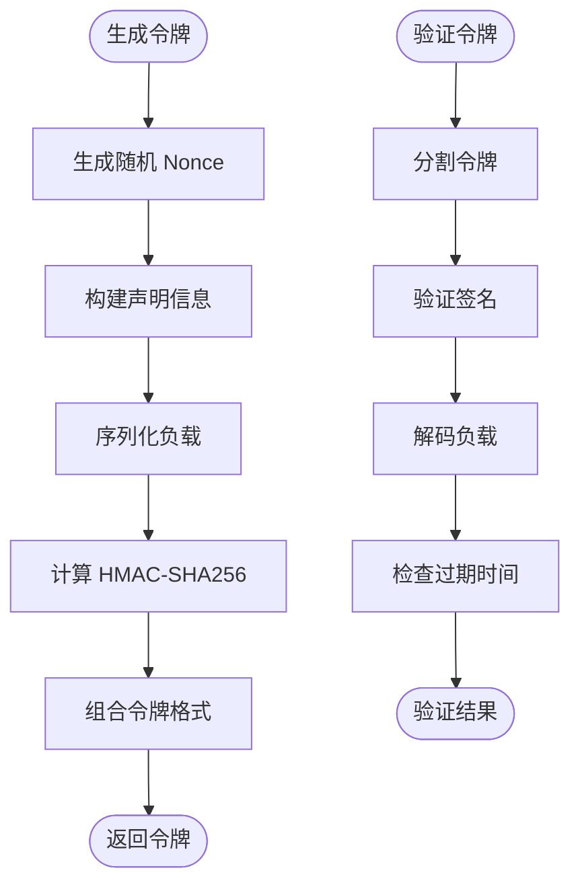

**图表来源**
- [token.go:29-56](file://desktop/internal/auth/token.go#L29-L56)
- [token.go:58-104](file://desktop/internal/auth/token.go#L58-L104)

**章节来源**
- [token.go:15-162](file://desktop/internal/auth/token.go#L15-L162)

## 依赖关系分析

### 模块间依赖关系

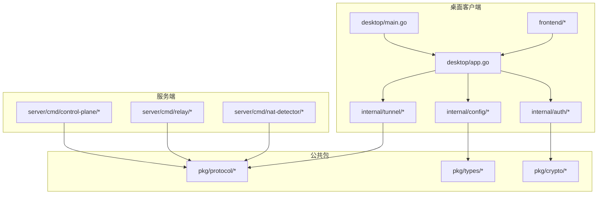

**图表来源**
- [go.mod:1-57](file://desktop/go.mod#L1-L57)
- [pkg/go.mod:1-6](file://pkg/go.mod#L1-L6)
- [server/go.mod:1-29](file://server/go.mod#L1-L29)

### 外部依赖分析

主要外部依赖包括：

1. **Wails v2** - 桌面应用框架
2. **Vue 3 + Vite** - 前端开发框架
3. **SQLite** - 本地数据库存储
4. **pion/stun** - STUN 协议实现
5. **wireguard-go** - WireGuard 加密隧道
6. **quic-go** - QUIC 传输协议

**章节来源**
- [go.mod:5-13](file://desktop/go.mod#L5-L13)
- [go.mod:17-56](file://desktop/go.mod#L17-L56)

## 性能考虑

### 网络性能优化

1. **连接池管理**: 隧道管理器使用连接池避免频繁建立连接
2. **异步处理**: 所有网络操作采用异步模式，避免阻塞主线程
3. **流量统计**: 实时监控和统计网络流量，便于性能分析
4. **心跳机制**: 定期发送心跳包维持连接活跃状态

### 内存管理

1. **原子操作**: 使用原子操作保护共享状态，避免锁竞争
2. **资源清理**: 确保所有资源在应用退出时正确释放
3. **缓冲区管理**: 合理设置网络缓冲区大小，平衡内存使用和性能

## 故障排除指南

### 常见问题诊断

#### 连接问题排查

1. **检查服务器地址**: 确认服务器地址格式正确（IP:端口）
2. **验证认证令牌**: 确认令牌格式正确且未过期
3. **网络连通性**: 使用 ping 或 telnet 测试服务器连通性
4. **防火墙设置**: 检查本地防火墙是否阻止连接

#### 隧道启动失败

1. **检查本地服务**: 确认本地服务正在监听指定端口
2. **验证端口范围**: 确认端口号在有效范围内（1-65535）
3. **查看日志输出**: 检查应用日志获取详细错误信息

**章节来源**
- [app.go:174-191](file://desktop/app.go#L174-L191)
- [tunnel.go:47-84](file://desktop/internal/tunnel/tunnel.go#L47-L84)

### 错误处理机制

应用实现了完善的错误处理机制：

1. **输入验证**: 对所有用户输入进行严格验证
2. **异常捕获**: 使用 defer 和 recover 处理意外错误
3. **状态反馈**: 通过前端界面实时反馈操作状态
4. **日志记录**: 详细记录错误信息便于调试

## 结论

NexTunnel 项目展现了现代网络工具的优秀架构设计，通过模块化的设计和清晰的分层结构，实现了功能丰富且易于维护的系统。项目的主要优势包括：

1. **架构清晰**: 分层设计使得各组件职责明确，便于维护和扩展
2. **技术先进**: 采用最新的 Go 和 Vue 3 技术栈，性能优异
3. **功能完整**: 提供了从基础隧道到 P2P 直连的完整解决方案
4. **用户体验**: 通过 Wails 框架提供了优秀的桌面应用体验

项目的当前状态处于 Phase 1 基础功能可用阶段，后续将继续完善 P2P 直连、智能调度和 QUIC 传输等高级功能。整体而言，这是一个具有很高技术水平和实用价值的开源项目。