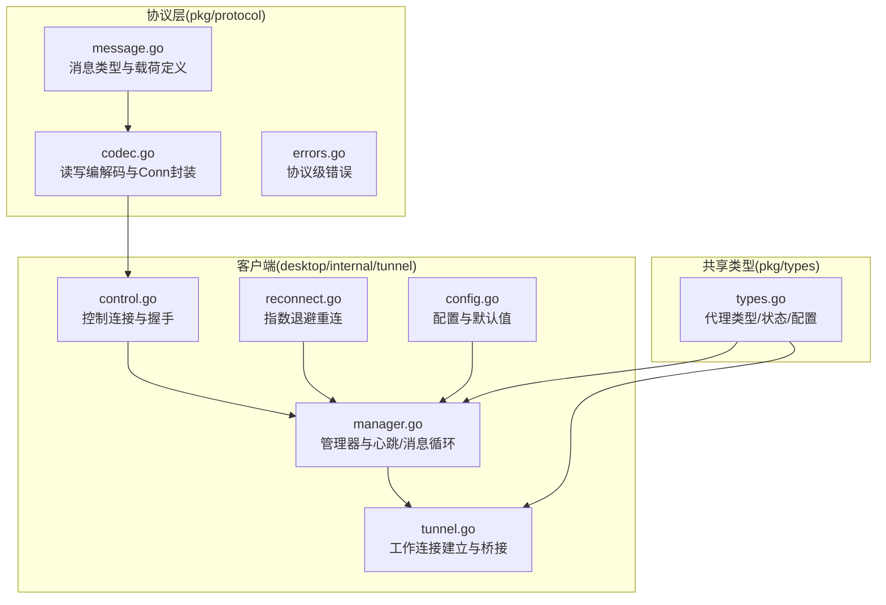
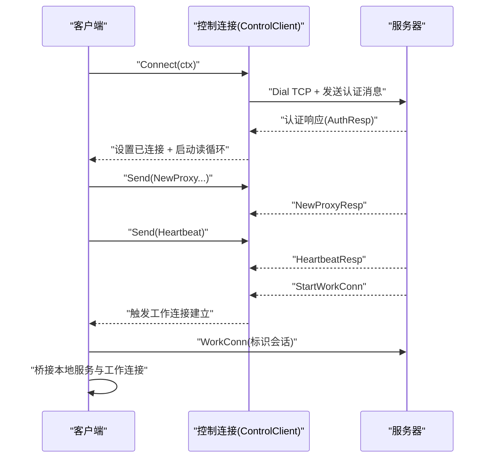
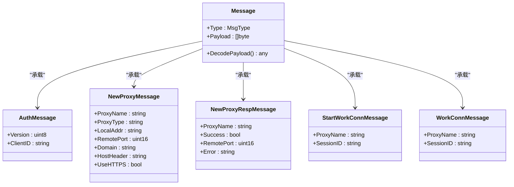
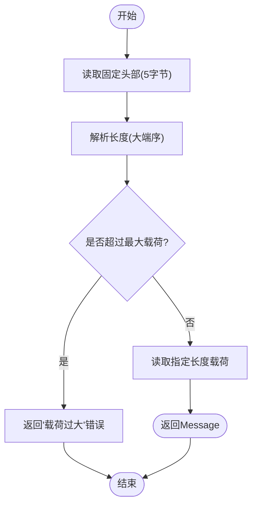
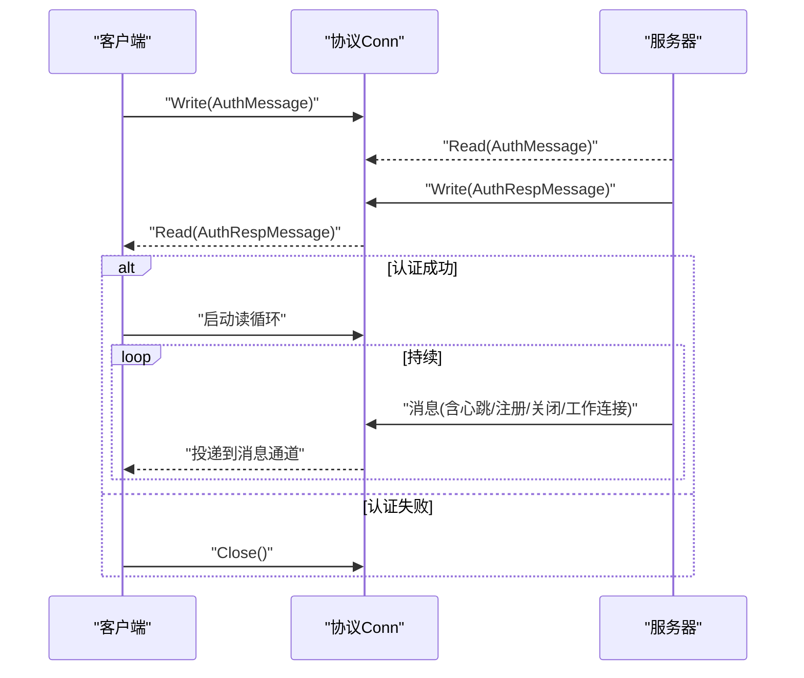
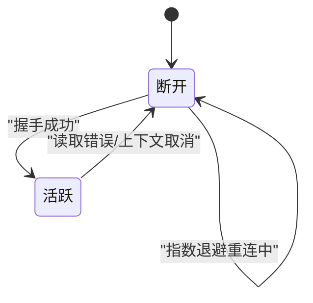
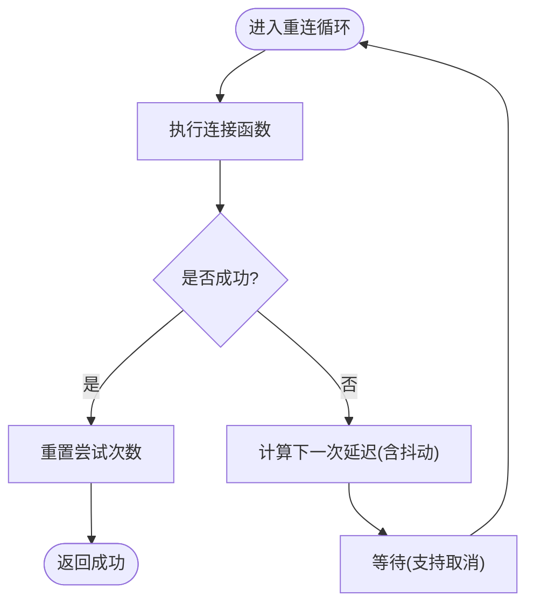
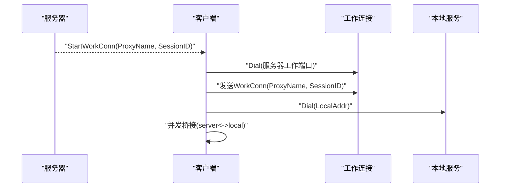
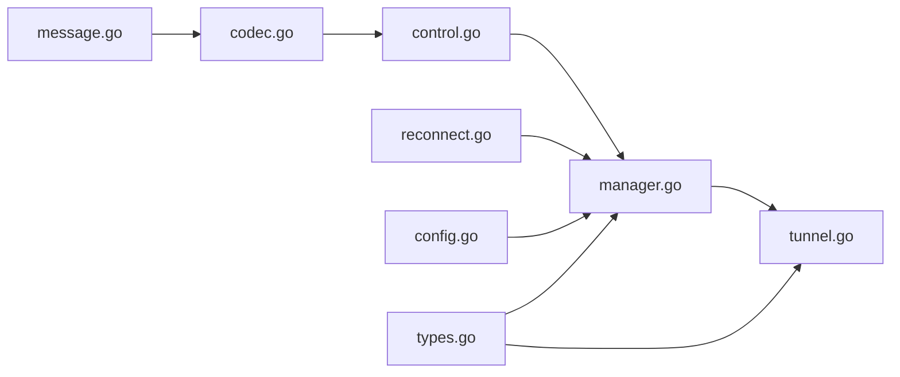

# 协议设计架构

<cite>
**本文引用的文件**
- [message.go](file://pkg/protocol/message.go)
- [codec.go](file://pkg/protocol/codec.go)
- [errors.go](file://pkg/protocol/errors.go)
- [codec_test.go](file://pkg/protocol/codec_test.go)
- [control.go](file://desktop/internal/tunnel/control.go)
- [manager.go](file://desktop/internal/tunnel/manager.go)
- [reconnect.go](file://desktop/internal/tunnel/reconnect.go)
- [config.go](file://desktop/internal/tunnel/config.go)
- [tunnel.go](file://desktop/internal/tunnel/tunnel.go)
- [integration_test.go](file://desktop/internal/tunnel/integration_test.go)
- [types.go](file://pkg/types/types.go)
- [README.md](file://README.md)
</cite>

## 目录
1. [引言](#引言)
2. [项目结构](#项目结构)
3. [核心组件](#核心组件)
4. [架构总览](#架构总览)
5. [详细组件分析](#详细组件分析)
6. [依赖分析](#依赖分析)
7. [性能考虑](#性能考虑)
8. [故障排查指南](#故障排查指南)
9. [结论](#结论)
10. [附录](#附录)

## 引言
本文件面向开发者与架构师，系统化梳理 NexTunnel 控制通道协议的设计与实现。内容覆盖消息类型定义、序列化与编解码策略、控制通道消息格式与传输规则、版本兼容性、错误处理与异常恢复、以及在不同网络环境下的适应性设计（心跳、重连、超时）。文档同时提供消息流程图、状态转换图与错误处理流程图，帮助读者快速理解并正确实现协议。

## 项目结构
NexTunnel 采用分层清晰的模块化组织：协议定义位于 pkg/protocol，客户端控制通道与隧道管理位于 desktop/internal/tunnel，共享类型位于 pkg/types。README 提供了高层概览。

图表来源
- [message.go:1-203](file://pkg/protocol/message.go#L1-L203)
- [codec.go:1-131](file://pkg/protocol/codec.go#L1-L131)
- [errors.go:1-15](file://pkg/protocol/errors.go#L1-L15)
- [control.go:1-155](file://desktop/internal/tunnel/control.go#L1-L155)
- [manager.go:1-310](file://desktop/internal/tunnel/manager.go#L1-L310)
- [tunnel.go:1-138](file://desktop/internal/tunnel/tunnel.go#L1-L138)
- [reconnect.go:1-83](file://desktop/internal/tunnel/reconnect.go#L1-L83)
- [config.go:1-36](file://desktop/internal/tunnel/config.go#L1-L36)
- [types.go:1-50](file://pkg/types/types.go#L1-L50)

章节来源
- [README.md:1-20](file://README.md#L1-L20)

## 核心组件
- 协议消息与载荷：定义消息类型枚举、协议版本常量、通用消息结构与各消息类型的结构体。
- 编解码器：定义帧头格式（类型+长度）、最大载荷限制、读写函数与线程安全的 Conn 封装。
- 错误集合：统一的协议错误类型，便于上层处理。
- 客户端控制连接：负责与服务器建立持久化控制连接、认证握手、消息收发与关闭。
- 管理器：协调注册隧道、发送心跳、处理服务器指令（如启动工作连接）。
- 隧道实例：根据服务器请求建立工作连接，桥接本地服务与远端工作连接。
- 重连策略：指数退避+抖动，支持最大延迟与重置逻辑。
- 配置：提供默认参数（重连、心跳间隔等），确保最小可用配置。

章节来源
- [message.go:1-203](file://pkg/protocol/message.go#L1-L203)
- [codec.go:1-131](file://pkg/protocol/codec.go#L1-L131)
- [errors.go:1-15](file://pkg/protocol/errors.go#L1-L15)
- [control.go:1-155](file://desktop/internal/tunnel/control.go#L1-L155)
- [manager.go:1-310](file://desktop/internal/tunnel/manager.go#L1-L310)
- [tunnel.go:1-138](file://desktop/internal/tunnel/tunnel.go#L1-L138)
- [reconnect.go:1-83](file://desktop/internal/tunnel/reconnect.go#L1-L83)
- [config.go:1-36](file://desktop/internal/tunnel/config.go#L1-L36)
- [types.go:1-50](file://pkg/types/types.go#L1-L50)

## 架构总览
控制通道由客户端发起 TCP 连接，完成认证后进入消息循环；服务器通过控制通道下发指令（如启动工作连接），客户端按需建立工作连接并进行数据桥接。管理器负责心跳保活与重连，控制客户端负责握手与消息编解码。

图表来源
- [control.go:40-95](file://desktop/internal/tunnel/control.go#L40-L95)
- [manager.go:114-156](file://desktop/internal/tunnel/manager.go#L114-L156)
- [manager.go:158-197](file://desktop/internal/tunnel/manager.go#L158-L197)
- [manager.go:199-217](file://desktop/internal/tunnel/manager.go#L199-L217)
- [tunnel.go:47-85](file://desktop/internal/tunnel/tunnel.go#L47-L85)

## 详细组件分析

### 协议消息与载荷模型
- 消息类型：包含认证、代理注册/响应、关闭代理、启动工作连接、工作连接标识、心跳与心跳响应等。
- 协议版本：当前版本号用于未来兼容性扩展。
- 载荷结构：各消息类型对应独立结构体，使用 JSON 序列化；心跳类消息为空载荷。
- 工厂方法：提供便捷构造函数，保证版本与字段一致性。

图表来源
- [message.go:24-194](file://pkg/protocol/message.go#L24-L194)

章节来源
- [message.go:6-28](file://pkg/protocol/message.go#L6-L28)
- [message.go:32-153](file://pkg/protocol/message.go#L32-L153)

### 编解码策略与帧格式
- 帧头：1 字节类型 + 4 字节大端序长度，固定 5 字节头部。
- 最大载荷：16 MB，超过即返回协议错误。
- 读取流程：先读取完整头部，解析长度后读取对应长度的载荷；空载荷直接返回。
- 写入流程：计算载荷长度并写入头部，再写入载荷。
- 线程安全：Conn 对读写加互斥锁，并在关闭后拒绝后续读写。

图表来源
- [codec.go:16-39](file://pkg/protocol/codec.go#L16-L39)
- [codec.go:41-63](file://pkg/protocol/codec.go#L41-L63)

章节来源
- [codec.go:10-14](file://pkg/protocol/codec.go#L10-L14)
- [codec.go:16-63](file://pkg/protocol/codec.go#L16-L63)
- [errors.go:6-14](file://pkg/protocol/errors.go#L6-L14)

### 控制通道握手与消息循环
- 握手：建立 TCP 连接后发送认证消息，等待认证响应；失败则关闭连接并返回错误。
- 读循环：从连接持续读取消息，投递到通道；上下文取消或读取错误时退出并清理。
- 发送：线程安全的写操作，未连接时返回错误。
- 关闭：取消上下文、关闭底层连接，确保资源释放。

图表来源
- [control.go:40-95](file://desktop/internal/tunnel/control.go#L40-L95)
- [control.go:97-122](file://desktop/internal/tunnel/control.go#L97-L122)

章节来源
- [control.go:15-95](file://desktop/internal/tunnel/control.go#L15-L95)
- [control.go:97-155](file://desktop/internal/tunnel/control.go#L97-L155)

### 心跳机制与状态流转
- 心跳发送：管理器以固定周期向服务器发送心跳；收到心跳请求时立即回复心跳响应。
- 连接状态：控制连接断开时，读循环退出，管理器进入重连循环。
- 状态机简化：活跃 <-> 断开，断开时通过指数退避重连。

图表来源
- [manager.go:199-217](file://desktop/internal/tunnel/manager.go#L199-L217)
- [manager.go:158-197](file://desktop/internal/tunnel/manager.go#L158-L197)
- [control.go:97-122](file://desktop/internal/tunnel/control.go#L97-L122)

章节来源
- [manager.go:199-217](file://desktop/internal/tunnel/manager.go#L199-L217)
- [manager.go:158-197](file://desktop/internal/tunnel/manager.go#L158-L197)
- [config.go:28-35](file://desktop/internal/tunnel/config.go#L28-L35)

### 重连策略与超时处理
- 指数退避：基础延迟、最大延迟、乘数因子、抖动比例可配置；成功后重置尝试次数。
- 执行循环：每次连接尝试后根据结果决定是否重试与延时；支持上下文取消。
- 超时策略：拨号与本地/远端连接均使用超时，避免阻塞。

图表来源
- [reconnect.go:63-83](file://desktop/internal/tunnel/reconnect.go#L63-L83)
- [reconnect.go:39-56](file://desktop/internal/tunnel/reconnect.go#L39-L56)

章节来源
- [reconnect.go:10-26](file://desktop/internal/tunnel/reconnect.go#L10-L26)
- [reconnect.go:28-62](file://desktop/internal/tunnel/reconnect.go#L28-L62)
- [reconnect.go:63-83](file://desktop/internal/tunnel/reconnect.go#L63-L83)
- [manager.go:65-80](file://desktop/internal/tunnel/manager.go#L65-L80)

### 工作连接建立与数据桥接
- 请求处理：收到服务器的启动工作连接指令后，客户端建立到服务器的工作连接并发送标识消息。
- 本地连接：随后连接本地服务地址，建立双向桥接。
- 数据转发：使用并发 goroutine 双向复制数据，统计字节数并统一关闭。

图表来源
- [manager.go:158-178](file://desktop/internal/tunnel/manager.go#L158-L178)
- [tunnel.go:47-85](file://desktop/internal/tunnel/tunnel.go#L47-L85)
- [tunnel.go:87-124](file://desktop/internal/tunnel/tunnel.go#L87-L124)

章节来源
- [tunnel.go:38-85](file://desktop/internal/tunnel/tunnel.go#L38-L85)
- [tunnel.go:87-124](file://desktop/internal/tunnel/tunnel.go#L87-L124)

### 版本兼容性与错误处理
- 版本字段：认证消息包含版本号，便于未来升级与兼容判断。
- 错误分类：载荷过大、未知消息类型、连接已关闭等，便于上层区分处理。
- 兼容策略：新增消息类型时保持旧字段不变，解析阶段忽略未知字段；未知类型返回明确错误。

章节来源
- [message.go:21-22](file://pkg/protocol/message.go#L21-L22)
- [message.go:32-36](file://pkg/protocol/message.go#L32-L36)
- [codec.go:26-28](file://pkg/protocol/codec.go#L26-L28)
- [errors.go:6-14](file://pkg/protocol/errors.go#L6-L14)

### 测试验证与集成场景
- 编解码往返测试：覆盖所有消息类型的读写与载荷解析。
- 边界条件：截断头部/载荷、空载荷、空读取器、连接关闭后的读写行为。
- 集成测试：心跳响应、多隧道注册、重连后数据透传、配置持久化与令牌生命周期。

章节来源
- [codec_test.go:11-78](file://pkg/protocol/codec_test.go#L11-L78)
- [codec_test.go:117-189](file://pkg/protocol/codec_test.go#L117-L189)
- [integration_test.go:114-189](file://desktop/internal/tunnel/integration_test.go#L114-L189)
- [integration_test.go:193-298](file://desktop/internal/tunnel/integration_test.go#L193-L298)

## 依赖分析
- 协议层仅依赖标准库，职责单一，耦合度低。
- 客户端管理器依赖协议层与共享类型，向上提供隧道生命周期管理。
- 重连策略独立于协议与管理器，可复用到其他长连接场景。
- 测试覆盖编解码与集成场景，保障协议稳定性。

图表来源
- [message.go:1-203](file://pkg/protocol/message.go#L1-L203)
- [codec.go:1-131](file://pkg/protocol/codec.go#L1-L131)
- [control.go:1-155](file://desktop/internal/tunnel/control.go#L1-L155)
- [manager.go:1-310](file://desktop/internal/tunnel/manager.go#L1-L310)
- [tunnel.go:1-138](file://desktop/internal/tunnel/tunnel.go#L1-L138)
- [reconnect.go:1-83](file://desktop/internal/tunnel/reconnect.go#L1-L83)
- [config.go:1-36](file://desktop/internal/tunnel/config.go#L1-L36)
- [types.go:1-50](file://pkg/types/types.go#L1-L50)

## 性能考虑
- 帧头极简：仅 5 字节头部，降低开销。
- 大小端一致：长度字段为大端序，便于跨语言互通。
- 并发桥接：工作连接使用并发复制，充分利用带宽。
- 退避抖动：减少雪崩效应，提升整体稳定性。
- 超时控制：拨号与本地连接均设置超时，避免资源泄露。

## 故障排查指南
- 认证失败：检查客户端 ID 与服务器配置是否匹配；确认握手阶段返回的错误信息。
- 连接断开：查看读循环日志与上下文取消原因；确认是否触发重连。
- 心跳异常：确认心跳间隔配置合理；检查服务器是否正确回显心跳响应。
- 载荷过大：调整业务载荷大小或提升上限（谨慎）；检查客户端/服务器配置一致性。
- 重连不生效：核对退避参数与最大延迟；确认上下文未提前取消。

章节来源
- [control.go:63-85](file://desktop/internal/tunnel/control.go#L63-L85)
- [manager.go:199-217](file://desktop/internal/tunnel/manager.go#L199-L217)
- [codec.go:26-28](file://pkg/protocol/codec.go#L26-L28)
- [reconnect.go:63-83](file://desktop/internal/tunnel/reconnect.go#L63-L83)

## 结论
NexTunnel 控制通道协议以简洁的帧格式与清晰的消息模型为基础，结合线程安全的编解码器、完善的错误处理与指数退避重连策略，在复杂网络环境下具备良好的鲁棒性与可维护性。通过心跳保活与工作连接桥接，实现了从控制到数据的全链路贯通。建议在生产环境中严格遵循版本字段与错误语义，确保平滑演进与快速定位问题。

## 附录
- 消息类型速览：认证、认证响应、新建代理、代理响应、关闭代理、启动工作连接、工作连接、心跳、心跳响应。
- 关键配置项：服务器地址、客户端 ID、隧道定义、重连基础/最大延迟、心跳间隔。
- 共享类型：代理类型（TCP/HTTP/UDP 预留）、运行状态、隧道配置与运行时信息。

章节来源
- [message.go:9-19](file://pkg/protocol/message.go#L9-L19)
- [config.go:6-14](file://desktop/internal/tunnel/config.go#L6-L14)
- [types.go:6-22](file://pkg/types/types.go#L6-L22)