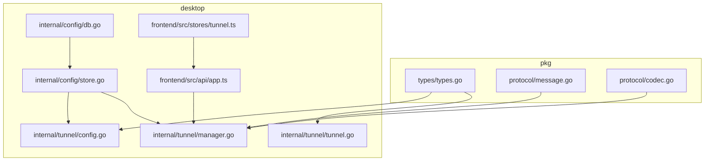
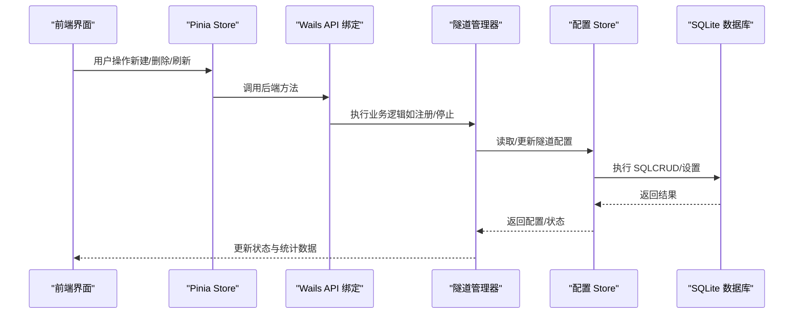
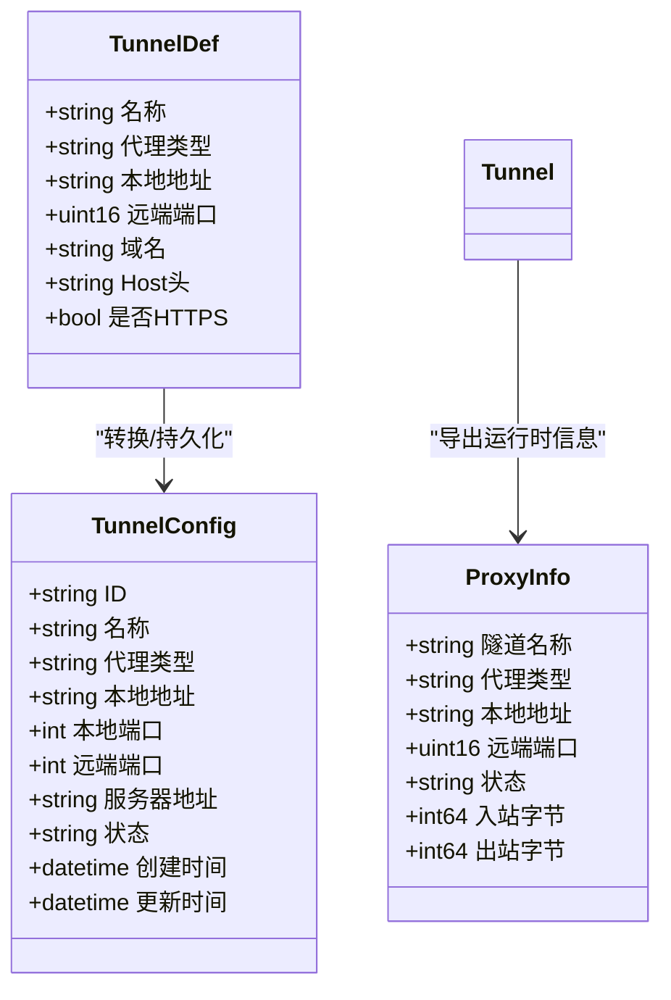
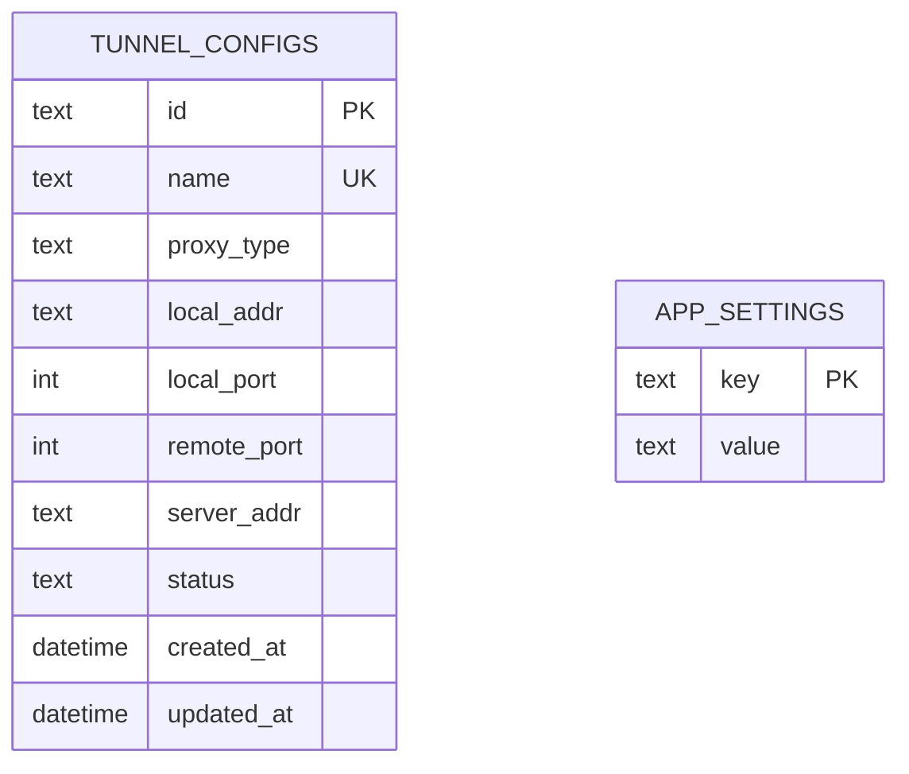
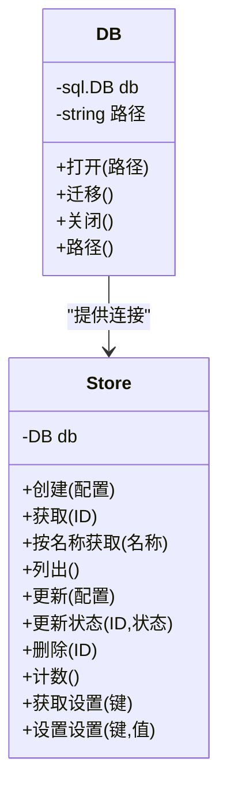
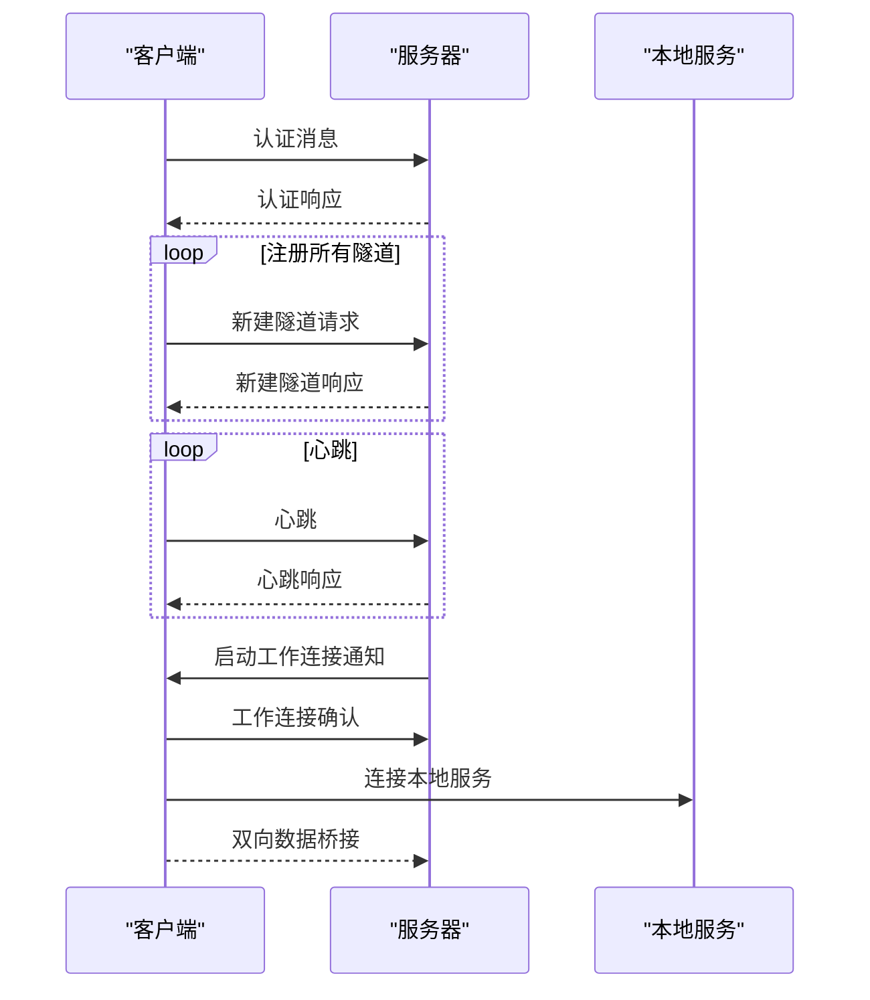
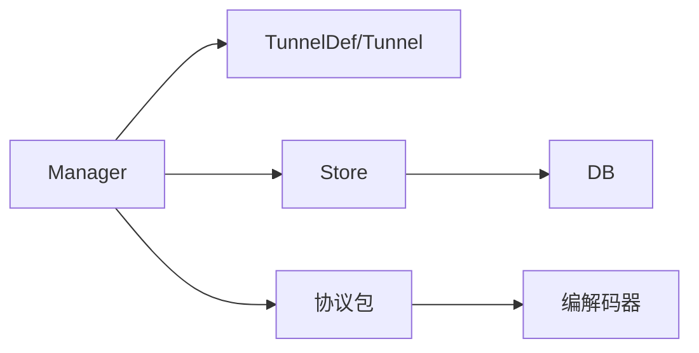

# 数据模型架构

<cite>
**本文引用的文件**
- [desktop/internal/tunnel/tunnel.go](file://desktop/internal/tunnel/tunnel.go)
- [desktop/internal/tunnel/config.go](file://desktop/internal/tunnel/config.go)
- [desktop/internal/tunnel/manager.go](file://desktop/internal/tunnel/manager.go)
- [desktop/internal/config/db.go](file://desktop/internal/config/db.go)
- [desktop/internal/config/store.go](file://desktop/internal/config/store.go)
- [pkg/types/types.go](file://pkg/types/types.go)
- [pkg/protocol/message.go](file://pkg/protocol/message.go)
- [pkg/protocol/codec.go](file://pkg/protocol/codec.go)
- [desktop/frontend/src/stores/tunnel.ts](file://desktop/frontend/src/stores/tunnel.ts)
- [desktop/frontend/src/api/app.ts](file://desktop/frontend/src/api/app.ts)
- [desktop/internal/config/store_test.go](file://desktop/internal/config/store_test.go)
- [desktop/internal/tunnel/tunnel_test.go](file://desktop/internal/tunnel/tunnel_test.go)
</cite>

## 目录
1. [简介](#简介)
2. [项目结构](#项目结构)
3. [核心组件](#核心组件)
4. [架构总览](#架构总览)
5. [详细组件分析](#详细组件分析)
6. [依赖分析](#依赖分析)
7. [性能考虑](#性能考虑)
8. [故障排查指南](#故障排查指南)
9. [结论](#结论)
10. [附录](#附录)

## 简介
本文件系统性梳理 NexTunnel 的数据模型与持久化架构，覆盖以下主题：
- 核心数据类型：隧道配置、连接状态、协议消息的数据结构设计与演进策略
- SQLite 数据库表结构、索引策略与查询优化
- 数据访问层设计模式（Repository 模式）、事务管理与并发控制
- 数据持久化策略、缓存机制与性能优化
- 数据模型关系图、ER 图与数据流图，帮助开发者全面理解数据架构

## 项目结构
本项目采用多模块分层组织：
- pkg：跨客户端/服务端共享的类型与协议定义
- desktop：桌面端应用，包含隧道管理、配置存储与前端交互
- server：服务端控制平面与中继逻辑（当前控制平面尚未实现）

**图表来源**
- [pkg/types/types.go:1-50](file://pkg/types/types.go#L1-L50)
- [pkg/protocol/message.go:1-203](file://pkg/protocol/message.go#L1-L203)
- [pkg/protocol/codec.go:1-131](file://pkg/protocol/codec.go#L1-L131)
- [desktop/internal/tunnel/config.go:1-36](file://desktop/internal/tunnel/config.go#L1-L36)
- [desktop/internal/tunnel/manager.go:1-310](file://desktop/internal/tunnel/manager.go#L1-L310)
- [desktop/internal/tunnel/tunnel.go:1-138](file://desktop/internal/tunnel/tunnel.go#L1-L138)
- [desktop/internal/config/db.go:1-91](file://desktop/internal/config/db.go#L1-L91)
- [desktop/internal/config/store.go:1-165](file://desktop/internal/config/store.go#L1-L165)
- [desktop/frontend/src/stores/tunnel.ts:1-83](file://desktop/frontend/src/stores/tunnel.ts#L1-L83)
- [desktop/frontend/src/api/app.ts:1-49](file://desktop/frontend/src/api/app.ts#L1-L49)

**章节来源**
- [pkg/types/types.go:1-50](file://pkg/types/types.go#L1-L50)
- [pkg/protocol/message.go:1-203](file://pkg/protocol/message.go#L1-L203)
- [pkg/protocol/codec.go:1-131](file://pkg/protocol/codec.go#L1-L131)
- [desktop/internal/tunnel/config.go:1-36](file://desktop/internal/tunnel/config.go#L1-L36)
- [desktop/internal/tunnel/manager.go:1-310](file://desktop/internal/tunnel/manager.go#L1-L310)
- [desktop/internal/tunnel/tunnel.go:1-138](file://desktop/internal/tunnel/tunnel.go#L1-L138)
- [desktop/internal/config/db.go:1-91](file://desktop/internal/config/db.go#L1-L91)
- [desktop/internal/config/store.go:1-165](file://desktop/internal/config/store.go#L1-L165)
- [desktop/frontend/src/stores/tunnel.ts:1-83](file://desktop/frontend/src/stores/tunnel.ts#L1-L83)
- [desktop/frontend/src/api/app.ts:1-49](file://desktop/frontend/src/api/app.ts#L1-L49)

## 核心组件
- 隧道配置与运行时状态
  - 配置定义：名称、代理类型、本地地址、远端端口、服务器地址等
  - 运行时状态：活跃/非活跃/错误，并统计入站/出站字节数
- 协议消息模型
  - 控制通道消息类型：认证、注册、关闭、心跳、工作连接请求与建立等
  - 消息编解码：固定头格式（类型+长度）+ JSON 负载
- 数据持久化
  - SQLite 表：隧道配置表与应用设置表
  - Store 层：提供 CRUD、计数、设置读写等操作
- 前端数据模型
  - Pinia Store 与 API 层对接后端能力，暴露隧道列表、状态与流量统计

**章节来源**
- [desktop/internal/tunnel/config.go:16-26](file://desktop/internal/tunnel/config.go#L16-L26)
- [pkg/types/types.go:24-42](file://pkg/types/types.go#L24-L42)
- [pkg/protocol/message.go:24-163](file://pkg/protocol/message.go#L24-L163)
- [pkg/protocol/codec.go:10-63](file://pkg/protocol/codec.go#L10-L63)
- [desktop/internal/config/db.go:13-31](file://desktop/internal/config/db.go#L13-L31)
- [desktop/internal/config/store.go:9-21](file://desktop/internal/config/store.go#L9-L21)
- [desktop/frontend/src/stores/tunnel.ts:5-21](file://desktop/frontend/src/stores/tunnel.ts#L5-L21)
- [desktop/frontend/src/api/app.ts:3-19](file://desktop/frontend/src/api/app.ts#L3-L19)

## 架构总览
下图展示从用户操作到数据持久化与协议通信的整体流程。

**图表来源**
- [desktop/frontend/src/stores/tunnel.ts:23-82](file://desktop/frontend/src/stores/tunnel.ts#L23-L82)
- [desktop/frontend/src/api/app.ts:22-48](file://desktop/frontend/src/api/app.ts#L22-L48)
- [desktop/internal/tunnel/manager.go:65-112](file://desktop/internal/tunnel/manager.go#L65-L112)
- [desktop/internal/config/store.go:33-139](file://desktop/internal/config/store.go#L33-L139)
- [desktop/internal/config/db.go:39-72](file://desktop/internal/config/db.go#L39-L72)

## 详细组件分析

### 数据模型与设计思路
- 隧道配置
  - 字段覆盖：名称唯一、代理类型、本地监听、远端映射、服务器地址、状态、时间戳
  - 设计要点：名称唯一约束确保配置去重；状态字段用于 UI 与业务控制；时间戳便于审计与排序
- 连接状态
  - 使用原子变量保存状态，避免锁开销；提供 Info 接口供 UI 查询
  - 入/出站字节统计在桥接阶段累加，保证高并发下的正确性
- 协议消息
  - 类型枚举与版本常量明确协议边界；消息体为 JSON 结构，便于扩展
  - 编解码器定义统一的帧格式（类型+长度），限制最大负载防止资源滥用

**图表来源**
- [desktop/internal/tunnel/config.go:16-26](file://desktop/internal/tunnel/config.go#L16-L26)
- [desktop/internal/config/store.go:9-21](file://desktop/internal/config/store.go#L9-L21)
- [pkg/types/types.go:24-42](file://pkg/types/types.go#L24-L42)
- [desktop/internal/tunnel/tunnel.go:127-137](file://desktop/internal/tunnel/tunnel.go#L127-L137)

**章节来源**
- [desktop/internal/tunnel/config.go:16-26](file://desktop/internal/tunnel/config.go#L16-L26)
- [pkg/types/types.go:24-42](file://pkg/types/types.go#L24-L42)
- [desktop/internal/tunnel/tunnel.go:127-137](file://desktop/internal/tunnel/tunnel.go#L127-L137)

### SQLite 表结构设计、索引策略与查询优化
- 表结构
  - 隧道配置表：主键 ID、唯一名称、默认值字段、状态、时间戳
  - 应用设置表：键值对，支持冲突更新
- 索引策略
  - 建议在名称字段上建立唯一索引（已通过唯一约束实现）
  - 可考虑在状态字段上建立二级索引以加速筛选
- 查询优化
  - 列裁剪：按需选择列，减少 IO
  - 分页/排序：按创建时间倒序列出，适合前端分页
  - 写入优化：批量插入/更新可结合事务（见“事务管理”）

**图表来源**
- [desktop/internal/config/db.go:13-31](file://desktop/internal/config/db.go#L13-L31)

**章节来源**
- [desktop/internal/config/db.go:13-31](file://desktop/internal/config/db.go#L13-L31)
- [desktop/internal/config/store.go:79-99](file://desktop/internal/config/store.go#L79-L99)

### 数据访问层设计模式与并发控制
- Repository 模式
  - Store 封装对 DB 的所有访问，对外暴露清晰的 CRUD 接口
  - DB 负责连接生命周期与迁移执行
- 并发控制
  - 管理器内部使用读写锁保护隧道集合
  - 隧道状态使用原子变量，避免锁竞争
  - 协议 Conn 在读写路径上使用互斥锁，保证线程安全
- 事务管理
  - 当前 CRUD 为单条语句；若需要批量或跨表一致性，建议引入显式事务

**图表来源**
- [desktop/internal/config/db.go:33-90](file://desktop/internal/config/db.go#L33-L90)
- [desktop/internal/config/store.go:23-165](file://desktop/internal/config/store.go#L23-L165)

**章节来源**
- [desktop/internal/config/db.go:33-90](file://desktop/internal/config/db.go#L33-L90)
- [desktop/internal/config/store.go:23-165](file://desktop/internal/config/store.go#L23-L165)
- [desktop/internal/tunnel/manager.go:22-27](file://desktop/internal/tunnel/manager.go#L22-L27)
- [pkg/protocol/codec.go:65-131](file://pkg/protocol/codec.go#L65-L131)

### 协议消息与数据流
- 消息类型与版本
  - 明确的消息类型与版本号，便于未来演进
- 控制通道交互
  - 客户端启动后连接服务器，注册所有隧道；随后周期性发送心跳
  - 服务器下发工作连接请求，客户端据此建立工作连接并进行数据桥接
- 数据桥接
  - 工作连接建立后，进入纯 TCP 数据转发阶段，统计入/出站字节

**图表来源**
- [pkg/protocol/message.go:83-163](file://pkg/protocol/message.go#L83-L163)
- [pkg/protocol/codec.go:16-63](file://pkg/protocol/codec.go#L16-L63)
- [desktop/internal/tunnel/manager.go:114-156](file://desktop/internal/tunnel/manager.go#L114-L156)
- [desktop/internal/tunnel/tunnel.go:47-84](file://desktop/internal/tunnel/tunnel.go#L47-L84)

**章节来源**
- [pkg/protocol/message.go:6-194](file://pkg/protocol/message.go#L6-L194)
- [pkg/protocol/codec.go:16-131](file://pkg/protocol/codec.go#L16-L131)
- [desktop/internal/tunnel/manager.go:114-217](file://desktop/internal/tunnel/manager.go#L114-L217)
- [desktop/internal/tunnel/tunnel.go:47-124](file://desktop/internal/tunnel/tunnel.go#L47-L124)

### 数据持久化策略与缓存机制
- 持久化策略
  - 使用 SQLite 存储隧道配置与应用设置，具备轻量、可靠、跨平台特性
  - 默认路径位于用户目录下，便于隔离与备份
- 缓存机制
  - 运行时状态（活跃/非活跃/错误）与流量统计在内存中维护，降低数据库压力
  - 前端 Pinia Store 缓存隧道列表与连接状态，减少重复请求
- 性能优化建议
  - 对高频查询（如按名称获取）可考虑内存缓存
  - 大量写入场景可合并为事务批处理

**章节来源**
- [desktop/internal/config/db.go:39-72](file://desktop/internal/config/db.go#L39-L72)
- [desktop/frontend/src/stores/tunnel.ts:23-82](file://desktop/frontend/src/stores/tunnel.ts#L23-L82)

## 依赖分析
- 组件耦合
  - Manager 依赖 TunnelDef 与 Store；Store 依赖 DB；协议包独立于业务层
- 外部依赖
  - SQLite 驱动、JSON 编解码、日志与并发原语
- 循环依赖
  - 未发现循环导入；各模块职责清晰

**图表来源**
- [desktop/internal/tunnel/manager.go:16-58](file://desktop/internal/tunnel/manager.go#L16-L58)
- [desktop/internal/config/store.go:23-31](file://desktop/internal/config/store.go#L23-L31)
- [desktop/internal/config/db.go:33-41](file://desktop/internal/config/db.go#L33-L41)
- [pkg/protocol/codec.go:65-77](file://pkg/protocol/codec.go#L65-L77)

**章节来源**
- [desktop/internal/tunnel/manager.go:16-58](file://desktop/internal/tunnel/manager.go#L16-L58)
- [desktop/internal/config/store.go:23-31](file://desktop/internal/config/store.go#L23-L31)
- [desktop/internal/config/db.go:33-41](file://desktop/internal/config/db.go#L33-L41)
- [pkg/protocol/codec.go:65-77](file://pkg/protocol/codec.go#L65-L77)

## 性能考虑
- 并发与锁
  - 使用读写锁保护隧道集合；原子变量保存状态；协议 Conn 使用互斥锁
- I/O 优化
  - SQLite 启用 WAL 模式提升并发读写性能
  - 编解码器限制最大负载，避免异常大包导致内存压力
- 查询优化
  - 列裁剪与排序；必要时增加索引
- 缓存与批处理
  - 前端与运行时状态缓存；批量写入使用事务

**章节来源**
- [desktop/internal/tunnel/manager.go:22-27](file://desktop/internal/tunnel/manager.go#L22-L27)
- [pkg/protocol/codec.go:10-14](file://pkg/protocol/codec.go#L10-L14)
- [desktop/internal/config/db.go:59-63](file://desktop/internal/config/db.go#L59-L63)

## 故障排查指南
- 常见问题定位
  - 隧道无法注册：检查服务器地址、认证与注册响应
  - 工作连接失败：确认服务器下发的会话 ID 与本地桥接逻辑
  - 数据库异常：检查 WAL 模式启用与迁移是否成功
- 单元测试参考
  - 配置 CRUD、重复名称、设置读写、默认路径等场景均有覆盖
  - 集成测试模拟最小中继，验证端到端 TCP 隧道功能与流量统计

**章节来源**
- [desktop/internal/config/store_test.go:30-211](file://desktop/internal/config/store_test.go#L30-L211)
- [desktop/internal/tunnel/tunnel_test.go:18-303](file://desktop/internal/tunnel/tunnel_test.go#L18-L303)

## 结论
NexTunnel 的数据模型以简洁、可演进为核心目标：配置与状态分离、协议与存储解耦、前端与后端通过 API 层交互。SQLite 提供可靠的本地持久化，配合内存缓存与并发原语，满足桌面端的可用性与性能需求。未来可在以下方面持续优化：
- 引入版本化迁移机制与回滚策略
- 增强索引与查询计划分析
- 扩展协议版本与消息类型，支持更丰富的控制与可观测性

## 附录
- 版本兼容与迁移
  - 当前迁移仅执行一次建表；后续版本可通过新增迁移脚本维护
- 前端数据模型
  - 与后端配置结构保持一致，便于同步与校验

**章节来源**
- [desktop/internal/config/db.go:74-80](file://desktop/internal/config/db.go#L74-L80)
- [desktop/frontend/src/stores/tunnel.ts:5-21](file://desktop/frontend/src/stores/tunnel.ts#L5-L21)
- [desktop/frontend/src/api/app.ts:3-19](file://desktop/frontend/src/api/app.ts#L3-L19)