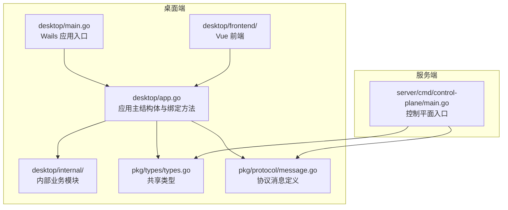
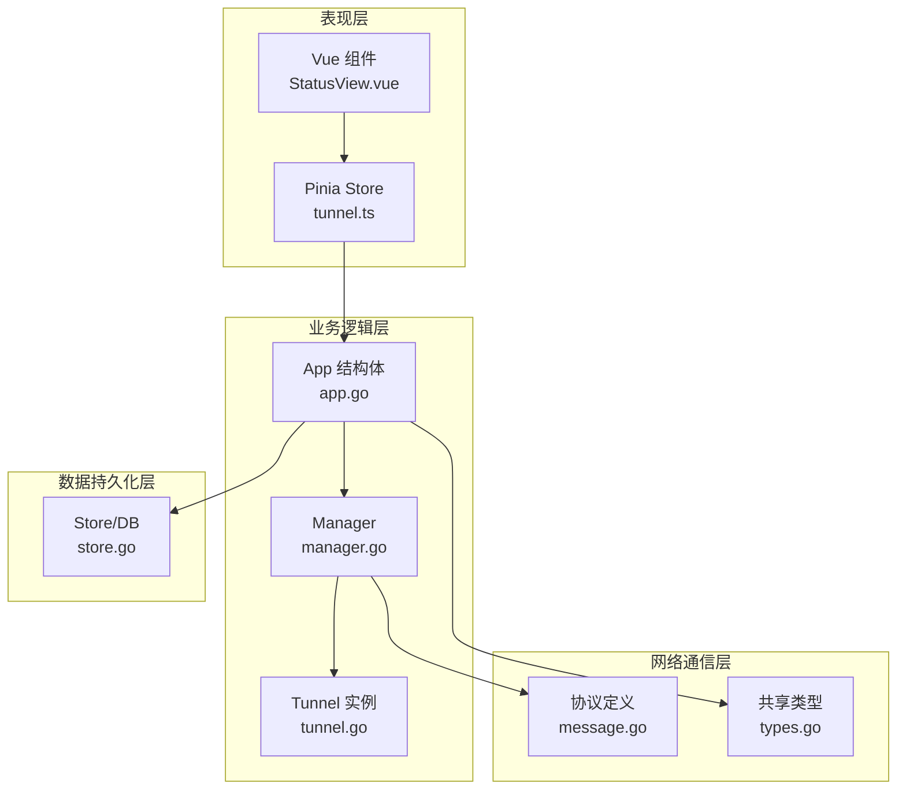
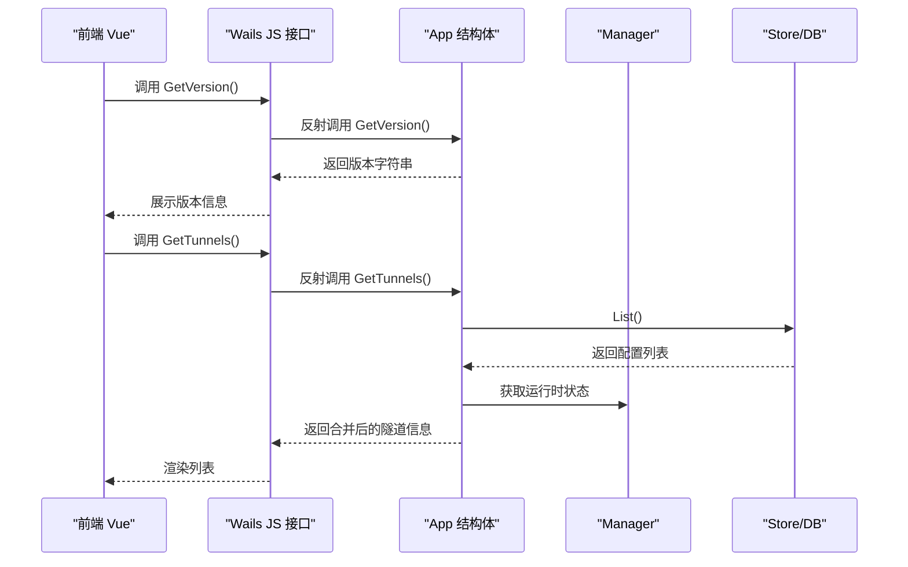
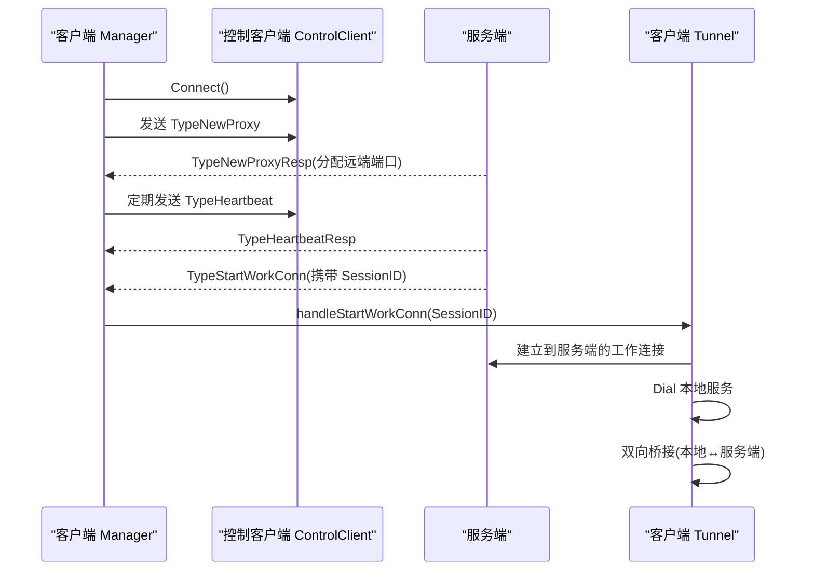
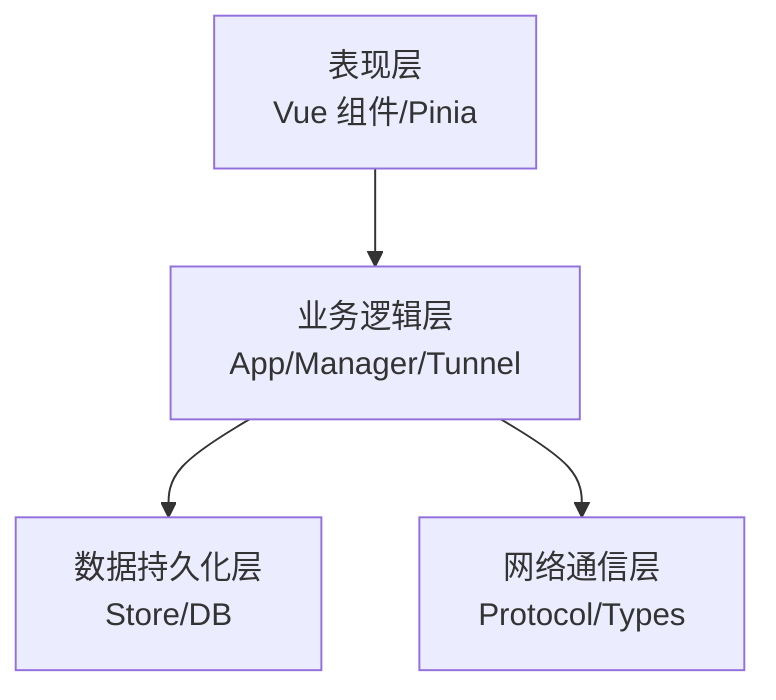
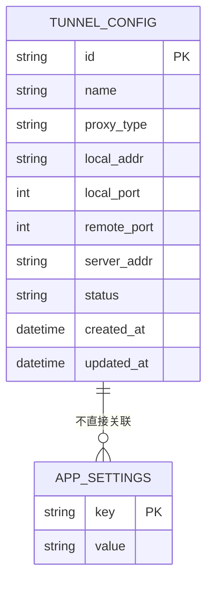
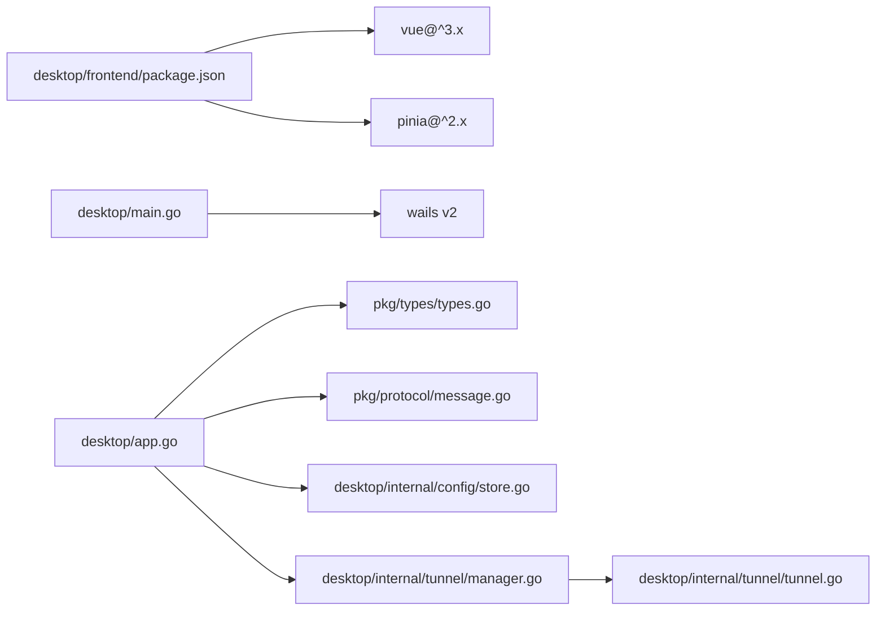

# 整体架构概览

<cite>
**本文档引用的文件**
- [README.md](file://README.md)
- [wails.json](file://desktop/wails.json)
- [main.go](file://desktop/main.go)
- [app.go](file://desktop/app.go)
- [main.ts](file://desktop/frontend/src/main.ts)
- [App.vue](file://desktop/frontend/src/App.vue)
- [StatusView.vue](file://desktop/frontend/src/views/StatusView.vue)
- [tunnel.ts](file://desktop/frontend/src/stores/tunnel.ts)
- [types.go](file://pkg/types/types.go)
- [message.go](file://pkg/protocol/message.go)
- [manager.go](file://desktop/internal/tunnel/manager.go)
- [tunnel.go](file://desktop/internal/tunnel/tunnel.go)
- [store.go](file://desktop/internal/config/store.go)
- [main.go](file://server/cmd/control-plane/main.go)
</cite>

## 目录
1. [简介](#简介)
2. [项目结构](#项目结构)
3. [核心组件](#核心组件)
4. [架构总览](#架构总览)
5. [详细组件分析](#详细组件分析)
6. [依赖关系分析](#依赖关系分析)
7. [性能考量](#性能考量)
8. [故障排查指南](#故障排查指南)
9. [结论](#结论)
10. [附录](#附录)

## 简介
NexTunnel 是一款基于 FRP 思想的可视化内网穿透管理工具，采用“桌面端 + 服务端”的双模式架构：桌面端通过 Wails 将 Go 后端与 Vue 前端整合为原生应用；服务端提供中继与控制平面能力。系统以分层架构设计实现清晰的职责分离，并通过自定义协议与服务端进行控制通道通信，结合工作连接桥接实现透明代理转发。

## 项目结构
项目采用多模块组织方式：
- desktop：Wails 桌面端（Go + Vue），包含前端工程、内部业务逻辑与配置存储
- server：服务端（Go），包含控制平面、中继与 NAT 检测等子命令
- pkg：共享类型与协议定义，供客户端与服务端复用
- docs：项目文档
- 其他脚本与配置文件

图表来源
- [main.go:1-37](file://desktop/main.go#L1-L37)
- [app.go:1-208](file://desktop/app.go#L1-L208)
- [types.go:1-50](file://pkg/types/types.go#L1-L50)
- [message.go:1-203](file://pkg/protocol/message.go#L1-L203)
- [main.go:1-12](file://server/cmd/control-plane/main.go#L1-L12)

章节来源
- [README.md:1-20](file://README.md#L1-L20)
- [wails.json:1-14](file://desktop/wails.json#L1-L14)

## 核心组件
- Wails 应用入口与生命周期：负责窗口初始化、资源嵌入、启动/关闭回调绑定
- 应用主结构体 App：承载日志、隧道管理器、数据库与配置存储，暴露前端可调用的方法
- 前端（Vue）：状态管理与视图渲染，通过 Pinia Store 调用后端接口
- 隧道管理器（Manager）：客户端控制通道编排，注册/心跳/动态增删隧道
- 单隧道实例（Tunnel）：工作连接建立与双向数据桥接
- 数据持久化（Store/DB）：SQLite 存储隧道配置与应用设置
- 共享类型与协议：统一 Proxy 类型、状态枚举与控制消息格式

章节来源
- [main.go:15-37](file://desktop/main.go#L15-L37)
- [app.go:17-76](file://desktop/app.go#L17-L76)
- [main.ts:1-8](file://desktop/frontend/src/main.ts#L1-L8)
- [App.vue:13-27](file://desktop/frontend/src/App.vue#L13-L27)
- [tunnel.ts:23-82](file://desktop/frontend/src/stores/tunnel.ts#L23-L82)
- [manager.go:16-58](file://desktop/internal/tunnel/manager.go#L16-L58)
- [tunnel.go:16-36](file://desktop/internal/tunnel/tunnel.go#L16-L36)
- [store.go:23-31](file://desktop/internal/config/store.go#L23-L31)
- [types.go:6-49](file://pkg/types/types.go#L6-L49)

## 架构总览
系统采用分层架构：
- 表现层：Vue 前端 + Pinia 状态管理，负责用户交互与展示
- 业务逻辑层：App 结构体与隧道管理器，负责配置加载、状态聚合与控制通道编排
- 数据持久化层：SQLite + Store，负责隧道配置与应用设置的读写
- 网络通信层：自定义协议（JSON 化消息）+ TCP 控制通道 + 工作连接桥接

图表来源
- [StatusView.vue:1-252](file://desktop/frontend/src/views/StatusView.vue#L1-L252)
- [tunnel.ts:1-83](file://desktop/frontend/src/stores/tunnel.ts#L1-L83)
- [app.go:1-208](file://desktop/app.go#L1-L208)
- [manager.go:1-310](file://desktop/internal/tunnel/manager.go#L1-L310)
- [tunnel.go:1-138](file://desktop/internal/tunnel/tunnel.go#L1-L138)
- [store.go:1-165](file://desktop/internal/config/store.go#L1-L165)
- [message.go:1-203](file://pkg/protocol/message.go#L1-L203)
- [types.go:1-50](file://pkg/types/types.go#L1-L50)

## 详细组件分析

### Wails 应用与前后端绑定
- 应用入口通过 Wails 初始化窗口、嵌入前端资源、注册启动/关闭回调，并将 App 实例绑定到前端可调用方法
- 前端通过生成的 JS 接口调用后端方法，实现版本查询、隧道 CRUD、连接状态与流量统计查询

图表来源
- [main.go:18-31](file://desktop/main.go#L18-L31)
- [app.go:87-139](file://desktop/app.go#L87-L139)
- [store.go:79-99](file://desktop/internal/config/store.go#L79-L99)
- [manager.go:285-295](file://desktop/internal/tunnel/manager.go#L285-L295)

章节来源
- [main.go:15-37](file://desktop/main.go#L15-L37)
- [app.go:87-203](file://desktop/app.go#L87-L203)
- [main.ts:1-8](file://desktop/frontend/src/main.ts#L1-L8)
- [App.vue:13-27](file://desktop/frontend/src/App.vue#L13-L27)
- [tunnel.ts:34-70](file://desktop/frontend/src/stores/tunnel.ts#L34-L70)

### 控制通道与工作连接
- 控制通道：Manager 通过 ControlClient 连接服务端，发送认证、注册新隧道、心跳等消息；接收服务器下发的工作连接请求
- 工作连接：当收到 StartWorkConn 消息后，Tunnel 在本地与远端之间建立桥接，实现透明数据转发

图表来源
- [manager.go:82-112](file://desktop/internal/tunnel/manager.go#L82-L112)
- [manager.go:158-197](file://desktop/internal/tunnel/manager.go#L158-L197)
- [tunnel.go:38-84](file://desktop/internal/tunnel/tunnel.go#L38-L84)
- [message.go:9-19](file://pkg/protocol/message.go#L9-L19)
- [message.go:139-153](file://pkg/protocol/message.go#L139-L153)

章节来源
- [manager.go:65-117](file://desktop/internal/tunnel/manager.go#L65-L117)
- [manager.go:158-197](file://desktop/internal/tunnel/manager.go#L158-L197)
- [tunnel.go:38-124](file://desktop/internal/tunnel/tunnel.go#L38-L124)
- [message.go:24-28](file://pkg/protocol/message.go#L24-L28)

### 分层架构与职责划分
- 表现层（Vue）：负责 UI 渲染、用户输入处理与定时刷新状态
- 业务逻辑层（App/Manager/Tunnel）：负责配置加载、状态聚合、控制通道编排与工作连接桥接
- 数据持久化层（Store/DB）：负责隧道配置与应用设置的 CRUD 与查询
- 网络通信层（Protocol/Types）：定义消息类型、负载结构与共享枚举

图表来源
- [StatusView.vue:1-252](file://desktop/frontend/src/views/StatusView.vue#L1-L252)
- [tunnel.ts:1-83](file://desktop/frontend/src/stores/tunnel.ts#L1-L83)
- [app.go:1-208](file://desktop/app.go#L1-L208)
- [manager.go:1-310](file://desktop/internal/tunnel/manager.go#L1-L310)
- [store.go:1-165](file://desktop/internal/config/store.go#L1-L165)
- [message.go:1-203](file://pkg/protocol/message.go#L1-L203)
- [types.go:1-50](file://pkg/types/types.go#L1-L50)

章节来源
- [StatusView.vue:1-252](file://desktop/frontend/src/views/StatusView.vue#L1-L252)
- [tunnel.ts:1-83](file://desktop/frontend/src/stores/tunnel.ts#L1-L83)
- [app.go:1-208](file://desktop/app.go#L1-L208)
- [manager.go:1-310](file://desktop/internal/tunnel/manager.go#L1-L310)
- [store.go:1-165](file://desktop/internal/config/store.go#L1-L165)
- [message.go:1-203](file://pkg/protocol/message.go#L1-L203)
- [types.go:1-50](file://pkg/types/types.go#L1-L50)

### 配置与状态模型
- 隧道配置：包含名称、类型、本地地址与端口、远端端口、服务器地址、状态与时间戳
- 应用设置：键值对形式存储（如 ClientID）
- 共享类型：ProxyType、ProxyStatus、ClientInfo、ProxyInfo 等

图表来源
- [store.go:9-21](file://desktop/internal/config/store.go#L9-L21)
- [store.go:148-164](file://desktop/internal/config/store.go#L148-L164)

章节来源
- [store.go:9-21](file://desktop/internal/config/store.go#L9-L21)
- [store.go:148-164](file://desktop/internal/config/store.go#L148-L164)
- [types.go:24-49](file://pkg/types/types.go#L24-L49)

## 依赖关系分析
- 前端依赖：Vue 3、Pinia、TypeScript、Vite
- 后端依赖：Go 生态（标准库与第三方库）、Wails 框架
- 共享依赖：pkg/types 与 pkg/protocol 提供跨端一致性

图表来源
- [package.json:12-25](file://desktop/frontend/package.json#L12-L25)
- [main.go:3-10](file://desktop/main.go#L3-L10)
- [app.go:3-15](file://desktop/app.go#L3-L15)
- [types.go:1-50](file://pkg/types/types.go#L1-L50)
- [message.go:1-203](file://pkg/protocol/message.go#L1-L203)
- [store.go:1-165](file://desktop/internal/config/store.go#L1-L165)
- [manager.go:1-310](file://desktop/internal/tunnel/manager.go#L1-L310)
- [tunnel.go:1-138](file://desktop/internal/tunnel/tunnel.go#L1-L138)

章节来源
- [package.json:12-25](file://desktop/frontend/package.json#L12-L25)
- [main.go:3-10](file://desktop/main.go#L3-L10)
- [app.go:3-15](file://desktop/app.go#L3-L15)

## 性能考量
- 连接重试与退避：Manager 使用指数退避与抖动策略降低重连风暴
- 心跳保活：周期性发送心跳并期望响应，维持长连接健康
- 并发桥接：工作连接采用 goroutine 并行双向复制，减少阻塞
- 前端轮询：Store 以固定间隔刷新状态，平衡实时性与开销
- 数据库：SQLite 本地存储，避免远程依赖；建议在高频更新场景下考虑 WAL 模式与索引优化

章节来源
- [manager.go:67-80](file://desktop/internal/tunnel/manager.go#L67-L80)
- [manager.go:199-217](file://desktop/internal/tunnel/manager.go#L199-L217)
- [tunnel.go:87-124](file://desktop/internal/tunnel/tunnel.go#L87-L124)
- [tunnel.ts:63-70](file://desktop/frontend/src/stores/tunnel.ts#L63-L70)

## 故障排查指南
- 连接失败：检查服务端地址与网络可达性；查看 Manager 的错误日志输出
- 注册失败：确认 TypeNewProxyResp 是否返回成功；核对远端端口分配
- 心跳异常：确认 TypeHeartbeat/TypeHeartbeatResp 往返是否正常
- 工作连接断开：检查本地服务监听与防火墙；关注桥接过程中的错误日志
- 前端无状态：确认定时刷新逻辑与 GetConnectionStatus/GetTrafficStats 的调用链路

章节来源
- [manager.go:83-112](file://desktop/internal/tunnel/manager.go#L83-L112)
- [manager.go:158-197](file://desktop/internal/tunnel/manager.go#L158-L197)
- [tunnel.go:38-84](file://desktop/internal/tunnel/tunnel.go#L38-L84)
- [tunnel.ts:63-70](file://desktop/frontend/src/stores/tunnel.ts#L63-L70)

## 结论
NexTunnel 通过 Wails 将 Go 的高性能与 Vue 的易用性结合，形成清晰的分层架构与稳定的控制通道协议。桌面端负责配置与状态管理、服务端负责中继与调度（当前控制平面尚未实现）。协议层与共享类型确保了跨端一致性，未来可在服务端完善控制平面与 NAT 检测能力，进一步提升可用性与安全性。

## 附录
- 当前服务端控制平面入口尚为占位实现，后续需补充控制与调度逻辑
- 建议在生产环境启用 TLS 与鉴权，强化控制通道与工作连接的安全性

章节来源
- [main.go:8-11](file://server/cmd/control-plane/main.go#L8-L11)