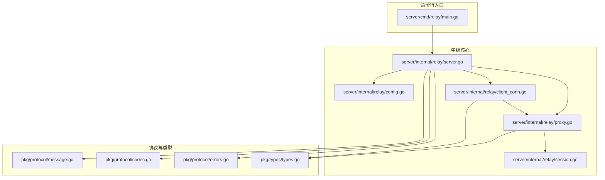
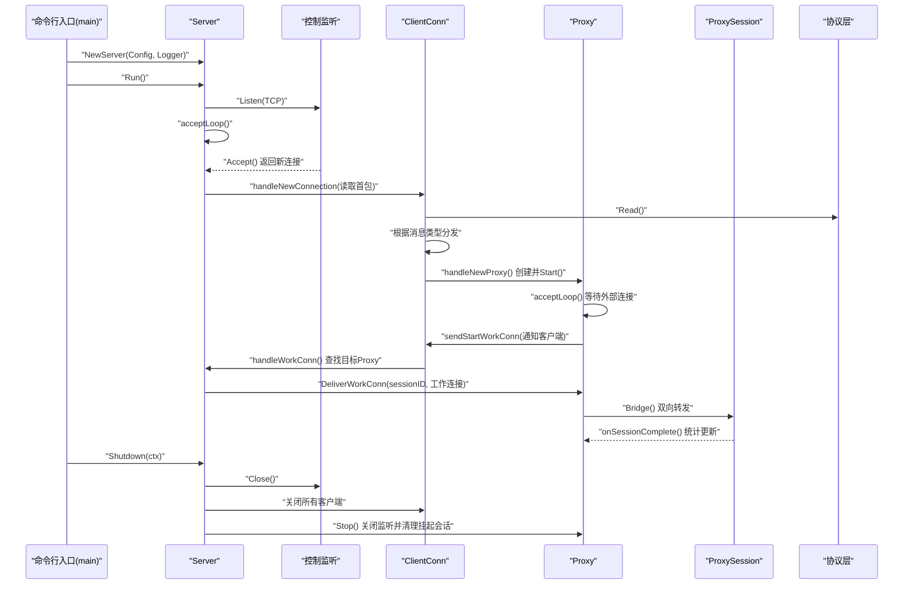
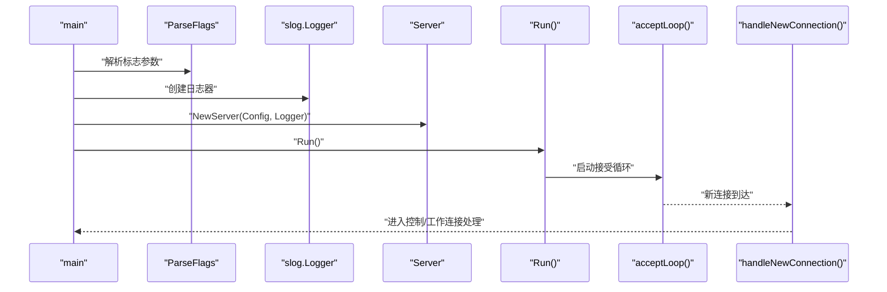
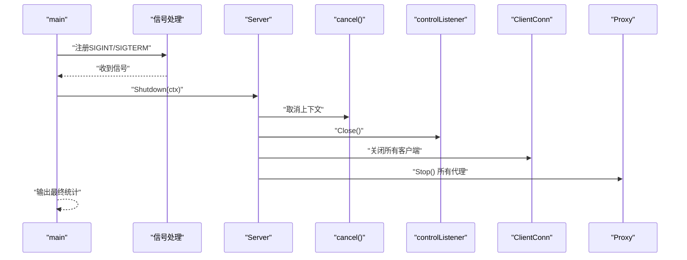
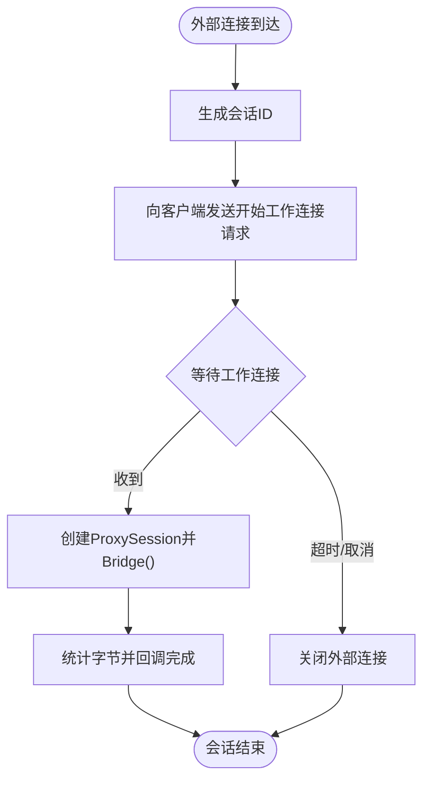

# 中继服务器核心

<cite>
**本文引用的文件**
- [server/cmd/relay/main.go](file://server/cmd/relay/main.go)
- [server/internal/relay/server.go](file://server/internal/relay/server.go)
- [server/internal/relay/config.go](file://server/internal/relay/config.go)
- [server/internal/relay/client_conn.go](file://server/internal/relay/client_conn.go)
- [server/internal/relay/proxy.go](file://server/internal/relay/proxy.go)
- [server/internal/relay/session.go](file://server/internal/relay/session.go)
- [pkg/protocol/message.go](file://pkg/protocol/message.go)
- [pkg/protocol/codec.go](file://pkg/protocol/codec.go)
- [pkg/protocol/errors.go](file://pkg/protocol/errors.go)
- [pkg/types/types.go](file://pkg/types/types.go)
- [server/go.mod](file://server/go.mod)
- [README.md](file://README.md)
</cite>

## 目录
1. [简介](#简介)
2. [项目结构](#项目结构)
3. [核心组件](#核心组件)
4. [架构总览](#架构总览)
5. [详细组件分析](#详细组件分析)
6. [依赖分析](#依赖分析)
7. [性能考虑](#性能考虑)
8. [故障排查指南](#故障排查指南)
9. [结论](#结论)
10. [附录](#附录)

## 简介
本文件面向NexTunnel中继服务器核心，聚焦于服务器启动流程、配置解析机制与运行时管理。文档从入口程序开始，逐步剖析服务器初始化、标志参数解析、日志系统配置、优雅关闭机制；随后深入并发模型、goroutine管理与资源清理策略，并给出生命周期管理、信号处理与超时控制的具体实现路径。最后提供可直接定位到源码位置的示例路径，帮助开发者快速理解服务器核心架构的设计理念与实现细节。

## 项目结构
NexTunnel服务端采用模块化组织：命令行入口位于server/cmd/relay，核心逻辑集中在server/internal/relay，协议与类型定义位于pkg目录。整体结构清晰，职责分离明确，便于维护与扩展。



图表来源
- [server/cmd/relay/main.go:15-81](file://server/cmd/relay/main.go#L15-L81)
- [server/internal/relay/server.go:13-306](file://server/internal/relay/server.go#L13-L306)
- [server/internal/relay/config.go:8-38](file://server/internal/relay/config.go#L8-L38)
- [server/internal/relay/client_conn.go:14-216](file://server/internal/relay/client_conn.go#L14-L216)
- [server/internal/relay/proxy.go:16-180](file://server/internal/relay/proxy.go#L16-L180)
- [server/internal/relay/session.go:19-79](file://server/internal/relay/session.go#L19-L79)
- [pkg/protocol/message.go:1-203](file://pkg/protocol/message.go#L1-L203)
- [pkg/protocol/codec.go:1-131](file://pkg/protocol/codec.go#L1-L131)
- [pkg/protocol/errors.go:1-15](file://pkg/protocol/errors.go#L1-L15)
- [pkg/types/types.go:1-50](file://pkg/types/types.go#L1-L50)

章节来源
- [README.md:1-20](file://README.md#L1-L20)
- [server/go.mod:1-11](file://server/go.mod#L1-L11)

## 核心组件
- 命令行入口与生命周期管理：负责解析标志、构建日志器、创建并运行服务器、周期性统计输出、信号监听与优雅关闭。
- 服务器核心：管理控制监听、客户端连接、代理实例注册与注销、全局统计与上下文传播。
- 客户端连接处理器：处理控制通道消息、心跳超时、代理注册/关闭、向客户端发送工作连接请求。
- 代理：对外暴露TCP监听，等待外部连接，协调工作连接交付，统计流量与会话数。
- 会话桥接：在外部连接与工作连接之间进行双向数据转发，统计字节数并回调完成事件。
- 协议层：定义消息类型、载荷结构、编解码与错误常量，保证跨进程通信一致性。

章节来源
- [server/cmd/relay/main.go:15-81](file://server/cmd/relay/main.go#L15-L81)
- [server/internal/relay/server.go:13-306](file://server/internal/relay/server.go#L13-L306)
- [server/internal/relay/client_conn.go:14-216](file://server/internal/relay/client_conn.go#L14-L216)
- [server/internal/relay/proxy.go:16-180](file://server/internal/relay/proxy.go#L16-L180)
- [server/internal/relay/session.go:19-79](file://server/internal/relay/session.go#L19-L79)
- [pkg/protocol/message.go:1-203](file://pkg/protocol/message.go#L1-L203)
- [pkg/protocol/codec.go:1-131](file://pkg/protocol/codec.go#L1-L131)
- [pkg/protocol/errors.go:1-15](file://pkg/protocol/errors.go#L1-L15)

## 架构总览
下图展示了从命令行入口到各核心组件的交互关系，以及控制通道与工作通道的协作方式。



图表来源
- [server/cmd/relay/main.go:26-70](file://server/cmd/relay/main.go#L26-L70)
- [server/internal/relay/server.go:43-103](file://server/internal/relay/server.go#L43-L103)
- [server/internal/relay/client_conn.go:84-129](file://server/internal/relay/client_conn.go#L84-L129)
- [server/internal/relay/proxy.go:47-118](file://server/internal/relay/proxy.go#L47-L118)
- [server/internal/relay/session.go:39-78](file://server/internal/relay/session.go#L39-L78)
- [pkg/protocol/message.go:83-163](file://pkg/protocol/message.go#L83-L163)

## 详细组件分析

### 命令行入口与生命周期管理
- 标志参数解析：使用标准库flag创建FlagSet，解析绑定地址、控制端口、心跳超时、每客户端最大代理数、工作连接超时等参数，并设置统计间隔。
- 日志系统：使用slog.NewTextHandler输出文本格式日志，默认级别为Info。
- 服务器创建与启动：调用NewServer创建Server实例，然后Run()启动控制监听与接受循环。
- 周期性统计：当统计间隔大于0时，启动一个goroutine按周期读取ServerStats并记录日志。
- 信号处理与优雅关闭：注册SIGINT/SIGTERM，收到信号后创建带超时的context，调用Shutdown()执行清理并输出最终统计。

章节来源
- [server/cmd/relay/main.go:15-81](file://server/cmd/relay/main.go#L15-L81)

### 配置解析机制
- 默认配置：提供DefaultConfig()，包含合理的默认值（如绑定地址、控制端口、心跳超时、每客户端最大代理数、工作连接超时）。
- 标志解析：ParseFlags(fs)将默认配置作为基线，通过fs.StringVar/IntVar/DurationVar绑定到字段上，返回最终配置对象。

章节来源
- [server/internal/relay/config.go:17-37](file://server/internal/relay/config.go#L17-L37)

### 服务器初始化与并发模型
- 上下文传播：Server内部持有根级context与cancel，用于统一控制生命周期。
- 控制监听：Run()创建TCP监听，记录启动信息，并启动acceptLoop()在独立goroutine中接受连接。
- 连接处理：acceptLoop()循环Accept()，每次接受到新连接即派生goroutine调用handleNewConnection()读取首包并分流至控制连接或工作连接处理。
- 并发安全：客户端集合与代理集合均使用互斥锁保护，避免竞态。
- 统计聚合：GetStats()遍历所有代理，汇总字节流入/流出与会话总数。

章节来源
- [server/internal/relay/server.go:30-55](file://server/internal/relay/server.go#L30-L55)
- [server/internal/relay/server.go:65-80](file://server/internal/relay/server.go#L65-L80)
- [server/internal/relay/server.go:82-103](file://server/internal/relay/server.go#L82-L103)
- [server/internal/relay/server.go:281-305](file://server/internal/relay/server.go#L281-L305)

### 客户端连接处理器
- 控制通道读循环：readLoop()持续读取消息，重置心跳定时器；支持注册新代理、关闭代理、心跳响应等消息类型。
- 心跳超时：resetHeartbeat()基于配置的HeartbeatTimeout创建定时器，到期自动关闭连接并取消上下文。
- 代理注册：handleNewProxy()校验数量上限与名称唯一性，构造ProxyInfo，创建Proxy并Start()，成功后向客户端返回结果并登记到Server。
- 代理关闭：handleCloseProxy()停止指定代理并从Server注销。
- 清理流程：cleanup()停止心跳、关闭代理、注销Server中的代理、移除客户端并关闭底层连接。

章节来源
- [server/internal/relay/client_conn.go:45-82](file://server/internal/relay/client_conn.go#L45-L82)
- [server/internal/relay/client_conn.go:172-181](file://server/internal/relay/client_conn.go#L172-L181)
- [server/internal/relay/client_conn.go:84-129](file://server/internal/relay/client_conn.go#L84-L129)
- [server/internal/relay/client_conn.go:142-162](file://server/internal/relay/client_conn.go#L142-L162)
- [server/internal/relay/client_conn.go:190-215](file://server/internal/relay/client_conn.go#L190-L215)

### 代理与会话桥接
- 外部监听：Start()在指定地址与端口启动TCP监听，记录实际端口并启动acceptLoop()。
- 接受外部连接：acceptLoop()为每个外部连接生成sessionID，创建等待通道，向客户端发送StartWorkConn消息，随后等待工作连接。
- 工作连接交付：handleWorkConn()根据ProxyName查找对应ClientConn，再由其代理deliver，最终在waitForWorkConn()中将外部连接与工作连接交由ProxySession桥接。
- 桥接与统计：ProxySession.Bridge()使用两个goroutine进行双向io.Copy，原子统计字节并回调onSessionComplete()更新代理统计。
- 停止与清理：Stop()取消上下文、关闭监听、关闭并清理所有挂起会话。

章节来源
- [server/internal/relay/proxy.go:47-118](file://server/internal/relay/proxy.go#L47-L118)
- [server/internal/relay/proxy.go:120-141](file://server/internal/relay/proxy.go#L120-L141)
- [server/internal/relay/session.go:39-78](file://server/internal/relay/session.go#L39-L78)
- [server/internal/relay/server.go:157-195](file://server/internal/relay/server.go#L157-L195)

### 协议层与消息编解码
- 消息类型：定义了认证、代理注册/响应、关闭代理、开始工作连接、工作连接、心跳与心跳响应等类型。
- 载荷结构：针对不同消息类型定义对应的payload结构体，使用JSON序列化/反序列化。
- 编解码：ReadMessage/WriteMessage实现头部+载荷的二进制帧格式，限制最大载荷大小，Conn封装并发安全的读写操作。
- 错误常量：提供载荷过大、未知消息类型、连接已关闭等错误。

章节来源
- [pkg/protocol/message.go:6-194](file://pkg/protocol/message.go#L6-L194)
- [pkg/protocol/codec.go:16-63](file://pkg/protocol/codec.go#L16-L63)
- [pkg/protocol/codec.go:65-131](file://pkg/protocol/codec.go#L65-L131)
- [pkg/protocol/errors.go:5-14](file://pkg/protocol/errors.go#L5-L14)

### 类图：核心类与关系
```mermaid
classDiagram
class Server {
+Run() error
+Addr() net.Addr
+Shutdown(ctx) error
+Done() <-chan struct{}
+GetClientCount() int
+GetProxyCount() int
+GetStats() ServerStats
}
class ClientConn {
+readLoop() void
+getProxy(name) *Proxy
+sendStartWorkConn(proxyName, sessionID) error
}
class Proxy {
+Start(bindAddr) error
+RemotePort() uint16
+DeliverWorkConn(sessionID, workConn) error
+Stop() void
+Stats() (bytesIn, bytesOut, sessions int64)
}
class ProxySession {
+Bridge() void
}
class Config {
+BindAddr string
+ControlPort int
+HeartbeatTimeout time.Duration
+MaxProxiesPerClient int
+WorkConnTimeout time.Duration
}
Server --> ClientConn : "管理"
Server --> Proxy : "注册/注销"
ClientConn --> Proxy : "创建/停止"
Proxy --> ProxySession : "桥接"
Server --> Config : "使用"
```

图表来源
- [server/internal/relay/server.go:13-306](file://server/internal/relay/server.go#L13-L306)
- [server/internal/relay/client_conn.go:14-216](file://server/internal/relay/client_conn.go#L14-L216)
- [server/internal/relay/proxy.go:16-180](file://server/internal/relay/proxy.go#L16-L180)
- [server/internal/relay/session.go:19-79](file://server/internal/relay/session.go#L19-L79)
- [server/internal/relay/config.go:8-38](file://server/internal/relay/config.go#L8-L38)

### 启动流程时序图


图表来源
- [server/cmd/relay/main.go:15-31](file://server/cmd/relay/main.go#L15-L31)
- [server/internal/relay/config.go:28-37](file://server/internal/relay/config.go#L28-L37)
- [server/internal/relay/server.go:43-55](file://server/internal/relay/server.go#L43-L55)
- [server/internal/relay/server.go:65-103](file://server/internal/relay/server.go#L65-L103)

### 优雅关闭流程时序图


图表来源
- [server/cmd/relay/main.go:58-80](file://server/cmd/relay/main.go#L58-L80)
- [server/internal/relay/server.go:216-251](file://server/internal/relay/server.go#L216-L251)

### 代理会话桥接流程图


图表来源
- [server/internal/relay/proxy.go:68-118](file://server/internal/relay/proxy.go#L68-L118)
- [server/internal/relay/session.go:39-78](file://server/internal/relay/session.go#L39-L78)

## 依赖分析
- 内部依赖：server/cmd/relay/main.go依赖server/internal/relay；server/internal/relay/*依赖pkg/protocol与pkg/types。
- 外部依赖：使用标准库context、flag、log/slog、net、os、os/signal、sync、time、encoding/json、binary、google/uuid等。
- 版本与替换：server/go.mod声明Go版本与依赖，其中github.com/nextunnel/pkg通过replace指向本地pkg目录。

章节来源
- [server/go.mod:1-11](file://server/go.mod#L1-L11)
- [pkg/protocol/message.go:1-203](file://pkg/protocol/message.go#L1-L203)
- [pkg/types/types.go:1-50](file://pkg/types/types.go#L1-L50)

## 性能考虑
- 并发模型：采用“单监听+多goroutine”模式，Accept()与消息读取均在独立goroutine中进行，避免阻塞主循环。
- 资源管理：使用互斥锁保护共享状态，原子变量用于会话统计，减少锁竞争。
- I/O桥接：使用io.Copy进行高效的数据转发，双向goroutine并行复制，提升吞吐。
- 超时控制：心跳超时、工作连接等待超时、优雅关闭超时，防止资源泄漏与阻塞。
- 日志开销：统计日志可按需禁用（stats-interval=0），降低高频日志对性能的影响。

## 故障排查指南
- 启动失败：检查监听地址与端口是否被占用，查看Run()返回的错误信息。
- 认证失败：确认客户端版本与协议版本一致，客户端ID非空且未重复连接。
- 代理注册失败：检查每客户端最大代理数限制、监听端口可用性与权限。
- 心跳超时：调整HeartbeatTimeout配置，确保网络稳定与客户端正常心跳。
- 工作连接超时：检查客户端是否及时响应StartWorkConn请求，必要时增大WorkConnTimeout。
- 优雅关闭异常：确认Shutdown()传入的context具有合理超时，避免无限等待。

章节来源
- [server/internal/relay/server.go:43-55](file://server/internal/relay/server.go#L43-L55)
- [server/internal/relay/server.go:105-155](file://server/internal/relay/server.go#L105-L155)
- [server/internal/relay/client_conn.go:172-181](file://server/internal/relay/client_conn.go#L172-L181)
- [server/internal/relay/proxy.go:102-118](file://server/internal/relay/proxy.go#L102-L118)
- [server/cmd/relay/main.go:64-70](file://server/cmd/relay/main.go#L64-L70)

## 结论
NexTunnel中继服务器以简洁清晰的模块划分与稳健的并发模型为核心，结合严格的协议层设计与完善的生命周期管理，实现了高可用、可观测、易维护的中继能力。通过标志参数解析、周期性统计、信号处理与优雅关闭，开发者可以快速部署并安全地运维中继服务。

## 附录
- 具体代码示例路径（仅提供路径，不展示具体代码内容）
  - 服务器启动与运行：[server/cmd/relay/main.go:26-31](file://server/cmd/relay/main.go#L26-L31)
  - 配置解析与默认值：[server/internal/relay/config.go:17-37](file://server/internal/relay/config.go#L17-L37)
  - 控制连接处理与认证：[server/internal/relay/server.go:82-103](file://server/internal/relay/server.go#L82-L103)
  - 客户端代理注册与心跳：[server/internal/relay/client_conn.go:84-129](file://server/internal/relay/client_conn.go#L84-L129)
  - 外部连接接受与工作连接交付：[server/internal/relay/proxy.go:68-118](file://server/internal/relay/proxy.go#L68-L118)
  - 会话桥接与统计：[server/internal/relay/session.go:39-78](file://server/internal/relay/session.go#L39-L78)
  - 协议消息类型与编解码：[pkg/protocol/message.go:6-194](file://pkg/protocol/message.go#L6-L194)
  - 协议编解码与并发安全：[pkg/protocol/codec.go:65-131](file://pkg/protocol/codec.go#L65-L131)
  - 代理统计查询：[server/internal/relay/proxy.go:176-179](file://server/internal/relay/proxy.go#L176-L179)
  - 服务器统计聚合：[server/internal/relay/server.go:281-305](file://server/internal/relay/server.go#L281-L305)