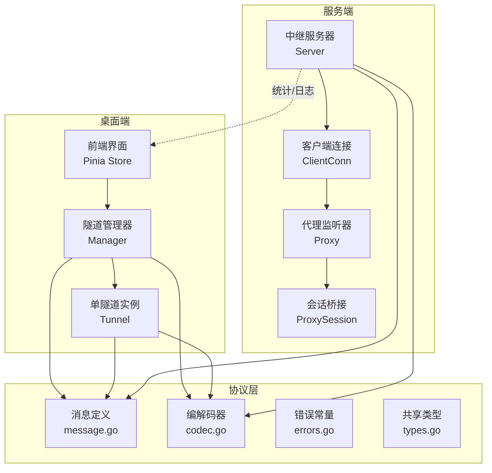
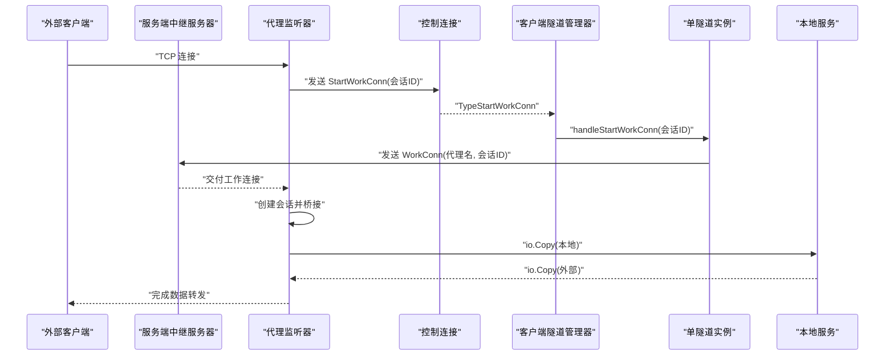
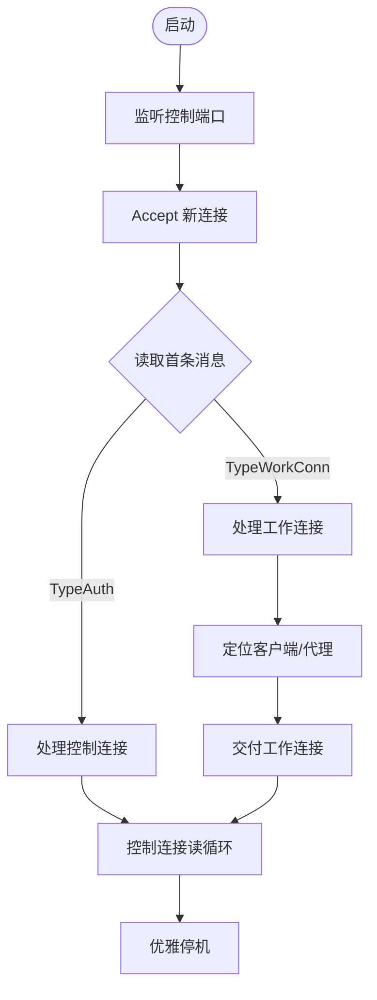
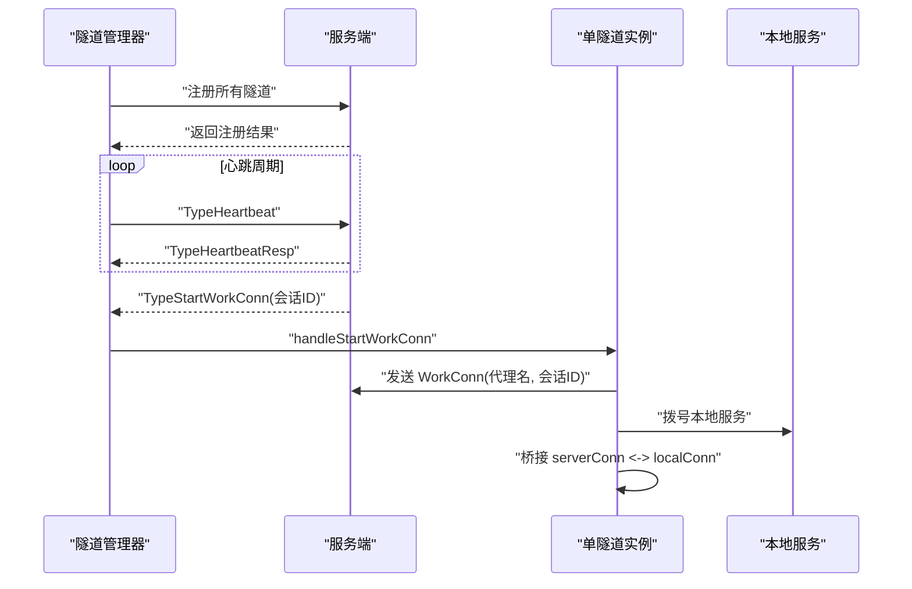
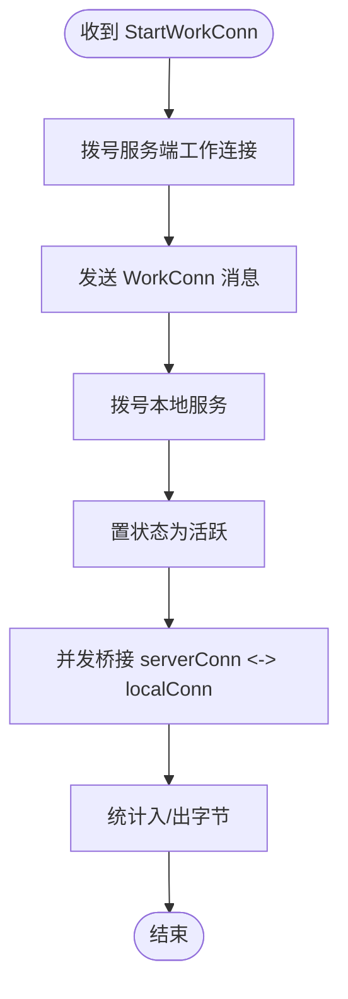
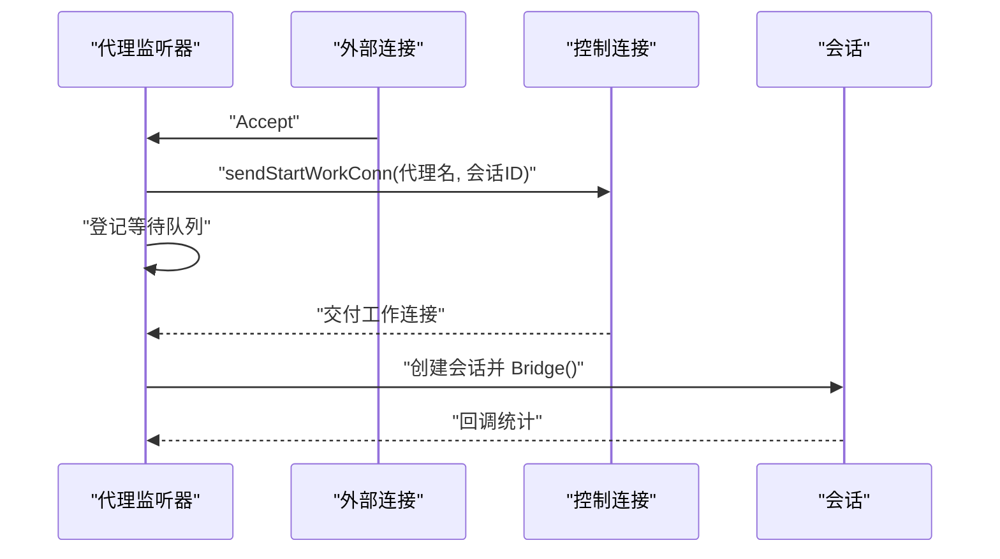
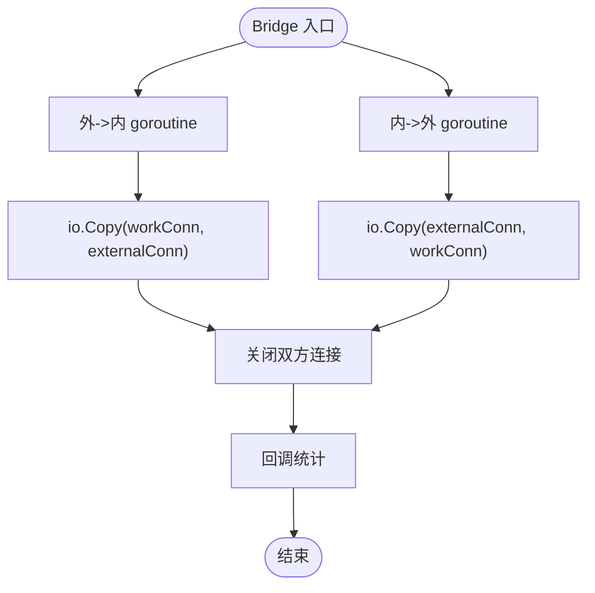
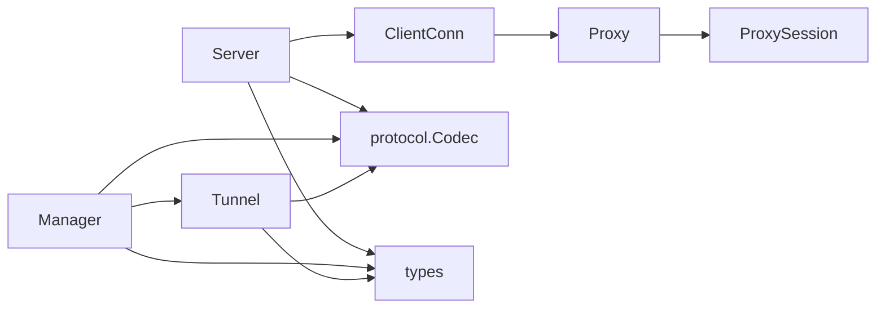

# 代理路由机制

<cite>
**本文引用的文件**
- [README.md](file://README.md)
- [server/internal/relay/server.go](file://server/internal/relay/server.go)
- [server/internal/relay/proxy.go](file://server/internal/relay/proxy.go)
- [server/internal/relay/client_conn.go](file://server/internal/relay/client_conn.go)
- [server/internal/relay/session.go](file://server/internal/relay/session.go)
- [server/internal/relay/config.go](file://server/internal/relay/config.go)
- [server/cmd/relay/main.go](file://server/cmd/relay/main.go)
- [desktop/internal/tunnel/manager.go](file://desktop/internal/tunnel/manager.go)
- [desktop/internal/tunnel/tunnel.go](file://desktop/internal/tunnel/tunnel.go)
- [pkg/protocol/message.go](file://pkg/protocol/message.go)
- [pkg/protocol/codec.go](file://pkg/protocol/codec.go)
- [pkg/protocol/errors.go](file://pkg/protocol/errors.go)
- [pkg/types/types.go](file://pkg/types/types.go)
- [desktop/frontend/src/stores/tunnel.ts](file://desktop/frontend/src/stores/tunnel.ts)
- [desktop/internal/tunnel/integration_test.go](file://desktop/internal/tunnel/integration_test.go)
</cite>

## 目录
1. [引言](#引言)
2. [项目结构](#项目结构)
3. [核心组件](#核心组件)
4. [架构总览](#架构总览)
5. [详细组件分析](#详细组件分析)
6. [依赖分析](#依赖分析)
7. [性能考虑](#性能考虑)
8. [故障排查指南](#故障排查指南)
9. [结论](#结论)
10. [附录](#附录)

## 引言
本文件面向开发者与运维人员，系统化阐述 NexTunnel 的代理路由机制：从客户端隧道建立、服务端代理监听与会话桥接，到消息协议、统计与监控、以及性能与可靠性保障。文档以代码级分析为基础，辅以图示与流程说明，帮助读者快速掌握代理连接的建立、数据转发与连接终止的完整闭环。

## 项目结构
NexTunnel 采用前后端分离的模块化设计：
- 服务端（Go）：提供中继服务，负责控制通道、外部监听、工作连接调度与会话桥接。
- 客户端（Go + Vue）：桌面端应用，负责与服务端建立控制连接、注册/注销代理、维护心跳、按需发起工作连接，并在本地与远端之间进行双向数据转发。
- 协议层（Go）：定义消息类型、编解码与错误语义，确保两端通信一致。
- 类型层（Go）：统一代理状态、信息与配置的结构体定义。

图表来源
- [server/internal/relay/server.go:13-41](file://server/internal/relay/server.go#L13-L41)
- [server/internal/relay/client_conn.go:14-43](file://server/internal/relay/client_conn.go#L14-L43)
- [server/internal/relay/proxy.go:16-45](file://server/internal/relay/proxy.go#L16-L45)
- [server/internal/relay/session.go:19-37](file://server/internal/relay/session.go#L19-L37)
- [desktop/internal/tunnel/manager.go:16-58](file://desktop/internal/tunnel/manager.go#L16-L58)
- [desktop/internal/tunnel/tunnel.go:16-36](file://desktop/internal/tunnel/tunnel.go#L16-L36)
- [pkg/protocol/message.go:6-22](file://pkg/protocol/message.go#L6-L22)
- [pkg/protocol/codec.go:65-131](file://pkg/protocol/codec.go#L65-L131)
- [pkg/types/types.go:6-42](file://pkg/types/types.go#L6-L42)

章节来源
- [README.md:1-20](file://README.md#L1-L20)

## 核心组件
- 服务端中继服务器：负责控制通道接入、客户端认证、代理注册/注销、工作连接分发与统计聚合。
- 客户端隧道管理器：负责与服务端建立控制连接、注册所有已配置隧道、维护心跳、接收工作连接请求并创建本地工作连接。
- 协议层：定义消息类型、消息头格式、读写编解码与错误语义；提供线程安全的协议连接包装。
- 类型层：统一代理状态、信息与配置的结构体，便于跨模块传递。

章节来源
- [server/internal/relay/server.go:13-41](file://server/internal/relay/server.go#L13-L41)
- [desktop/internal/tunnel/manager.go:16-58](file://desktop/internal/tunnel/manager.go#L16-L58)
- [pkg/protocol/message.go:6-22](file://pkg/protocol/message.go#L6-L22)
- [pkg/protocol/codec.go:65-131](file://pkg/protocol/codec.go#L65-L131)
- [pkg/types/types.go:6-42](file://pkg/types/types.go#L6-L42)

## 架构总览
下图展示了从外部访问到本地服务的完整路径：外部连接经由服务端代理监听器接受，生成会话ID并请求客户端开启工作连接，随后服务端将工作连接交付给等待中的会话，最终通过双向桥接完成数据转发。

图表来源
- [server/internal/relay/proxy.go:68-118](file://server/internal/relay/proxy.go#L68-L118)
- [server/internal/relay/server.go:157-195](file://server/internal/relay/server.go#L157-L195)
- [desktop/internal/tunnel/manager.go:158-197](file://desktop/internal/tunnel/manager.go#L158-L197)
- [desktop/internal/tunnel/tunnel.go:38-85](file://desktop/internal/tunnel/tunnel.go#L38-L85)

## 详细组件分析

### 服务端中继服务器（Server）
- 职责
  - 启动控制监听，接受首个消息以区分控制连接与工作连接。
  - 处理客户端认证、代理注册/注销、心跳响应。
  - 将工作连接按代理名与会话ID分发至对应代理监听器。
  - 聚合统计：客户端数、代理数、会话总数、累计入/出字节。
- 关键流程
  - 控制连接：认证通过后登记客户端，进入读循环处理新代理/关闭代理/心跳。
  - 工作连接：根据代理名定位客户端，再定位代理，将工作连接交付给等待中的会话。
  - 停机：优雅关闭控制监听、断开所有客户端、停止所有代理监听器。

图表来源
- [server/internal/relay/server.go:44-103](file://server/internal/relay/server.go#L44-L103)
- [server/internal/relay/server.go:105-195](file://server/internal/relay/server.go#L105-L195)
- [server/internal/relay/server.go:216-251](file://server/internal/relay/server.go#L216-L251)

章节来源
- [server/internal/relay/server.go:13-41](file://server/internal/relay/server.go#L13-L41)
- [server/internal/relay/server.go:44-103](file://server/internal/relay/server.go#L44-L103)
- [server/internal/relay/server.go:105-195](file://server/internal/relay/server.go#L105-L195)
- [server/internal/relay/server.go:216-251](file://server/internal/relay/server.go#L216-L251)

### 客户端隧道管理器（Manager）
- 职责
  - 连接服务端并完成认证，批量注册所有已配置隧道。
  - 维护心跳，周期性发送心跳并接收响应。
  - 接收服务端的“开始工作连接”通知，触发本地工作连接创建。
  - 动态增删隧道并同步至服务端。
- 关键流程
  - 注册：对每个隧道构造消息并等待响应，记录远端端口，更新状态为活跃。
  - 心跳：定时发送心跳，收到响应则维持连接健康。
  - 工作连接：收到通知后异步拨号服务端工作连接，再拨本地服务，最后桥接双向数据。

图表来源
- [desktop/internal/tunnel/manager.go:65-112](file://desktop/internal/tunnel/manager.go#L65-L112)
- [desktop/internal/tunnel/manager.go:114-156](file://desktop/internal/tunnel/manager.go#L114-L156)
- [desktop/internal/tunnel/manager.go:158-197](file://desktop/internal/tunnel/manager.go#L158-L197)
- [desktop/internal/tunnel/manager.go:199-217](file://desktop/internal/tunnel/manager.go#L199-L217)
- [desktop/internal/tunnel/tunnel.go:38-85](file://desktop/internal/tunnel/tunnel.go#L38-L85)

章节来源
- [desktop/internal/tunnel/manager.go:16-58](file://desktop/internal/tunnel/manager.go#L16-L58)
- [desktop/internal/tunnel/manager.go:65-112](file://desktop/internal/tunnel/manager.go#L65-L112)
- [desktop/internal/tunnel/manager.go:114-156](file://desktop/internal/tunnel/manager.go#L114-L156)
- [desktop/internal/tunnel/manager.go:158-197](file://desktop/internal/tunnel/manager.go#L158-L197)
- [desktop/internal/tunnel/manager.go:199-217](file://desktop/internal/tunnel/manager.go#L199-L217)

### 单隧道实例（Tunnel）
- 职责
  - 响应服务端“开始工作连接”的指令，建立到服务端的工作连接与到本地服务的连接，并进行双向桥接。
  - 维护代理状态与入/出字节统计。
- 关键流程
  - 打开工作连接：拨号服务端、发送工作连接消息、拨本地服务、置状态为活跃。
  - 桥接：使用 io.Copy 在两个方向并发复制，统计字节数，任一方向结束即关闭双方连接。

图表来源
- [desktop/internal/tunnel/tunnel.go:38-85](file://desktop/internal/tunnel/tunnel.go#L38-L85)
- [desktop/internal/tunnel/tunnel.go:87-124](file://desktop/internal/tunnel/tunnel.go#L87-L124)

章节来源
- [desktop/internal/tunnel/tunnel.go:16-36](file://desktop/internal/tunnel/tunnel.go#L16-L36)
- [desktop/internal/tunnel/tunnel.go:38-85](file://desktop/internal/tunnel/tunnel.go#L38-L85)
- [desktop/internal/tunnel/tunnel.go:87-124](file://desktop/internal/tunnel/tunnel.go#L87-L124)
- [desktop/internal/tunnel/tunnel.go:126-138](file://desktop/internal/tunnel/tunnel.go#L126-L138)

### 代理监听器（Proxy）
- 职责
  - 在指定远程端口对外监听，接受外部连接并生成会话ID。
  - 请求客户端开启工作连接，并等待工作连接交付。
  - 创建会话并进行双向桥接，统计会话数与入/出字节。
- 关键流程
  - 接受外部连接：生成会话ID，登记等待队列，向客户端发送“开始工作连接”请求。
  - 等待工作连接：超时或取消时清理等待。
  - 交付工作连接：从等待队列取出并交给会话，会话完成后回调统计。

图表来源
- [server/internal/relay/proxy.go:47-100](file://server/internal/relay/proxy.go#L47-L100)
- [server/internal/relay/proxy.go:102-141](file://server/internal/relay/proxy.go#L102-L141)
- [server/internal/relay/proxy.go:169-179](file://server/internal/relay/proxy.go#L169-L179)

章节来源
- [server/internal/relay/proxy.go:16-45](file://server/internal/relay/proxy.go#L16-L45)
- [server/internal/relay/proxy.go:47-100](file://server/internal/relay/proxy.go#L47-L100)
- [server/internal/relay/proxy.go:102-141](file://server/internal/relay/proxy.go#L102-L141)
- [server/internal/relay/proxy.go:169-179](file://server/internal/relay/proxy.go#L169-L179)

### 会话桥接（ProxySession）
- 职责
  - 在外部连接与工作连接之间进行双向数据复制，统计每方向字节数。
  - 任一方向结束即关闭双方连接，保证资源回收。
- 关键流程
  - 并发复制：两路 goroutine 分别处理外到内的上传与内到外的下载。
  - 统计上报：会话结束后调用回调，汇总入/出字节。

图表来源
- [server/internal/relay/session.go:39-79](file://server/internal/relay/session.go#L39-L79)

章节来源
- [server/internal/relay/session.go:10-17](file://server/internal/relay/session.go#L10-L17)
- [server/internal/relay/session.go:39-79](file://server/internal/relay/session.go#L39-L79)

### 客户端连接（ClientConn）
- 职责
  - 处理来自客户端的控制消息：注册新代理、关闭代理、心跳。
  - 维护心跳定时器，超时则关闭连接。
  - 向客户端发送“开始工作连接”请求。
- 关键流程
  - 注册代理：校验配额与名称唯一性，启动代理监听器并返回结果。
  - 关闭代理：停止代理监听器并从全局映射移除。
  - 心跳：每次消息到达重置定时器，超时自动清理。

章节来源
- [server/internal/relay/client_conn.go:45-82](file://server/internal/relay/client_conn.go#L45-L82)
- [server/internal/relay/client_conn.go:84-129](file://server/internal/relay/client_conn.go#L84-L129)
- [server/internal/relay/client_conn.go:142-162](file://server/internal/relay/client_conn.go#L142-L162)
- [server/internal/relay/client_conn.go:172-181](file://server/internal/relay/client_conn.go#L172-L181)

### 协议层（消息与编解码）
- 消息类型
  - 认证、认证响应、新建代理、新建代理响应、关闭代理、开始工作连接、工作连接、心跳、心跳响应。
- 编解码
  - 固定头部：1 字节类型 + 4 字节长度；payload 最大 16MB。
  - 提供线程安全的协议连接包装，支持并发读写与连接关闭状态保护。
- 错误
  - 超长载荷、未知消息类型、连接已关闭等。

章节来源
- [pkg/protocol/message.go:6-22](file://pkg/protocol/message.go#L6-L22)
- [pkg/protocol/message.go:165-194](file://pkg/protocol/message.go#L165-L194)
- [pkg/protocol/codec.go:16-63](file://pkg/protocol/codec.go#L16-L63)
- [pkg/protocol/codec.go:65-131](file://pkg/protocol/codec.go#L65-L131)
- [pkg/protocol/errors.go:5-14](file://pkg/protocol/errors.go#L5-L14)

### 配置与运行
- 服务端配置
  - 绑定地址、控制端口、心跳超时、每客户端最大代理数、工作连接超时。
- 服务端运行
  - 启动控制监听，周期性输出统计，捕获信号后优雅停机。
- 客户端配置
  - 服务器地址、客户端ID、隧道列表、重连基线/最大延迟、心跳间隔。

章节来源
- [server/internal/relay/config.go:8-38](file://server/internal/relay/config.go#L8-L38)
- [server/cmd/relay/main.go:15-81](file://server/cmd/relay/main.go#L15-L81)
- [desktop/internal/tunnel/config.go:6-36](file://desktop/internal/tunnel/config.go#L6-L36)

## 依赖分析
- 组件耦合
  - 服务端 Server 通过 ClientConn 管理客户端生命周期，通过 Proxy 管理代理监听器，通过 ProxySession 实现会话桥接。
  - 客户端 Manager 通过 ControlClient 与服务端交互，通过 Tunnel 实例管理单个隧道。
- 外部依赖
  - 协议层提供统一的消息与编解码接口，类型层提供共享结构体。
- 循环依赖
  - 未发现直接循环依赖；Server 与 ClientConn 通过指针相互引用，但职责清晰，不构成循环。

图表来源
- [server/internal/relay/server.go:13-41](file://server/internal/relay/server.go#L13-L41)
- [server/internal/relay/client_conn.go:14-43](file://server/internal/relay/client_conn.go#L14-L43)
- [server/internal/relay/proxy.go:16-45](file://server/internal/relay/proxy.go#L16-L45)
- [server/internal/relay/session.go:19-37](file://server/internal/relay/session.go#L19-L37)
- [desktop/internal/tunnel/manager.go:16-58](file://desktop/internal/tunnel/manager.go#L16-L58)
- [desktop/internal/tunnel/tunnel.go:16-36](file://desktop/internal/tunnel/tunnel.go#L16-L36)
- [pkg/protocol/codec.go:65-131](file://pkg/protocol/codec.go#L65-L131)
- [pkg/types/types.go:6-42](file://pkg/types/types.go#L6-L42)

## 性能考虑
- 双向桥接
  - 使用 io.Copy 并发复制，避免额外缓冲区拷贝，降低 CPU 开销。
  - 通过 WaitGroup 等待两路 goroutine 结束，确保资源及时释放。
- 编解码与序列化
  - 消息头固定且短小，JSON 序列化仅用于控制消息，避免频繁大对象分配。
  - 载荷上限限制防止异常流量导致内存膨胀。
- 连接管理
  - 协议连接包装提供互斥锁保护读写，避免竞态。
  - 心跳超时自动清理长时间无活动的客户端连接，释放资源。
- 统计与可观测性
  - 原子计数器记录字节与会话数，减少锁竞争。
  - 服务端可周期性输出统计，便于运维观察。

章节来源
- [server/internal/relay/session.go:39-79](file://server/internal/relay/session.go#L39-L79)
- [pkg/protocol/codec.go:16-63](file://pkg/protocol/codec.go#L16-L63)
- [server/internal/relay/client_conn.go:172-181](file://server/internal/relay/client_conn.go#L172-L181)
- [server/cmd/relay/main.go:33-56](file://server/cmd/relay/main.go#L33-L56)

## 故障排查指南
- 无法建立控制连接
  - 检查服务端控制端口是否正确、网络可达；确认认证版本与客户端ID有效。
- 代理注册失败
  - 查看服务端日志中“代理名已存在”或“超过最大代理数”的提示；调整配置或清理冲突代理。
- 工作连接交付失败
  - 确认服务端已定位到正确的客户端与代理；检查会话是否超时或被取消。
- 心跳超时断开
  - 检查网络抖动与防火墙策略；适当增大心跳超时配置。
- 数据转发异常
  - 核查本地服务是否正常监听；对比入/出字节统计，定位瓶颈方向。

章节来源
- [server/internal/relay/server.go:105-156](file://server/internal/relay/server.go#L105-L156)
- [server/internal/relay/client_conn.go:84-129](file://server/internal/relay/client_conn.go#L84-L129)
- [server/internal/relay/proxy.go:120-141](file://server/internal/relay/proxy.go#L120-L141)
- [server/internal/relay/client_conn.go:172-181](file://server/internal/relay/client_conn.go#L172-L181)

## 结论
NexTunnel 的代理路由机制以“控制通道 + 外部监听 + 工作连接”为核心，通过严格的协议编解码、会话桥接与统计上报，实现了稳定高效的内网穿透。客户端负责按需创建工作连接并桥接数据，服务端负责代理注册、会话调度与资源回收。配合心跳与超时控制，整体具备良好的可靠性与可观测性。

## 附录

### 代理连接建立、数据转发与连接清理的完整流程（代码路径）
- 客户端注册与心跳
  - [desktop/internal/tunnel/manager.go:65-112](file://desktop/internal/tunnel/manager.go#L65-L112)
  - [desktop/internal/tunnel/manager.go:114-156](file://desktop/internal/tunnel/manager.go#L114-L156)
  - [desktop/internal/tunnel/manager.go:199-217](file://desktop/internal/tunnel/manager.go#L199-L217)
- 客户端工作连接创建与桥接
  - [desktop/internal/tunnel/tunnel.go:38-85](file://desktop/internal/tunnel/tunnel.go#L38-L85)
  - [desktop/internal/tunnel/tunnel.go:87-124](file://desktop/internal/tunnel/tunnel.go#L87-L124)
- 服务端代理监听与会话桥接
  - [server/internal/relay/proxy.go:47-100](file://server/internal/relay/proxy.go#L47-L100)
  - [server/internal/relay/proxy.go:102-141](file://server/internal/relay/proxy.go#L102-L141)
  - [server/internal/relay/session.go:39-79](file://server/internal/relay/session.go#L39-L79)
- 服务端工作连接交付
  - [server/internal/relay/server.go:157-195](file://server/internal/relay/server.go#L157-L195)
- 协议与类型
  - [pkg/protocol/message.go:6-22](file://pkg/protocol/message.go#L6-L22)
  - [pkg/protocol/codec.go:65-131](file://pkg/protocol/codec.go#L65-L131)
  - [pkg/types/types.go:6-42](file://pkg/types/types.go#L6-L42)

### 监控指标与统计
- 服务端统计
  - 客户端数量、代理数量、会话总数、累计入/出字节。
  - 输出周期可通过命令行参数配置。
- 客户端统计
  - 每隧道入/出字节、状态。
- 前端展示
  - 通过 Pinia Store 获取连接状态与流量统计，驱动界面刷新。

章节来源
- [server/internal/relay/server.go:282-305](file://server/internal/relay/server.go#L282-L305)
- [server/cmd/relay/main.go:33-56](file://server/cmd/relay/main.go#L33-L56)
- [desktop/internal/tunnel/tunnel.go:126-138](file://desktop/internal/tunnel/tunnel.go#L126-L138)
- [desktop/frontend/src/stores/tunnel.ts:63-70](file://desktop/frontend/src/stores/tunnel.ts#L63-L70)

### 负载均衡与故障转移
- 当前实现
  - 服务端按代理名与会话ID进行工作连接交付，未内置多实例/多副本的负载均衡与故障转移逻辑。
- 优化建议
  - 在服务端引入代理实例池与会话亲和策略，结合健康检查与熔断机制。
  - 客户端侧可扩展为多工作连接复用与快速切换，提升可用性。

[本节为概念性建议，不直接对应具体源码实现]

### 测试参考
- 端到端集成测试覆盖了重连、持久化与令牌生命周期等场景，可作为行为验证的参考。
  
章节来源
- [desktop/internal/tunnel/integration_test.go:193-298](file://desktop/internal/tunnel/integration_test.go#L193-L298)
- [desktop/internal/tunnel/integration_test.go:300-379](file://desktop/internal/tunnel/integration_test.go#L300-L379)
- [desktop/internal/tunnel/integration_test.go:381-444](file://desktop/internal/tunnel/integration_test.go#L381-L444)