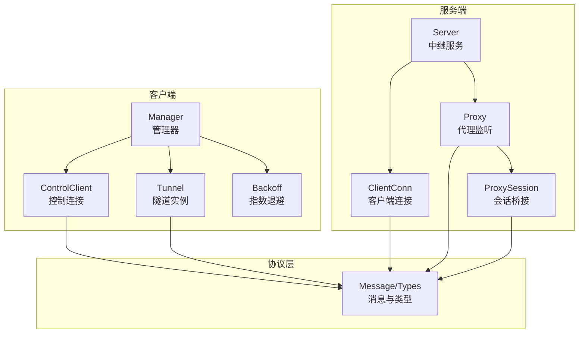
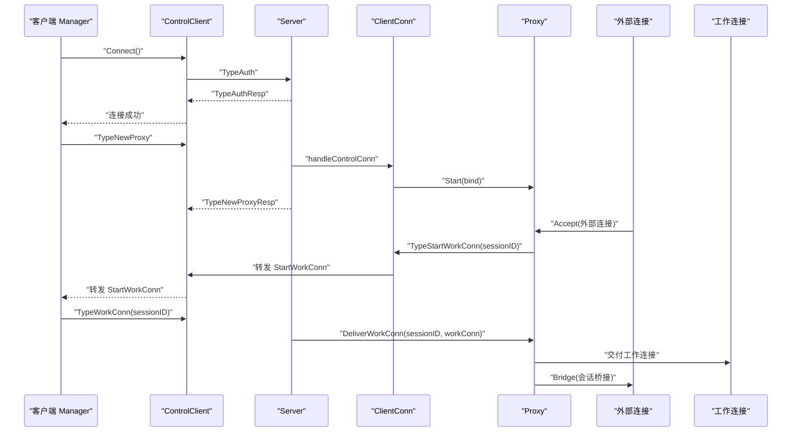
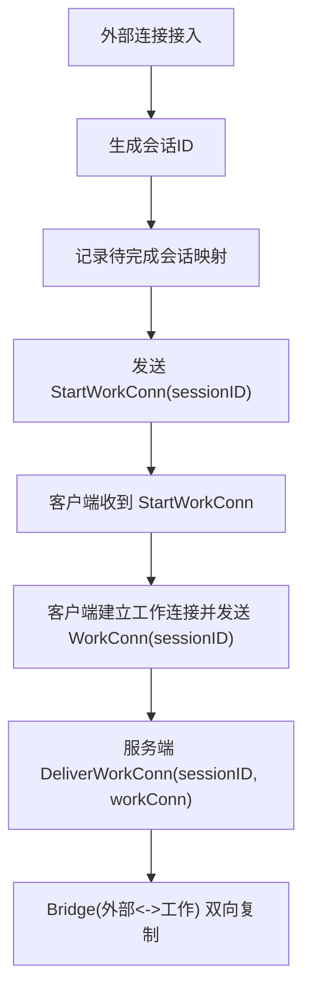
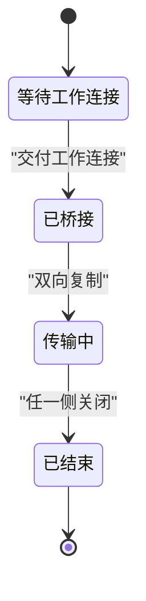
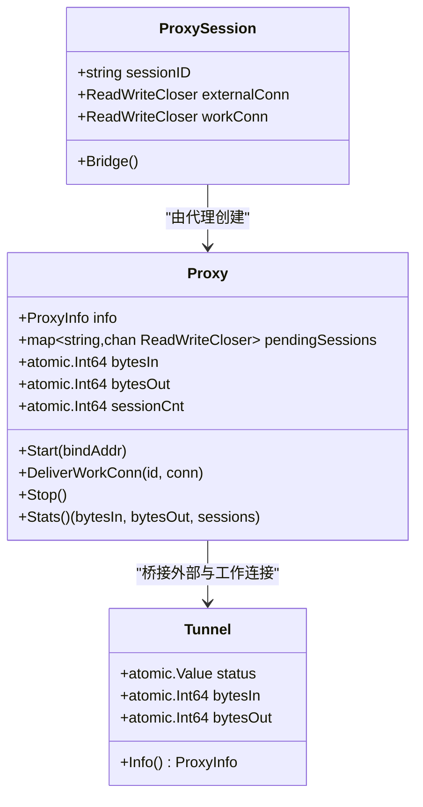
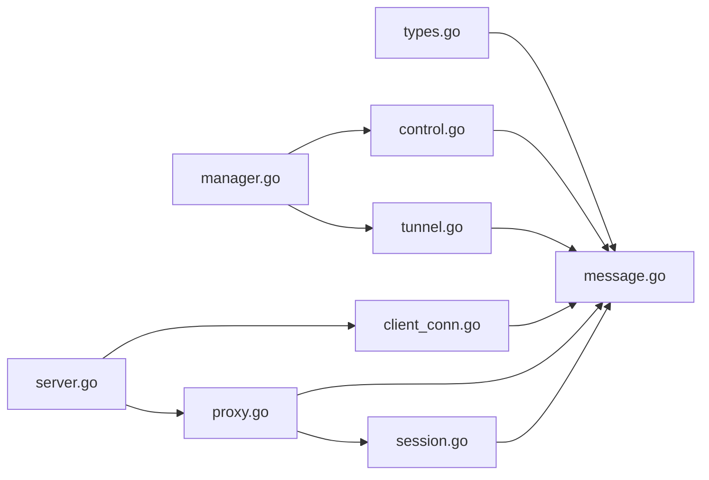

# 会话管理机制

<cite>
**本文引用的文件**
- [manager.go](file://desktop/internal/tunnel/manager.go)
- [tunnel.go](file://desktop/internal/tunnel/tunnel.go)
- [control.go](file://desktop/internal/tunnel/control.go)
- [reconnect.go](file://desktop/internal/tunnel/reconnect.go)
- [config.go](file://desktop/internal/tunnel/config.go)
- [types.go](file://pkg/types/types.go)
- [message.go](file://pkg/protocol/message.go)
- [client_conn.go](file://server/internal/relay/client_conn.go)
- [proxy.go](file://server/internal/relay/proxy.go)
- [session.go](file://server/internal/relay/session.go)
- [server.go](file://server/internal/relay/server.go)
- [config.go](file://server/internal/relay/config.go)
- [tunnel_test.go](file://desktop/internal/tunnel/tunnel_test.go)
- [integration_test.go](file://desktop/internal/tunnel/integration_test.go)
</cite>

## 目录
1. [引言](#引言)
2. [项目结构](#项目结构)
3. [核心组件](#核心组件)
4. [架构总览](#架构总览)
5. [详细组件分析](#详细组件分析)
6. [依赖分析](#依赖分析)
7. [性能考虑](#性能考虑)
8. [故障排查指南](#故障排查指南)
9. [结论](#结论)
10. [附录](#附录)

## 引言
本文件系统性梳理 NexTunnel 的会话管理机制，覆盖会话创建、维护与销毁全流程，解释会话状态管理、超时控制与资源清理策略；阐明会话 ID 生成与标识管理、会话生命周期；说明会话与客户端连接的关系、会话池管理与并发访问控制；并给出会话数据结构设计、状态转换图、异常处理机制、监控指标、性能优化与故障恢复方案。文末提供可定位到源码的路径，帮助开发者快速掌握会话管理的核心实现。

## 项目结构
NexTunnel 的会话管理横跨桌面客户端与服务端两部分：
- 客户端侧（desktop/internal/tunnel）：负责控制连接、隧道注册、工作连接建立、会话桥接与统计上报。
- 服务端侧（server/internal/relay）：负责外部监听、会话池管理、工作连接交付、统计聚合与心跳超时控制。

**图表来源**
- [manager.go:16-58](file://desktop/internal/tunnel/manager.go#L16-L58)
- [control.go:15-38](file://desktop/internal/tunnel/control.go#L15-L38)
- [tunnel.go:16-36](file://desktop/internal/tunnel/tunnel.go#L16-L36)
- [reconnect.go:28-61](file://desktop/internal/tunnel/reconnect.go#L28-L61)
- [message.go:24-28](file://pkg/protocol/message.go#L24-L28)
- [server.go:13-41](file://server/internal/relay/server.go#L13-L41)
- [client_conn.go:14-28](file://server/internal/relay/client_conn.go#L14-L28)
- [proxy.go:16-45](file://server/internal/relay/proxy.go#L16-L45)
- [session.go:19-37](file://server/internal/relay/session.go#L19-L37)

**章节来源**
- [manager.go:16-58](file://desktop/internal/tunnel/manager.go#L16-L58)
- [server.go:13-41](file://server/internal/relay/server.go#L13-L41)

## 核心组件
- 客户端管理器（Manager）
  - 负责控制连接生命周期、注册所有隧道、处理服务器消息、心跳循环、动态增删隧道、优雅停机。
  - 关键字段：配置、控制客户端、日志、隧道映射、上下文。
  - 关键方法：Start、registerAllTunnels、handleServerMessage、heartbeatLoop、Stop、AddTunnel、RemoveTunnel、GetStatus。
- 控制客户端（ControlClient）
  - 维护控制连接，发送/接收消息，线程安全写入，心跳响应，断开清理。
  - 关键字段：底层协议连接、消息通道、连接状态原子标志、互斥锁。
  - 关键方法：Connect、readLoop、Send、Messages、IsConnected、Close。
- 隧道（Tunnel）
  - 表示单个隧道，负责处理服务器请求的工作连接，建立与本地服务的桥接，统计字节数。
  - 关键字段：定义、管理器、日志、状态原子值、字节计数原子变量。
  - 关键方法：handleStartWorkConn、openWorkConn、bridgeConnections、Info。
- 服务端中继（Server）
  - 接受控制连接与工作连接，分发到对应客户端连接与代理，聚合统计。
  - 关键字段：配置、日志、控制监听、客户端映射、代理映射、上下文。
  - 关键方法：Run、handleNewConnection、handleControlConn、handleWorkConn、Shutdown、GetStats。
- 客户端连接（ClientConn）
  - 管理单个客户端的控制连接，处理新代理注册、关闭代理、心跳超时、清理。
  - 关键字段：客户端ID、协议连接、服务器指针、代理映射、心跳定时器、上下文。
  - 关键方法：readLoop、handleNewProxy、handleCloseProxy、sendStartWorkConn、resetHeartbeat、cleanup。
- 代理（Proxy）
  - 外部监听器，接受外部连接，生成会话ID，等待工作连接，桥接数据流，统计流量与会话数。
  - 关键字段：代理信息、客户端连接、监听器、日志、待完成会话映射、字节计数、会话计数、上下文。
  - 关键方法：Start、acceptLoop、waitForWorkConn、DeliverWorkConn、Stop、Stats。
- 会话（ProxySession）
  - 双向桥接外部连接与工作连接，统计入出字节，回调完成事件。
  - 关键字段：会话ID、外部连接、工作连接、日志、完成回调。
  - 关键方法：Bridge。
- 协议与类型（Message/Types）
  - 定义控制通道消息类型、负载结构、工厂函数与解码逻辑。
  - 类型：ProxyType、ProxyStatus、ProxyInfo、TunnelConfig、ClientInfo。
- 指数退避（Backoff）
  - 客户端重连策略，支持抖动与最大延迟限制。

**章节来源**
- [manager.go:16-310](file://desktop/internal/tunnel/manager.go#L16-L310)
- [control.go:15-155](file://desktop/internal/tunnel/control.go#L15-L155)
- [tunnel.go:16-138](file://desktop/internal/tunnel/tunnel.go#L16-L138)
- [server.go:13-306](file://server/internal/relay/server.go#L13-L306)
- [client_conn.go:14-216](file://server/internal/relay/client_conn.go#L14-L216)
- [proxy.go:16-180](file://server/internal/relay/proxy.go#L16-L180)
- [session.go:19-79](file://server/internal/relay/session.go#L19-L79)
- [message.go:6-203](file://pkg/protocol/message.go#L6-L203)
- [types.go:6-50](file://pkg/types/types.go#L6-L50)
- [reconnect.go:28-83](file://desktop/internal/tunnel/reconnect.go#L28-L83)

## 架构总览
下图展示了从客户端发起控制连接，到服务端代理监听、会话创建、工作连接交付与桥接的完整流程。

**图表来源**
- [control.go:40-95](file://desktop/internal/tunnel/control.go#L40-L95)
- [server.go:82-103](file://server/internal/relay/server.go#L82-L103)
- [client_conn.go:104-129](file://server/internal/relay/client_conn.go#L104-L129)
- [proxy.go:47-100](file://server/internal/relay/proxy.go#L47-L100)
- [proxy.go:120-141](file://server/internal/relay/proxy.go#L120-L141)
- [session.go:39-79](file://server/internal/relay/session.go#L39-L79)

## 详细组件分析

### 会话创建与会话ID管理
- 会话ID生成
  - 服务端在外部连接接入时生成唯一会话ID，并将外部连接与待完成工作连接进行映射。
  - 参考路径：[proxy.go:81-88](file://server/internal/relay/proxy.go#L81-L88)
- 会话标识与传递
  - 外部连接接入后，服务端通过控制通道向客户端发送“开始工作连接”消息，携带会话ID。
  - 客户端收到消息后，打开工作连接并发送“工作连接”消息，同样携带会话ID。
  - 服务端根据会话ID将工作连接交付给对应的外部连接，完成桥接。
  - 参考路径：[proxy.go:90-98](file://server/internal/relay/proxy.go#L90-L98)、[client_conn.go:164-170](file://server/internal/relay/client_conn.go#L164-L170)、[tunnel.go:58-68](file://desktop/internal/tunnel/tunnel.go#L58-L68)

**图表来源**
- [proxy.go:81-98](file://server/internal/relay/proxy.go#L81-L98)
- [client_conn.go:164-170](file://server/internal/relay/client_conn.go#L164-L170)
- [tunnel.go:58-68](file://desktop/internal/tunnel/tunnel.go#L58-L68)
- [session.go:39-79](file://server/internal/relay/session.go#L39-L79)

**章节来源**
- [proxy.go:81-141](file://server/internal/relay/proxy.go#L81-L141)
- [client_conn.go:164-170](file://server/internal/relay/client_conn.go#L164-L170)
- [tunnel.go:58-68](file://desktop/internal/tunnel/tunnel.go#L58-L68)
- [session.go:39-79](file://server/internal/relay/session.go#L39-L79)

### 会话状态管理与生命周期
- 客户端隧道状态
  - 使用原子值保存代理状态（active/inactive/error），在工作连接建立时置为 active，在移除或停止时置为 inactive。
  - 参考路径：[tunnel.go:22-34](file://desktop/internal/tunnel/tunnel.go#L22-L34)、[tunnel.go:78-79](file://desktop/internal/tunnel/tunnel.go#L78-L79)
- 服务端代理状态
  - 代理启动时绑定监听端口，停止时关闭监听并清理待完成会话映射。
  - 参考路径：[proxy.go:47-61](file://server/internal/relay/proxy.go#L47-L61)、[proxy.go:149-167](file://server/internal/relay/proxy.go#L149-L167)
- 会话状态转换图
  - 外部连接接入 → 等待工作连接 → 建立桥接 → 传输数据 → 会话结束 → 清理资源

**图表来源**
- [proxy.go:102-118](file://server/internal/relay/proxy.go#L102-L118)
- [session.go:39-79](file://server/internal/relay/session.go#L39-L79)

**章节来源**
- [tunnel.go:22-79](file://desktop/internal/tunnel/tunnel.go#L22-L79)
- [proxy.go:47-167](file://server/internal/relay/proxy.go#L47-L167)

### 会话与客户端连接的关系
- 控制连接与工作连接分离
  - 控制连接用于注册/注销代理、心跳、通知会话开始；工作连接用于实际数据传输。
  - 参考路径：[server.go:82-103](file://server/internal/relay/server.go#L82-L103)、[client_conn.go:104-129](file://server/internal/relay/client_conn.go#L104-L129)
- 心跳与超时
  - 客户端定期发送心跳；服务端在每次读取消息后重置心跳定时器；超时则关闭连接并清理。
  - 参考路径：[manager.go:199-217](file://desktop/internal/tunnel/manager.go#L199-L217)、[client_conn.go:172-181](file://server/internal/relay/client_conn.go#L172-L181)

**章节来源**
- [server.go:82-155](file://server/internal/relay/server.go#L82-L155)
- [client_conn.go:172-181](file://server/internal/relay/client_conn.go#L172-L181)
- [manager.go:199-217](file://desktop/internal/tunnel/manager.go#L199-L217)

### 会话池管理与并发访问控制
- 待完成会话池
  - 服务端使用映射保存“会话ID → 等待中的工作连接通道”，按会话ID精确交付。
  - 参考路径：[proxy.go:23-28](file://server/internal/relay/proxy.go#L23-L28)、[proxy.go:84-88](file://server/internal/relay/proxy.go#L84-L88)、[proxy.go:120-141](file://server/internal/relay/proxy.go#L120-L141)
- 并发桥接
  - 会话桥接采用 goroutine 并发双向复制，使用 WaitGroup 等待双方完成，使用 Once 保证只关闭一次。
  - 参考路径：[session.go:41-79](file://server/internal/relay/session.go#L41-L79)、[tunnel.go:87-124](file://desktop/internal/tunnel/tunnel.go#L87-L124)

**章节来源**
- [proxy.go:23-141](file://server/internal/relay/proxy.go#L23-L141)
- [session.go:41-79](file://server/internal/relay/session.go#L41-L79)
- [tunnel.go:87-124](file://desktop/internal/tunnel/tunnel.go#L87-L124)

### 超时控制与资源清理
- 心跳超时
  - 服务端在每次读取消息后重置心跳定时器；超时触发清理流程，关闭连接与代理。
  - 参考路径：[client_conn.go:172-181](file://server/internal/relay/client_conn.go#L172-L181)、[client_conn.go:190-215](file://server/internal/relay/client_conn.go#L190-L215)
- 工作连接交付超时
  - 服务端在等待工作连接时未在预期时间内收到交付，将关闭外部连接并移除待完成项。
  - 参考路径：[proxy.go:102-118](file://server/internal/relay/proxy.go#L102-L118)
- 断线重连
  - 客户端使用指数退避+抖动策略自动重连，成功后重置尝试次数。
  - 参考路径：[reconnect.go:39-82](file://desktop/internal/tunnel/reconnect.go#L39-L82)、[manager.go:67-80](file://desktop/internal/tunnel/manager.go#L67-L80)

**章节来源**
- [client_conn.go:172-215](file://server/internal/relay/client_conn.go#L172-L215)
- [proxy.go:102-118](file://server/internal/relay/proxy.go#L102-L118)
- [reconnect.go:39-82](file://desktop/internal/tunnel/reconnect.go#L39-L82)
- [manager.go:67-80](file://desktop/internal/tunnel/manager.go#L67-L80)

### 会话数据结构设计
- 会话统计（SessionStats）
  - 记录来自外部到工作连接的入站字节与从工作到外部的出站字节。
  - 参考路径：[session.go:10-14](file://server/internal/relay/session.go#L10-L14)
- 代理统计（Proxy）
  - 代理层面累计字节与会话数量，提供查询接口。
  - 参考路径：[proxy.go:26-28](file://server/internal/relay/proxy.go#L26-L28)、[proxy.go:169-179](file://server/internal/relay/proxy.go#L169-L179)
- 隧道统计（Tunnel）
  - 隧道层面累计字节，提供 Info 查询。
  - 参考路径：[tunnel.go:22-24](file://desktop/internal/tunnel/tunnel.go#L22-L24)、[tunnel.go:126-137](file://desktop/internal/tunnel/tunnel.go#L126-L137)

**图表来源**
- [session.go:19-37](file://server/internal/relay/session.go#L19-L37)
- [proxy.go:16-45](file://server/internal/relay/proxy.go#L16-L45)
- [tunnel.go:16-36](file://desktop/internal/tunnel/tunnel.go#L16-L36)

**章节来源**
- [session.go:10-79](file://server/internal/relay/session.go#L10-L79)
- [proxy.go:16-179](file://server/internal/relay/proxy.go#L16-L179)
- [tunnel.go:16-137](file://desktop/internal/tunnel/tunnel.go#L16-L137)

### 异常处理机制
- 控制连接异常
  - 读取失败、消息类型不匹配、认证失败等均记录错误并关闭连接。
  - 参考路径：[control.go:98-122](file://desktop/internal/tunnel/control.go#L98-L122)、[server.go:105-155](file://server/internal/relay/server.go#L105-L155)
- 代理注册异常
  - 代理名冲突、超出最大代理数、监听失败等情况返回失败响应。
  - 参考路径：[client_conn.go:84-129](file://server/internal/relay/client_conn.go#L84-L129)
- 会话交付异常
  - 无待完成会话、通道已满等情况直接关闭工作连接。
  - 参考路径：[proxy.go:120-141](file://server/internal/relay/proxy.go#L120-L141)

**章节来源**
- [control.go:98-155](file://desktop/internal/tunnel/control.go#L98-L155)
- [server.go:105-155](file://server/internal/relay/server.go#L105-L155)
- [client_conn.go:84-141](file://server/internal/relay/client_conn.go#L84-L141)
- [proxy.go:120-141](file://server/internal/relay/proxy.go#L120-L141)

### 会话监控指标与性能优化
- 监控指标
  - 会话级：入/出字节、会话总数。
  - 代理级：入/出字节、会话总数、远程端口。
  - 隧道级：入/出字节、状态。
  - 服务器级：客户端数量、代理数量、累计入/出字节、累计会话数。
  - 参考路径：[session.go:10-14](file://server/internal/relay/session.go#L10-L14)、[proxy.go:169-179](file://server/internal/relay/proxy.go#L169-L179)、[tunnel.go:126-137](file://desktop/internal/tunnel/tunnel.go#L126-L137)、[server.go:272-305](file://server/internal/relay/server.go#L272-L305)
- 性能优化建议
  - 使用 io.Copy 并发双向复制，减少内存拷贝。
  - 会话完成后统一回调统计，避免频繁加锁。
  - 控制通道消息队列容量适配，避免阻塞。
  - 指数退避参数调优，平衡恢复速度与服务器压力。

**章节来源**
- [session.go:10-79](file://server/internal/relay/session.go#L10-L79)
- [proxy.go:169-179](file://server/internal/relay/proxy.go#L169-L179)
- [tunnel.go:126-137](file://desktop/internal/tunnel/tunnel.go#L126-L137)
- [server.go:272-305](file://server/internal/relay/server.go#L272-L305)

### 故障恢复方案
- 重连与自愈
  - 客户端在断线后按指数退避重连，成功后重新注册所有隧道。
  - 参考路径：[manager.go:67-80](file://desktop/internal/tunnel/manager.go#L67-L80)、[manager.go:114-156](file://desktop/internal/tunnel/manager.go#L114-L156)
- 心跳保活
  - 客户端周期性发送心跳，服务端在超时后主动关闭连接，避免僵尸连接。
  - 参考路径：[manager.go:199-217](file://desktop/internal/tunnel/manager.go#L199-L217)、[client_conn.go:172-181](file://server/internal/relay/client_conn.go#L172-L181)
- 动态增删隧道
  - 运行时动态添加/删除隧道，必要时通知服务端关闭代理。
  - 参考路径：[manager.go:235-283](file://desktop/internal/tunnel/manager.go#L235-L283)

**章节来源**
- [manager.go:67-156](file://desktop/internal/tunnel/manager.go#L67-L156)
- [manager.go:199-283](file://desktop/internal/tunnel/manager.go#L199-L283)
- [client_conn.go:172-181](file://server/internal/relay/client_conn.go#L172-L181)

### 具体代码示例路径（会话创建、状态更新、清理）
- 会话创建
  - 服务端外部连接接入并生成会话ID：[proxy.go:81-88](file://server/internal/relay/proxy.go#L81-L88)
  - 服务端发送 StartWorkConn：[proxy.go:90-98](file://server/internal/relay/proxy.go#L90-L98)
  - 客户端收到 StartWorkConn 并建立工作连接：[tunnel.go:38-44](file://desktop/internal/tunnel/tunnel.go#L38-L44)、[tunnel.go:49-84](file://desktop/internal/tunnel/tunnel.go#L49-L84)
- 状态更新
  - 隧道状态切换为 active：[tunnel.go:78-79](file://desktop/internal/tunnel/tunnel.go#L78-L79)
  - 代理统计更新：[proxy.go:169-174](file://server/internal/relay/proxy.go#L169-L174)
- 清理
  - 会话桥接完成后回调统计并关闭连接：[session.go:75-78](file://server/internal/relay/session.go#L75-L78)
  - 代理停止并清理待完成会话：[proxy.go:149-167](file://server/internal/relay/proxy.go#L149-L167)
  - 客户端停止并设置隧道状态为 inactive：[manager.go:219-233](file://desktop/internal/tunnel/manager.go#L219-L233)

**章节来源**
- [proxy.go:81-167](file://server/internal/relay/proxy.go#L81-L167)
- [tunnel.go:38-84](file://desktop/internal/tunnel/tunnel.go#L38-L84)
- [session.go:75-78](file://server/internal/relay/session.go#L75-L78)
- [manager.go:219-233](file://desktop/internal/tunnel/manager.go#L219-L233)

## 依赖分析
- 客户端对协议层的依赖
  - 使用 Message/Types 定义的消息类型与负载结构，确保两端协议一致。
  - 参考路径：[message.go:6-203](file://pkg/protocol/message.go#L6-L203)、[types.go:6-50](file://pkg/types/types.go#L6-L50)
- 服务端对客户端与代理的依赖
  - Server 通过 ClientConn 管理控制连接，通过 Proxy 管理外部监听与会话池。
  - 参考路径：[server.go:13-41](file://server/internal/relay/server.go#L13-L41)、[client_conn.go:14-28](file://server/internal/relay/client_conn.go#L14-L28)、[proxy.go:16-45](file://server/internal/relay/proxy.go#L16-L45)
- 并发与同步
  - 读写锁保护隧道/代理映射，互斥锁保护写入通道，原子变量用于状态与计数。
  - 参考路径：[manager.go:22-26](file://desktop/internal/tunnel/manager.go#L22-L26)、[client_conn.go:21-22](file://server/internal/relay/client_conn.go#L21-L22)、[proxy.go:23-28](file://server/internal/relay/proxy.go#L23-L28)、[tunnel.go:22-24](file://desktop/internal/tunnel/tunnel.go#L22-L24)

**图表来源**
- [types.go:6-50](file://pkg/types/types.go#L6-L50)
- [message.go:6-203](file://pkg/protocol/message.go#L6-L203)
- [manager.go:16-58](file://desktop/internal/tunnel/manager.go#L16-L58)
- [control.go:15-38](file://desktop/internal/tunnel/control.go#L15-L38)
- [tunnel.go:16-36](file://desktop/internal/tunnel/tunnel.go#L16-L36)
- [server.go:13-41](file://server/internal/relay/server.go#L13-L41)
- [client_conn.go:14-28](file://server/internal/relay/client_conn.go#L14-L28)
- [proxy.go:16-45](file://server/internal/relay/proxy.go#L16-L45)
- [session.go:19-37](file://server/internal/relay/session.go#L19-L37)

**章节来源**
- [types.go:6-50](file://pkg/types/types.go#L6-L50)
- [message.go:6-203](file://pkg/protocol/message.go#L6-L203)
- [manager.go:16-58](file://desktop/internal/tunnel/manager.go#L16-L58)
- [server.go:13-41](file://server/internal/relay/server.go#L13-L41)

## 性能考虑
- I/O 复制与并发
  - 使用 io.Copy 并发双向复制，降低 CPU 开销与内存占用。
- 统计聚合
  - 会话结束后统一回调统计，减少锁竞争。
- 退避策略
  - 指数退避+抖动，避免雪崩效应，提升网络波动下的稳定性。
- 资源回收
  - 使用 Once 保证连接仅关闭一次，WaitGroup 等待双方完成，避免资源泄漏。

[本节为通用指导，无需特定文件来源]

## 故障排查指南
- 控制连接无法建立
  - 检查认证消息与响应是否匹配，确认服务端版本兼容与客户端ID唯一性。
  - 参考路径：[server.go:105-155](file://server/internal/relay/server.go#L105-L155)、[control.go:40-95](file://desktop/internal/tunnel/control.go#L40-L95)
- 心跳超时断开
  - 检查服务端心跳超时配置与客户端心跳间隔，确认网络延迟与丢包情况。
  - 参考路径：[client_conn.go:172-181](file://server/internal/relay/client_conn.go#L172-L181)、[manager.go:199-217](file://desktop/internal/tunnel/manager.go#L199-L217)
- 会话无法交付
  - 检查会话ID是否正确传递，确认待完成映射是否存在且通道未满。
  - 参考路径：[proxy.go:120-141](file://server/internal/relay/proxy.go#L120-L141)
- 代理注册失败
  - 检查代理名称冲突、最大代理数限制、监听端口占用与权限问题。
  - 参考路径：[client_conn.go:84-129](file://server/internal/relay/client_conn.go#L84-L129)

**章节来源**
- [server.go:105-155](file://server/internal/relay/server.go#L105-L155)
- [control.go:40-95](file://desktop/internal/tunnel/control.go#L40-L95)
- [client_conn.go:172-181](file://server/internal/relay/client_conn.go#L172-L181)
- [proxy.go:120-141](file://server/internal/relay/proxy.go#L120-L141)
- [client_conn.go:84-129](file://server/internal/relay/client_conn.go#L84-L129)

## 结论
NexTunnel 的会话管理以“控制通道 + 工作通道”的双通道模型为核心，通过会话ID精确关联外部连接与工作连接，配合服务端代理监听与会话池管理，实现了高可用、可观测、可扩展的隧道会话机制。客户端的指数退避与心跳保活保障了链路稳定性，服务端的心跳超时与资源清理避免了资源泄漏。结合监控指标与故障恢复方案，整体方案具备良好的工程实践价值。

[本节为总结，无需特定文件来源]

## 附录
- 配置参考
  - 客户端配置：服务器地址、客户端ID、隧道列表、重连基期/最大延迟、心跳间隔。
    - 参考路径：[config.go:6-14](file://desktop/internal/tunnel/config.go#L6-L14)
  - 服务端配置：绑定地址、控制端口、心跳超时、每客户端最大代理数、工作连接超时。
    - 参考路径：[config.go:8-15](file://server/internal/relay/config.go#L8-L15)
- 测试用例参考
  - 端到端 TCP 隧道测试、多隧道场景、重连与持久化等。
    - 参考路径：[tunnel_test.go:208-302](file://desktop/internal/tunnel/tunnel_test.go#L208-L302)、[integration_test.go:446-534](file://desktop/internal/tunnel/integration_test.go#L446-L534)

**章节来源**
- [config.go:6-14](file://desktop/internal/tunnel/config.go#L6-L14)
- [config.go:8-15](file://server/internal/relay/config.go#L8-L15)
- [tunnel_test.go:208-302](file://desktop/internal/tunnel/tunnel_test.go#L208-L302)
- [integration_test.go:446-534](file://desktop/internal/tunnel/integration_test.go#L446-L534)