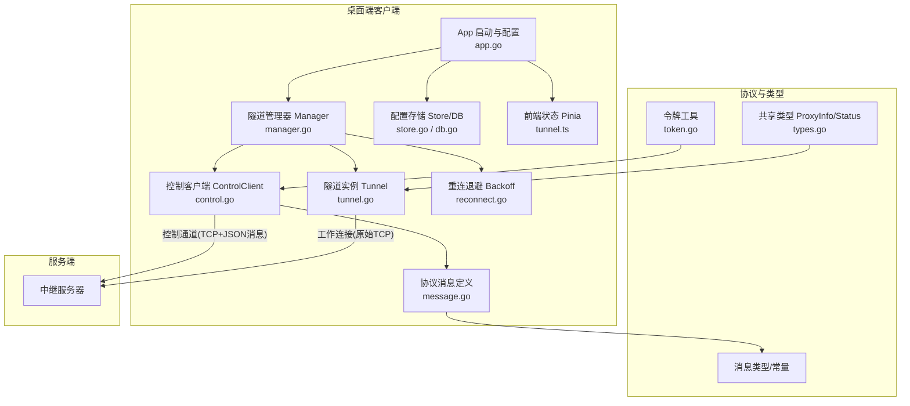
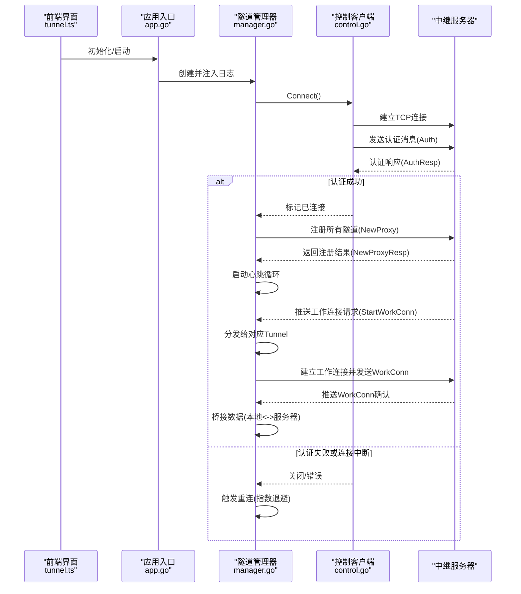
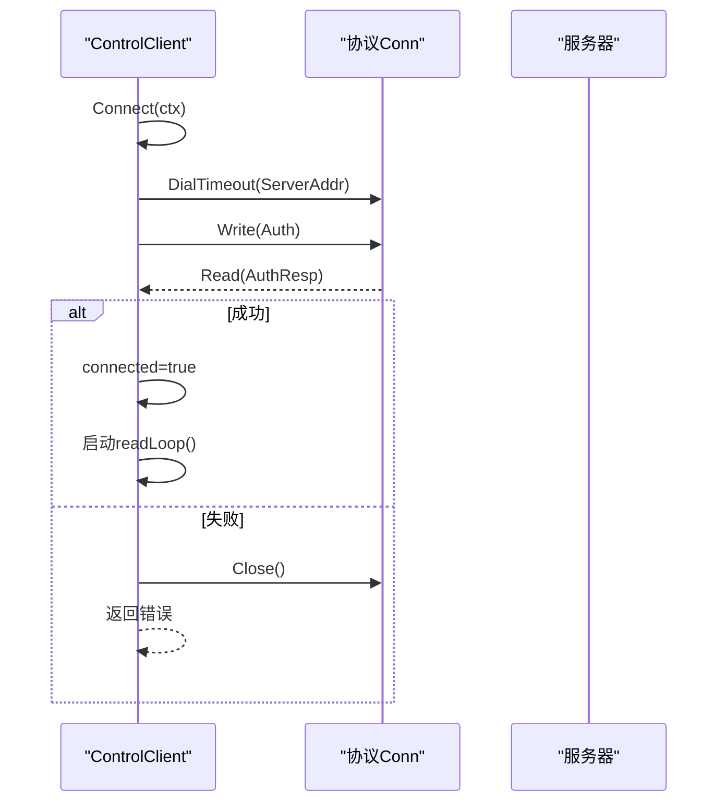
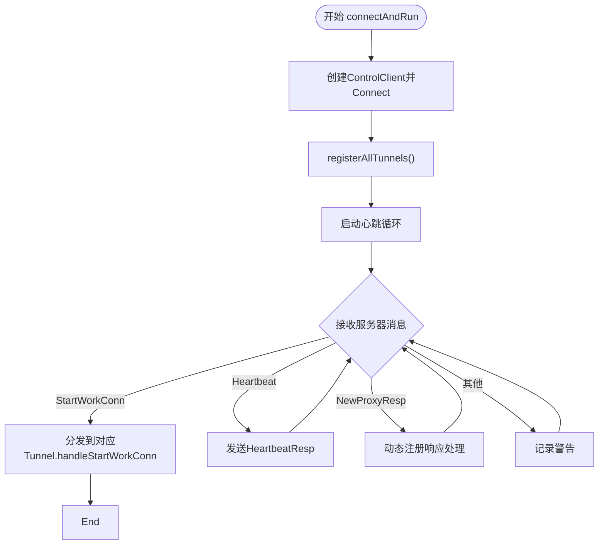
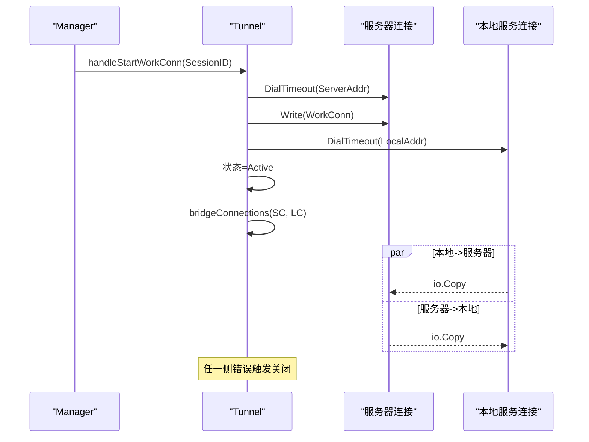
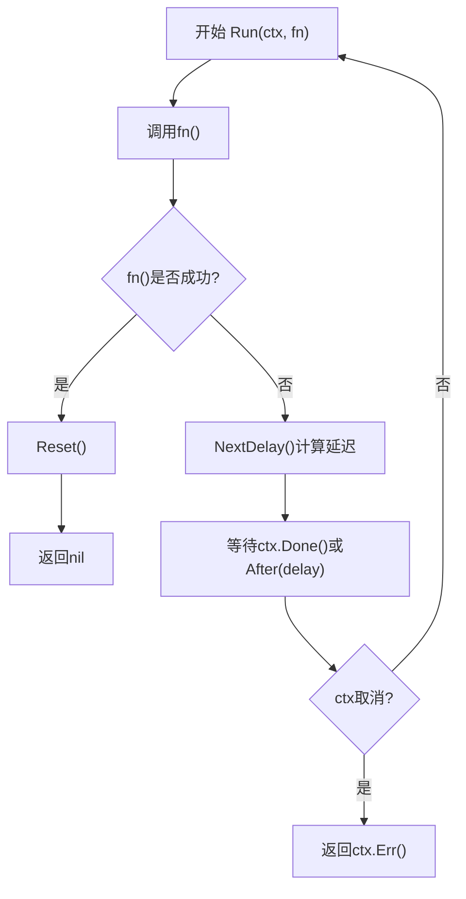
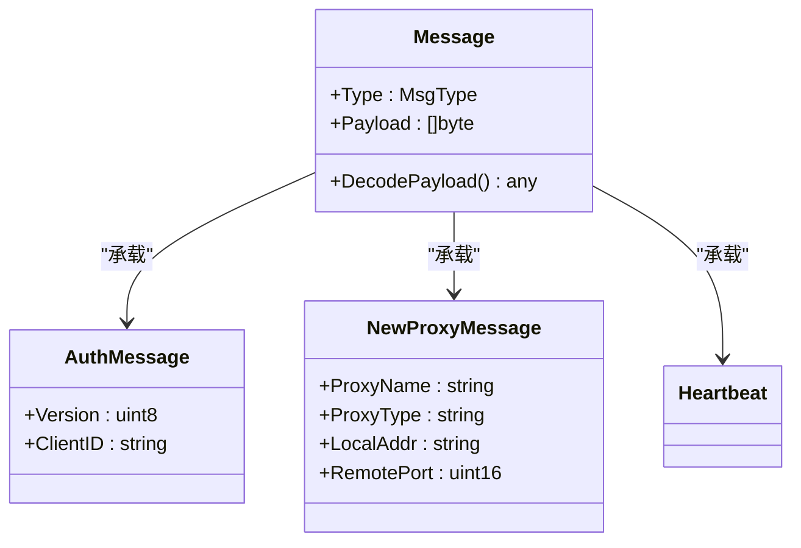
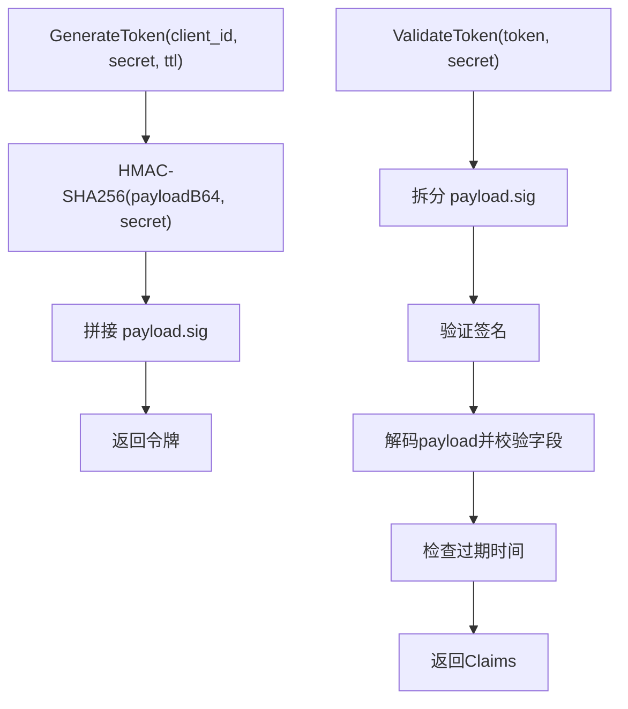
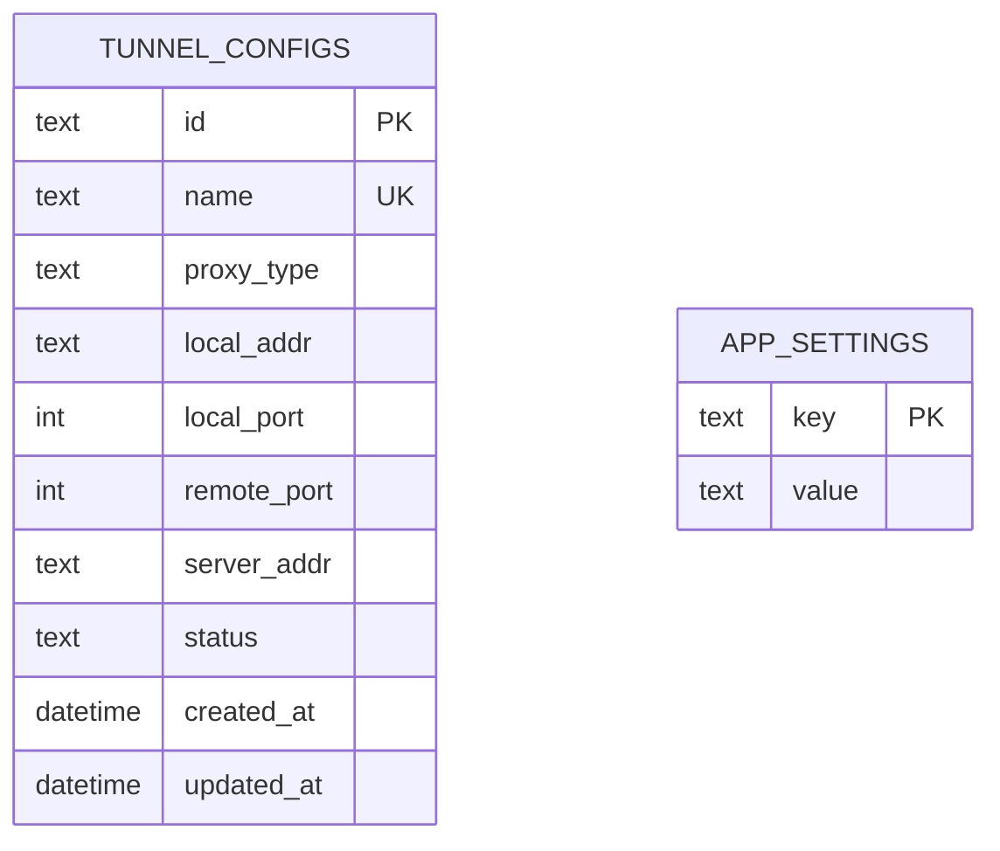
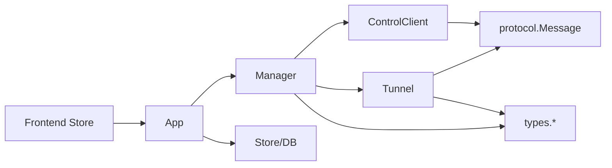

# 客户端连接处理

<cite>
**本文引用的文件**
- [tunnel.go](file://desktop/internal/tunnel/tunnel.go)
- [manager.go](file://desktop/internal/tunnel/manager.go)
- [control.go](file://desktop/internal/tunnel/control.go)
- [reconnect.go](file://desktop/internal/tunnel/reconnect.go)
- [config.go](file://desktop/internal/tunnel/config.go)
- [message.go](file://pkg/protocol/message.go)
- [types.go](file://pkg/types/types.go)
- [token.go](file://desktop/internal/auth/token.go)
- [tunnel.ts](file://desktop/frontend/src/stores/tunnel.ts)
- [app.go](file://desktop/app.go)
- [store.go](file://desktop/internal/config/store.go)
- [db.go](file://desktop/internal/config/db.go)
- [main.go](file://desktop/main.go)
- [tunnel_test.go](file://desktop/internal/tunnel/tunnel_test.go)
- [integration_test.go](file://desktop/internal/tunnel/integration_test.go)
</cite>

## 目录
1. [简介](#简介)
2. [项目结构](#项目结构)
3. [核心组件](#核心组件)
4. [架构总览](#架构总览)
5. [详细组件分析](#详细组件分析)
6. [依赖分析](#依赖分析)
7. [性能考虑](#性能考虑)
8. [故障排查指南](#故障排查指南)
9. [结论](#结论)
10. [附录：代码示例路径](#附录代码示例路径)

## 简介
本文件面向NexTunnel桌面端客户端的“连接处理模块”，系统性梳理从连接建立、握手与认证、工作连接建立、数据桥接、心跳与重连、到状态监控与统计的全链路实现。重点覆盖以下主题：
- 控制通道握手与认证（含令牌生命周期）
- 工作通道建立与双向数据桥接
- 连接池与复用策略（当前实现为按需拨号）
- 超时与重连策略
- 权限与访问控制（基于令牌与服务端授权）
- 心跳检测与异常断开处理
- 性能优化、并发与资源统计
- 前端状态与流量统计联动

## 项目结构
客户端连接处理主要位于desktop/internal/tunnel目录，配合pkg/protocol定义的协议消息、pkg/types共享类型、以及desktop/internal/auth提供的令牌能力。前端通过Pinia store与后端Wails绑定方法交互。

图表来源
- [manager.go:1-310](file://desktop/internal/tunnel/manager.go#L1-L310)
- [tunnel.go:1-138](file://desktop/internal/tunnel/tunnel.go#L1-L138)
- [control.go:1-155](file://desktop/internal/tunnel/control.go#L1-L155)
- [message.go:1-203](file://pkg/protocol/message.go#L1-L203)
- [types.go:1-50](file://pkg/types/types.go#L1-L50)
- [token.go:1-162](file://desktop/internal/auth/token.go#L1-L162)
- [store.go:1-165](file://desktop/internal/config/store.go#L1-L165)
- [db.go:1-91](file://desktop/internal/config/db.go#L1-L91)
- [tunnel.ts:1-83](file://desktop/frontend/src/stores/tunnel.ts#L1-L83)

章节来源
- [manager.go:1-310](file://desktop/internal/tunnel/manager.go#L1-L310)
- [tunnel.go:1-138](file://desktop/internal/tunnel/tunnel.go#L1-L138)
- [control.go:1-155](file://desktop/internal/tunnel/control.go#L1-L155)
- [message.go:1-203](file://pkg/protocol/message.go#L1-L203)
- [types.go:1-50](file://pkg/types/types.go#L1-L50)
- [token.go:1-162](file://desktop/internal/auth/token.go#L1-L162)
- [store.go:1-165](file://desktop/internal/config/store.go#L1-L165)
- [db.go:1-91](file://desktop/internal/config/db.go#L1-L91)
- [tunnel.ts:1-83](file://desktop/frontend/src/stores/tunnel.ts#L1-L83)

## 核心组件
- 隧道管理器 Manager：负责控制连接、注册隧道、处理服务器消息、心跳循环、动态增删隧道、全局状态查询。
- 隧道实例 Tunnel：负责单条隧道的工作连接建立与数据桥接。
- 控制客户端 ControlClient：负责与服务器的持久化控制通道，执行握手与认证，读写消息。
- 重连退避 Backoff：指数退避+抖动的自动重连策略。
- 协议消息 protocol.Message：定义控制通道的消息类型、载荷结构与序列化工厂。
- 共享类型 types：定义代理类型、状态、运行时信息等。
- 令牌工具 auth.Token：生成、校验、刷新令牌，支持过期判断。
- 配置存储 Store/DB：本地SQLite持久化隧道配置与应用设置。
- 前端 Pinia Store：提供隧道列表、连接状态、流量统计的前端视图。

章节来源
- [manager.go:16-310](file://desktop/internal/tunnel/manager.go#L16-L310)
- [tunnel.go:16-138](file://desktop/internal/tunnel/tunnel.go#L16-L138)
- [control.go:15-155](file://desktop/internal/tunnel/control.go#L15-L155)
- [reconnect.go:10-83](file://desktop/internal/tunnel/reconnect.go#L10-L83)
- [message.go:6-203](file://pkg/protocol/message.go#L6-L203)
- [types.go:6-50](file://pkg/types/types.go#L6-L50)
- [token.go:21-162](file://desktop/internal/auth/token.go#L21-L162)
- [store.go:9-165](file://desktop/internal/config/store.go#L9-L165)
- [db.go:13-91](file://desktop/internal/config/db.go#L13-L91)
- [tunnel.ts:1-83](file://desktop/frontend/src/stores/tunnel.ts#L1-L83)

## 架构总览
客户端启动后加载本地配置，创建Manager并建立控制连接；注册所有已配置隧道；周期性发送心跳；当收到服务器发起的工作连接请求时，按需建立工作连接并进行双向数据桥接。断线时通过指数退避自动重连，重连成功后重新注册隧道。

图表来源
- [manager.go:65-112](file://desktop/internal/tunnel/manager.go#L65-L112)
- [control.go:40-95](file://desktop/internal/tunnel/control.go#L40-L95)
- [message.go:83-163](file://pkg/protocol/message.go#L83-L163)
- [tunnel.go:38-85](file://desktop/internal/tunnel/tunnel.go#L38-L85)

## 详细组件分析

### 组件一：控制通道与认证（ControlClient）
- 职责：建立TCP连接，发送认证消息，等待认证响应，启动读循环，提供Send/Messages/IsConnected/Close等接口。
- 认证流程：发送包含版本与客户端ID的Auth消息；接收AuthResp，若失败则关闭连接并返回错误。
- 并发模型：读循环独立goroutine，消息通过带缓冲通道传递；发送加互斥锁保证有序写入。
- 心跳：由Manager侧定时发送，ControlClient仅负责转发心跳响应。

图表来源
- [control.go:40-95](file://desktop/internal/tunnel/control.go#L40-L95)
- [message.go:83-97](file://pkg/protocol/message.go#L83-L97)

章节来源
- [control.go:15-155](file://desktop/internal/tunnel/control.go#L15-L155)
- [message.go:6-203](file://pkg/protocol/message.go#L6-L203)

### 组件二：隧道管理器（Manager）
- 职责：持有多个Tunnel实例，负责控制连接生命周期、注册/注销隧道、处理服务器消息、心跳循环、动态增删隧道、状态聚合。
- 注册流程：遍历TunnelDef，发送NewProxy，等待NewProxyResp，记录远端端口并更新状态。
- 消息分发：根据消息类型分派到对应处理逻辑（StartWorkConn、心跳、动态注册响应）。
- 重连策略：封装在Backoff中，指数退避+抖动，错误时等待NextDelay再重试，成功后Reset。
- 动态隧道：AddTunnel/RemoveTunnel在已连接状态下通知服务器。

图表来源
- [manager.go:82-112](file://desktop/internal/tunnel/manager.go#L82-L112)
- [manager.go:114-156](file://desktop/internal/tunnel/manager.go#L114-L156)
- [manager.go:158-197](file://desktop/internal/tunnel/manager.go#L158-L197)
- [manager.go:199-217](file://desktop/internal/tunnel/manager.go#L199-L217)

章节来源
- [manager.go:16-310](file://desktop/internal/tunnel/manager.go#L16-L310)

### 组件三：隧道实例（Tunnel）
- 职责：单条隧道的生命周期管理，包括工作连接建立、数据桥接、状态与字节统计。
- 工作连接建立：向服务器拨号并发送WorkConn消息，随后向本地服务拨号，完成握手后进入双向桥接。
- 数据桥接：使用io.Copy在两个方向并发复制，原子计数累计字节数，任一侧出错即关闭两端并等待对端结束。
- 状态与统计：ProxyStatus通过原子值保存，BytesIn/BytesOut原子计数，Info()聚合输出。

图表来源
- [tunnel.go:38-85](file://desktop/internal/tunnel/tunnel.go#L38-L85)
- [tunnel.go:87-124](file://desktop/internal/tunnel/tunnel.go#L87-L124)

章节来源
- [tunnel.go:16-138](file://desktop/internal/tunnel/tunnel.go#L16-L138)

### 组件四：重连退避（Backoff）
- 配置：基础延迟、最大延迟、乘数、抖动比例。
- 策略：指数增长delay = base * multiplier^attempt，上限maxDelay；加入[-jitter, jitter]抖动；错误时NextDelay递增，成功时Reset。
- 使用：Manager的connectAndRun循环中调用Run(fn)，fn返回nil则重置，否则等待NextDelay后重试。

图表来源
- [reconnect.go:63-83](file://desktop/internal/tunnel/reconnect.go#L63-L83)
- [reconnect.go:39-56](file://desktop/internal/tunnel/reconnect.go#L39-L56)

章节来源
- [reconnect.go:10-83](file://desktop/internal/tunnel/reconnect.go#L10-L83)

### 组件五：协议与类型
- 协议消息：定义消息类型（认证、隧道注册/响应、心跳、工作连接等），提供构造函数与payload解码。
- 类型定义：ProxyType/ProxyStatus/ProxyInfo等，用于状态与统计。

图表来源
- [message.go:24-203](file://pkg/protocol/message.go#L24-L203)

章节来源
- [message.go:6-203](file://pkg/protocol/message.go#L6-L203)
- [types.go:6-50](file://pkg/types/types.go#L6-L50)

### 组件六：令牌与认证机制
- 令牌生成：包含client_id、iat、exp、nonce，payloadB64签名，格式为“payload.sig”。
- 令牌校验：验证签名与格式，忽略过期；过期判断单独提供。
- 刷新令牌：允许对已过期但签名有效的令牌生成新令牌。
- 与控制通道结合：当前控制通道使用Auth/AuthResp消息进行握手，未直接使用令牌；令牌工具可作为未来扩展的基础。

图表来源
- [token.go:29-104](file://desktop/internal/auth/token.go#L29-L104)
- [token.go:106-162](file://desktop/internal/auth/token.go#L106-L162)

章节来源
- [token.go:1-162](file://desktop/internal/auth/token.go#L1-L162)

### 组件七：配置与持久化
- 应用设置：client_id、server_addr等键值对持久化。
- 隧道配置：名称、类型、本地地址、远端端口、状态等。
- 默认配置：Manager默认填充ClientID、重连与心跳间隔。
- 前端集成：前端通过Wails绑定方法获取隧道列表、连接状态、流量统计。

图表来源
- [db.go:13-31](file://desktop/internal/config/db.go#L13-L31)
- [store.go:9-21](file://desktop/internal/config/store.go#L9-L21)

章节来源
- [config.go:6-36](file://desktop/internal/tunnel/config.go#L6-L36)
- [store.go:1-165](file://desktop/internal/config/store.go#L1-L165)
- [db.go:1-91](file://desktop/internal/config/db.go#L1-L91)
- [app.go:32-85](file://desktop/app.go#L32-L85)
- [tunnel.ts:1-83](file://desktop/frontend/src/stores/tunnel.ts#L1-L83)

## 依赖分析
- 组件耦合
  - Manager依赖ControlClient、Tunnel、protocol、types；Tunnel依赖protocol、types；ControlClient依赖protocol。
  - 低耦合体现在：协议与类型在pkg下独立，便于跨组件复用。
- 外部依赖
  - net、sync/atomic、context、time、json、sqlite驱动等。
- 循环依赖
  - 未发现循环导入；各模块职责清晰。

图表来源
- [manager.go:16-310](file://desktop/internal/tunnel/manager.go#L16-L310)
- [control.go:15-155](file://desktop/internal/tunnel/control.go#L15-L155)
- [tunnel.go:16-138](file://desktop/internal/tunnel/tunnel.go#L16-L138)
- [message.go:6-203](file://pkg/protocol/message.go#L6-L203)
- [types.go:6-50](file://pkg/types/types.go#L6-L50)
- [app.go:17-208](file://desktop/app.go#L17-L208)
- [store.go:1-165](file://desktop/internal/config/store.go#L1-L165)

章节来源
- [manager.go:16-310](file://desktop/internal/tunnel/manager.go#L16-L310)
- [control.go:15-155](file://desktop/internal/tunnel/control.go#L15-L155)
- [tunnel.go:16-138](file://desktop/internal/tunnel/tunnel.go#L16-L138)
- [message.go:6-203](file://pkg/protocol/message.go#L6-L203)
- [types.go:6-50](file://pkg/types/types.go#L6-L50)
- [app.go:17-208](file://desktop/app.go#L17-L208)
- [store.go:1-165](file://desktop/internal/config/store.go#L1-L165)

## 性能考虑
- 并发桥接：使用WaitGroup与once确保两端同时关闭，避免资源泄漏。
- 原子计数：BytesIn/BytesOut使用原子操作，降低锁竞争。
- I/O复制：io.Copy在大流量场景下具备良好吞吐，建议结合背压与缓冲策略（当前实现未显式设置缓冲区大小）。
- 心跳频率：可通过配置调整HeartbeatInterval，平衡保活与CPU消耗。
- 重连退避：指数退避+抖动减少雪崩效应，建议根据网络环境调优基础延迟与最大延迟。
- 本地持久化：SQLite WAL模式提升并发读写性能。

## 故障排查指南
- 认证失败
  - 现象：Connect返回错误或AuthResp失败。
  - 排查：检查服务器端是否接受该ClientID；核对网络连通性与超时设置。
  - 参考
    - [control.go:40-95](file://desktop/internal/tunnel/control.go#L40-L95)
    - [message.go:83-97](file://pkg/protocol/message.go#L83-L97)
- 注册失败
  - 现象：NewProxyResp.Success=false。
  - 排查：确认隧道名称唯一、本地服务可达、服务器端策略允许。
  - 参考
    - [manager.go:114-156](file://desktop/internal/tunnel/manager.go#L114-L156)
- 心跳异常
  - 现象：长时间无心跳响应或发送失败。
  - 排查：检查网络质量、防火墙、服务器负载；适当增大HeartbeatInterval。
  - 参考
    - [manager.go:199-217](file://desktop/internal/tunnel/manager.go#L199-L217)
- 工作连接断开
  - 现象：bridgeConnections中任一侧报错并关闭。
  - 排查：检查本地服务状态、端口映射、服务器端是否正确推送StartWorkConn。
  - 参考
    - [tunnel.go:87-124](file://desktop/internal/tunnel/tunnel.go#L87-L124)
- 重连频繁
  - 现象：反复断开与重连。
  - 排查：增大ReconnectBaseDelay/MaxDelay，观察网络波动；检查服务器端策略。
  - 参考
    - [reconnect.go:63-83](file://desktop/internal/tunnel/reconnect.go#L63-L83)
- 前端状态不一致
  - 现象：GetConnectionStatus与实际不符。
  - 排查：确认Manager已启动且IsConnected返回true；检查Wails绑定方法实现。
  - 参考
    - [app.go:184-203](file://desktop/app.go#L184-L203)
    - [tunnel.ts:63-70](file://desktop/frontend/src/stores/tunnel.ts#L63-L70)

章节来源
- [control.go:40-95](file://desktop/internal/tunnel/control.go#L40-L95)
- [manager.go:114-156](file://desktop/internal/tunnel/manager.go#L114-L156)
- [manager.go:199-217](file://desktop/internal/tunnel/manager.go#L199-L217)
- [tunnel.go:87-124](file://desktop/internal/tunnel/tunnel.go#L87-L124)
- [reconnect.go:63-83](file://desktop/internal/tunnel/reconnect.go#L63-L83)
- [app.go:184-203](file://desktop/app.go#L184-L203)
- [tunnel.ts:63-70](file://desktop/frontend/src/stores/tunnel.ts#L63-L70)

## 结论
NexTunnel客户端连接处理模块以“控制通道+工作通道”的双通道设计为核心，通过Manager统一编排，ControlClient负责可靠握手与消息收发，Tunnel专注工作连接的数据桥接。配合指数退避重连、心跳保活与原子计数统计，实现了稳定高效的隧道代理能力。未来可在控制通道中引入令牌认证、增加连接池与会话复用策略，并进一步优化I/O缓冲与背压控制以提升高并发场景下的性能表现。

## 附录：代码示例路径
以下为关键流程的代码示例路径（请在对应文件中查看具体实现）：
- 连接建立与认证
  - [control.go:40-95](file://desktop/internal/tunnel/control.go#L40-L95)
  - [message.go:83-97](file://pkg/protocol/message.go#L83-L97)
- 隧道注册与心跳
  - [manager.go:114-156](file://desktop/internal/tunnel/manager.go#L114-L156)
  - [manager.go:199-217](file://desktop/internal/tunnel/manager.go#L199-L217)
- 工作连接建立与数据桥接
  - [tunnel.go:38-85](file://desktop/internal/tunnel/tunnel.go#L38-L85)
  - [tunnel.go:87-124](file://desktop/internal/tunnel/tunnel.go#L87-L124)
- 重连循环
  - [reconnect.go:63-83](file://desktop/internal/tunnel/reconnect.go#L63-L83)
- 前端状态与流量统计
  - [app.go:184-203](file://desktop/app.go#L184-L203)
  - [tunnel.ts:63-70](file://desktop/frontend/src/stores/tunnel.ts#L63-L70)
- 端到端测试（参考）
  - [tunnel_test.go:208-302](file://desktop/internal/tunnel/tunnel_test.go#L208-L302)
  - [integration_test.go:193-298](file://desktop/internal/tunnel/integration_test.go#L193-L298)