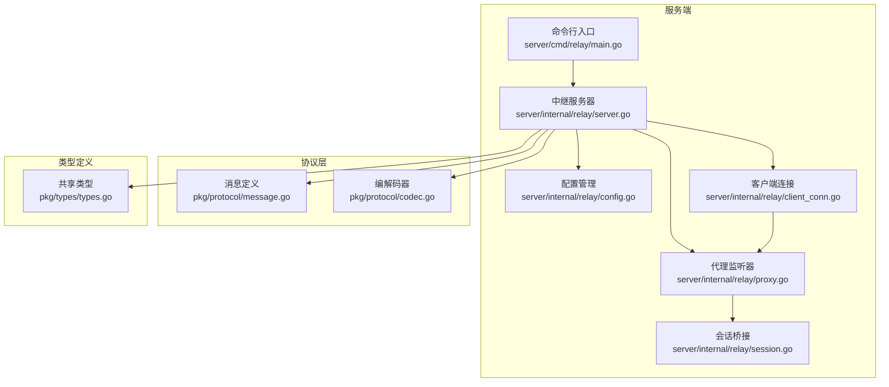
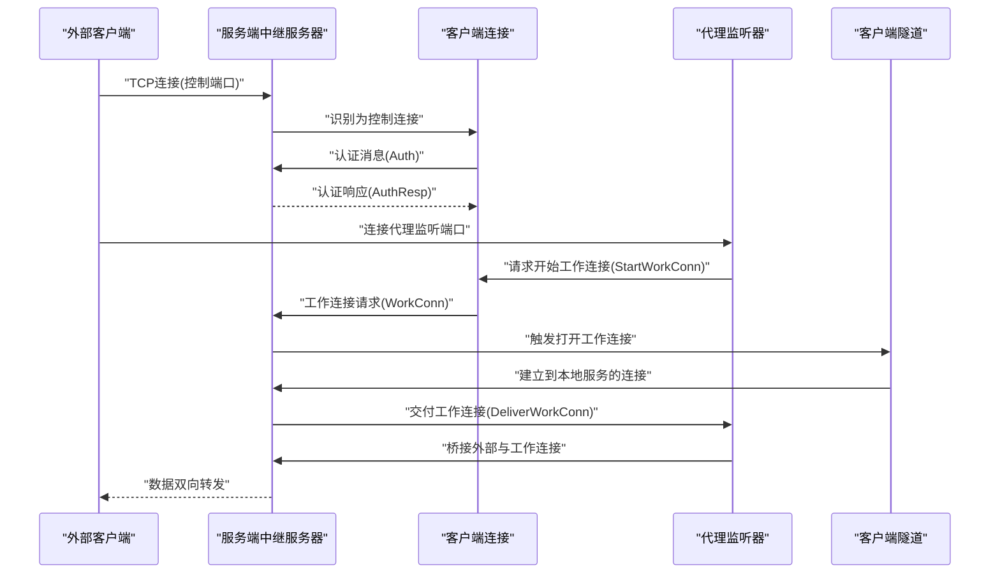
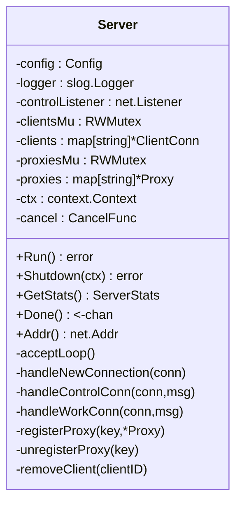
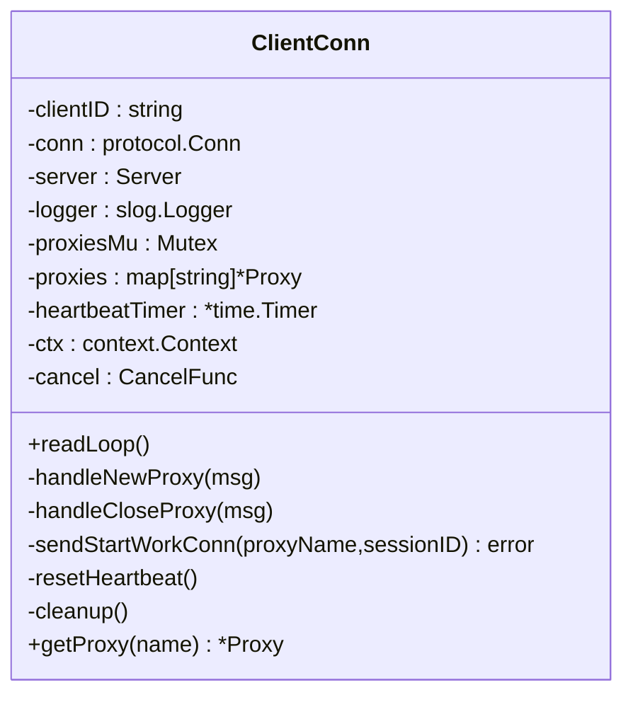
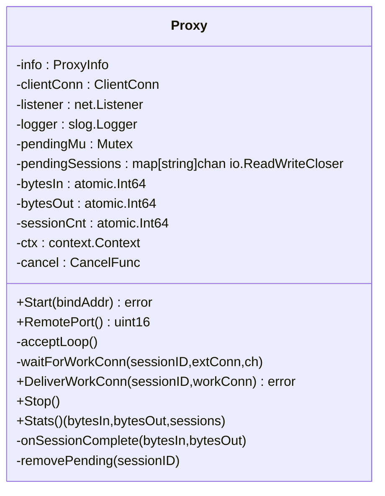
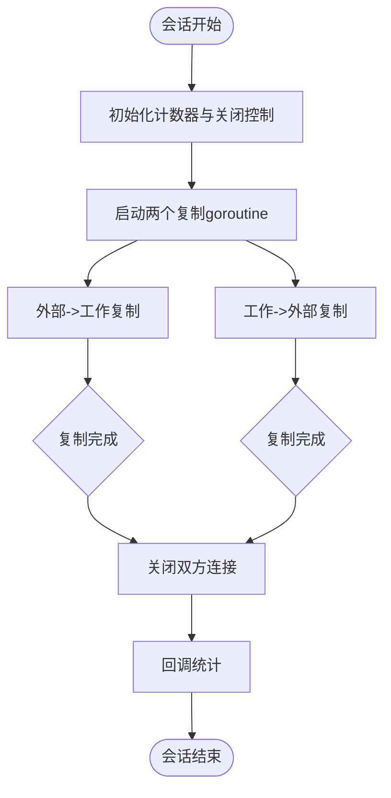
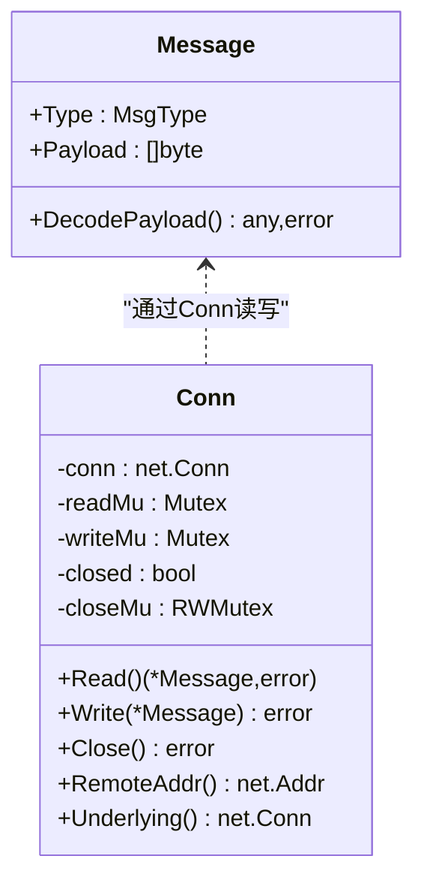
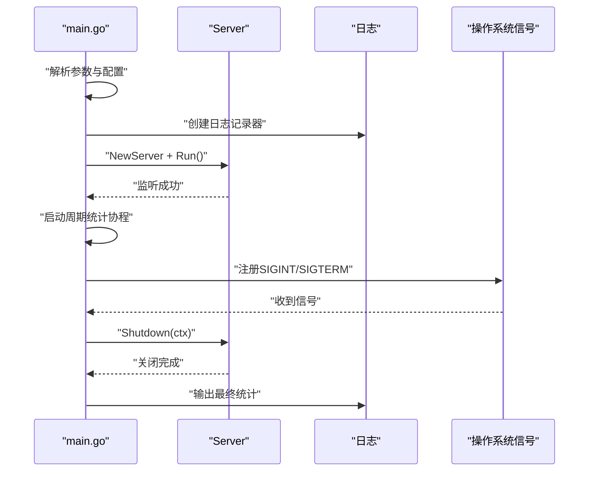
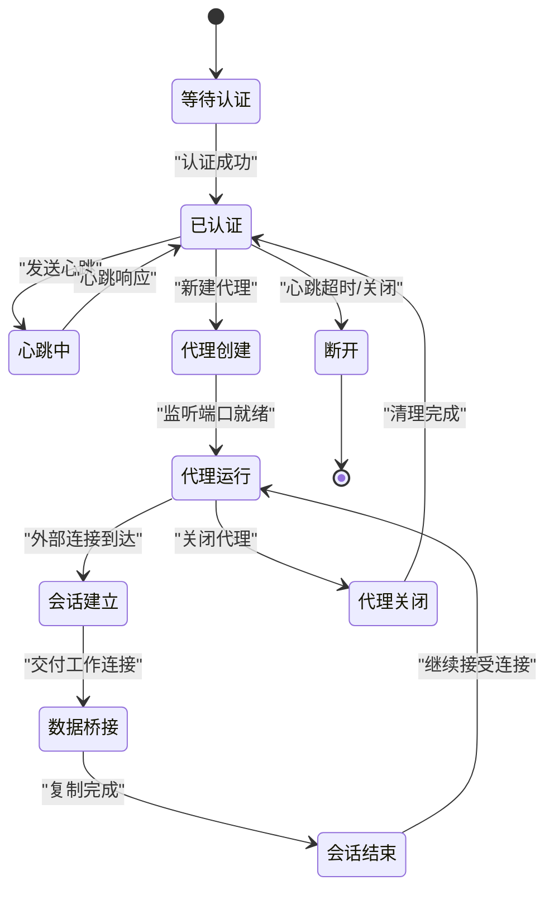
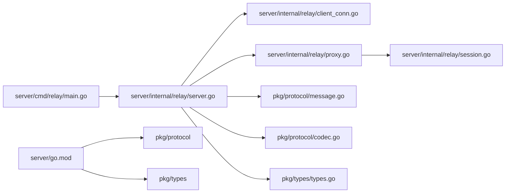

# 服务端架构设计

<cite>
**本文档引用的文件**
- [server/go.mod](file://server/go.mod)
- [server/cmd/relay/main.go](file://server/cmd/relay/main.go)
- [server/internal/relay/server.go](file://server/internal/relay/server.go)
- [server/internal/relay/client_conn.go](file://server/internal/relay/client_conn.go)
- [server/internal/relay/proxy.go](file://server/internal/relay/proxy.go)
- [server/internal/relay/session.go](file://server/internal/relay/session.go)
- [server/internal/relay/config.go](file://server/internal/relay/config.go)
- [pkg/protocol/message.go](file://pkg/protocol/message.go)
- [pkg/protocol/codec.go](file://pkg/protocol/codec.go)
- [pkg/types/types.go](file://pkg/types/types.go)
- [desktop/internal/tunnel/tunnel.go](file://desktop/internal/tunnel/tunnel.go)
- [README.md](file://README.md)
</cite>

## 目录
1. [简介](#简介)
2. [项目结构](#项目结构)
3. [核心组件](#核心组件)
4. [架构总览](#架构总览)
5. [详细组件分析](#详细组件分析)
6. [依赖关系分析](#依赖关系分析)
7. [性能考量](#性能考量)
8. [故障排查指南](#故障排查指南)
9. [结论](#结论)

## 简介
本文件面向NexTunnel服务端的架构设计与实现，重点解析中继服务器的整体架构、Go语言并发模型的应用、WebSocket服务器实现与连接管理策略、会话管理机制、客户端连接池设计与负载均衡考虑、服务端启动流程、配置管理、日志记录与监控机制、安全策略与认证机制以及访问控制。同时提供部署架构图、连接生命周期图与数据处理流程图，帮助开发者快速理解服务端实现细节与扩展点。

## 项目结构
NexTunnel服务端采用模块化组织方式，核心位于server目录，协议与类型定义位于pkg目录，桌面端客户端位于desktop目录。Relay中继服务作为主要运行组件，通过命令行入口启动，内部以Server为核心协调器，管理ClientConn与Proxy实例，并通过统一的协议层进行消息编解码与传输。

**图表来源**
- [server/cmd/relay/main.go:15-81](file://server/cmd/relay/main.go#L15-L81)
- [server/internal/relay/server.go:14-41](file://server/internal/relay/server.go#L14-L41)
- [server/internal/relay/config.go:8-26](file://server/internal/relay/config.go#L8-L26)
- [server/internal/relay/client_conn.go:14-43](file://server/internal/relay/client_conn.go#L14-L43)
- [server/internal/relay/proxy.go:16-45](file://server/internal/relay/proxy.go#L16-L45)
- [server/internal/relay/session.go:19-37](file://server/internal/relay/session.go#L19-L37)
- [pkg/protocol/message.go:24-28](file://pkg/protocol/message.go#L24-L28)
- [pkg/protocol/codec.go:66-72](file://pkg/protocol/codec.go#L66-L72)
- [pkg/types/types.go:33-42](file://pkg/types/types.go#L33-L42)

**章节来源**
- [README.md:1-20](file://README.md#L1-L20)
- [server/go.mod:1-11](file://server/go.mod#L1-L11)

## 核心组件
- 服务器核心：负责监听控制端口、接受新连接、区分控制连接与工作连接、维护客户端与代理映射、统计与优雅关闭。
- 客户端连接：管理单个客户端的控制通道，处理代理创建/关闭请求、心跳保活、超时清理。
- 代理监听器：为每个隧道创建外部监听端口，等待外部连接，协调工作连接建立与会话桥接。
- 会话桥接：在外部连接与工作连接之间进行双向数据转发，统计字节量与会话计数。
- 协议层：定义消息类型、版本、载荷结构，提供读写编解码与线程安全封装。
- 类型系统：统一描述代理信息、状态与隧道配置，便于跨组件传递。

**章节来源**
- [server/internal/relay/server.go:13-41](file://server/internal/relay/server.go#L13-L41)
- [server/internal/relay/client_conn.go:14-43](file://server/internal/relay/client_conn.go#L14-L43)
- [server/internal/relay/proxy.go:16-45](file://server/internal/relay/proxy.go#L16-L45)
- [server/internal/relay/session.go:19-37](file://server/internal/relay/session.go#L19-L37)
- [pkg/protocol/message.go:6-22](file://pkg/protocol/message.go#L6-L22)
- [pkg/types/types.go:6-22](file://pkg/types/types.go#L6-L22)

## 架构总览
服务端采用“控制通道+工作通道”的双通道模型：
- 控制通道：客户端首次连接发送认证消息，随后用于代理注册、关闭、心跳等控制指令。
- 工作通道：外部用户连接到代理监听端口后，服务端向客户端发起工作连接请求，客户端建立到本地服务的连接，最终由服务端在两端间桥接数据。

**图表来源**
- [server/internal/relay/server.go:84-103](file://server/internal/relay/server.go#L84-L103)
- [server/internal/relay/client_conn.go:164-170](file://server/internal/relay/client_conn.go#L164-L170)
- [server/internal/relay/proxy.go:120-141](file://server/internal/relay/proxy.go#L120-L141)
- [desktop/internal/tunnel/tunnel.go:47-85](file://desktop/internal/tunnel/tunnel.go#L47-L85)

## 详细组件分析

### 中继服务器（Server）
- 职责：监听控制端口、接受新连接、分流控制连接与工作连接、维护客户端与代理映射、统计与优雅关闭。
- 并发模型：使用goroutine处理每个新连接；使用互斥锁保护客户端与代理映射；使用上下文取消信号实现优雅关闭。
- 关键方法：Run、Shutdown、GetStats、handleNewConnection、handleControlConn、handleWorkConn。
- 统计聚合：聚合各代理的字节流入/流出与会话数，提供服务端指标。

**图表来源**
- [server/internal/relay/server.go:14-41](file://server/internal/relay/server.go#L14-L41)
- [server/internal/relay/server.go:44-103](file://server/internal/relay/server.go#L44-L103)
- [server/internal/relay/server.go:197-214](file://server/internal/relay/server.go#L197-L214)
- [server/internal/relay/server.go:282-305](file://server/internal/relay/server.go#L282-L305)

**章节来源**
- [server/internal/relay/server.go:44-103](file://server/internal/relay/server.go#L44-L103)
- [server/internal/relay/server.go:197-214](file://server/internal/relay/server.go#L197-L214)
- [server/internal/relay/server.go:282-305](file://server/internal/relay/server.go#L282-L305)

### 客户端连接（ClientConn）
- 职责：维护单个客户端的控制连接，处理代理创建/关闭、心跳保活、超时断开、清理资源。
- 并发模型：读循环独立goroutine；心跳定时器；每个代理独立锁；上下文取消传播。
- 关键方法：readLoop、handleNewProxy、handleCloseProxy、sendStartWorkConn、resetHeartbeat、cleanup。
- 限制：每客户端最大代理数量受配置约束。

**图表来源**
- [server/internal/relay/client_conn.go:14-43](file://server/internal/relay/client_conn.go#L14-L43)
- [server/internal/relay/client_conn.go:46-82](file://server/internal/relay/client_conn.go#L46-L82)
- [server/internal/relay/client_conn.go:84-130](file://server/internal/relay/client_conn.go#L84-L130)
- [server/internal/relay/client_conn.go:142-162](file://server/internal/relay/client_conn.go#L142-L162)
- [server/internal/relay/client_conn.go:172-181](file://server/internal/relay/client_conn.go#L172-L181)
- [server/internal/relay/client_conn.go:191-215](file://server/internal/relay/client_conn.go#L191-L215)

**章节来源**
- [server/internal/relay/client_conn.go:46-82](file://server/internal/relay/client_conn.go#L46-L82)
- [server/internal/relay/client_conn.go:84-130](file://server/internal/relay/client_conn.go#L84-L130)
- [server/internal/relay/client_conn.go:142-162](file://server/internal/relay/client_conn.go#L142-L162)
- [server/internal/relay/client_conn.go:172-181](file://server/internal/relay/client_conn.go#L172-L181)
- [server/internal/relay/client_conn.go:191-215](file://server/internal/relay/client_conn.go#L191-L215)

### 代理监听器（Proxy）
- 职责：为指定隧道创建外部监听端口，接受外部连接，协调工作连接建立，桥接会话。
- 并发模型：监听goroutine；每个会话独立goroutine；使用通道等待匹配的工作连接；原子计数统计。
- 关键方法：Start、acceptLoop、waitForWorkConn、DeliverWorkConn、Stop、Stats。
- 会话管理：使用map存储待完成会话，按sessionID匹配；超时或取消时清理。

**图表来源**
- [server/internal/relay/proxy.go:16-45](file://server/internal/relay/proxy.go#L16-L45)
- [server/internal/relay/proxy.go:47-100](file://server/internal/relay/proxy.go#L47-L100)
- [server/internal/relay/proxy.go:102-118](file://server/internal/relay/proxy.go#L102-L118)
- [server/internal/relay/proxy.go:120-141](file://server/internal/relay/proxy.go#L120-L141)
- [server/internal/relay/proxy.go:149-179](file://server/internal/relay/proxy.go#L149-L179)

**章节来源**
- [server/internal/relay/proxy.go:47-100](file://server/internal/relay/proxy.go#L47-L100)
- [server/internal/relay/proxy.go:102-118](file://server/internal/relay/proxy.go#L102-L118)
- [server/internal/relay/proxy.go:120-141](file://server/internal/relay/proxy.go#L120-L141)
- [server/internal/relay/proxy.go:149-179](file://server/internal/relay/proxy.go#L149-L179)

### 会话桥接（ProxySession）
- 职责：在外部连接与工作连接之间进行双向数据转发，统计字节量并在完成后回调。
- 并发模型：两个goroutine分别处理双向复制；WaitGroup同步；原子变量统计字节量；once保证关闭幂等。
- 关键方法：Bridge、StatsCallback。

**图表来源**
- [server/internal/relay/session.go:39-79](file://server/internal/relay/session.go#L39-L79)

**章节来源**
- [server/internal/relay/session.go:39-79](file://server/internal/relay/session.go#L39-L79)

### 协议层（Message与Codec）
- 消息类型：认证、认证响应、新建代理、代理响应、关闭代理、开始工作连接、工作连接、心跳、心跳响应。
- 编解码：固定头部（类型+长度）+JSON载荷；最大载荷大小限制；线程安全的读写封装。
- 版本控制：协议版本常量，用于兼容性检查。

**图表来源**
- [pkg/protocol/message.go:24-28](file://pkg/protocol/message.go#L24-L28)
- [pkg/protocol/message.go:166-194](file://pkg/protocol/message.go#L166-L194)
- [pkg/protocol/codec.go:66-72](file://pkg/protocol/codec.go#L66-L72)
- [pkg/protocol/codec.go:79-107](file://pkg/protocol/codec.go#L79-L107)

**章节来源**
- [pkg/protocol/message.go:6-22](file://pkg/protocol/message.go#L6-L22)
- [pkg/protocol/message.go:166-194](file://pkg/protocol/message.go#L166-L194)
- [pkg/protocol/codec.go:16-39](file://pkg/protocol/codec.go#L16-L39)
- [pkg/protocol/codec.go:79-107](file://pkg/protocol/codec.go#L79-L107)

### 配置管理（Config）
- 默认配置：绑定地址、控制端口、心跳超时、每客户端最大代理数、工作连接超时。
- 命令行参数：支持覆盖默认值，便于容器化与运维部署。

**章节来源**
- [server/internal/relay/config.go:8-26](file://server/internal/relay/config.go#L8-L26)
- [server/internal/relay/config.go:28-37](file://server/internal/relay/config.go#L28-L37)

### 启动流程与监控
- 启动流程：解析命令行参数→创建日志记录器→构建Server→Run监听→周期性统计日志→接收信号→优雅关闭→输出最终统计。
- 监控：周期性统计客户端数、代理数、会话数与字节量；关闭前输出最终统计。

**图表来源**
- [server/cmd/relay/main.go:15-81](file://server/cmd/relay/main.go#L15-L81)
- [server/internal/relay/server.go:44-55](file://server/internal/relay/server.go#L44-L55)
- [server/internal/relay/server.go:217-251](file://server/internal/relay/server.go#L217-L251)

**章节来源**
- [server/cmd/relay/main.go:15-81](file://server/cmd/relay/main.go#L15-L81)
- [server/internal/relay/server.go:217-251](file://server/internal/relay/server.go#L217-L251)

### 连接生命周期
- 控制连接：认证→心跳保活→代理创建/关闭→断开清理。
- 工作连接：外部连接→代理监听→请求工作连接→客户端建立到本地服务→桥接数据→关闭。

**图表来源**
- [server/internal/relay/client_conn.go:46-82](file://server/internal/relay/client_conn.go#L46-L82)
- [server/internal/relay/proxy.go:68-100](file://server/internal/relay/proxy.go#L68-L100)
- [server/internal/relay/proxy.go:120-141](file://server/internal/relay/proxy.go#L120-L141)
- [server/internal/relay/session.go:39-79](file://server/internal/relay/session.go#L39-L79)

## 依赖关系分析
- 内部依赖：server/cmd/relay依赖server/internal/relay；relay内部依赖pkg/protocol与pkg/types。
- 外部依赖：Go标准库（net、sync、context、time、log/slog）、第三方库（google/uuid）。
- 替换规则：pkg模块通过replace指向本地路径，确保开发期可直接修改协议与类型。

**图表来源**
- [server/cmd/relay/main.go:12-13](file://server/cmd/relay/main.go#L12-L13)
- [server/internal/relay/server.go:10](file://server/internal/relay/server.go#L10)
- [server/go.mod:5-10](file://server/go.mod#L5-L10)

**章节来源**
- [server/go.mod:5-10](file://server/go.mod#L5-L10)
- [server/internal/relay/server.go:10](file://server/internal/relay/server.go#L10)

## 性能考量
- 并发模型：采用goroutine-per-connection与goroutine-per-session的轻量级并发，适合高并发短连接场景。
- I/O复制：使用io.Copy进行零拷贝风格的数据转发，减少内存分配与拷贝次数。
- 原子计数：使用atomic.Int64统计字节量与会话数，避免频繁加锁。
- 资源清理：通过上下文取消与通道关闭确保资源及时释放，防止泄漏。
- 可扩展性：代理监听器与会话桥接解耦，便于横向扩展与多租户隔离。

[本节为通用性能讨论，无需特定文件分析]

## 故障排查指南
- 认证失败：检查协议版本是否匹配、客户端ID是否为空或重复。
- 代理创建失败：确认监听端口可用、每客户端代理上限、代理名称冲突。
- 心跳超时：检查网络稳定性、心跳超时配置、客户端是否异常退出。
- 工作连接交付失败：确认外部连接未超时、会话ID匹配、通道未满。
- 日志定位：利用slog记录错误与警告，结合会话ID与代理名定位问题。

**章节来源**
- [server/internal/relay/server.go:105-155](file://server/internal/relay/server.go#L105-L155)
- [server/internal/relay/client_conn.go:84-129](file://server/internal/relay/client_conn.go#L84-L129)
- [server/internal/relay/proxy.go:120-141](file://server/internal/relay/proxy.go#L120-L141)
- [server/cmd/relay/main.go:22-24](file://server/cmd/relay/main.go#L22-L24)

## 结论
NexTunnel服务端以简洁的双通道协议与清晰的组件边界实现了高效的内网穿透中继能力。通过Go语言的并发模型与原子计数，服务端在高并发场景下仍能保持稳定与可观测性。建议后续增强：
- 安全策略：引入TLS加密、客户端证书校验、访问令牌与权限控制。
- 负载均衡：多实例部署与会话亲和、健康检查与自动扩缩容。
- 监控告警：集成Prometheus指标、分布式追踪与日志聚合。
- 配置中心：动态配置更新与灰度发布。

[本节为总结性内容，无需特定文件分析]