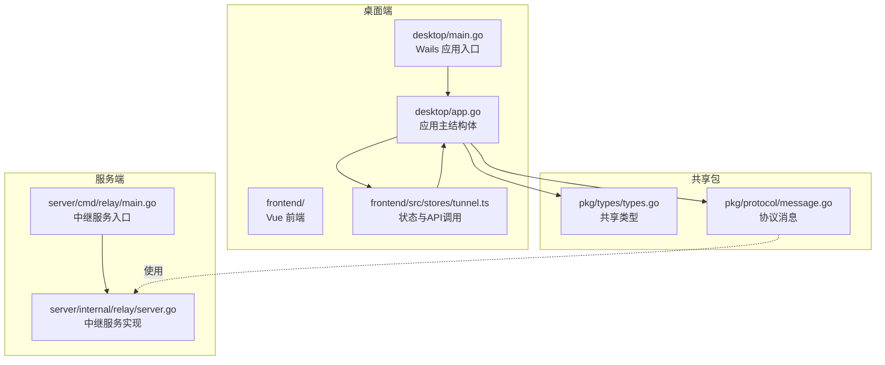
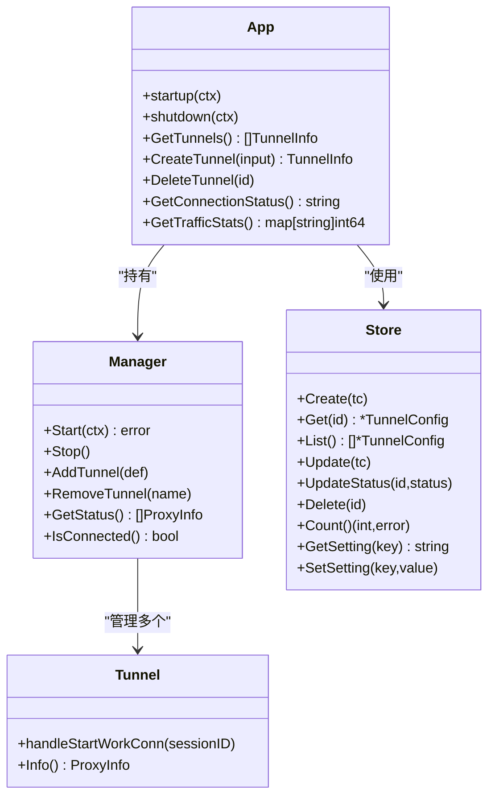
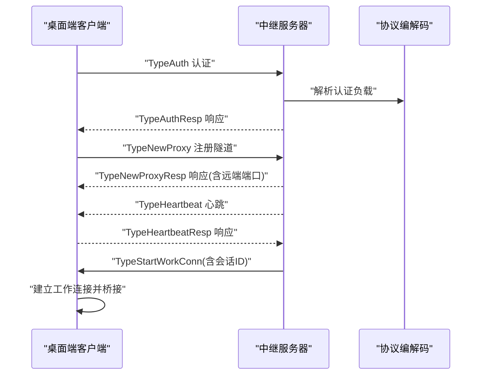
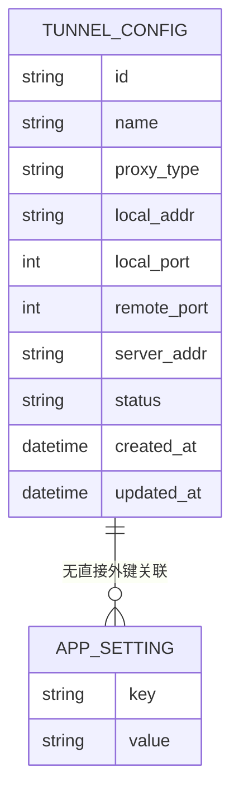
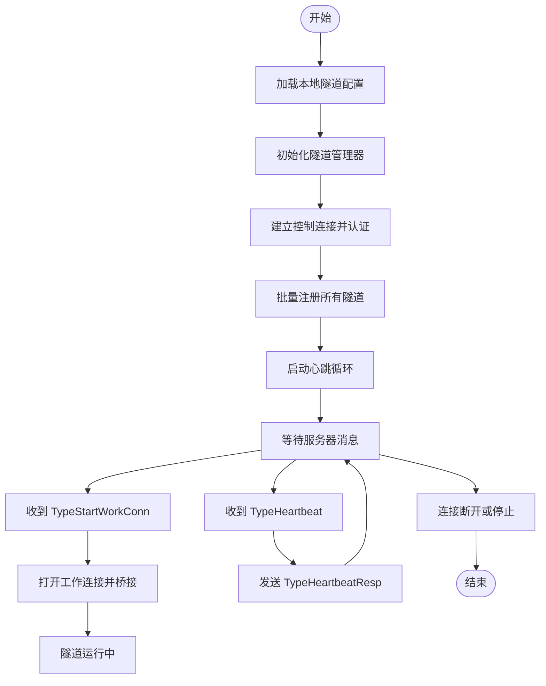
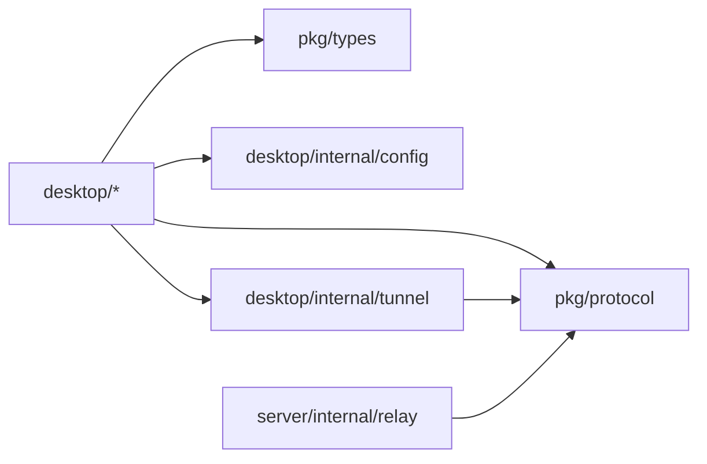
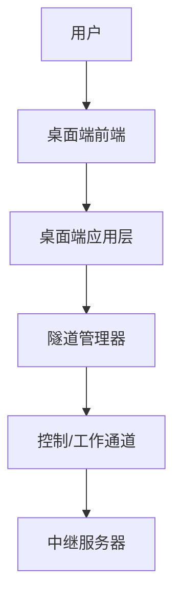

# 架构设计

<cite>
**本文引用的文件**
- [README.md](file://README.md)
- [main.go](file://desktop/main.go)
- [app.go](file://desktop/app.go)
- [main.ts](file://desktop/frontend/src/main.ts)
- [App.vue](file://desktop/frontend/src/App.vue)
- [tunnel.ts](file://desktop/frontend/src/stores/tunnel.ts)
- [manager.go](file://desktop/internal/tunnel/manager.go)
- [tunnel.go](file://desktop/internal/tunnel/tunnel.go)
- [store.go](file://desktop/internal/config/store.go)
- [types.go](file://pkg/types/types.go)
- [message.go](file://pkg/protocol/message.go)
- [main.go](file://server/cmd/control-plane/main.go)
- [main.go](file://server/cmd/relay/main.go)
- [server.go](file://server/internal/relay/server.go)
- [docker-compose.yml](file://docker-compose.yml)
</cite>

## 目录
1. [引言](#引言)
2. [项目结构](#项目结构)
3. [核心组件](#核心组件)
4. [架构总览](#架构总览)
5. [详细组件分析](#详细组件分析)
6. [依赖分析](#依赖分析)
7. [性能考量](#性能考量)
8. [故障排查指南](#故障排查指南)
9. [结论](#结论)
10. [附录](#附录)

## 引言
本架构设计文档面向 NexTunnel 项目，目标是提供从高层到代码级的系统设计说明，覆盖桌面端与服务器端的分层架构、组件交互、数据流、协议与集成方式，并对安全、监控、可扩展性与部署拓扑进行阐述。NexTunnel 基于 FRP 思想，提供“客户端-中继服务器”模式的内网穿透能力，支持 TCP 隧道；HTTP 隧道为后续阶段预留。

## 项目结构
项目采用多模块组织：桌面端（Wails + Vue）负责本地隧道配置与状态展示；服务端（Go）提供中继控制平面与转发代理；共享包（pkg）定义跨端类型与协议消息；server/cmd 提供可执行命令入口；docker-compose 定义默认部署拓扑。



图表来源
- [main.go:1-37](file://desktop/main.go#L1-L37)
- [app.go:1-208](file://desktop/app.go#L1-L208)
- [tunnel.ts:1-83](file://desktop/frontend/src/stores/tunnel.ts#L1-L83)
- [types.go:1-50](file://pkg/types/types.go#L1-L50)
- [message.go:1-203](file://pkg/protocol/message.go#L1-L203)
- [main.go:1-81](file://server/cmd/relay/main.go#L1-L81)
- [server.go:1-306](file://server/internal/relay/server.go#L1-L306)

章节来源
- [README.md:1-20](file://README.md#L1-L20)
- [main.go:1-37](file://desktop/main.go#L1-L37)
- [app.go:1-208](file://desktop/app.go#L1-L208)
- [main.go:1-81](file://server/cmd/relay/main.go#L1-L81)
- [server.go:1-306](file://server/internal/relay/server.go#L1-L306)
- [types.go:1-50](file://pkg/types/types.go#L1-L50)
- [message.go:1-203](file://pkg/protocol/message.go#L1-L203)

## 核心组件
- 桌面端应用（Wails）
  - 负责启动、加载本地配置、驱动隧道管理器、与前端交互。
- 隧道管理器（Manager）
  - 维护多个隧道实例，负责与中继服务器建立控制连接、注册/注销隧道、心跳保活、动态增删隧道。
- 单个隧道（Tunnel）
  - 表示一个具体的 TCP 隧道，处理工作连接的建立与双向桥接。
- 配置存储（Store）
  - 基于 SQLite 的本地持久化，提供隧道配置与应用设置的 CRUD。
- 共享类型与协议
  - 定义隧道类型、状态、消息类型与序列化结构。
- 中继服务器（Relay）
  - 接受控制连接与工作连接，维护客户端、代理与会话，统计流量与会话数。
- 前端（Vue + Pinia）
  - 展示隧道列表、连接状态与流量统计，调用桌面端绑定的方法。

章节来源
- [app.go:1-208](file://desktop/app.go#L1-L208)
- [manager.go:1-310](file://desktop/internal/tunnel/manager.go#L1-L310)
- [tunnel.go:1-138](file://desktop/internal/tunnel/tunnel.go#L1-L138)
- [store.go:1-165](file://desktop/internal/config/store.go#L1-L165)
- [types.go:1-50](file://pkg/types/types.go#L1-L50)
- [message.go:1-203](file://pkg/protocol/message.go#L1-L203)
- [server.go:1-306](file://server/internal/relay/server.go#L1-L306)
- [tunnel.ts:1-83](file://desktop/frontend/src/stores/tunnel.ts#L1-L83)

## 架构总览
系统采用“桌面端客户端 + 中继服务器”的双端架构。桌面端通过控制通道与中继服务器握手、注册隧道；当有外部请求到达时，服务器通过工作通道通知客户端建立工作连接，随后在客户端与本地服务之间进行原始 TCP 数据桥接。

```mermaid
graph TB
subgraph "桌面端"
UI["前端界面<br/>App.vue + tunnel.ts"]
App["应用层<br/>app.go"]
Mgr["隧道管理器<br/>manager.go"]
Tnl["单个隧道<br/>tunnel.go"]
Cfg["配置存储<br/>store.go"]
end
subgraph "网络"
Ctrl["控制通道<br/>TypeAuth/TypeNewProxy 等"]
Work["工作通道<br/>TypeWorkConn/原始TCP"]
end
subgraph "服务端"
Relay["中继服务器<br/>server.go"]
end
UI --> App
App --> Mgr
Mgr --> Tnl
App --> Cfg
Mgr <- --> Ctrl < --> Relay
Relay --> Work
Work --> Tnl
```

图表来源
- [App.vue:1-74](file://desktop/frontend/src/App.vue#L1-L74)
- [tunnel.ts:1-83](file://desktop/frontend/src/stores/tunnel.ts#L1-L83)
- [app.go:1-208](file://desktop/app.go#L1-L208)
- [manager.go:1-310](file://desktop/internal/tunnel/manager.go#L1-L310)
- [tunnel.go:1-138](file://desktop/internal/tunnel/tunnel.go#L1-L138)
- [store.go:1-165](file://desktop/internal/config/store.go#L1-L165)
- [server.go:1-306](file://server/internal/relay/server.go#L1-L306)
- [message.go:1-203](file://pkg/protocol/message.go#L1-L203)

## 详细组件分析

### 桌面端分层架构
- 表现层（前端）
  - 使用 Vue 3 + Pinia，集中管理隧道列表、连接状态与流量统计。
  - 通过 Wails 绑定方法与后端交互。
- 业务逻辑层（应用与隧道管理）
  - 应用主结构体负责启动、关闭、读取/写入配置、注入日志。
  - 隧道管理器负责控制连接生命周期、注册/注销、心跳、动态变更。
- 数据持久化层（SQLite）
  - 提供隧道配置与应用设置的持久化，支持增删改查与计数。
- 网络通信层（协议）
  - 定义控制通道消息类型与序列化结构，支撑认证、隧道注册、心跳与工作连接通知。



图表来源
- [app.go:1-208](file://desktop/app.go#L1-L208)
- [manager.go:1-310](file://desktop/internal/tunnel/manager.go#L1-L310)
- [tunnel.go:1-138](file://desktop/internal/tunnel/tunnel.go#L1-L138)
- [store.go:1-165](file://desktop/internal/config/store.go#L1-L165)

章节来源
- [main.ts:1-8](file://desktop/frontend/src/main.ts#L1-L8)
- [App.vue:1-74](file://desktop/frontend/src/App.vue#L1-L74)
- [tunnel.ts:1-83](file://desktop/frontend/src/stores/tunnel.ts#L1-L83)
- [app.go:1-208](file://desktop/app.go#L1-L208)
- [manager.go:1-310](file://desktop/internal/tunnel/manager.go#L1-L310)
- [tunnel.go:1-138](file://desktop/internal/tunnel/tunnel.go#L1-L138)
- [store.go:1-165](file://desktop/internal/config/store.go#L1-L165)

### 服务器端分层架构
- 控制平面（预留）
  - 当前入口仅输出提示信息，后续用于策略下发、路由与鉴权。
- 中继服务（Relay）
  - 监听控制端口，接受控制连接与工作连接。
  - 处理认证、隧道注册、工作连接派发与统计。



图表来源
- [message.go:1-203](file://pkg/protocol/message.go#L1-L203)
- [server.go:1-306](file://server/internal/relay/server.go#L1-L306)
- [manager.go:1-310](file://desktop/internal/tunnel/manager.go#L1-L310)

章节来源
- [main.go:1-12](file://server/cmd/control-plane/main.go#L1-L12)
- [main.go:1-81](file://server/cmd/relay/main.go#L1-L81)
- [server.go:1-306](file://server/internal/relay/server.go#L1-L306)
- [message.go:1-203](file://pkg/protocol/message.go#L1-L203)

### 协议与数据模型
- 类型与状态
  - ProxyType：tcp、http（预留）、udp（预留）。
  - ProxyStatus：active、inactive、error。
- 消息类型
  - 认证、隧道注册/响应、关闭、工作连接通知、心跳与响应。
- 数据模型
  - TunnelConfig：本地地址、远端端口、服务器地址等。
  - ProxyInfo：运行时状态与字节统计。
  - ClientInfo：客户端元数据。



图表来源
- [store.go:1-165](file://desktop/internal/config/store.go#L1-L165)
- [types.go:1-50](file://pkg/types/types.go#L1-L50)

章节来源
- [types.go:1-50](file://pkg/types/types.go#L1-L50)
- [message.go:1-203](file://pkg/protocol/message.go#L1-L203)
- [store.go:1-165](file://desktop/internal/config/store.go#L1-L165)

### 关键流程：隧道建立与工作连接


图表来源
- [manager.go:1-310](file://desktop/internal/tunnel/manager.go#L1-L310)
- [tunnel.go:1-138](file://desktop/internal/tunnel/tunnel.go#L1-L138)
- [server.go:1-306](file://server/internal/relay/server.go#L1-L306)
- [message.go:1-203](file://pkg/protocol/message.go#L1-L203)

## 依赖分析
- 内部模块耦合
  - desktop/app.go 依赖 desktop/internal/tunnel 与 desktop/internal/config。
  - desktop/internal/tunnel 依赖 pkg/protocol 与 pkg/types。
  - server/internal/relay 依赖 pkg/protocol。
- 外部依赖
  - 桌面端：Wails、Vue 3、Pinia、SQLite。
  - 服务端：Go 标准库、日志与信号处理。
- 版本与兼容性
  - 项目未提供明确的 go.mod/go.sum 版本号，建议在构建时锁定依赖版本以确保一致性。



图表来源
- [app.go:1-208](file://desktop/app.go#L1-L208)
- [manager.go:1-310](file://desktop/internal/tunnel/manager.go#L1-L310)
- [store.go:1-165](file://desktop/internal/config/store.go#L1-L165)
- [types.go:1-50](file://pkg/types/types.go#L1-L50)
- [message.go:1-203](file://pkg/protocol/message.go#L1-L203)
- [server.go:1-306](file://server/internal/relay/server.go#L1-L306)

章节来源
- [app.go:1-208](file://desktop/app.go#L1-L208)
- [manager.go:1-310](file://desktop/internal/tunnel/manager.go#L1-L310)
- [store.go:1-165](file://desktop/internal/config/store.go#L1-L165)
- [types.go:1-50](file://pkg/types/types.go#L1-L50)
- [message.go:1-203](file://pkg/protocol/message.go#L1-L203)
- [server.go:1-306](file://server/internal/relay/server.go#L1-L306)

## 性能考量
- 连接与重连
  - 管理器内置指数退避与抖动，降低瞬时风暴风险。
- 并发与锁
  - 管理器与服务器端均使用读写锁保护集合，避免竞态。
- 数据桥接
  - 工作连接采用双向 io.Copy 并发桥接，原子计数统计字节。
- 统计与可观测性
  - 服务器端周期性输出统计日志，便于容量评估与告警阈值设定。
- 可扩展性
  - 服务器端按客户端与代理维度聚合统计，便于横向扩展与多副本部署。

## 故障排查指南
- 常见问题定位
  - 认证失败：检查客户端 ID 与协议版本是否匹配。
  - 注册失败：确认服务器已接收并返回响应，查看错误信息。
  - 心跳异常：检查网络连通性与防火墙策略。
  - 工作连接无法建立：核对本地服务监听地址与端口。
- 日志与诊断
  - 桌面端与服务端均使用结构化日志，结合统计输出定位问题。
- 配置与持久化
  - 若隧道状态不一致，检查配置表与应用设置表的更新时间戳。

章节来源
- [server.go:1-306](file://server/internal/relay/server.go#L1-L306)
- [manager.go:1-310](file://desktop/internal/tunnel/manager.go#L1-L310)
- [store.go:1-165](file://desktop/internal/config/store.go#L1-L165)

## 结论
NexTunnel 采用清晰的分层与职责分离：桌面端专注本地配置与隧道编排，服务端专注控制与转发。协议简洁、组件职责明确，具备良好的可扩展性与可观测性。后续可在控制平面引入鉴权与路由策略，在服务端完善多副本与高可用部署方案。

## 附录

### 系统上下文图


图表来源
- [App.vue:1-74](file://desktop/frontend/src/App.vue#L1-L74)
- [tunnel.ts:1-83](file://desktop/frontend/src/stores/tunnel.ts#L1-L83)
- [app.go:1-208](file://desktop/app.go#L1-L208)
- [manager.go:1-310](file://desktop/internal/tunnel/manager.go#L1-L310)
- [server.go:1-306](file://server/internal/relay/server.go#L1-L306)

### 部署拓扑与基础设施要求
- 默认部署
  - 使用 docker-compose 启动中继服务，默认映射 7000 端口。
- 基础设施
  - 服务器需开放控制端口，具备稳定网络与 DNS 解析能力。
  - 客户端需能访问服务器控制地址与端口。
- 扩展性
  - 支持多副本部署与负载均衡；控制平面预留鉴权与路由策略扩展。

章节来源
- [docker-compose.yml:1-12](file://docker-compose.yml#L1-L12)
- [main.go:1-81](file://server/cmd/relay/main.go#L1-L81)