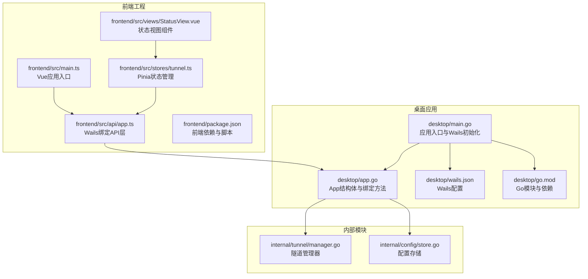
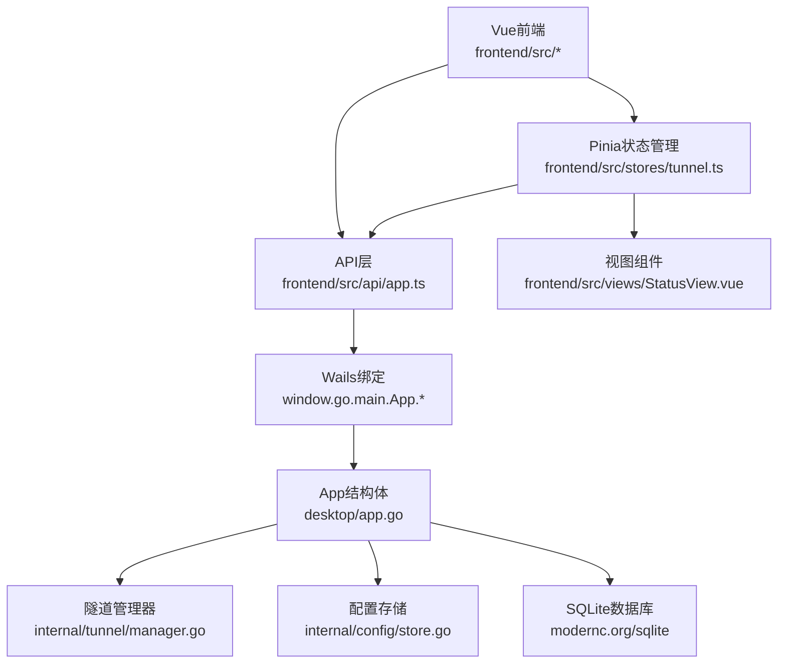
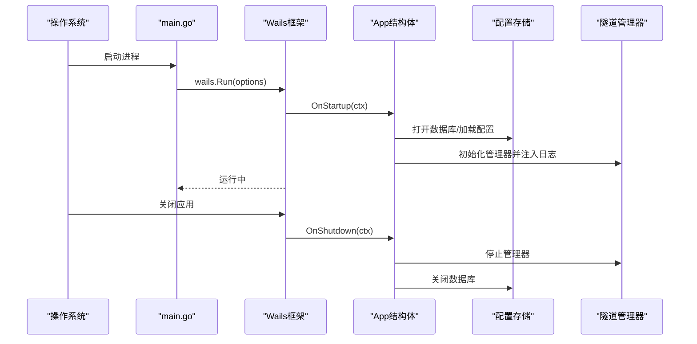
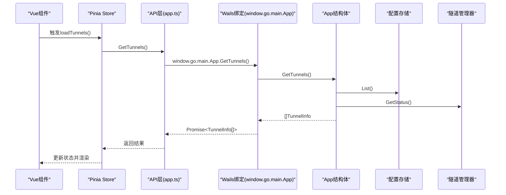
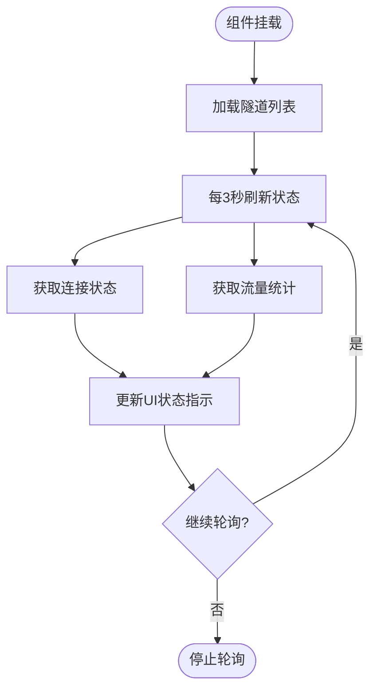
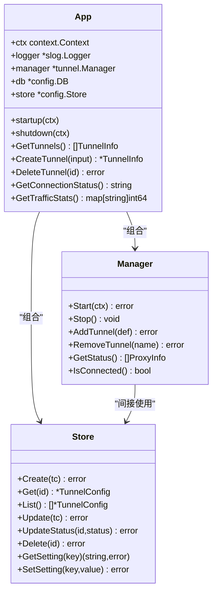
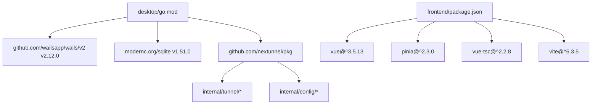

# Wails框架集成

<cite>
**本文档引用的文件**
- [desktop/main.go](file://desktop/main.go)
- [desktop/wails.json](file://desktop/wails.json)
- [desktop/app.go](file://desktop/app.go)
- [desktop/frontend/src/main.ts](file://desktop/frontend/src/main.ts)
- [desktop/frontend/src/api/app.ts](file://desktop/frontend/src/api/app.ts)
- [desktop/frontend/src/App.vue](file://desktop/frontend/src/App.vue)
- [desktop/frontend/src/stores/tunnel.ts](file://desktop/frontend/src/stores/tunnel.ts)
- [desktop/frontend/src/views/StatusView.vue](file://desktop/frontend/src/views/StatusView.vue)
- [desktop/frontend/package.json](file://desktop/frontend/package.json)
- [desktop/go.mod](file://desktop/go.mod)
- [desktop/internal/tunnel/manager.go](file://desktop/internal/tunnel/manager.go)
- [desktop/internal/config/store.go](file://desktop/internal/config/store.go)
</cite>

## 目录
1. [简介](#简介)
2. [项目结构](#项目结构)
3. [核心组件](#核心组件)
4. [架构总览](#架构总览)
5. [详细组件分析](#详细组件分析)
6. [依赖关系分析](#依赖关系分析)
7. [性能考虑](#性能考虑)
8. [故障排除指南](#故障排除指南)
9. [结论](#结论)

## 简介
本文件面向NexTunnel桌面应用的Wails v2.12.0框架集成，系统性阐述应用启动流程、生命周期管理、前后端绑定机制与跨平台适配策略。重点解析desktop/main.go中的应用初始化过程、wails.json配置项的作用、App结构体如何实现Wails绑定方法，并说明Wails如何将Go后端逻辑与Vue前端界面无缝连接（数据传递、事件通信与错误处理）。同时提供可操作的实践建议，帮助开发者定义可从前端调用的Go方法、处理异步操作与状态更新。

## 项目结构
NexTunnel桌面端采用“Go后端 + Vue前端”的双栈架构，通过Wails v2.12.0桥接前后端。核心目录与职责如下：
- desktop/main.go：应用入口，负责初始化Wails应用、注入资源、注册生命周期回调与绑定对象。
- desktop/app.go：应用主体，封装业务逻辑（数据库、隧道管理、状态查询等），并通过Wails暴露给前端的方法。
- desktop/wails.json：Wails构建与开发配置，定义应用名称、输出文件名、前端安装/构建脚本及开发服务器地址等。
- desktop/frontend：Vue 3 + Pinia 前端工程，包含API层、状态管理与视图组件。
- desktop/internal：Go内部模块，如隧道管理器与配置存储，供App使用。
- desktop/go.mod：Go模块与依赖声明，包含Wails v2.12.0与sqlite驱动等。

图表来源
- [desktop/main.go:1-37](file://desktop/main.go#L1-L37)
- [desktop/app.go:1-208](file://desktop/app.go#L1-L208)
- [desktop/wails.json:1-14](file://desktop/wails.json#L1-L14)
- [desktop/frontend/src/main.ts:1-8](file://desktop/frontend/src/main.ts#L1-L8)
- [desktop/frontend/src/api/app.ts:1-49](file://desktop/frontend/src/api/app.ts#L1-L49)
- [desktop/frontend/src/stores/tunnel.ts:1-83](file://desktop/frontend/src/stores/tunnel.ts#L1-L83)
- [desktop/frontend/src/views/StatusView.vue:1-252](file://desktop/frontend/src/views/StatusView.vue#L1-L252)
- [desktop/frontend/package.json:1-26](file://desktop/frontend/package.json#L1-L26)
- [desktop/go.mod:1-49](file://desktop/go.mod#L1-L49)
- [desktop/internal/tunnel/manager.go:1-310](file://desktop/internal/tunnel/manager.go#L1-L310)
- [desktop/internal/config/store.go:1-165](file://desktop/internal/config/store.go#L1-L165)

章节来源
- [desktop/main.go:1-37](file://desktop/main.go#L1-L37)
- [desktop/wails.json:1-14](file://desktop/wails.json#L1-L14)
- [desktop/go.mod:1-49](file://desktop/go.mod#L1-L49)

## 核心组件
本节聚焦Wails集成的关键构件及其职责：
- 应用入口与初始化：desktop/main.go中通过wails.Run配置窗口属性、资源服务器、生命周期回调与绑定对象，完成应用启动。
- App结构体与绑定方法：desktop/app.go定义App结构体，包含上下文、日志、隧道管理器与配置存储；实现多个可从前端调用的Go方法，如版本查询、隧道增删查改、连接状态与流量统计等。
- 前端绑定与调用：frontend/src/api/app.ts通过window对象访问Wails生成的Go绑定，封装Promise接口供前端组件调用。
- 状态管理与视图：frontend/src/stores/tunnel.ts使用Pinia集中管理隧道列表、连接状态与流量统计；frontend/src/views/StatusView.vue负责UI渲染与定时刷新。

章节来源
- [desktop/main.go:15-36](file://desktop/main.go#L15-L36)
- [desktop/app.go:17-76](file://desktop/app.go#L17-L76)
- [desktop/app.go:87-203](file://desktop/app.go#L87-L203)
- [desktop/frontend/src/api/app.ts:21-48](file://desktop/frontend/src/api/app.ts#L21-L48)
- [desktop/frontend/src/stores/tunnel.ts:23-82](file://desktop/frontend/src/stores/tunnel.ts#L23-L82)
- [desktop/frontend/src/views/StatusView.vue:66-121](file://desktop/frontend/src/views/StatusView.vue#L66-L121)

## 架构总览
下图展示了Wails v2.12.0在NexTunnel中的整体架构：前端Vue应用通过Wails JS绑定调用后端Go方法，Go侧通过App结构体与内部模块（隧道管理器、配置存储）执行业务逻辑，并返回结果或触发状态变更。

图表来源
- [desktop/app.go:17-76](file://desktop/app.go#L17-L76)
- [desktop/app.go:87-203](file://desktop/app.go#L87-L203)
- [desktop/frontend/src/api/app.ts:21-48](file://desktop/frontend/src/api/app.ts#L21-L48)
- [desktop/frontend/src/stores/tunnel.ts:23-82](file://desktop/frontend/src/stores/tunnel.ts#L23-L82)
- [desktop/frontend/src/views/StatusView.vue:66-121](file://desktop/frontend/src/views/StatusView.vue#L66-L121)
- [desktop/internal/tunnel/manager.go:16-58](file://desktop/internal/tunnel/manager.go#L16-L58)
- [desktop/internal/config/store.go:23-165](file://desktop/internal/config/store.go#L23-L165)

## 详细组件分析

### 应用启动流程与生命周期管理
- 启动阶段：desktop/main.go中，main函数创建App实例，配置Wails应用参数（标题、尺寸、背景色、资源服务器），注册OnStartup与OnShutdown回调，并将App作为绑定对象传入。
- 启动回调：App.startup负责打开数据库、加载隧道配置、初始化隧道管理器并注入日志器。
- 关闭回调：App.shutdown负责停止隧道管理器并关闭数据库连接。
- 资源嵌入：通过//go:embed将frontend/dist目录打包进二进制，确保应用运行时无需外部静态资源。

图表来源
- [desktop/main.go:15-36](file://desktop/main.go#L15-L36)
- [desktop/app.go:32-76](file://desktop/app.go#L32-L76)
- [desktop/internal/config/store.go:23-99](file://desktop/internal/config/store.go#L23-L99)
- [desktop/internal/tunnel/manager.go:67-112](file://desktop/internal/tunnel/manager.go#L67-L112)

章节来源
- [desktop/main.go:15-36](file://desktop/main.go#L15-L36)
- [desktop/app.go:32-76](file://desktop/app.go#L32-L76)

### 前后端绑定机制与数据传递
- 绑定对象：main.go中将App实例加入Bind数组，使前端可通过window.go.main.App访问其公开方法。
- API层封装：frontend/src/api/app.ts定义call函数，统一通过window.go.main.App[method](...)调用后端方法，并返回Promise，便于Vue组件异步使用。
- 数据模型：App.GetTunnels返回前端友好的TunnelInfo结构，内部通过App.store.List读取持久化配置，并结合App.manager.GetStatus补充实时状态。
- 错误处理：前端store在调用失败时记录错误并回退到默认状态，保证用户体验。

图表来源
- [desktop/frontend/src/stores/tunnel.ts:34-40](file://desktop/frontend/src/stores/tunnel.ts#L34-L40)
- [desktop/frontend/src/api/app.ts:30-32](file://desktop/frontend/src/api/app.ts#L30-L32)
- [desktop/frontend/src/api/app.ts:21-24](file://desktop/frontend/src/api/app.ts#L21-L24)
- [desktop/app.go:111-139](file://desktop/app.go#L111-L139)
- [desktop/app.go:129-135](file://desktop/app.go#L129-L135)
- [desktop/internal/config/store.go:79-99](file://desktop/internal/config/store.go#L79-L99)
- [desktop/internal/tunnel/manager.go:285-295](file://desktop/internal/tunnel/manager.go#L285-L295)

章节来源
- [desktop/frontend/src/api/app.ts:21-48](file://desktop/frontend/src/api/app.ts#L21-L48)
- [desktop/app.go:111-139](file://desktop/app.go#L111-L139)
- [desktop/frontend/src/stores/tunnel.ts:34-40](file://desktop/frontend/src/stores/tunnel.ts#L34-L40)

### 异步操作与状态更新
- 定时刷新：frontend/src/views/StatusView.vue在挂载时加载隧道与状态，并每3秒刷新一次连接状态与流量统计，确保UI与后端实时同步。
- 错误回退：frontend/src/stores/tunnel.ts在调用失败时记录错误并保持当前状态不变，避免前端崩溃。
- 状态聚合：App.GetTrafficStats汇总所有隧道的入站/出站字节数与隧道数量，供前端展示。

图表来源
- [desktop/frontend/src/views/StatusView.vue:112-120](file://desktop/frontend/src/views/StatusView.vue#L112-L120)
- [desktop/frontend/src/stores/tunnel.ts:63-70](file://desktop/frontend/src/stores/tunnel.ts#L63-L70)
- [desktop/app.go:184-203](file://desktop/app.go#L184-L203)

章节来源
- [desktop/frontend/src/views/StatusView.vue:112-120](file://desktop/frontend/src/views/StatusView.vue#L112-L120)
- [desktop/frontend/src/stores/tunnel.ts:63-70](file://desktop/frontend/src/stores/tunnel.ts#L63-L70)
- [desktop/app.go:184-203](file://desktop/app.go#L184-L203)

### 隧道管理与配置持久化
- 隧道管理器：desktop/internal/tunnel/manager.go负责建立与控制服务器的连接、注册/注销隧道、心跳保活与消息处理。
- 配置存储：desktop/internal/config/store.go提供隧道配置的CRUD与设置项存取，基于SQLite实现。
- App集成：desktop/app.go在startup中加载持久化配置并初始化管理器；在CreateTunnel/DeleteTunnel中同步更新存储与管理器。

图表来源
- [desktop/app.go:17-76](file://desktop/app.go#L17-L76)
- [desktop/app.go:111-182](file://desktop/app.go#L111-L182)
- [desktop/internal/tunnel/manager.go:16-58](file://desktop/internal/tunnel/manager.go#L16-L58)
- [desktop/internal/tunnel/manager.go:285-300](file://desktop/internal/tunnel/manager.go#L285-L300)
- [desktop/internal/config/store.go:23-165](file://desktop/internal/config/store.go#L23-L165)

章节来源
- [desktop/app.go:17-76](file://desktop/app.go#L17-L76)
- [desktop/app.go:111-182](file://desktop/app.go#L111-L182)
- [desktop/internal/tunnel/manager.go:16-58](file://desktop/internal/tunnel/manager.go#L16-L58)
- [desktop/internal/config/store.go:23-165](file://desktop/internal/config/store.go#L23-L165)

### Wails绑定方法定义与调用示例
以下路径展示了如何定义可从前端调用的Go方法以及如何在前端进行调用：
- 定义绑定方法：参考desktop/app.go中的GetVersion、Greet、GetTunnels、CreateTunnel、DeleteTunnel、GetConnectionStatus、GetTrafficStats等方法签名与实现。
- 前端调用绑定方法：参考frontend/src/api/app.ts中的call函数与各导出方法（如GetVersion、GetTunnels、CreateTunnel、DeleteTunnel、GetConnectionStatus、GetTrafficStats）。
- 组件使用：参考frontend/src/views/StatusView.vue与frontend/src/stores/tunnel.ts中对上述API的调用与状态更新。

章节来源
- [desktop/app.go:89-203](file://desktop/app.go#L89-L203)
- [desktop/frontend/src/api/app.ts:21-48](file://desktop/frontend/src/api/app.ts#L21-L48)
- [desktop/frontend/src/views/StatusView.vue:95-108](file://desktop/frontend/src/views/StatusView.vue#L95-L108)
- [desktop/frontend/src/stores/tunnel.ts:34-70](file://desktop/frontend/src/stores/tunnel.ts#L34-L70)

## 依赖关系分析
- 模块依赖：desktop/go.mod声明了Wails v2.12.0、sqlite驱动与nextunnel/pkg等依赖，并通过replace指向本地pkg模块。
- 前端依赖：frontend/package.json声明Vue 3、Pinia、Vite与TypeScript等工具链。
- 内部模块：App依赖internal/tunnel/manager.go与internal/config/store.go提供业务能力。

图表来源
- [desktop/go.mod:1-49](file://desktop/go.mod#L1-L49)
- [desktop/frontend/package.json:1-26](file://desktop/frontend/package.json#L1-L26)

章节来源
- [desktop/go.mod:1-49](file://desktop/go.mod#L1-L49)
- [desktop/frontend/package.json:1-26](file://desktop/frontend/package.json#L1-L26)

## 性能考虑
- 轮询频率：前端每3秒刷新一次连接状态与流量统计，可在保证实时性的前提下降低网络与CPU压力。可根据实际需求调整间隔。
- 数据聚合：后端聚合所有隧道的统计信息，减少前端多次请求带来的开销。
- 资源嵌入：通过go:embed将前端构建产物打包进二进制，减少I/O与部署复杂度。
- 日志与错误：使用slog进行结构化日志，便于定位问题；前端捕获异常并回退到默认状态，提升稳定性。

## 故障排除指南
- 应用无法启动或崩溃
  - 检查desktop/main.go中wails.Run的配置是否正确，尤其是资源服务器与绑定对象。
  - 查看App.startup中数据库打开与隧道初始化是否报错。
- 前端调用后端方法失败
  - 确认frontend/src/api/app.ts中的call函数是否正确映射到window.go.main.App对应方法。
  - 在frontend/src/stores/tunnel.ts中检查错误处理分支，确保异常被捕获并记录。
- 状态不同步
  - 检查frontend/src/views/StatusView.vue中的定时刷新逻辑是否正常运行。
  - 确认App.GetConnectionStatus与App.GetTrafficStats返回值是否符合预期。

章节来源
- [desktop/main.go:15-36](file://desktop/main.go#L15-L36)
- [desktop/app.go:32-76](file://desktop/app.go#L32-L76)
- [desktop/frontend/src/api/app.ts:21-24](file://desktop/frontend/src/api/app.ts#L21-L24)
- [desktop/frontend/src/stores/tunnel.ts:34-70](file://desktop/frontend/src/stores/tunnel.ts#L34-L70)
- [desktop/frontend/src/views/StatusView.vue:112-120](file://desktop/frontend/src/views/StatusView.vue#L112-L120)

## 结论
NexTunnel通过Wails v2.12.0实现了Go后端与Vue前端的高效集成：应用入口负责初始化与生命周期管理，App结构体提供丰富的绑定方法，前端通过API层与状态管理实现异步数据流与UI更新。该架构具备良好的扩展性与跨平台适配能力，适合在桌面环境中提供稳定、直观的隧道管理体验。后续可进一步优化轮询策略、增强错误恢复与日志追踪，以提升整体性能与可观测性。