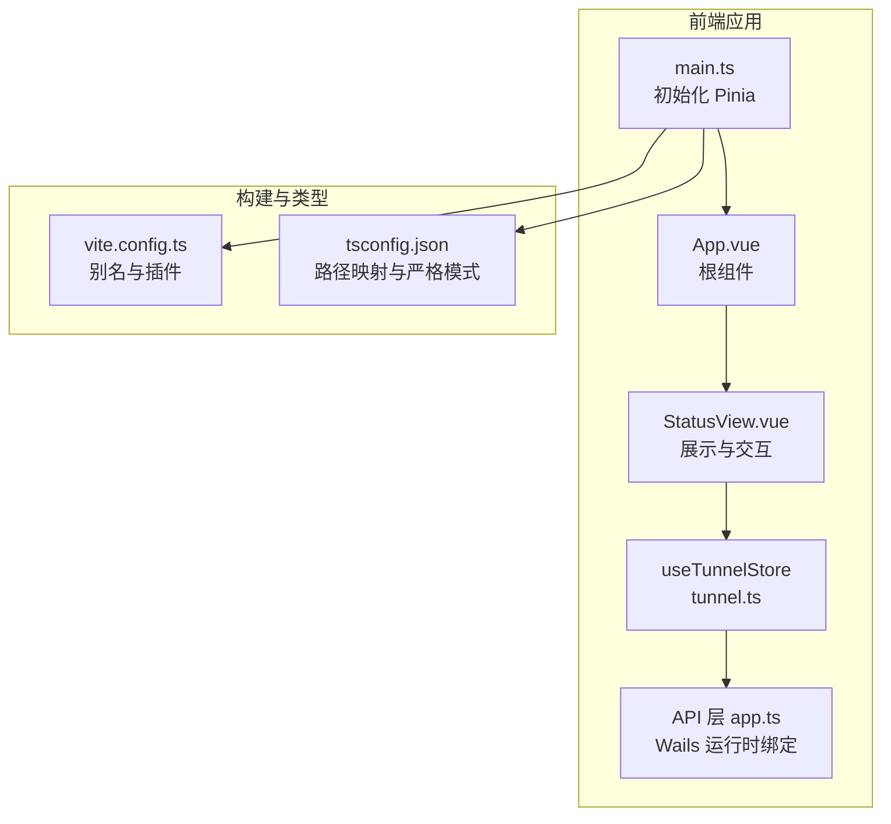
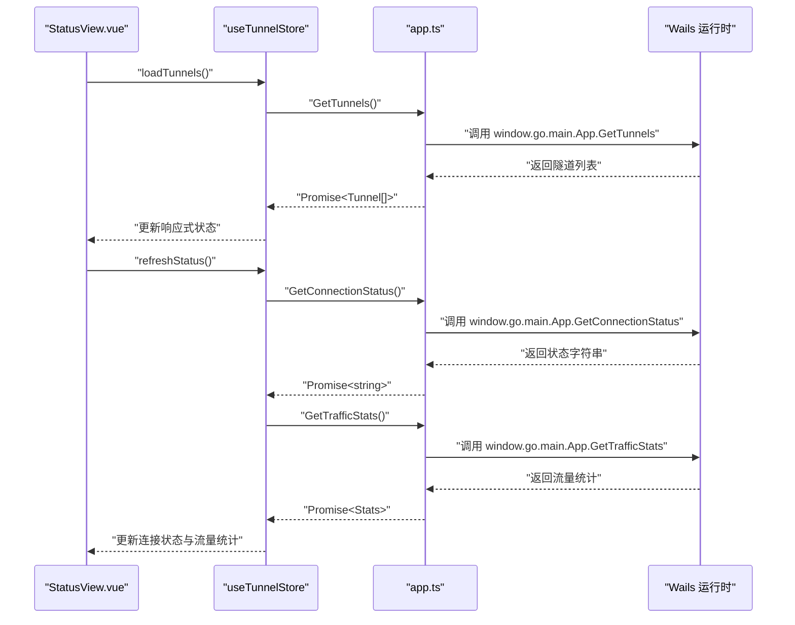
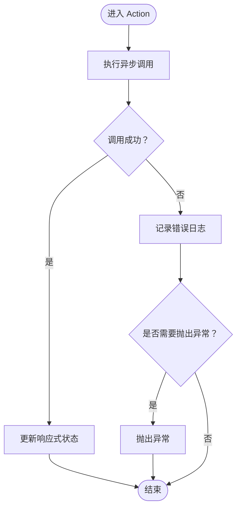
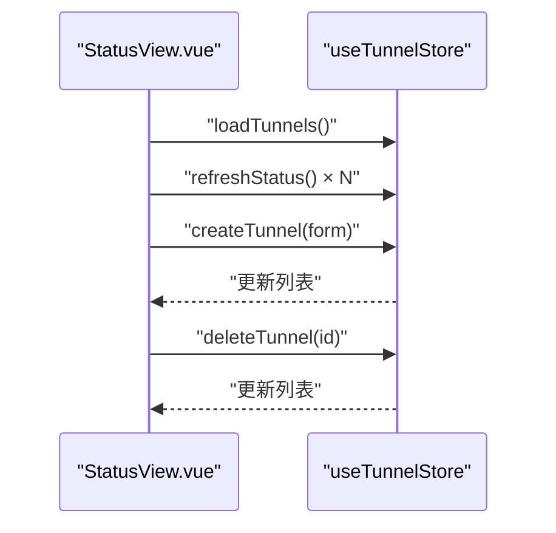
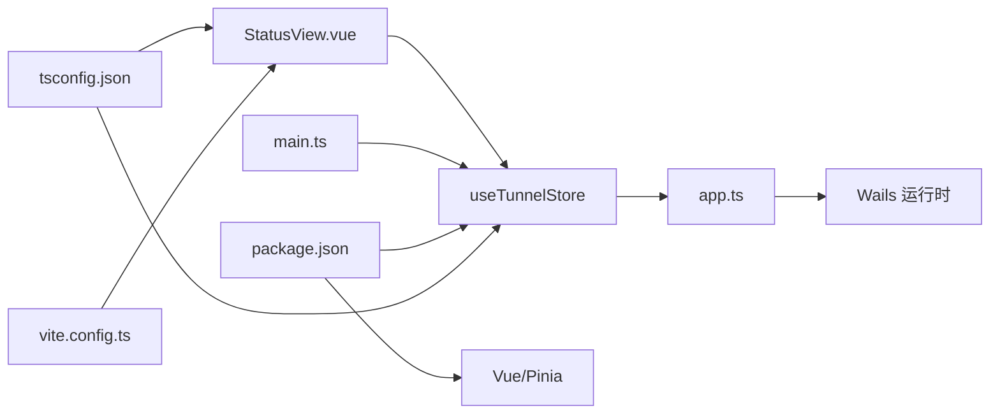

# Pinia状态管理

<cite>
**本文引用的文件**
- [desktop/frontend/src/stores/tunnel.ts](file://desktop/frontend/src/stores/tunnel.ts)
- [desktop/frontend/src/views/StatusView.vue](file://desktop/frontend/src/views/StatusView.vue)
- [desktop/frontend/src/api/app.ts](file://desktop/frontend/src/api/app.ts)
- [desktop/frontend/src/main.ts](file://desktop/frontend/src/main.ts)
- [desktop/frontend/package.json](file://desktop/frontend/package.json)
- [desktop/frontend/tsconfig.json](file://desktop/frontend/tsconfig.json)
- [desktop/frontend/vite.config.ts](file://desktop/frontend/vite.config.ts)
- [README.md](file://README.md)
</cite>

## 目录
1. [简介](#简介)
2. [项目结构](#项目结构)
3. [核心组件](#核心组件)
4. [架构总览](#架构总览)
5. [详细组件分析](#详细组件分析)
6. [依赖关系分析](#依赖关系分析)
7. [性能考虑](#性能考虑)
8. [故障排查指南](#故障排查指南)
9. [结论](#结论)
10. [附录](#附录)

## 简介
本文件针对 NexTunnel 桌面端前端的 Pinia 状态管理系统进行深入技术文档整理，重点覆盖以下方面：
- 状态管理模式与 store 设计原则
- 状态结构设计、Action 方法与 Getter 计算属性
- 状态持久化策略与状态同步机制
- 与 API 层（Wails 运行时绑定）及视图层的集成模式
- 最佳实践、性能优化与调试建议
- 常见问题与解决方案

该系统采用 Vue 3 + Pinia 架构，通过函数式 Store 定义方式组织状态与行为，并通过 API 层与底层 Go 服务进行交互。

章节来源
- [README.md:1-20](file://README.md#L1-L20)

## 项目结构
前端项目位于 desktop/frontend，核心状态管理位于 src/stores/tunnel.ts，视图层通过 StatusView.vue 使用该 store；API 层封装了对 Wails 运行时的调用；应用在 main.ts 中初始化 Pinia 并挂载到 DOM。

图表来源
- [desktop/frontend/src/main.ts:1-8](file://desktop/frontend/src/main.ts#L1-L8)
- [desktop/frontend/src/App.vue:1-74](file://desktop/frontend/src/App.vue#L1-L74)
- [desktop/frontend/src/views/StatusView.vue:1-252](file://desktop/frontend/src/views/StatusView.vue#L1-L252)
- [desktop/frontend/src/stores/tunnel.ts:1-83](file://desktop/frontend/src/stores/tunnel.ts#L1-L83)
- [desktop/frontend/src/api/app.ts:1-49](file://desktop/frontend/src/api/app.ts#L1-L49)
- [desktop/frontend/vite.config.ts:1-15](file://desktop/frontend/vite.config.ts#L1-L15)
- [desktop/frontend/tsconfig.json:1-23](file://desktop/frontend/tsconfig.json#L1-L23)

章节来源
- [desktop/frontend/src/main.ts:1-8](file://desktop/frontend/src/main.ts#L1-L8)
- [desktop/frontend/src/views/StatusView.vue:1-252](file://desktop/frontend/src/views/StatusView.vue#L1-L252)
- [desktop/frontend/src/stores/tunnel.ts:1-83](file://desktop/frontend/src/stores/tunnel.ts#L1-L83)
- [desktop/frontend/src/api/app.ts:1-49](file://desktop/frontend/src/api/app.ts#L1-L49)
- [desktop/frontend/vite.config.ts:1-15](file://desktop/frontend/vite.config.ts#L1-L15)
- [desktop/frontend/tsconfig.json:1-23](file://desktop/frontend/tsconfig.json#L1-L23)

## 核心组件
- 函数式 Pinia Store：定义隧道列表、连接状态、流量统计等响应式数据，以及加载、创建、删除、刷新状态等异步 Action。
- 视图组件：StatusView.vue 负责渲染状态指示器、信息卡片、隧道列表与表单，并定时刷新状态。
- API 层：app.ts 封装 window.go.main.App 的运行时调用，向上提供类型安全的 Promise 接口。
- 应用入口：main.ts 初始化 Pinia 并挂载应用。

章节来源
- [desktop/frontend/src/stores/tunnel.ts:23-82](file://desktop/frontend/src/stores/tunnel.ts#L23-L82)
- [desktop/frontend/src/views/StatusView.vue:66-121](file://desktop/frontend/src/views/StatusView.vue#L66-L121)
- [desktop/frontend/src/api/app.ts:21-49](file://desktop/frontend/src/api/app.ts#L21-L49)
- [desktop/frontend/src/main.ts:1-8](file://desktop/frontend/src/main.ts#L1-L8)

## 架构总览
下图展示了从视图到状态管理再到 API 层的整体调用链路，体现“视图驱动状态更新”的典型模式。

图表来源
- [desktop/frontend/src/views/StatusView.vue:112-120](file://desktop/frontend/src/views/StatusView.vue#L112-L120)
- [desktop/frontend/src/stores/tunnel.ts:34-70](file://desktop/frontend/src/stores/tunnel.ts#L34-L70)
- [desktop/frontend/src/api/app.ts:30-48](file://desktop/frontend/src/api/app.ts#L30-L48)

## 详细组件分析

### tunnel.ts：函数式 Store 设计
- 数据结构
  - 隧道数组：保存多个隧道对象，包含标识、名称、代理类型、本地地址与端口、远端端口、状态等字段。
  - 连接状态：字符串类型，表示当前连接状态。
  - 流量统计：包含入站字节数、出站字节数、隧道数量。
  - 计算属性：隧道数量。
- 异步 Action
  - 加载隧道：拉取后直接写入响应式数组。
  - 创建隧道：调用创建接口并将新隧道推入数组。
  - 删除隧道：调用删除接口并从数组中过滤掉对应项。
  - 刷新状态：并发获取连接状态与流量统计，异常时回退为断开状态。
- 错误处理
  - 所有异步操作均包裹 try/catch，控制台输出错误日志，并在创建/删除场景中向外抛出异常以便上层处理。

图表来源
- [desktop/frontend/src/stores/tunnel.ts:34-70](file://desktop/frontend/src/stores/tunnel.ts#L34-L70)

章节来源
- [desktop/frontend/src/stores/tunnel.ts:5-82](file://desktop/frontend/src/stores/tunnel.ts#L5-L82)

### StatusView.vue：视图与状态的绑定
- 绑定关系
  - 使用 useTunnelStore 获取状态与方法。
  - 渲染连接状态指示器、信息卡片（隧道数量、入站/出站流量）、隧道列表与创建表单。
- 生命周期与定时任务
  - 挂载时加载隧道列表与初始状态，并设置定时器每 3 秒刷新一次状态。
  - 卸载时清理定时器，避免内存泄漏。
- 表单与交互
  - 双向绑定表单字段，校验必填后调用 store.createTunnel。
  - 删除按钮触发 store.deleteTunnel。

图表来源
- [desktop/frontend/src/views/StatusView.vue:66-121](file://desktop/frontend/src/views/StatusView.vue#L66-L121)
- [desktop/frontend/src/stores/tunnel.ts:34-61](file://desktop/frontend/src/stores/tunnel.ts#L34-L61)

章节来源
- [desktop/frontend/src/views/StatusView.vue:66-121](file://desktop/frontend/src/views/StatusView.vue#L66-L121)

### API 层 app.ts：Wails 运行时绑定
- 统一封装 window.go.main.App 的方法调用，统一返回 Promise 类型。
- 提供版本查询、隧道 CRUD、连接状态与流量统计等接口。
- 通过 TypeScript 接口约束输入输出，提升类型安全性。

章节来源
- [desktop/frontend/src/api/app.ts:21-49](file://desktop/frontend/src/api/app.ts#L21-L49)

### 应用入口 main.ts：Pinia 初始化
- 在应用启动阶段注册 Pinia 插件，使全局可使用 useXxxStore。
- 保证后续组件可通过组合式 API 访问状态。

章节来源
- [desktop/frontend/src/main.ts:1-8](file://desktop/frontend/src/main.ts#L1-L8)

## 依赖关系分析
- 模块耦合
  - StatusView.vue 仅通过 useTunnelStore 访问状态与方法，耦合度低。
  - tunnel.ts 仅依赖 app.ts 的 API 接口，不关心具体实现细节。
  - app.ts 仅负责桥接到 Wails 运行时，职责单一。
- 外部依赖
  - Vue 3 与 Pinia 作为核心运行时依赖。
  - Vite 与 TypeScript 提供开发与构建支持。
- 路径别名与类型配置
  - tsconfig.json 与 vite.config.ts 配置了 @/* 别名，便于模块导入。

图表来源
- [desktop/frontend/src/views/StatusView.vue:66-121](file://desktop/frontend/src/views/StatusView.vue#L66-L121)
- [desktop/frontend/src/stores/tunnel.ts:1-4](file://desktop/frontend/src/stores/tunnel.ts#L1-L4)
- [desktop/frontend/src/api/app.ts:21-24](file://desktop/frontend/src/api/app.ts#L21-L24)
- [desktop/frontend/src/main.ts:1-8](file://desktop/frontend/src/main.ts#L1-L8)
- [desktop/frontend/package.json:12-14](file://desktop/frontend/package.json#L12-L14)
- [desktop/frontend/tsconfig.json:17-19](file://desktop/frontend/tsconfig.json#L17-L19)
- [desktop/frontend/vite.config.ts:10-12](file://desktop/frontend/vite.config.ts#L10-L12)

章节来源
- [desktop/frontend/package.json:12-14](file://desktop/frontend/package.json#L12-L14)
- [desktop/frontend/tsconfig.json:17-19](file://desktop/frontend/tsconfig.json#L17-L19)
- [desktop/frontend/vite.config.ts:10-12](file://desktop/frontend/vite.config.ts#L10-L12)

## 性能考虑
- 状态粒度与更新范围
  - 将连接状态与流量统计拆分为独立字段，避免不必要的重渲染。
  - 使用计算属性 tunnelCount，减少模板中的重复计算。
- 异步调用与并发
  - 刷新状态同时获取连接状态与流量统计，减少往返次数。
- 定时刷新频率
  - 当前每 3 秒刷新一次，可根据实际网络与资源占用调整频率。
- 内存与资源释放
  - 在组件卸载时清理定时器，防止内存泄漏与后台任务持续运行。
- 类型与编译期优化
  - 启用严格类型检查与路径别名，有助于 IDE 智能提示与打包优化。

## 故障排查指南
- 现象：创建/删除隧道后界面未更新
  - 检查 store 中是否正确 push 或 filter 隧道列表。
  - 确认视图是否监听了响应式数组变化。
  章节来源
  - [desktop/frontend/src/stores/tunnel.ts:42-61](file://desktop/frontend/src/stores/tunnel.ts#L42-L61)
  - [desktop/frontend/src/views/StatusView.vue:112-121](file://desktop/frontend/src/views/StatusView.vue#L112-L121)
- 现象：连接状态一直显示断开
  - 检查 refreshStatus 是否捕获异常并回退为断开状态。
  - 确认 app.ts 对应运行时方法是否存在且返回字符串。
  章节来源
  - [desktop/frontend/src/stores/tunnel.ts:63-70](file://desktop/frontend/src/stores/tunnel.ts#L63-L70)
  - [desktop/frontend/src/api/app.ts:42-44](file://desktop/frontend/src/api/app.ts#L42-L44)
- 现象：定时器未清理导致内存泄漏
  - 确认 onUnmounted 中是否清理了 interval。
  章节来源
  - [desktop/frontend/src/views/StatusView.vue:118-120](file://desktop/frontend/src/views/StatusView.vue#L118-L120)
- 现象：类型错误或编译失败
  - 检查 tsconfig.json 的路径映射与严格模式配置。
  章节来源
  - [desktop/frontend/tsconfig.json:17-19](file://desktop/frontend/tsconfig.json#L17-L19)

## 结论
NexTunnel 的 Pinia 状态管理以函数式 Store 为核心，结合清晰的 API 层与视图层，实现了“状态驱动视图”的简洁架构。通过合理的状态拆分、异步 Action 编排与定时刷新机制，满足了隧道管理与状态监控的需求。建议在生产环境中进一步引入持久化策略（如本地存储）与更细粒度的错误恢复机制，以增强稳定性与用户体验。

## 附录
- 状态管理最佳实践
  - 将 UI 逻辑与状态逻辑分离，保持 Store 的纯函数特性。
  - 使用计算属性缓存派生数据，减少模板中的重复计算。
  - 对外暴露最小化的公共接口，内部实现可演进。
- 性能优化建议
  - 控制刷新频率，必要时引入节流/防抖。
  - 对大型列表使用虚拟滚动或分页。
  - 合理拆分模块，按需加载 Store。
- 调试工具使用
  - 使用浏览器的 Vue DevTools 查看组件树与状态变更。
  - 在开发环境开启严格模式，利用 TypeScript 提升类型安全。
- 与其他系统集成模式
  - API 层作为唯一外部依赖点，便于替换与测试。
  - 通过运行时绑定与本地存储实现跨会话的状态保留（可选扩展）。