# Vue应用入口与初始化

<cite>
**本文档引用的文件**
- [main.ts](file://desktop/frontend/src/main.ts)
- [App.vue](file://desktop/frontend/src/App.vue)
- [StatusView.vue](file://desktop/frontend/src/views/StatusView.vue)
- [tunnel.ts](file://desktop/frontend/src/stores/tunnel.ts)
- [app.ts](file://desktop/frontend/src/api/app.ts)
- [index.html](file://desktop/frontend/index.html)
- [package.json](file://desktop/frontend/package.json)
- [vite.config.ts](file://desktop/frontend/vite.config.ts)
- [tsconfig.json](file://desktop/frontend/tsconfig.json)
- [env.d.ts](file://desktop/frontend/env.d.ts)
</cite>

## 目录
1. [简介](#简介)
2. [项目结构](#项目结构)
3. [核心组件](#核心组件)
4. [架构概览](#架构概览)
5. [详细组件分析](#详细组件分析)
6. [依赖分析](#依赖分析)
7. [性能考虑](#性能考虑)
8. [故障排除指南](#故障排除指南)
9. [结论](#结论)

## 简介

NexTunnel是一个基于Vue 3和Wails技术栈构建的桌面应用程序，专注于隧道管理和P2P网络连接。本文档深入分析了Vue应用入口的初始化流程，包括应用实例创建、Pinia状态管理器集成以及应用挂载过程。文档还详细解释了App.vue根组件的设计模式、模板结构和全局配置，并阐述了应用启动时序、依赖注入机制和运行时配置。

该应用采用现代化的前端开发技术栈，使用TypeScript进行类型安全编程，通过Vite进行快速开发和构建，利用Pinia实现响应式状态管理，并通过Wails桥接JavaScript与Go后端服务。

## 项目结构

NexTunnel前端项目遵循标准的Vue 3单页应用架构，主要目录结构如下：

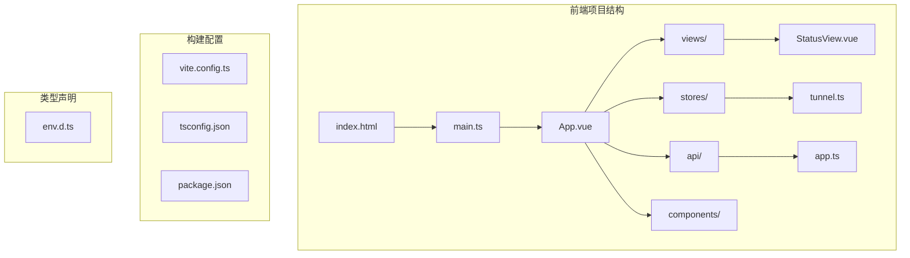

**图表来源**
- [main.ts:1-8](file://desktop/frontend/src/main.ts#L1-L8)
- [index.html:1-13](file://desktop/frontend/index.html#L1-L13)
- [package.json:1-26](file://desktop/frontend/package.json#L1-L26)

**章节来源**
- [main.ts:1-8](file://desktop/frontend/src/main.ts#L1-L8)
- [index.html:1-13](file://desktop/frontend/index.html#L1-L13)
- [package.json:1-26](file://desktop/frontend/package.json#L1-L26)

## 核心组件

### 应用入口初始化流程

NexTunnel的应用入口初始化流程简洁而高效，体现了现代Vue应用的最佳实践：

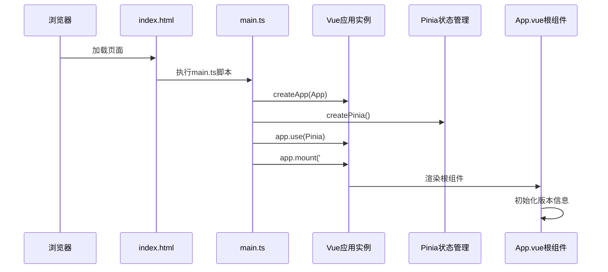

**图表来源**
- [main.ts:1-8](file://desktop/frontend/src/main.ts#L1-L8)
- [index.html:9-10](file://desktop/frontend/index.html#L9-L10)

应用初始化的关键步骤包括：
1. **应用实例创建**：使用`createApp(App)`创建Vue应用实例
2. **状态管理集成**：通过`createPinia()`集成Pinia状态管理器
3. **依赖注入**：使用`app.use()`方法将Pinia注入到Vue应用中
4. **应用挂载**：将应用挂载到DOM元素`#app`

### 根组件设计模式

App.vue作为应用的根组件，采用了简洁的设计模式：

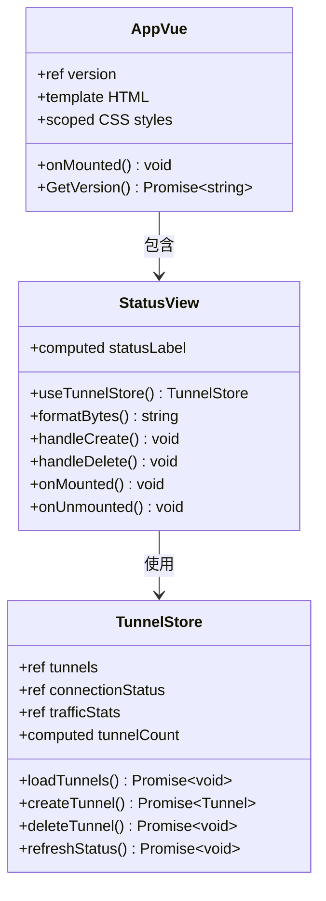

**图表来源**
- [App.vue:13-27](file://desktop/frontend/src/App.vue#L13-L27)
- [StatusView.vue:66-121](file://desktop/frontend/src/views/StatusView.vue#L66-L121)
- [tunnel.ts:23-82](file://desktop/frontend/src/stores/tunnel.ts#L23-L82)

**章节来源**
- [App.vue:1-74](file://desktop/frontend/src/App.vue#L1-L74)
- [main.ts:1-8](file://desktop/frontend/src/main.ts#L1-L8)

## 架构概览

NexTunnel采用分层架构设计，清晰分离了关注点：

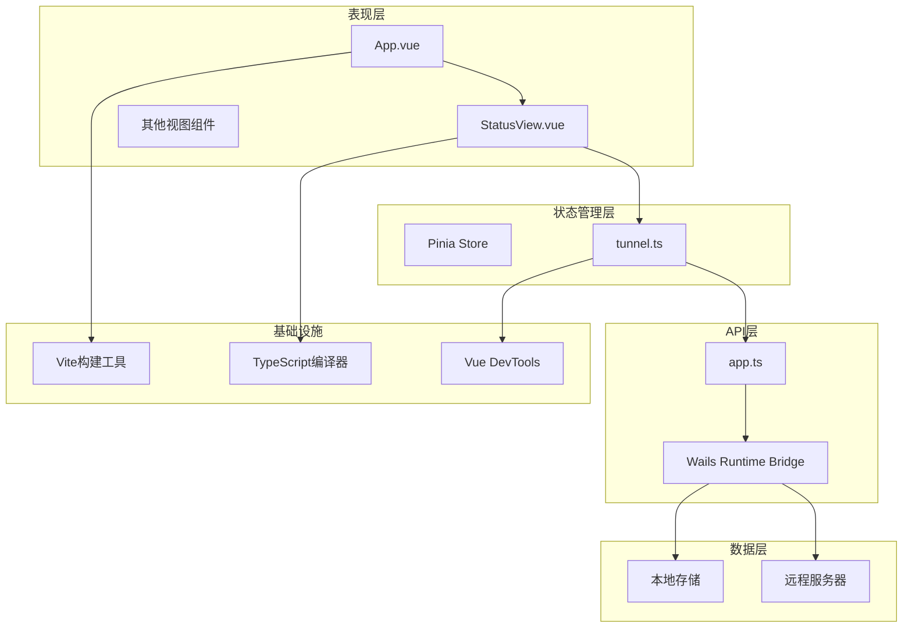

**图表来源**
- [main.ts:1-8](file://desktop/frontend/src/main.ts#L1-L8)
- [tunnel.ts:1-83](file://desktop/frontend/src/stores/tunnel.ts#L1-L83)
- [app.ts:1-49](file://desktop/frontend/src/api/app.ts#L1-L49)

该架构的主要特点：
- **分层清晰**：表现层、状态管理层、API层职责明确
- **依赖注入**：通过Vue插件系统实现依赖注入
- **异步通信**：通过Promise实现异步数据流
- **类型安全**：使用TypeScript确保类型安全

## 详细组件分析

### 应用入口组件分析

#### main.ts初始化流程

应用入口文件实现了最小化的初始化逻辑：

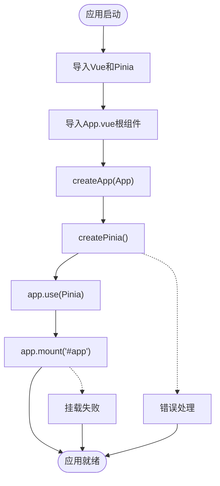

**图表来源**
- [main.ts:1-8](file://desktop/frontend/src/main.ts#L1-L8)

初始化流程的关键特性：
- **简洁性**：仅4行代码完成应用初始化
- **可扩展性**：通过插件系统支持功能扩展
- **错误隔离**：错误处理在各自模块中进行

**章节来源**
- [main.ts:1-8](file://desktop/frontend/src/main.ts#L1-L8)

#### App.vue根组件设计

App.vue采用了组合式API和TypeScript的现代开发模式：

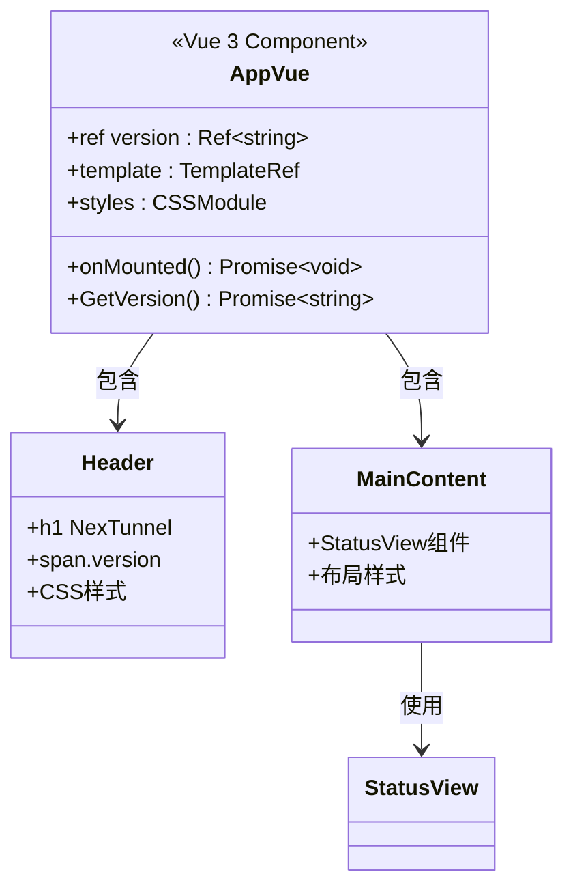

**图表来源**
- [App.vue:1-74](file://desktop/frontend/src/App.vue#L1-L74)

组件设计的核心要素：
- **响应式数据**：使用`ref`管理版本号状态
- **生命周期钩子**：在`onMounted`中获取版本信息
- **异步处理**：使用try-catch处理API调用异常
- **样式封装**：使用CSS变量实现主题定制

**章节来源**
- [App.vue:1-74](file://desktop/frontend/src/App.vue#L1-L74)

### 状态管理组件分析

#### Pinia Store设计模式

tunnel.ts实现了完整的状态管理模式：

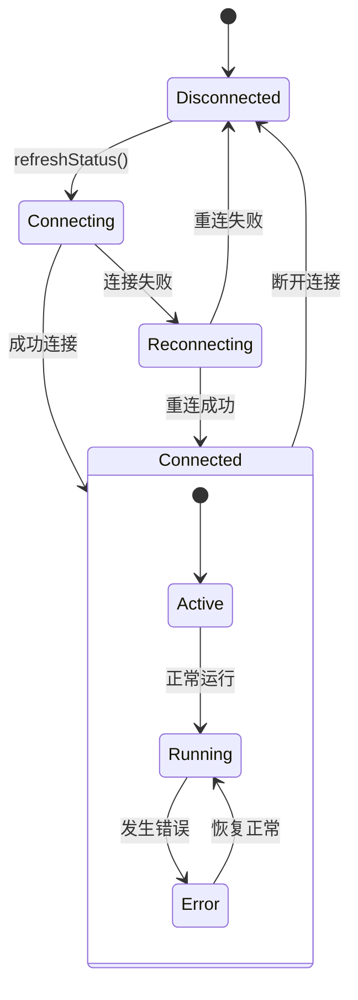

**图表来源**
- [tunnel.ts:23-82](file://desktop/frontend/src/stores/tunnel.ts#L23-L82)

状态管理的关键特性：
- **响应式状态**：使用`ref`和`computed`实现响应式更新
- **异步操作**：所有API调用都是异步的
- **错误处理**：在store内部处理API调用错误
- **计算属性**：使用`computed`优化派生状态

**章节来源**
- [tunnel.ts:1-83](file://desktop/frontend/src/stores/tunnel.ts#L1-L83)

#### 状态管理器接口定义

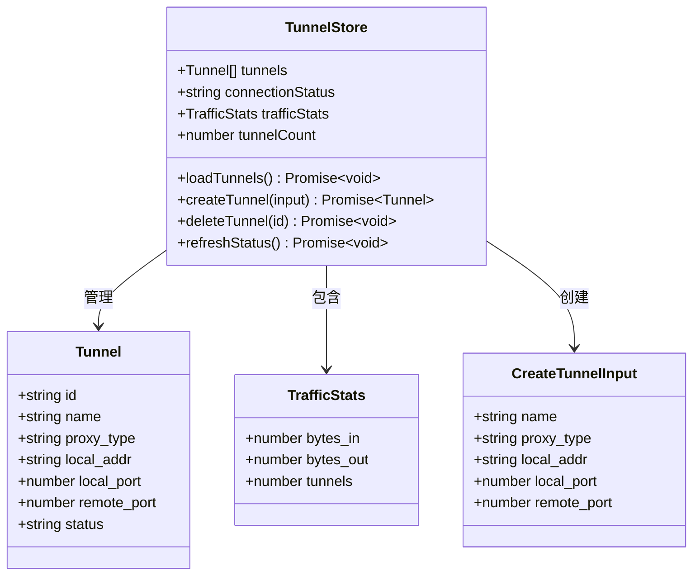

**图表来源**
- [tunnel.ts:5-21](file://desktop/frontend/src/stores/tunnel.ts#L5-L21)

**章节来源**
- [tunnel.ts:1-83](file://desktop/frontend/src/stores/tunnel.ts#L1-L83)

### 视图组件分析

#### StatusView组件架构

StatusView组件展示了复杂的状态管理和用户交互：

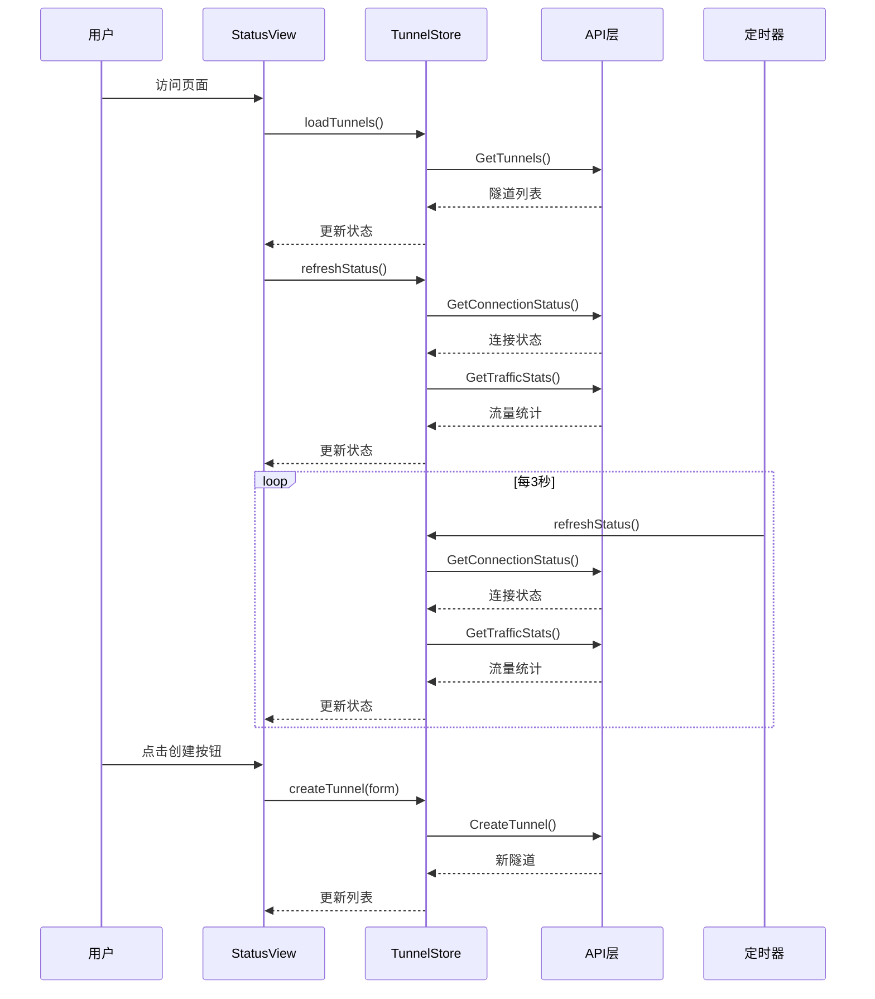

**图表来源**
- [StatusView.vue:112-121](file://desktop/frontend/src/views/StatusView.vue#L112-L121)
- [tunnel.ts:42-51](file://desktop/frontend/src/stores/tunnel.ts#L42-L51)

组件交互的关键流程：
- **初始化加载**：页面加载时获取隧道列表和状态
- **定时刷新**：每3秒自动刷新连接状态和流量统计
- **用户交互**：支持创建和删除隧道操作
- **状态同步**：实时同步后端状态变化

**章节来源**
- [StatusView.vue:1-252](file://desktop/frontend/src/views/StatusView.vue#L1-L252)

### API层设计分析

#### Wails桥接层实现

app.ts实现了JavaScript与Go后端的桥接：

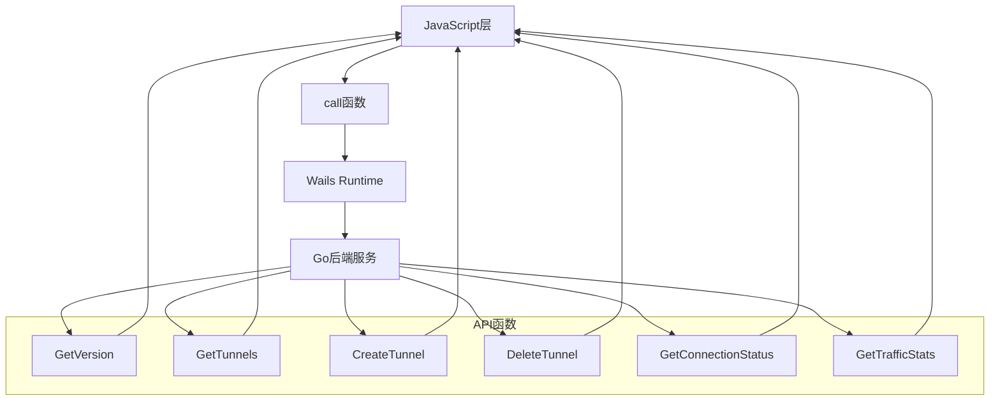

**图表来源**
- [app.ts:22-24](file://desktop/frontend/src/api/app.ts#L22-L24)

API层的设计原则：
- **统一调用接口**：通过`call`函数统一处理Wails调用
- **类型安全**：使用TypeScript接口定义数据结构
- **错误处理**：保持后端错误处理的一致性
- **Promise模式**：所有API调用返回Promise

**章节来源**
- [app.ts:1-49](file://desktop/frontend/src/api/app.ts#L1-L49)

## 依赖分析

### 项目依赖关系

```mermaid
graph TB
subgraph "运行时依赖"
Vue[Vue 3.5.13]
Pinia[Pinia 2.3.0]
end
subgraph "开发时依赖"
Vite[Vite 6.3.5]
TS[TypeScript ~5.6.3]
ESLint[ESLint 9.17.0]
VuePlugin[@vitejs/plugin-vue]
end
subgraph "构建配置"
Package[package.json]
ViteConfig[vite.config.ts]
TSConfig[tsconfig.json]
end
Package --> Vue
Package --> Pinia
Package --> Vite
Package --> TS
Package --> ESLint
Package --> VuePlugin
ViteConfig --> VuePlugin
ViteConfig --> Vite
TSConfig --> TS
```

**图表来源**
- [package.json:12-24](file://desktop/frontend/package.json#L12-L24)
- [vite.config.ts:1-15](file://desktop/frontend/vite.config.ts#L1-L15)
- [tsconfig.json:1-23](file://desktop/frontend/tsconfig.json#L1-L23)

### 依赖注入机制

应用采用了Vue的依赖注入模式：

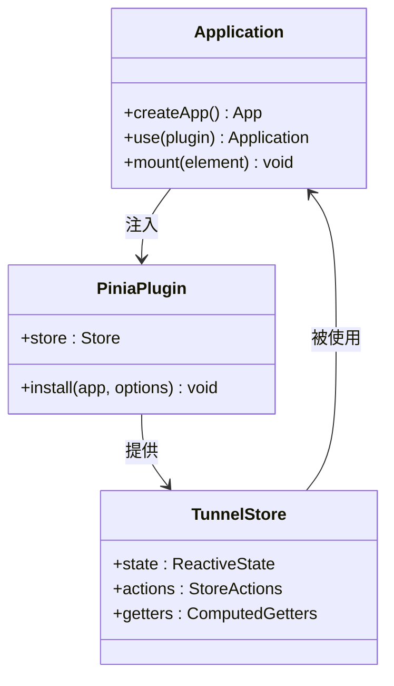

**图表来源**
- [main.ts:5-7](file://desktop/frontend/src/main.ts#L5-L7)
- [tunnel.ts:23-82](file://desktop/frontend/src/stores/tunnel.ts#L23-L82)

**章节来源**
- [package.json:1-26](file://desktop/frontend/package.json#L1-L26)
- [main.ts:1-8](file://desktop/frontend/src/main.ts#L1-L8)

## 性能考虑

### 启动性能优化

NexTunnel在启动性能方面采用了多项优化策略：

1. **懒加载策略**：组件按需加载，减少初始包大小
2. **状态缓存**：Pinia状态持久化，避免重复请求
3. **异步加载**：API调用使用异步模式，不阻塞UI线程
4. **内存管理**：及时清理定时器和事件监听器

### 运行时性能监控

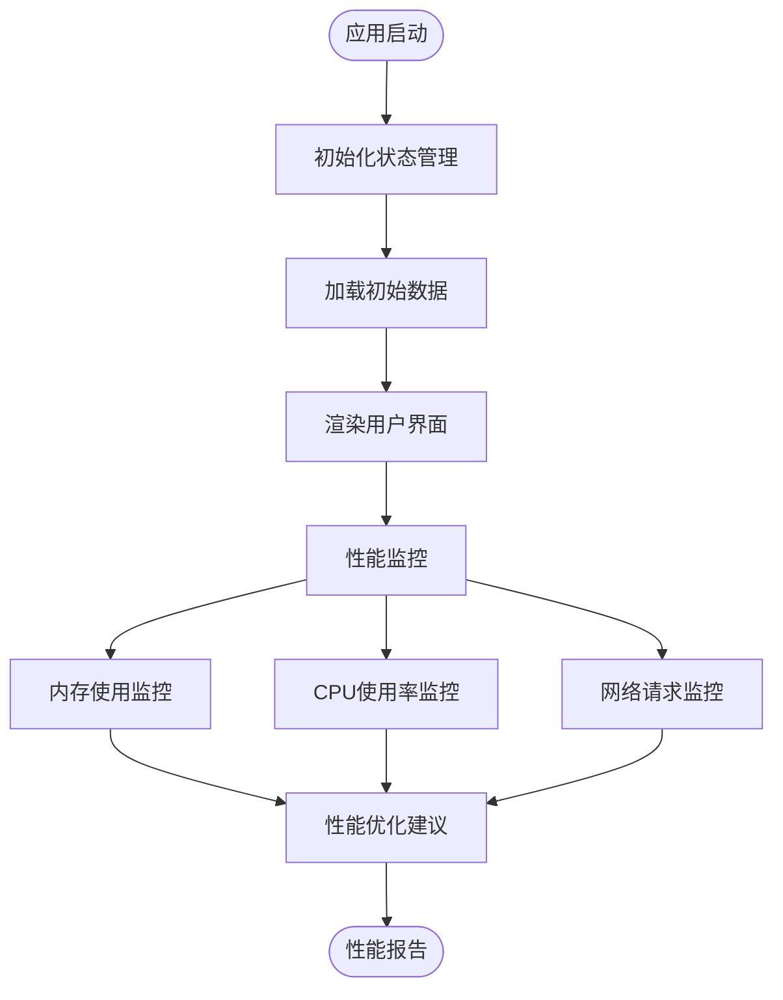

### 最佳实践建议

1. **状态管理**：使用Pinia替代Vuex，获得更好的TypeScript支持
2. **组件设计**：采用组合式API，提高代码复用性
3. **错误处理**：在多个层级实现错误处理机制
4. **性能监控**：建立完善的性能监控体系

## 故障排除指南

### 常见问题诊断

#### 应用无法启动

**症状**：页面空白或控制台报错

**可能原因**：
1. Vue库未正确加载
2. App.vue组件导入失败
3. DOM元素`#app`不存在

**解决方法**：
1. 检查index.html中的`#app`元素
2. 验证main.ts中的组件导入路径
3. 确认Vue和Pinia版本兼容性

#### 状态管理异常

**症状**：状态不更新或更新延迟

**可能原因**：
1. Pinia插件未正确安装
2. Store实例创建失败
3. 异步操作未正确处理

**解决方法**：
1. 检查`app.use(createPinia())`调用
2. 验证store的导出和导入
3. 确保异步操作的Promise链正确

#### API调用失败

**症状**：网络请求超时或返回错误

**可能原因**：
1. Wails桥接配置错误
2. 后端服务未启动
3. 网络连接问题

**解决方法**：
1. 检查Wails runtime绑定
2. 验证后端服务状态
3. 实现重试机制和错误提示

### 调试技巧

1. **浏览器开发者工具**：使用Vue DevTools检查组件状态
2. **控制台日志**：添加详细的错误日志输出
3. **网络面板**：监控API调用和响应时间
4. **性能面板**：分析内存使用和渲染性能

**章节来源**
- [main.ts:1-8](file://desktop/frontend/src/main.ts#L1-L8)
- [tunnel.ts:34-40](file://desktop/frontend/src/stores/tunnel.ts#L34-L40)
- [app.ts:22-24](file://desktop/frontend/src/api/app.ts#L22-L24)

## 结论

NexTunnel的Vue应用入口展现了现代前端开发的最佳实践。通过简洁的初始化流程、清晰的组件架构和完善的错误处理机制，该应用为用户提供了稳定可靠的隧道管理体验。

关键成功因素包括：
- **简洁的初始化**：最小化的入口代码，易于维护
- **清晰的架构**：分层设计确保了良好的可扩展性
- **类型安全**：TypeScript提供了强大的类型安全保障
- **异步处理**：合理的异步模式提升了用户体验
- **错误处理**：多层级的错误处理机制增强了应用稳定性

未来可以考虑的改进方向：
- 添加更多的性能监控和分析工具
- 实现更完善的国际化支持
- 增强离线功能和数据同步机制
- 扩展插件系统以支持更多自定义功能

通过遵循本文档的指导和最佳实践，开发者可以有效地扩展和维护这个Vue应用，同时保持代码质量和用户体验的高标准。