# Vue组件系统架构

<cite>
**本文档引用的文件**
- [App.vue](file://desktop/frontend/src/App.vue)
- [main.ts](file://desktop/frontend/src/main.ts)
- [StatusView.vue](file://desktop/frontend/src/views/StatusView.vue)
- [tunnel.ts](file://desktop/frontend/src/stores/tunnel.ts)
- [app.ts](file://desktop/frontend/src/api/app.ts)
- [window.ts](file://desktop/frontend/src/api/window.ts)
- [vite.config.ts](file://desktop/frontend/vite.config.ts)
- [tsconfig.json](file://desktop/frontend/tsconfig.json)
- [env.d.ts](file://desktop/frontend/env.d.ts)
- [package.json](file://desktop/frontend/package.json)
</cite>

## 目录
1. [简介](#简介)
2. [项目结构](#项目结构)
3. [核心组件](#核心组件)
4. [架构概览](#架构概览)
5. [详细组件分析](#详细组件分析)
6. [依赖关系分析](#依赖关系分析)
7. [性能考虑](#性能考虑)
8. [故障排除指南](#故障排除指南)
9. [结论](#结论)
10. [附录](#附录)

## 简介

NexTunnel是一个基于Vue 3和Wails的桌面应用程序，专注于隧道管理和点对点网络连接。该Vue组件系统采用现代化的前端架构，结合了组合式API、状态管理、类型安全和模块化设计原则。

**更新** 本次更新反映了UI重构后的重大架构变化，包括全新的导航系统、增强的主题样式系统和集成的窗口控制功能。这些变化显著提升了用户体验和应用的可维护性。

本架构文档深入分析了组件层次结构、组件分类、组件间通信模式、设计原则、可复用性考虑、生命周期管理和性能优化策略，并提供了具体的开发示例、最佳实践和调试技巧。

## 项目结构

项目采用清晰的分层架构，主要分为以下层次：

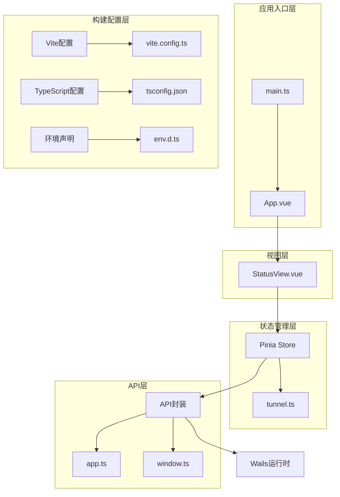

**图表来源**
- [main.ts:1-8](file://desktop/frontend/src/main.ts#L1-L8)
- [App.vue:1-74](file://desktop/frontend/src/App.vue#L1-L74)
- [StatusView.vue:1-252](file://desktop/frontend/src/views/StatusView.vue#L1-L252)
- [tunnel.ts:1-83](file://desktop/frontend/src/stores/tunnel.ts#L1-L83)
- [app.ts:1-49](file://desktop/frontend/src/api/app.ts#L1-L49)
- [window.ts:1-50](file://desktop/frontend/src/api/window.ts#L1-L50)

**章节来源**
- [main.ts:1-8](file://desktop/frontend/src/main.ts#L1-L8)
- [package.json:1-26](file://desktop/frontend/package.json#L1-L26)

## 核心组件

### 应用根组件

应用的根组件是`App.vue`，它负责整体布局和版本信息管理。经过UI重构后，新增了导航系统和主题切换功能：

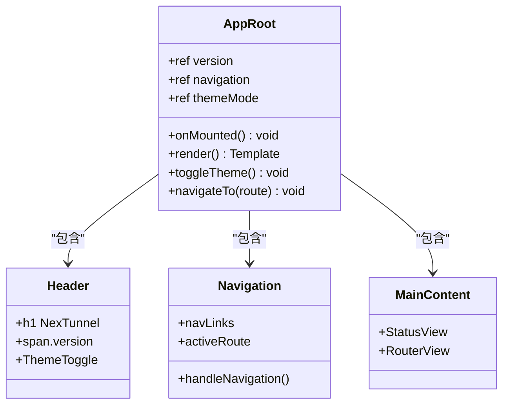

**图表来源**
- [App.vue:1-74](file://desktop/frontend/src/App.vue#L1-L74)

### 状态视图组件

`StatusView.vue`是核心的业务组件，实现了完整的隧道管理功能。UI重构后增强了用户界面和交互体验：

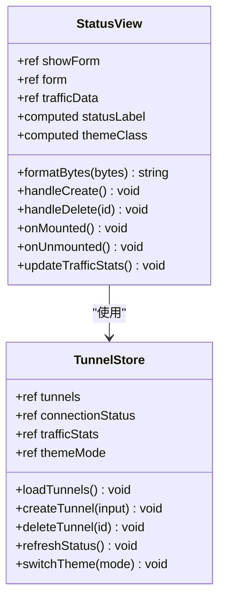

**图表来源**
- [StatusView.vue:66-121](file://desktop/frontend/src/views/StatusView.vue#L66-L121)
- [tunnel.ts:23-82](file://desktop/frontend/src/stores/tunnel.ts#L23-L82)

**章节来源**
- [App.vue:13-27](file://desktop/frontend/src/App.vue#L13-L27)
- [StatusView.vue:66-121](file://desktop/frontend/src/views/StatusView.vue#L66-L121)

## 架构概览

整个Vue组件系统遵循MVVM架构模式，采用单向数据流和响应式状态管理。UI重构后引入了主题系统和导航路由：

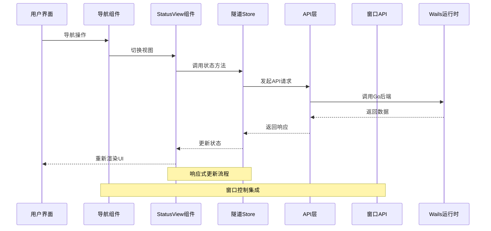

**图表来源**
- [StatusView.vue:95-108](file://desktop/frontend/src/views/StatusView.vue#L95-L108)
- [tunnel.ts:42-61](file://desktop/frontend/src/stores/tunnel.ts#L42-L61)
- [app.ts:22-48](file://desktop/frontend/src/api/app.ts#L22-L48)
- [window.ts:1-50](file://desktop/frontend/src/api/window.ts#L1-L50)

## 详细组件分析

### 组件分类与职责

#### 展示组件（Presentational Components）

展示组件专注于UI呈现，不直接处理业务逻辑。UI重构后增强了主题适配和响应式设计：

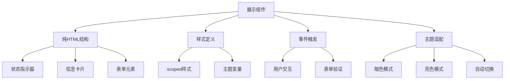

**图表来源**
- [StatusView.vue:1-64](file://desktop/frontend/src/views/StatusView.vue#L1-L64)

#### 容器组件（Container Components）

容器组件负责数据获取和状态管理。UI重构后集成了导航和窗口控制功能：

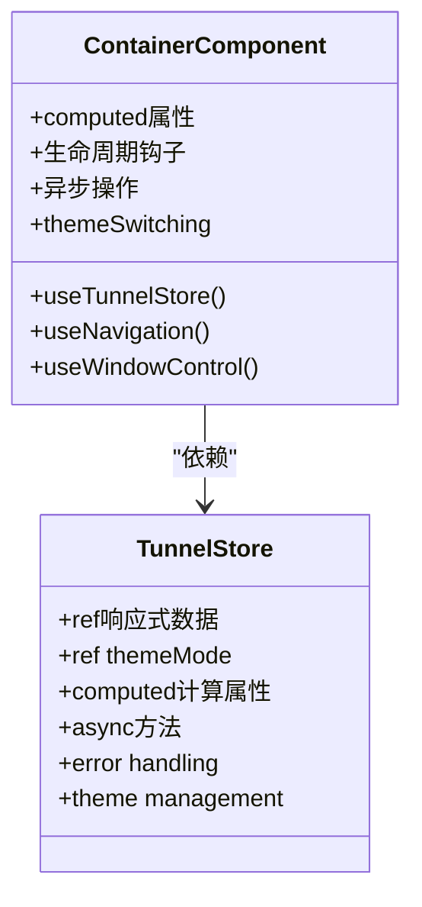

**图表来源**
- [StatusView.vue:67-70](file://desktop/frontend/src/views/StatusView.vue#L67-L70)
- [tunnel.ts:23-82](file://desktop/frontend/src/stores/tunnel.ts#L23-L82)

### 组件间通信模式

#### Props传递

组件通过props接收外部数据，实现单向数据流。UI重构后增加了主题和导航相关的props传递：

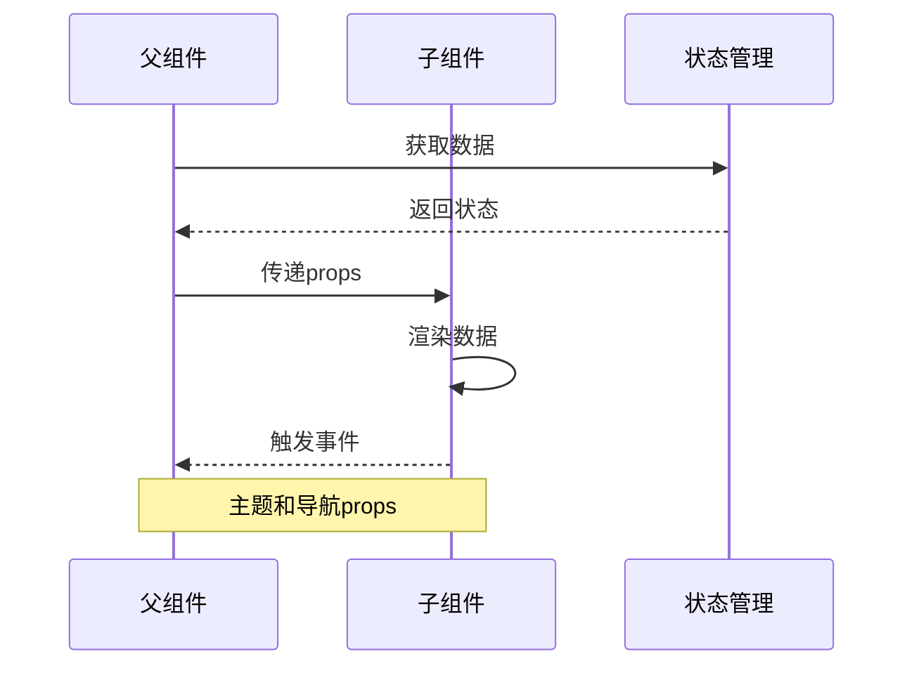

#### 事件系统

组件通过自定义事件向上冒泡，实现父子组件通信。UI重构后增强了导航和窗口控制事件：

```mermaid
flowchart LR
A[子组件] --> B[emit事件]
B --> C[父组件监听]
C --> D[处理逻辑]
D --> E[更新状态]
E --> F[重新渲染]
Note over A,B : 导航事件
Note over C,D : 窗口控制事件
```

#### Provide/Inject模式

UI重构后新增了主题和导航上下文的provide/inject模式：

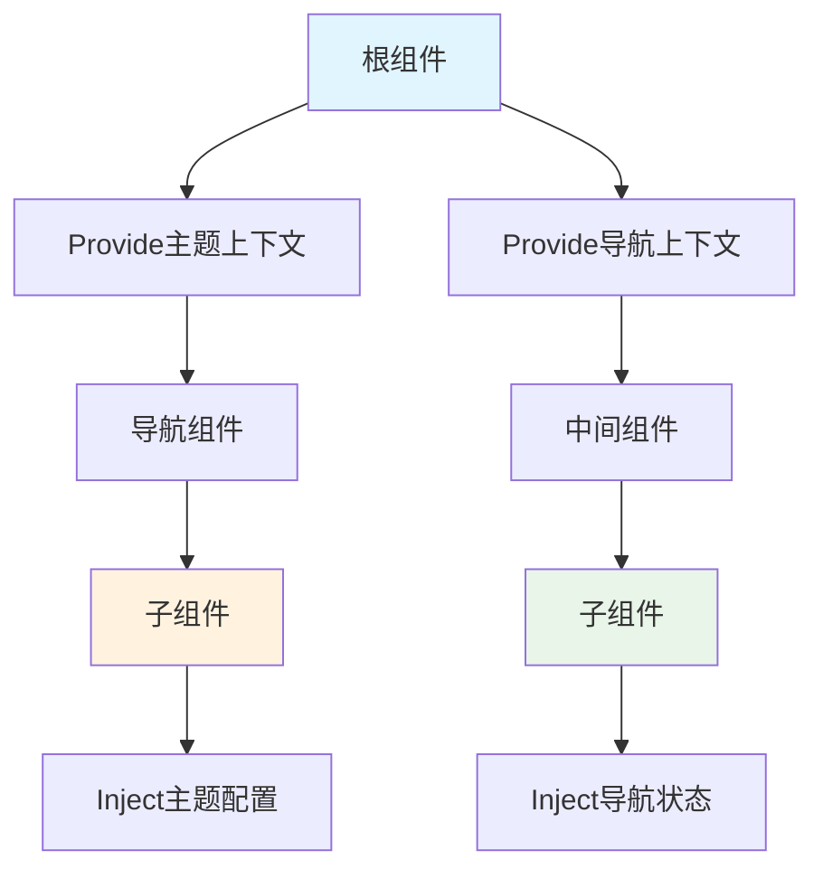

### 数据流管理

#### 单向数据流

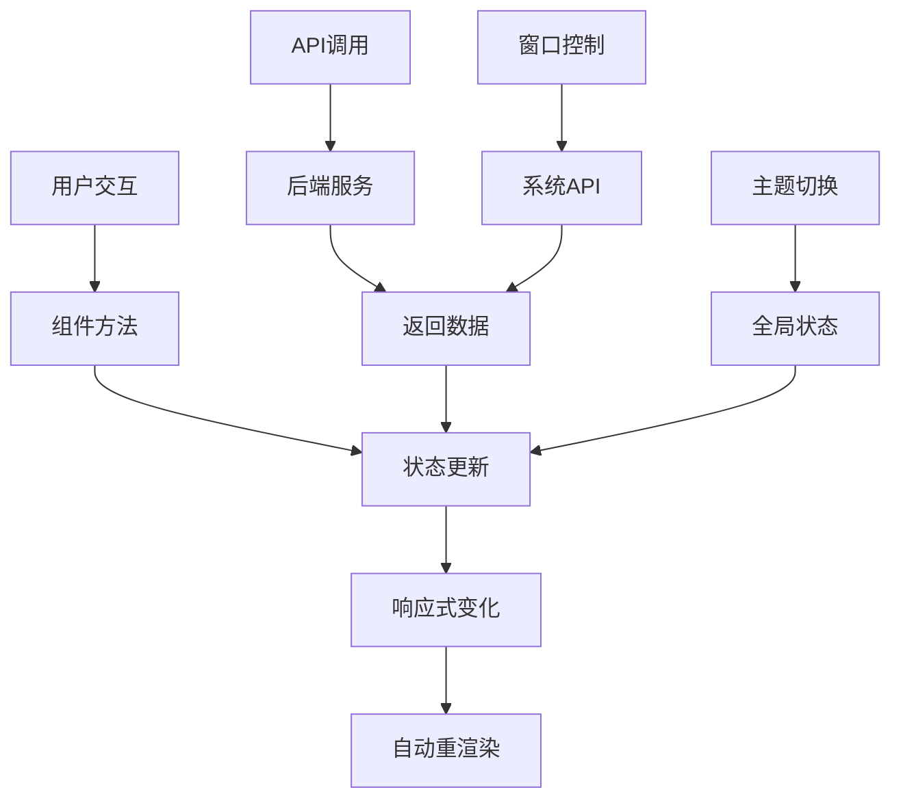

**图表来源**
- [StatusView.vue:112-120](file://desktop/frontend/src/views/StatusView.vue#L112-L120)
- [tunnel.ts:34-70](file://desktop/frontend/src/stores/tunnel.ts#L34-L70)

### 生命周期管理

#### 组件生命周期

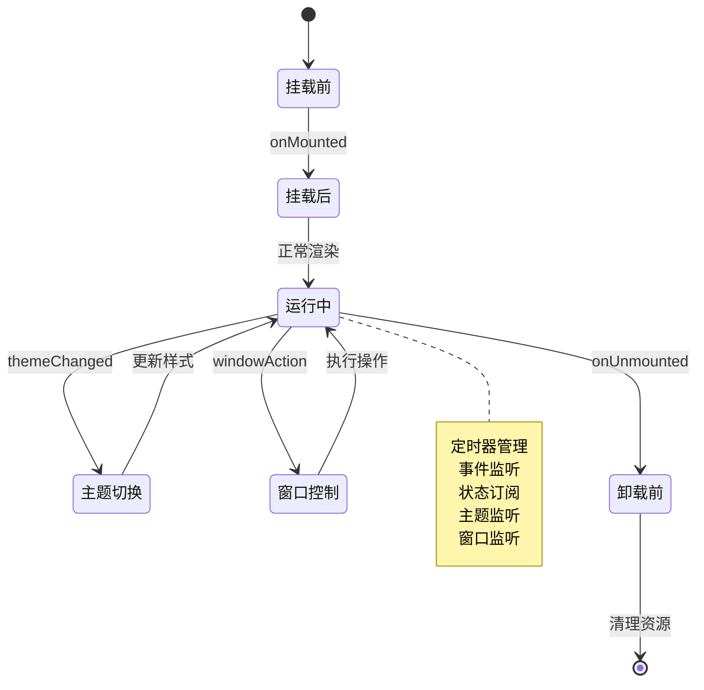

**图表来源**
- [StatusView.vue:112-120](file://desktop/frontend/src/views/StatusView.vue#L112-L120)

**章节来源**
- [StatusView.vue:112-120](file://desktop/frontend/src/views/StatusView.vue#L112-L120)
- [tunnel.ts:34-70](file://desktop/frontend/src/stores/tunnel.ts#L34-L70)

## 依赖关系分析

### 外部依赖

项目使用现代化的前端技术栈，UI重构后集成了更多功能：

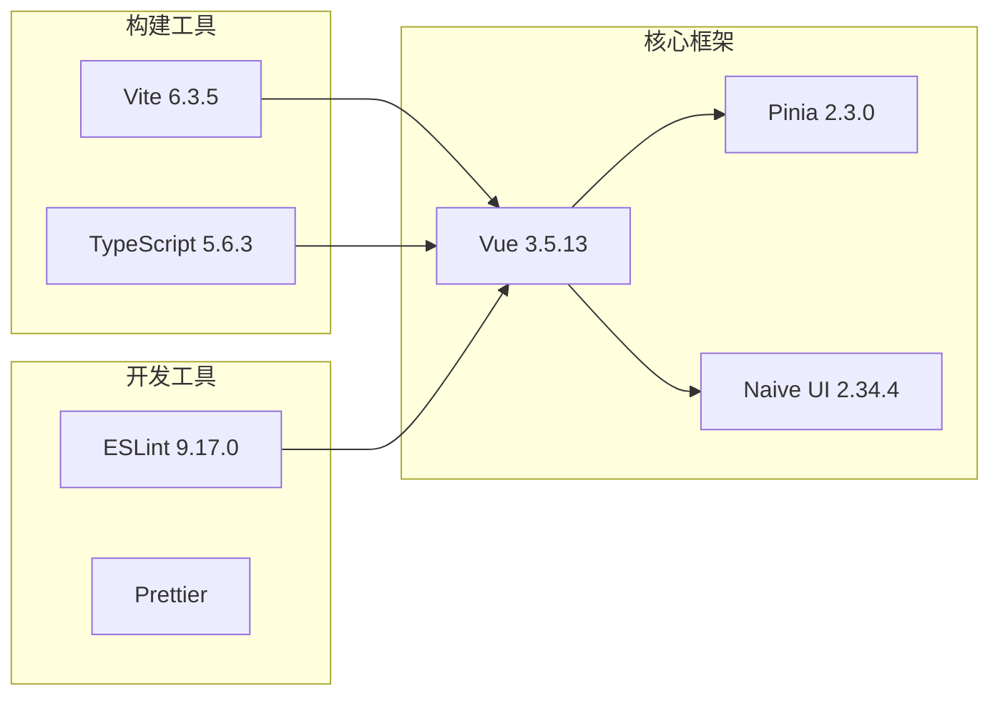

**图表来源**
- [package.json:12-24](file://desktop/frontend/package.json#L12-L24)

### 内部模块依赖

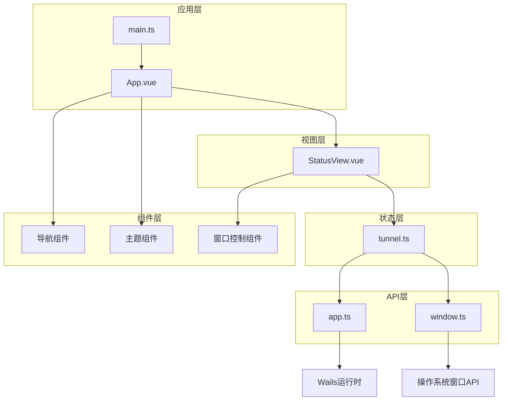

**图表来源**
- [main.ts:1-7](file://desktop/frontend/src/main.ts#L1-L7)
- [StatusView.vue:67-68](file://desktop/frontend/src/views/StatusView.vue#L67-L68)
- [tunnel.ts:3](file://desktop/frontend/src/stores/tunnel.ts#L3)
- [window.ts:1-50](file://desktop/frontend/src/api/window.ts#L1-L50)

**章节来源**
- [package.json:1-26](file://desktop/frontend/package.json#L1-L26)

## 性能考虑

### 渲染优化

#### 计算属性缓存

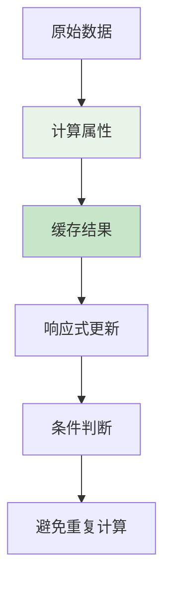

#### 条件渲染

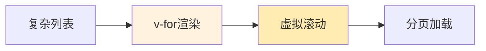

### 内存管理

#### 定时器清理

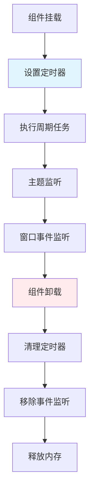

**图表来源**
- [StatusView.vue:110-120](file://desktop/frontend/src/views/StatusView.vue#L110-L120)

### 网络请求优化

#### 请求去重

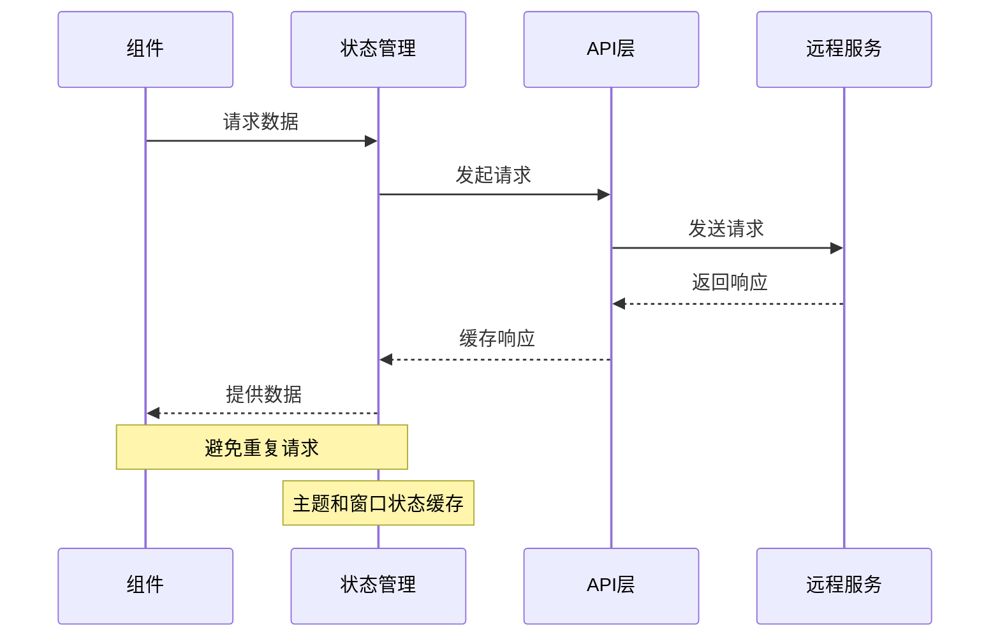

**章节来源**
- [StatusView.vue:112-116](file://desktop/frontend/src/views/StatusView.vue#L112-L116)
- [tunnel.ts:63-70](file://desktop/frontend/src/stores/tunnel.ts#L63-L70)

## 故障排除指南

### 常见问题诊断

#### 组件渲染问题

```mermaid
flowchart TD
A[组件不更新] --> B{检查响应式}
B --> |否| C[添加ref/reactive]
B --> |是| D{检查作用域}
D --> |全局| E[移除scoped]
D --> |局部| F[正确使用scoped}
G[样式冲突] --> H[检查CSS优先级]
H --> I[使用深度选择器]
J[事件不触发] --> K[检查事件名]
K --> L[确认事件监听]
M[主题不生效] --> N[检查主题变量]
N --> O[确认主题切换]
P[窗口控制失效] --> Q[检查API调用]
Q --> R[确认权限设置]
```

#### 状态管理问题

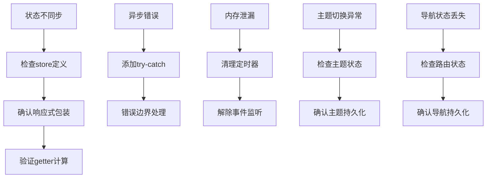

### 调试技巧

#### 开发者工具使用

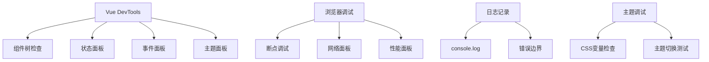

**章节来源**
- [tunnel.ts:37-39](file://desktop/frontend/src/stores/tunnel.ts#L37-L39)
- [StatusView.vue:101-103](file://desktop/frontend/src/views/StatusView.vue#L101-L103)

## 结论

NexTunnel的Vue组件系统展现了现代前端开发的最佳实践，通过清晰的分层架构、响应式状态管理和高效的组件通信模式，实现了高性能和可维护性的平衡。

**更新** 经过UI重构后，系统在原有基础上进一步增强了用户体验和功能完整性：

该系统的主要优势包括：
- **模块化设计**：清晰的职责分离和依赖管理
- **类型安全**：完整的TypeScript支持
- **性能优化**：响应式更新和渲染优化
- **主题系统**：支持暗色和亮色模式切换
- **导航集成**：直观的页面导航和路由管理
- **窗口控制**：系统级窗口操作和状态管理
- **可扩展性**：易于添加新功能和组件

未来可以考虑的改进方向：
- 实现组件懒加载和代码分割
- 添加更完善的错误处理机制
- 扩展组件库和共享组件
- 增强测试覆盖率
- 优化主题系统的性能
- 改进导航的用户体验

## 附录

### 组件开发最佳实践

#### 设计原则

```mermaid
flowchart TD
A[单一职责] --> B[专注一个功能]
C[开放封闭] --> D[对扩展开放]
E[里氏替换] --> F[继承关系合理]
G[接口隔离] --> H[接口简洁]
I[依赖倒置] --> J[依赖抽象]
K[主题一致性] --> L[统一设计语言]
M[导航清晰] --> N[直观的页面结构]
O[窗口控制] --> P[系统集成]
style A fill:#e8f5e8
style C fill:#e8f5e8
style G fill:#e8f5e8
style I fill:#e8f5e8
style K fill:#e8f5e8
style M fill:#e8f5e8
style O fill:#e8f5e8
```

#### 代码组织

```mermaid
graph LR
A[组件文件] --> B[模板]
A --> C[脚本]
A --> D[样式]
E[状态管理] --> F[store文件]
F --> G[类型定义]
F --> H[API封装]
I[工具函数] --> J[通用工具]
I --> K[类型工具]
L[主题系统] --> M[主题配置]
L --> N[主题切换]
O[导航系统] --> P[路由配置]
O --> Q[导航组件]
R[窗口控制] --> S[窗口API]
R --> T[系统集成]
```

### 测试策略

#### 单元测试

```mermaid
flowchart TD
A[组件测试] --> B[快照测试]
A --> C[行为测试]
A --> D[集成测试]
E[状态测试] --> F[store单元测试]
F --> G[异步操作测试]
F --> H[错误处理测试]
I[API测试] --> J[模拟调用]
I --> K[响应验证]
L[主题测试] --> M[主题切换测试]
L --> N[样式验证]
O[导航测试] --> P[路由测试]
O --> Q[导航状态测试]
R[窗口测试] --> S[窗口API测试]
R --> T[系统兼容性测试]
```

#### 性能测试

```mermaid
flowchart TD
A[渲染性能] --> B[FPS监控]
A --> C[内存使用]
A --> D[包大小分析]
E[交互性能] --> F[点击延迟]
E --> G[动画流畅度]
E --> H[滚动性能]
I[主题性能] --> J[主题切换速度]
I --> K[样式计算优化]
L[导航性能] --> M[路由切换时间]
L --> N[页面加载速度]
O[窗口性能] --> P[窗口操作响应]
O --> Q[系统集成效率]
```