# 前端架构设计

<cite>
**本文档引用的文件**
- [main.ts](file://desktop/frontend/src/main.ts)
- [App.vue](file://desktop/frontend/src/App.vue)
- [StatusView.vue](file://desktop/frontend/src/views/StatusView.vue)
- [tunnel.ts](file://desktop/frontend/src/stores/tunnel.ts)
- [app.ts](file://desktop/frontend/src/api/app.ts)
- [window.ts](file://desktop/frontend/src/api/window.ts)
- [i18n.ts](file://desktop/frontend/src/i18n.ts)
- [vite.config.ts](file://desktop/frontend/vite.config.ts)
- [tsconfig.json](file://desktop/frontend/tsconfig.json)
- [tsconfig.node.json](file://desktop/frontend/tsconfig.node.json)
- [package.json](file://desktop/frontend/package.json)
- [env.d.ts](file://desktop/frontend/env.d.ts)
- [eslint.config.js](file://desktop/frontend/eslint.config.js)
- [index.html](file://desktop/frontend/index.html)
</cite>

## 更新摘要
**变更内容**
- 更新了根组件设计章节，反映App.vue从简单导航到复杂Naive UI侧边栏导航系统的重大重构
- 新增了UI组件库集成章节，详细介绍Naive UI的使用和主题定制
- 更新了国际化系统章节，展示多语言支持的完整实现
- 新增了窗口控制功能章节，说明自定义标题栏和窗口操作的实现
- 更新了样式系统章节，展示CSS变量和主题覆盖的完整架构

## 目录
1. [简介](#简介)
2. [项目结构](#项目结构)
3. [核心组件](#核心组件)
4. [架构概览](#架构概览)
5. [详细组件分析](#详细组件分析)
6. [UI组件库集成](#ui组件库集成)
7. [国际化系统](#国际化系统)
8. [窗口控制功能](#窗口控制功能)
9. [样式系统](#样式系统)
10. [依赖关系分析](#依赖关系分析)
11. [性能考虑](#性能考虑)
12. [故障排除指南](#故障排除指南)
13. [结论](#结论)

## 简介

NexTunnel是一个基于Vue 3 + TypeScript的现代化桌面应用程序，采用Wails框架实现跨平台桌面应用开发。该应用使用Naive UI组件库构建复杂的用户界面，通过Vue 3的Composition API和TypeScript提供强类型的开发体验。项目采用模块化架构设计，包含清晰的组件层次结构、状态管理、API层和构建配置。

**更新** 项目现已集成了Naive UI组件库，实现了从简单导航到复杂侧边栏导航系统的重大UI重构。

## 项目结构

NexTunnel前端项目遵循标准的Vue 3项目结构，采用功能驱动的组织方式，现已集成Naive UI组件库：

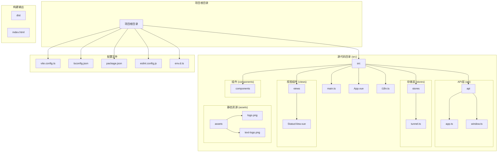

**图表来源**
- [main.ts:1-8](file://desktop/frontend/src/main.ts#L1-L8)
- [App.vue:1-556](file://desktop/frontend/src/App.vue#L1-L556)
- [StatusView.vue:1-200](file://desktop/frontend/src/views/StatusView.vue#L1-L200)
- [tunnel.ts:1-83](file://desktop/frontend/src/stores/tunnel.ts#L1-L83)
- [app.ts:1-49](file://desktop/frontend/src/api/app.ts#L1-L49)
- [window.ts:1-29](file://desktop/frontend/src/api/window.ts#L1-L29)
- [i18n.ts:1-227](file://desktop/frontend/src/i18n.ts#L1-L227)

**章节来源**
- [main.ts:1-8](file://desktop/frontend/src/main.ts#L1-L8)
- [App.vue:1-556](file://desktop/frontend/src/App.vue#L1-L556)
- [vite.config.ts:1-23](file://desktop/frontend/vite.config.ts#L1-L23)
- [package.json:1-29](file://desktop/frontend/package.json#L1-L29)

## 核心组件

### 应用入口点 (main.ts)

应用入口点采用简洁的初始化模式，负责创建Vue应用实例并配置必要的插件：

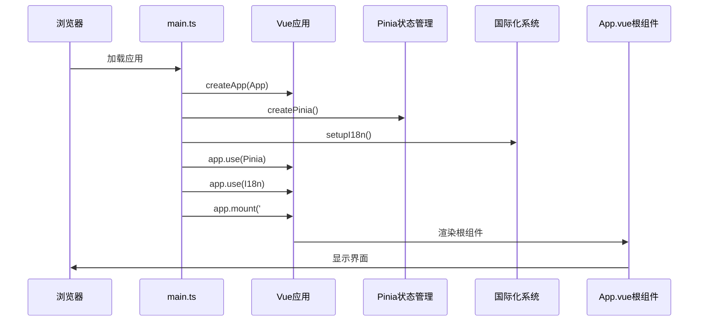

**图表来源**
- [main.ts:1-8](file://desktop/frontend/src/main.ts#L1-L8)

应用入口点的主要职责：
- 创建Vue 3应用实例
- 配置Pinia状态管理
- 初始化国际化系统
- 挂载到DOM元素
- 启动应用生命周期

**章节来源**
- [main.ts:1-8](file://desktop/frontend/src/main.ts#L1-L8)

### 根组件设计 (App.vue)

**更新** 根组件已从简单的导航结构升级为使用Naive UI组件的复杂侧边栏导航系统，实现了完整的桌面应用界面：

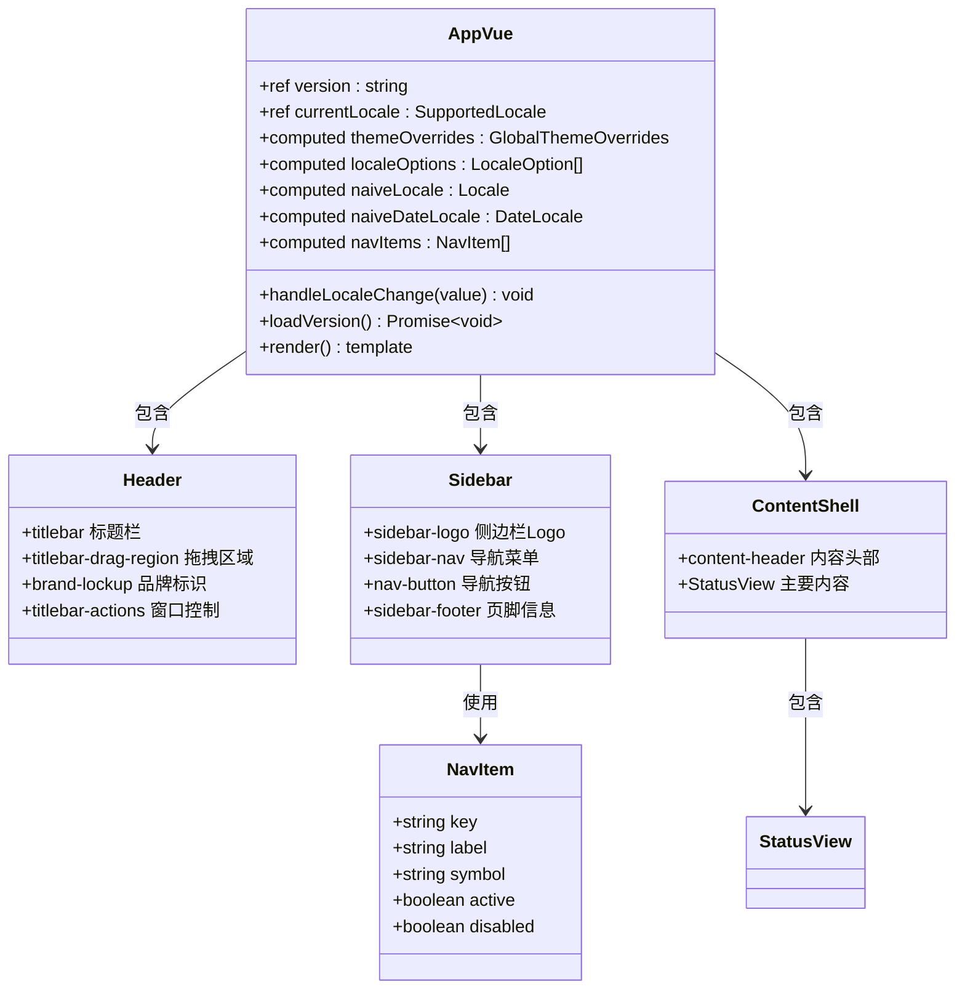

**图表来源**
- [App.vue:145-270](file://desktop/frontend/src/App.vue#L145-L270)

根组件的核心特性：
- **Naive UI主题系统**: 使用darkTheme和themeOverrides实现深色主题定制
- **复杂侧边栏导航**: 包含品牌Logo、导航菜单和页脚信息
- **国际化支持**: 动态语言切换和本地化文本
- **窗口控制**: 自定义标题栏和窗口操作按钮
- **响应式布局**: CSS Grid和Flexbox实现的现代化布局
- **品牌视觉系统**: 完整的品牌色彩和视觉元素

**章节来源**
- [App.vue:1-556](file://desktop/frontend/src/App.vue#L1-L556)

## 架构概览

NexTunnel采用分层架构设计，现已集成Naive UI组件库，确保关注点分离和代码可维护性：

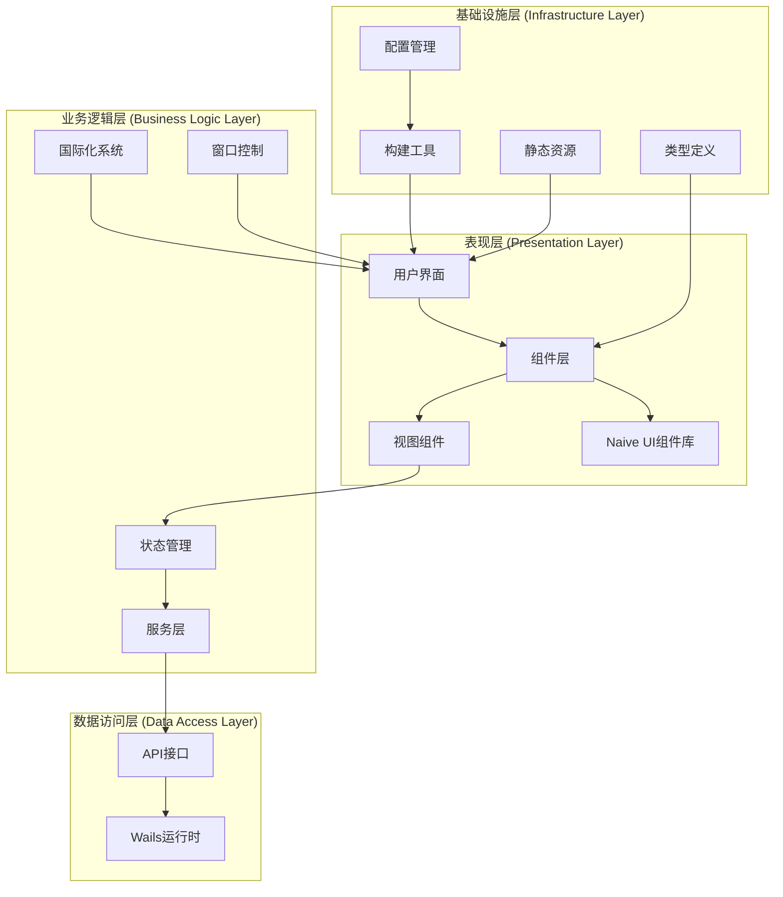

**图表来源**
- [StatusView.vue:1-200](file://desktop/frontend/src/views/StatusView.vue#L1-L200)
- [tunnel.ts:1-83](file://desktop/frontend/src/stores/tunnel.ts#L1-L83)
- [app.ts:1-49](file://desktop/frontend/src/api/app.ts#L1-L49)
- [i18n.ts:1-227](file://desktop/frontend/src/i18n.ts#L1-L227)
- [window.ts:1-29](file://desktop/frontend/src/api/window.ts#L1-L29)

### 数据流架构

应用采用单向数据流模式，现已集成Naive UI组件的状态管理：

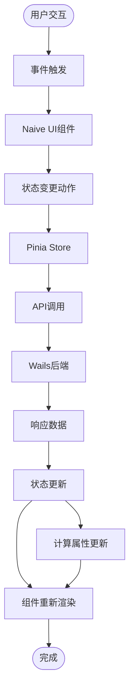

**图表来源**
- [StatusView.vue:1-200](file://desktop/frontend/src/views/StatusView.vue#L1-L200)
- [tunnel.ts:1-83](file://desktop/frontend/src/stores/tunnel.ts#L1-L83)

## 详细组件分析

### 状态管理组件 (tunnel.ts)

状态管理采用Pinia的组合式API模式，提供了类型安全的状态管理和业务逻辑封装：

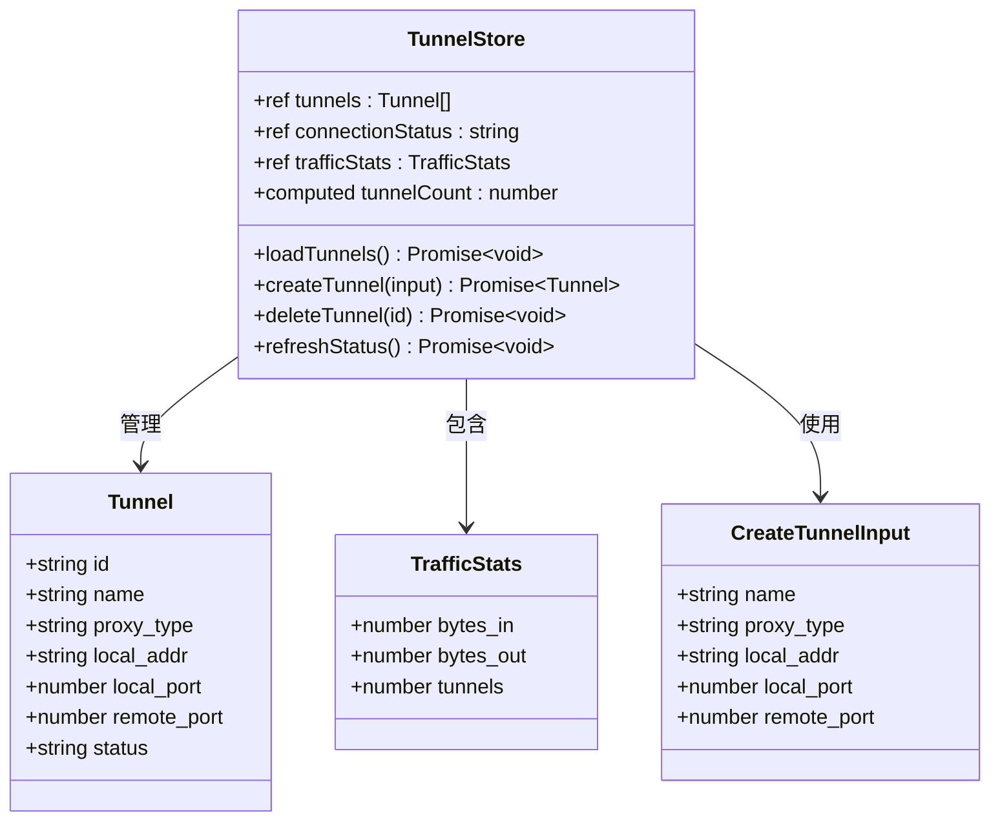

**图表来源**
- [tunnel.ts:1-83](file://desktop/frontend/src/stores/tunnel.ts#L1-L83)

状态管理的关键特性：
- 类型安全的接口定义
- 组合式API的响应式状态
- 异步操作的错误处理
- 计算属性的派生状态

**章节来源**
- [tunnel.ts:1-83](file://desktop/frontend/src/stores/tunnel.ts#L1-L83)

### 视图组件 (StatusView.vue)

状态视图组件是应用的核心界面，现已集成Naive UI组件，实现了完整的隧道管理功能：


**图表来源**
- [StatusView.vue:1-200](file://desktop/frontend/src/views/StatusView.vue#L1-L200)

组件的核心功能：
- 实时状态监控和更新
- 隧道创建和删除操作
- 数据格式化和显示
- 用户交互处理
- Naive UI组件的完整集成

**章节来源**
- [StatusView.vue:1-872](file://desktop/frontend/src/views/StatusView.vue#L1-L872)

### API层设计 (app.ts)

API层作为前端与Wails后端的桥梁，提供了类型安全的接口封装：

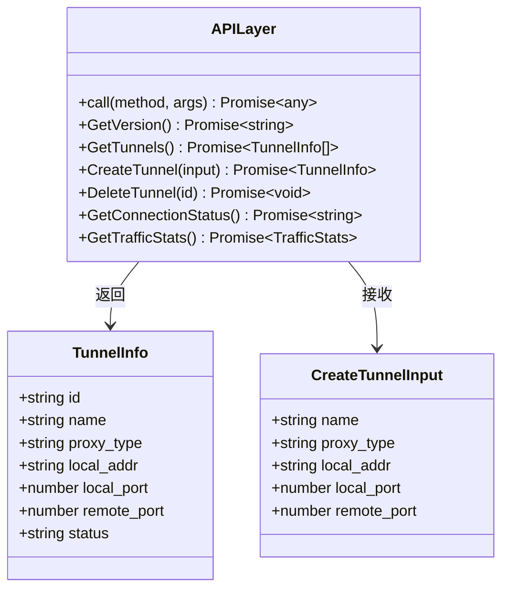

**图表来源**
- [app.ts:1-49](file://desktop/frontend/src/api/app.ts#L1-L49)

API层的设计原则：
- 统一的方法调用接口
- 类型安全的参数传递
- 错误处理和异常传播
- 与Wails运行时的无缝集成

**章节来源**
- [app.ts:1-49](file://desktop/frontend/src/api/app.ts#L1-L49)

## UI组件库集成

**新增** NexTunnel现已集成Naive UI组件库，提供了丰富的UI组件和主题系统：

### Naive UI集成架构

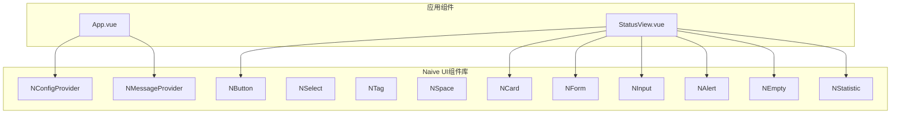

**图表来源**
- [App.vue:148-160](file://desktop/frontend/src/App.vue#L148-L160)
- [StatusView.vue:4-200](file://desktop/frontend/src/views/StatusView.vue#L4-L200)

### 主题系统

应用使用Naive UI的主题系统实现了完整的深色主题定制：

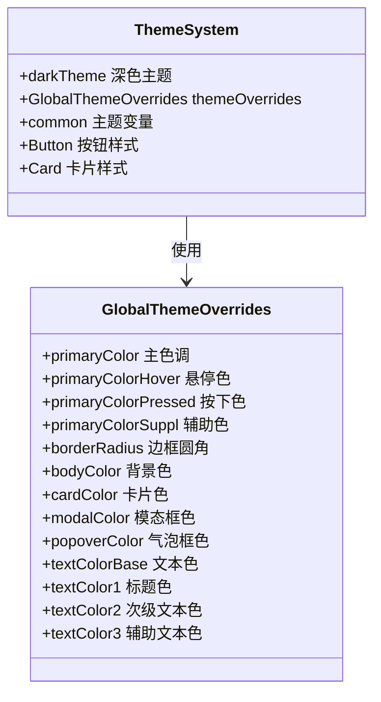

**图表来源**
- [App.vue:180-203](file://desktop/frontend/src/App.vue#L180-L203)

**章节来源**
- [App.vue:148-203](file://desktop/frontend/src/App.vue#L148-L203)

## 国际化系统

**更新** 应用现已实现完整的国际化支持，包含多语言切换和本地化文本：

### 国际化架构

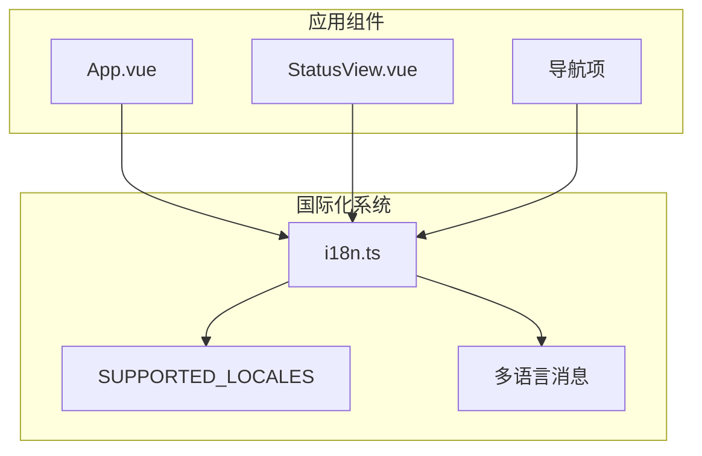

**图表来源**
- [i18n.ts:1-227](file://desktop/frontend/src/i18n.ts#L1-227)
- [App.vue:205-248](file://desktop/frontend/src/App.vue#L205-L248)

### 多语言支持

应用支持简体中文和英语两种语言：

| 功能类别 | 中文 | 英语 |
|---------|------|------|
| 应用名称 | NexTunnel | NexTunnel |
| 标题 | 客户端控制台 | Client Console |
| 子标题 | 面向未来的 NAT 穿透工具 | NAT traversal for the next network |
| 导航项 | 总览/隧道/网络/设置 | Overview/Tunnels/Network/Settings |
| 窗口操作 | 最小化/最大化/关闭 | Minimise/Maximise/Close |

**章节来源**
- [i18n.ts:1-227](file://desktop/frontend/src/i18n.ts#L1-L227)
- [App.vue:205-248](file://desktop/frontend/src/App.vue#L205-L248)

## 窗口控制功能

**新增** 应用实现了自定义标题栏和窗口控制功能，提供原生桌面应用体验：

### 窗口控制架构

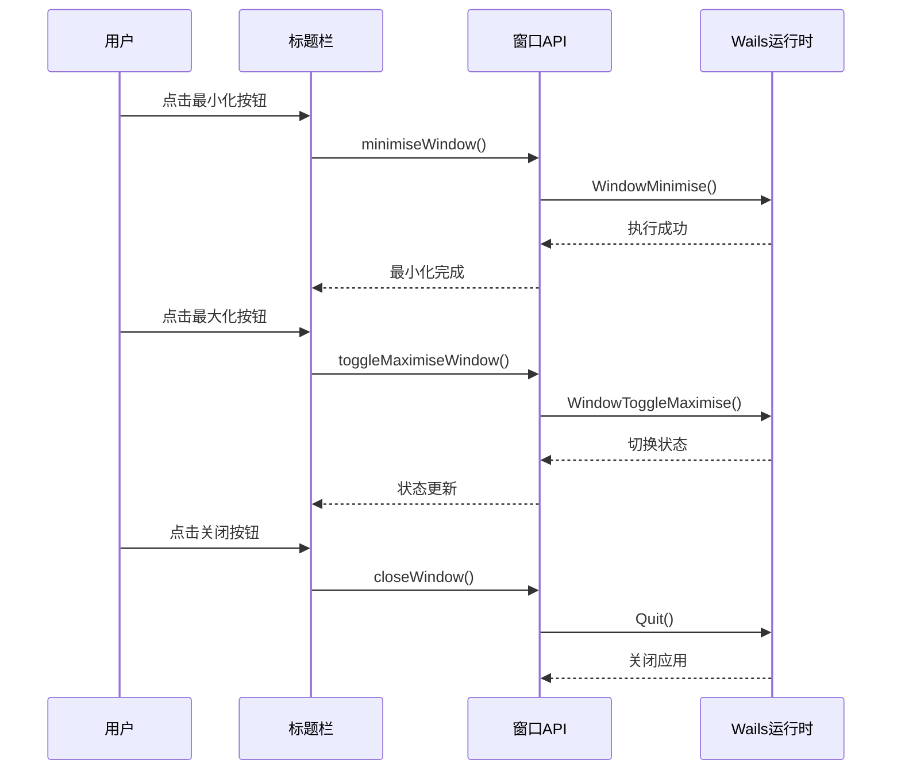

**图表来源**
- [window.ts:15-28](file://desktop/frontend/src/api/window.ts#L15-L28)

### 窗口控制特性

- **自定义标题栏**: 使用CSS变量实现拖拽区域
- **窗口操作**: 最小化、最大化、关闭功能
- **原生集成**: 通过Wails运行时实现系统级窗口控制
- **浏览器兼容**: 预览模式下安全降级

**章节来源**
- [window.ts:1-29](file://desktop/frontend/src/api/window.ts#L1-L29)

## 样式系统

**更新** 应用实现了完整的样式系统，包含CSS变量、主题定制和响应式设计：

### 样式架构

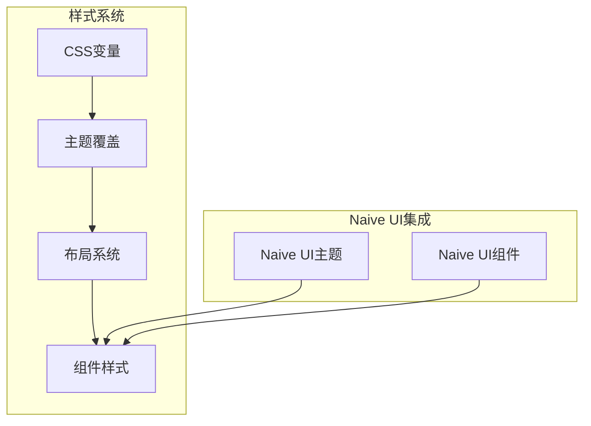

**图表来源**
- [App.vue:272-555](file://desktop/frontend/src/App.vue#L272-L555)

### 品牌色彩系统

应用使用统一的品牌色彩系统：

| 色彩名称 | HEX值 | 用途 | CSS变量 |
|---------|-------|------|---------|
| NexTunnel青色 | #00ffff | 主色调 | --nex-cyan |
| 隧道紫罗兰 | #8a2be2 | 辅助色 | --tunnel-violet |
| 数据蓝色 | #0000ff | 强调色 | --data-blue |
| 中性灰色 | #a8a9a9 | 文本色 | --neutral-grey |
| 未来白色 | #feffff | 主文本色 | --future-white |
| 深色背景 | #091120 | 背景色 | --bg-dark |
| 侧边栏背景 | #0c1628 | 侧边栏背景 | --sidebar-bg |
| 表面背景 | rgba(18,31,52,0.82) | 卡片背景 | --surface-bg |
| 强表面色 | rgba(9,17,32,0.94) | 强卡片背景 | --surface-strong |

**章节来源**
- [App.vue:272-555](file://desktop/frontend/src/App.vue#L272-L555)

## 依赖关系分析

### 技术栈依赖

**更新** 应用现已集成Naive UI组件库，形成了完整的现代前端技术栈：

```mermaid
graph TB
subgraph "运行时依赖"
Vue[Vue 3.5.13]
Pinia[Pinia 2.3.0]
NaiveUI[Naive UI 2.44.1]
VueI18n[Vue I18n 9.14.5]
Wails[Wails运行时]
end
subgraph "开发依赖"
Vite[Vite 6.3.5]
TypeScript[TypeScript 5.6.3]
ESLint[ESLint 9.17.0]
VuePlugin[@vitejs/plugin-vue]
VueTSC[vue-tsc]
end
subgraph "构建优化"
ManualChunks[手动分包]
VueChunk[vue chunk]
NaiveChunk[naive chunk]
end
Vue --> Pinia
Vue --> NaiveUI
Vue --> VueI18n
NaiveUI --> Vue
Vite --> VuePlugin
Vite --> ManualChunks
ManualChunks --> VueChunk
ManualChunks --> NaiveChunk
ESLint --> VuePlugin
ESLint --> VueTSC
```

**图表来源**
- [package.json:13-28](file://desktop/frontend/package.json#L13-L28)
- [vite.config.ts:10-16](file://desktop/frontend/vite.config.ts#L10-L16)

### 模块导入关系

应用内部模块之间的导入关系体现了清晰的分层架构：

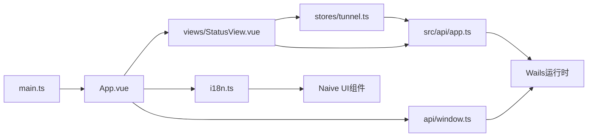

**图表来源**
- [main.ts:1-8](file://desktop/frontend/src/main.ts#L1-L8)
- [App.vue:148-166](file://desktop/frontend/src/App.vue#L148-L166)

**章节来源**
- [package.json:1-29](file://desktop/frontend/package.json#L1-L29)

## 性能考虑

### 构建优化

**更新** 通过Naive UI的手动分包优化，提升了应用的加载性能：

- **手动分包**: 将Vue生态和Naive UI拆分为独立chunk
- **Tree Shaking**: 自动移除未使用的代码
- **按需加载**: 支持动态导入和懒加载
- **缓存策略**: 利用浏览器缓存减少重复加载
- **压缩优化**: 生产环境自动压缩和优化

### 运行时优化

应用在运行时采用了多种优化策略：

- **响应式更新**: Vue 3的细粒度响应式系统
- **虚拟DOM**: 高效的DOM更新机制
- **组件缓存**: 合理的组件生命周期管理
- **内存管理**: 及时清理定时器和事件监听器
- **主题缓存**: Naive UI主题的高效应用

### 网络请求优化

API层实现了智能的网络请求管理：

- **防抖处理**: 避免频繁的状态刷新
- **错误重试**: 失败请求的自动重试机制
- **缓存策略**: 合理的数据缓存和更新
- **并发控制**: 防止过度的API调用

## 故障排除指南

### 常见问题诊断

#### 应用启动失败

**症状**: 应用无法正常启动或显示空白页面

**可能原因**:
- Vue应用实例创建失败
- 根组件渲染异常
- Naive UI组件加载失败
- 依赖包版本不兼容

**解决方案**:
1. 检查main.ts中的应用初始化代码
2. 验证App.vue的模板语法和组件导入
3. 确认Naive UI组件的正确安装和导入
4. 验证依赖包版本兼容性

#### UI组件显示异常

**症状**: Naive UI组件无法正常显示或样式错乱

**可能原因**:
- Naive UI主题配置错误
- CSS变量未正确应用
- 组件导入路径错误
- 样式冲突

**解决方案**:
1. 检查NConfigProvider的配置
2. 验证themeOverrides的设置
3. 确认CSS变量的正确使用
4. 检查组件的导入和注册

#### 窗口控制功能失效

**症状**: 自定义标题栏无法拖拽或窗口操作按钮无效

**可能原因**:
- Wails运行时绑定问题
- CSS拖拽属性配置错误
- 事件处理函数未正确绑定
- 浏览器预览模式限制

**解决方案**:
1. 验证Wails运行时的可用性
2. 检查CSS变量--wails-draggable的设置
3. 确认事件处理器的正确绑定
4. 在预览环境中进行功能降级

**章节来源**
- [main.ts:1-8](file://desktop/frontend/src/main.ts#L1-L8)
- [App.vue:148-166](file://desktop/frontend/src/App.vue#L148-L166)
- [window.ts:15-28](file://desktop/frontend/src/api/window.ts#L15-L28)

## 结论

NexTunnel前端架构展现了现代Vue 3应用的最佳实践，通过清晰的分层设计、类型安全的实现、Naive UI组件库的集成和高效的构建配置，为桌面应用开发提供了优秀的参考模型。

### 架构优势

1. **完整的UI组件库集成**: Naive UI提供了丰富的组件和主题系统
2. **清晰的分层结构**: API层、状态管理层、视图层职责明确
3. **类型安全保障**: 完整的TypeScript类型定义确保代码质量
4. **现代化技术栈**: Vue 3 + TypeScript + Vite + Naive UI的组合提供最佳开发体验
5. **国际化支持**: 完整的多语言切换和本地化文本
6. **原生桌面体验**: 自定义标题栏和窗口控制功能
7. **可扩展性设计**: 模块化架构便于功能扩展和维护

### 技术亮点

- **组合式API**: 提供更灵活的逻辑复用和更好的TypeScript支持
- **Pinia状态管理**: 简洁直观的状态管理方案
- **Naive UI主题系统**: 完整的深色主题定制能力
- **Wails集成**: 无缝的桌面应用开发体验
- **ESLint规范**: 保证代码质量和一致性
- **手动分包优化**: 提升应用加载性能

### 发展建议

1. **组件库扩展**: 考虑引入更多Naive UI组件提升用户体验
2. **测试覆盖**: 增加单元测试和集成测试保障代码质量
3. **性能监控**: 添加性能指标监控和分析工具
4. **无障碍支持**: 考虑添加ARIA标签和键盘导航支持
5. **主题扩展**: 支持更多主题选项和自定义能力

该架构为NexTunnel项目奠定了坚实的技术基础，通过Naive UI组件库的深度集成，为后续的功能扩展和性能优化提供了强大的支撑。