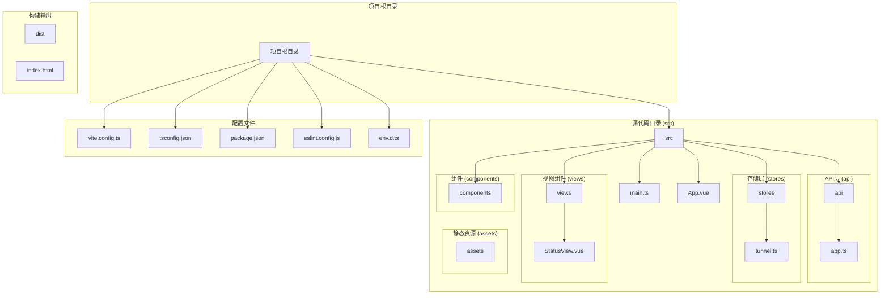
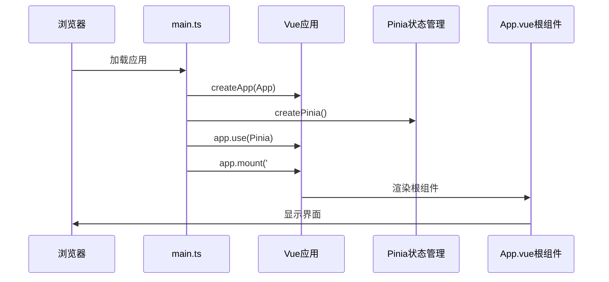
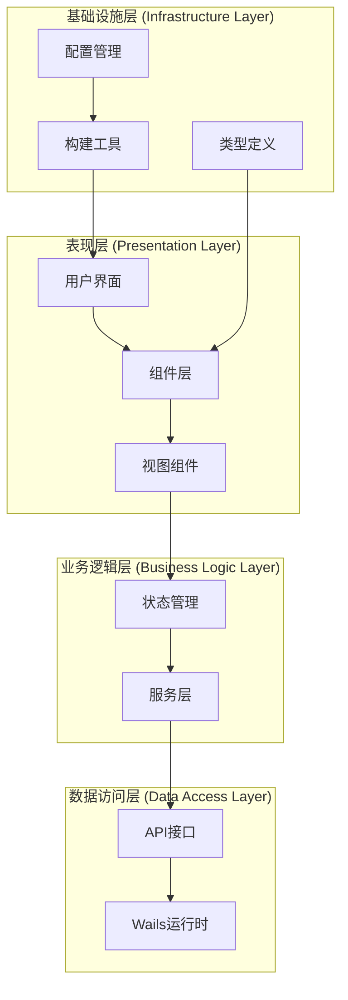
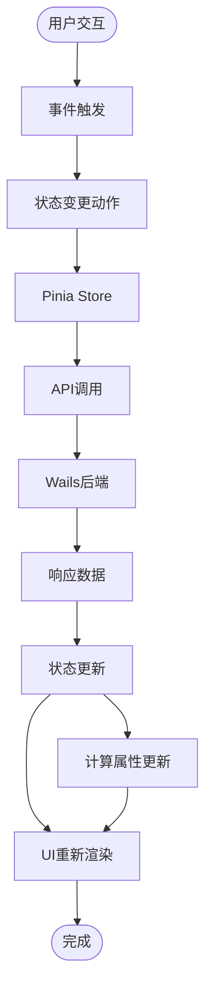
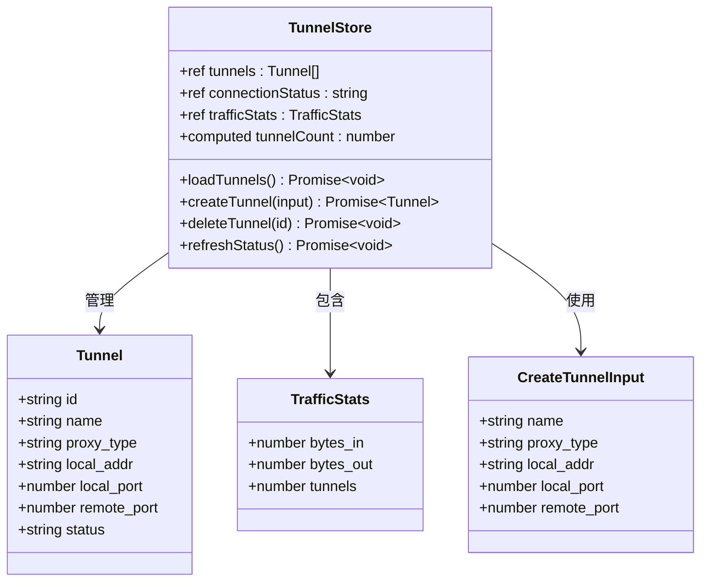
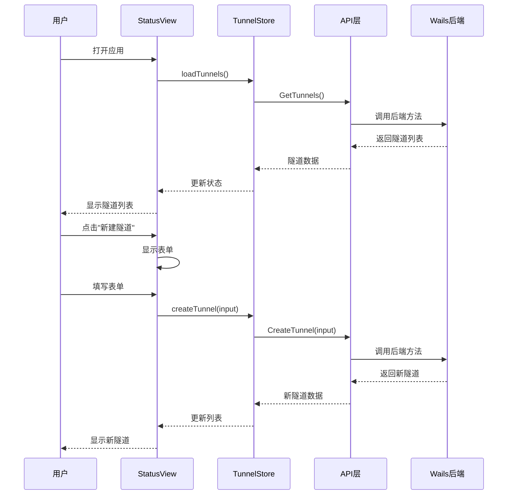
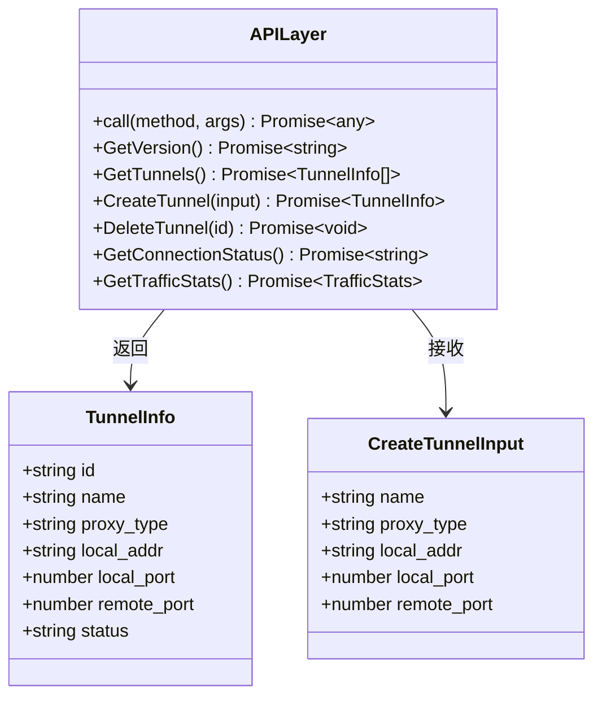
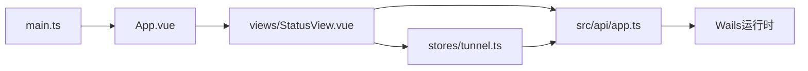

# 前端架构设计

<cite>
**本文档引用的文件**
- [main.ts](file://desktop/frontend/src/main.ts)
- [App.vue](file://desktop/frontend/src/App.vue)
- [StatusView.vue](file://desktop/frontend/src/views/StatusView.vue)
- [tunnel.ts](file://desktop/frontend/src/stores/tunnel.ts)
- [app.ts](file://desktop/frontend/src/api/app.ts)
- [vite.config.ts](file://desktop/frontend/vite.config.ts)
- [tsconfig.json](file://desktop/frontend/tsconfig.json)
- [tsconfig.node.json](file://desktop/frontend/tsconfig.node.json)
- [package.json](file://desktop/frontend/package.json)
- [env.d.ts](file://desktop/frontend/env.d.ts)
- [eslint.config.js](file://desktop/frontend/eslint.config.js)
- [index.html](file://desktop/frontend/index.html)
</cite>

## 目录
1. [简介](#简介)
2. [项目结构](#项目结构)
3. [核心组件](#核心组件)
4. [架构概览](#架构概览)
5. [详细组件分析](#详细组件分析)
6. [依赖关系分析](#依赖关系分析)
7. [性能考虑](#性能考虑)
8. [故障排除指南](#故障排除指南)
9. [结论](#结论)

## 简介

NexTunnel是一个基于Vue 3 + TypeScript的桌面应用程序，采用现代化的前端技术栈构建。该应用使用Wails框架实现跨平台桌面应用开发，通过Vue 3的Composition API和TypeScript提供强类型的开发体验。项目采用模块化架构设计，包含清晰的组件层次结构、状态管理、API层和构建配置。

## 项目结构

NexTunnel前端项目遵循标准的Vue 3项目结构，采用功能驱动的组织方式：



**图表来源**
- [main.ts:1-8](file://desktop/frontend/src/main.ts#L1-L8)
- [App.vue:1-74](file://desktop/frontend/src/App.vue#L1-L74)
- [StatusView.vue:1-252](file://desktop/frontend/src/views/StatusView.vue#L1-L252)
- [tunnel.ts:1-83](file://desktop/frontend/src/stores/tunnel.ts#L1-L83)
- [app.ts:1-49](file://desktop/frontend/src/api/app.ts#L1-L49)

**章节来源**
- [main.ts:1-8](file://desktop/frontend/src/main.ts#L1-L8)
- [App.vue:1-74](file://desktop/frontend/src/App.vue#L1-L74)
- [vite.config.ts:1-15](file://desktop/frontend/vite.config.ts#L1-L15)
- [package.json:1-26](file://desktop/frontend/package.json#L1-L26)

## 核心组件

### 应用入口点 (main.ts)

应用入口点采用简洁的初始化模式，负责创建Vue应用实例并配置必要的插件：



**图表来源**
- [main.ts:1-8](file://desktop/frontend/src/main.ts#L1-L8)

应用入口点的主要职责：
- 创建Vue 3应用实例
- 配置Pinia状态管理
- 挂载到DOM元素
- 启动应用生命周期

**章节来源**
- [main.ts:1-8](file://desktop/frontend/src/main.ts#L1-L8)

### 根组件设计 (App.vue)

根组件采用单文件组件(SFC)格式，实现了响应式头部显示和主内容区域布局：

```mermaid
classDiagram
class AppVue {
+ref version : string
+onMounted() void
+GetVersion() Promise~string~
+render() template
}
class Header {
+h1 NexTunnel
+span.version v{version}
}
class MainContent {
+StatusView StatusView
}
AppVue --> Header : 包含
AppVue --> MainContent : 包含
MainContent --> StatusView : 使用
```

**图表来源**
- [App.vue:1-74](file://desktop/frontend/src/App.vue#L1-L74)

根组件的核心特性：
- 响应式版本号显示
- 动态API调用获取版本信息
- 现代化的CSS变量主题系统
- 组件化设计原则

**章节来源**
- [App.vue:1-74](file://desktop/frontend/src/App.vue#L1-L74)

## 架构概览

NexTunnel采用分层架构设计，确保关注点分离和代码可维护性：



**图表来源**
- [StatusView.vue:66-121](file://desktop/frontend/src/views/StatusView.vue#L66-L121)
- [tunnel.ts:23-82](file://desktop/frontend/src/stores/tunnel.ts#L23-L82)
- [app.ts:22-24](file://desktop/frontend/src/api/app.ts#L22-L24)

### 数据流架构

应用采用单向数据流模式，确保状态变更的可预测性和可追踪性：



**图表来源**
- [StatusView.vue:95-108](file://desktop/frontend/src/views/StatusView.vue#L95-L108)
- [tunnel.ts:42-60](file://desktop/frontend/src/stores/tunnel.ts#L42-L60)

## 详细组件分析

### 状态管理组件 (tunnel.ts)

状态管理采用Pinia的组合式API模式，提供了类型安全的状态管理和业务逻辑封装：



**图表来源**
- [tunnel.ts:5-21](file://desktop/frontend/src/stores/tunnel.ts#L5-L21)
- [tunnel.ts:23-82](file://desktop/frontend/src/stores/tunnel.ts#L23-L82)

状态管理的关键特性：
- 类型安全的接口定义
- 组合式API的响应式状态
- 异步操作的错误处理
- 计算属性的派生状态

**章节来源**
- [tunnel.ts:1-83](file://desktop/frontend/src/stores/tunnel.ts#L1-L83)

### 视图组件 (StatusView.vue)

状态视图组件是应用的核心界面，实现了完整的隧道管理功能：



**图表来源**
- [StatusView.vue:95-108](file://desktop/frontend/src/views/StatusView.vue#L95-L108)
- [tunnel.ts:42-51](file://desktop/frontend/src/stores/tunnel.ts#L42-L51)

组件的核心功能：
- 实时状态监控和更新
- 隧道创建和删除操作
- 数据格式化和显示
- 用户交互处理

**章节来源**
- [StatusView.vue:1-252](file://desktop/frontend/src/views/StatusView.vue#L1-L252)

### API层设计 (app.ts)

API层作为前端与Wails后端的桥梁，提供了类型安全的接口封装：



**图表来源**
- [app.ts:3-19](file://desktop/frontend/src/api/app.ts#L3-L19)
- [app.ts:22-49](file://desktop/frontend/src/api/app.ts#L22-L49)

API层的设计原则：
- 统一的方法调用接口
- 类型安全的参数传递
- 错误处理和异常传播
- 与Wails运行时的无缝集成

**章节来源**
- [app.ts:1-49](file://desktop/frontend/src/api/app.ts#L1-L49)

## 依赖关系分析

### 技术栈依赖

NexTunnel采用了现代前端技术栈，各依赖项之间存在明确的层次关系：

```mermaid
graph TB
subgraph "运行时依赖"
Vue[Vue 3.5.13]
Pinia[Pinia 2.3.0]
Wails[Wails运行时]
end
subgraph "开发依赖"
Vite[Vite 6.3.5]
TypeScript[TypeScript 5.6.3]
ESLint[ESLint 9.17.0]
VuePlugin[@vitejs/plugin-vue]
VueTSC[vue-tsc]
end
subgraph "配置工具"
TSConfig[tsconfig.json]
ESLintConfig[eslint.config.js]
ViteConfig[vite.config.ts]
end
Vue --> Pinia
Vue --> Wails
Vite --> VuePlugin
Vite --> TypeScript
ESLint --> VuePlugin
ESLint --> VueTSC
TSConfig --> TypeScript
ESLintConfig --> ESLint
ViteConfig --> Vite
```

**图表来源**
- [package.json:12-24](file://desktop/frontend/package.json#L12-L24)
- [tsconfig.json:1-23](file://desktop/frontend/tsconfig.json#L1-L23)
- [eslint.config.js:1-16](file://desktop/frontend/eslint.config.js#L1-L16)

### 模块导入关系

应用内部模块之间的导入关系体现了清晰的分层架构：



**图表来源**
- [main.ts:1-8](file://desktop/frontend/src/main.ts#L1-L8)
- [App.vue:14-16](file://desktop/frontend/src/App.vue#L14-L16)
- [StatusView.vue:68-68](file://desktop/frontend/src/views/StatusView.vue#L68-L68)

**章节来源**
- [package.json:1-26](file://desktop/frontend/package.json#L1-L26)

## 性能考虑

### 构建优化

Vite构建工具提供了快速的开发体验和高效的生产构建：

- **Tree Shaking**: 自动移除未使用的代码
- **按需加载**: 支持动态导入和懒加载
- **缓存策略**: 利用浏览器缓存减少重复加载
- **压缩优化**: 生产环境自动压缩和优化

### 运行时优化

应用在运行时采用了多种优化策略：

- **响应式更新**: Vue 3的细粒度响应式系统
- **虚拟DOM**: 高效的DOM更新机制
- **组件缓存**: 合理的组件生命周期管理
- **内存管理**: 及时清理定时器和事件监听器

### 网络请求优化

API层实现了智能的网络请求管理：

- **防抖处理**: 避免频繁的状态刷新
- **错误重试**: 失败请求的自动重试机制
- **缓存策略**: 合理的数据缓存和更新
- **并发控制**: 防止过度的API调用

## 故障排除指南

### 常见问题诊断

#### 应用启动失败

**症状**: 应用无法正常启动或显示空白页面

**可能原因**:
- Vue应用实例创建失败
- 根组件渲染异常
- 依赖包版本不兼容

**解决方案**:
1. 检查main.ts中的应用初始化代码
2. 验证App.vue的模板语法
3. 确认依赖包版本兼容性

#### 状态管理异常

**症状**: 状态更新不生效或出现意外行为

**可能原因**:
- Pinia store配置错误
- 异步操作处理不当
- 类型定义不匹配

**解决方案**:
1. 检查store的定义和导出
2. 验证异步函数的错误处理
3. 确认TypeScript类型定义

#### API调用失败

**症状**: 无法连接到后端服务或获取数据失败

**可能原因**:
- Wails运行时绑定问题
- 网络连接异常
- 权限不足

**解决方案**:
1. 验证Wails运行时的可用性
2. 检查网络连接状态
3. 确认应用权限设置

**章节来源**
- [main.ts:1-8](file://desktop/frontend/src/main.ts#L1-L8)
- [tunnel.ts:34-70](file://desktop/frontend/src/stores/tunnel.ts#L34-L70)
- [app.ts:22-24](file://desktop/frontend/src/api/app.ts#L22-L24)

## 结论

NexTunnel前端架构展现了现代Vue 3应用的最佳实践，通过清晰的分层设计、类型安全的实现和高效的构建配置，为桌面应用开发提供了优秀的参考模型。

### 架构优势

1. **清晰的分层结构**: API层、状态管理层、视图层职责明确
2. **类型安全保障**: 完整的TypeScript类型定义确保代码质量
3. **现代化技术栈**: Vue 3 + TypeScript + Vite的组合提供最佳开发体验
4. **可扩展性设计**: 模块化架构便于功能扩展和维护

### 技术亮点

- **组合式API**: 提供更灵活的逻辑复用和更好的TypeScript支持
- **Pinia状态管理**: 简洁直观的状态管理方案
- **Wails集成**: 无缝的桌面应用开发体验
- **ESLint规范**: 保证代码质量和一致性

### 发展建议

1. **组件库扩展**: 考虑引入UI组件库提升开发效率
2. **测试覆盖**: 增加单元测试和集成测试保障代码质量
3. **性能监控**: 添加性能指标监控和分析工具
4. **国际化支持**: 考虑添加多语言支持功能

该架构为NexTunnel项目奠定了坚实的技术基础，为后续的功能扩展和性能优化提供了良好的支撑。