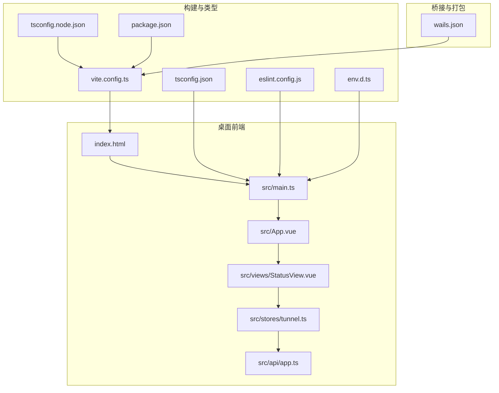
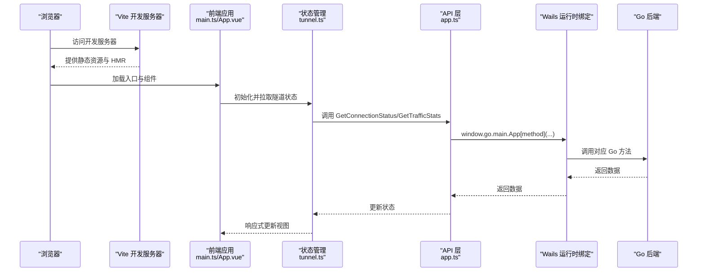
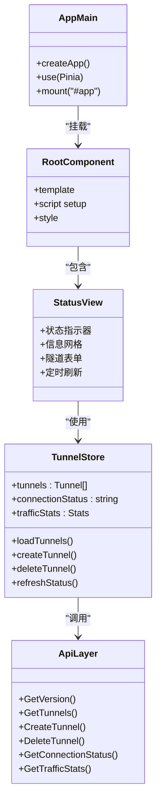
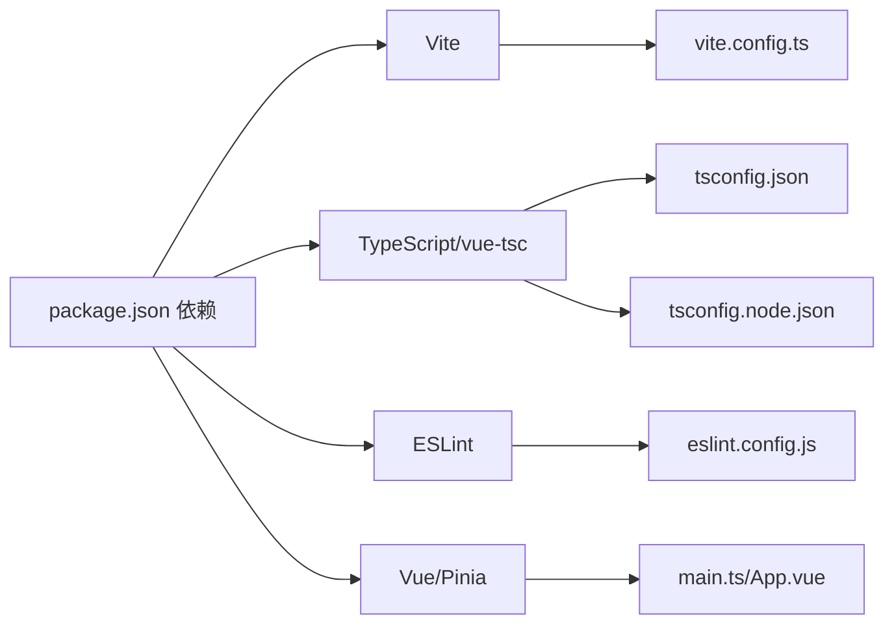

# 构建配置与开发环境

<cite>
**本文引用的文件**
- [vite.config.ts](file://desktop/frontend/vite.config.ts)
- [tsconfig.json](file://desktop/frontend/tsconfig.json)
- [tsconfig.node.json](file://desktop/frontend/tsconfig.node.json)
- [eslint.config.js](file://desktop/frontend/eslint.config.js)
- [package.json](file://desktop/frontend/package.json)
- [env.d.ts](file://desktop/frontend/env.d.ts)
- [index.html](file://desktop/frontend/index.html)
- [main.ts](file://desktop/frontend/src/main.ts)
- [App.vue](file://desktop/frontend/src/App.vue)
- [StatusView.vue](file://desktop/frontend/src/views/StatusView.vue)
- [tunnel.ts](file://desktop/frontend/src/stores/tunnel.ts)
- [app.ts](file://desktop/frontend/src/api/app.ts)
- [wails.json](file://desktop/wails.json)
</cite>

## 目录
1. [简介](#简介)
2. [项目结构](#项目结构)
3. [核心组件](#核心组件)
4. [架构总览](#架构总览)
5. [详细组件分析](#详细组件分析)
6. [依赖分析](#依赖分析)
7. [性能考虑](#性能考虑)
8. [故障排查指南](#故障排查指南)
9. [结论](#结论)
10. [附录](#附录)

## 简介
本文件面向 NexTunnel 桌面端前端，系统性梳理其构建配置与开发环境，覆盖 Vite 构建工具配置、TypeScript 编译选项、ESLint 代码规范以及开发服务器设置；深入解释构建优化策略、代码分割、资源处理与打包配置；阐述开发环境配置、热重载机制、代理设置与调试工具集成；并给出生产环境优化、性能监控与部署配置建议。文档同时提供可视化图示与排障指引，帮助开发者快速理解并高效迭代。

## 项目结构
桌面端前端位于 desktop/frontend 目录，采用 Vue 3 + TypeScript + Vite 技术栈，并通过 Wails 将前端与 Go 后端桥接。关键目录与文件如下：
- 配置层：vite.config.ts、tsconfig.json、tsconfig.node.json、eslint.config.js、package.json、env.d.ts、wails.json
- 应用入口：index.html、src/main.ts、src/App.vue
- 视图与状态：src/views/StatusView.vue、src/stores/tunnel.ts
- API 层：src/api/app.ts

**图表来源**
- [index.html:1-13](file://desktop/frontend/index.html#L1-L13)
- [main.ts:1-8](file://desktop/frontend/src/main.ts#L1-L8)
- [App.vue:1-74](file://desktop/frontend/src/App.vue#L1-L74)
- [StatusView.vue:1-252](file://desktop/frontend/src/views/StatusView.vue#L1-L252)
- [tunnel.ts:1-83](file://desktop/frontend/src/stores/tunnel.ts#L1-L83)
- [app.ts:1-49](file://desktop/frontend/src/api/app.ts#L1-L49)
- [vite.config.ts:1-15](file://desktop/frontend/vite.config.ts#L1-L15)
- [tsconfig.json:1-23](file://desktop/frontend/tsconfig.json#L1-L23)
- [tsconfig.node.json:1-19](file://desktop/frontend/tsconfig.node.json#L1-L19)
- [eslint.config.js:1-16](file://desktop/frontend/eslint.config.js#L1-L16)
- [package.json:1-26](file://desktop/frontend/package.json#L1-L26)
- [env.d.ts:1-8](file://desktop/frontend/env.d.ts#L1-L8)
- [wails.json:1-14](file://desktop/wails.json#L1-L14)

**章节来源**
- [index.html:1-13](file://desktop/frontend/index.html#L1-L13)
- [main.ts:1-8](file://desktop/frontend/src/main.ts#L1-L8)
- [App.vue:1-74](file://desktop/frontend/src/App.vue#L1-L74)
- [StatusView.vue:1-252](file://desktop/frontend/src/views/StatusView.vue#L1-L252)
- [tunnel.ts:1-83](file://desktop/frontend/src/stores/tunnel.ts#L1-L83)
- [app.ts:1-49](file://desktop/frontend/src/api/app.ts#L1-L49)
- [vite.config.ts:1-15](file://desktop/frontend/vite.config.ts#L1-L15)
- [tsconfig.json:1-23](file://desktop/frontend/tsconfig.json#L1-L23)
- [tsconfig.node.json:1-19](file://desktop/frontend/tsconfig.node.json#L1-L19)
- [eslint.config.js:1-16](file://desktop/frontend/eslint.config.js#L1-L16)
- [package.json:1-26](file://desktop/frontend/package.json#L1-L26)
- [env.d.ts:1-8](file://desktop/frontend/env.d.ts#L1-L8)
- [wails.json:1-14](file://desktop/wails.json#L1-L14)

## 核心组件
- Vite 构建配置：定义插件、输出目录、路径别名等基础能力
- TypeScript 配置：区分应用与构建时的编译目标、模块解析与严格模式
- ESLint 配置：基于 Vue 与 TypeScript 的推荐规则，自定义忽略项与规则
- 包管理脚本：统一的开发、构建、预览与代码检查命令
- 类型声明：Vite 环境类型与 .vue 模块声明
- Wails 集成：前后端联动的安装、构建、开发服务器地址等配置

**章节来源**
- [vite.config.ts:1-15](file://desktop/frontend/vite.config.ts#L1-L15)
- [tsconfig.json:1-23](file://desktop/frontend/tsconfig.json#L1-L23)
- [tsconfig.node.json:1-19](file://desktop/frontend/tsconfig.node.json#L1-L19)
- [eslint.config.js:1-16](file://desktop/frontend/eslint.config.js#L1-L16)
- [package.json:1-26](file://desktop/frontend/package.json#L1-L26)
- [env.d.ts:1-8](file://desktop/frontend/env.d.ts#L1-L8)
- [wails.json:1-14](file://desktop/wails.json#L1-L14)

## 架构总览
下图展示从浏览器到后端的请求链路，以及构建与运行时的关键节点：

**图表来源**
- [main.ts:1-8](file://desktop/frontend/src/main.ts#L1-L8)
- [App.vue:1-74](file://desktop/frontend/src/App.vue#L1-L74)
- [StatusView.vue:1-252](file://desktop/frontend/src/views/StatusView.vue#L1-L252)
- [tunnel.ts:1-83](file://desktop/frontend/src/stores/tunnel.ts#L1-L83)
- [app.ts:1-49](file://desktop/frontend/src/api/app.ts#L1-L49)
- [wails.json:1-14](file://desktop/wails.json#L1-L14)

## 详细组件分析

### Vite 构建配置分析
- 插件体系：启用 Vue 官方插件以支持单文件组件与模板编译
- 输出目录：构建产物输出至 dist
- 路径别名：将 @ 映射到 src，便于导入组织
- 开发服务器：默认使用 Vite 内置开发服务器（未显式配置端口、代理等）

可扩展方向（建议）：
- 开发服务器：可增加 host、port、https、代理等配置
- 构建优化：开启压缩、资源内联阈值、动态导入与路由级代码分割
- 资源处理：字体、图片、媒体资源的最优加载策略
- 环境变量：通过 .env 文件注入构建期常量

**章节来源**
- [vite.config.ts:1-15](file://desktop/frontend/vite.config.ts#L1-L15)

### TypeScript 编译配置分析
- 应用侧（tsconfig.json）：
  - 目标与模块：ES2020/ESNext，配合 bundler 解析器
  - 严格模式：启用多项严格校验，减少运行时隐患
  - 路径映射：与 Vite 别名保持一致
  - 无 emit：仅用于类型检查，构建由 Vite + vue-tsc 协作完成
- 构建侧（tsconfig.node.json）：
  - 专用于 vite.config.ts 等 Node 环境文件的类型检查
  - 更高的目标版本以兼容新特性

最佳实践：
- 保持 tsconfig 与 Vite 别名一致，避免导入错误
- 在 CI 中使用 vue-tsc --noEmit 统一类型检查流程

**章节来源**
- [tsconfig.json:1-23](file://desktop/frontend/tsconfig.json#L1-L23)
- [tsconfig.node.json:1-19](file://desktop/frontend/tsconfig.node.json#L1-L19)

### ESLint 代码规范分析
- 规则来源：基于 eslint-plugin-vue 与 @vue/eslint-config-typescript 的推荐配置
- 自定义规则：关闭多词组件命名强制，适配现有命名风格
- 忽略范围：忽略 dist、node_modules、wailsjs 等目录

建议：
- 在团队内统一注释与命名规范，必要时调整规则
- 结合编辑器的 ESLint 扩展实现保存即修复

**章节来源**
- [eslint.config.js:1-16](file://desktop/frontend/eslint.config.js#L1-L16)

### 包管理与脚本
- 开发：vite（基于 Vite 开发服务器）
- 构建：先执行 vue-tsc --noEmit 类型检查，再执行 vite build
- 预览：vite preview（本地预览生产构建）
- 代码检查：eslint . --ext .vue,.js,.jsx,.ts,.tsx

**章节来源**
- [package.json:1-26](file://desktop/frontend/package.json#L1-L26)

### 类型声明与环境
- env.d.ts：引入 Vite 环境类型与 .vue 模块声明，确保 IDE 正确识别
- index.html：应用入口 HTML，挂载点为 #app，入口脚本指向 /src/main.ts

**章节来源**
- [env.d.ts:1-8](file://desktop/frontend/env.d.ts#L1-L8)
- [index.html:1-13](file://desktop/frontend/index.html#L1-L13)

### 应用入口与组件
- main.ts：创建 Vue 应用，注册 Pinia，挂载根组件
- App.vue：应用根组件，渲染头部与主内容区，调用 API 获取版本信息
- StatusView.vue：核心视图，展示连接状态、流量统计与隧道列表，使用 Pinia 状态管理与 API 层交互
- tunnel.ts：Pinia Store，封装隧道列表、连接状态、流量统计的读写与刷新逻辑
- app.ts：API 层，通过 window.go.main.App[method] 调用 Wails 暴露的方法

**图表来源**
- [main.ts:1-8](file://desktop/frontend/src/main.ts#L1-L8)
- [App.vue:1-74](file://desktop/frontend/src/App.vue#L1-L74)
- [StatusView.vue:1-252](file://desktop/frontend/src/views/StatusView.vue#L1-L252)
- [tunnel.ts:1-83](file://desktop/frontend/src/stores/tunnel.ts#L1-L83)
- [app.ts:1-49](file://desktop/frontend/src/api/app.ts#L1-L49)

**章节来源**
- [main.ts:1-8](file://desktop/frontend/src/main.ts#L1-L8)
- [App.vue:1-74](file://desktop/frontend/src/App.vue#L1-L74)
- [StatusView.vue:1-252](file://desktop/frontend/src/views/StatusView.vue#L1-L252)
- [tunnel.ts:1-83](file://desktop/frontend/src/stores/tunnel.ts#L1-L83)
- [app.ts:1-49](file://desktop/frontend/src/api/app.ts#L1-L49)

### 开发服务器与热重载
- 开发脚本：npm run dev 使用 Vite 开发服务器
- 热重载：Vite 默认提供模块热替换，组件与样式变更即时生效
- 未配置代理：当前仓库未在 vite.config.ts 中定义代理规则

建议：
- 如需跨域或后端联调，可在开发服务器中添加代理配置
- 可结合浏览器调试工具进行网络与性能分析

**章节来源**
- [package.json:1-26](file://desktop/frontend/package.json#L1-L26)
- [vite.config.ts:1-15](file://desktop/frontend/vite.config.ts#L1-L15)

### 生产构建与打包
- 构建脚本：先类型检查，再打包，保证产物质量
- 输出目录：dist（与 Vite 配置一致）
- 优化建议：
  - 启用压缩与资源内联阈值
  - 分包策略：路由级或依赖级拆分，降低首屏体积
  - 静态资源指纹化与缓存策略
  - 生成 sourcemap 以便线上问题定位

**章节来源**
- [package.json:1-26](file://desktop/frontend/package.json#L1-L26)
- [vite.config.ts:1-15](file://desktop/frontend/vite.config.ts#L1-L15)

### Wails 集成与桌面打包
- wails.json：定义前端安装、构建、开发服务器地址等，使桌面应用可自动联动前端构建
- 运行时绑定：前端通过 window.go.main.App[method] 调用后端方法

**章节来源**
- [wails.json:1-14](file://desktop/wails.json#L1-L14)
- [app.ts:1-49](file://desktop/frontend/src/api/app.ts#L1-L49)

## 依赖分析
- 前端框架：Vue 3、Pinia
- 构建工具：Vite、TypeScript、vue-tsc
- 规范工具：ESLint、@vue/eslint-config-typescript、eslint-plugin-vue
- 类型与环境：Vite 环境类型声明、.vue 模块声明

**图表来源**
- [package.json:1-26](file://desktop/frontend/package.json#L1-L26)
- [vite.config.ts:1-15](file://desktop/frontend/vite.config.ts#L1-L15)
- [tsconfig.json:1-23](file://desktop/frontend/tsconfig.json#L1-L23)
- [tsconfig.node.json:1-19](file://desktop/frontend/tsconfig.node.json#L1-L19)
- [eslint.config.js:1-16](file://desktop/frontend/eslint.config.js#L1-L16)
- [main.ts:1-8](file://desktop/frontend/src/main.ts#L1-L8)
- [App.vue:1-74](file://desktop/frontend/src/App.vue#L1-L74)

**章节来源**
- [package.json:1-26](file://desktop/frontend/package.json#L1-L26)

## 性能考虑
- 构建期优化
  - 启用压缩与资源内联阈值，减少传输体积
  - 使用动态导入与路由级代码分割，降低首屏 JS 体积
  - 对第三方库进行外部化（externals），利用 CDN 或独立分包
- 运行期优化
  - 合理使用响应式数据，避免不必要的重渲染
  - 对高频刷新的数据（如流量统计）设置合理的轮询间隔
  - 图片与字体资源按需加载，使用合适的格式与尺寸
- 调试与监控
  - 保留 sourcemap 于开发环境，生产环境谨慎开启
  - 使用浏览器性能面板与网络面板定位瓶颈
  - 在 CI 中加入构建体积与类型检查的基线校验

[本节为通用指导，无需特定文件引用]

## 故障排查指南
- 类型检查失败
  - 症状：构建阶段 vue-tsc 报错
  - 排查：确认 tsconfig.json 与实际代码一致，尤其是路径映射与严格模式
  - 参考：[tsconfig.json:1-23](file://desktop/frontend/tsconfig.json#L1-L23)
- 导入路径异常
  - 症状：@/* 导入报错
  - 排查：确保 Vite 别名与 tsconfig 路径映射一致
  - 参考：[vite.config.ts:1-15](file://desktop/frontend/vite.config.ts#L1-L15)、[tsconfig.json:1-23](file://desktop/frontend/tsconfig.json#L1-L23)
- ESLint 规则冲突
  - 症状：编辑器提示或 CI 失败
  - 排查：检查 eslint.config.js 的规则与忽略项
  - 参考：[eslint.config.js:1-16](file://desktop/frontend/eslint.config.js#L1-L16)
- 开发服务器无法访问
  - 症状：localhost 无法打开
  - 排查：确认端口占用、host 设置、防火墙；必要时在 vite.config.ts 中显式配置 host/port
  - 参考：[package.json:1-26](file://desktop/frontend/package.json#L1-L26)、[vite.config.ts:1-15](file://desktop/frontend/vite.config.ts#L1-L15)
- 热重载不生效
  - 症状：修改代码后页面未更新
  - 排查：检查文件是否被 ESLint/TS 规则拦截；确认未被忽略目录影响
  - 参考：[eslint.config.js:1-16](file://desktop/frontend/eslint.config.js#L1-L16)
- API 调用失败（Wails）
  - 症状：前端调用 window.go.main.App[method] 报错
  - 排查：确认 wails.json 中的前端构建与开发服务器配置正确；后端方法已暴露
  - 参考：[wails.json:1-14](file://desktop/wails.json#L1-L14)、[app.ts:1-49](file://desktop/frontend/src/api/app.ts#L1-L49)

**章节来源**
- [tsconfig.json:1-23](file://desktop/frontend/tsconfig.json#L1-L23)
- [vite.config.ts:1-15](file://desktop/frontend/vite.config.ts#L1-L15)
- [eslint.config.js:1-16](file://desktop/frontend/eslint.config.js#L1-L16)
- [package.json:1-26](file://desktop/frontend/package.json#L1-L26)
- [wails.json:1-14](file://desktop/wails.json#L1-L14)
- [app.ts:1-49](file://desktop/frontend/src/api/app.ts#L1-L49)

## 结论
NexTunnel 桌面前端采用现代化的 Vite + Vue 3 + TypeScript + Pinia 技术栈，配置简洁清晰，具备良好的可维护性与扩展性。建议在现有基础上补充开发服务器代理、生产构建优化与性能监控策略，并在团队内统一 ESLint 规则与提交前检查流程，以进一步提升开发效率与产物质量。

[本节为总结性内容，无需特定文件引用]

## 附录
- 常用命令
  - 开发：npm run dev
  - 构建：npm run build
  - 预览：npm run preview
  - 代码检查：npm run lint
- 关键配置参考路径
  - Vite：[vite.config.ts:1-15](file://desktop/frontend/vite.config.ts#L1-L15)
  - TypeScript：[tsconfig.json:1-23](file://desktop/frontend/tsconfig.json#L1-L23)、[tsconfig.node.json:1-19](file://desktop/frontend/tsconfig.node.json#L1-L19)
  - ESLint：[eslint.config.js:1-16](file://desktop/frontend/eslint.config.js#L1-L16)
  - 包脚本：[package.json:1-26](file://desktop/frontend/package.json#L1-L26)
  - 类型声明：[env.d.ts:1-8](file://desktop/frontend/env.d.ts#L1-L8)
  - Wails：[wails.json:1-14](file://desktop/wails.json#L1-L14)

[本节为附录性内容，无需特定文件引用]