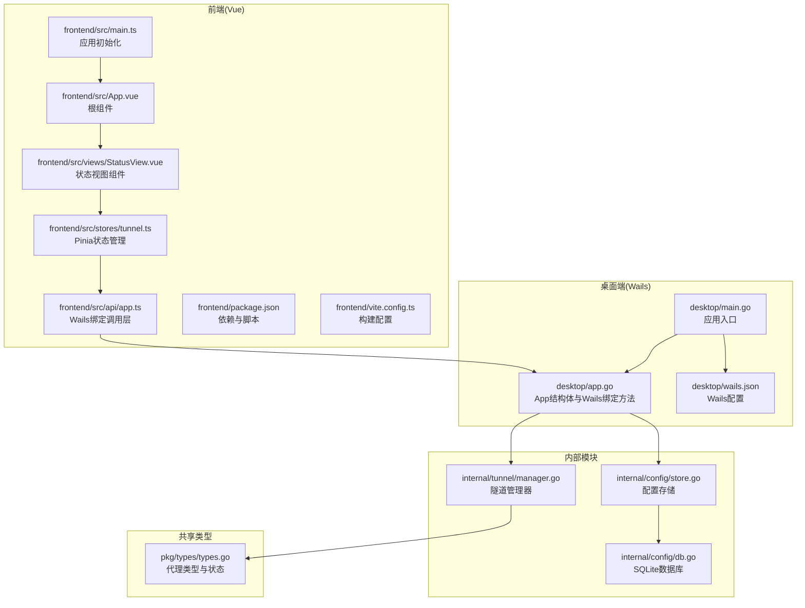
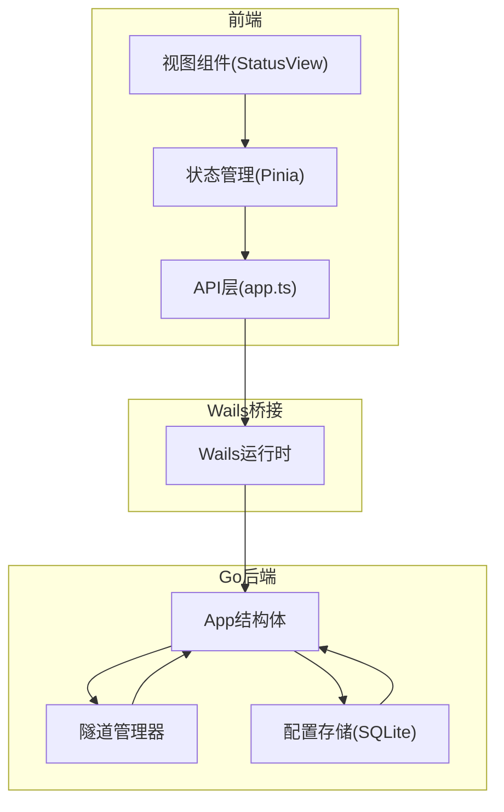
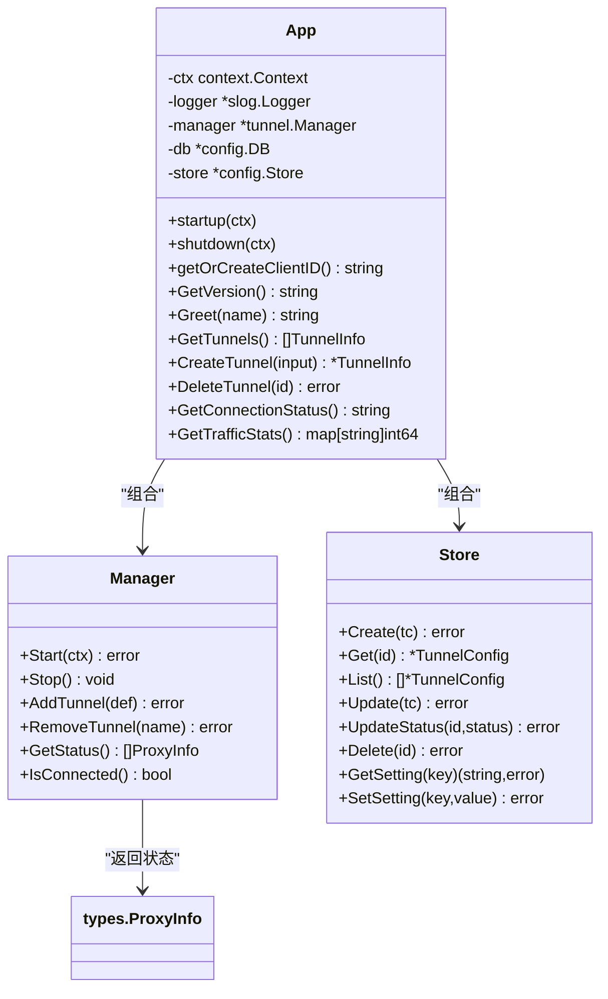
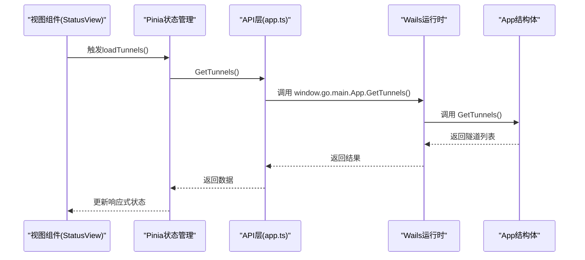
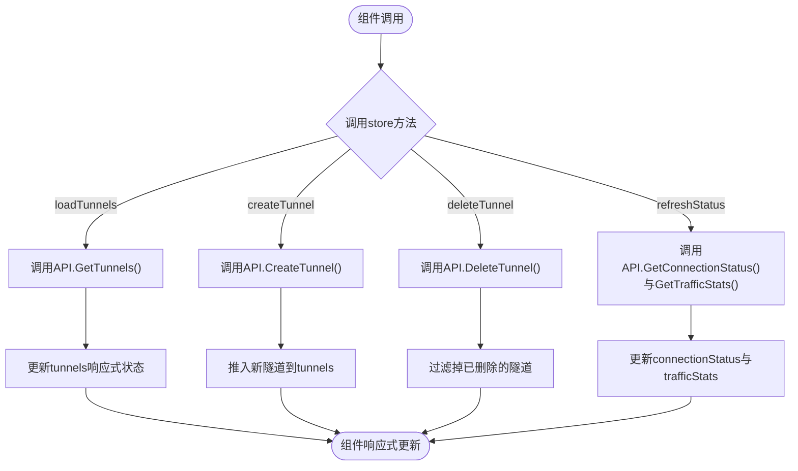
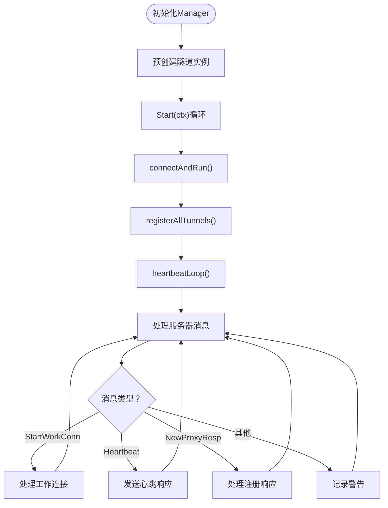
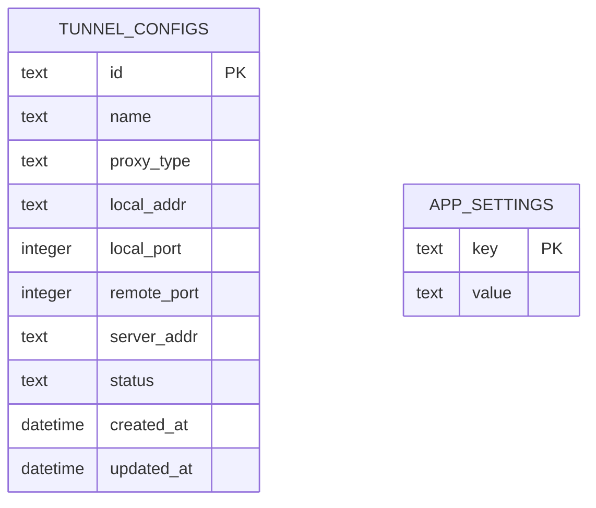
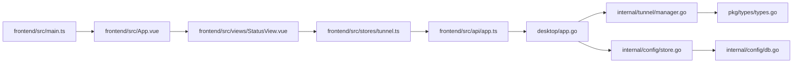

# 桌面端架构设计

<cite>
**本文档引用的文件**
- [desktop/main.go](file://desktop/main.go)
- [desktop/app.go](file://desktop/app.go)
- [desktop/frontend/src/main.ts](file://desktop/frontend/src/main.ts)
- [desktop/frontend/src/App.vue](file://desktop/frontend/src/App.vue)
- [desktop/frontend/src/api/app.ts](file://desktop/frontend/src/api/app.ts)
- [desktop/frontend/src/stores/tunnel.ts](file://desktop/frontend/src/stores/tunnel.ts)
- [desktop/frontend/src/views/StatusView.vue](file://desktop/frontend/src/views/StatusView.vue)
- [desktop/frontend/package.json](file://desktop/frontend/package.json)
- [desktop/frontend/vite.config.ts](file://desktop/frontend/vite.config.ts)
- [desktop/wails.json](file://desktop/wails.json)
- [desktop/internal/tunnel/manager.go](file://desktop/internal/tunnel/manager.go)
- [desktop/internal/config/store.go](file://desktop/internal/config/store.go)
- [desktop/internal/config/db.go](file://desktop/internal/config/db.go)
- [pkg/types/types.go](file://pkg/types/types.go)
</cite>

## 目录
1. [引言](#引言)
2. [项目结构](#项目结构)
3. [核心组件](#核心组件)
4. [架构总览](#架构总览)
5. [详细组件分析](#详细组件分析)
6. [依赖关系分析](#依赖关系分析)
7. [性能考虑](#性能考虑)
8. [故障排除指南](#故障排除指南)
9. [结论](#结论)

## 引言
本设计文档面向NexTunnel桌面端应用，基于Wails框架实现的Go后端与Vue前端集成方案。文档从应用架构、前后端通信机制、数据绑定策略、App结构体设计与生命周期管理、依赖注入模式、状态管理架构（Pinia）、组件间数据流转与响应式更新、窗口管理与系统托盘集成、跨平台适配策略等维度进行深入剖析，并提供组件层次结构图、数据流向图与交互流程图，帮助开发者全面理解桌面端架构。

## 项目结构
NexTunnel桌面端采用分层清晰的目录组织：Go后端位于desktop根目录，前端位于desktop/frontend，内部模块按功能域划分（tunnel、config等），共享类型定义位于pkg/types。Wails配置文件desktop/wails.json统一管理构建与开发流程。

**图表来源**
- [desktop/main.go:1-37](file://desktop/main.go#L1-L37)
- [desktop/app.go:17-76](file://desktop/app.go#L17-L76)
- [desktop/frontend/src/main.ts:1-8](file://desktop/frontend/src/main.ts#L1-L8)
- [desktop/frontend/src/App.vue:1-74](file://desktop/frontend/src/App.vue#L1-L74)
- [desktop/frontend/src/api/app.ts:1-49](file://desktop/frontend/src/api/app.ts#L1-L49)
- [desktop/frontend/src/stores/tunnel.ts:1-83](file://desktop/frontend/src/stores/tunnel.ts#L1-L83)
- [desktop/frontend/src/views/StatusView.vue:1-252](file://desktop/frontend/src/views/StatusView.vue#L1-L252)
- [desktop/frontend/package.json:1-26](file://desktop/frontend/package.json#L1-L26)
- [desktop/frontend/vite.config.ts:1-15](file://desktop/frontend/vite.config.ts#L1-L15)
- [desktop/wails.json:1-14](file://desktop/wails.json#L1-L14)
- [desktop/internal/tunnel/manager.go:16-58](file://desktop/internal/tunnel/manager.go#L16-L58)
- [desktop/internal/config/store.go:23-31](file://desktop/internal/config/store.go#L23-L31)
- [desktop/internal/config/db.go:33-72](file://desktop/internal/config/db.go#L33-L72)
- [pkg/types/types.go:6-50](file://pkg/types/types.go#L6-L50)

**章节来源**
- [desktop/main.go:1-37](file://desktop/main.go#L1-L37)
- [desktop/wails.json:1-14](file://desktop/wails.json#L1-L14)
- [desktop/frontend/package.json:1-26](file://desktop/frontend/package.json#L1-L26)
- [desktop/frontend/vite.config.ts:1-15](file://desktop/frontend/vite.config.ts#L1-L15)

## 核心组件
- App结构体：作为Wails应用的核心容器，负责启动时初始化数据库与隧道管理器，关闭时释放资源；同时暴露可从前端调用的方法（如版本查询、隧道增删查改、连接状态与流量统计）。
- 隧道管理器：负责与服务器建立控制连接、注册隧道、心跳保活、动态增删隧道、聚合状态与统计信息。
- 配置存储：提供隧道配置的CRUD操作与应用设置读写，底层基于SQLite。
- 前端状态管理：通过Pinia集中管理隧道列表、连接状态与流量统计，配合API层与组件实现响应式更新。
- 视图组件：StatusView展示连接状态、隧道数量与流量统计，支持创建与删除隧道。

**章节来源**
- [desktop/app.go:17-76](file://desktop/app.go#L17-L76)
- [desktop/internal/tunnel/manager.go:16-58](file://desktop/internal/tunnel/manager.go#L16-L58)
- [desktop/internal/config/store.go:23-31](file://desktop/internal/config/store.go#L23-L31)
- [desktop/frontend/src/stores/tunnel.ts:23-82](file://desktop/frontend/src/stores/tunnel.ts#L23-L82)
- [desktop/frontend/src/views/StatusView.vue:1-252](file://desktop/frontend/src/views/StatusView.vue#L1-L252)

## 架构总览
Wails将Go后端作为原生应用内核，Vue前端作为UI渲染层，二者通过Wails运行时桥接通信。应用启动时，Go侧初始化数据库与隧道管理器，前端通过API层调用Go暴露的方法获取数据或触发操作，Pinia状态在前端侧驱动组件响应式更新。

**图表来源**
- [desktop/frontend/src/api/app.ts:22-48](file://desktop/frontend/src/api/app.ts#L22-L48)
- [desktop/app.go:88-203](file://desktop/app.go#L88-L203)
- [desktop/internal/tunnel/manager.go:16-58](file://desktop/internal/tunnel/manager.go#L16-L58)
- [desktop/internal/config/store.go:23-31](file://desktop/internal/config/store.go#L23-L31)

## 详细组件分析

### App结构体与生命周期管理
- 设计思路：App作为全局单例，持有上下文、日志器、隧道管理器与配置存储，承担应用启动、关闭与业务方法的统一入口。
- 生命周期：
  - 启动：打开数据库、初始化配置存储、从数据库加载隧道配置、构建隧道管理器并注入日志器。
  - 关闭：停止隧道管理器、关闭数据库连接。
- 依赖注入：通过构造函数注入日志器；通过startup阶段注入数据库与配置存储；通过SetLogger允许外部注入日志器。

**图表来源**
- [desktop/app.go:17-76](file://desktop/app.go#L17-L76)
- [desktop/app.go:88-203](file://desktop/app.go#L88-L203)
- [desktop/internal/tunnel/manager.go:16-58](file://desktop/internal/tunnel/manager.go#L16-L58)
- [desktop/internal/config/store.go:23-31](file://desktop/internal/config/store.go#L23-L31)
- [pkg/types/types.go:33-42](file://pkg/types/types.go#L33-L42)

**章节来源**
- [desktop/app.go:17-76](file://desktop/app.go#L17-L76)
- [desktop/app.go:88-203](file://desktop/app.go#L88-L203)

### 前后端通信机制与数据绑定策略
- 调用链路：前端组件通过Pinia调用API层，API层通过window对象访问Wails运行时绑定的Go方法，Go方法执行业务逻辑并返回结果。
- 数据绑定：前端使用ref/computed与响应式数据，Pinia状态变更自动驱动组件重渲染；API层封装错误处理，保证前端状态一致性。
- 方法暴露：App中以公开方法形式暴露业务能力，前端通过名称字符串调用，参数与返回值经JSON序列化传递。

**图表来源**
- [desktop/frontend/src/views/StatusView.vue:112-116](file://desktop/frontend/src/views/StatusView.vue#L112-L116)
- [desktop/frontend/src/stores/tunnel.ts:34-40](file://desktop/frontend/src/stores/tunnel.ts#L34-L40)
- [desktop/frontend/src/api/app.ts:30-32](file://desktop/frontend/src/api/app.ts#L30-L32)
- [desktop/app.go:111-139](file://desktop/app.go#L111-L139)

**章节来源**
- [desktop/frontend/src/api/app.ts:22-48](file://desktop/frontend/src/api/app.ts#L22-L48)
- [desktop/frontend/src/stores/tunnel.ts:34-40](file://desktop/frontend/src/stores/tunnel.ts#L34-L40)
- [desktop/app.go:111-139](file://desktop/app.go#L111-L139)

### 前端状态管理架构（Pinia）
- 状态模型：包含隧道列表、连接状态、流量统计与计算属性（隧道数量）。
- 数据流：组件通过store方法发起异步请求，成功后直接更新本地响应式状态；失败时记录日志并抛出异常供上层处理。
- 组件解耦：组件仅依赖store的公开方法与响应式状态，不直接访问API层或App方法，降低耦合度。

**图表来源**
- [desktop/frontend/src/stores/tunnel.ts:23-82](file://desktop/frontend/src/stores/tunnel.ts#L23-L82)
- [desktop/frontend/src/views/StatusView.vue:112-120](file://desktop/frontend/src/views/StatusView.vue#L112-L120)

**章节来源**
- [desktop/frontend/src/stores/tunnel.ts:23-82](file://desktop/frontend/src/stores/tunnel.ts#L23-L82)
- [desktop/frontend/src/views/StatusView.vue:112-120](file://desktop/frontend/src/views/StatusView.vue#L112-L120)

### 隧道管理器与状态聚合
- 功能职责：负责与服务器建立控制连接、注册所有已配置隧道、发送心跳、处理服务器消息（开始工作连接、心跳响应等）、动态增删隧道、聚合各隧道状态与统计。
- 并发安全：使用读写锁保护隧道映射，确保多协程并发访问的安全性。
- 连接管理：封装指数回退重连策略，自动处理断线重连；提供优雅停止与清理。

**图表来源**
- [desktop/internal/tunnel/manager.go:29-58](file://desktop/internal/tunnel/manager.go#L29-L58)
- [desktop/internal/tunnel/manager.go:82-112](file://desktop/internal/tunnel/manager.go#L82-L112)
- [desktop/internal/tunnel/manager.go:158-197](file://desktop/internal/tunnel/manager.go#L158-L197)
- [desktop/internal/tunnel/manager.go:199-217](file://desktop/internal/tunnel/manager.go#L199-L217)

**章节来源**
- [desktop/internal/tunnel/manager.go:16-58](file://desktop/internal/tunnel/manager.go#L16-L58)
- [desktop/internal/tunnel/manager.go:158-197](file://desktop/internal/tunnel/manager.go#L158-L197)

### 配置存储与数据库
- 存储模型：TunnelConfig用于持久化隧道配置；Store提供CRUD与设置读写；DB封装SQLite连接、迁移与路径。
- 数据库特性：启用WAL模式提升并发性能；表结构包含隧道配置与应用设置两部分。
- 生命周期：应用启动时打开数据库，应用关闭时关闭连接。

**图表来源**
- [desktop/internal/config/store.go:9-21](file://desktop/internal/config/store.go#L9-L21)
- [desktop/internal/config/db.go:13-31](file://desktop/internal/config/db.go#L13-L31)

**章节来源**
- [desktop/internal/config/store.go:23-31](file://desktop/internal/config/store.go#L23-L31)
- [desktop/internal/config/db.go:33-72](file://desktop/internal/config/db.go#L33-L72)

### 窗口管理与系统托盘集成
- 窗口管理：Wails在启动时根据配置创建主窗口，设置标题、尺寸、背景色与资产服务器；生命周期事件OnStartup与OnShutdown分别对应App.startup与App.shutdown。
- 系统托盘：当前仓库未发现托盘相关实现，可在后续版本中通过Wails托盘API扩展，实现最小化到托盘、右键菜单与通知等功能。
- 跨平台适配：Wails天然支持Windows、macOS与Linux；前端样式与行为遵循Vue生态，保持一致体验。

**章节来源**
- [desktop/main.go:18-31](file://desktop/main.go#L18-L31)
- [desktop/wails.json:1-14](file://desktop/wails.json#L1-14)

## 依赖关系分析
- 组件耦合：前端通过API层与Pinia与App解耦；App组合Manager与Store，形成清晰的职责边界。
- 外部依赖：Wails运行时桥接前后端；SQLite提供轻量级持久化；Vue与Pinia提供响应式UI与状态管理。
- 循环依赖：未见循环导入；模块间通过接口与方法调用解耦。

**图表来源**
- [desktop/frontend/src/main.ts:1-8](file://desktop/frontend/src/main.ts#L1-L8)
- [desktop/frontend/src/App.vue:1-74](file://desktop/frontend/src/App.vue#L1-L74)
- [desktop/frontend/src/views/StatusView.vue:1-252](file://desktop/frontend/src/views/StatusView.vue#L1-L252)
- [desktop/frontend/src/stores/tunnel.ts:1-83](file://desktop/frontend/src/stores/tunnel.ts#L1-L83)
- [desktop/frontend/src/api/app.ts:1-49](file://desktop/frontend/src/api/app.ts#L1-L49)
- [desktop/app.go:17-76](file://desktop/app.go#L17-L76)
- [desktop/internal/tunnel/manager.go:16-58](file://desktop/internal/tunnel/manager.go#L16-L58)
- [desktop/internal/config/store.go:23-31](file://desktop/internal/config/store.go#L23-L31)
- [desktop/internal/config/db.go:33-72](file://desktop/internal/config/db.go#L33-L72)
- [pkg/types/types.go:6-50](file://pkg/types/types.go#L6-L50)

**章节来源**
- [desktop/frontend/src/main.ts:1-8](file://desktop/frontend/src/main.ts#L1-L8)
- [desktop/frontend/src/api/app.ts:1-49](file://desktop/frontend/src/api/app.ts#L1-L49)
- [desktop/app.go:17-76](file://desktop/app.go#L17-L76)

## 性能考虑
- 前端渲染：使用Pinia集中状态，减少重复渲染；组件内定时器需在卸载时清理，避免内存泄漏。
- 后端并发：Manager使用读写锁保护隧道映射，避免竞态；心跳与消息处理分离，降低阻塞风险。
- 数据库：SQLite启用WAL模式提升并发；建议对高频查询字段建立索引（如name、id）。
- 通信开销：API层统一错误处理与重试策略，避免前端频繁重试导致的资源浪费。

## 故障排除指南
- 前端无法获取版本号：检查API层是否正确调用window.go.main.App.GetVersion，确认Wails绑定是否生效。
- 隧道列表为空：确认App.startup是否成功加载数据库与配置，Store.List是否返回数据。
- 连接状态异常：检查Manager是否已连接，心跳循环是否正常运行；必要时重启应用以重建连接。
- 删除隧道失败：确认Store.Delete是否返回受影响行数，检查ID是否存在；若Manager正在运行，需先移除对应隧道再删除配置。

**章节来源**
- [desktop/frontend/src/api/app.ts:26-28](file://desktop/frontend/src/api/app.ts#L26-L28)
- [desktop/app.go:44-49](file://desktop/app.go#L44-L49)
- [desktop/internal/tunnel/manager.go:297-300](file://desktop/internal/tunnel/manager.go#L297-L300)
- [desktop/internal/config/store.go:128-139](file://desktop/internal/config/store.go#L128-L139)

## 结论
NexTunnel桌面端采用Wails将Go后端与Vue前端有机结合，通过清晰的模块划分与状态管理实现高内聚低耦合的架构。App作为统一入口承载生命周期与业务方法，Manager与Store分别负责隧道编排与配置持久化，前端通过Pinia与API层实现响应式数据流。未来可在托盘集成、日志与监控、自动化测试等方面进一步完善，以提升用户体验与可维护性。