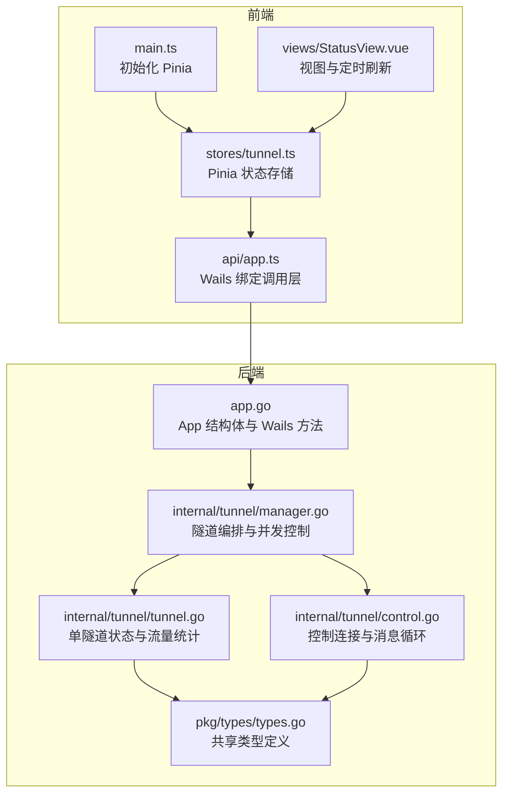
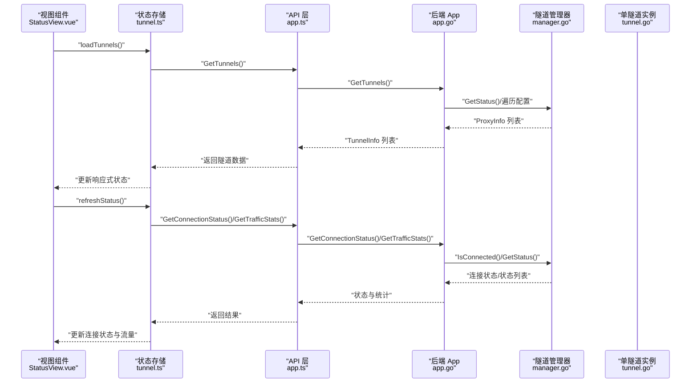
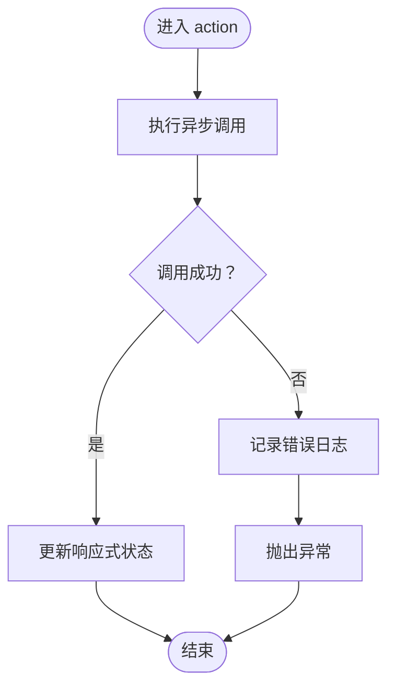
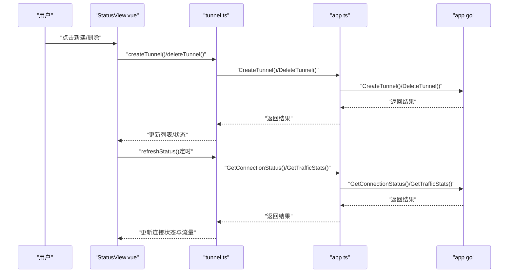
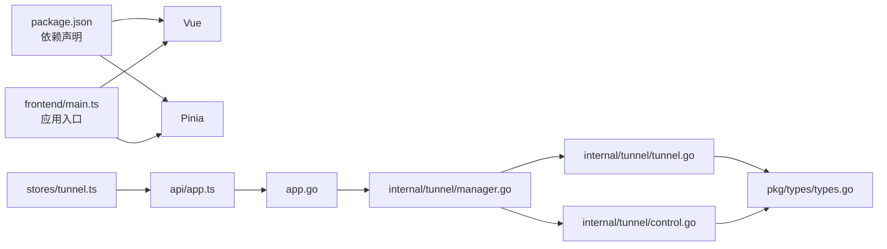

# 状态管理系统

<cite>
**本文引用的文件**
- [desktop/frontend/src/stores/tunnel.ts](file://desktop/frontend/src/stores/tunnel.ts)
- [desktop/frontend/src/views/StatusView.vue](file://desktop/frontend/src/views/StatusView.vue)
- [desktop/frontend/src/main.ts](file://desktop/frontend/src/main.ts)
- [desktop/frontend/src/api/app.ts](file://desktop/frontend/src/api/app.ts)
- [desktop/app.go](file://desktop/app.go)
- [desktop/internal/tunnel/manager.go](file://desktop/internal/tunnel/manager.go)
- [desktop/internal/tunnel/tunnel.go](file://desktop/internal/tunnel/tunnel.go)
- [desktop/internal/tunnel/control.go](file://desktop/internal/tunnel/control.go)
- [pkg/types/types.go](file://pkg/types/types.go)
- [desktop/frontend/package.json](file://desktop/frontend/package.json)
</cite>

## 目录
1. [引言](#引言)
2. [项目结构](#项目结构)
3. [核心组件](#核心组件)
4. [架构总览](#架构总览)
5. [详细组件分析](#详细组件分析)
6. [依赖分析](#依赖分析)
7. [性能考虑](#性能考虑)
8. [故障排查指南](#故障排查指南)
9. [结论](#结论)
10. [附录](#附录)

## 引言
本文件针对 NexTunnel 的状态管理系统进行系统化技术文档整理，重点围绕基于 Pinia 的前端状态架构（tunnel.ts）、状态与 Wails 后端的同步机制、响应式数据更新策略、状态持久化方案、一致性与并发控制、错误恢复机制，以及最佳实践、性能优化与调试方法展开。文档同时提供可视化图示与代码片段路径，帮助不同背景读者快速理解与落地。

## 项目结构
NexTunnel 前端采用 Vue 3 + Pinia 架构，状态集中在 stores 中；通过 api 层调用 Wails Runtime 暴露的方法，与 Go 后端交互。后端由 App 结构体承载业务逻辑，内部使用隧道管理器与控制连接维持与服务器的通信，并提供状态查询与统计接口供前端消费。

图表来源
- [desktop/frontend/src/main.ts:1-8](file://desktop/frontend/src/main.ts#L1-L8)
- [desktop/frontend/src/stores/tunnel.ts:1-83](file://desktop/frontend/src/stores/tunnel.ts#L1-L83)
- [desktop/frontend/src/views/StatusView.vue:1-252](file://desktop/frontend/src/views/StatusView.vue#L1-L252)
- [desktop/frontend/src/api/app.ts:1-49](file://desktop/frontend/src/api/app.ts#L1-L49)
- [desktop/app.go:1-208](file://desktop/app.go#L1-L208)
- [desktop/internal/tunnel/manager.go:1-310](file://desktop/internal/tunnel/manager.go#L1-L310)
- [desktop/internal/tunnel/tunnel.go:1-138](file://desktop/internal/tunnel/tunnel.go#L1-L138)
- [desktop/internal/tunnel/control.go:1-155](file://desktop/internal/tunnel/control.go#L1-L155)
- [pkg/types/types.go:1-50](file://pkg/types/types.go#L1-L50)

章节来源
- [desktop/frontend/src/main.ts:1-8](file://desktop/frontend/src/main.ts#L1-L8)
- [desktop/frontend/src/stores/tunnel.ts:1-83](file://desktop/frontend/src/stores/tunnel.ts#L1-L83)
- [desktop/frontend/src/views/StatusView.vue:1-252](file://desktop/frontend/src/views/StatusView.vue#L1-L252)
- [desktop/frontend/src/api/app.ts:1-49](file://desktop/frontend/src/api/app.ts#L1-L49)
- [desktop/app.go:1-208](file://desktop/app.go#L1-L208)
- [desktop/internal/tunnel/manager.go:1-310](file://desktop/internal/tunnel/manager.go#L1-L310)
- [desktop/internal/tunnel/tunnel.go:1-138](file://desktop/internal/tunnel/tunnel.go#L1-L138)
- [desktop/internal/tunnel/control.go:1-155](file://desktop/internal/tunnel/control.go#L1-L155)
- [pkg/types/types.go:1-50](file://pkg/types/types.go#L1-L50)

## 核心组件
- Pinia 状态存储：集中管理隧道列表、连接状态与流量统计，提供 getter 与 action。
- 视图组件：负责渲染状态、用户输入与定时刷新。
- API 层：封装 Wails Runtime 调用，屏蔽前后端边界。
- 后端 App：提供 GetTunnels、CreateTunnel、DeleteTunnel、GetConnectionStatus、GetTrafficStats 等方法。
- 隧道管理器：维护隧道集合、并发安全、心跳与工作连接处理。
- 共享类型：统一 ProxyType、ProxyStatus、ProxyInfo 等类型定义。

章节来源
- [desktop/frontend/src/stores/tunnel.ts:23-82](file://desktop/frontend/src/stores/tunnel.ts#L23-L82)
- [desktop/frontend/src/views/StatusView.vue:66-121](file://desktop/frontend/src/views/StatusView.vue#L66-L121)
- [desktop/frontend/src/api/app.ts:22-48](file://desktop/frontend/src/api/app.ts#L22-L48)
- [desktop/app.go:110-203](file://desktop/app.go#L110-L203)
- [desktop/internal/tunnel/manager.go:16-310](file://desktop/internal/tunnel/manager.go#L16-L310)
- [pkg/types/types.go:6-42](file://pkg/types/types.go#L6-L42)

## 架构总览
前端通过 Pinia 管理状态，视图组件在挂载时加载初始数据并启动定时刷新；所有对后端的操作均通过 api 层调用 Wails 绑定方法，后端 App 将请求转发至隧道管理器或配置存储，最终返回给前端。

图表来源
- [desktop/frontend/src/views/StatusView.vue:112-120](file://desktop/frontend/src/views/StatusView.vue#L112-L120)
- [desktop/frontend/src/stores/tunnel.ts:34-70](file://desktop/frontend/src/stores/tunnel.ts#L34-L70)
- [desktop/frontend/src/api/app.ts:30-48](file://desktop/frontend/src/api/app.ts#L30-L48)
- [desktop/app.go:110-203](file://desktop/app.go#L110-L203)
- [desktop/internal/tunnel/manager.go:285-300](file://desktop/internal/tunnel/manager.go#L285-L300)
- [desktop/internal/tunnel/tunnel.go:126-137](file://desktop/internal/tunnel/tunnel.go#L126-L137)

## 详细组件分析

### Pinia 状态存储（tunnel.ts）
- 设计模式
  - 使用组合式 API 定义 store，导出响应式状态 ref 与计算属性 computed。
  - 将副作用（异步 API 调用）封装为 actions，保持状态与行为的内聚。
- 状态定义
  - 隧道列表：数组形式保存隧道配置与运行态。
  - 连接状态：字符串枚举值，反映整体连接健康度。
  - 流量统计：聚合字节数与隧道数量。
- Getter 计算属性
  - 隧道数量：基于列表长度的只读派生状态。
- Action 方法
  - 加载隧道：拉取持久化配置并合并实时状态。
  - 创建隧道：写入配置存储并追加到本地列表。
  - 删除隧道：从存储删除并过滤本地列表。
  - 刷新状态：轮询连接状态与流量统计，异常时回退到断开状态。
- 错误处理
  - 所有异步操作包裹 try/catch，记录错误日志并向上抛出，便于上层捕获与提示。
- 并发与一致性
  - 通过单点 store 控制状态变更，避免多处直接修改导致竞态。
  - 刷新状态采用固定周期轮询，确保 UI 与后端一致。

图表来源
- [desktop/frontend/src/stores/tunnel.ts:34-70](file://desktop/frontend/src/stores/tunnel.ts#L34-L70)

章节来源
- [desktop/frontend/src/stores/tunnel.ts:5-82](file://desktop/frontend/src/stores/tunnel.ts#L5-L82)

### 视图组件（StatusView.vue）
- 渲染逻辑
  - 连接指示器根据状态类名切换颜色与文案。
  - 信息网格展示隧道数量与进出流量。
  - 隧道列表展示名称、类型、地址映射与状态。
- 用户交互
  - 新建表单支持名称、代理类型、本地与远端端口等字段绑定。
  - 删除按钮触发 store 删除动作。
- 生命周期与定时刷新
  - 挂载时加载隧道与初始状态，随后每 3 秒刷新一次状态。
  - 卸载时清理定时器，避免内存泄漏。

图表来源
- [desktop/frontend/src/views/StatusView.vue:95-120](file://desktop/frontend/src/views/StatusView.vue#L95-L120)
- [desktop/frontend/src/stores/tunnel.ts:42-70](file://desktop/frontend/src/stores/tunnel.ts#L42-L70)
- [desktop/frontend/src/api/app.ts:30-48](file://desktop/frontend/src/api/app.ts#L30-L48)
- [desktop/app.go:150-203](file://desktop/app.go#L150-L203)

章节来源
- [desktop/frontend/src/views/StatusView.vue:1-252](file://desktop/frontend/src/views/StatusView.vue#L1-L252)

### API 层（app.ts）
- 职责
  - 作为前端与 Wails Runtime 的桥接层，统一封装调用。
  - 通过 window 对象上的绑定方法调用后端 App 的公开方法。
- 接口
  - GetTunnels、CreateTunnel、DeleteTunnel、GetConnectionStatus、GetTrafficStats。
- 类型
  - 定义与后端一致的接口类型，确保参数与返回值结构清晰。

章节来源
- [desktop/frontend/src/api/app.ts:1-49](file://desktop/frontend/src/api/app.ts#L1-L49)

### 后端 App（app.go）
- 方法职责
  - GetTunnels：从配置存储读取并结合管理器实时状态返回前端所需信息。
  - CreateTunnel：创建新配置并返回。
  - DeleteTunnel：删除配置，必要时通知管理器移除运行中的隧道。
  - GetConnectionStatus：基于管理器连接状态返回字符串。
  - GetTrafficStats：汇总各隧道流量统计。
- 数据一致性
  - 返回的隧道状态优先取自管理器实时状态，确保 UI 与运行时一致。

章节来源
- [desktop/app.go:110-203](file://desktop/app.go#L110-L203)

### 隧道管理器（manager.go）
- 并发控制
  - 使用读写锁保护隧道集合，新增/删除/查询时区分读写粒度。
- 心跳与控制连接
  - 维护控制连接，定期发送心跳并处理服务端消息。
- 动态隧道
  - 支持动态添加/移除隧道，并在已连接状态下向服务器注册或关闭。
- 状态聚合
  - 提供 GetStatus 返回所有隧道的实时状态与流量。

章节来源
- [desktop/internal/tunnel/manager.go:16-310](file://desktop/internal/tunnel/manager.go#L16-L310)

### 单隧道实例（tunnel.go）
- 状态与流量
  - 使用原子变量保存状态与流量计数，保障并发读写安全。
- 工作连接
  - 处理服务端发起的工作连接请求，建立双向桥接并统计流量。

章节来源
- [desktop/internal/tunnel/tunnel.go:16-138](file://desktop/internal/tunnel/tunnel.go#L16-L138)

### 控制连接（control.go）
- 连接生命周期
  - 建立 TCP 连接、认证握手、启动读循环、提供消息通道。
- 线程安全
  - 写操作加互斥锁，保证消息有序发送。
- 可靠性
  - 断线自动关闭并清理资源，避免资源泄露。

章节来源
- [desktop/internal/tunnel/control.go:15-155](file://desktop/internal/tunnel/control.go#L15-L155)

### 共享类型（types.go）
- 类型定义
  - ProxyType、ProxyStatus、ProxyInfo、ClientInfo 等，贯穿前后端。
- 作用
  - 确保前后端对状态与统计的语义一致，降低耦合成本。

章节来源
- [pkg/types/types.go:6-42](file://pkg/types/types.go#L6-L42)

## 依赖分析
- 前端依赖
  - Vue 与 Pinia 提供响应式与状态管理能力。
  - Vite 构建工具链支撑开发与生产环境。
- 前后端集成
  - Wails 将 Go 后端方法暴露为前端可调用的绑定函数。
- 内部模块耦合
  - App 依赖配置存储与隧道管理器；管理器依赖控制连接与单隧道实例；类型定义被广泛复用。

图表来源
- [desktop/frontend/package.json:12-24](file://desktop/frontend/package.json#L12-L24)
- [desktop/frontend/src/main.ts:1-8](file://desktop/frontend/src/main.ts#L1-L8)
- [desktop/frontend/src/stores/tunnel.ts:1-3](file://desktop/frontend/src/stores/tunnel.ts#L1-L3)
- [desktop/frontend/src/api/app.ts:1-1](file://desktop/frontend/src/api/app.ts#L1-L1)
- [desktop/app.go:17-30](file://desktop/app.go#L17-L30)
- [desktop/internal/tunnel/manager.go:16-27](file://desktop/internal/tunnel/manager.go#L16-L27)
- [desktop/internal/tunnel/tunnel.go:16-25](file://desktop/internal/tunnel/tunnel.go#L16-L25)
- [desktop/internal/tunnel/control.go:15-28](file://desktop/internal/tunnel/control.go#L15-L28)
- [pkg/types/types.go:1-50](file://pkg/types/types.go#L1-L50)

章节来源
- [desktop/frontend/package.json:1-26](file://desktop/frontend/package.json#L1-L26)
- [desktop/frontend/src/main.ts:1-8](file://desktop/frontend/src/main.ts#L1-L8)
- [desktop/frontend/src/stores/tunnel.ts:1-3](file://desktop/frontend/src/stores/tunnel.ts#L1-L3)
- [desktop/frontend/src/api/app.ts:1-1](file://desktop/frontend/src/api/app.ts#L1-L1)
- [desktop/app.go:17-30](file://desktop/app.go#L17-L30)
- [desktop/internal/tunnel/manager.go:16-27](file://desktop/internal/tunnel/manager.go#L16-L27)
- [desktop/internal/tunnel/tunnel.go:16-25](file://desktop/internal/tunnel/tunnel.go#L16-L25)
- [desktop/internal/tunnel/control.go:15-28](file://desktop/internal/tunnel/control.go#L15-L28)
- [pkg/types/types.go:1-50](file://pkg/types/types.go#L1-L50)

## 性能考虑
- 响应式更新
  - 使用 ref/computed 粒度化更新，避免不必要的重渲染。
- 轮询频率
  - 当前每 3 秒刷新一次状态，可根据网络与设备性能调整间隔。
- 并发安全
  - 后端使用读写锁与原子变量，减少锁竞争；前端 store 保持单一状态源，避免重复渲染。
- I/O 优化
  - API 层统一调用，减少重复网络往返；后端聚合统计，降低前端多次请求带来的压力。
- 内存管理
  - 视图卸载时清理定时器，防止内存泄漏。

## 故障排查指南
- 常见问题
  - 连接状态不更新：检查定时刷新是否正常运行，确认后端管理器是否处于连接状态。
  - 创建/删除隧道失败：查看 store 的错误日志与异常抛出位置，定位具体 API 调用失败原因。
  - 流量统计为 0：确认管理器是否正确桥接工作连接并累加流量。
- 调试建议
  - 在 store 的 actions 中增加日志输出，定位网络调用与状态更新节点。
  - 在视图组件中打印关键状态（如连接状态、隧道数量），验证响应式更新链路。
  - 使用浏览器开发者工具监控网络请求与 Wails 绑定调用的返回值。
- 错误恢复
  - 刷新状态遇到异常时回退到断开状态，保证 UI 一致性。
  - 后端管理器在断线时自动清理状态，前端重新连接后可再次拉取最新状态。

章节来源
- [desktop/frontend/src/stores/tunnel.ts:63-70](file://desktop/frontend/src/stores/tunnel.ts#L63-L70)
- [desktop/frontend/src/views/StatusView.vue:112-120](file://desktop/frontend/src/views/StatusView.vue#L112-L120)
- [desktop/internal/tunnel/manager.go:219-233](file://desktop/internal/tunnel/manager.go#L219-L233)

## 结论
NexTunnel 的状态管理以 Pinia 为核心，结合 Wails 的前后端一体化设计，实现了从前端响应式状态到后端运行时状态的闭环同步。通过明确的类型定义、严格的并发控制与错误恢复策略，系统在易用性与可靠性之间取得平衡。建议在实际部署中根据场景优化轮询频率、增强错误日志与监控告警，并持续完善状态持久化与一致性校验机制。

## 附录
- 最佳实践
  - 将所有副作用封装在 store 的 actions 中，保持状态变更可追踪。
  - 使用 computed 管理派生状态，减少模板中的复杂计算。
  - 在视图组件中仅做渲染与事件分发，避免直接访问后端 API。
- 性能优化
  - 合理设置刷新周期，避免频繁轮询造成资源浪费。
  - 对高频更新的数据采用节流/去抖策略。
- 调试方法
  - 在 store 与 API 层增加结构化日志，记录关键路径与耗时。
  - 使用浏览器调试工具观察响应式数据变化与网络请求轨迹。