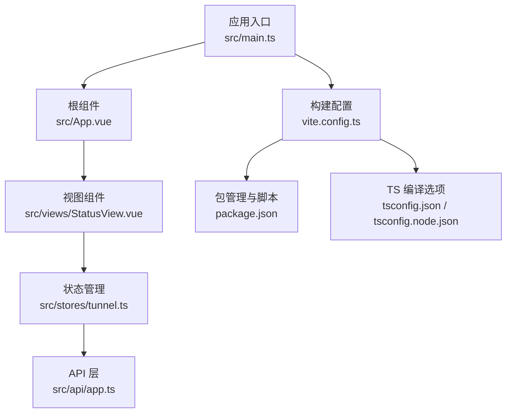
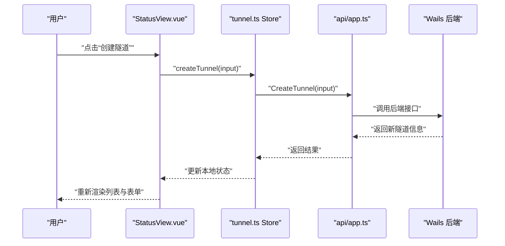
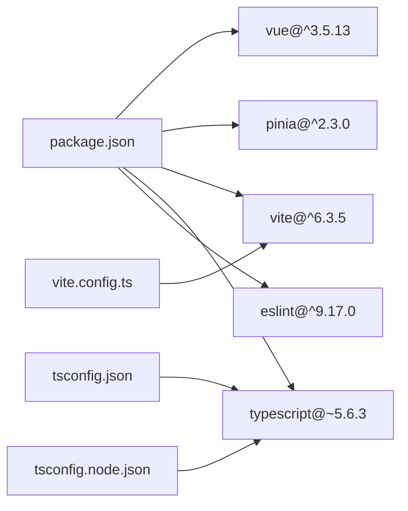

# 性能优化策略

<cite>
**本文引用的文件**
- [desktop/frontend/src/main.ts](file://desktop/frontend/src/main.ts)
- [desktop/frontend/vite.config.ts](file://desktop/frontend/vite.config.ts)
- [desktop/frontend/package.json](file://desktop/frontend/package.json)
- [desktop/frontend/tsconfig.json](file://desktop/frontend/tsconfig.json)
- [desktop/frontend/tsconfig.node.json](file://desktop/frontend/tsconfig.node.json)
- [desktop/frontend/src/App.vue](file://desktop/frontend/src/App.vue)
- [desktop/frontend/src/views/StatusView.vue](file://desktop/frontend/src/views/StatusView.vue)
- [desktop/frontend/src/stores/tunnel.ts](file://desktop/frontend/src/stores/tunnel.ts)
- [desktop/frontend/src/api/app.ts](file://desktop/frontend/src/api/app.ts)
</cite>

## 目录
1. [简介](#简介)
2. [项目结构](#项目结构)
3. [核心组件](#核心组件)
4. [架构总览](#架构总览)
5. [详细组件分析](#详细组件分析)
6. [依赖分析](#依赖分析)
7. [性能考量](#性能考量)
8. [故障排查指南](#故障排查指南)
9. [结论](#结论)
10. [附录](#附录)

## 简介
本文件面向 NexTunnel 桌面端前端（Vue 3 + Pinia + Vite）的组件性能优化，系统性梳理以下主题：
- Vue 3 组件层面的性能优化策略：组件懒加载、虚拟滚动与计算属性缓存
- Vite 构建优化配置对组件性能的影响：Tree Shaking、代码分割与资源压缩
- 渲染优化技术：v-memo 使用、组件拆分与避免不必要重渲染
- 内存管理最佳实践：事件监听器清理、定时器管理与 DOM 引用释放
- 具体实现路径示例与性能监控、调试工具使用建议

当前仓库中未直接出现 v-memo、虚拟滚动等高级优化特性，但通过现有代码结构与配置，可按本文策略进行扩展与落地。

## 项目结构
桌面端前端位于 desktop/frontend，采用 Vue 3 单页应用结构，使用 Pinia 进行状态管理，Vite 提供开发与构建能力。主要入口与关键模块如下：
- 应用入口：src/main.ts 创建并挂载应用，注册 Pinia
- 根组件：src/App.vue 负责版本号获取与主视图承载
- 视图组件：src/views/StatusView.vue 展示隧道状态、流量统计与表单交互
- 状态管理：src/stores/tunnel.ts 定义隧道数据、连接状态与流量统计的状态与动作
- API 层：src/api/app.ts 封装与后端桥接调用
- 构建配置：vite.config.ts、package.json、tsconfig.json 等

图表来源
- [desktop/frontend/src/main.ts:1-8](file://desktop/frontend/src/main.ts#L1-L8)
- [desktop/frontend/src/App.vue:1-74](file://desktop/frontend/src/App.vue#L1-L74)
- [desktop/frontend/src/views/StatusView.vue:1-252](file://desktop/frontend/src/views/StatusView.vue#L1-L252)
- [desktop/frontend/src/stores/tunnel.ts:1-83](file://desktop/frontend/src/stores/tunnel.ts#L1-L83)
- [desktop/frontend/src/api/app.ts:1-49](file://desktop/frontend/src/api/app.ts#L1-L49)
- [desktop/frontend/vite.config.ts:1-15](file://desktop/frontend/vite.config.ts#L1-L15)
- [desktop/frontend/package.json:1-26](file://desktop/frontend/package.json#L1-L26)
- [desktop/frontend/tsconfig.json:1-23](file://desktop/frontend/tsconfig.json#L1-L23)
- [desktop/frontend/tsconfig.node.json:1-19](file://desktop/frontend/tsconfig.node.json#L1-L19)

章节来源
- [desktop/frontend/src/main.ts:1-8](file://desktop/frontend/src/main.ts#L1-L8)
- [desktop/frontend/src/App.vue:1-74](file://desktop/frontend/src/App.vue#L1-L74)
- [desktop/frontend/src/views/StatusView.vue:1-252](file://desktop/frontend/src/views/StatusView.vue#L1-L252)
- [desktop/frontend/src/stores/tunnel.ts:1-83](file://desktop/frontend/src/stores/tunnel.ts#L1-L83)
- [desktop/frontend/src/api/app.ts:1-49](file://desktop/frontend/src/api/app.ts#L1-L49)
- [desktop/frontend/vite.config.ts:1-15](file://desktop/frontend/vite.config.ts#L1-L15)
- [desktop/frontend/package.json:1-26](file://desktop/frontend/package.json#L1-L26)
- [desktop/frontend/tsconfig.json:1-23](file://desktop/frontend/tsconfig.json#L1-L23)
- [desktop/frontend/tsconfig.node.json:1-19](file://desktop/frontend/tsconfig.node.json#L1-L19)

## 核心组件
- 应用入口与状态初始化：在入口处创建应用并安装 Pinia，确保全局状态可用
- 根组件职责：负责版本号异步获取与主视图承载，避免在根组件做重型逻辑
- 视图组件：集中展示隧道列表、状态与流量统计，包含表单输入与按钮交互
- 状态管理：集中维护隧道列表、连接状态与流量统计，并提供只读派生值
- API 层：统一封装与后端桥接调用，便于后续引入缓存与节流策略

章节来源
- [desktop/frontend/src/main.ts:1-8](file://desktop/frontend/src/main.ts#L1-L8)
- [desktop/frontend/src/App.vue:13-27](file://desktop/frontend/src/App.vue#L13-L27)
- [desktop/frontend/src/views/StatusView.vue:66-121](file://desktop/frontend/src/views/StatusView.vue#L66-L121)
- [desktop/frontend/src/stores/tunnel.ts:23-82](file://desktop/frontend/src/stores/tunnel.ts#L23-L82)
- [desktop/frontend/src/api/app.ts:22-48](file://desktop/frontend/src/api/app.ts#L22-L48)

## 架构总览
下图展示从用户交互到后端调用的典型流程，以及状态更新与渲染的关键节点。

图表来源
- [desktop/frontend/src/views/StatusView.vue:95-104](file://desktop/frontend/src/views/StatusView.vue#L95-L104)
- [desktop/frontend/src/stores/tunnel.ts:42-51](file://desktop/frontend/src/stores/tunnel.ts#L42-L51)
- [desktop/frontend/src/api/app.ts:34-36](file://desktop/frontend/src/api/app.ts#L34-L36)

## 详细组件分析

### 组件懒加载与按需加载
现状：当前组件通过静态导入使用，未启用动态导入懒加载。
建议与实现路径：
- 对大型视图或非首屏组件采用动态导入与 Suspense 配合，减少初始包体积与首屏阻塞
- 在路由层结合动态导入实现页面级代码分割
- 参考实现路径示例：
  - [desktop/frontend/src/App.vue:15-15](file://desktop/frontend/src/App.vue#L15-L15)
  - [desktop/frontend/src/views/StatusView.vue:68-68](file://desktop/frontend/src/views/StatusView.vue#L68-L68)

章节来源
- [desktop/frontend/src/App.vue:15-15](file://desktop/frontend/src/App.vue#L15-L15)
- [desktop/frontend/src/views/StatusView.vue:68-68](file://desktop/frontend/src/views/StatusView.vue#L68-L68)

### 计算属性缓存与派生数据
现状：已使用 computed 派生连接状态标签文本；未见复杂计算属性缓存与 memo 化处理。
建议与实现路径：
- 对昂贵的计算属性（如格式化函数、过滤/排序后的列表）使用 computed 缓存
- 将频繁调用的纯函数抽取为独立模块，配合 memo 化库（如 lodash/memoize 或自定义缓存）
- 参考实现路径示例：
  - [desktop/frontend/src/views/StatusView.vue:80-86](file://desktop/frontend/src/views/StatusView.vue#L80-L86)
  - [desktop/frontend/src/stores/tunnel.ts:32-32](file://desktop/frontend/src/stores/tunnel.ts#L32-L32)

章节来源
- [desktop/frontend/src/views/StatusView.vue:80-86](file://desktop/frontend/src/views/StatusView.vue#L80-L86)
- [desktop/frontend/src/stores/tunnel.ts:32-32](file://desktop/frontend/src/stores/tunnel.ts#L32-L32)

### 渲染优化：避免不必要重渲染
现状：存在基于响应式数组的 v-for 列表渲染，未使用 v-memo 或稳定 key 策略
建议与实现路径：
- 为 v-for 添加稳定且唯一的 key，避免列表重排导致的整块重渲染
- 对列表项内部复杂子树使用 v-memo，仅在输入 props 变更时更新
- 将高频交互区域拆分为独立组件，缩小响应式依赖范围
- 参考实现路径示例：
  - [desktop/frontend/src/views/StatusView.vue:51-61](file://desktop/frontend/src/views/StatusView.vue#L51-L61)

章节来源
- [desktop/frontend/src/views/StatusView.vue:51-61](file://desktop/frontend/src/views/StatusView.vue#L51-L61)

### 虚拟滚动与大数据集渲染
现状：当前隧道列表规模较小，未实现虚拟滚动
建议与实现路径：
- 当列表超过一定阈值（如几十到上百条）时，引入虚拟滚动组件（如 vue-virtual-scroller）
- 保持每项渲染最小化，仅渲染可视窗口内的节点
- 参考实现路径示例：
  - [desktop/frontend/src/views/StatusView.vue:51-61](file://desktop/frontend/src/views/StatusView.vue#L51-L61)

章节来源
- [desktop/frontend/src/views/StatusView.vue:51-61](file://desktop/frontend/src/views/StatusView.vue#L51-L61)

### 内存管理最佳实践
现状：组件在 onMounted 中设置定时器，onUnmounted 中清理；未见显式事件监听器与 DOM 引用管理
建议与实现路径：
- 在 onMounted 中注册的事件监听器应在 onUnmounted 中移除
- 对定时器、轮询与长连接进行统一管理，避免泄漏
- 对大对象与 DOM 引用在组件卸载时置空，防止闭包持有
- 参考实现路径示例：
  - [desktop/frontend/src/views/StatusView.vue:110-120](file://desktop/frontend/src/views/StatusView.vue#L110-L120)

章节来源
- [desktop/frontend/src/views/StatusView.vue:110-120](file://desktop/frontend/src/views/StatusView.vue#L110-L120)

### API 调用与状态更新的性能影响
现状：状态刷新每 3 秒一次，API 调用集中在 store 的 refreshStatus
建议与实现路径：
- 引入节流/去抖策略，合并短时间内的多次刷新请求
- 对错误状态进行降级处理，避免频繁重试导致的 UI 卡顿
- 将 API 返回数据进行浅拷贝与不可变更新，减少不必要的响应式追踪
- 参考实现路径示例：
  - [desktop/frontend/src/views/StatusView.vue:112-116](file://desktop/frontend/src/views/StatusView.vue#L112-L116)
  - [desktop/frontend/src/stores/tunnel.ts:63-70](file://desktop/frontend/src/stores/tunnel.ts#L63-L70)
  - [desktop/frontend/src/api/app.ts:42-48](file://desktop/frontend/src/api/app.ts#L42-L48)

章节来源
- [desktop/frontend/src/views/StatusView.vue:112-116](file://desktop/frontend/src/views/StatusView.vue#L112-L116)
- [desktop/frontend/src/stores/tunnel.ts:63-70](file://desktop/frontend/src/stores/tunnel.ts#L63-L70)
- [desktop/frontend/src/api/app.ts:42-48](file://desktop/frontend/src/api/app.ts#L42-L48)

## 依赖分析
- Vue 3 与 Pinia：提供响应式与状态管理能力
- Vite：提供开发服务器、构建打包与模块解析
- TypeScript：编译期类型检查与模块解析优化
- ESLint：保证代码质量与一致性

图表来源
- [desktop/frontend/package.json:12-24](file://desktop/frontend/package.json#L12-L24)
- [desktop/frontend/vite.config.ts:1-15](file://desktop/frontend/vite.config.ts#L1-L15)
- [desktop/frontend/tsconfig.json:2-19](file://desktop/frontend/tsconfig.json#L2-L19)
- [desktop/frontend/tsconfig.node.json:2-16](file://desktop/frontend/tsconfig.node.json#L2-L16)

章节来源
- [desktop/frontend/package.json:1-26](file://desktop/frontend/package.json#L1-L26)
- [desktop/frontend/vite.config.ts:1-15](file://desktop/frontend/vite.config.ts#L1-L15)
- [desktop/frontend/tsconfig.json:1-23](file://desktop/frontend/tsconfig.json#L1-L23)
- [desktop/frontend/tsconfig.node.json:1-19](file://desktop/frontend/tsconfig.node.json#L1-L19)

## 性能考量
- Tree Shaking 与模块解析
  - 使用 ESNext 模块目标与 bundler 解析策略，提升 Tree Shaking 效果
  - 参考实现路径示例：
    - [desktop/frontend/tsconfig.json:2-10](file://desktop/frontend/tsconfig.json#L2-L10)
    - [desktop/frontend/tsconfig.node.json:2-10](file://desktop/frontend/tsconfig.node.json#L2-L10)
- 代码分割
  - 通过动态导入实现页面级与组件级分割，降低首屏体积
  - 参考实现路径示例：
    - [desktop/frontend/src/App.vue:15-15](file://desktop/frontend/src/App.vue#L15-L15)
- 资源压缩与产物优化
  - 生产构建默认启用压缩；可在 Vite 配置中进一步细化压缩策略与产物分析
  - 参考实现路径示例：
    - [desktop/frontend/vite.config.ts:4-14](file://desktop/frontend/vite.config.ts#L4-L14)
- 渲染与状态更新
  - 使用 computed 缓存与 v-memo 减少重渲染
  - 使用虚拟滚动处理大数据集
  - 参考实现路径示例：
    - [desktop/frontend/src/views/StatusView.vue:80-86](file://desktop/frontend/src/views/StatusView.vue#L80-L86)
    - [desktop/frontend/src/views/StatusView.vue:51-61](file://desktop/frontend/src/views/StatusView.vue#L51-L61)

章节来源
- [desktop/frontend/tsconfig.json:2-10](file://desktop/frontend/tsconfig.json#L2-L10)
- [desktop/frontend/tsconfig.node.json:2-10](file://desktop/frontend/tsconfig.node.json#L2-L10)
- [desktop/frontend/vite.config.ts:4-14](file://desktop/frontend/vite.config.ts#L4-L14)
- [desktop/frontend/src/views/StatusView.vue:51-61](file://desktop/frontend/src/views/StatusView.vue#L51-L61)
- [desktop/frontend/src/views/StatusView.vue:80-86](file://desktop/frontend/src/views/StatusView.vue#L80-L86)

## 故障排查指南
- 常见问题与定位
  - 首屏白屏或卡顿：检查是否缺少动态导入与代码分割，确认关键组件懒加载
  - 列表渲染卡顿：确认是否使用了 v-for 稳定 key 与 v-memo，避免整块重渲染
  - 内存泄漏：确认 onUnmounted 是否清理定时器、事件监听器与 DOM 引用
  - 频繁网络请求：确认是否对 API 调用进行了节流/去抖与错误降级
- 调试工具建议
  - Vue DevTools：检查组件渲染次数、响应式依赖与状态变更
  - 浏览器性能面板：记录帧率、内存占用与长任务
  - Vite 构建分析：使用插件或工具分析包体构成，识别冗余依赖

章节来源
- [desktop/frontend/src/views/StatusView.vue:110-120](file://desktop/frontend/src/views/StatusView.vue#L110-L120)
- [desktop/frontend/src/views/StatusView.vue:51-61](file://desktop/frontend/src/views/StatusView.vue#L51-L61)

## 结论
通过对现有代码结构与配置的分析，NexTunnel 前端具备良好的基础。结合本文提出的优化策略（组件懒加载、计算属性缓存、v-memo、虚拟滚动、内存管理与构建优化），可在不改变业务逻辑的前提下显著提升渲染性能与用户体验。建议优先实施：
- 动态导入与代码分割
- v-for 稳定 key 与 v-memo
- 虚拟滚动与计算属性缓存
- 定时器与事件监听器的规范清理
- 构建配置的进一步细化与产物分析

## 附录
- 实现路径示例清单
  - 组件懒加载：[desktop/frontend/src/App.vue:15-15](file://desktop/frontend/src/App.vue#L15-L15)
  - 计算属性缓存：[desktop/frontend/src/views/StatusView.vue:80-86](file://desktop/frontend/src/views/StatusView.vue#L80-L86)
  - 列表渲染与 v-memo：[desktop/frontend/src/views/StatusView.vue:51-61](file://desktop/frontend/src/views/StatusView.vue#L51-L61)
  - 内存管理：[desktop/frontend/src/views/StatusView.vue:110-120](file://desktop/frontend/src/views/StatusView.vue#L110-L120)
  - API 调用与状态刷新：[desktop/frontend/src/stores/tunnel.ts:63-70](file://desktop/frontend/src/stores/tunnel.ts#L63-L70)
  - 构建与模块解析：[desktop/frontend/vite.config.ts:4-14](file://desktop/frontend/vite.config.ts#L4-L14)、[desktop/frontend/tsconfig.json:2-10](file://desktop/frontend/tsconfig.json#L2-L10)