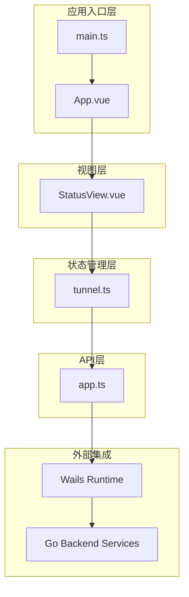
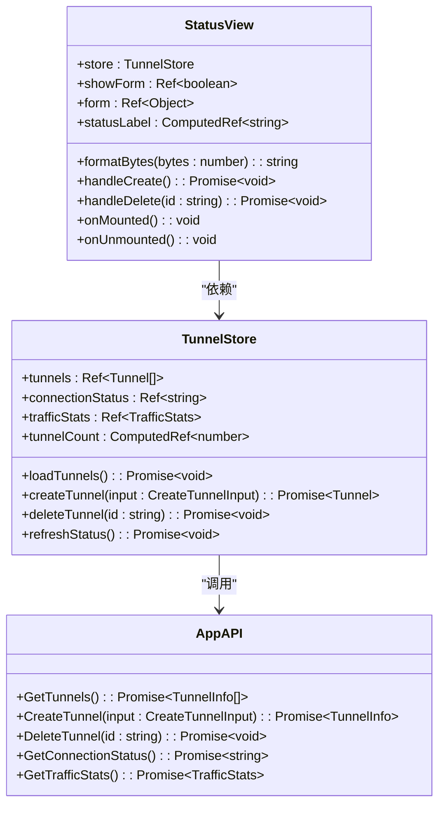
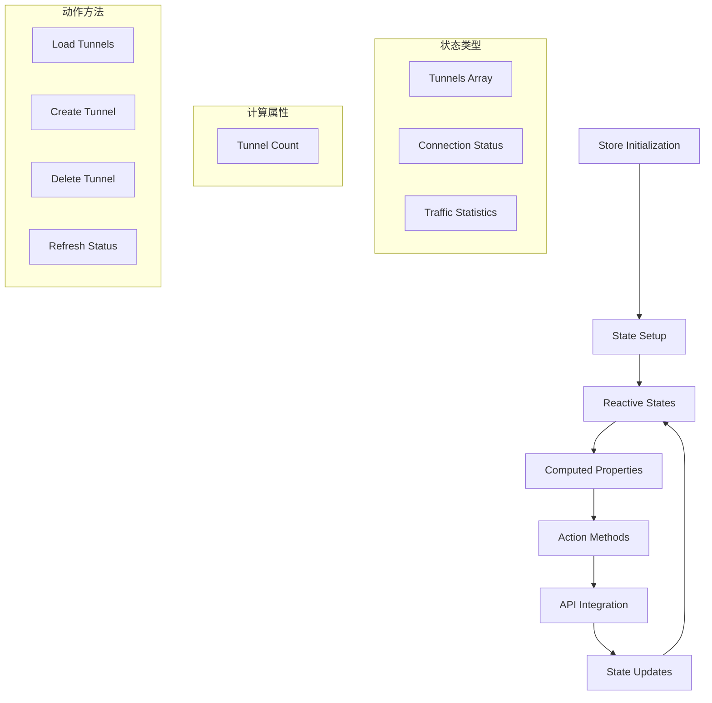
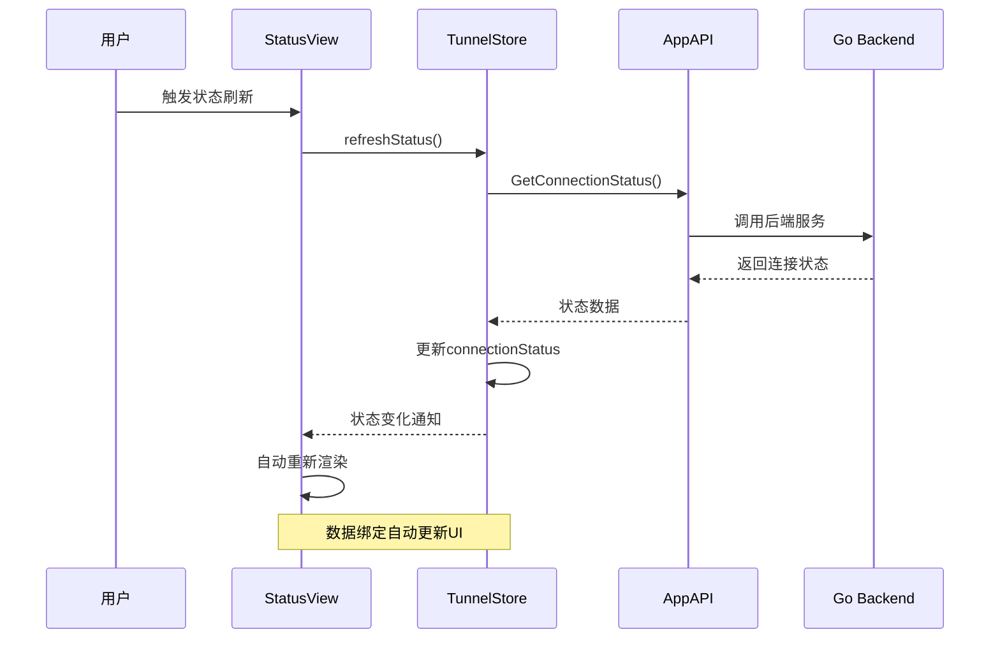
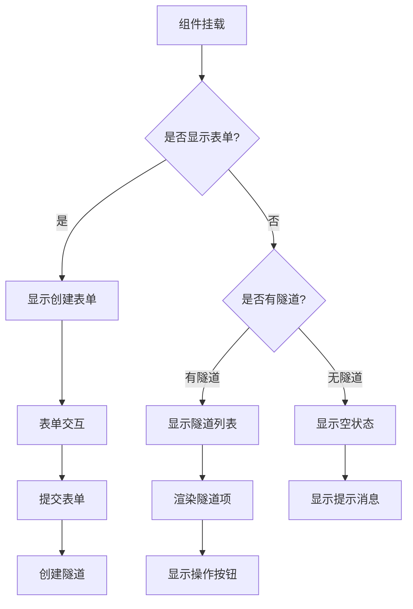
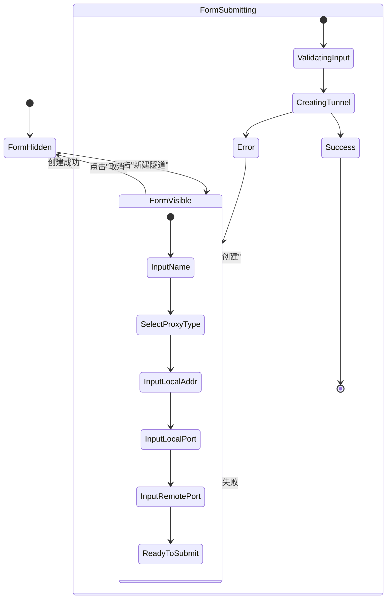
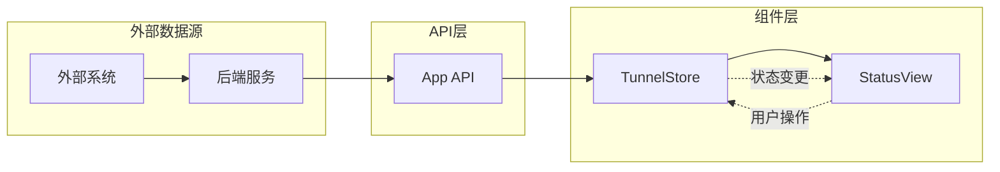
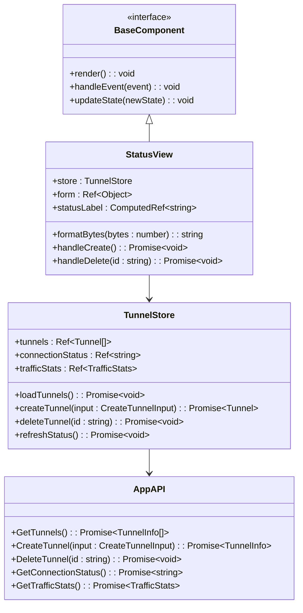

# 核心组件设计

<cite>
**本文档引用的文件**
- [StatusView.vue](file://desktop/frontend/src/views/StatusView.vue)
- [tunnel.ts](file://desktop/frontend/src/stores/tunnel.ts)
- [app.ts](file://desktop/frontend/src/api/app.ts)
- [main.ts](file://desktop/frontend/src/main.ts)
- [App.vue](file://desktop/frontend/src/App.vue)
- [package.json](file://desktop/frontend/package.json)
</cite>

## 目录
1. [简介](#简介)
2. [项目结构](#项目结构)
3. [核心组件架构](#核心组件架构)
4. [状态管理设计](#状态管理设计)
5. [数据绑定与渲染逻辑](#数据绑定与渲染逻辑)
6. [用户交互处理](#用户交互处理)
7. [组件通信机制](#组件通信机制)
8. [可复用性与扩展性](#可复用性与扩展性)
9. [性能优化建议](#性能优化建议)
10. [最佳实践指南](#最佳实践指南)
11. [故障排除指南](#故障排除指南)
12. [总结](#总结)

## 简介

NexTunnel是一个基于Vue 3和Wails技术栈构建的桌面应用程序，专注于提供下一代隧道和P2P网络连接服务。本文档深入分析了StatusView.vue作为核心组件的设计架构，涵盖了组件结构、状态管理、数据绑定策略、用户交互处理以及整体系统的设计理念。

该应用程序采用现代化的前端架构，结合TypeScript类型安全、Pinia状态管理和Vue 3 Composition API，为用户提供直观的隧道管理和监控界面。

## 项目结构

NexTunnel桌面应用采用清晰的分层架构设计，主要分为以下几个层次：

**图表来源**
- [main.ts:1-8](file://desktop/frontend/src/main.ts#L1-L8)
- [App.vue:1-74](file://desktop/frontend/src/App.vue#L1-L74)
- [StatusView.vue:1-252](file://desktop/frontend/src/views/StatusView.vue#L1-L252)

**章节来源**
- [main.ts:1-8](file://desktop/frontend/src/main.ts#L1-L8)
- [App.vue:1-74](file://desktop/frontend/src/App.vue#L1-L74)
- [package.json:1-26](file://desktop/frontend/package.json#L1-L26)

## 核心组件架构

### StatusView组件设计

StatusView是整个应用程序的核心UI组件，负责展示隧道状态、流量统计信息和提供隧道管理功能。该组件采用了响应式设计和模块化架构，确保了良好的用户体验和可维护性。

**图表来源**
- [StatusView.vue:66-121](file://desktop/frontend/src/views/StatusView.vue#L66-L121)
- [tunnel.ts:23-82](file://desktop/frontend/src/stores/tunnel.ts#L23-L82)
- [app.ts:30-48](file://desktop/frontend/src/api/app.ts#L30-L48)

### 组件层次结构

StatusView组件内部包含了多个功能区域，每个区域都有明确的职责分工：

1. **状态指示器区域**：显示连接状态和实时状态标签
2. **流量统计网格**：展示入站、出站流量和隧道数量
3. **隧道管理区域**：提供隧道创建、查看和删除功能

**章节来源**
- [StatusView.vue:1-64](file://desktop/frontend/src/views/StatusView.vue#L1-L64)

## 状态管理设计

### Pinia Store架构

应用程序使用Pinia作为状态管理解决方案，提供了类型安全和开发体验友好的状态管理机制。

**图表来源**
- [tunnel.ts:23-82](file://desktop/frontend/src/stores/tunnel.ts#L23-L82)

### 数据流管理

状态管理遵循单向数据流原则，确保了数据的一致性和可预测性：

1. **初始化阶段**：Store创建时设置初始状态
2. **数据加载**：通过API调用获取远程数据
3. **状态更新**：异步操作完成后更新本地状态
4. **响应式渲染**：Vue自动检测状态变化并重新渲染

**章节来源**
- [tunnel.ts:24-30](file://desktop/frontend/src/stores/tunnel.ts#L24-L30)
- [tunnel.ts:34-70](file://desktop/frontend/src/stores/tunnel.ts#L34-L70)

## 数据绑定与渲染逻辑

### 响应式数据绑定

StatusView组件充分利用了Vue 3的响应式系统，实现了高效的数据绑定和自动更新机制。

**图表来源**
- [StatusView.vue:112-120](file://desktop/frontend/src/views/StatusView.vue#L112-L120)
- [tunnel.ts:63-70](file://desktop/frontend/src/stores/tunnel.ts#L63-L70)

### 条件渲染机制

组件实现了智能的条件渲染逻辑，根据不同的状态显示相应的UI元素：

**图表来源**
- [StatusView.vue:35-61](file://desktop/frontend/src/views/StatusView.vue#L35-L61)

**章节来源**
- [StatusView.vue:47-61](file://desktop/frontend/src/views/StatusView.vue#L47-L61)
- [StatusView.vue:112-120](file://desktop/frontend/src/views/StatusView.vue#L112-L120)

## 用户交互处理

### 表单管理机制

StatusView组件实现了完整的表单管理功能，支持隧道的创建和配置：

**图表来源**
- [StatusView.vue:71-78](file://desktop/frontend/src/views/StatusView.vue#L71-L78)
- [StatusView.vue:95-104](file://desktop/frontend/src/views/StatusView.vue#L95-L104)

### 事件处理流程

组件采用事件驱动的方式处理用户交互，确保了良好的响应性和可维护性：

1. **点击事件**：处理按钮交互和表单切换
2. **输入事件**：实时验证和更新表单数据
3. **生命周期事件**：管理组件的挂载和卸载

**章节来源**
- [StatusView.vue:30-44](file://desktop/frontend/src/views/StatusView.vue#L30-L44)
- [StatusView.vue:106-108](file://desktop/frontend/src/views/StatusView.vue#L106-L108)

## 组件通信机制

### 单向数据流

应用程序严格遵循单向数据流原则，确保了数据流向的清晰和可追踪性：

**图表来源**
- [StatusView.vue:68](file://desktop/frontend/src/views/StatusView.vue#L68)
- [tunnel.ts:3](file://desktop/frontend/src/stores/tunnel.ts#L3)

### 类型安全保证

通过TypeScript的强类型系统，确保了组件间通信的数据完整性：

1. **接口定义**：严格的TypeScript接口确保数据结构正确
2. **编译时检查**：在编译阶段发现类型错误
3. **运行时验证**：API层提供额外的运行时验证

**章节来源**
- [tunnel.ts:5-21](file://desktop/frontend/src/stores/tunnel.ts#L5-L21)
- [app.ts:3-19](file://desktop/frontend/src/api/app.ts#L3-L19)

## 可复用性与扩展性

### 组件设计原则

StatusView组件遵循了高内聚、低耦合的设计原则，具备良好的可复用性和扩展性：

**图表来源**
- [StatusView.vue:66-121](file://desktop/frontend/src/views/StatusView.vue#L66-L121)
- [tunnel.ts:23-82](file://desktop/frontend/src/stores/tunnel.ts#L23-L82)

### 扩展性考虑

1. **模块化设计**：每个功能区域独立封装，便于单独测试和维护
2. **接口标准化**：统一的API接口定义，便于替换和扩展
3. **配置驱动**：通过配置文件管理组件行为，减少硬编码

**章节来源**
- [StatusView.vue:123-251](file://desktop/frontend/src/views/StatusView.vue#L123-L251)
- [tunnel.ts:72-82](file://desktop/frontend/src/stores/tunnel.ts#L72-L82)

## 性能优化建议

### 渲染性能优化

1. **虚拟滚动**：对于大量隧道数据，考虑实现虚拟滚动以提升渲染性能
2. **懒加载**：对非关键资源实现懒加载，减少初始渲染时间
3. **防抖处理**：对频繁触发的用户操作实施防抖机制

### 状态管理优化

1. **状态分片**：将大型状态对象拆分为更小的独立状态片段
2. **计算属性缓存**：利用Vue的计算属性缓存机制避免重复计算
3. **异步操作优化**：合理安排异步操作的执行顺序和并发度

### 内存管理

1. **定时器清理**：确保组件卸载时清理所有定时器和订阅
2. **事件监听器移除**：避免内存泄漏，及时移除不再使用的事件监听器
3. **大对象处理**：对大数据对象实施适当的内存管理策略

**章节来源**
- [StatusView.vue:118-120](file://desktop/frontend/src/views/StatusView.vue#L118-L120)

## 最佳实践指南

### 组件设计最佳实践

1. **单一职责原则**：每个组件只负责一个特定的功能领域
2. **状态提升**：将共享状态提升到最近的共同祖先组件
3. **不可变性**：避免直接修改响应式数据，使用新的引用替换

### 错误处理最佳实践

1. **渐进式增强**：为不同类型的错误提供相应的用户反馈
2. **优雅降级**：在网络异常或服务不可用时提供基本功能
3. **错误边界**：实现错误边界组件捕获和处理子组件错误

### 用户体验最佳实践

1. **加载状态**：为异步操作提供明确的加载指示器
2. **确认对话框**：对破坏性操作实施二次确认机制
3. **键盘导航**：确保组件支持键盘快捷键和无障碍访问

## 故障排除指南

### 常见问题诊断

1. **状态不更新**：检查Store中的异步操作是否正确更新状态
2. **API调用失败**：验证Wails运行时绑定是否正确配置
3. **样式问题**：确认CSS变量和主题配置是否正确应用

### 调试技巧

1. **Vue DevTools**：使用Vue DevTools检查组件状态和生命周期
2. **浏览器控制台**：查看JavaScript错误和警告信息
3. **网络面板**：监控API请求和响应状态

### 性能监控

1. **渲染时间**：使用浏览器性能面板分析组件渲染性能
2. **内存使用**：监控应用的内存使用情况，识别潜在的内存泄漏
3. **网络请求**：分析API调用频率和响应时间

**章节来源**
- [tunnel.ts:37-38](file://desktop/frontend/src/stores/tunnel.ts#L37-L38)
- [tunnel.ts:47-48](file://desktop/frontend/src/stores/tunnel.ts#L47-L48)

## 总结

NexTunnel的核心组件设计体现了现代前端开发的最佳实践，通过合理的架构分层、类型安全的编程范式和高效的响应式系统，为用户提供了优秀的隧道管理和监控体验。

StatusView组件作为核心UI组件，成功地将复杂的业务逻辑抽象为简洁的用户界面，同时保持了良好的可维护性和扩展性。通过Pinia状态管理和Vue 3 Composition API的结合，实现了数据流的清晰控制和高效的用户交互响应。

未来的发展方向包括进一步优化性能表现、增强错误处理能力、扩展更多的隧道类型支持，以及提供更加丰富的配置选项和监控功能。这些改进将在保持现有架构稳定性的基础上逐步实现，确保系统的持续演进和用户价值的最大化。