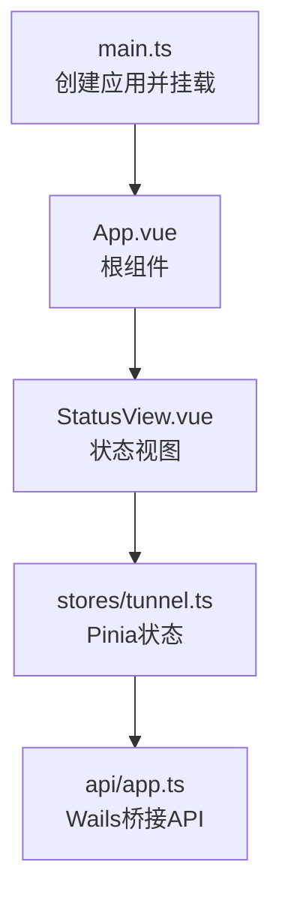
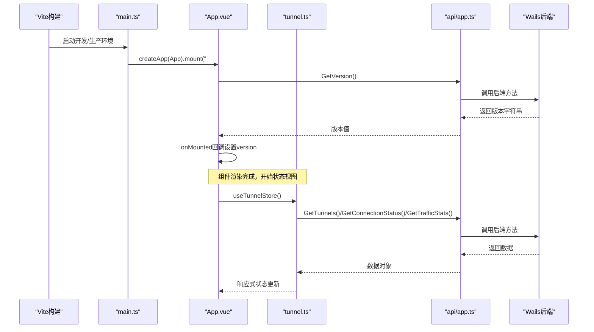
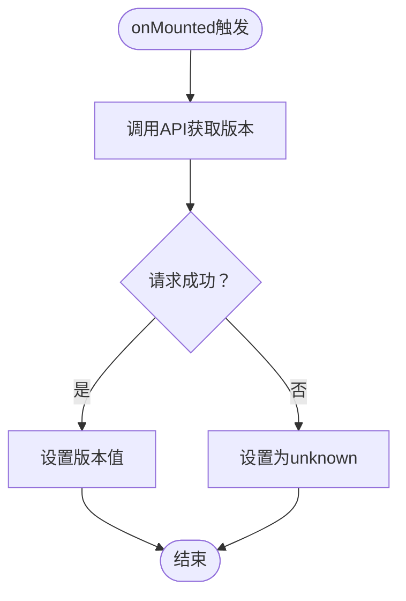
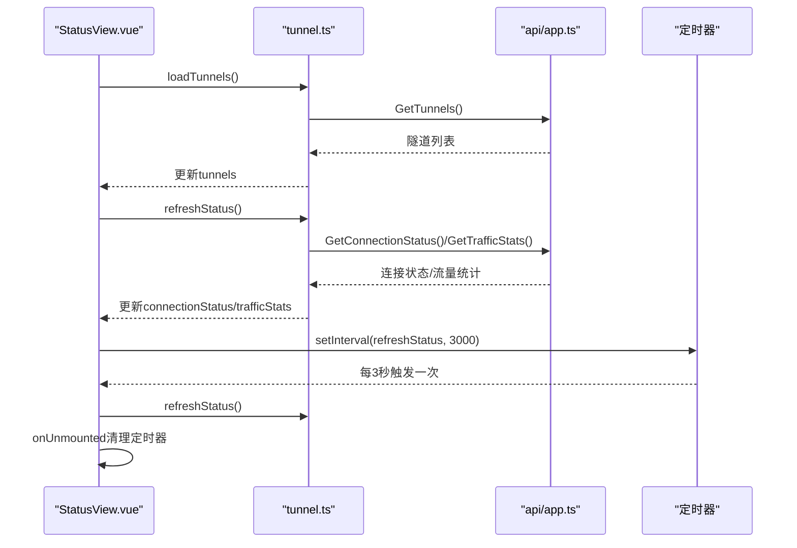
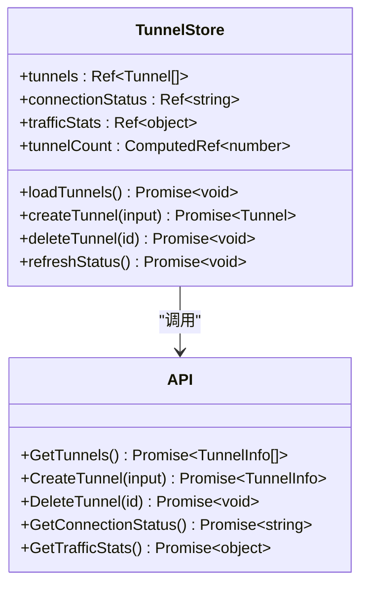
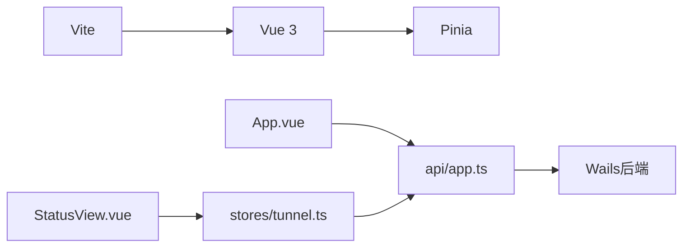

# 生命周期管理

<cite>
**本文引用的文件**
- [App.vue](file://desktop/frontend/src/App.vue)
- [main.ts](file://desktop/frontend/src/main.ts)
- [StatusView.vue](file://desktop/frontend/src/views/StatusView.vue)
- [tunnel.ts](file://desktop/frontend/src/stores/tunnel.ts)
- [app.ts](file://desktop/frontend/src/api/app.ts)
- [package.json](file://desktop/frontend/package.json)
- [vite.config.ts](file://desktop/frontend/vite.config.ts)
</cite>

## 目录
1. [简介](#简介)
2. [项目结构](#项目结构)
3. [核心组件](#核心组件)
4. [架构总览](#架构总览)
5. [详细组件分析](#详细组件分析)
6. [依赖关系分析](#依赖关系分析)
7. [性能考量](#性能考量)
8. [故障排查指南](#故障排查指南)
9. [结论](#结论)
10. [附录](#附录)

## 简介
本文件聚焦于NexTunnel桌面前端的组件生命周期管理，系统性梳理Vue 3组合式API中生命周期钩子（如onMounted、onUnmounted、onBeforeMount等）在组件初始化、资源加载与清理中的应用。文档从架构视角出发，结合实际代码路径，解释组件挂载与卸载时的数据同步、事件监听器管理、定时器清理策略，并给出更新时机、依赖追踪与性能优化建议，同时提供常见问题的解决方案与调试技巧。

## 项目结构
前端采用Vite + Vue 3 + Pinia的现代技术栈，入口通过main.ts创建应用并挂载根组件App.vue；状态管理由Pinia提供，业务API通过Wails桥接调用后端能力。关键文件如下：
- 应用入口：main.ts
- 根组件：App.vue
- 视图组件：StatusView.vue
- 状态仓库：stores/tunnel.ts
- API层：api/app.ts

图表来源
- [main.ts:1-8](file://desktop/frontend/src/main.ts#L1-L8)
- [App.vue:1-74](file://desktop/frontend/src/App.vue#L1-L74)
- [StatusView.vue:1-252](file://desktop/frontend/src/views/StatusView.vue#L1-L252)
- [tunnel.ts:1-83](file://desktop/frontend/src/stores/tunnel.ts#L1-L83)
- [app.ts:1-49](file://desktop/frontend/src/api/app.ts#L1-L49)

章节来源
- [main.ts:1-8](file://desktop/frontend/src/main.ts#L1-L8)
- [package.json:1-26](file://desktop/frontend/package.json#L1-L26)
- [vite.config.ts:1-15](file://desktop/frontend/vite.config.ts#L1-L15)

## 核心组件
- 根组件App.vue：负责应用版本信息的异步加载与显示，使用onMounted在DOM挂载后拉取版本号。
- 状态视图组件StatusView.vue：负责隧道列表、连接状态与流量统计的展示与交互，使用onMounted启动轮询刷新，使用onUnmounted清理定时器。
- Pinia状态仓库tunnel.ts：封装隧道数据、连接状态与流量统计的状态与方法，供组件消费。
- API层app.ts：封装对Wails后端方法的调用，作为组件与后端之间的桥梁。

章节来源
- [App.vue:13-27](file://desktop/frontend/src/App.vue#L13-L27)
- [StatusView.vue:66-121](file://desktop/frontend/src/views/StatusView.vue#L66-L121)
- [tunnel.ts:23-82](file://desktop/frontend/src/stores/tunnel.ts#L23-L82)
- [app.ts:22-48](file://desktop/frontend/src/api/app.ts#L22-L48)

## 架构总览
下图展示了从应用启动到组件生命周期执行的关键流程，以及状态与API层的交互。

图表来源
- [main.ts:1-8](file://desktop/frontend/src/main.ts#L1-L8)
- [App.vue:13-27](file://desktop/frontend/src/App.vue#L13-L27)
- [tunnel.ts:34-70](file://desktop/frontend/src/stores/tunnel.ts#L34-L70)
- [app.ts:26-48](file://desktop/frontend/src/api/app.ts#L26-L48)

## 详细组件分析

### 根组件App.vue的生命周期使用
- 初始化时机：onMounted在组件DOM挂载完成后执行，用于进行一次性异步操作（如获取版本号）。
- 资源加载策略：在onMounted中调用API层方法获取版本信息，成功则更新响应式变量，失败则回退为“unknown”。
- 清理机制：该组件未注册全局事件或定时器，因此无需onUnmounted清理。
- 更新时机与依赖：版本信息为只读展示，无显式依赖追踪需求；若后续扩展为动态配置，可考虑computed与watchEffect配合。

图表来源
- [App.vue:20-26](file://desktop/frontend/src/App.vue#L20-L26)
- [app.ts:26-28](file://desktop/frontend/src/api/app.ts#L26-L28)

章节来源
- [App.vue:13-27](file://desktop/frontend/src/App.vue#L13-L27)
- [app.ts:26-28](file://desktop/frontend/src/api/app.ts#L26-L28)

### 状态视图组件StatusView.vue的生命周期使用
- 初始化时机：onMounted在组件挂载后执行，用于加载初始数据并启动周期性刷新。
- 资源加载策略：
  - 首次加载：调用store.loadTunnels()与store.refreshStatus()，确保UI初始状态完整。
  - 周期性刷新：设置定时器每3秒刷新一次连接状态与流量统计。
- 清理机制：onUnmounted中清理定时器，避免内存泄漏与重复刷新。
- 更新时机与依赖：
  - computed用于根据连接状态生成标签文本，自动响应状态变化。
  - 表单字段使用响应式ref，双向绑定至模板，提交后重置表单。

图表来源
- [StatusView.vue:112-120](file://desktop/frontend/src/views/StatusView.vue#L112-L120)
- [tunnel.ts:34-70](file://desktop/frontend/src/stores/tunnel.ts#L34-L70)
- [app.ts:30-48](file://desktop/frontend/src/api/app.ts#L30-L48)

章节来源
- [StatusView.vue:66-121](file://desktop/frontend/src/views/StatusView.vue#L66-L121)
- [tunnel.ts:34-70](file://desktop/frontend/src/stores/tunnel.ts#L34-L70)
- [app.ts:30-48](file://desktop/frontend/src/api/app.ts#L30-L48)

### Pinia状态仓库tunnel.ts的设计要点
- 状态定义：使用ref维护tunnels、connectionStatus、trafficStats；使用computed导出tunnelCount。
- 方法封装：封装loadTunnels、createTunnel、deleteTunnel、refreshStatus等异步方法，统一错误处理与返回值。
- 与组件协作：组件通过useTunnelStore()直接消费状态与方法，实现数据驱动的UI更新。

图表来源
- [tunnel.ts:23-82](file://desktop/frontend/src/stores/tunnel.ts#L23-L82)
- [app.ts:30-48](file://desktop/frontend/src/api/app.ts#L30-L48)

章节来源
- [tunnel.ts:23-82](file://desktop/frontend/src/stores/tunnel.ts#L23-L82)

### API层app.ts的职责与边界
- 封装Wails桥接调用：通过call函数统一路由到window.go.main.App的方法名，屏蔽底层细节。
- 类型安全：定义TunnelInfo与CreateTunnelInput接口，保证传参与返回值类型一致。
- 错误处理：API层不抛出异常，由调用方决定如何处理错误（例如在store中记录日志并抛出）。

章节来源
- [app.ts:22-48](file://desktop/frontend/src/api/app.ts#L22-L48)

## 依赖关系分析
- 技术栈依赖：Vue 3与Pinia为核心运行时，Vite提供构建与开发体验。
- 组件依赖：App.vue依赖API层获取版本；StatusView.vue依赖Pinia状态与API层获取隧道与状态。
- 外部依赖：Wails桥接后端服务，API层负责方法调用与参数传递。

图表来源
- [package.json:12-14](file://desktop/frontend/package.json#L12-L14)
- [main.ts:1-8](file://desktop/frontend/src/main.ts#L1-L8)
- [App.vue:13-16](file://desktop/frontend/src/App.vue#L13-L16)
- [StatusView.vue:67-68](file://desktop/frontend/src/views/StatusView.vue#L67-L68)
- [tunnel.ts:2-3](file://desktop/frontend/src/stores/tunnel.ts#L2-L3)
- [app.ts:22-24](file://desktop/frontend/src/api/app.ts#L22-L24)

章节来源
- [package.json:1-26](file://desktop/frontend/package.json#L1-L26)
- [vite.config.ts:1-15](file://desktop/frontend/vite.config.ts#L1-L15)

## 性能考量
- 定时器粒度控制：当前3秒刷新频率适中，可根据UI交互与后端压力调整；必要时可引入节流/防抖。
- 异步操作合并：在短时间内多次刷新时，可考虑合并请求或使用队列减少重复调用。
- 计算属性优化：computed仅在依赖变化时重新计算，避免在模板中进行复杂运算。
- 内存泄漏防护：确保所有定时器、事件监听器在onUnmounted中清理，避免组件卸载后仍占用资源。
- 网络请求幂等性：对频繁刷新的接口，确保幂等性以避免重复副作用。

## 故障排查指南
- 版本信息未显示或显示为unknown
  - 检查API层是否正确调用后端方法，确认Wails桥接可用。
  - 参考路径：[App.vue:20-26](file://desktop/frontend/src/App.vue#L20-L26)，[app.ts:26-28](file://desktop/frontend/src/api/app.ts#L26-L28)
- 隧道列表为空或状态不更新
  - 确认store.loadTunnels()与store.refreshStatus()已执行且未被异常中断。
  - 参考路径：[StatusView.vue:112-116](file://desktop/frontend/src/views/StatusView.vue#L112-L116)，[tunnel.ts:34-70](file://desktop/frontend/src/stores/tunnel.ts#L34-L70)
- 页面卸载后仍有定时器运行
  - 确保onUnmounted中清理了定时器，避免内存泄漏。
  - 参考路径：[StatusView.vue:118-120](file://desktop/frontend/src/views/StatusView.vue#L118-L120)
- 连接状态与流量统计异常
  - 检查API层返回值格式与store.refreshStatus()逻辑，确保异常时回退到断开状态。
  - 参考路径：[tunnel.ts:63-70](file://desktop/frontend/src/stores/tunnel.ts#L63-L70)，[app.ts:42-48](file://desktop/frontend/src/api/app.ts#L42-L48)
- 开发/构建问题
  - 确认Vite配置与依赖安装正常，检查包管理器缓存与网络代理。
  - 参考路径：[vite.config.ts:1-15](file://desktop/frontend/vite.config.ts#L1-L15)，[package.json:1-26](file://desktop/frontend/package.json#L1-L26)

## 结论
NexTunnel前端在生命周期管理上遵循Vue 3最佳实践：在onMounted中执行一次性初始化与周期性任务，在onUnmounted中清理定时器与监听器，确保资源释放与性能稳定。通过Pinia集中管理状态、API层统一封装后端调用，组件职责清晰、耦合度低。未来可在刷新策略、错误处理与监控埋点方面进一步增强，以提升用户体验与可观测性。

## 附录
- 生命周期钩子速查
  - onBeforeMount：组件挂载前的准备阶段，适合进行轻量初始化。
  - onMounted：DOM挂载后的异步操作，如API调用、定时器启动。
  - onBeforeUnmount：组件卸载前的清理准备，确保资源回收。
  - onUnmounted：最终清理阶段，关闭定时器、移除事件监听器。
- 调试建议
  - 使用浏览器开发者工具观察组件生命周期钩子的触发顺序与时间点。
  - 在store与API层添加日志，定位异步调用失败的具体环节。
  - 对高频刷新接口增加节流/防抖，降低网络与CPU压力。