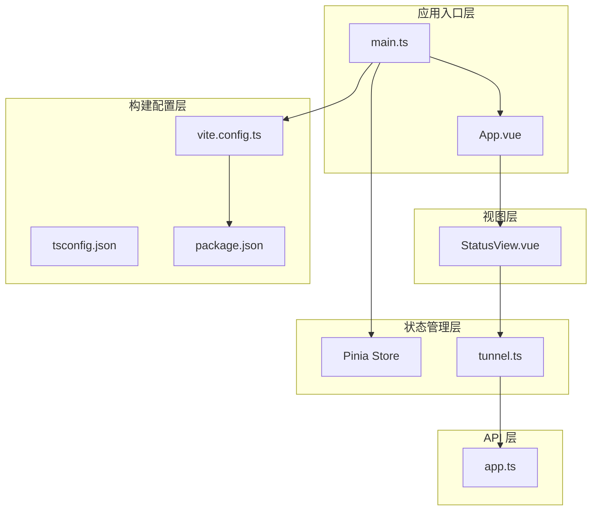
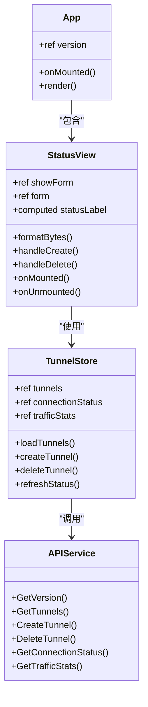
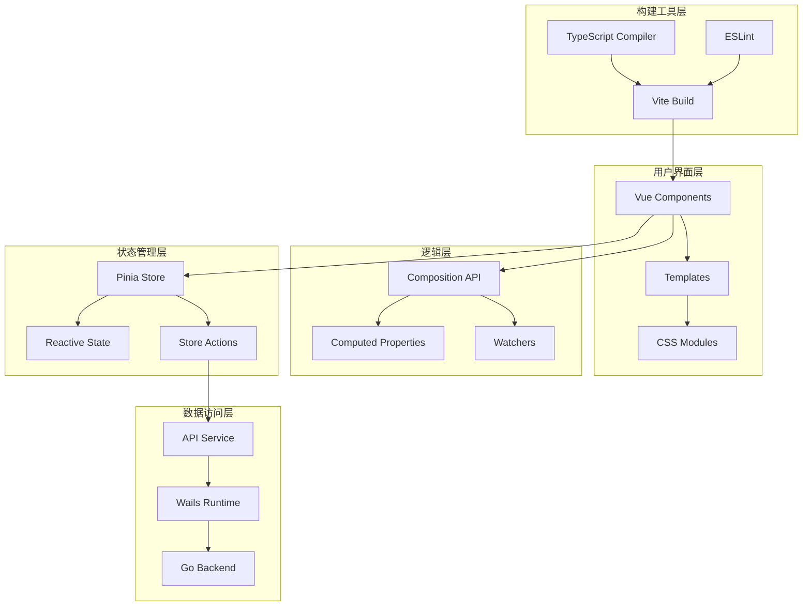
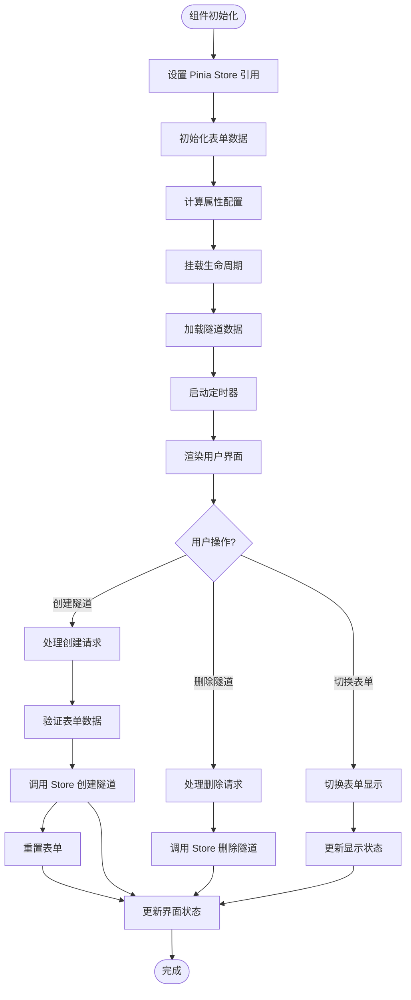
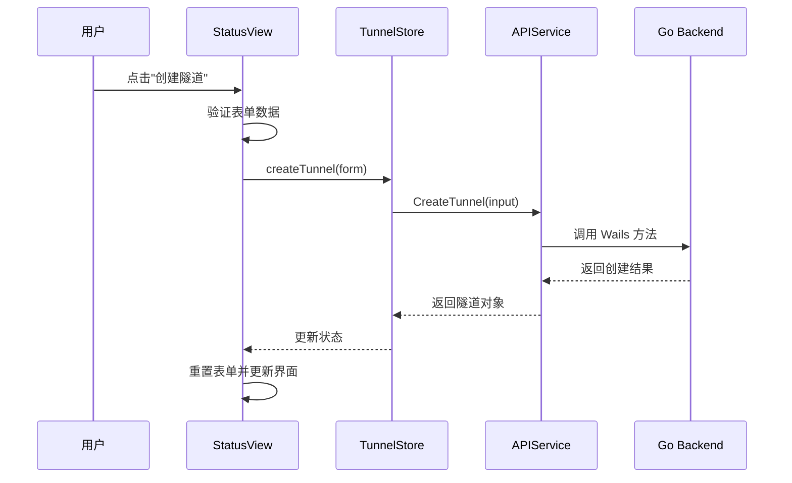
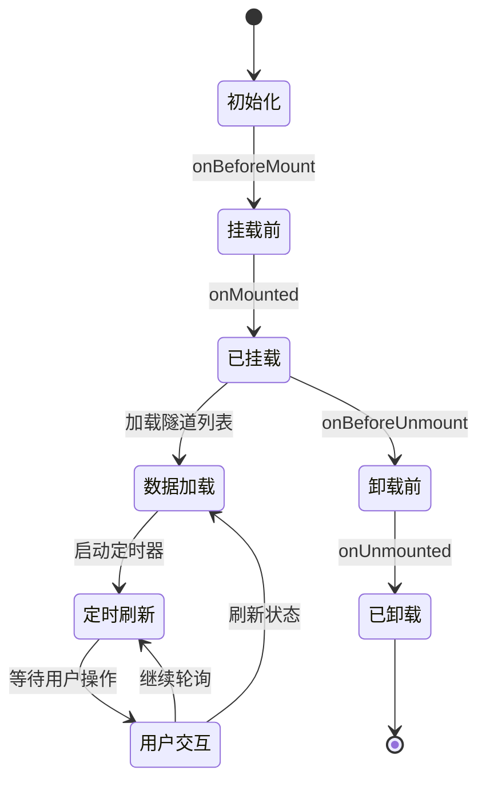
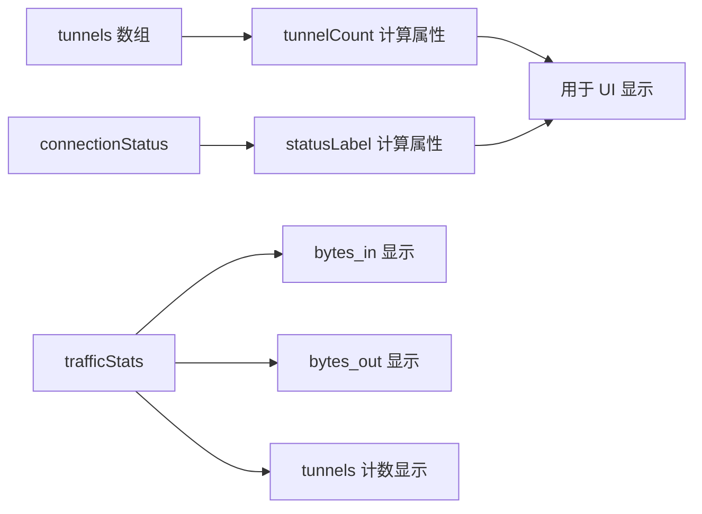
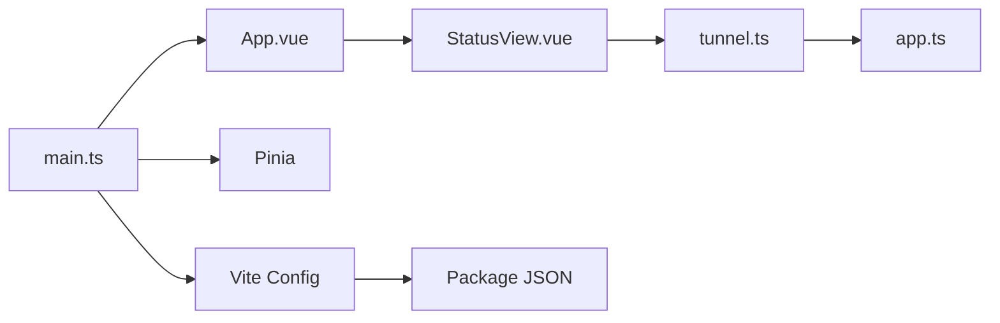

# 组件系统设计

<cite>
**本文档引用的文件**
- [StatusView.vue](file://desktop/frontend/src/views/StatusView.vue)
- [App.vue](file://desktop/frontend/src/App.vue)
- [main.ts](file://desktop/frontend/src/main.ts)
- [tunnel.ts](file://desktop/frontend/src/stores/tunnel.ts)
- [app.ts](file://desktop/frontend/src/api/app.ts)
- [package.json](file://desktop/frontend/package.json)
- [vite.config.ts](file://desktop/frontend/vite.config.ts)
- [tsconfig.json](file://desktop/frontend/tsconfig.json)
- [env.d.ts](file://desktop/frontend/env.d.ts)
</cite>

## 目录
1. [简介](#简介)
2. [项目结构](#项目结构)
3. [核心组件](#核心组件)
4. [架构概览](#架构概览)
5. [详细组件分析](#详细组件分析)
6. [依赖分析](#依赖分析)
7. [性能考虑](#性能考虑)
8. [故障排除指南](#故障排除指南)
9. [结论](#结论)
10. [附录](#附录)

## 简介

NexTunnel 是一个基于 Vue 3 的桌面应用程序，专注于隧道管理和点对点网络连接。该组件系统采用现代前端架构设计，结合了 Vue 3 的 Composition API、Pinia 状态管理、TypeScript 类型安全以及 Vite 构建工具链。

本设计文档深入分析了组件系统的架构模式、设计原则、复用策略和通信机制，特别聚焦于核心组件 StatusView.vue 的设计理念和实现细节。

## 项目结构

NexTunnel 前端项目采用清晰的分层架构，主要分为以下几个层次：



**图表来源**
- [main.ts:1-8](file://desktop/frontend/src/main.ts#L1-L8)
- [App.vue:1-74](file://desktop/frontend/src/App.vue#L1-L74)
- [StatusView.vue:1-252](file://desktop/frontend/src/views/StatusView.vue#L1-L252)
- [tunnel.ts:1-83](file://desktop/frontend/src/stores/tunnel.ts#L1-L83)
- [app.ts:1-49](file://desktop/frontend/src/api/app.ts#L1-L49)

**章节来源**
- [main.ts:1-8](file://desktop/frontend/src/main.ts#L1-L8)
- [package.json:1-26](file://desktop/frontend/package.json#L1-L26)
- [vite.config.ts:1-15](file://desktop/frontend/vite.config.ts#L1-L15)
- [tsconfig.json:1-23](file://desktop/frontend/tsconfig.json#L1-L23)

## 核心组件

### 组件分类与设计原则

NexTunnel 的组件系统遵循以下设计原则：

1. **单一职责原则**: 每个组件专注于特定的功能领域
2. **可复用性**: 组件设计考虑跨页面复用的可能性
3. **类型安全**: 使用 TypeScript 确保运行时类型正确性
4. **响应式设计**: 采用 Vue 3 的响应式系统确保数据驱动更新
5. **状态集中管理**: 全局状态通过 Pinia 进行统一管理

### 组件层次结构



**图表来源**
- [App.vue:13-27](file://desktop/frontend/src/App.vue#L13-L27)
- [StatusView.vue:66-121](file://desktop/frontend/src/views/StatusView.vue#L66-L121)
- [tunnel.ts:23-82](file://desktop/frontend/src/stores/tunnel.ts#L23-L82)
- [app.ts:26-48](file://desktop/frontend/src/api/app.ts#L26-L48)

**章节来源**
- [StatusView.vue:66-121](file://desktop/frontend/src/views/StatusView.vue#L66-L121)
- [tunnel.ts:23-82](file://desktop/frontend/src/stores/tunnel.ts#L23-L82)

## 架构概览

NexTunnel 采用了典型的 MVVM 架构模式，结合了现代前端开发的最佳实践：



**图表来源**
- [main.ts:1-8](file://desktop/frontend/src/main.ts#L1-L8)
- [StatusView.vue:66-121](file://desktop/frontend/src/views/StatusView.vue#L66-L121)
- [tunnel.ts:23-82](file://desktop/frontend/src/stores/tunnel.ts#L23-L82)
- [app.ts:22-24](file://desktop/frontend/src/api/app.ts#L22-L24)

## 详细组件分析

### StatusView 组件深度解析

StatusView 是整个应用的核心组件，负责展示隧道状态、流量统计信息以及提供隧道管理功能。

#### 组件结构分析



**图表来源**
- [StatusView.vue:66-121](file://desktop/frontend/src/views/StatusView.vue#L66-L121)
- [StatusView.vue:95-108](file://desktop/frontend/src/views/StatusView.vue#L95-L108)

#### Props 设计与使用

StatusView 组件采用无 Props 设计，通过 Pinia Store 进行状态管理：

| 属性名 | 类型 | 默认值 | 描述 |
|--------|------|--------|------|
| showForm | ref<boolean> | false | 控制隧道创建表单的显示状态 |
| form | ref<object> | 预设表单数据 | 包含隧道创建所需的所有字段 |

#### 事件处理机制

组件实现了完整的 CRUD 操作事件处理：



**图表来源**
- [StatusView.vue:95-108](file://desktop/frontend/src/views/StatusView.vue#L95-L108)
- [tunnel.ts:42-51](file://desktop/frontend/src/stores/tunnel.ts#L42-L51)
- [app.ts:34-36](file://desktop/frontend/src/api/app.ts#L34-L36)

#### 插槽使用策略

当前版本中，StatusView 未使用插槽机制，但保留了扩展空间。建议在未来版本中添加插槽支持以增强组件的可定制性。

#### 生命周期管理

组件采用标准的 Vue 3 生命周期钩子：



**图表来源**
- [StatusView.vue:112-120](file://desktop/frontend/src/views/StatusView.vue#L112-L120)

**章节来源**
- [StatusView.vue:1-252](file://desktop/frontend/src/views/StatusView.vue#L1-L252)

### TunnelStore 状态管理

TunnelStore 是应用的核心状态管理模块，采用 Pinia 的组合式 API 设计：

#### 状态结构

| 状态属性 | 类型 | 描述 |
|----------|------|------|
| tunnels | ref<Tunnel[]> | 隧道列表数组 |
| connectionStatus | ref<string> | 连接状态（connected/reconnecting/disconnected） |
| trafficStats | ref<object> | 流量统计信息（bytes_in, bytes_out, tunnels） |

#### 计算属性设计



**图表来源**
- [tunnel.ts:32-82](file://desktop/frontend/src/stores/tunnel.ts#L32-L82)
- [StatusView.vue:80-86](file://desktop/frontend/src/views/StatusView.vue#L80-L86)

**章节来源**
- [tunnel.ts:1-83](file://desktop/frontend/src/stores/tunnel.ts#L1-L83)

### API 服务层

APIService 提供了与底层 Go 后端的接口封装：

#### 接口定义

| 函数名 | 参数 | 返回值 | 描述 |
|--------|------|--------|------|
| GetVersion | 无 | Promise<string> | 获取应用版本号 |
| GetTunnels | 无 | Promise<TunnelInfo[]> | 获取所有隧道信息 |
| CreateTunnel | CreateTunnelInput | Promise<TunnelInfo> | 创建新隧道 |
| DeleteTunnel | string | Promise<void> | 删除指定隧道 |
| GetConnectionStatus | 无 | Promise<string> | 获取连接状态 |
| GetTrafficStats | 无 | Promise<object> | 获取流量统计信息 |

**章节来源**
- [app.ts:1-49](file://desktop/frontend/src/api/app.ts#L1-L49)

## 依赖分析

### 外部依赖关系

```mermaid
graph TB
subgraph "核心依赖"
Vue[Vue 3.5.13]
Pinia[Pinia 2.3.0]
TypeScript[TypeScript ~5.6.3]
end
subgraph "构建工具"
Vite[Vite 6.3.5]
VuePlugin[@vitejs/plugin-vue]
ESLint[ESLint 9.17.0]
end
subgraph "开发工具"
VueTSC[vue-tsc]
VueESLint[@vue/eslint-config-typescript]
VueESLintPlugin[eslint-plugin-vue]
end
App --> Vue
App --> Pinia
App --> TypeScript
ViteConfig --> Vite
Vite --> VuePlugin
Vite --> VueTSC
Lint --> ESLint
Lint --> VueESLint
Lint --> VueESLintPlugin
```

**图表来源**
- [package.json:12-24](file://desktop/frontend/package.json#L12-L24)
- [vite.config.ts:1-15](file://desktop/frontend/vite.config.ts#L1-L15)

### 内部模块依赖



**图表来源**
- [main.ts:1-8](file://desktop/frontend/src/main.ts#L1-L8)
- [App.vue:15](file://desktop/frontend/src/App.vue#L15)

**章节来源**
- [package.json:1-26](file://desktop/frontend/package.json#L1-L26)

## 性能考虑

### 响应式性能优化

1. **计算属性缓存**: 使用 `computed` 属性避免重复计算
2. **条件渲染**: 通过 `v-if` 和 `v-show` 控制元素渲染
3. **事件防抖**: 对频繁触发的操作进行防抖处理

### 内存管理

1. **生命周期清理**: 在 `onUnmounted` 中清理定时器和事件监听器
2. **状态释放**: 组件卸载时自动释放相关资源

### 渲染优化

1. **虚拟滚动**: 对大量数据项使用虚拟滚动技术
2. **懒加载**: 图片和复杂组件采用懒加载策略
3. **CSS 作用域**: 使用 scoped CSS 避免样式冲突

## 故障排除指南

### 常见问题诊断

#### 组件无法渲染

**症状**: StatusView 组件空白或显示异常

**可能原因**:
1. Pinia Store 未正确初始化
2. API 调用失败导致状态异常
3. TypeScript 类型错误

**解决方案**:
1. 检查 main.ts 中的 Pinia 初始化
2. 验证 API 服务的可用性
3. 查看浏览器控制台的 TypeScript 错误

#### 状态不同步

**症状**: UI 显示的状态与实际状态不一致

**可能原因**:
1. 定时器未正确清理
2. 异步操作状态更新时机问题
3. Store 状态未正确响应

**解决方案**:
1. 确保在 `onUnmounted` 中清理定时器
2. 使用 `await` 确保异步操作完成
3. 检查 Store 的响应式更新

**章节来源**
- [StatusView.vue:118-120](file://desktop/frontend/src/views/StatusView.vue#L118-L120)
- [tunnel.ts:63-70](file://desktop/frontend/src/stores/tunnel.ts#L63-L70)

## 结论

NexTunnel 的组件系统展现了现代前端开发的最佳实践，通过合理的架构设计和组件化思维，实现了高度可维护和可扩展的应用程序。核心优势包括：

1. **清晰的架构分离**: 视图层、状态层、API 层职责明确
2. **强大的状态管理**: Pinia 提供了简洁而强大的状态管理能力
3. **类型安全保证**: TypeScript 确保了代码质量和开发体验
4. **现代化工具链**: Vite + Vue + TypeScript 的组合提供了优秀的开发体验

未来可以进一步优化的方向包括：
- 添加更多的插槽支持以增强组件可定制性
- 实现更完善的错误边界处理
- 增加组件单元测试覆盖率
- 考虑实现组件懒加载以提升首屏性能

## 附录

### 最佳实践清单

#### 组件设计
- 遵循单一职责原则
- 使用语义化的组件命名
- 保持组件的无状态设计
- 提供清晰的默认行为

#### 状态管理
- 将业务逻辑集中在 Store 中
- 使用计算属性处理派生状态
- 避免直接修改 Store 状态
- 实现状态持久化策略

#### 代码组织
- 按功能模块组织文件结构
- 使用 TypeScript 接口定义数据结构
- 编写清晰的注释和文档
- 遵循一致的代码风格

#### 测试策略
- 为关键组件编写单元测试
- 实现集成测试覆盖主要流程
- 使用模拟数据进行测试
- 建立持续集成流水线