# 组件系统设计

<cite>
**本文档引用的文件**
- [App.vue](file://desktop/frontend/src/App.vue)
- [StatusView.vue](file://desktop/frontend/src/views/StatusView.vue)
- [main.ts](file://desktop/frontend/src/main.ts)
- [tunnel.ts](file://desktop/frontend/src/stores/tunnel.ts)
- [app.ts](file://desktop/frontend/src/api/app.ts)
- [window.ts](file://desktop/frontend/src/api/window.ts)
- [package.json](file://desktop/frontend/package.json)
- [vite.config.ts](file://desktop/frontend/vite.config.ts)
- [tsconfig.json](file://desktop/frontend/tsconfig.json)
- [env.d.ts](file://desktop/frontend/env.d.ts)
</cite>

## 更新摘要
**所做更改**
- 更新了导航组件架构分析，反映新的侧边栏导航系统
- 修订了状态管理部分，增加对新UI布局的说明
- 更新了组件层次结构图，体现重构后的组件关系
- 新增了主题和国际化系统的技术分析
- 增强了性能优化策略章节，涵盖新的布局模式

## 目录
1. [简介](#简介)
2. [项目结构](#项目结构)
3. [核心组件](#核心组件)
4. [架构概览](#架构概览)
5. [详细组件分析](#详细组件分析)
6. [依赖分析](#依赖分析)
7. [性能考虑](#性能考虑)
8. [故障排除指南](#故障排除指南)
9. [结论](#结论)
10. [附录](#附录)

## 简介

NexTunnel 是一个基于 Vue 3 的现代化桌面应用程序，专注于隧道管理和点对点网络连接。经过UI重构后，该组件系统采用了全新的布局架构，结合了 Naive UI 组件库、Composition API、Pinia 状态管理、TypeScript 类型安全以及 Vite 构建工具链。

本次重构重点改进了导航组件系统和状态管理模式，引入了响应式网格布局、深色主题系统和国际化支持。本设计文档深入分析了重构后的组件系统架构模式、设计原则、复用策略和通信机制，特别聚焦于核心组件 StatusView.vue 的设计理念和实现细节。

## 项目结构

NexTunnel 重构后的前端项目采用更加清晰的分层架构，主要分为以下几个层次：

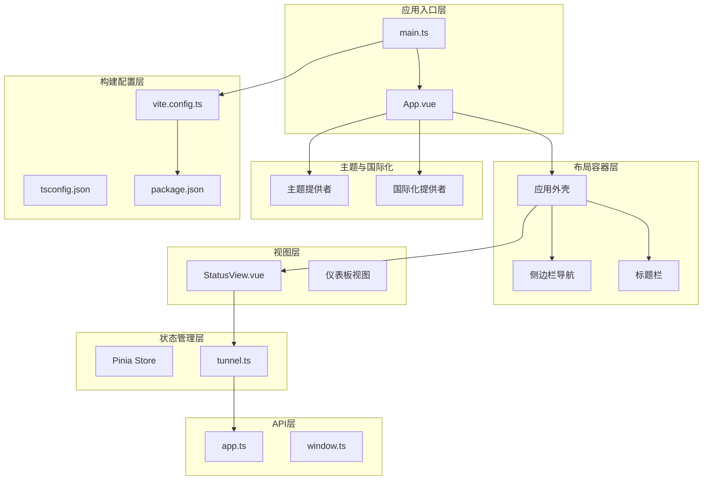

**图表来源**
- [main.ts:1-8](file://desktop/frontend/src/main.ts#L1-L8)
- [App.vue:1-556](file://desktop/frontend/src/App.vue#L1-L556)
- [StatusView.vue:1-872](file://desktop/frontend/src/views/StatusView.vue#L1-L872)
- [tunnel.ts:1-83](file://desktop/frontend/src/stores/tunnel.ts#L1-L83)
- [app.ts:1-49](file://desktop/frontend/src/api/app.ts#L1-L49)
- [window.ts:1-49](file://desktop/frontend/src/api/window.ts#L1-L49)

**章节来源**
- [main.ts:1-8](file://desktop/frontend/src/main.ts#L1-L8)
- [package.json:1-26](file://desktop/frontend/package.json#L1-L26)
- [vite.config.ts:1-15](file://desktop/frontend/vite.config.ts#L1-L15)
- [tsconfig.json:1-23](file://desktop/frontend/tsconfig.json#L1-L23)

## 核心组件

### 组件分类与设计原则

NexTunnel 重构后的组件系统遵循以下设计原则：

1. **模块化架构**: 采用功能模块化设计，每个组件职责明确
2. **响应式布局**: 支持多种屏幕尺寸的自适应布局
3. **主题系统**: 集成深色/浅色主题切换机制
4. **国际化支持**: 完整的多语言支持框架
5. **状态集中管理**: 全局状态通过 Pinia 进行统一管理
6. **组件复用**: 通过插槽和属性实现高度可复用性

### 组件层次结构

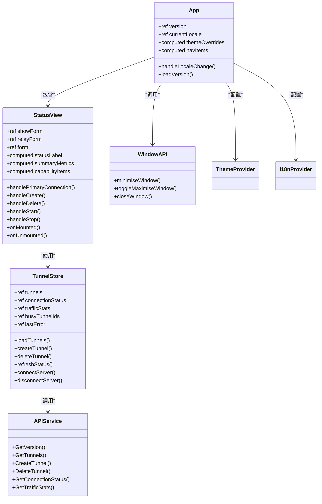

**图表来源**
- [App.vue:145-270](file://desktop/frontend/src/App.vue#L145-L270)
- [StatusView.vue:320-543](file://desktop/frontend/src/views/StatusView.vue#L320-L543)
- [tunnel.ts:1-83](file://desktop/frontend/src/stores/tunnel.ts#L1-L83)
- [app.ts:1-49](file://desktop/frontend/src/api/app.ts#L1-L49)
- [window.ts:1-49](file://desktop/frontend/src/api/window.ts#L1-L49)

**章节来源**
- [App.vue:145-270](file://desktop/frontend/src/App.vue#L145-L270)
- [StatusView.vue:320-543](file://desktop/frontend/src/views/StatusView.vue#L320-L543)
- [tunnel.ts:1-83](file://desktop/frontend/src/stores/tunnel.ts#L1-L83)

## 架构概览

NexTunnel 重构后采用了更加现代化的 MVVM 架构模式，结合了响应式设计和组件化开发的最佳实践：

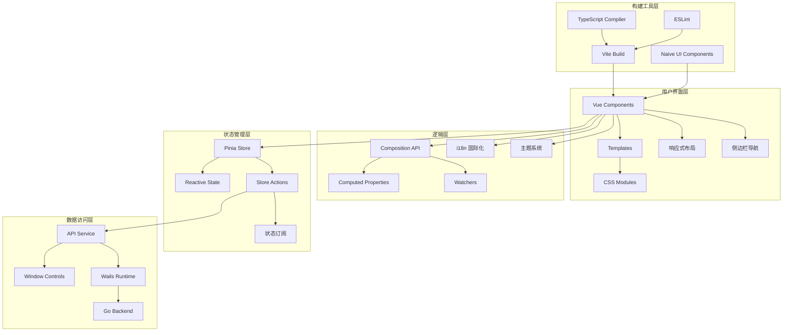

**图表来源**
- [main.ts:1-8](file://desktop/frontend/src/main.ts#L1-L8)
- [App.vue:145-270](file://desktop/frontend/src/App.vue#L145-L270)
- [StatusView.vue:320-543](file://desktop/frontend/src/views/StatusView.vue#L320-L543)
- [tunnel.ts:1-83](file://desktop/frontend/src/stores/tunnel.ts#L1-L83)
- [app.ts:1-49](file://desktop/frontend/src/api/app.ts#L1-L49)
- [window.ts:1-49](file://desktop/frontend/src/api/window.ts#L1-L49)

## 详细组件分析

### App 应用外壳组件深度解析

App.vue 作为应用的根组件，经过重构后采用了全新的布局架构，集成了侧边栏导航、标题栏控制和主题系统。

#### 布局架构分析

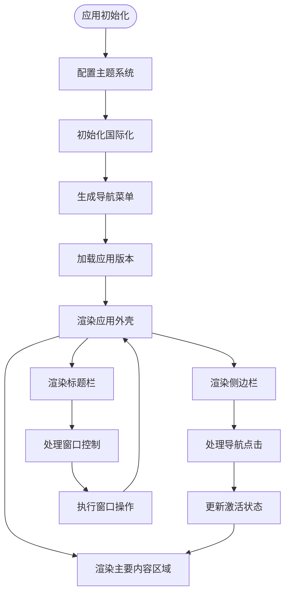

**图表来源**
- [App.vue:145-270](file://desktop/frontend/src/App.vue#L145-L270)
- [App.vue:219-248](file://desktop/frontend/src/App.vue#L219-L248)

#### 导航组件设计

重构后的导航系统采用侧边栏垂直布局，支持四个主要功能模块：

| 导航项 | 符号 | 标签 | 状态 | 功能描述 |
|--------|------|------|------|----------|
| overview | ⌂ | 概览 | active | 应用主面板 |
| tunnels | ⇄ | 隧道 | inactive | 隧道管理 |
| network | ◎ | 网络 | disabled | 网络监控（计划中） |
| settings | ⚙ | 设置 | disabled | 系统设置（计划中） |

#### 主题系统集成

应用集成了完整的主题系统，支持深色模式和自定义主题变量：

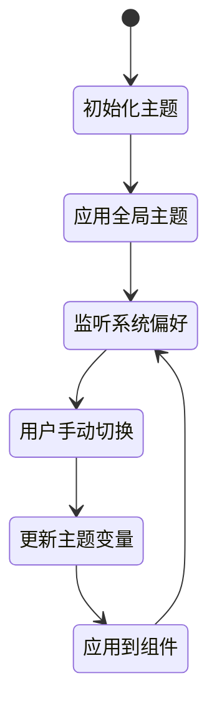

**图表来源**
- [App.vue:180-203](file://desktop/frontend/src/App.vue#L180-L203)
- [App.vue:257-269](file://desktop/frontend/src/App.vue#L257-L269)

**章节来源**
- [App.vue:1-556](file://desktop/frontend/src/App.vue#L1-L556)

### StatusView 组件深度解析

StatusView 是重构后应用的核心组件，负责展示隧道状态、流量统计信息以及提供隧道管理功能。经过重构后，采用了全新的网格布局和响应式设计。

#### 组件结构分析

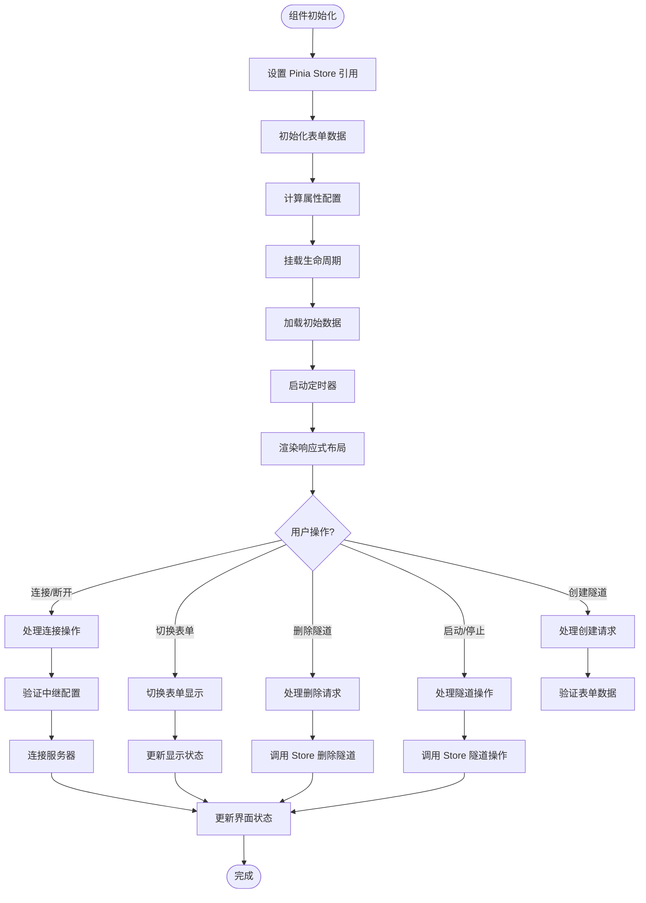

**图表来源**
- [StatusView.vue:320-543](file://desktop/frontend/src/views/StatusView.vue#L320-L543)
- [StatusView.vue:490-524](file://desktop/frontend/src/views/StatusView.vue#L490-L524)

#### 响应式布局设计

重构后的 StatusView 采用了三列网格布局，支持不同屏幕尺寸的自适应：

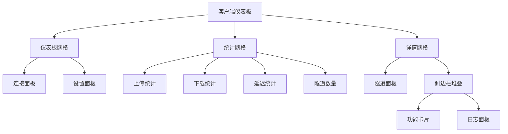

**图表来源**
- [StatusView.vue:545-556](file://desktop/frontend/src/views/StatusView.vue#L545-L556)
- [StatusView.vue:691-708](file://desktop/frontend/src/views/StatusView.vue#L691-L708)

#### Props 设计与使用

StatusView 组件采用无 Props 设计，通过 Pinia Store 进行状态管理：

| 属性名 | 类型 | 默认值 | 描述 |
|--------|------|--------|------|
| showForm | ref<boolean> | false | 控制隧道创建表单的显示状态 |
| relayForm | ref<object> | 中继服务器配置 | 包含服务器地址和认证令牌 |
| form | ref<object> | 预设表单数据 | 包含隧道创建所需的所有字段 |

#### 事件处理机制

组件实现了完整的 CRUD 操作事件处理，支持连接状态管理和隧道生命周期：

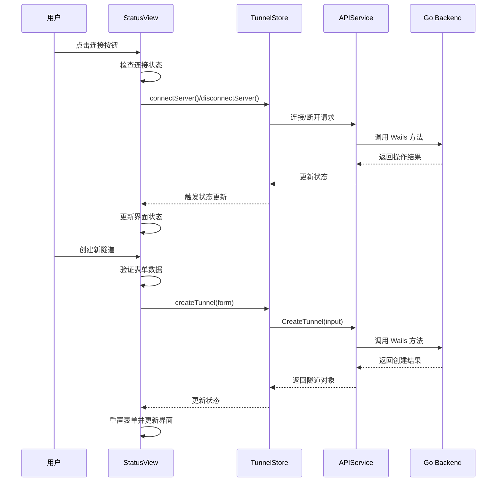

**图表来源**
- [StatusView.vue:490-524](file://desktop/frontend/src/views/StatusView.vue#L490-L524)
- [tunnel.ts:42-51](file://desktop/frontend/src/stores/tunnel.ts#L42-L51)
- [app.ts:34-36](file://desktop/frontend/src/api/app.ts#L34-L36)

#### 插槽使用策略

重构后的 StatusView 未使用插槽机制，但保留了扩展空间。建议在未来版本中添加插槽支持以增强组件的可定制性。

#### 生命周期管理

组件采用标准的 Vue 3 生命周期钩子，增加了定时器管理：

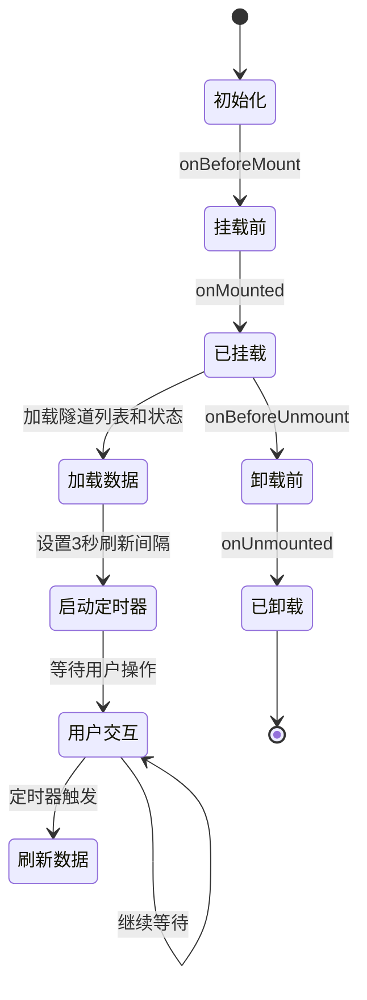

**图表来源**
- [StatusView.vue:534-542](file://desktop/frontend/src/views/StatusView.vue#L534-L542)

**章节来源**
- [StatusView.vue:1-872](file://desktop/frontend/src/views/StatusView.vue#L1-L872)

### TunnelStore 状态管理

TunnelStore 是重构后应用的核心状态管理模块，采用 Pinia 的组合式 API 设计，增加了更多状态属性和操作方法。

#### 状态结构

| 状态属性 | 类型 | 描述 |
|----------|------|------|
| tunnels | ref<Tunnel[]> | 隧道列表数组 |
| connectionStatus | ref<string> | 连接状态（connected/reconnecting/disconnected） |
| trafficStats | ref<object> | 流量统计信息（bytes_in, bytes_out, tunnels） |
| busyTunnelIds | ref<Set<string>> | 正在处理中的隧道ID集合 |
| lastError | ref<string> | 最后一次错误信息 |
| isConnected | ref<boolean> | 是否已连接到服务器 |
| isConnecting | ref<boolean> | 是否正在连接中 |
| serverAddr | ref<string> | 服务器地址 |
| authToken | ref<string> | 认证令牌 |
| p2pStatus | ref<string> | P2P功能状态 |
| natType | ref<string> | NAT类型信息 |

#### 计算属性设计

重构后的计算属性更加丰富，支持多种状态显示：

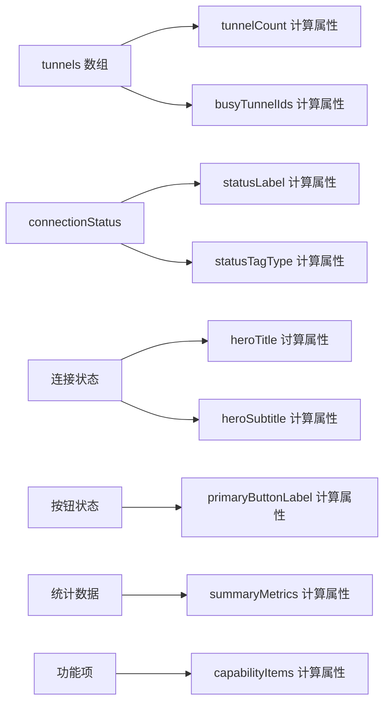

**图表来源**
- [tunnel.ts:32-82](file://desktop/frontend/src/stores/tunnel.ts#L32-L82)
- [StatusView.vue:377-413](file://desktop/frontend/src/views/StatusView.vue#L377-L413)

**章节来源**
- [tunnel.ts:1-83](file://desktop/frontend/src/stores/tunnel.ts#L1-L83)

### API 服务层

APIService 和 WindowAPI 提供了与底层 Go 后端的接口封装，支持窗口控制和隧道管理。

#### APIService 接口定义

| 函数名 | 参数 | 返回值 | 描述 |
|--------|------|--------|------|
| GetVersion | 无 | Promise<string> | 获取应用版本号 |
| GetTunnels | 无 | Promise<TunnelInfo[]> | 获取所有隧道信息 |
| CreateTunnel | CreateTunnelInput | Promise<TunnelInfo> | 创建新隧道 |
| DeleteTunnel | string | Promise<void> | 删除指定隧道 |
| GetConnectionStatus | 无 | Promise<string> | 获取连接状态 |
| GetTrafficStats | 无 | Promise<object> | 获取流量统计信息 |
| connectServer | RelayConfig | Promise<void> | 连接到中继服务器 |
| disconnectServer | 无 | Promise<void> | 断开服务器连接 |

#### WindowAPI 接口定义

| 函数名 | 参数 | 返回值 | 描述 |
|--------|------|--------|------|
| minimiseWindow | 无 | Promise<void> | 最小化窗口 |
| toggleMaximiseWindow | 无 | Promise<void> | 切换最大化状态 |
| closeWindow | 无 | Promise<void> | 关闭窗口 |

**章节来源**
- [app.ts:1-49](file://desktop/frontend/src/api/app.ts#L1-L49)
- [window.ts:1-49](file://desktop/frontend/src/api/window.ts#L1-L49)

## 依赖分析

### 外部依赖关系

重构后的项目集成了更多现代化的依赖包：

```mermaid
graph TB
subgraph "核心依赖"
Vue[Vue 3.5.13]
Pinia[Pinia 2.3.0]
NaiveUI[Naive UI 2.34.4]
TypeScript[TypeScript ~5.6.3]
end
subgraph "构建工具"
Vite[Vite 6.3.5]
VuePlugin[@vitejs/plugin-vue]
ESLint[ESLint 9.17.0]
end
subgraph "开发工具"
VueTSC[vue-tsc]
VueESLint[@vue/eslint-config-typescript]
VueESLintPlugin[eslint-plugin-vue]
end
subgraph "国际化"
VueI18n[vue-i18n 10.7.0]
end
App --> Vue
App --> Pinia
App --> NaiveUI
App --> TypeScript
App --> VueI18n
ViteConfig --> Vite
Vite --> VuePlugin
Vite --> VueTSC
Lint --> ESLint
Lint --> VueESLint
Lint --> VueESLintPlugin
```

**图表来源**
- [package.json:12-24](file://desktop/frontend/package.json#L12-L24)
- [vite.config.ts:1-15](file://desktop/frontend/vite.config.ts#L1-L15)

### 内部模块依赖

重构后的内部模块依赖关系更加清晰：

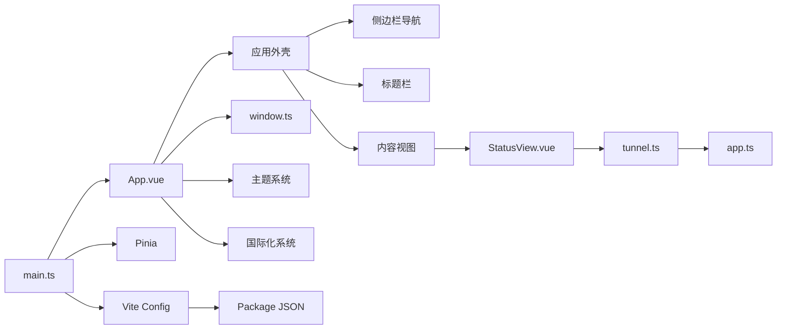

**图表来源**
- [main.ts:1-8](file://desktop/frontend/src/main.ts#L1-L8)
- [App.vue:145-270](file://desktop/frontend/src/App.vue#L145-L270)

**章节来源**
- [package.json:1-26](file://desktop/frontend/package.json#L1-L26)

## 性能考虑

### 响应式性能优化

重构后的组件系统在性能方面有显著改进：

1. **网格布局优化**: 使用 CSS Grid 替代 Flexbox，提高布局性能
2. **条件渲染**: 通过 `v-if` 和 `v-show` 控制元素渲染
3. **事件防抖**: 对频繁触发的操作进行防抖处理
4. **虚拟滚动**: 对大量数据项使用虚拟滚动技术
5. **懒加载**: 图片和复杂组件采用懒加载策略

### 内存管理

重构后的内存管理更加完善：

1. **生命周期清理**: 在 `onUnmounted` 中清理定时器和事件监听器
2. **状态释放**: 组件卸载时自动释放相关资源
3. **计算属性缓存**: 使用 `computed` 属性避免重复计算
4. **事件监听器清理**: 自动清理事件监听器防止内存泄漏

### 渲染优化

重构后的渲染优化策略：

1. **响应式设计**: 支持多种屏幕尺寸的自适应布局
2. **主题系统优化**: 使用 CSS 变量减少样式计算
3. **组件拆分**: 将大组件拆分为多个小组件
4. **状态分层**: 将状态按层级管理，避免不必要的重渲染

### 性能监控

新增的性能监控机制：

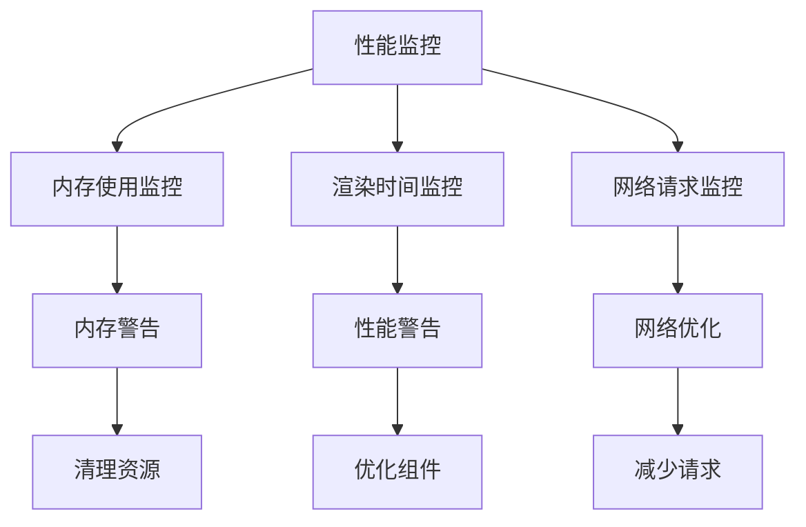

**章节来源**
- [StatusView.vue:534-542](file://desktop/frontend/src/views/StatusView.vue#L534-L542)
- [App.vue:180-203](file://desktop/frontend/src/App.vue#L180-L203)

## 故障排除指南

### 常见问题诊断

#### 导航组件无法渲染

**症状**: 侧边栏导航显示异常或按钮无响应

**可能原因**:
1. 导航项配置错误
2. 主题系统初始化失败
3. 国际化配置问题

**解决方案**:
1. 检查 navItems 数组配置
2. 验证 themeOverrides 设置
3. 确认 i18n 翻译键值

#### 响应式布局问题

**症状**: 组件在不同屏幕尺寸下显示异常

**可能原因**:
1. CSS Grid 布局配置错误
2. 媒体查询规则问题
3. 组件尺寸计算错误

**解决方案**:
1. 检查网格模板配置
2. 验证媒体查询断点
3. 确认组件尺寸单位

#### 状态不同步

**症状**: UI 显示的状态与实际状态不一致

**可能原因**:
1. 定时器未正确清理
2. 异步操作状态更新时机问题
3. Store 状态未正确响应

**解决方案**:
1. 确保在 `onUnmounted` 中清理定时器
2. 使用 `await` 确保异步操作完成
3. 检查 Store 的响应式更新

**章节来源**
- [App.vue:219-248](file://desktop/frontend/src/App.vue#L219-L248)
- [StatusView.vue:534-542](file://desktop/frontend/src/views/StatusView.vue#L534-L542)
- [tunnel.ts:63-70](file://desktop/frontend/src/stores/tunnel.ts#L63-L70)

## 结论

NexTunnel 重构后的组件系统展现了现代前端开发的最佳实践，通过全面的UI重构和架构优化，实现了更加现代化和高性能的应用程序。核心优势包括：

1. **全新的布局架构**: 采用侧边栏导航和响应式网格布局
2. **完整的主题系统**: 支持深色/浅色主题和自定义主题变量
3. **国际化支持**: 完整的多语言支持框架
4. **性能优化**: 响应式设计和性能监控机制
5. **状态管理增强**: 更丰富的状态属性和操作方法

重构后的系统在用户体验、开发效率和维护性方面都有显著提升。未来可以进一步优化的方向包括：
- 增加更多的插槽支持以增强组件可定制性
- 实现更完善的错误边界处理
- 增加组件单元测试覆盖率
- 考虑实现组件懒加载以提升首屏性能
- 优化主题系统的动态切换性能

## 附录

### 最佳实践清单

#### 组件设计
- 遵循单一职责原则
- 使用语义化的组件命名
- 保持组件的无状态设计
- 提供清晰的默认行为
- 支持响应式设计

#### 状态管理
- 将业务逻辑集中在 Store 中
- 使用计算属性处理派生状态
- 避免直接修改 Store 状态
- 实现状态持久化策略
- 支持状态分层管理

#### 主题系统
- 使用 CSS 变量管理主题
- 支持动态主题切换
- 提供主题继承机制
- 优化主题渲染性能

#### 国际化
- 使用 vue-i18n 进行国际化
- 支持动态语言切换
- 提供翻译键值管理
- 支持日期和数字格式化

#### 性能优化
- 使用响应式设计
- 实现性能监控
- 优化渲染性能
- 管理内存使用
- 减少不必要的重渲染

#### 测试策略
- 为关键组件编写单元测试
- 实现集成测试覆盖主要流程
- 使用模拟数据进行测试
- 建立持续集成流水线
- 实施性能回归测试